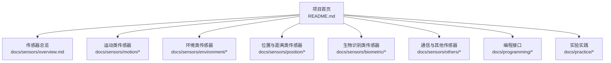
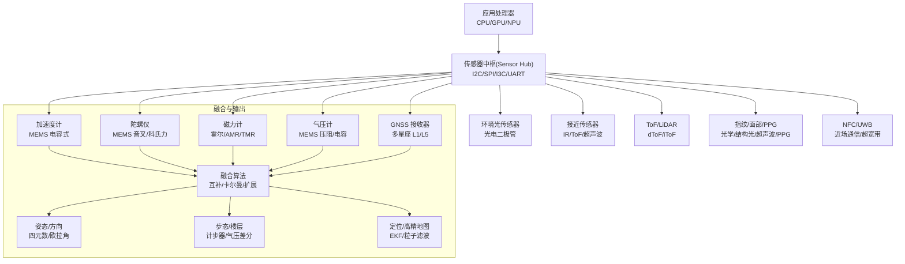
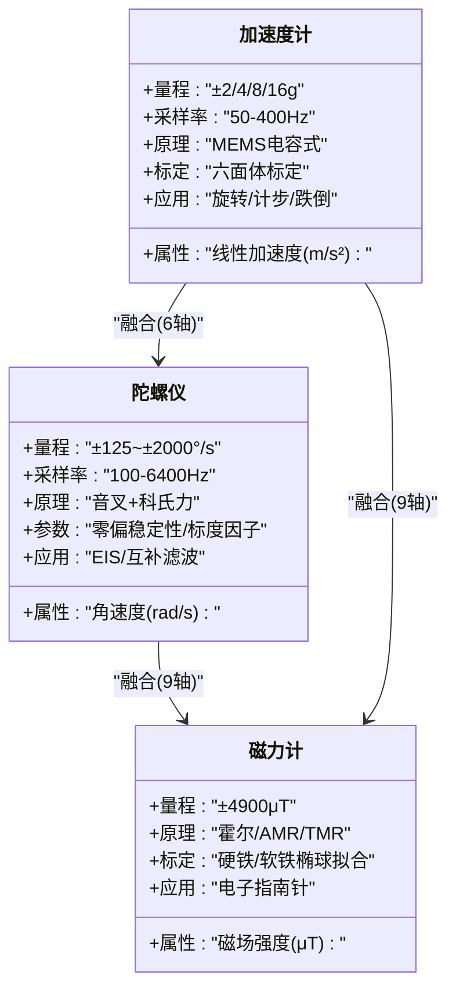
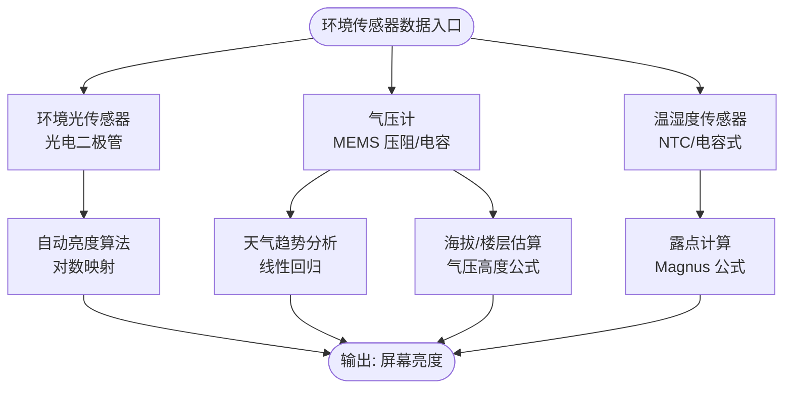
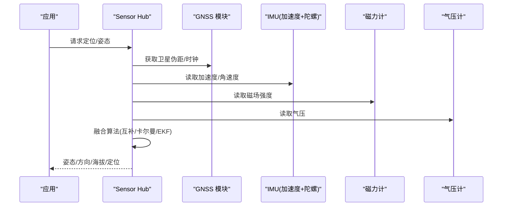
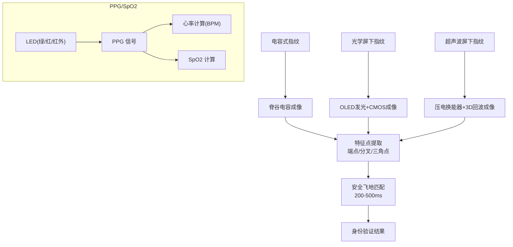
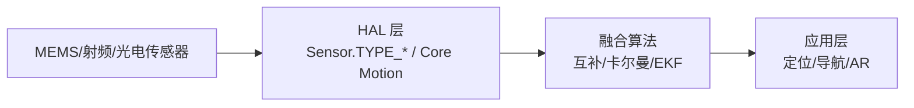

# 传感器技术基础

<cite>
**本文引用的文件**
- [README.md](file://README.md)
- [overview.md](file://docs/sensors/overview.md)
- [motion/index.md](file://docs/sensors/motion/index.md)
- [accelerometer.md](file://docs/sensors/motion/accelerometer.md)
- [gyroscope.md](file://docs/sensors/motion/gyroscope.md)
- [magnetometer.md](file://docs/sensors/motion/magnetometer.md)
- [environment/index.md](file://docs/sensors/environment/index.md)
- [barometer.md](file://docs/sensors/environment/barometer.md)
- [light.md](file://docs/sensors/environment/light.md)
- [temperature.md](file://docs/sensors/environment/temperature.md)
- [position/index.md](file://docs/sensors/position/index.md)
- [gnss.md](file://docs/sensors/position/gnss.md)
- [proximity.md](file://docs/sensors/position/proximity.md)
- [tof-lidar.md](file://docs/sensors/position/tof-lidar.md)
- [biometric/index.md](file://docs/sensors/biometric/index.md)
- [fingerprint.md](file://docs/sensors/biometric/fingerprint.md)
- [face.md](file://docs/sensors/biometric/face.md)
- [health.md](file://docs/sensors/biometric/health.md)
- [others/index.md](file://docs/sensors/others/index.md)
- [nfc.md](file://docs/sensors/others/nfc.md)
- [uwb.md](file://docs/sensors/others/uwb.md)
</cite>

## 目录
1. [引言](#引言)
2. [项目结构](#项目结构)
3. [核心组件](#核心组件)
4. [架构总览](#架构总览)
5. [详细组件分析](#详细组件分析)
6. [依赖分析](#依赖分析)
7. [性能考虑](#性能考虑)
8. [故障排查指南](#故障排查指南)
9. [结论](#结论)
10. [附录](#附录)

## 引言
本项目围绕智能手机内置传感器展开，系统性介绍从硬件原理到编程实践的知识体系，覆盖运动、环境、位置与距离、生物识别、通信与其他等类别。文档采用中文撰写，配合大量技术插图与实战示例，既适合初学者建立概念认知，也为有经验的开发者提供深入的技术细节与工程实践参考。

## 项目结构
项目采用 MkDocs + Material 主题，文档分为“传感器总览”、“各类传感器详解”、“编程接口”、“实验实践”四大板块。核心内容组织如下：
- 传感器总览：发展历史、分类体系、MEMS 技术基础、系统架构、传感器融合
- 传感器详解：运动（加速度计、陀螺仪、磁力计）、环境（气压计、光传感器、温湿度）、位置与距离（GNSS、接近、ToF/LiDAR）、生物识别（指纹、面部、心率/血氧）、通信与其他（NFC、UWB）
- 编程接口：Android 传感器 API、iOS Core Motion
- 实践：SensorLog 使用指南、Sensor Logger 使用指南、数据采集实验

**图表来源**
- [README.md:18-55](file://README.md#L18-L55)

**章节来源**
- [README.md:14-169](file://README.md#L14-L169)

## 核心组件
本节从系统视角梳理传感器的硬件实现与软件接口要点，强调 MEMS 技术、传感器通信接口、融合算法与平台 API。

- MEMS 技术基础
  - 可动质量块、弹性悬挂结构、检测电容/压阻、ASIC 信号链
  - 体微加工、表面微加工、键合等制造工艺
  - 主要供应商与代表性芯片（Bosch、ST、TDK、AKM）

- 传感器通信接口
  - I2C、SPI、I3C、UART 等接口速率与使用场景
  - 传感器中枢（Sensor Hub）统一管理

- 传感器融合
  - 9轴融合（加速度+陀螺+磁力）、6轴融合、线性加速度、步态检测、定位融合
  - Android 复合传感器（线性加速度、重力、旋转矢量、计步器等）

- 平台 API
  - Android：Sensor.TYPE_* 常量
  - iOS：Core Motion（CMAccelerometerData、CMGyroData、CMMagnetometerData、CMAltimeter、CLLocatiomManager 等）

**章节来源**
- [overview.md:64-146](file://docs/sensors/overview.md#L64-L146)
- [motion/index.md:1-50](file://docs/sensors/motion/index.md#L1-L50)
- [environment/index.md:1-27](file://docs/sensors/environment/index.md#L1-L27)
- [position/index.md:1-24](file://docs/sensors/position/index.md#L1-L24)
- [biometric/index.md:1-18](file://docs/sensors/biometric/index.md#L1-L18)
- [others/index.md:1-15](file://docs/sensors/others/index.md#L1-L15)

## 架构总览
下图展示从“应用处理器 → Sensor Hub → 各传感器”的系统架构，以及典型融合路径（IMU+磁力计+气压计）在定位与姿态估计中的作用。

**图表来源**
- [overview.md:98-146](file://docs/sensors/overview.md#L98-L146)

## 详细组件分析

### 运动传感器
运动传感器是实现姿态估计、运动追踪与导航定位的基础。三者合称“9轴 IMU”。

- 加速度计（MEMS 电容式）
  - 原理：质量块惯性位移 → 差分电容变化 → ASIC 信号链
  - 关键参数：量程、灵敏度、噪声密度、静态标定（六面体标定）
  - 应用：屏幕旋转、计步器、跌倒检测
  - 代码示例路径：[accelerometer.md:125-168](file://docs/sensors/motion/accelerometer.md#L125-L168)

- 陀螺仪（MEMS 音叉/科氏力）
  - 原理：驱动振动 + 科氏力感应 → 差分电容检测 → 解调输出
  - 关键参数：零偏稳定性、标度因子非线性
  - 应用：电子图像稳定（EIS）、互补滤波融合
  - 代码示例路径：[gyroscope.md:107-151](file://docs/sensors/motion/gyroscope.md#L107-L151)

- 磁力计（霍尔/AMR/TMR）
  - 原理：霍尔效应/磁阻效应 → 三维磁场测量
  - 地磁场知识：水平/垂直分量、磁倾角、磁偏角
  - 标定：硬铁/软铁干扰、椭球拟合、8 字标定
  - 代码示例路径：[magnetometer.md:102-125](file://docs/sensors/motion/magnetometer.md#L102-L125)

**图表来源**
- [accelerometer.md:1-177](file://docs/sensors/motion/accelerometer.md#L1-L177)
- [gyroscope.md:1-161](file://docs/sensors/motion/gyroscope.md#L1-L161)
- [magnetometer.md:1-166](file://docs/sensors/motion/magnetometer.md#L1-L166)

**章节来源**
- [motion/index.md:1-50](file://docs/sensors/motion/index.md#L1-L50)
- [accelerometer.md:1-177](file://docs/sensors/motion/accelerometer.md#L1-L177)
- [gyroscope.md:1-161](file://docs/sensors/motion/gyroscope.md#L1-L161)
- [magnetometer.md:1-166](file://docs/sensors/motion/magnetometer.md#L1-L166)

### 环境传感器
环境传感器用于感知光照、温度、湿度与气压，支撑自动亮度、健康监测与海拔估算。

- 气压计（MEMS 压阻/电容）
  - 原理：薄膜形变 → 压阻/电容变化 → 电桥/电容检测
  - 关键参数：绝对/相对精度、噪声、温度漂移（TCO）、气压高度公式
  - 应用：海拔估算、楼层检测、天气趋势分析、卡尔曼滤波平滑
  - 代码示例路径：[barometer.md:111-197](file://docs/sensors/environment/barometer.md#L111-L197)

- 环境光传感器（光电二极管）
  - 原理：可见光/红外/UV 多通道 → 跨阻放大 → ADC
  - 关键参数：动态范围、曝光值（EV）、对数映射
  - 应用：自动亮度、光照场景分类、日光曲线可视化
  - 代码示例路径：[light.md:109-179](file://docs/sensors/environment/light.md#L109-L179)

- 温湿度传感器
  - 温度：PN 结/NTC/PTC；湿度：电容式吸湿材料
  - 关键参数：精度/分辨率、热时间常数、自热效应
  - 应用：露点计算、热舒适度
  - 代码示例路径：[temperature.md:127-169](file://docs/sensors/environment/temperature.md#L127-L169)

**图表来源**
- [light.md:109-179](file://docs/sensors/environment/light.md#L109-L179)
- [barometer.md:111-197](file://docs/sensors/environment/barometer.md#L111-L197)
- [temperature.md:127-169](file://docs/sensors/environment/temperature.md#L127-L169)

**章节来源**
- [environment/index.md:1-27](file://docs/sensors/environment/index.md#L1-L27)
- [barometer.md:1-216](file://docs/sensors/environment/barometer.md#L1-L216)
- [light.md:1-187](file://docs/sensors/environment/light.md#L1-L187)
- [temperature.md:1-177](file://docs/sensors/environment/temperature.md#L1-L177)

### 位置与距离传感器
位置与距离传感器覆盖从米级 GNSS 到毫米级深度感知，满足导航、定位与场景理解需求。

- GNSS（多星座、双频、AGNSS）
  - 原理：伪距定位（三球交汇），双频消电离层，AGNSS 辅助
  - 误差来源：电离层/对流层延迟、多径、钟差/星历误差
  - 应用：定位解算（最小二乘）、NMEA GGA 解析、球面距离（Haversine）
  - 代码示例路径：[gnss.md:107-196](file://docs/sensors/position/gnss.md#L107-L196)

- 接近传感器（IR/ToF/超声波/电容）
  - 原理：红外反射、超声波回波、电容变化
  - 关键参数：检测距离、响应时间、串扰补偿
  - 应用：迟滞阈值检测、超声波测距
  - 代码示例路径：[proximity.md:98-141](file://docs/sensors/position/proximity.md#L98-L141)

- ToF 与 LiDAR（dToF/iToF、激光阵列）
  - 原理：光飞行时间，dToF（SPAD）抗干扰、iToF（相位差）结构简单
  - 关键参数：深度分辨率、帧率与功耗折衷、多径与相位缠绕
  - 应用：深度图模拟与可视化、障碍物检测
  - 代码示例路径：[tof-lidar.md:152-201](file://docs/sensors/position/tof-lidar.md#L152-L201)

**图表来源**
- [gnss.md:107-196](file://docs/sensors/position/gnss.md#L107-L196)
- [tof-lidar.md:152-201](file://docs/sensors/position/tof-lidar.md#L152-L201)

**章节来源**
- [position/index.md:1-24](file://docs/sensors/position/index.md#L1-L24)
- [gnss.md:1-206](file://docs/sensors/position/gnss.md#L1-L206)
- [proximity.md:1-149](file://docs/sensors/position/proximity.md#L1-L149)
- [tof-lidar.md:1-210](file://docs/sensors/position/tof-lidar.md#L1-L210)

### 生物识别传感器
生物识别传感器用于身份验证与健康监测，涵盖指纹、面部与心率/血氧。

- 指纹（电容/光学/超声波）
  - 三种技术对比：成像维度、湿手解锁、安全性、成本、识别面积
  - 关键参数：分辨率（≥500dpi）、FAR/FRR、匹配速度（200-500ms）
  - 特征提取：端点、分叉点、三角点
  - 代码示例路径：[fingerprint.md:159-226](file://docs/sensors/biometric/fingerprint.md#L159-L226)

- 面部识别（结构光/ToF/2D RGB）
  - Apple Face ID：TrueDepth 系统（泛光感应器、点阵投影器、红外相机）
  - 安全性：FAR < 1/1,000,000，活体检测（红外+注意力）
  - Android 方案：结构光/ToF/2D RGB
  - 代码示例路径：[face.md:128-183](file://docs/sensors/biometric/face.md#L128-L183)

- 心率/血氧（PPG/SpO2）
  - PPG 原理：绿光对血容量敏感；SpO2 利用红光/红外吸收差异
  - 信号处理：峰值检测、RR 间期、灌注指数（PI）
  - 代码示例路径：[health.md:149-206](file://docs/sensors/biometric/health.md#L149-L206)

**图表来源**
- [fingerprint.md:159-226](file://docs/sensors/biometric/fingerprint.md#L159-L226)
- [face.md:128-183](file://docs/sensors/biometric/face.md#L128-L183)
- [health.md:149-206](file://docs/sensors/biometric/health.md#L149-L206)

**章节来源**
- [biometric/index.md:1-18](file://docs/sensors/biometric/index.md#L1-L18)
- [fingerprint.md:1-234](file://docs/sensors/biometric/fingerprint.md#L1-L234)
- [face.md:1-191](file://docs/sensors/biometric/face.md#L1-L191)
- [health.md:1-215](file://docs/sensors/biometric/health.md#L1-L215)

### 通信与其他传感器
通信与其他传感器包括 NFC、UWB、霍尔传感器与红外发射器，服务于近距离通信与辅助功能。

- NFC（近场通信）
  - 技术：13.56 MHz，≤10 cm，电磁感应耦合
  - 应用：移动支付、门禁、数据交换

- UWB（超宽带）
  - 技术：6-8 GHz，≤200 m，脉冲测距
  - 应用：精确测距、空间感知、AirTag/AirDrop

- 霍尔传感器与红外发射器
  - 霍尔：翻盖检测、折叠屏
  - 红外：38 kHz 调制，家电遥控

**章节来源**
- [others/index.md:1-15](file://docs/sensors/others/index.md#L1-L15)
- [nfc.md](file://docs/sensors/others/nfc.md)
- [uwb.md](file://docs/sensors/others/uwb.md)

## 依赖分析
- 硬件层面
  - MEMS 传感器 → ASIC 信号链 → Sensor Hub → 应用处理器
  - 通信接口：I2C/SPI/I3C/UART，速率与功耗各异
- 软件层面
  - Android：Sensor.TYPE_* 常量封装底层硬件
  - iOS：Core Motion 提供统一 API（CMAccelerometerData、CMGyroData、CMMagnetometerData、CMAltimeter、CLLocationManager）
- 融合层面
  - 9轴/6轴融合算法（互补滤波、Madgwick、EKF）提升精度与鲁棒性

**图表来源**
- [overview.md:118-146](file://docs/sensors/overview.md#L118-L146)

**章节来源**
- [overview.md:107-146](file://docs/sensors/overview.md#L107-L146)

## 性能考虑
- 采样率与功耗
  - 运动传感器：加速度计 50-400 Hz，陀螺仪可达 6400 Hz；低功耗模式与动态采样策略
  - 环境传感器：光传感器 1-50 Hz，气压计 1-200 Hz；长积分时间提高精度但增加功耗
- 精度与噪声
  - 加速度计/陀螺仪：噪声密度、零偏稳定性决定长期稳定性
  - 气压计：相对精度主导楼层检测，绝对精度影响海拔估算
  - PPG：运动伪影是主要噪声源，需多波长补偿与加速度计参考
- 融合策略
  - 互补滤波：高频陀螺积分 + 低频加速度/磁力计校正
  - 卡尔曼滤波：建模系统动态与观测噪声，实时估计状态
- 环境影响
  - 温度漂移（TCO）、多径效应（GNSS）、IR 串扰（接近）、光照变化（ALS）

[本节为通用指导，无需列出具体文件来源]

## 故障排查指南
- 加速度计/陀螺仪标定
  - 六面体标定（加速度计）：确保六个面静置，拟合偏置与比例因子
  - 磁力计标定：8 字标定，椭球拟合消除硬铁/软铁干扰
  - 代码示例路径：[accelerometer.md:105-116](file://docs/sensors/motion/accelerometer.md#L105-L116)、[magnetometer.md:102-125](file://docs/sensors/motion/magnetometer.md#L102-L125)

- 气压计楼层检测
  - 检查相对精度与噪声，避免误判；必要时使用滤波平滑
  - 代码示例路径：[barometer.md:116-122](file://docs/sensors/environment/barometer.md#L116-L122)、[barometer.md:158-197](file://docs/sensors/environment/barometer.md#L158-L197)

- 接近传感器误触发
  - 检查阈值迟滞、串扰校准、环境光影响；优化 ADC 基线
  - 代码示例路径：[proximity.md:98-118](file://docs/sensors/position/proximity.md#L98-L118)、[proximity.md:122-141](file://docs/sensors/position/proximity.md#L122-L141)

- PPG/SpO2 信号质量
  - 提升灌注指数（PI），减少运动伪影；多波长自适应滤波
  - 代码示例路径：[health.md:149-206](file://docs/sensors/biometric/health.md#L149-L206)

**章节来源**
- [accelerometer.md:103-116](file://docs/sensors/motion/accelerometer.md#L103-L116)
- [magnetometer.md:82-125](file://docs/sensors/motion/magnetometer.md#L82-L125)
- [barometer.md:107-122](file://docs/sensors/environment/barometer.md#L107-L122)
- [proximity.md:84-118](file://docs/sensors/position/proximity.md#L84-L118)
- [health.md:130-206](file://docs/sensors/biometric/health.md#L130-L206)

## 结论
本项目以“原理—硬件—软件—实践”为主线，系统阐述了手机传感器的全栈知识。通过 MEMS 技术、多源融合与平台 API 的结合，开发者可在 Android/iOS 上高效实现从姿态估计、环境感知到生物识别与定位导航的多样化应用。建议在实际工程中重视标定、噪声抑制与融合策略，以获得更稳健的用户体验。

[本节为总结性内容，无需列出具体文件来源]

## 附录
- 平台 API 参考
  - Android 传感器 API：Sensor.TYPE_* 常量
  - iOS Core Motion：CMAccelerometerData、CMGyroData、CMMagnetometerData、CMAltimeter、CLLocationManager
- 实验与数据采集
  - SensorLog/Sensor Logger 使用指南、数据采集实验（计步器/指南针/气压楼层/手势识别）
- 在线资源
  - GitHub Pages 在线阅读、Colab Notebook 演示程序

**章节来源**
- [README.md:45-169](file://README.md#L45-L169)