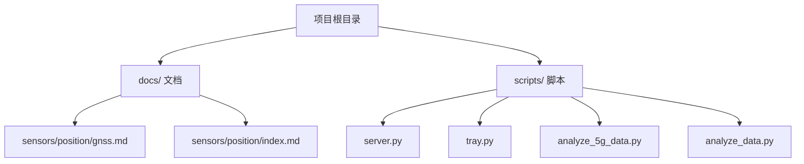
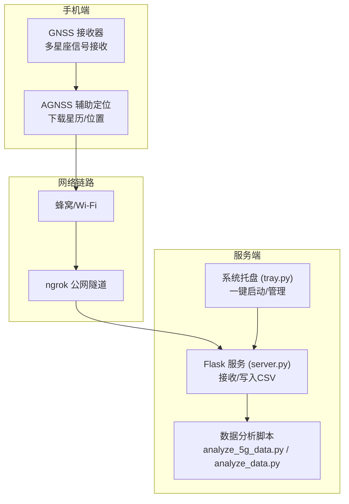
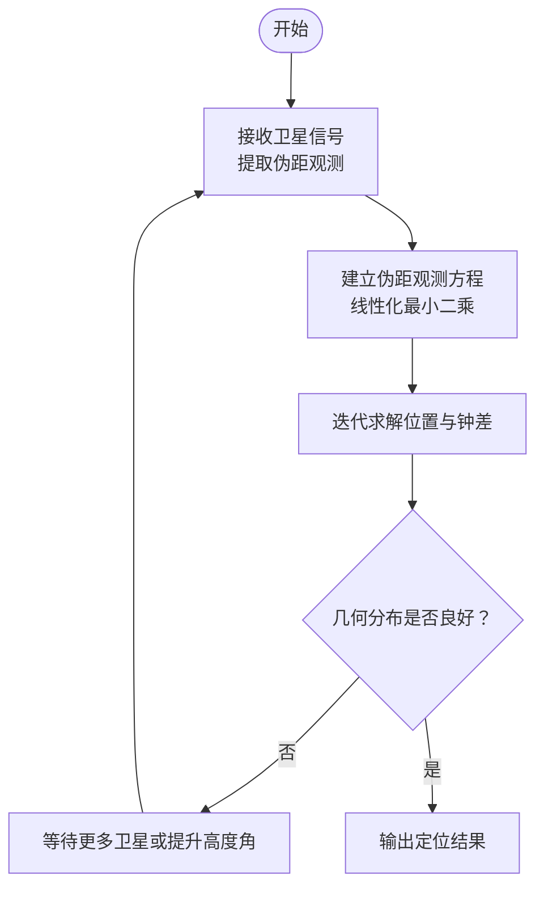
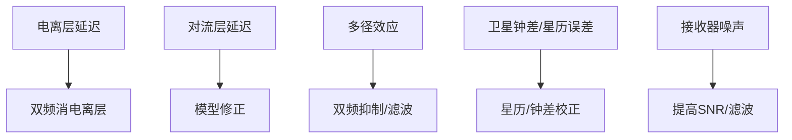
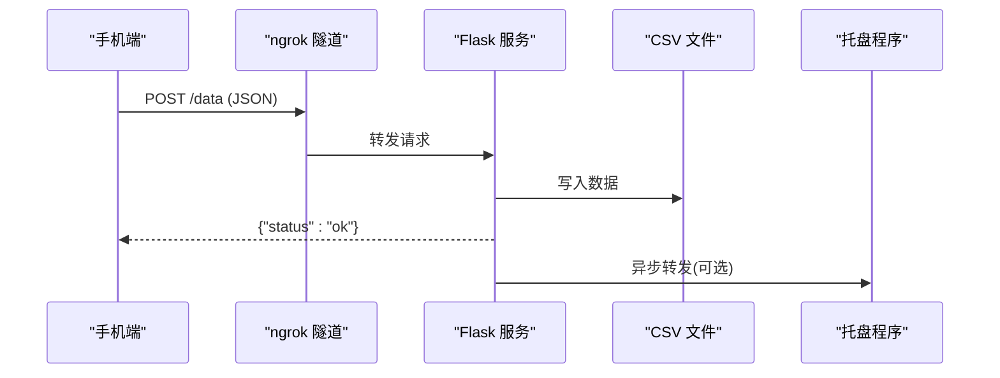
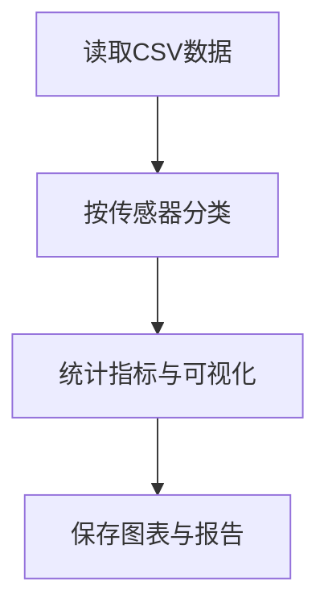
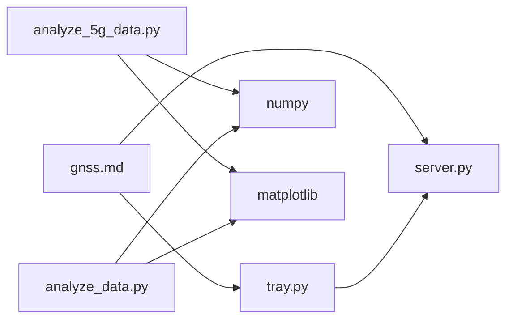

# GNSS全球导航卫星系统

<cite>
**本文引用的文件**
- [gnss.md](file://docs/sensors/position/gnss.md)
- [index.md](file://docs/sensors/position/index.md)
- [README.md](file://README.md)
- [server.py](file://scripts/server.py)
- [tray.py](file://scripts/tray.py)
- [analyze_5g_data.py](file://scripts/analyze_5g_data.py)
- [analyze_data.py](file://scripts/analyze_data.py)
</cite>

## 目录
1. [引言](#引言)
2. [项目结构](#项目结构)
3. [核心组件](#核心组件)
4. [架构总览](#架构总览)
5. [详细组件分析](#详细组件分析)
6. [依赖分析](#依赖分析)
7. [性能考虑](#性能考虑)
8. [故障排查指南](#故障排查指南)
9. [结论](#结论)
10. [附录](#附录)

## 引言
本文件围绕GNSS全球导航卫星系统，系统化阐述GPS、GLONASS、北斗、Galileo等多星座卫星导航的工作原理、信号特性与定位技术，并结合项目中的定位文档与数据采集脚本，给出工程化的实践路径与误差来源分析。读者可据此理解伪距定位、双频改正、辅助定位（AGNSS）、以及多传感器融合定位的要点与落地方法。

## 项目结构
本仓库以“文档即代码”（Docs-as-Code）方式组织，核心与GNSS相关内容集中在docs/sensors/position/gnss.md；同时提供数据采集与可视化脚本，便于将手机传感器数据（包括位置相关数据）进行远程采集、存储与分析。

图表来源
- [README.md:18-55](file://README.md#L18-L55)
- [gnss.md:1-206](file://docs/sensors/position/gnss.md#L1-L206)

章节来源
- [README.md:18-55](file://README.md#L18-L55)
- [gnss.md:1-206](file://docs/sensors/position/gnss.md#L1-L206)

## 核心组件
- GNSS定位原理与多星座支持：文档总结了GPS、GLONASS、Galileo、北斗、QZSS、NavIC等系统的频段与覆盖范围，并给出伪距定位基本公式与双频定位优势。
- 定位误差来源：电离层延迟、对流层延迟、多径效应、卫星钟差、星历误差、接收器噪声等。
- AGNSS辅助定位：通过蜂窝/Wi-Fi下载星历与大致位置，缩短首次定位时间（TTFF）。
- 数据采集与可视化：提供HTTP服务接收传感器数据、系统托盘一键启动服务与隧道、以及多传感器数据分析脚本，便于远程采集与验证定位数据质量。

章节来源
- [gnss.md:8-101](file://docs/sensors/position/gnss.md#L8-L101)
- [gnss.md:103-196](file://docs/sensors/position/gnss.md#L103-L196)
- [README.md:96-144](file://README.md#L96-L144)

## 架构总览
下图展示了GNSS定位在本项目的工程化落地：手机端通过GNSS接收器获取卫星信号，结合辅助定位（AGNSS）提升冷启速度；数据可通过本地或公网隧道传输到服务器，再进行持久化与可视化分析。

图表来源
- [gnss.md:66-73](file://docs/sensors/position/gnss.md#L66-L73)
- [server.py:1-94](file://scripts/server.py#L1-L94)
- [tray.py:1-276](file://scripts/tray.py#L1-L276)
- [analyze_5g_data.py:1-360](file://scripts/analyze_5g_data.py#L1-L360)
- [analyze_data.py:1-98](file://scripts/analyze_data.py#L1-L98)

## 详细组件分析

### 组件A：GNSS定位原理与信号特性
- 伪距定位：通过至少4颗卫星的信号传播时间计算伪距，建立线性化最小二乘模型求解位置与接收器钟差。
- 双频定位：L1+L5双频可实现电离层延迟的双频消差，显著提升城市峡谷等复杂环境下的定位稳定性与精度。
- 多星座融合：GPS、GLONASS、Galileo、北斗、QZSS、NavIC等系统协同，提升可见性与几何分布质量。
- AGNSS：通过网络下载星历与大致位置，缩短TTFF，改善冷启动性能。

图表来源
- [gnss.md:40-54](file://docs/sensors/position/gnss.md#L40-L54)
- [gnss.md:55-65](file://docs/sensors/position/gnss.md#L55-L65)

章节来源
- [gnss.md:38-65](file://docs/sensors/position/gnss.md#L38-L65)

### 组件B：误差来源与改正
- 电离层延迟：双频可有效消除，单频需模型修正。
- 对流层延迟：干/湿分量模型修正。
- 多径效应：双频抑制、天线设计与滤波策略。
- 卫星钟差/星历误差：通过精密星历与广播星历的组合使用降低。
- 接收器噪声：提高信噪比与滤波算法。

图表来源
- [gnss.md:87-97](file://docs/sensors/position/gnss.md#L87-L97)

章节来源
- [gnss.md:87-97](file://docs/sensors/position/gnss.md#L87-L97)

### 组件C：数据采集与可视化（HTTP服务）
- Flask服务负责接收来自手机端的JSON数据，按会话写入CSV文件，并可选转发到本地数字孪生托盘程序。
- 支持局域网与公网（ngrok）两种推送URL，便于远程采集。
- 提供系统托盘一键启动/停止服务与隧道，复制URL、打开仪表盘等功能。

图表来源
- [server.py:35-81](file://scripts/server.py#L35-L81)
- [tray.py:79-119](file://scripts/tray.py#L79-L119)

章节来源
- [server.py:1-94](file://scripts/server.py#L1-L94)
- [tray.py:1-276](file://scripts/tray.py#L1-L276)

### 组件D：数据分析与可视化
- analyze_5g_data.py：综合解析多传感器数据（含orientation），生成统计、时序图、FFT、分布直方图等，便于评估定位数据质量与融合效果。
- analyze_data.py：面向orientation数据的统计与可视化，辅助姿态与定位一致性分析。

图表来源
- [analyze_5g_data.py:39-170](file://scripts/analyze_5g_data.py#L39-L170)
- [analyze_data.py:32-98](file://scripts/analyze_data.py#L32-L98)

章节来源
- [analyze_5g_data.py:1-360](file://scripts/analyze_5g_data.py#L1-L360)
- [analyze_data.py:1-98](file://scripts/analyze_data.py#L1-L98)

## 依赖分析
- 文档依赖：GNSS定位文档依赖于多星座频段与误差模型的归纳；数据采集脚本依赖Flask、CSV、线程与外部ngrok进程。
- 脚本依赖：tray.py依赖server.py；analyze_5g_data.py/analyze_data.py依赖numpy、matplotlib等科学计算与绘图库。
- 外部依赖：ngrok.exe用于公网隧道；系统托盘依赖pystray、Pillow等GUI工具。

图表来源
- [gnss.md:1-206](file://docs/sensors/position/gnss.md#L1-L206)
- [server.py:11-18](file://scripts/server.py#L11-L18)
- [tray.py:5-9](file://scripts/tray.py#L5-L9)
- [analyze_5g_data.py:14-18](file://scripts/analyze_5g_data.py#L14-L18)
- [analyze_data.py:8-12](file://scripts/analyze_data.py#L8-L12)

章节来源
- [gnss.md:1-206](file://docs/sensors/position/gnss.md#L1-L206)
- [server.py:11-18](file://scripts/server.py#L11-L18)
- [tray.py:5-9](file://scripts/tray.py#L5-L9)
- [analyze_5g_data.py:14-18](file://scripts/analyze_5g_data.py#L14-L18)
- [analyze_data.py:8-12](file://scripts/analyze_data.py#L8-L12)

## 性能考虑
- 定位精度：单频L1约1-5 m，双频L1+L5可降至0.3-1 m；RTK可进一步提升至分米级甚至更高。
- 几何分布：GDOP越小，定位精度越高；多星座融合可显著改善GDOP。
- 误差控制：优先采用双频消除电离层延迟；结合对流层模型与多径抑制策略；使用精密星历与AGNSS辅助缩短TTFF。
- 数据采集：合理设置ngrok隧道与本地服务端口，确保数据稳定上传与可视化展示。

## 故障排查指南
- 无法接收数据：确认ngrok已就绪并显示公网URL；检查防火墙与端口占用；使用tray.py复制Push URL并验证连通性。
- 服务启动失败：查看tray.py提示信息，确认端口占用与依赖安装；检查Flask服务日志输出。
- 数据为空或异常：核对手机端Sensor Logger配置与网络环境；检查CSV写入权限与路径；使用数据分析脚本验证数据完整性。
- 图表生成失败：确认matplotlib后端与字体可用；检查依赖库版本兼容性。

章节来源
- [tray.py:79-119](file://scripts/tray.py#L79-L119)
- [server.py:35-81](file://scripts/server.py#L35-L81)
- [analyze_5g_data.py:33-35](file://scripts/analyze_5g_data.py#L33-L35)
- [analyze_data.py:26-28](file://scripts/analyze_data.py#L26-L28)

## 结论
本项目以文档与脚本相结合的方式，系统呈现了GNSS定位的原理、误差来源与工程化实践路径。通过多星座融合、双频改正与AGNSS辅助，可在复杂环境中获得稳定且高精度的定位结果；配合数据采集与可视化流程，可有效评估定位质量并指导后续优化。

## 附录
- 多星座与频段速览：GPS（L1/L5）、GLONASS（L1/L2）、Galileo（E1/E5a/E5b）、北斗（B1I/B1C/B2a）、QZSS（L1/L5）、NavIC（L5/S）。
- 定位技术对比：单频（1-5 m）、双频（0.3-1 m）、RTK（分米级及以上）。
- 误差来源清单：电离层延迟（2-10 m）、对流层延迟（0.5-2 m）、多径效应（1-50 m）、卫星钟差（0.1-1 m）、星历误差（0.1-1 m）、接收器噪声（0.1-1 m）。

章节来源
- [gnss.md:23-35](file://docs/sensors/position/gnss.md#L23-L35)
- [gnss.md:55-65](file://docs/sensors/position/gnss.md#L55-L65)
- [gnss.md:87-97](file://docs/sensors/position/gnss.md#L87-L97)