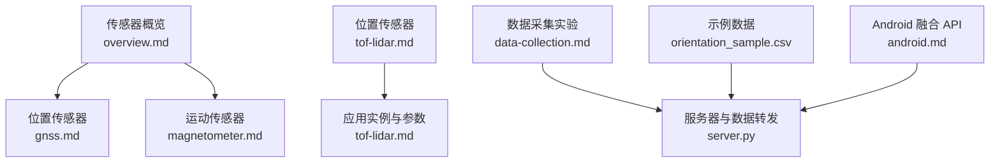
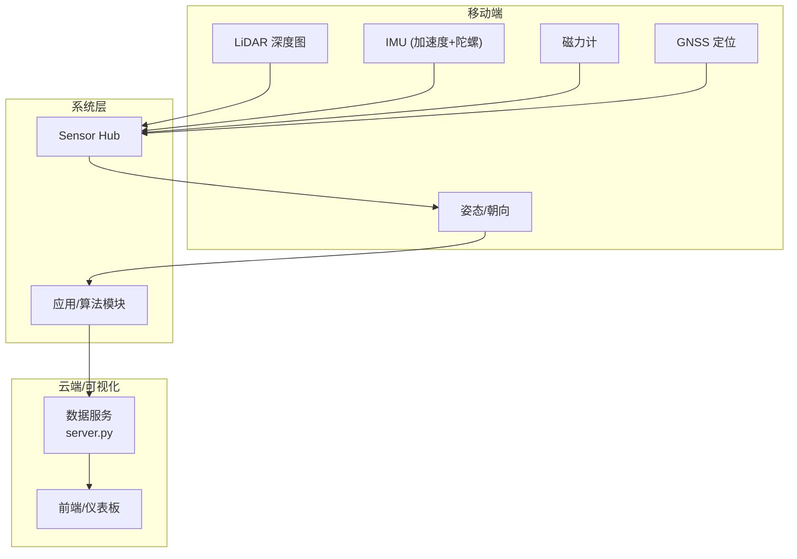
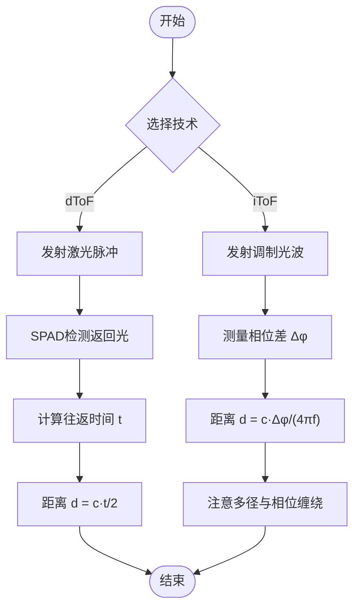
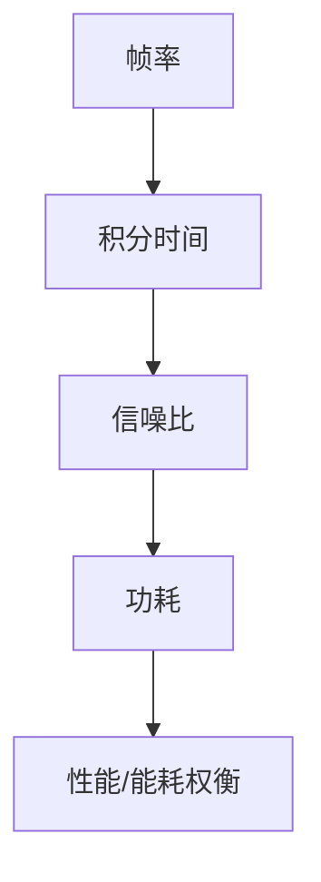
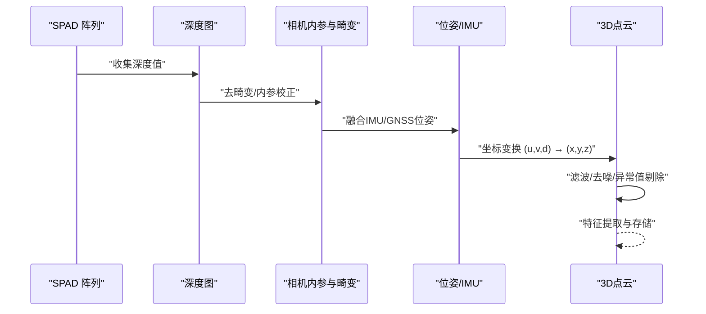
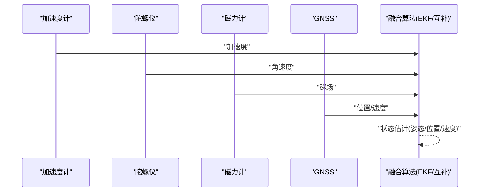
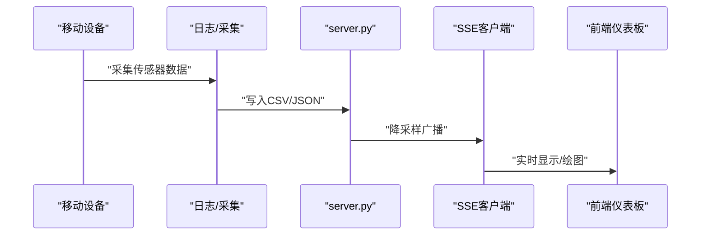
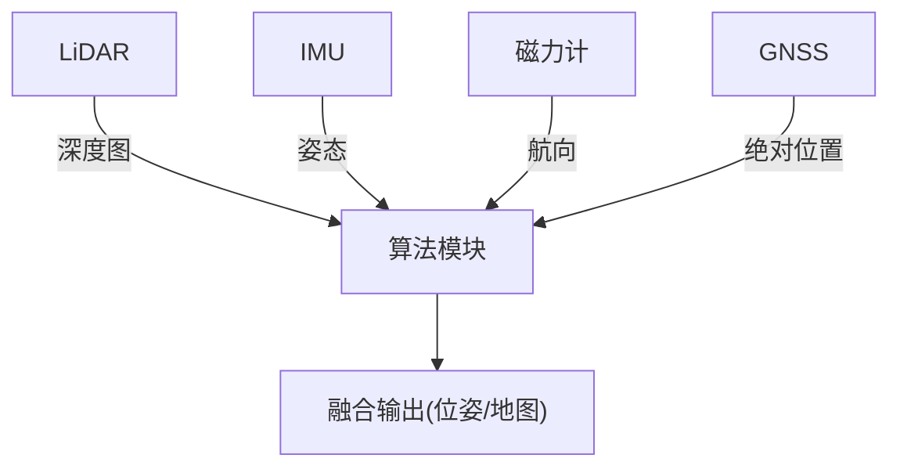

# LiDAR激光雷达

<cite>
**本文引用的文件**
- [tof-lidar.md](file://docs/sensors/position/tof-lidar.md)
- [overview.md](file://docs/sensors/overview.md)
- [gnss.md](file://docs/sensors/position/gnss.md)
- [magnetometer.md](file://docs/sensors/motion/magnetometer.md)
- [data-collection.md](file://docs/practice/data-collection.md)
- [server.py](file://scripts/server.py)
- [orientation_sample.csv](file://scripts/sample_data/orientation_sample.csv)
- [android.md](file://docs/programming/android.md)
</cite>

## 目录
1. [简介](#简介)
2. [项目结构](#项目结构)
3. [核心组件](#核心组件)
4. [架构总览](#架构总览)
5. [详细组件分析](#详细组件分析)
6. [依赖关系分析](#依赖关系分析)
7. [性能考量](#性能考量)
8. [故障排查指南](#故障排查指南)
9. [结论](#结论)
10. [附录](#附录)

## 简介
本文件围绕LiDAR激光雷达展开，重点阐述dToF（直接飞行时间）技术原理、LiDAR扫描机制与硬件组成、关键性能指标（分辨率、探测距离、角度精度、刷新率），以及从深度图到3D点云的生成流程、滤波去噪与特征提取思路，并给出与IMU/GNSS等传感器融合的定位方案与系统集成方法。内容基于仓库中现有文档与示例脚本整理，力求兼顾技术深度与可操作性。

## 项目结构
本仓库以文档为主，涵盖传感器概览、位置与运动传感器、编程实践等内容；与LiDAR相关的核心知识主要集中在“位置”类文档与“传感器概览”中，配合数据采集与融合实践文档，形成从原理到应用的完整知识链路。

图表来源
- [overview.md:1-146](file://docs/sensors/overview.md#L1-L146)
- [gnss.md:1-206](file://docs/sensors/position/gnss.md#L1-L206)
- [magnetometer.md:1-166](file://docs/sensors/motion/magnetometer.md#L1-L166)
- [tof-lidar.md:1-210](file://docs/sensors/position/tof-lidar.md#L1-L210)
- [data-collection.md:1-192](file://docs/practice/data-collection.md#L1-L192)
- [server.py:63-92](file://scripts/server.py#L63-L92)
- [orientation_sample.csv:1-6](file://scripts/sample_data/orientation_sample.csv#L1-L6)
- [android.md:212-250](file://docs/programming/android.md#L212-L250)

章节来源
- [overview.md:1-146](file://docs/sensors/overview.md#L1-L146)
- [tof-lidar.md:1-210](file://docs/sensors/position/tof-lidar.md#L1-L210)

## 核心组件
- dToF与iToF工作原理：明确dToF（SPAD检测器）与iToF（相位差测量）的差异与优劣，以及多径与相位缠绕问题。
- LiDAR硬件结构：VCSEL激光阵列、DOE衍射光学元件、SPAD探测器阵列的协同作用。
- 关键性能指标：量程、精度、空间分辨率、帧率与功耗的关系。
- 应用实例：深度图模拟与可视化、障碍物检测等Python示例。
- 传感器融合：与IMU、磁力计、GNSS等的融合定位方案与API使用。

章节来源
- [tof-lidar.md:8-145](file://docs/sensors/position/tof-lidar.md#L8-L145)
- [tof-lidar.md:148-210](file://docs/sensors/position/tof-lidar.md#L148-L210)

## 架构总览
LiDAR作为深度传感器，常与IMU、磁力计、GNSS等传感器共同构成移动平台的定位与感知系统。下图展示从传感器数据采集到融合输出的关键路径。

图表来源
- [overview.md:98-131](file://docs/sensors/overview.md#L98-L131)
- [gnss.md:1-206](file://docs/sensors/position/gnss.md#L1-L206)
- [magnetometer.md:1-166](file://docs/sensors/motion/magnetometer.md#L1-L166)
- [server.py:63-92](file://scripts/server.py#L63-L92)

## 详细组件分析

### dToF与iToF工作原理
- dToF（Direct ToF）：直接测量光脉冲往返时间，使用SPAD检测器，抗环境光干扰强，适用于LiDAR。
- iToF（Indirect ToF）：测量调制光的相位差，结构简单但易受多径与相位缠绕影响，常见于早期手机深度相机。

图表来源
- [tof-lidar.md:21-53](file://docs/sensors/position/tof-lidar.md#L21-L53)

章节来源
- [tof-lidar.md:21-53](file://docs/sensors/position/tof-lidar.md#L21-L53)

### LiDAR硬件结构与扫描机制
- VCSEL激光阵列：发射940nm近红外激光脉冲。
- DOE（衍射光学元件）：将激光分成数千个点，覆盖视场。
- SPAD探测器阵列：记录每个点的返回时间，形成面阵深度图。

图表来源
- [tof-lidar.md:78-90](file://docs/sensors/position/tof-lidar.md#L78-L90)

章节来源
- [tof-lidar.md:78-90](file://docs/sensors/position/tof-lidar.md#L78-L90)

### 关键性能指标
- 量程与精度：典型0-5m，精度~1%（约mm级）。
- 空间分辨率：数万点/帧，远高于iToF相机。
- 帧率与功耗：帧率越高，积分时间越短，功耗越大，需平衡实时性与能耗。

图表来源
- [tof-lidar.md:114-137](file://docs/sensors/position/tof-lidar.md#L114-L137)

章节来源
- [tof-lidar.md:114-137](file://docs/sensors/position/tof-lidar.md#L114-L137)

### 从深度图到3D点云
- 深度图生成：SPAD阵列记录每个像素的往返时间，换算为深度值。
- 3D点云生成：结合相机内参与LiDAR位姿，将像素(u,v,d)转换为(x,y,z)世界坐标。
- 滤波去噪：对深度图进行中值滤波、形态学滤波、统计异常值剔除等。
- 特征提取：边缘、平面、角点等几何特征，用于后续匹配与建图。

图表来源
- [tof-lidar.md:150-201](file://docs/sensors/position/tof-lidar.md#L150-L201)
- [overview.md:98-131](file://docs/sensors/overview.md#L98-L131)

章节来源
- [tof-lidar.md:150-201](file://docs/sensors/position/tof-lidar.md#L150-L201)

### 传感器融合与定位方案
- 与IMU融合：互补滤波、EKF等，提升姿态稳定性与动态响应。
- 与磁力计融合：消除磁干扰，提高航向精度。
- 与GNSS融合：在开阔环境下提供绝对位置，抑制IMU漂移。
- Android虚拟传感器：利用系统提供的复合传感器（如旋转矢量、线性加速度）简化开发。

图表来源
- [overview.md:118-131](file://docs/sensors/overview.md#L118-L131)
- [magnetometer.md:18-46](file://docs/sensors/motion/magnetometer.md#L18-L46)
- [gnss.md:38-65](file://docs/sensors/position/gnss.md#L38-L65)
- [android.md:212-247](file://docs/programming/android.md#L212-L247)

章节来源
- [overview.md:118-131](file://docs/sensors/overview.md#L118-L131)
- [magnetometer.md:18-46](file://docs/sensors/motion/magnetometer.md#L18-L46)
- [gnss.md:38-65](file://docs/sensors/position/gnss.md#L38-L65)
- [android.md:212-247](file://docs/programming/android.md#L212-L247)

### 系统集成与数据流转
- 数据采集：通过SensorLogger/Logger等工具采集LiDAR、IMU、磁力计、GNSS等数据。
- 服务端转发：将原始数据按统一格式写入CSV，再通过HTTP/SSE广播至前端。
- 实时可视化：浏览器端接收降采样后的数据，绘制轨迹、姿态、深度图等。

图表来源
- [data-collection.md:1-192](file://docs/practice/data-collection.md#L1-L192)
- [server.py:63-92](file://scripts/server.py#L63-L92)
- [orientation_sample.csv:1-6](file://scripts/sample_data/orientation_sample.csv#L1-L6)

章节来源
- [data-collection.md:1-192](file://docs/practice/data-collection.md#L1-L192)
- [server.py:63-92](file://scripts/server.py#L63-L92)
- [orientation_sample.csv:1-6](file://scripts/sample_data/orientation_sample.csv#L1-L6)

## 依赖关系分析
- LiDAR依赖SPAD检测器与DOE光学系统，对环境光与温度敏感，需配合软件滤波与校准。
- IMU与磁力计依赖良好的标定与滤波，避免磁干扰与高频噪声。
- GNSS在城市峡谷中易受多径影响，需与IMU/GNSS融合提升鲁棒性。
- 系统层通过Sensor Hub与应用层API（Android复合传感器）实现高效融合。

图表来源
- [overview.md:98-131](file://docs/sensors/overview.md#L98-L131)
- [gnss.md:38-65](file://docs/sensors/position/gnss.md#L38-L65)
- [magnetometer.md:18-46](file://docs/sensors/motion/magnetometer.md#L18-L46)

章节来源
- [overview.md:98-131](file://docs/sensors/overview.md#L98-L131)
- [gnss.md:38-65](file://docs/sensors/position/gnss.md#L38-L65)
- [magnetometer.md:18-46](file://docs/sensors/motion/magnetometer.md#L18-L46)

## 性能考量
- 帧率与功耗：高帧率带来更佳实时性，但需增加激光功率与缩短积分时间，导致功耗上升。
- 环境适应：LiDAR在强光下抗干扰能力优于iToF；室内/室外切换时需考虑温度与湿度对器件的影响。
- 点云密度与质量：通过滤波与异常值剔除提升点云质量，减少后续匹配与建图的误匹配。
- 融合策略：在GNSS可用时优先使用绝对约束，在GNSS不可用时依赖IMU/GNSS融合与回环检测。

## 故障排查指南
- LiDAR数据异常
  - 症状：深度图出现大面积无效或异常高/低值。
  - 排查：检查是否开启滤波、是否存在强光直射、温度是否超出工作范围。
  - 参考：深度图模拟与可视化示例可用于验证滤波效果。
  
  章节来源
  - [tof-lidar.md:150-201](file://docs/sensors/position/tof-lidar.md#L150-L201)

- 姿态/航向不稳
  - 症状：旋转矢量/欧拉角抖动明显。
  - 排查：确认IMU与磁力计标定是否完成，是否存在强磁干扰；必要时启用低通滤波。
  - 参考：Android复合传感器API与姿态计算示例。

  章节来源
  - [android.md:212-247](file://docs/programming/android.md#L212-L247)
  - [magnetometer.md:18-46](file://docs/sensors/motion/magnetometer.md#L18-L46)

- 定位漂移严重
  - 症状：长时间运行后位置漂移显著。
  - 排查：检查GNSS信号强度与可见卫星数；评估IMU/GNSS融合参数；尝试回环检测与重定位。
  - 参考：GNSS伪距定位与误差来源分析。

  章节来源
  - [gnss.md:38-65](file://docs/sensors/position/gnss.md#L38-L65)

- 数据传输与可视化
  - 症状：浏览器端数据延迟或丢失。
  - 排查：确认SSE广播配置、降采样参数、网络连通性；检查服务端日志输出。

  章节来源
  - [server.py:63-92](file://scripts/server.py#L63-L92)
  - [orientation_sample.csv:1-6](file://scripts/sample_data/orientation_sample.csv#L1-L6)

## 结论
LiDAR凭借dToF技术在消费级设备中实现了高精度、高密度的深度感知，是AR/3D重建与机器人导航的重要基础。结合IMU/GNSS等多传感器融合，可在复杂环境中获得稳定可靠的定位与建图能力。通过合理的滤波与特征提取策略，可进一步提升点云质量与下游任务性能。建议在工程实践中重视标定、滤波与系统集成，以获得最佳的用户体验与系统稳定性。

## 附录
- 示例与参考
  - ToF深度图模拟与可视化：[tof-lidar.md:150-201](file://docs/sensors/position/tof-lidar.md#L150-L201)
  - Android传感器融合API：[android.md:212-247](file://docs/programming/android.md#L212-L247)
  - GNSS定位原理与误差来源：[gnss.md:38-65](file://docs/sensors/position/gnss.md#L38-L65)
  - 传感器系统架构与融合：[overview.md:98-131](file://docs/sensors/overview.md#L98-L131)