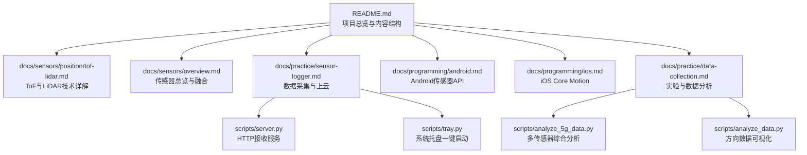
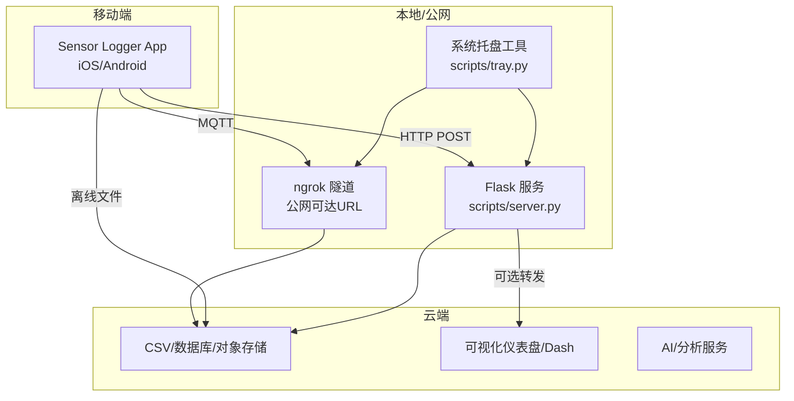
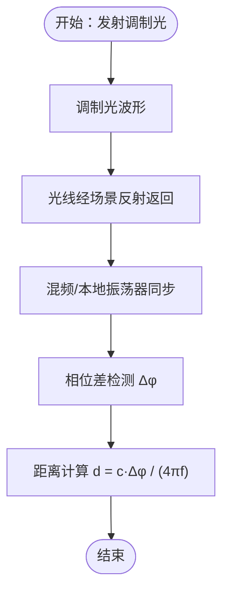
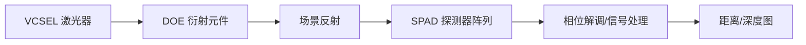
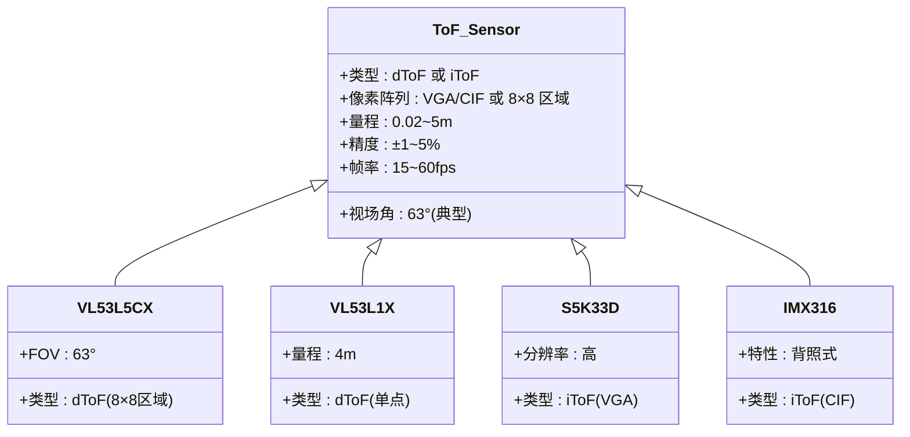
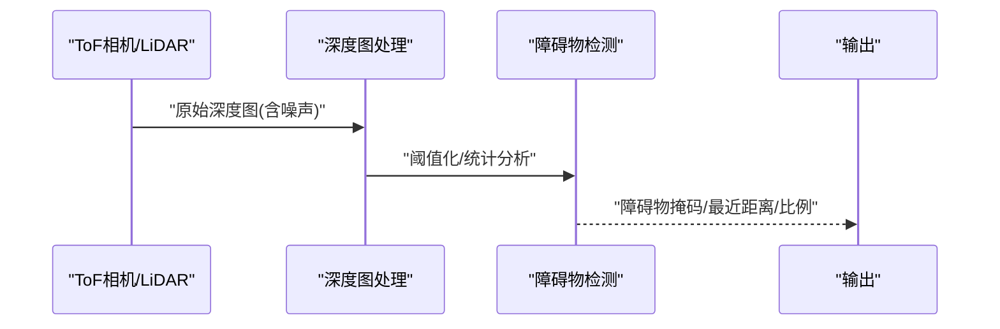
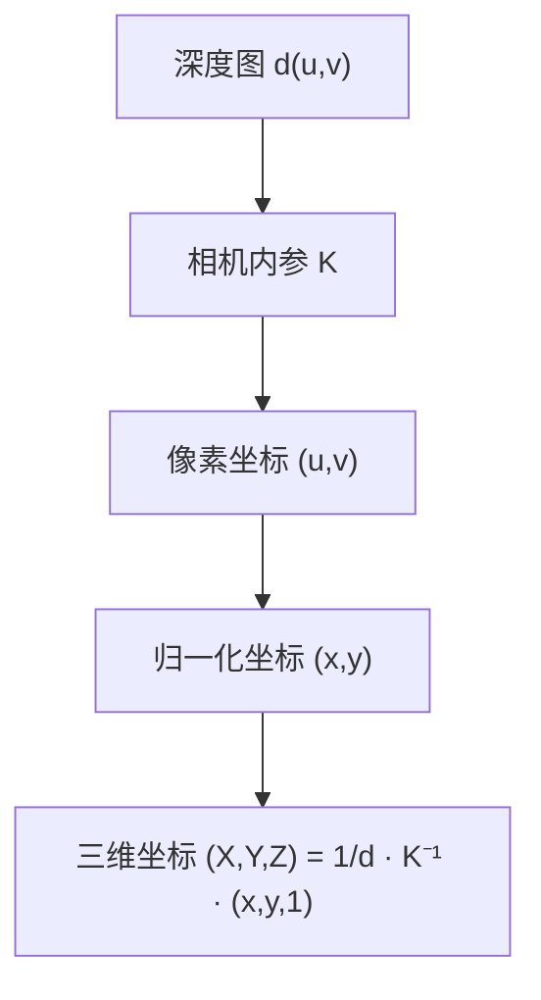
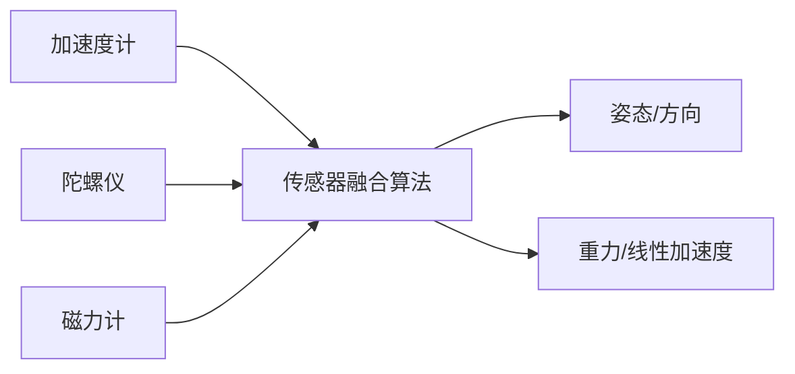
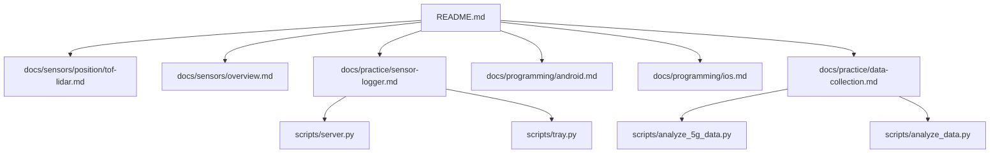

# ToF飞行时间传感器

<cite>
**本文引用的文件**
- [README.md](file://README.md)
- [tof-lidar.md](file://docs/sensors/position/tof-lidar.md)
- [overview.md](file://docs/sensors/overview.md)
- [sensor-logger.md](file://docs/practice/sensor-logger.md)
- [server.py](file://scripts/server.py)
- [tray.py](file://scripts/tray.py)
- [android.md](file://docs/programming/android.md)
- [ios.md](file://docs/programming/ios.md)
- [data-collection.md](file://docs/practice/data-collection.md)
- [analyze_5g_data.py](file://scripts/analyze_5g_data.py)
- [analyze_data.py](file://scripts/analyze_data.py)
</cite>

## 目录
1. [引言](#引言)
2. [项目结构](#项目结构)
3. [核心组件](#核心组件)
4. [架构总览](#架构总览)
5. [详细组件分析](#详细组件分析)
6. [依赖关系分析](#依赖关系分析)
7. [性能考虑](#性能考虑)
8. [故障排查指南](#故障排查指南)
9. [结论](#结论)
10. [附录](#附录)

## 引言
本文件围绕飞行时间（ToF）与LiDAR深度感知技术，结合项目中的文档与实践脚本，系统阐述：
- ToF的两类实现：直接飞行时间（dToF）与间接飞行时间（iToF），以及相位差检测原理
- 调制光源选择、信号调制与解调过程
- 像素级ToF传感器的阵列结构、像素尺寸与视场角参数
- 深度图生成算法、点云数据获取与三维坐标计算
- 室内导航、障碍物检测、手势识别等应用场景的实现思路
- 多传感器融合的深度估计方法与精度优化技术

## 项目结构
该项目以“文档即代码”（Docs-as-Code）方式组织，核心与ToF相关的内容集中在传感器章节与实践指南中，并配套数据采集与分析脚本。

图表来源
- [README.md:18-55](file://README.md#L18-L55)
- [tof-lidar.md:1-210](file://docs/sensors/position/tof-lidar.md#L1-L210)
- [sensor-logger.md:1-468](file://docs/practice/sensor-logger.md#L1-L468)
- [server.py:1-94](file://scripts/server.py#L1-L94)
- [tray.py:1-276](file://scripts/tray.py#L1-L276)
- [android.md:1-290](file://docs/programming/android.md#L1-L290)
- [ios.md:1-334](file://docs/programming/ios.md#L1-L334)
- [data-collection.md:1-192](file://docs/practice/data-collection.md#L1-L192)
- [analyze_5g_data.py:1-360](file://scripts/analyze_5g_data.py#L1-L360)
- [analyze_data.py:1-98](file://scripts/analyze_data.py#L1-L98)

章节来源
- [README.md:18-55](file://README.md#L18-L55)

## 核心组件
- ToF技术原理与芯片参数：dToF（SPAD）与iToF（相位差）的工作机制、典型芯片与参数（量程、精度、帧率）
- LiDAR硬件结构：VCSEL激光阵列、DOE衍射光学元件、SPAD探测器阵列
- 深度图与点云生成：基于深度图的障碍物检测、阈值策略与统计指标
- 多传感器融合：9轴融合、复合传感器（旋转矢量、线性加速度、重力）等
- 数据采集与上云：Sensor Logger的HTTP推送、MQTT订阅、离线上传；配套Flask服务与系统托盘工具
- 编程接口：Android SensorManager与iOS Core Motion的传感器访问与生命周期管理

章节来源
- [tof-lidar.md:8-210](file://docs/sensors/position/tof-lidar.md#L8-L210)
- [overview.md:118-146](file://docs/sensors/overview.md#L118-L146)
- [sensor-logger.md:24-468](file://docs/practice/sensor-logger.md#L24-L468)
- [server.py:11-94](file://scripts/server.py#L11-L94)
- [tray.py:18-276](file://scripts/tray.py#L18-L276)
- [android.md:10-290](file://docs/programming/android.md#L10-L290)
- [ios.md:8-334](file://docs/programming/ios.md#L8-L334)
- [data-collection.md:1-192](file://docs/practice/data-collection.md#L1-L192)

## 架构总览
下图展示从移动端到云端的数据链路与处理流程，重点体现Sensor Logger的三种上云路径与数据落盘、转发与可视化能力。

图表来源
- [sensor-logger.md:74-417](file://docs/practice/sensor-logger.md#L74-L417)
- [server.py:11-94](file://scripts/server.py#L11-L94)
- [tray.py:18-276](file://scripts/tray.py#L18-L276)

## 详细组件分析

### ToF技术原理与相位差检测
- dToF（直接飞行时间）：通过SPAD检测器直接计时光脉冲往返时间，适用于高精度、强抗干扰场景（如Apple LiDAR）
- iToF（间接飞行时间）：发射连续调制光波，测量反射光与发射光的相位差，实现距离计算；易受多径与相位缠绕影响
- 相位缠绕与最大无歧义距离：超过调制频率对应的无歧义距离后，相位重复导致距离映射错误

图表来源
- [tof-lidar.md:44-53](file://docs/sensors/position/tof-lidar.md#L44-L53)
- [tof-lidar.md:140-144](file://docs/sensors/position/tof-lidar.md#L140-L144)

章节来源
- [tof-lidar.md:21-53](file://docs/sensors/position/tof-lidar.md#L21-L53)
- [tof-lidar.md:138-144](file://docs/sensors/position/tof-lidar.md#L138-L144)

### 调制光源与信号链路
- VCSEL（垂直腔面发射激光器）：940nm近红外激光脉冲，用于LiDAR扫描仪
- DOE（衍射光学元件）：将激光束扩展为数千个散斑点，覆盖广视角
- SPAD（单光子雪崩二极管）：高灵敏度探测器，实现单光子级计时
- iToF链路：调制光源 → 场景反射 → 光电探测 → 信号处理 → 相位解调 → 距离计算

图表来源
- [tof-lidar.md:78-90](file://docs/sensors/position/tof-lidar.md#L78-L90)

章节来源
- [tof-lidar.md:78-90](file://docs/sensors/position/tof-lidar.md#L78-L90)

### 像素级ToF传感器阵列与参数
- 像素级结构：iToF相机像素阵列（如VGA/CIF分辨率）、dToF多区域（如8×8区域）
- 视场角（FOV）：典型多区域dToF为63°
- 典型芯片与特性：VL53L5CX（8×8区域，63° FOV）、VL53L1X（单点，4m量程）、S5K33D（VGA高分辨率深度图）、IMX316（背照式ToF像素）

图表来源
- [tof-lidar.md:54-62](file://docs/sensors/position/tof-lidar.md#L54-L62)

章节来源
- [tof-lidar.md:54-62](file://docs/sensors/position/tof-lidar.md#L54-L62)

### 深度图生成与点云获取
- 深度图生成：将像素级距离值组织为二维矩阵（如8×8或更高分辨率），加入噪声模型与随机扰动
- 障碍物检测：设定阈值，统计近距区域占比与最近距离，判断是否存在大面积近物
- 点云数据：LiDAR面阵可生成数万点/帧，结合惯性传感器实现SLAM与场景重建

图表来源
- [tof-lidar.md:150-201](file://docs/sensors/position/tof-lidar.md#L150-L201)

章节来源
- [tof-lidar.md:150-201](file://docs/sensors/position/tof-lidar.md#L150-L201)

### 三维坐标计算与室内导航
- 三角测量与深度图：结合相机内参与深度值，将像素(u,v,d)反投影为三维坐标(X,Y,Z)
- 室内导航：将深度图与IMU融合，实现SLAM与回环检测，支撑室内定位与地图构建
- 与结构光对比：LiDAR（dToF）量程更大、环境适应性强，结构光（近距）精度更高但易受强光影响

图表来源
- [tof-lidar.md:91-101](file://docs/sensors/position/tof-lidar.md#L91-L101)

章节来源
- [tof-lidar.md:91-101](file://docs/sensors/position/tof-lidar.md#L91-L101)

### 多传感器融合与精度优化
- 9轴融合：加速度计+陀螺仪+磁力计，输出绝对姿态（四元数/欧拉角）
- 复合传感器：旋转矢量、线性加速度、重力等，降低漂移与噪声
- 精度优化：批处理（FIFO）降低功耗、多径抑制、相位解包裹、多传感器冗余校正

图表来源
- [overview.md:118-146](file://docs/sensors/overview.md#L118-L146)
- [android.md:212-247](file://docs/programming/android.md#L212-L247)
- [ios.md:124-161](file://docs/programming/ios.md#L124-L161)

章节来源
- [overview.md:118-146](file://docs/sensors/overview.md#L118-L146)
- [android.md:212-247](file://docs/programming/android.md#L212-L247)
- [ios.md:124-161](file://docs/programming/ios.md#L124-L161)

### 应用场景实现方案
- 室内导航：深度图+IMU融合，构建SLAM地图；结合GPS（若可用）进行室内外定位
- 障碍物检测：基于深度图阈值与统计，实时预警；可扩展为动态避障
- 手势识别：结合加速度计/陀螺仪/磁力计，提取时域/频域特征，使用简单分类器进行识别

章节来源
- [tof-lidar.md:102-111](file://docs/sensors/position/tof-lidar.md#L102-L111)
- [data-collection.md:155-192](file://docs/practice/data-collection.md#L155-L192)

## 依赖关系分析
- 文档依赖：README作为导航入口，各专题文档相互引用（如位置传感器与总览）
- 数据采集依赖：Sensor Logger App → Flask服务/云平台 → 可视化/分析脚本
- 编程接口依赖：Android SensorManager与iOS Core Motion分别提供原生传感器访问

图表来源
- [README.md:18-55](file://README.md#L18-L55)
- [sensor-logger.md:1-468](file://docs/practice/sensor-logger.md#L1-L468)
- [server.py:11-94](file://scripts/server.py#L11-L94)
- [tray.py:18-276](file://scripts/tray.py#L18-L276)
- [android.md:10-290](file://docs/programming/android.md#L10-L290)
- [ios.md:8-334](file://docs/programming/ios.md#L8-L334)
- [data-collection.md:1-192](file://docs/practice/data-collection.md#L1-L192)
- [analyze_5g_data.py:1-360](file://scripts/analyze_5g_data.py#L1-L360)
- [analyze_data.py:1-98](file://scripts/analyze_data.py#L1-L98)

章节来源
- [README.md:18-55](file://README.md#L18-L55)

## 性能考虑
- 帧率与功耗：帧率越高，积分时间越短，需提高激光功率以维持信噪比；不同帧率对应典型功耗与适用场景
- 多径与相位缠绕：iToF易受多径影响且存在相位缠绕，需结合dToF或采用多频率/多相位策略
- 批处理与能耗：Android/iOS提供批处理模式，降低CPU唤醒频率，延长电池续航
- 传感器融合：通过融合减少单一传感器噪声与漂移，提升定位与姿态估计稳定性

章节来源
- [tof-lidar.md:127-144](file://docs/sensors/position/tof-lidar.md#L127-L144)
- [android.md:251-281](file://docs/programming/android.md#L251-L281)
- [ios.md:206-258](file://docs/programming/ios.md#L206-L258)

## 故障排查指南
- HTTP推送失败：检查Flask服务是否启动、端口占用情况、防火墙设置；使用系统托盘工具一键启动/停止服务与ngrok隧道
- 公网URL不可用：确认ngrok authtoken配置、本地4040端口代理状态；必要时重启ngrok进程
- 数据缺失/乱序：检查Sensor Logger的Push URL配置与时间戳字段；确保设备与服务器时间同步
- 可视化异常：确认CSV数据完整性与字段解析逻辑；使用分析脚本进行数据校验与统计

章节来源
- [sensor-logger.md:74-180](file://docs/practice/sensor-logger.md#L74-L180)
- [server.py:35-81](file://scripts/server.py#L35-L81)
- [tray.py:48-119](file://scripts/tray.py#L48-L119)
- [analyze_5g_data.py:44-64](file://scripts/analyze_5g_data.py#L44-L64)

## 结论
本项目以系统化文档与实践脚本，完整呈现了ToF与LiDAR的技术原理、硬件结构、数据采集与处理链路，并提供了多传感器融合与精度优化的工程化思路。结合Sensor Logger的上云方案与分析脚本，可快速搭建从移动端到云端的深度感知与导航应用原型。

## 附录
- 传感器API参考：Android SensorManager与iOS Core Motion的传感器访问与生命周期管理
- 实验与数据分析：计步器、指南针、气压计测楼层、手势识别等实验流程与脚本

章节来源
- [android.md:54-153](file://docs/programming/android.md#L54-L153)
- [ios.md:64-161](file://docs/programming/ios.md#L64-L161)
- [data-collection.md:8-192](file://docs/practice/data-collection.md#L8-L192)