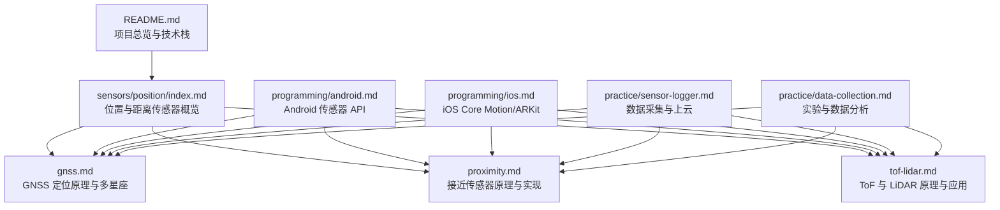
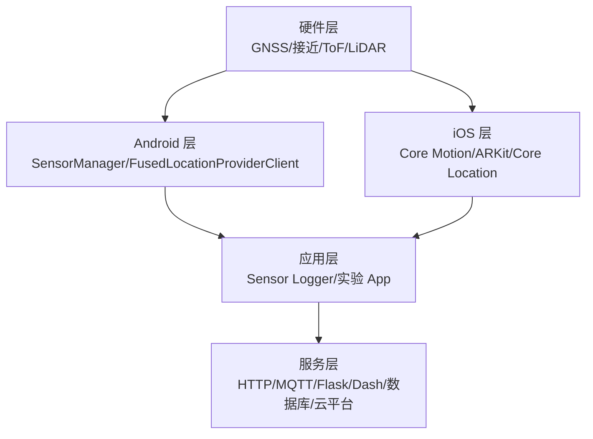
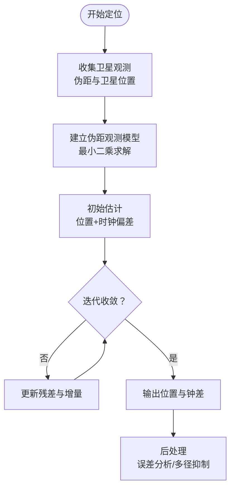
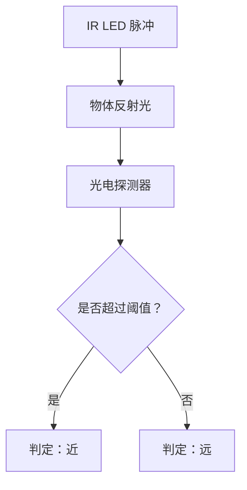
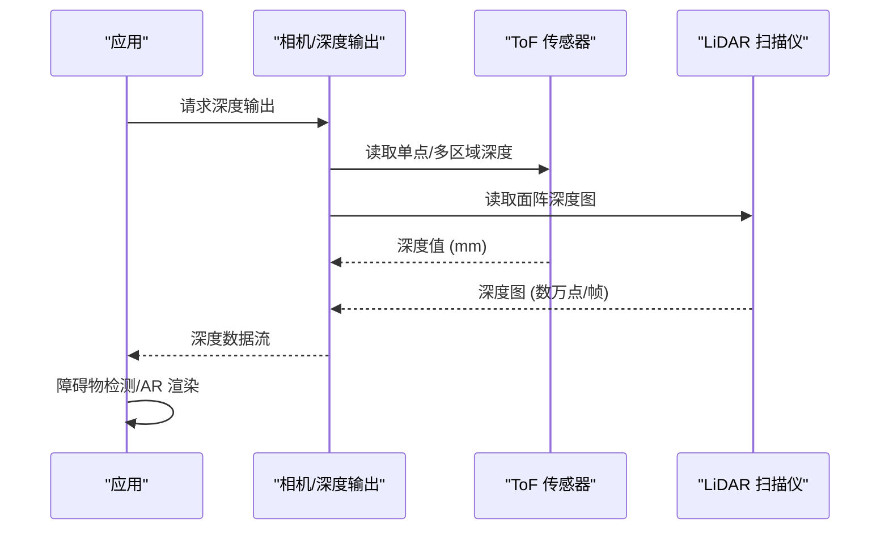
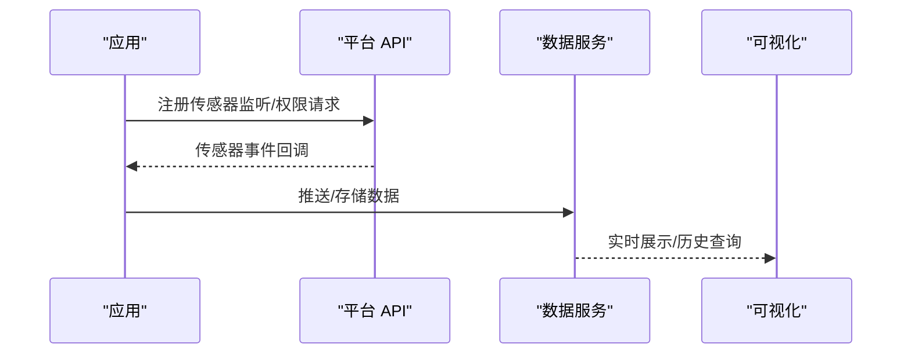
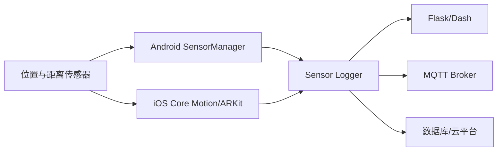

# 位置与距离传感器

<cite>
**本文引用的文件**
- [README.md](file://README.md)
- [docs/sensors/position/index.md](file://docs/sensors/position/index.md)
- [docs/sensors/position/gnss.md](file://docs/sensors/position/gnss.md)
- [docs/sensors/position/proximity.md](file://docs/sensors/position/proximity.md)
- [docs/sensors/position/tof-lidar.md](file://docs/sensors/position/tof-lidar.md)
- [docs/programming/android.md](file://docs/programming/android.md)
- [docs/programming/ios.md](file://docs/programming/ios.md)
- [docs/practice/sensor-logger.md](file://docs/practice/sensor-logger.md)
- [docs/practice/data-collection.md](file://docs/practice/data-collection.md)
</cite>

## 目录
1. [引言](#引言)
2. [项目结构](#项目结构)
3. [核心组件](#核心组件)
4. [架构总览](#架构总览)
5. [详细组件分析](#详细组件分析)
6. [依赖分析](#依赖分析)
7. [性能考虑](#性能考虑)
8. [故障排查指南](#故障排查指南)
9. [结论](#结论)
10. [附录](#附录)

## 引言
本章节围绕位置与距离类传感器展开，系统讲解 GNSS 接收器、接近传感器、ToF 传感器与 LiDAR 扫描仪的工作原理、定位精度、信号特点与算法，并结合移动端编程接口与实践案例，给出室内定位、室外导航与近距离检测的应用思路与多传感器融合定位方案。

## 项目结构
本项目采用 Docs-as-Code 工作流，文档集中于 docs/sensors/position 目录，辅以编程接口与实践指南，形成“原理—实现—应用”的闭环知识体系。

图表来源
- [README.md:18-55](file://README.md#L18-L55)
- [docs/sensors/position/index.md:1-24](file://docs/sensors/position/index.md#L1-L24)
- [docs/sensors/position/gnss.md:1-206](file://docs/sensors/position/gnss.md#L1-L206)
- [docs/sensors/position/proximity.md:1-149](file://docs/sensors/position/proximity.md#L1-L149)
- [docs/sensors/position/tof-lidar.md:1-210](file://docs/sensors/position/tof-lidar.md#L1-L210)
- [docs/programming/android.md:1-290](file://docs/programming/android.md#L1-L290)
- [docs/programming/ios.md:1-334](file://docs/programming/ios.md#L1-L334)
- [docs/practice/sensor-logger.md:1-468](file://docs/practice/sensor-logger.md#L1-L468)
- [docs/practice/data-collection.md:1-192](file://docs/practice/data-collection.md#L1-L192)

章节来源
- [README.md:18-55](file://README.md#L18-L55)
- [docs/sensors/position/index.md:1-24](file://docs/sensors/position/index.md#L1-L24)

## 核心组件
- GNSS 接收器：基于伪距定位与多星座信号，支持单频/双频与 AGNSS 辅助定位，典型精度 1–5 m（单频），<1 m（双频/RTK）。
- 接近传感器：红外反射式、超声波式、电容式三种实现，典型检测距离 0–10 cm，输出二值或连续距离值。
- ToF 传感器：dToF（直接飞行时间）与 iToF（间接飞行时间），典型量程 0–5 m，精度 ±1–5%，帧率 15–60 fps。
- LiDAR 扫描仪：dToF 面阵激光雷达，量程 0–5 m，精度约 mm 级，扫描点数数万点/帧，用于 AR、场景重建与夜间对焦。

章节来源
- [docs/sensors/position/index.md:9-14](file://docs/sensors/position/index.md#L9-L14)
- [docs/sensors/position/gnss.md:8-19](file://docs/sensors/position/gnss.md#L8-L19)
- [docs/sensors/position/proximity.md:3-12](file://docs/sensors/position/proximity.md#L3-L12)
- [docs/sensors/position/tof-lidar.md:8-20](file://docs/sensors/position/tof-lidar.md#L8-L20)

## 架构总览
从硬件到软件的端到端链路如下：
- 硬件层：GNSS 天线、接近传感器（IR/超声波/电容）、ToF 传感器（dToF/iToF）、LiDAR 面阵。
- 平台层：Android SensorManager、iOS Core Motion/ARKit。
- 应用层：Sensor Logger 数据采集与上云、实验数据分析与可视化。
- 服务层：HTTP/MQTT 推送、Flask/Dash/数据库/云平台集成。

图表来源
- [docs/programming/android.md:8-18](file://docs/programming/android.md#L8-L18)
- [docs/programming/ios.md:8-26](file://docs/programming/ios.md#L8-L26)
- [docs/practice/sensor-logger.md:74-179](file://docs/practice/sensor-logger.md#L74-L179)

## 详细组件分析

### GNSS 定位（多星座、双频、AGNSS）
- 基本信息：位置（经纬度、海拔）、速度、时间；冷启动 30–60 s，热启动 1–5 s；典型功耗 25–50 mA。
- 支持系统：GPS、GLONASS、Galileo、北斗、QZSS、NavIC；覆盖全球或亚太。
- 定位原理：伪距定位（三球交汇法），至少 4 颗卫星；双频（L1+L5）提升精度与多径抑制。
- AGNSS：通过蜂窝/ Wi-Fi 下载星历与大致位置，缩短 TTFF。
- 误差来源：电离层延迟、对流层延迟、多径效应、卫星钟差、星历误差、接收器噪声。
- 应用实例：伪距最小二乘解算、NMEA GGA 解析、Haversine 球面距离计算。

图表来源
- [docs/sensors/position/gnss.md:105-140](file://docs/sensors/position/gnss.md#L105-L140)

章节来源
- [docs/sensors/position/gnss.md:8-19](file://docs/sensors/position/gnss.md#L8-L19)
- [docs/sensors/position/gnss.md:23-35](file://docs/sensors/position/gnss.md#L23-L35)
- [docs/sensors/position/gnss.md:38-53](file://docs/sensors/position/gnss.md#L38-L53)
- [docs/sensors/position/gnss.md:55-65](file://docs/sensors/position/gnss.md#L55-L65)
- [docs/sensors/position/gnss.md:66-74](file://docs/sensors/position/gnss.md#L66-L74)
- [docs/sensors/position/gnss.md:77-84](file://docs/sensors/position/gnss.md#L77-L84)
- [docs/sensors/position/gnss.md:87-99](file://docs/sensors/position/gnss.md#L87-L99)
- [docs/sensors/position/gnss.md:103-196](file://docs/sensors/position/gnss.md#L103-L196)

### 接近传感器（红外反射、超声波、电容）
- 基本信息：近距检测（0–10 cm），输出二值或连续距离值，功耗低至 μA 级。
- 红外反射式：LED 发射 → 物体反射 → 探测器接收；受物体反射率影响显著。
- 超声波式：扬声器发射超声波，麦克风接收回波，适合全面屏设计。
- 电容式：人体与传感器形成电容变化，功耗极低，易受湿度/温度影响。
- 关键参数：响应时间、检测距离、串扰补偿、迟滞阈值算法。
- 应用实例：迟滞阈值接近检测、超声波回波测距。

图表来源
- [docs/sensors/position/proximity.md:18-31](file://docs/sensors/position/proximity.md#L18-L31)

章节来源
- [docs/sensors/position/proximity.md:3-12](file://docs/sensors/position/proximity.md#L3-L12)
- [docs/sensors/position/proximity.md:16-47](file://docs/sensors/position/proximity.md#L16-L47)
- [docs/sensors/position/proximity.md:50-61](file://docs/sensors/position/proximity.md#L50-L61)
- [docs/sensors/position/proximity.md:64-91](file://docs/sensors/position/proximity.md#L64-L91)
- [docs/sensors/position/proximity.md:94-141](file://docs/sensors/position/proximity.md#L94-L141)

### ToF 与 LiDAR
- ToF 传感器：dToF（SPAD 检测器，抗环境光，精度高）与 iToF（相位差测量，结构简单但易受多径与相位缠绕）。
- LiDAR 扫描仪：Apple LiDAR 采用 VCSEL+DOE+SPAD 阵列，量程 0–5 m，精度约 mm 级，帧率 15–30 fps，用于 AR、场景重建、夜间对焦与测量工具。
- 关键参数：深度分辨率、帧率与功耗折衷、多径干扰与相位缠绕。
- 应用实例：深度图模拟与可视化、深度图障碍物检测。

图表来源
- [docs/sensors/position/tof-lidar.md:8-20](file://docs/sensors/position/tof-lidar.md#L8-L20)
- [docs/sensors/position/tof-lidar.md:21-53](file://docs/sensors/position/tof-lidar.md#L21-L53)
- [docs/sensors/position/tof-lidar.md:65-111](file://docs/sensors/position/tof-lidar.md#L65-L111)
- [docs/sensors/position/tof-lidar.md:114-145](file://docs/sensors/position/tof-lidar.md#L114-L145)
- [docs/sensors/position/tof-lidar.md:148-201](file://docs/sensors/position/tof-lidar.md#L148-L201)

章节来源
- [docs/sensors/position/tof-lidar.md:8-20](file://docs/sensors/position/tof-lidar.md#L8-L20)
- [docs/sensors/position/tof-lidar.md:21-53](file://docs/sensors/position/tof-lidar.md#L21-L53)
- [docs/sensors/position/tof-lidar.md:65-111](file://docs/sensors/position/tof-lidar.md#L65-L111)
- [docs/sensors/position/tof-lidar.md:114-145](file://docs/sensors/position/tof-lidar.md#L114-L145)
- [docs/sensors/position/tof-lidar.md:148-201](file://docs/sensors/position/tof-lidar.md#L148-L201)

### 移动端编程接口与实践
- Android：SensorManager、Sensor、SensorEvent、SensorEventListener；权限管理（GPS、后台定位）；采样率与批处理模式；多传感器融合 API（旋转矢量、线性加速度、重力）。
- iOS：Core Motion（CMMotionManager、CMAltimeter、CMPedometer）、Core Location（GPS/GNSS）、ARKit（LiDAR/深度相机）；后台任务与生命周期管理。
- 实践：Sensor Logger 支持 HTTP/MQTT 数据上云、实时仪表盘、CSV/JSON/KML/SQLite 导出；数据采集实验（计步器、指南针、气压计测楼层、手势识别）。

图表来源
- [docs/programming/android.md:54-153](file://docs/programming/android.md#L54-L153)
- [docs/programming/ios.md:64-161](file://docs/programming/ios.md#L64-L161)
- [docs/practice/sensor-logger.md:74-232](file://docs/practice/sensor-logger.md#L74-L232)

章节来源
- [docs/programming/android.md:21-50](file://docs/programming/android.md#L21-L50)
- [docs/programming/android.md:139-195](file://docs/programming/android.md#L139-L195)
- [docs/programming/android.md:212-247](file://docs/programming/android.md#L212-L247)
- [docs/programming/android.md:251-281](file://docs/programming/android.md#L251-L281)
- [docs/programming/ios.md:29-60](file://docs/programming/ios.md#L29-L60)
- [docs/programming/ios.md:124-161](file://docs/programming/ios.md#L124-L161)
- [docs/programming/ios.md:206-258](file://docs/programming/ios.md#L206-L258)
- [docs/practice/sensor-logger.md:74-179](file://docs/practice/sensor-logger.md#L74-L179)
- [docs/practice/sensor-logger.md:236-346](file://docs/practice/sensor-logger.md#L236-L346)
- [docs/practice/data-collection.md:8-54](file://docs/practice/data-collection.md#L8-L54)
- [docs/practice/data-collection.md:63-105](file://docs/practice/data-collection.md#L63-L105)
- [docs/practice/data-collection.md:109-146](file://docs/practice/data-collection.md#L109-L146)
- [docs/practice/data-collection.md:155-191](file://docs/practice/data-collection.md#L155-L191)

## 依赖分析
- 组件耦合：位置与距离传感器依赖底层硬件与平台 API；应用层通过统一的数据格式（纳秒级时间戳、JSON）与服务层对接。
- 外部依赖：Sensor Logger 支持 HTTP/MQTT；Flask/Dash 用于本地/云端可视化；数据库/云平台用于长期存储与分析。
- 融合接口：Android 的虚拟传感器（旋转矢量、线性加速度、重力）与 iOS 的 CMDeviceMotion 提供姿态与运动融合输出。

图表来源
- [docs/programming/android.md:8-18](file://docs/programming/android.md#L8-L18)
- [docs/programming/ios.md:8-26](file://docs/programming/ios.md#L8-L26)
- [docs/practice/sensor-logger.md:74-179](file://docs/practice/sensor-logger.md#L74-L179)

章节来源
- [docs/programming/android.md:212-247](file://docs/programming/android.md#L212-L247)
- [docs/programming/ios.md:124-161](file://docs/programming/ios.md#L124-L161)
- [docs/practice/sensor-logger.md:434-458](file://docs/practice/sensor-logger.md#L434-L458)

## 性能考虑
- 功耗与采样率：高帧率与高频采样显著增加功耗；批处理模式（Android）与后台任务（iOS）有助于降低能耗。
- 精度与环境：GNSS 在城市峡谷受多径与遮挡影响；ToF/iToF 易受强光与相位缠绕影响；LiDAR 在强光下仍具鲁棒性。
- 数据一致性：跨平台实验需统一单位与坐标系（Android 标准化设置）。
- 实时性：HTTP 推送约 1 秒延迟，MQTT 约 200 毫秒；多设备场景优先选择 MQTT。

章节来源
- [docs/sensors/position/tof-lidar.md:127-137](file://docs/sensors/position/tof-lidar.md#L127-L137)
- [docs/sensors/position/gnss.md:98-99](file://docs/sensors/position/gnss.md#L98-L99)
- [docs/programming/android.md:149-152](file://docs/programming/android.md#L149-L152)
- [docs/programming/ios.md:256-257](file://docs/programming/ios.md#L256-L257)
- [docs/practice/sensor-logger.md:402-417](file://docs/practice/sensor-logger.md#L402-L417)

## 故障排查指南
- 传感器权限：Android 需要 GPS/后台定位权限；iOS 需要在 Info.plist 中声明使用说明。
- 生命周期管理：Android 必须在 onPause 注销监听；iOS 在页面消失时停止更新，避免无效功耗。
- 数据上云：检查 Push URL/Topic、Broker WSS 配置、TLS 设置；验证连通性与数据格式。
- 误差与漂移：GNSS 可通过双频与 AGNSS 改善；接近传感器注意串扰校准与迟滞阈值；ToF/iToF 注意多径与相位缠绕。

章节来源
- [docs/programming/android.md:21-50](file://docs/programming/android.md#L21-L50)
- [docs/programming/ios.md:29-60](file://docs/programming/ios.md#L29-L60)
- [docs/practice/sensor-logger.md:80-141](file://docs/practice/sensor-logger.md#L80-L141)
- [docs/sensors/position/proximity.md:84-91](file://docs/sensors/position/proximity.md#L84-L91)
- [docs/sensors/position/tof-lidar.md:138-145](file://docs/sensors/position/tof-lidar.md#L138-L145)

## 结论
本章节系统梳理了位置与距离传感器的原理、实现与应用，结合移动端编程接口与实践工具，给出了从数据采集到可视化的完整链路。通过多传感器融合与合适的定位策略，可在室内外复杂场景下实现高精度、低功耗的位置与距离感知。

## 附录
- 实际应用案例建议：
  - 室内导航：GNSS + Wi-Fi/蓝牙 + 惯性传感器融合；结合 Sensor Logger 实时采集与可视化。
  - 室外导航：GNSS（双频/AGNSS）+ 气压计（楼层识别）+ 计步器；数据采集实验验证算法。
  - 近距离检测：接近传感器（红外/超声波/电容）+ ToF/LiDAR；用于自动亮屏、手势交互与 AR 场景遮挡。
- 多传感器融合定位方案：
  - Android：使用虚拟传感器（旋转矢量、线性加速度、重力）与 FusedLocationProviderClient。
  - iOS：使用 CMDeviceMotion 与 Core Location，结合后台任务与批处理优化。

章节来源
- [docs/sensors/position/index.md:7-23](file://docs/sensors/position/index.md#L7-L23)
- [docs/programming/android.md:212-247](file://docs/programming/android.md#L212-L247)
- [docs/programming/ios.md:124-161](file://docs/programming/ios.md#L124-L161)
- [docs/practice/sensor-logger.md:413-417](file://docs/practice/sensor-logger.md#L413-L417)