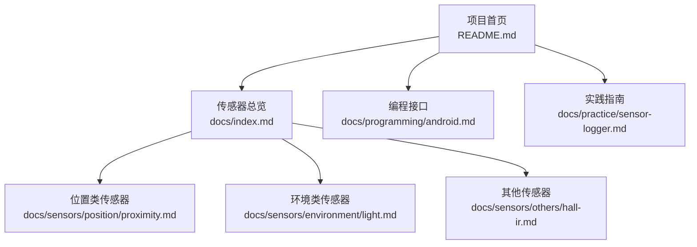
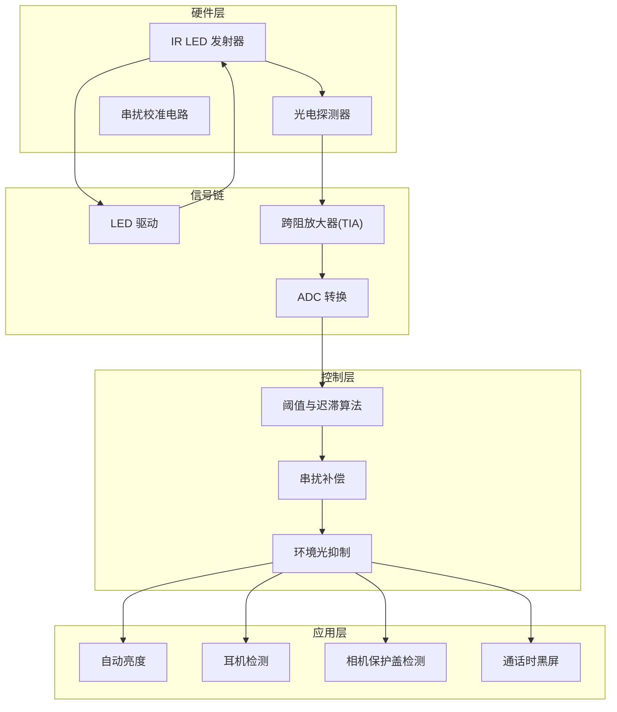
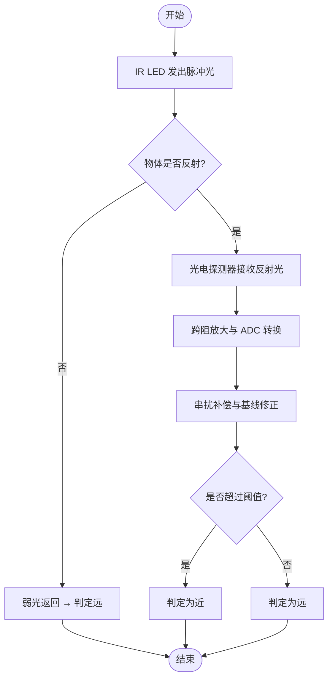
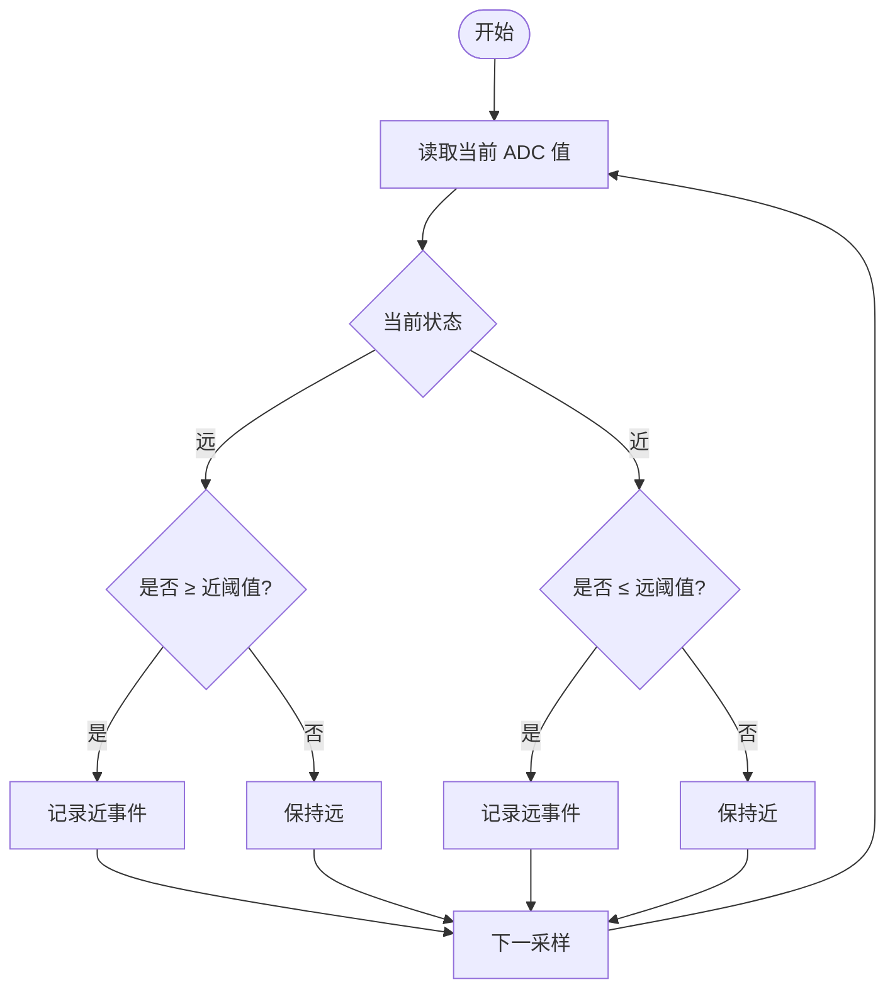
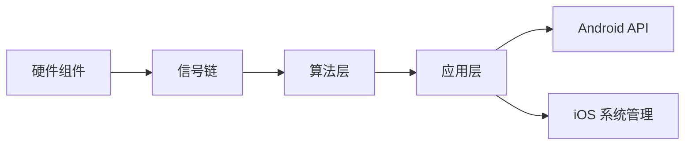

# 接近传感器

<cite>
**本文引用的文件**
- [README.md](file://README.md)
- [proximity.md](file://docs/sensors/position/proximity.md)
- [light.md](file://docs/sensors/environment/light.md)
- [hall-ir.md](file://docs/sensors/others/hall-ir.md)
- [sensor-logger.md](file://docs/practice/sensor-logger.md)
- [android.md](file://docs/programming/android.md)
- [index.md](file://docs/index.md)
</cite>

## 目录
1. [引言](#引言)
2. [项目结构](#项目结构)
3. [核心组件](#核心组件)
4. [架构总览](#架构总览)
5. [详细组件分析](#详细组件分析)
6. [依赖分析](#依赖分析)
7. [性能考虑](#性能考虑)
8. [故障排查指南](#故障排查指南)
9. [结论](#结论)
10. [附录](#附录)

## 引言
本文件围绕接近传感器展开，重点覆盖红外反射式接近传感器的工作原理、光学与信号处理机制、阈值与迟滞特性、抗干扰与校准策略、典型应用场景（如手机自动亮度、耳机检测、相机保护盖检测），以及传感器封装与安装位置对检测效果的影响。文档同时结合项目现有资料，给出可操作的实践建议与参考路径。

## 项目结构
该项目采用 Docs-as-Code 工作流，内容组织清晰，便于教学与实践结合：
- docs/sensors：传感器主题文档，包含位置类（接近传感器）、环境类（环境光）、生物识别、通信等
- docs/programming：Android/iOS 传感器 API 与数据格式说明
- docs/practice：Sensor Logger 使用指南与数据采集实践
- notebooks：交互式演示（Colab）

图表来源
- [README.md:18-55](file://README.md#L18-L55)
- [index.md:76-95](file://docs/index.md#L76-L95)

章节来源
- [README.md:18-55](file://README.md#L18-L55)
- [index.md:76-95](file://docs/index.md#L76-L95)

## 核心组件
- 红外反射式接近传感器：由 IR LED 发射器与光电探测器构成，通过检测物体反射光强判断“近/远”
- 超声波接近传感器：利用扬声器发出超声波、麦克风接收回波，适合全面屏设计
- 电容式接近传感器：检测人体与传感器间电容变化，功耗极低但易受环境影响
- 典型芯片：TMD2772（集成 ALS+Proximity）、STK3x1x（红外）、VL53L0X（ToF）、SX9320（电容式）
- 信号处理：ADC 读数经阈值与迟滞算法判定状态；串扰校准消除固定偏移

章节来源
- [proximity.md:16-47](file://docs/sensors/position/proximity.md#L16-L47)
- [proximity.md:50-61](file://docs/sensors/position/proximity.md#L50-L61)
- [proximity.md:84-91](file://docs/sensors/position/proximity.md#L84-L91)

## 架构总览
从硬件到软件的完整链路如下：
- 硬件层：IR LED、光电探测器、串扰校准电路
- 信号链：LED驱动、光信号反射、探测器输出、跨阻放大、ADC
- 控制层：阈值与迟滞算法、串扰补偿、环境光抑制
- 应用层：自动亮度、耳机检测、相机盖检测、通话时黑屏

图表来源
- [proximity.md:18-31](file://docs/sensors/position/proximity.md#L18-L31)
- [proximity.md:84-91](file://docs/sensors/position/proximity.md#L84-L91)
- [light.md:22-31](file://docs/sensors/environment/light.md#L22-L31)

## 详细组件分析

### 红外反射式接近传感器
- 工作原理：IR LED 发出红外光，物体反射后被光电探测器接收，光强与距离近似遵循逆平方关系，受物体反射率影响显著
- 光学设计要点：LED 发射角、探测器视场角、反射路径对准、避免直射干扰
- 信号处理：ADC 量化后进行阈值与迟滞判定；串扰校准消除 LED 直达探测器的固定偏移
- 环境光影响：需调制抑制环境光干扰，常见采用 38 kHz 载波调制（与遥控一致）

图表来源
- [proximity.md:18-31](file://docs/sensors/position/proximity.md#L18-L31)
- [proximity.md:84-91](file://docs/sensors/position/proximity.md#L84-L91)

章节来源
- [proximity.md:18-31](file://docs/sensors/position/proximity.md#L18-L31)
- [proximity.md:66-72](file://docs/sensors/position/proximity.md#L66-L72)
- [proximity.md:84-91](file://docs/sensors/position/proximity.md#L84-L91)

### 超声波接近传感器
- 原理：扬声器发出超声波，麦克风接收回波，根据往返时间计算距离
- 优点：无需开孔，适合全面屏；缺点：响应速度较红外慢
- 适用场景：屏下或全面屏设计的接近检测

章节来源
- [proximity.md:32-39](file://docs/sensors/position/proximity.md#L32-L39)

### 电容式接近传感器
- 原理：人体与传感器形成电容变化，检测接近
- 特点：功耗极低，适合屏下方案；受湿度、温度影响较大
- 应用：部分手机用于 SAR（比吸收率）检测，自动降低发射功率

章节来源
- [proximity.md:40-47](file://docs/sensors/position/proximity.md#L40-L47)
- [proximity.md:59-61](file://docs/sensors/position/proximity.md#L59-L61)

### 光电二极管与环境光抑制
- 环境光传感器采用光电二极管，多通道设计区分可见光、红外、UV 与频闪
- 接近传感器同样可利用多通道抑制环境光干扰（如红外通道补偿）
- 串扰校准：在无遮挡环境下测量背景串扰，后续读数减去基线

章节来源
- [light.md:22-46](file://docs/sensors/environment/light.md#L22-L46)
- [proximity.md:84-91](file://docs/sensors/position/proximity.md#L84-L91)

### 阈值与迟滞特性
- 迟滞阈值检测：避免近/远状态频繁抖动，提高稳定性
- 参数：近阈值与远阈值，二者差值决定迟滞宽度
- 算法示例：参考文档中的 Python 实现，展示如何从 ADC 读数序列中提取事件

图表来源
- [proximity.md:96-118](file://docs/sensors/position/proximity.md#L96-L118)

章节来源
- [proximity.md:96-118](file://docs/sensors/position/proximity.md#L96-L118)

### 串扰补偿与抗干扰
- 串扰来源：LED 直达探测器产生固定偏移
- 补偿流程：无遮挡环境测量背景串扰，存入基线，后续读数减去基线
- 环境光抑制：采用调制（如 38 kHz）抑制太阳光、白炽灯光等连续光源

章节来源
- [proximity.md:84-91](file://docs/sensors/position/proximity.md#L84-L91)
- [light.md:33-46](file://docs/sensors/environment/light.md#L33-L46)

### 典型应用场景
- 手机自动亮度：接近传感器检测用户头部靠近屏幕，临时关闭或降低背光，避免误触
- 耳机检测：检测耳机插入或取出，触发音频路由切换
- 相机保护盖检测：检测镜头盖关闭，阻止相机误触发或自动对焦
- 通话时黑屏：检测贴近耳朵，自动关闭屏幕以避免误触

章节来源
- [proximity.md:94-141](file://docs/sensors/position/proximity.md#L94-L141)

### 传感器封装与安装位置
- 封装形式：常见为 3×3 mm、4×4 mm、16 引脚 LGA 等，需考虑光学窗口与 PCB 布线
- 安装位置：尽量靠近屏幕边缘，避免遮挡与散射；LED 与探测器相对布置，确保反射路径对准
- 影响因素：遮挡物、反射面材质、安装角度、环境光干扰

章节来源
- [proximity.md:18-31](file://docs/sensors/position/proximity.md#L18-L31)

## 依赖分析
- 硬件依赖：IR LED、光电探测器、跨阻放大器、ADC、MCU
- 算法依赖：阈值与迟滞、串扰补偿、环境光抑制
- 应用依赖：系统 API（Android TYPE_PROXIMITY）、应用逻辑（自动亮度、耳机检测、相机盖检测）

图表来源
- [proximity.md:18-31](file://docs/sensors/position/proximity.md#L18-L31)
- [android.md:200-211](file://docs/programming/android.md#L200-L211)

章节来源
- [android.md:200-211](file://docs/programming/android.md#L200-L211)

## 性能考虑
- 响应时间：红外反射式最快（1–5 ms），超声波式较慢（10–50 ms），电容式中等（5–20 ms）
- 检测距离：红外反射式 1–10 cm，超声波 2–30 cm，电容式 1–5 cm
- 功耗：红外反射式中等（mA 级），超声波较高，电容式极低（μA 级）
- 材质影响：红外反射式受反射率影响大，超声波与电容式影响较小或仅对导体敏感

章节来源
- [proximity.md:74-82](file://docs/sensors/position/proximity.md#L74-L82)

## 故障排查指南
- 无遮挡时误判“近”：检查串扰校准是否正确执行，确认基线值是否合理
- 环境光干扰：确认调制频率与滤波设置，必要时增加滤波带宽或动态阈值
- 读数抖动：增大迟滞宽度，优化采样频率与平滑算法
- 距离异常：检查物体反射率与安装角度，必要时重新标定阈值
- 数据采集与可视化：可借助 Sensor Logger 的 HTTP 推送或 MQTT 方案进行实时监控与分析

章节来源
- [proximity.md:84-91](file://docs/sensors/position/proximity.md#L84-L91)
- [sensor-logger.md:74-179](file://docs/practice/sensor-logger.md#L74-L179)
- [sensor-logger.md:236-346](file://docs/practice/sensor-logger.md#L236-L346)

## 结论
接近传感器在现代移动设备中承担着重要角色，尤其在自动亮度、耳机检测、相机保护盖检测等方面。红外反射式传感器凭借快速响应与成熟技术成为主流，但仍需重视串扰补偿、环境光抑制与阈值/迟滞设计。通过合理的硬件布局与软件算法协同，可显著提升检测可靠性与用户体验。

## 附录

### Android 传感器 API 与数据格式
- 接近传感器常量：TYPE_PROXIMITY
- 数据字段：values[0] 为距离（cm），其余为保留
- 采集示例：可参考多传感器采集与数据格式说明

章节来源
- [android.md:200-211](file://docs/programming/android.md#L200-L211)

### 传感器速查表（来自项目索引）
- 接近传感器：硬件技术为红外反射，典型芯片为 AMS TMD2772，支持可编程采集

章节来源
- [index.md:76-95](file://docs/index.md#L76-L95)