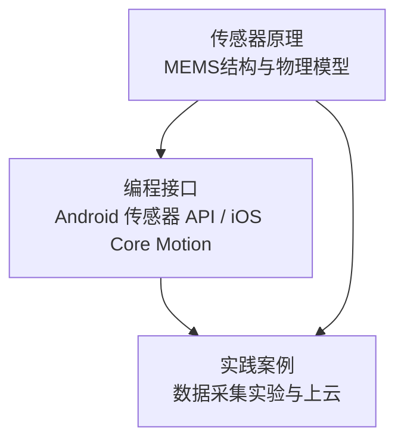
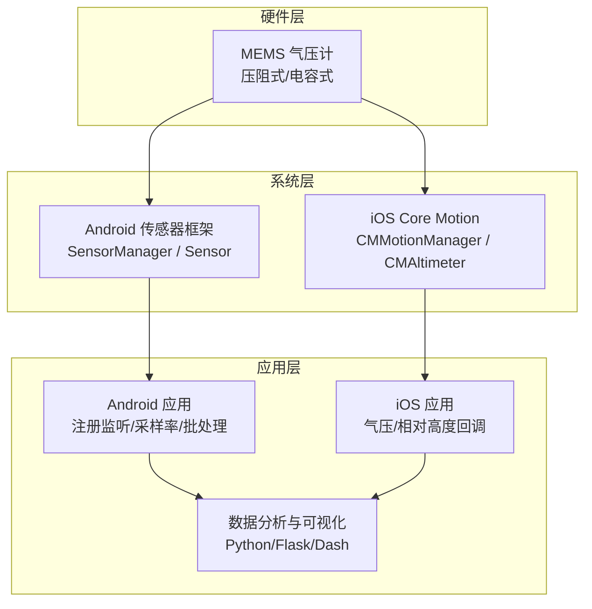
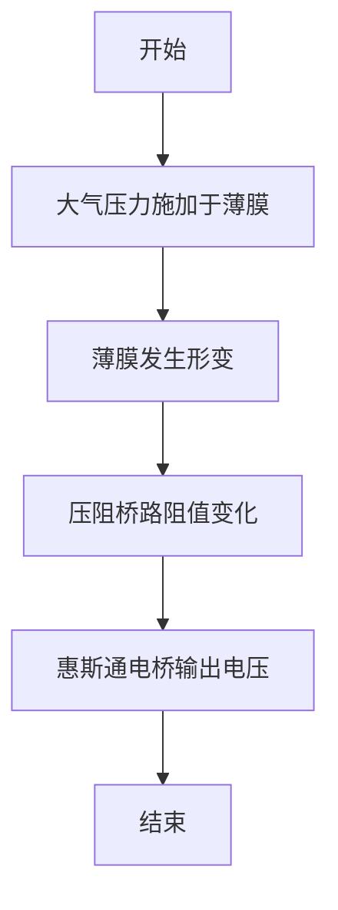
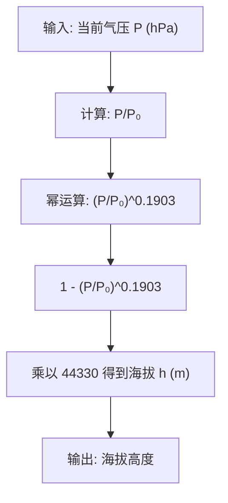
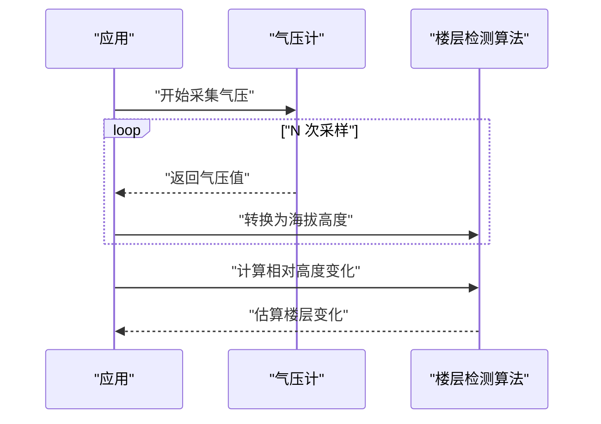
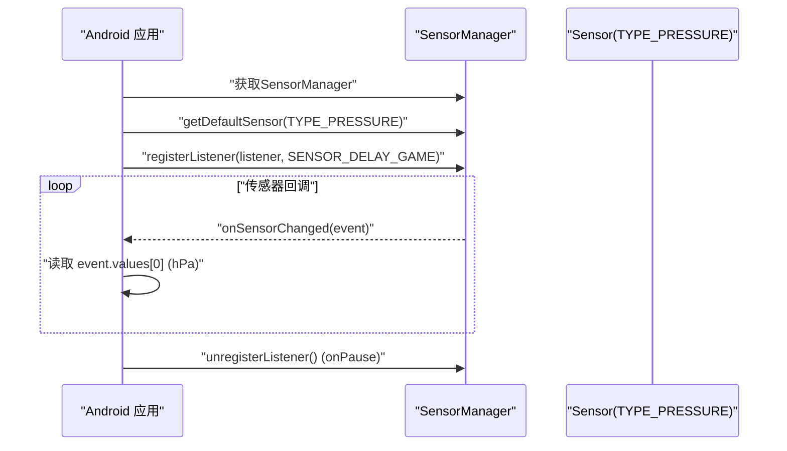
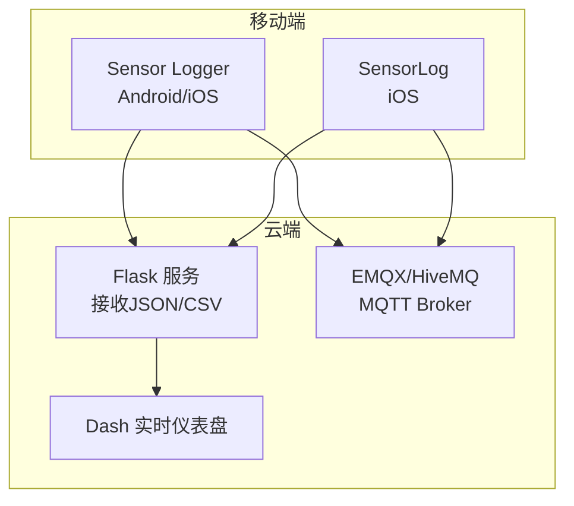
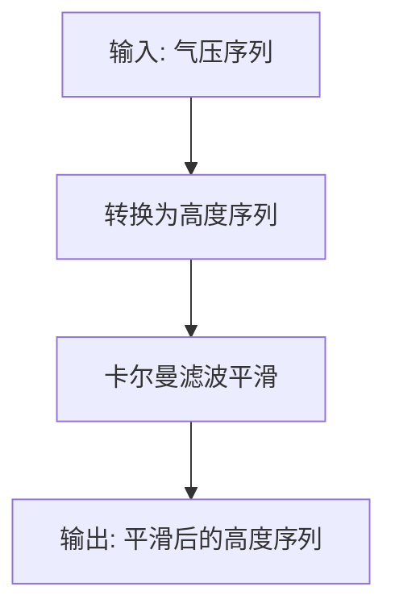
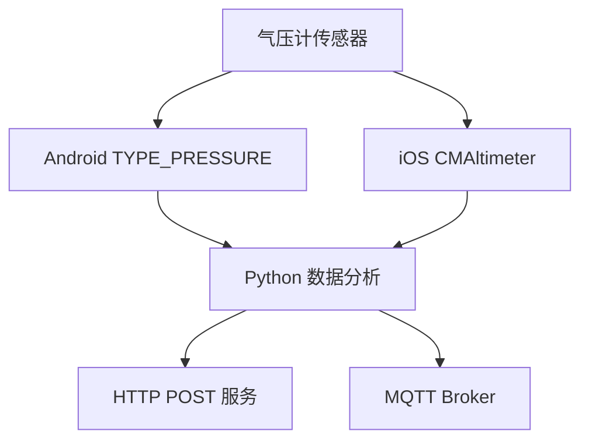

# 气压计传感器

<cite>
**本文引用的文件**
- [docs/sensors/environment/barometer.md](file://docs/sensors/environment/barometer.md)
- [docs/programming/android.md](file://docs/programming/android.md)
- [docs/programming/ios.md](file://docs/programming/ios.md)
- [docs/practice/data-collection.md](file://docs/practice/data-collection.md)
- [docs/practice/sensor-logger.md](file://docs/practice/sensor-logger.md)
- [docs/practice/sensorlog.md](file://docs/practice/sensorlog.md)
- [README.md](file://README.md)
</cite>

## 目录
1. [引言](#引言)
2. [项目结构](#项目结构)
3. [核心组件](#核心组件)
4. [架构总览](#架构总览)
5. [详细组件分析](#详细组件分析)
6. [依赖分析](#依赖分析)
7. [性能考虑](#性能考虑)
8. [故障排查指南](#故障排查指南)
9. [结论](#结论)
10. [附录](#附录)

## 引言
本文件围绕气压计传感器展开，系统阐述其MEMS工作原理（压阻式与电容式）、物理基础（标准大气压、海平面气压、相对气压）、在海拔估算中的应用（气压高度计公式与海拔计算）、楼层检测技术（气压差与典型梯度）、以及补偿与校准方法（温度补偿、多点校准）。同时提供Android与iOS平台的API使用要点与数据采集实践，辅以Python示例路径，帮助读者在教学与科研场景中高效开展气压数据采集与分析。

## 项目结构
本仓库以“文档即代码”方式组织，气压计相关内容分布在传感器原理、编程接口与实践案例三个维度：
- 传感器原理：MEMS结构、物理模型、典型芯片与参数
- 编程接口：Android传感器API与iOS Core Motion API
- 实践案例：数据采集实验、数据上云与实时可视化



**章节来源**
- [README.md: 18-55:18-55](file://README.md#L18-L55)

## 核心组件
- MEMS气压计工作原理
  - 压阻式：薄膜受压产生应变，压阻桥路阻值变化，通过惠斯通电桥检测
  - 电容式：可变形薄膜改变电容器极板间距，从而改变电容值
- 气压与海拔关系
  - 标准海平面气压与气压高度公式
  - 相对气压与绝对气压的区别及误差换算
- 楼层检测
  - 以相对气压变化估算楼层，典型梯度约为0.12 hPa/层
- 补偿与校准
  - 温度补偿（TCO）与多点校准
  - 滤波与异常值检测（卡尔曼滤波、趋势分析）

**章节来源**
- [docs/sensors/environment/barometer.md: 19-122:19-122](file://docs/sensors/environment/barometer.md#L19-L122)
- [docs/sensors/environment/barometer.md: 88-122:88-122](file://docs/sensors/environment/barometer.md#L88-L122)

## 架构总览
下图展示了从传感器到应用层的数据通路，以及在移动端平台上的API映射关系。



**图表来源**
- [docs/programming/android.md: 8-18:8-18](file://docs/programming/android.md#L8-L18)
- [docs/programming/ios.md: 8-26:8-26](file://docs/programming/ios.md#L8-L26)
- [docs/practice/sensor-logger.md: 74-132:74-132](file://docs/practice/sensor-logger.md#L74-L132)

## 详细组件分析

### MEMS气压计工作原理
- 压阻式结构
  - 硅基片刻蚀出真空腔，上方覆盖可形变薄膜，薄膜上布置压阻桥路
  - 大气压力使薄膜弯曲，引起压阻阻值变化，通过惠斯通电桥输出
  - 电桥输出与应力关系：ΔR/R = π·σ
- 电容式结构
  - 两个平行极板构成电容，其中一个极板为可变形薄膜
  - 大气压力改变极板间距，从而改变电容值
  - 电容公式：C = ε·A/d



**图表来源**
- [docs/sensors/environment/barometer.md: 21-42:21-42](file://docs/sensors/environment/barometer.md#L21-L42)

**章节来源**
- [docs/sensors/environment/barometer.md: 19-44:19-44](file://docs/sensors/environment/barometer.md#L19-L44)

### 气压与海拔关系
- 标准海平面气压：1013.25 hPa
- 气压高度公式（标准大气条件）
  - h = 44330 × (1 − (P/P₀)^0.1903)
  - 用于将当前气压转换为海拔高度（米）
- 绝对精度与相对精度
  - 绝对精度：测量值与真实气压的偏差（±0.5~±1 hPa）
  - 相对精度：短时间内两次测量的差值精度（±0.06~±0.12 hPa）
  - 楼层检测依赖相对精度



**图表来源**
- [docs/sensors/environment/barometer.md: 95-106:95-106](file://docs/sensors/environment/barometer.md#L95-L106)

**章节来源**
- [docs/sensors/environment/barometer.md: 88-122:88-122](file://docs/sensors/environment/barometer.md#L88-L122)

### 楼层检测技术
- 气压差与楼层的关系
  - 一层楼（约3m）对应气压差约0.36 hPa
  - 典型梯度：0.12 hPa/层
- 检测流程
  - 采集一段时间的气压序列
  - 将气压转换为海拔高度
  - 计算相对高度变化并除以层高得到楼层变化
- 实践示例
  - 使用Python函数实现气压到海拔的转换与楼层估算



**图表来源**
- [docs/practice/data-collection.md: 109-146:109-146](file://docs/practice/data-collection.md#L109-L146)
- [docs/sensors/environment/barometer.md: 107-122:107-122](file://docs/sensors/environment/barometer.md#L107-L122)

**章节来源**
- [docs/practice/data-collection.md: 109-146:109-146](file://docs/practice/data-collection.md#L109-L146)
- [docs/sensors/environment/barometer.md: 107-122:107-122](file://docs/sensors/environment/barometer.md#L107-L122)

### 温度补偿与多点校准
- 温度补偿（TCO）
  - 零偏随温度变化：P_error = TCO × (T − T_ref)
  - 典型TCO：±0.5~1 Pa/°C；温度变化20°C引入偏差约0.1~0.2 hPa
  - 高精度应用需进行温度补偿
- 多点校准
  - 在多个已知气压点进行标定，建立线性或非线性映射
  - 结合温度补偿，提升长期稳定性与精度
- 实践建议
  - 在室内稳定环境下进行校准
  - 记录温度与气压对，便于后续补偿

**章节来源**
- [docs/sensors/environment/barometer.md: 78-84:78-84](file://docs/sensors/environment/barometer.md#L78-L84)

### Android平台气压数据获取与处理
- API与权限
  - 传感器类型：TYPE_PRESSURE（气压，单位hPa）
  - 权限：大多数传感器无需运行时权限
- 基本使用流程
  - 获取SensorManager与Sensor
  - 注册SensorEventListener，设置采样率
  - 在onSensorChanged中读取event.values[0]为气压值
- 多传感器同时采集
  - 同时注册加速度计、陀螺仪、磁力计、气压计、光传感器
- 批处理模式
  - 使用maxReportLatencyUs降低功耗，提高后台采集效率



**图表来源**
- [docs/programming/android.md: 54-195:54-195](file://docs/programming/android.md#L54-L195)

**章节来源**
- [docs/programming/android.md: 10-195:10-195](file://docs/programming/android.md#L10-L195)

### iOS平台气压数据获取与处理
- API与框架
  - 气压计：CMAltimeter（pressure、relativeAltitude）
  - 权限：Core Motion大部分传感器无需权限
- 基本使用流程
  - 检查CMAltimeter.isRelativeAltitudeAvailable()
  - startRelativeAltitudeUpdates回调中读取pressure（kPa）与relativeAltitude（m）
- 生命周期管理
  - 在viewWillAppear/start时开始，在viewWillDisappear/onPause时停止，避免无效功耗

```mermaid
sequenceDiagram
participant VC as "UIViewController"
participant Alt as "CMAltimeter"
VC->>Alt : "isRelativeAltitudeAvailable()"
VC->>Alt : "startRelativeAltitudeUpdates(queue)"
loop "回调"
Alt-->>VC : "pressure (kPa), relativeAltitude (m)"
VC->>VC : "处理/记录"
end
VC->>Alt : "stopRelativeAltitudeUpdates()"
```

**图表来源**
- [docs/programming/ios.md: 165-182:165-182](file://docs/programming/ios.md#L165-L182)

**章节来源**
- [docs/programming/ios.md: 165-182:165-182](file://docs/programming/ios.md#L165-L182)

### 数据采集与上云实践
- Sensor Logger（跨平台）
  - 支持Android/iOS，提供HTTP POST、MQTT等多种上云路径
  - JSON Payload包含barometer传感器的pressure与relativeAltitude字段
- SensorLog（iOS）
  - 支持HTTP POST、TCP/UDP、MQTT等推送方式
  - 提供CSV/JSON导出，便于离线分析
- 实时可视化
  - Flask/Dash方案实现传感器数据的实时接收与绘图
  - MQTT方案支持多设备同时采集与实时仪表盘



**图表来源**
- [docs/practice/sensor-logger.md: 74-132:74-132](file://docs/practice/sensor-logger.md#L74-L132)
- [docs/practice/sensorlog.md: 71-177:71-177](file://docs/practice/sensorlog.md#L71-L177)

**章节来源**
- [docs/practice/sensor-logger.md: 74-132:74-132](file://docs/practice/sensor-logger.md#L74-L132)
- [docs/practice/sensorlog.md: 71-177:71-177](file://docs/practice/sensorlog.md#L71-L177)

### 气压数据的平滑与异常值检测
- 趋势分析
  - 通过线性回归分析气压变化率，判断天气趋势
- 卡尔曼滤波
  - 将气压序列转换为高度序列，使用一维卡尔曼滤波进行平滑
- 实践示例
  - 提供Python函数实现气压到海拔转换、楼层检测与滤波平滑



**图表来源**
- [docs/sensors/environment/barometer.md: 111-197:111-197](file://docs/sensors/environment/barometer.md#L111-L197)

**章节来源**
- [docs/sensors/environment/barometer.md: 111-197:111-197](file://docs/sensors/environment/barometer.md#L111-L197)

## 依赖分析
- 气压计传感器在Android与iOS平台分别通过原生框架提供：
  - Android：Sensor.TYPE_PRESSURE（hPa）
  - iOS：CMAltimeter（pressure kPa、relativeAltitude m）
- 数据采集与处理依赖Python生态（pandas、numpy、scipy、matplotlib、flask、dash、mqtt等），用于实验分析与实时可视化
- 云平台集成可选HTTP POST或MQTT，满足不同规模与实时性需求



**图表来源**
- [docs/programming/android.md: 14-17:14-17](file://docs/programming/android.md#L14-L17)
- [docs/programming/ios.md: 22-25:22-25](file://docs/programming/ios.md#L22-L25)
- [docs/practice/sensor-logger.md: 144-178:144-178](file://docs/practice/sensor-logger.md#L144-L178)

**章节来源**
- [docs/programming/android.md: 14-17:14-17](file://docs/programming/android.md#L14-L17)
- [docs/programming/ios.md: 22-25:22-25](file://docs/programming/ios.md#L22-L25)
- [docs/practice/sensor-logger.md: 144-178:144-178](file://docs/practice/sensor-logger.md#L144-L178)

## 性能考虑
- 采样率与功耗
  - 高采样率显著增加功耗与CPU负载，建议根据应用需求选择合适频率
  - 批处理模式可在硬件FIFO中缓存事件，降低唤醒频率
- 传感器融合与数据质量
  - 气压计数据通常与加速度计、陀螺仪、磁力计结合，提升姿态与运动感知的稳定性
- 实时性与可靠性
  - MQTT适合多设备实时采集；HTTP POST适合简单场景；离线上传适合批量分析

**章节来源**
- [docs/programming/android.md: 139-153:139-153](file://docs/programming/android.md#L139-L153)
- [docs/programming/android.md: 251-281:251-281](file://docs/programming/android.md#L251-L281)

## 故障排查指南
- 气压读数异常波动
  - 检查是否处于强气流或密闭空间，避免瞬时扰动影响
  - 使用滤波（如卡尔曼滤波）平滑数据
- 楼层检测误判
  - 确认采样频率与批处理设置合理
  - 结合温度补偿与多点校准，减少漂移
- 平台差异
  - Android与iOS单位不同（hPa vs kPa），注意转换
  - 生命周期管理不当会导致功耗过高或数据丢失

**章节来源**
- [docs/programming/ios.md: 310-326:310-326](file://docs/programming/ios.md#L310-L326)
- [docs/sensors/environment/barometer.md: 111-197:111-197](file://docs/sensors/environment/barometer.md#L111-L197)

## 结论
气压计作为重要的环境传感器，凭借MEMS压阻式与电容式结构实现了高精度、低功耗的大气压力测量。通过标准海平面气压与气压高度公式，可将气压转换为海拔高度；结合相对气压变化，可实现可靠的楼层检测。在实际应用中，温度补偿与多点校准是提升长期稳定性的关键；Android与iOS平台提供了便捷的API与丰富的数据采集实践路径。借助Python生态与云平台，可实现从数据采集到实时可视化的完整闭环。

## 附录
- 实际代码示例路径（不直接展示代码内容）
  - 气压到海拔转换与楼层检测：[docs/sensors/environment/barometer.md: 111-122:111-122](file://docs/sensors/environment/barometer.md#L111-L122)
  - 卡尔曼滤波平滑高度估计：[docs/sensors/environment/barometer.md: 158-197:158-197](file://docs/sensors/environment/barometer.md#L158-L197)
  - Android气压数据采集与批处理：[docs/programming/android.md: 54-195:54-195](file://docs/programming/android.md#L54-L195)
  - iOS气压数据采集与生命周期管理：[docs/programming/ios.md: 165-182:165-182](file://docs/programming/ios.md#L165-L182)
  - Sensor Logger数据上云（HTTP POST/JSON）：[docs/practice/sensor-logger.md: 74-132:74-132](file://docs/practice/sensor-logger.md#L74-L132)
  - SensorLog数据上云（Flask接收与CSV导出）：[docs/practice/sensorlog.md: 131-177:131-177](file://docs/practice/sensorlog.md#L131-L177)