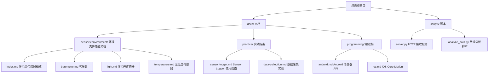
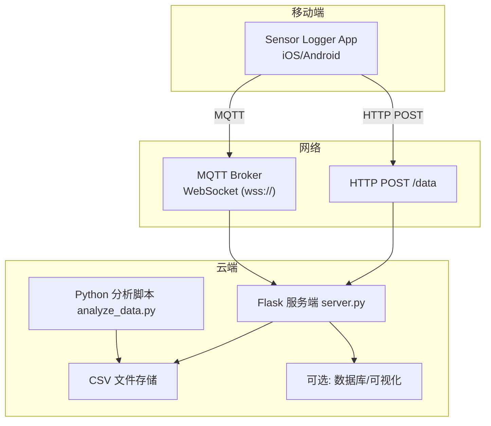
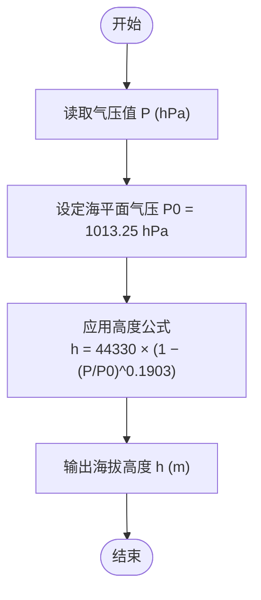
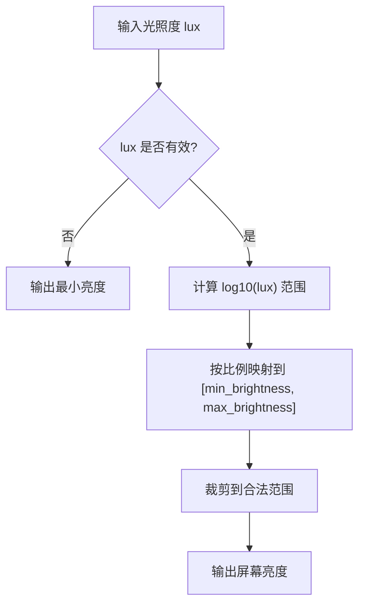
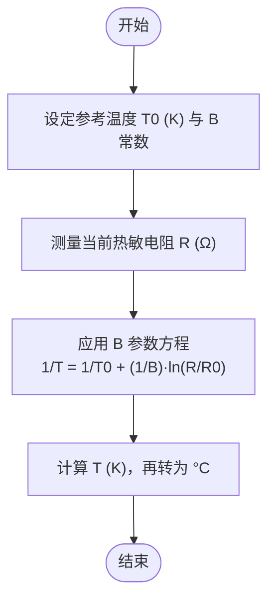
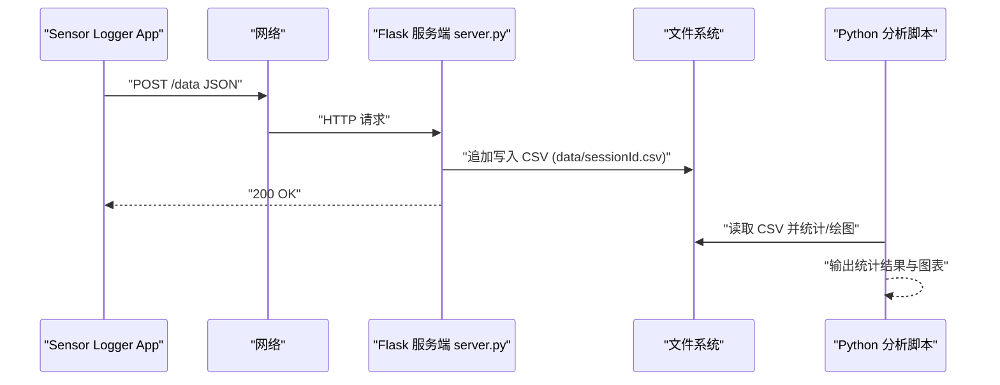
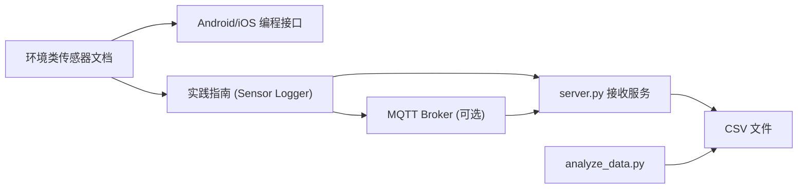

# 环境传感器

<cite>
**本文引用的文件**
- [README.md](file://README.md)
- [环境类传感器索引.md](file://docs/sensors/environment/index.md)
- [气压计.md](file://docs/sensors/environment/barometer.md)
- [环境光传感器.md](file://docs/sensors/environment/light.md)
- [温湿度传感器.md](file://docs/sensors/environment/temperature.md)
- [Sensor Logger 使用指南.md](file://docs/practice/sensor-logger.md)
- [数据采集实验.md](file://docs/practice/data-collection.md)
- [Android 传感器 API.md](file://docs/programming/android.md)
- [iOS Core Motion.md](file://docs/programming/ios.md)
- [server.py](file://scripts/server.py)
- [analyze_data.py](file://scripts/analyze_data.py)
</cite>

## 目录
1. [简介](#简介)
2. [项目结构](#项目结构)
3. [核心组件](#核心组件)
4. [架构总览](#架构总览)
5. [详细组件分析](#详细组件分析)
6. [依赖分析](#依赖分析)
7. [性能考虑](#性能考虑)
8. [故障排查指南](#故障排查指南)
9. [结论](#结论)
10. [附录](#附录)

## 简介
本章节面向高校教学与工程实践，系统梳理智能手机内置环境传感器（气压计、环境光传感器、温湿度传感器）的工作原理、技术特性与跨平台编程接口，并结合项目中的数据采集与上云方案，给出数据处理与多传感器融合的最佳实践。读者可据此完成从原理理解到实测验证、从移动端采集到云端可视化的完整闭环。

## 项目结构
本项目采用 MkDocs + Material 主题，文档与实践脚本分离组织，便于教学与实验复用。环境传感器相关内容集中在 docs/sensors/environment 下，配套的采集与上云脚本位于 scripts/ 目录。

图表来源
- [README.md:18-55](file://README.md#L18-L55)
- [环境类传感器索引.md:1-27](file://docs/sensors/environment/index.md#L1-L27)
- [Sensor Logger 使用指南.md:1-70](file://docs/practice/sensor-logger.md#L1-L70)
- [Android 传感器 API.md:1-20](file://docs/programming/android.md#L1-L20)
- [iOS Core Motion.md:1-20](file://docs/programming/ios.md#L1-L20)
- [server.py:1-20](file://scripts/server.py#L1-L20)
- [analyze_data.py:1-15](file://scripts/analyze_data.py#L1-L15)

章节来源
- [README.md:18-55](file://README.md#L18-L55)

## 核心组件
- 环境类传感器文档：系统阐述气压计、环境光、温湿度的物理原理、技术参数与典型应用。
- 编程接口：Android SensorManager 与 iOS Core Motion 的跨平台 API 使用要点。
- 实践工具：Sensor Logger 的数据导出与上云方案；Flask 服务端接收与 CSV 存储；Python 分析脚本示例。
- 实验指导：围绕气压计测楼层、光照场景分类、温湿度换算等实验，提供可操作流程与代码路径。

章节来源
- [环境类传感器索引.md:1-27](file://docs/sensors/environment/index.md#L1-L27)
- [Sensor Logger 使用指南.md:24-58](file://docs/practice/sensor-logger.md#L24-L58)
- [Android 传感器 API.md:10-18](file://docs/programming/android.md#L10-L18)
- [iOS Core Motion.md:10-26](file://docs/programming/ios.md#L10-L26)

## 架构总览
下图展示从移动端采集到云端接收与可视化的整体链路，涵盖 HTTP 推送与 MQTT 订阅两条路径，以及本地数据分析脚本。

图表来源
- [Sensor Logger 使用指南.md:74-180](file://docs/practice/sensor-logger.md#L74-L180)
- [Sensor Logger 使用指南.md:236-346](file://docs/practice/sensor-logger.md#L236-L346)
- [server.py:35-81](file://scripts/server.py#L35-L81)
- [analyze_data.py:16-31](file://scripts/analyze_data.py#L16-L31)

章节来源
- [Sensor Logger 使用指南.md:74-180](file://docs/practice/sensor-logger.md#L74-L180)
- [Sensor Logger 使用指南.md:236-346](file://docs/practice/sensor-logger.md#L236-L346)
- [server.py:35-81](file://scripts/server.py#L35-L81)
- [analyze_data.py:16-31](file://scripts/analyze_data.py#L16-L31)

## 详细组件分析

### 气压计（Barometer）
- 基本信息与技术参数
  - 物理量：大气压力；量程：300–1100 hPa；单位：hPa 或 mbar；分辨率：0.01–0.06 hPa；精度：绝对 ±0.5–±1 hPa，相对 ±0.06–±0.12 hPa；采样率：1–200 Hz；功耗：~3–5 μA。
  - 常量/框架：Android 常量 TYPE_PRESSURE；iOS 框架 CMAltimeter。
- 工作原理
  - MEMS 压阻式：真空腔上方薄膜受压产生形变，压阻桥路输出与应力相关的变化。
  - MEMS 电容式：薄膜作为可变电容器的一个极板，形变改变极板间距，从而改变电容值。
- 关键参数与误差
  - 绝对精度 vs 相对精度：绝对误差约 ±8.4 m 高度，相对精度决定短时间内的可检测变化。
  - 噪声与分辨率：噪声越低，能检测的最小高度变化越小。
  - 温度漂移（TCO）：温度变化引入零偏误差，典型约 ±0.5–1 Pa/°C，高精度应用需温度补偿。
- 气压与海拔关系
  - 标准大气模型：海拔每升高约 8.4 m，气压下降约 1 hPa；标准海平面气压 P0=1013.25 hPa。
  - 高度计算公式：h = 44330 × (1 − (P/P0)^0.1903)。
- 应用实例
  - 气压趋势分析：通过线性回归估计变化率，判断天气趋势。
  - 卡尔曼滤波平滑：对气压序列进行滤波，平滑高度估计波动。
- 楼层检测
  - 一层楼（约 3 m）对应气压差约 0.36 hPa；检测依赖相对精度而非绝对精度。

图表来源
- [气压计.md:95-106](file://docs/sensors/environment/barometer.md#L95-L106)
- [气压计.md:111-122](file://docs/sensors/environment/barometer.md#L111-L122)

章节来源
- [气压计.md:3-16](file://docs/sensors/environment/barometer.md#L3-L16)
- [气压计.md:19-44](file://docs/sensors/environment/barometer.md#L19-L44)
- [气压计.md:57-85](file://docs/sensors/environment/barometer.md#L57-L85)
- [气压计.md:88-123](file://docs/sensors/environment/barometer.md#L88-L123)
- [气压计.md:126-197](file://docs/sensors/environment/barometer.md#L126-L197)

### 环境光传感器（Ambient Light Sensor）
- 基本信息与技术参数
  - 物理量：光照强度；量程：0.01–100,000+ lux；单位：lux；采样率：1–50 Hz；功耗：~2–10 μA；Android 常量 TYPE_LIGHT；iOS 系统自动管理（无直接 API）。
- 工作原理
  - 光电二极管：PN 结在反偏电场下，光子激发产生电子-空穴对，形成与光照强度成正比的光电流，经跨阻放大器与 ADC 输出数字照度值。
  - 多通道设计：可见光、红外、UV、Flicker 等通道，用于人眼响应匹配与频闪检测。
- 关键参数与动态范围
  - 光谱响应：匹配 CIE 明视觉函数，IR 通道用于补偿红外分量。
  - 动态范围：跨越 8 个数量级，通过可调积分时间与增益覆盖星光到直射阳光。
- 应用实例
  - 自动亮度算法：对数映射将 lux 映射到屏幕亮度，模拟人眼对数响应。
  - 光照场景分类：以 lux 为阈值划分夜间、室内、阴天、晴天阴影、直射阳光。
  - 日光照变化曲线：简化日光模型绘制 24 小时光照曲线。

图表来源
- [环境光传感器.md:107-129](file://docs/sensors/environment/light.md#L107-L129)
- [环境光传感器.md:131-156](file://docs/sensors/environment/light.md#L131-L156)

章节来源
- [环境光传感器.md:8-19](file://docs/sensors/environment/light.md#L8-L19)
- [环境光传感器.md:22-46](file://docs/sensors/environment/light.md#L22-L46)
- [环境光传感器.md:74-103](file://docs/sensors/environment/light.md#L74-L103)
- [环境光传感器.md:105-179](file://docs/sensors/environment/light.md#L105-L179)

### 温湿度传感器
- 温度传感器
  - 基本信息：量程 -40°C 至 +85°C；单位 °C；精度 ±0.5–±1°C；Android 常量 TYPE_AMBIENT_TEMPERATURE。
  - 工作原理：PN 结温度传感器（SoC 内部，用于芯片/电池温度监控）；热敏电阻（NTC/PTC，用于外部温度监测）。
  - 注意事项：手机内部温度传感器受 SoC 发热影响，不能准确反映环境温度；少数机型（如早期三星 Galaxy S4/S5）配备独立环境温度传感器。
- 湿度传感器
  - 基本信息：量程 0–100% RH；单位 %RH；精度 ±3–±5% RH；Android 常量 TYPE_RELATIVE_HUMIDITY。
  - 工作原理：电容式湿度传感器，吸湿性高分子材料介电常数随湿度变化，导致电容变化。
  - 搭载情况：在主流手机中较为罕见，仅少数机型（如早期三星 Galaxy S4/S5）搭载。
- 关键参数与校准
  - 精度与分辨率：精度表征与真实值偏差上限，分辨率表征能分辨的最小变化。
  - 热时间常数：PCB 集成 5–30 s，独立探头 1–5 s，液体浸没 <1 s。
  - 自热效应：传感器功耗产生的焦耳热导致测量偏高，低功耗传感器可忽略。
- 应用实例
  - NTC 热敏电阻阻值转温度：基于 B 参数方程（Steinhart-Hart 简化式）。
  - 露点温度计算：基于 Magnus 公式，由温度与湿度估算露点。

图表来源
- [温湿度传感器.md:125-145](file://docs/sensors/environment/temperature.md#L125-L145)
- [温湿度传感器.md:147-169](file://docs/sensors/environment/temperature.md#L147-L169)

章节来源
- [温湿度传感器.md:8-55](file://docs/sensors/environment/temperature.md#L8-L55)
- [温湿度传感器.md:90-121](file://docs/sensors/environment/temperature.md#L90-L121)
- [温湿度传感器.md:123-169](file://docs/sensors/environment/temperature.md#L123-L169)

### 跨平台 API 使用指南与数据处理最佳实践
- Android 传感器 API
  - 框架类：SensorManager、Sensor、SensorEvent、SensorEventListener。
  - 权限：大部分传感器无需运行时权限；心率、活动识别、GPS/后台定位等需危险权限。
  - 基本流程：获取 SensorManager → 枚举传感器 → 注册监听（onResume）→ onSensorChanged 回调 → onPaused 注销监听。
  - 采样率：提供 SENSOR_DELAY_* 常量与自定义微秒值；高采样率显著增加功耗。
  - 多传感器同时采集：统一注册多个传感器监听，注意纳秒级时间戳对齐。
  - 传感器融合：虚拟传感器（如 TYPE_ROTATION_VECTOR、TYPE_LINEAR_ACCELERATION）由系统融合生成。
  - 批处理模式：通过 maxReportLatencyUs 批量上报，降低 CPU 唤醒频率，适合后台长时间采集。
- iOS Core Motion
  - 框架类：CMMotionManager、CMAltimeter、CMPedometer、CMMotionActivityManager。
  - 权限：部分功能需 Info.plist 中的使用说明键；运动活动权限首次使用时弹窗请求。
  - 基本流程：检查可用性 → 设置更新间隔 → startUpdates 回调 → 生命周期绑定（页面可见时开始，不可见时停止）。
  - 设备运动（传感器融合）：CMDeviceMotion 提供姿态、线性加速度、重力与磁场信息。
  - 气压计/高度计：CMAltimeter 提供相对高度变化与气压（kPa）。
  - 后台执行：受限于系统策略，推荐使用后台处理任务或蓝牙中央模式接收外部传感器数据。
- 数据处理最佳实践
  - 时间戳对齐：统一使用纳秒级时间戳，确保多传感器同步。
  - 低通/带通滤波：针对加速度计、气压计等信号进行滤波，抑制高频噪声。
  - 卡尔曼滤波：对气压高度进行平滑估计，提升稳定性。
  - 跨平台一致性：启用 Sensor Logger 的 Standardise Units & Frame，统一单位与坐标系（ENU）。
  - 数据导出与上云：支持 CSV/JSON/SQLite/KML 等格式；HTTP POST 与 MQTT 两种上云路径。

图表来源
- [Sensor Logger 使用指南.md:89-141](file://docs/practice/sensor-logger.md#L89-L141)
- [server.py:35-81](file://scripts/server.py#L35-L81)
- [analyze_data.py:16-31](file://scripts/analyze_data.py#L16-L31)

章节来源
- [Android 传感器 API.md:21-50](file://docs/programming/android.md#L21-L50)
- [Android 传感器 API.md:54-153](file://docs/programming/android.md#L54-L153)
- [Android 传感器 API.md:156-195](file://docs/programming/android.md#L156-L195)
- [Android 传感器 API.md:199-247](file://docs/programming/android.md#L199-L247)
- [Android 传感器 API.md:251-281](file://docs/programming/android.md#L251-L281)
- [iOS Core Motion.md:29-60](file://docs/programming/ios.md#L29-L60)
- [iOS Core Motion.md:64-161](file://docs/programming/ios.md#L64-L161)
- [iOS Core Motion.md:165-182](file://docs/programming/ios.md#L165-L182)
- [iOS Core Motion.md:206-258](file://docs/programming/ios.md#L206-L258)
- [Sensor Logger 使用指南.md:24-58](file://docs/practice/sensor-logger.md#L24-L58)
- [Sensor Logger 使用指南.md:420-431](file://docs/practice/sensor-logger.md#L420-L431)

## 依赖分析
- 文档与实现耦合
  - 环境传感器原理与参数来自文档；Android/iOS API 与 Sensor Logger 使用指南提供跨平台接入路径。
  - scripts/server.py 与 docs/practice/sensor-logger.md 的 JSON Payload 格式保持一致，确保数据互通。
- 数据流依赖
  - 移动端通过 Sensor Logger 将传感器数据以 JSON 形式推送到 server.py，后者写入 CSV 文件，供 analyze_data.py 读取分析。
- 外部依赖
  - Flask（HTTP 服务）、paho-mqtt（MQTT 订阅）、Matplotlib/NumPy（数据分析与可视化）。

图表来源
- [环境类传感器索引.md:1-27](file://docs/sensors/environment/index.md#L1-L27)
- [Sensor Logger 使用指南.md:74-180](file://docs/practice/sensor-logger.md#L74-L180)
- [server.py:11-21](file://scripts/server.py#L11-L21)
- [analyze_data.py:8-14](file://scripts/analyze_data.py#L8-L14)

章节来源
- [Sensor Logger 使用指南.md:74-180](file://docs/practice/sensor-logger.md#L74-L180)
- [server.py:11-21](file://scripts/server.py#L11-L21)
- [analyze_data.py:8-14](file://scripts/analyze_data.py#L8-L14)

## 性能考虑
- 功耗优化
  - 采样率与批处理：Android 批处理模式可显著降低 CPU 唤醒频率；iOS 后台采集需谨慎，避免长时间连续运行。
  - 传感器融合：优先使用系统提供的虚拟传感器，减少自研融合带来的额外计算开销。
- 精度与稳定性
  - 气压计：采用卡尔曼滤波平滑高度估计；注意温度补偿与相对精度优于绝对精度。
  - 环境光：多通道设计与动态范围控制，结合对数映射实现自然的自动亮度调节。
  - 温湿度：关注热时间常数与自热效应，必要时进行校准与补偿。
- 数据处理
  - 时间戳对齐与滤波；跨平台单位统一（如 Android 加速度计单位为 m/s²，iOS 为 g）。

## 故障排查指南
- 传感器数据缺失或异常
  - 检查权限与平台限制：Android 需要相应危险权限；iOS 部分功能需 Info.plist 声明与授权。
  - 确认生命周期管理：onPause/onStop 中注销监听，避免后台持续唤醒。
- 数据上云失败
  - HTTP POST：确认 Push URL 正确，server.py 已启动且可访问；查看控制台输出与 CSV 写入状态。
  - MQTT：确认 Broker 支持 WebSocket (wss://)，用户名密码正确；客户端 TLS 设置与订阅主题一致。
- 数据分析异常
  - 检查 CSV 字段映射是否与 server.py 写入逻辑一致；确保时间戳与数值字段解析正确。
  - 对气压数据进行滤波或趋势分析前，先检查是否存在异常跳变或缺失值。

章节来源
- [Android 传感器 API.md:21-50](file://docs/programming/android.md#L21-L50)
- [iOS Core Motion.md:29-60](file://docs/programming/ios.md#L29-L60)
- [Sensor Logger 使用指南.md:80-87](file://docs/practice/sensor-logger.md#L80-L87)
- [server.py:35-81](file://scripts/server.py#L35-L81)
- [analyze_data.py:16-31](file://scripts/analyze_data.py#L16-L31)

## 结论
本项目围绕环境传感器提供了从原理到实践的完整知识体系：气压计用于海拔与楼层检测，环境光传感器支撑自动亮度与相机频闪检测，温湿度传感器在少数机型中提供环境参数补充。通过 Android/iOS 标准 API 与 Sensor Logger 上云方案，结合 Flask 服务端与 Python 分析脚本，可实现从采集、存储到可视化的全流程教学与工程实践。

## 附录
- 实验参考
  - 气压计测楼层：参考“数据采集实验”中的楼层检测流程与数据分析代码路径。
  - 环境光场景分类与亮度映射：参考“环境光传感器”中的示例函数路径。
  - 温湿度换算与露点计算：参考“温湿度传感器”中的示例函数路径。
- API 参考
  - Android 传感器常量与数据格式：参考“Android 传感器 API”。
  - iOS Core Motion 类与方法：参考“iOS Core Motion”。

章节来源
- [数据采集实验.md:109-146](file://docs/practice/data-collection.md#L109-L146)
- [环境光传感器.md:107-179](file://docs/sensors/environment/light.md#L107-L179)
- [温湿度传感器.md:125-169](file://docs/sensors/environment/temperature.md#L125-L169)
- [Android 传感器 API.md:199-247](file://docs/programming/android.md#L199-L247)
- [iOS Core Motion.md:165-182](file://docs/programming/ios.md#L165-L182)