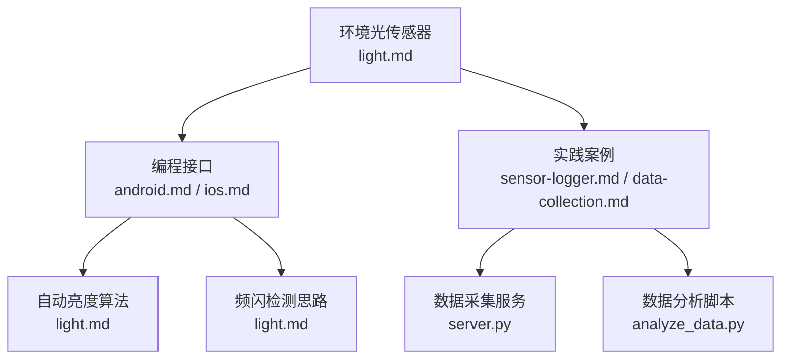
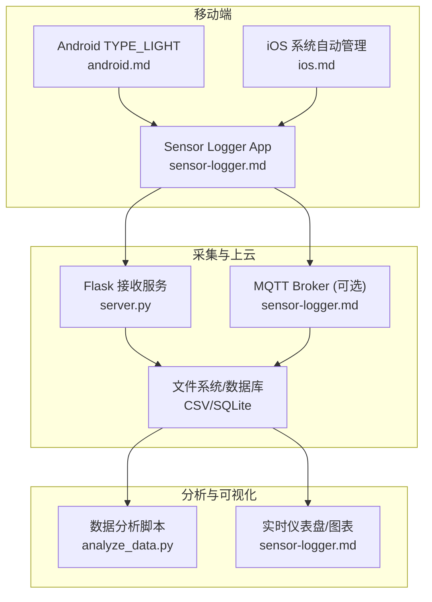
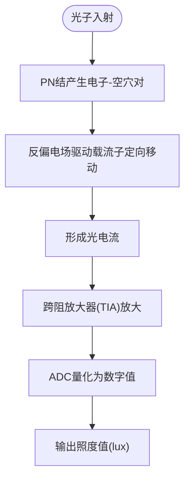
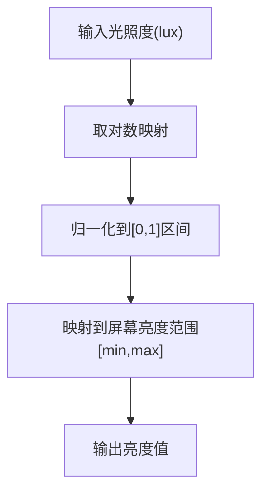
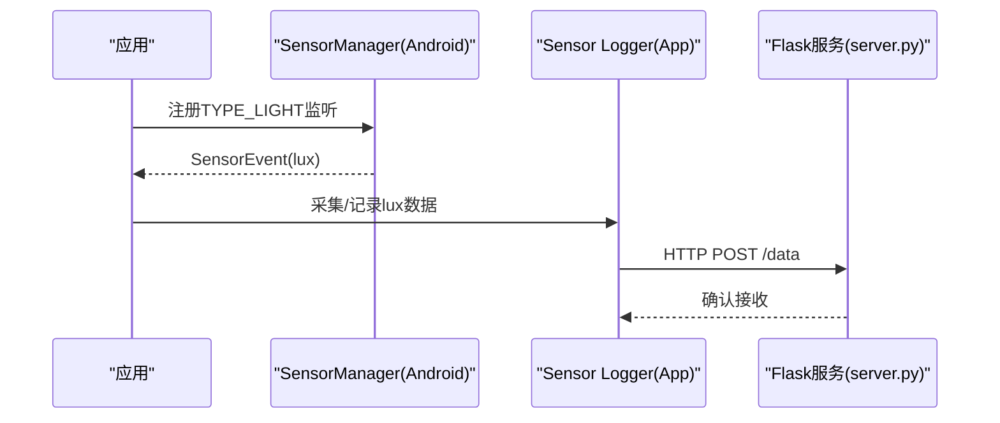
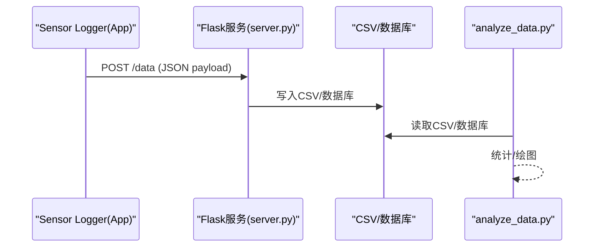
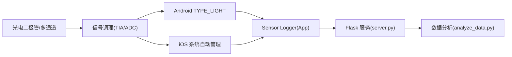

# 环境光传感器

<cite>
**本文引用的文件**
- [light.md](file://docs/sensors/environment/light.md)
- [index.md](file://docs/sensors/environment/index.md)
- [barometer.md](file://docs/sensors/environment/barometer.md)
- [android.md](file://docs/programming/android.md)
- [ios.md](file://docs/programming/ios.md)
- [sensor-logger.md](file://docs/practice/sensor-logger.md)
- [data-collection.md](file://docs/practice/data-collection.md)
- [server.py](file://scripts/server.py)
- [analyze_data.py](file://scripts/analyze_data.py)
- [README.md](file://README.md)
</cite>

## 目录
1. [引言](#引言)
2. [项目结构](#项目结构)
3. [核心组件](#核心组件)
4. [架构总览](#架构总览)
5. [详细组件分析](#详细组件分析)
6. [依赖分析](#依赖分析)
7. [性能考虑](#性能考虑)
8. [故障排查指南](#故障排查指南)
9. [结论](#结论)
10. [附录](#附录)

## 引言
本文件围绕环境光传感器（Ambient Light Sensor）展开，系统阐述其光电二极管工作原理、光生载流子与电流输出特性、光照强度单位换算与传感器灵敏度、自动亮度调节算法、相机频闪检测（50/60 Hz）以及跨平台 API 使用方法（Android 与 iOS）。同时结合项目中的数据采集与分析工具链，给出实用的工程化建议与性能优化策略。

## 项目结构
该项目采用 MkDocs + Material 主题，文档以“传感器原理 + 编程接口 + 实践案例”为主线组织，环境光传感器相关内容位于 sensors/environment/light.md；Android/iOS 传感器 API 位于 programming/android.md 与 programming/ios.md；实践部分包含 Sensor Logger 上云方案与数据采集实验，便于教学与科研复用。

图表来源
- [light.md:1-187](file://docs/sensors/environment/light.md#L1-L187)
- [android.md:1-290](file://docs/programming/android.md#L1-L290)
- [ios.md:1-334](file://docs/programming/ios.md#L1-L334)
- [sensor-logger.md:1-468](file://docs/practice/sensor-logger.md#L1-L468)
- [data-collection.md:1-192](file://docs/practice/data-collection.md#L1-L192)
- [server.py:1-94](file://scripts/server.py#L1-L94)
- [analyze_data.py:1-98](file://scripts/analyze_data.py#L1-L98)

章节来源
- [README.md:1-169](file://README.md#L1-L169)

## 核心组件
- 环境光传感器硬件与原理：光电二极管、多通道设计（可见光/红外/UV/Flicker）、跨阻放大器与ADC输出。
- 光谱响应与人眼匹配：通过IR通道与可见光通道组合，修正非人眼响应特性。
- 动态范围与曝光值（EV）：覆盖星光到直射阳光的超宽动态范围，EV与lux的对数映射关系。
- 自动亮度算法：对数映射将lux映射到屏幕亮度，模拟人眼对光的对数响应。
- 相机频闪检测：识别50/60 Hz市电光源引起的频闪，指导相机曝光时间调整。
- 跨平台API：Android TYPE_LIGHT 与 iOS 系统自动管理（无直接API），结合Sensor Logger实现数据采集与上云。

章节来源
- [light.md:22-102](file://docs/sensors/environment/light.md#L22-L102)
- [light.md:107-179](file://docs/sensors/environment/light.md#L107-L179)

## 架构总览
下图展示了从传感器数据采集到云端处理与可视化的端到端流程，强调环境光传感器在自动亮度与相机频闪检测中的关键作用。

图表来源
- [android.md:54-195](file://docs/programming/android.md#L54-L195)
- [ios.md:64-306](file://docs/programming/ios.md#L64-L306)
- [sensor-logger.md:74-468](file://docs/practice/sensor-logger.md#L74-L468)
- [server.py:1-94](file://scripts/server.py#L1-L94)
- [analyze_data.py:1-98](file://scripts/analyze_data.py#L1-L98)

## 详细组件分析

### 光电二极管与光电转换机制
- 光子激发PN结产生电子-空穴对，在反偏电场驱动下形成光电流。
- 光电流经跨阻放大器（TIA）与ADC转换为数字照度值。
- 多通道设计：可见光通道模拟人眼响应，IR通道补偿红外干扰，UV通道（部分型号）检测紫外线，Flicker通道检测50/60 Hz光源频闪。

图表来源
- [light.md:24-31](file://docs/sensors/environment/light.md#L24-L31)

章节来源
- [light.md:24-46](file://docs/sensors/environment/light.md#L24-L46)

### 光谱响应与人眼匹配
- 理想响应应匹配CIE明视觉函数V(λ)，峰值在绿光区域。
- 实际器件偏向红外，需通过IR通道与可见光通道组合进行修正：
  - 修正公式：Lux_corrected = C1 × CH0 − C2 × CH1（CH0为全谱通道，CH1为IR通道）
- 通过多通道组合，尽可能逼近人眼视觉响应。

章节来源
- [light.md:76-82](file://docs/sensors/environment/light.md#L76-L82)

### 动态范围与曝光值（EV）
- 动态范围跨越8个数量级（星光到直射阳光），通过可调积分时间与增益覆盖。
- EV与lux的关系：EV = log2(Ev/2.5)，EV每增加1，光照翻倍。
- 自动亮度算法采用对数映射，将lux映射到屏幕亮度，模拟人眼对光的对数响应。

图表来源
- [light.md:95-125](file://docs/sensors/environment/light.md#L95-L125)

章节来源
- [light.md:84-125](file://docs/sensors/environment/light.md#L84-L125)

### 自动亮度调节与人眼视觉响应
- 场景分类：夜间/星光、暗室内、一般室内、阴天户外、晴天阴影、直射阳光。
- EV计算与场景判定，便于在不同光照环境下设定合适的屏幕亮度。
- 亮度曲线可视化（ASCII）帮助理解一天光照变化趋势。

章节来源
- [light.md:107-179](file://docs/sensors/environment/light.md#L107-L179)

### 相机频闪检测（50/60 Hz）
- 人造光源（220V/220V市电）会产生50/60 Hz的频闪，相机在特定曝光下会捕捉到条纹。
- 专用Flicker检测通道可识别该频闪，自动调整相机曝光时间以消除条纹。
- 该能力在Android TYPE_LIGHT之外，属于传感器的附加通道特性。

章节来源
- [light.md:44-45](file://docs/sensors/environment/light.md#L44-L45)

### 跨平台API使用指南
- Android：通过SensorManager注册TYPE_LIGHT监听，设置采样率与批处理，注意在onPause注销监听以节省电量。
- iOS：系统自动管理环境光传感器，无需直接API；可通过Sensor Logger将lux数据推送至云端进行统一分析。

图表来源
- [android.md:90-137](file://docs/programming/android.md#L90-L137)
- [sensor-logger.md:74-178](file://docs/practice/sensor-logger.md#L74-L178)
- [server.py:35-81](file://scripts/server.py#L35-L81)

章节来源
- [android.md:54-195](file://docs/programming/android.md#L54-L195)
- [ios.md:64-306](file://docs/programming/ios.md#L64-L306)
- [sensor-logger.md:74-178](file://docs/practice/sensor-logger.md#L74-L178)

### 数据采集与分析（Sensor Logger + Flask + Python）
- Sensor Logger支持Android TYPE_LIGHT与iOS系统自动管理的lux数据采集。
- 通过HTTP POST将JSON payload推送到Flask服务，服务端写入CSV并可转发到其他系统。
- analyze_data.py可加载CSV并进行统计与可视化，便于教学演示与实验分析。

图表来源
- [sensor-logger.md:74-178](file://docs/practice/sensor-logger.md#L74-L178)
- [server.py:35-81](file://scripts/server.py#L35-L81)
- [analyze_data.py:32-98](file://scripts/analyze_data.py#L32-L98)

章节来源
- [sensor-logger.md:74-178](file://docs/practice/sensor-logger.md#L74-L178)
- [server.py:1-94](file://scripts/server.py#L1-L94)
- [analyze_data.py:1-98](file://scripts/analyze_data.py#L1-L98)

## 依赖分析
- 环境光传感器依赖于多通道光电二极管阵列与信号调理电路，最终输出lux。
- Android侧通过SensorManager与TYPE_LIGHT建立数据通路；iOS侧由系统自动管理，App通过Sensor Logger间接参与数据采集。
- 数据采集与分析依赖Flask服务与Python生态（pandas、numpy、matplotlib等）。

图表来源
- [light.md:24-46](file://docs/sensors/environment/light.md#L24-L46)
- [android.md:54-195](file://docs/programming/android.md#L54-L195)
- [ios.md:64-306](file://docs/programming/ios.md#L64-L306)
- [sensor-logger.md:74-178](file://docs/practice/sensor-logger.md#L74-L178)
- [server.py:1-94](file://scripts/server.py#L1-L94)
- [analyze_data.py:1-98](file://scripts/analyze_data.py#L1-L98)

## 性能考虑
- 采样率与功耗：Android SENSOR_DELAY_*常量与自定义微秒值，高采样率显著增加功耗与CPU负载，应在满足需求前提下尽量降低。
- 批处理模式：利用硬件FIFO批量上报，大幅降低唤醒频率，适合后台长时间采集。
- 动态范围与时序：在强光与弱光切换场景，合理设置积分时间与增益，避免饱和或噪声主导。
- 人眼视觉响应：采用对数映射的自动亮度算法，提升主观亮度一致性。
- 频闪检测：在相机拍摄场景，结合Flicker通道与曝光时间控制，减少频闪条纹。

章节来源
- [android.md:139-153](file://docs/programming/android.md#L139-L153)
- [android.md:251-281](file://docs/programming/android.md#L251-L281)
- [light.md:84-102](file://docs/sensors/environment/light.md#L84-L102)

## 故障排查指南
- Android未授权或权限问题：确认TYPE_LIGHT无需运行时权限，但涉及生物识别等需特殊权限。
- 传感器未释放：确保在onPause注销监听，避免持续唤醒导致耗电。
- iOS无直接API：若需lux数据，建议通过Sensor Logger将数据推送至云端进行统一分析。
- 数据上云连通性：使用Sensor Logger的Push URL测试功能验证连通性；Flask服务端检查端口与防火墙设置。
- 数据一致性：跨平台实验建议启用“Standardise Units & Frame”，统一单位与坐标系。

章节来源
- [android.md:21-50](file://docs/programming/android.md#L21-L50)
- [android.md:149-153](file://docs/programming/android.md#L149-L153)
- [sensor-logger.md:420-431](file://docs/practice/sensor-logger.md#L420-L431)

## 结论
环境光传感器通过多通道光电二极管实现对可见光、红外与部分紫外线的感知，并结合IR通道修正实现更贴近人眼视觉的响应。在自动亮度调节中，采用对数映射的EV与lux关系，能有效覆盖超宽动态范围；在相机频闪检测方面，专用Flicker通道可识别50/60 Hz光源，指导相机曝光时间调整。结合Android/iOS平台API与Sensor Logger上云方案，可构建完整的数据采集、存储与分析闭环，适用于教学、科研与工程实践。

## 附录
- 典型光照环境参考值：星光、月光、暗室、室内、阴天户外、晴天阴影、直射阳光。
- 环境光传感器在手机中的典型应用：自动亮度、相机频闪检测、电池热保护等。
- 气压计与海拔估算：作为环境类传感器的补充，有助于理解环境参数的整体变化。

章节来源
- [light.md:60-71](file://docs/sensors/environment/light.md#L60-L71)
- [index.md:18-27](file://docs/sensors/environment/index.md#L18-L27)
- [barometer.md:88-122](file://docs/sensors/environment/barometer.md#L88-L122)