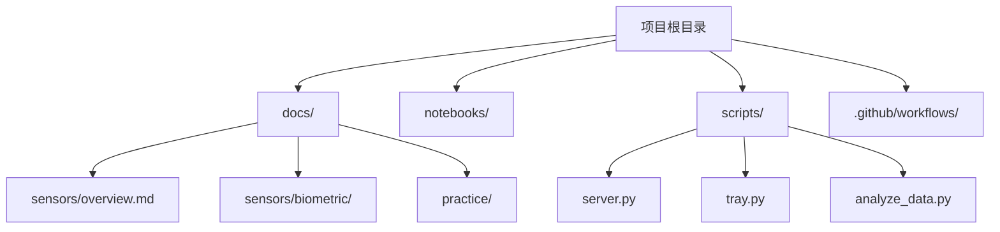
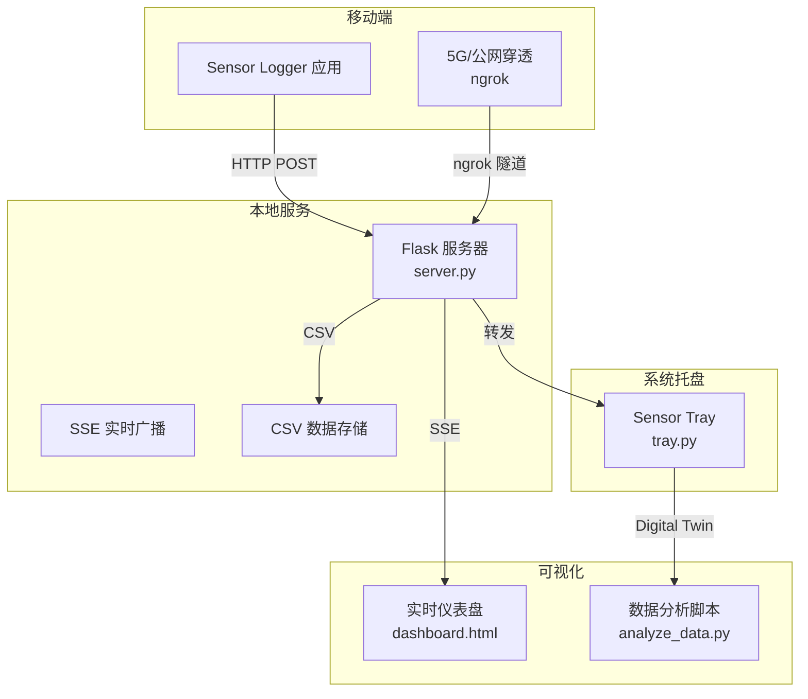
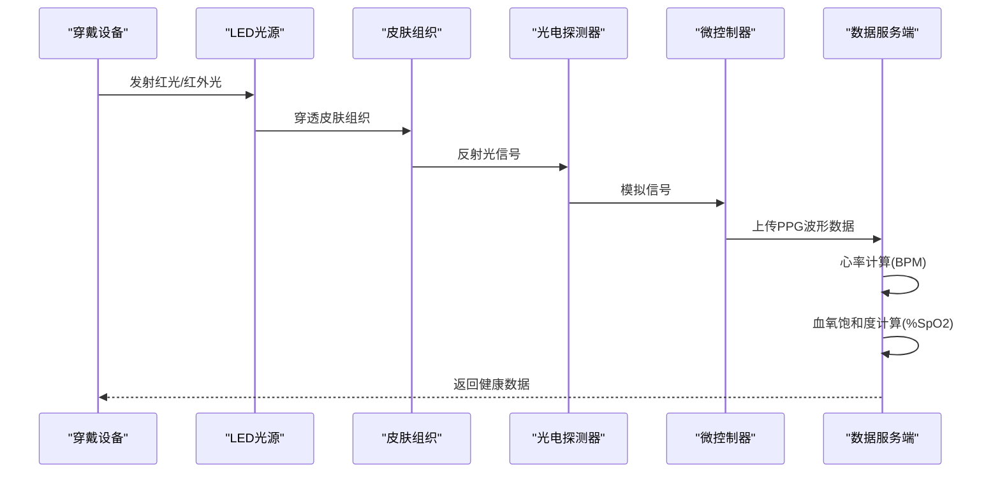
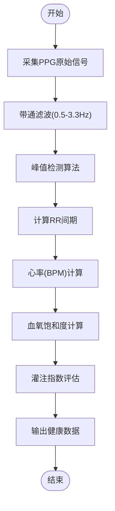
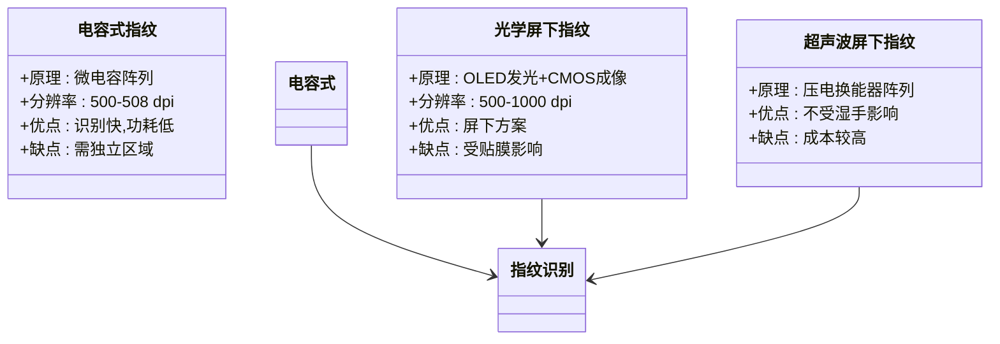
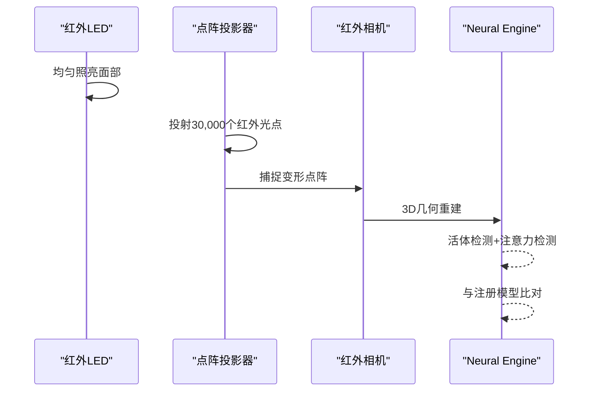
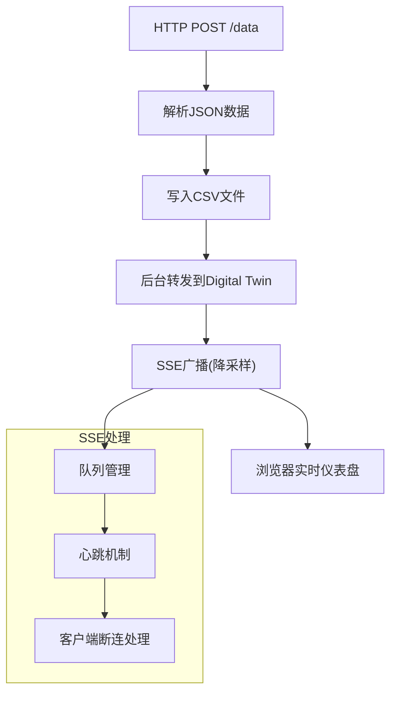
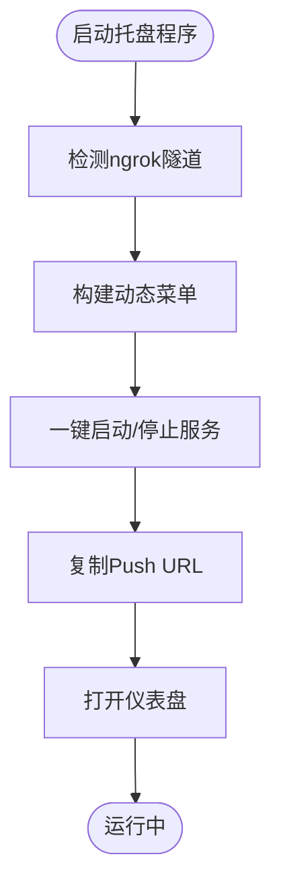
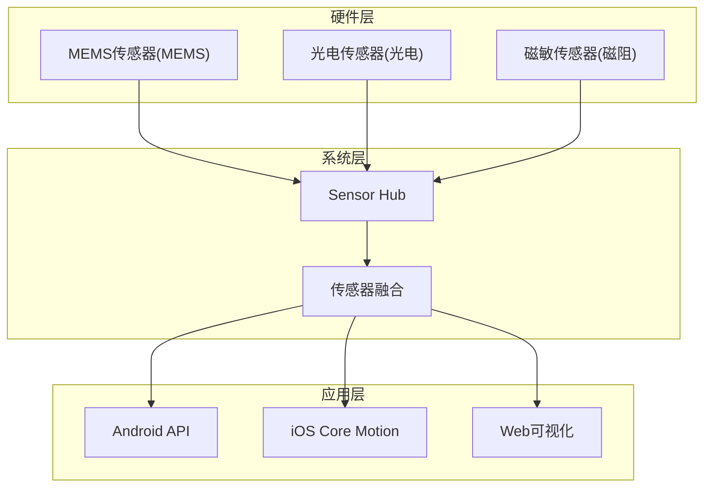
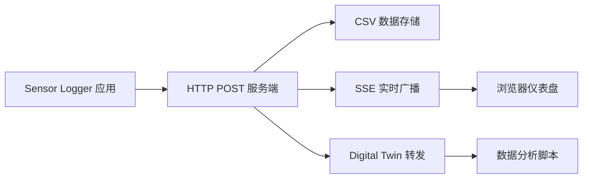

# 健康监测传感器

<cite>
**本文档引用的文件**
- [README.md](file://README.md)
- [docs/sensors/biometric/health.md](file://docs/sensors/biometric/health.md)
- [docs/sensors/biometric/index.md](file://docs/sensors/biometric/index.md)
- [docs/sensors/biometric/fingerprint.md](file://docs/sensors/biometric/fingerprint.md)
- [docs/sensors/biometric/face.md](file://docs/sensors/biometric/face.md)
- [docs/sensors/overview.md](file://docs/sensors/overview.md)
- [docs/practice/data-collection.md](file://docs/practice/data-collection.md)
- [scripts/server.py](file://scripts/server.py)
- [scripts/tray.py](file://scripts/tray.py)
- [scripts/analyze_data.py](file://scripts/analyze_data.py)
- [notebooks/sensor_demo.ipynb](file://notebooks/sensor_demo.ipynb)
</cite>

## 目录
1. [项目简介](#项目简介)
2. [项目结构](#项目结构)
3. [核心组件](#核心组件)
4. [架构总览](#架构总览)
5. [详细组件分析](#详细组件分析)
6. [依赖关系分析](#依赖关系分析)
7. [性能考虑](#性能考虑)
8. [故障排除指南](#故障排除指南)
9. [结论](#结论)
10. [附录](#附录)

## 项目简介
本项目是一套面向高校教学的智能手机传感器技术文档与实践平台，涵盖从硬件原理到编程实践的完整知识体系。项目采用 MkDocs + Material 主题，提供中文技术文档与交互式演示，重点包括：
- 传感器总览与分类体系
- 生物识别与健康监测技术
- 传感器数据采集与分析
- 实时数据流与可视化仪表盘
- 5G公网穿透与远程数据采集

## 项目结构
项目采用模块化组织，主要包含以下目录：
- docs/：技术文档，涵盖传感器原理、生物识别、实践指南等
- notebooks/：交互式演示程序（Google Colab）
- scripts/：数据采集与服务端脚本
- .github/workflows/：自动化部署工作流

**图表来源**
- [README.md:18-55](file://README.md#L18-L55)

**章节来源**
- [README.md:18-55](file://README.md#L18-L55)

## 核心组件
本项目围绕健康监测传感器（特别是PPG心率与血氧技术）构建，核心组件包括：

### 1. PPG心率与血氧技术
- PPG原理：利用光照射皮肤，检测因血液脉动引起的光吸收变化
- 心率计算：基于RR间期计算（BPM）
- 血氧饱和度：利用红光与红外光吸收差异，通过经验公式计算

### 2. 生物识别技术
- 指纹识别：电容式、光学屏下、超声波屏下三种技术对比
- 面部识别：结构光（TrueDepth）与ToF技术
- PPG生物识别：心率与血氧监测

### 3. 数据采集与分析
- 实时数据流：HTTP POST接收与SSE广播
- 本地服务：Flask服务端，支持ngrok公网穿透
- 数据分析：CSV数据处理与可视化

**章节来源**
- [docs/sensors/biometric/health.md:1-215](file://docs/sensors/biometric/health.md#L1-L215)
- [docs/sensors/biometric/index.md:1-18](file://docs/sensors/biometric/index.md#L1-L18)
- [docs/sensors/biometric/fingerprint.md:1-234](file://docs/sensors/biometric/fingerprint.md#L1-L234)
- [docs/sensors/biometric/face.md:1-191](file://docs/sensors/biometric/face.md#L1-L191)

## 架构总览
系统采用客户端-服务端-云端三层架构，支持本地与公网两种数据采集模式。

**图表来源**
- [scripts/server.py:1-238](file://scripts/server.py#L1-L238)
- [scripts/tray.py:1-276](file://scripts/tray.py#L1-L276)

## 详细组件分析

### PPG心率与血氧监测系统
PPG技术通过光电容积描记法检测脉搏波，实现心率与血氧饱和度测量。

**图表来源**
- [docs/sensors/biometric/health.md:16-82](file://docs/sensors/biometric/health.md#L16-L82)

#### PPG信号处理流程

**图表来源**
- [docs/sensors/biometric/health.md:39-52](file://docs/sensors/biometric/health.md#L39-L52)

**章节来源**
- [docs/sensors/biometric/health.md:16-141](file://docs/sensors/biometric/health.md#L16-L141)

### 生物识别技术组件

#### 指纹识别技术对比

**图表来源**
- [docs/sensors/biometric/fingerprint.md:10-86](file://docs/sensors/biometric/fingerprint.md#L10-L86)

**章节来源**
- [docs/sensors/biometric/fingerprint.md:1-234](file://docs/sensors/biometric/fingerprint.md#L1-L234)

#### 面部识别技术

**图表来源**
- [docs/sensors/biometric/face.md:26-38](file://docs/sensors/biometric/face.md#L26-L38)

**章节来源**
- [docs/sensors/biometric/face.md:1-191](file://docs/sensors/biometric/face.md#L1-L191)

### 数据采集与服务端组件

#### Flask数据接收服务

**图表来源**
- [scripts/server.py:36-85](file://scripts/server.py#L36-L85)

**章节来源**
- [scripts/server.py:1-238](file://scripts/server.py#L1-L238)

#### 系统托盘管理器

**图表来源**
- [scripts/tray.py:189-244](file://scripts/tray.py#L189-L244)

**章节来源**
- [scripts/tray.py:1-276](file://scripts/tray.py#L1-L276)

## 依赖关系分析

### 传感器技术依赖

**图表来源**
- [docs/sensors/overview.md:98-146](file://docs/sensors/overview.md#L98-L146)

**章节来源**
- [docs/sensors/overview.md:1-146](file://docs/sensors/overview.md#L1-L146)

### 数据流依赖

**图表来源**
- [scripts/server.py:36-85](file://scripts/server.py#L36-L85)

**章节来源**
- [scripts/server.py:1-238](file://scripts/server.py#L1-L238)

## 性能考虑
基于项目文档中的技术要点，以下是健康监测传感器的性能优化建议：

### 1. PPG信号处理性能
- **采样率优化**：根据奈奎斯特定理，采样率≥2×3.3Hz≈7Hz；推荐25-100Hz用于HRV分析
- **信噪比提升**：多波长补偿、加速度计参考、多PD布局抑制共模噪声
- **灌注指数PI**：PI>2%为优秀，0.5-2%一般，<0.5%差

### 2. 传感器融合性能
- **9轴融合**：加速度计+陀螺仪+磁力计，使用互补滤波、Madgwick、EKF算法
- **6轴融合**：加速度计+陀螺仪，输出相对姿态
- **线性加速度**：去除重力后的加速度，使用高通滤波

### 3. 实时数据处理性能
- **降采样策略**：SSE广播使用stride=5，从100Hz降至20Hz
- **内存管理**：最大队列大小50，避免内存溢出
- **并发处理**：多线程处理转发与广播

## 故障排除指南

### 1. 数据采集问题
- **ngrok隧道连接失败**：检查authtoken配置，确保端口未被占用
- **数据接收失败**：确认Push URL正确，检查防火墙设置
- **CSV文件写入权限**：确保data/目录有写入权限

### 2. 实时仪表盘问题
- **SSE连接断开**：检查网络连接，查看浏览器控制台错误
- **数据延迟**：调整降采样参数，检查服务器负载
- **心跳机制失效**：确认服务器正常运行，检查超时设置

### 3. 传感器数据质量问题
- **PPG信号异常**：检查设备佩戴是否紧密，避免运动伪影
- **心率测量不准**：确保手指完全覆盖LED光源，避免光线干扰
- **血氧饱和度异常**：检查手指甲油颜色，避免强光直射

**章节来源**
- [scripts/server.py:24-85](file://scripts/server.py#L24-L85)
- [scripts/tray.py:75-119](file://scripts/tray.py#L75-L119)

## 结论
本项目提供了完整的健康监测传感器技术解决方案，涵盖了PPG心率与血氧监测、生物识别技术、数据采集与分析等核心功能。通过Flask服务端与系统托盘管理器，实现了从移动端到云端的完整数据流。项目文档详细阐述了技术原理、实现细节与最佳实践，为高校教学与工程实践提供了宝贵的参考资料。

## 附录

### A. 技术规范与标准
- **心率测量精度**：±2-5 BPM（静息），±5-10 BPM（运动）
- **血氧饱和度精度**：±2%
- **采样率要求**：≥7 Hz，推荐25-100 Hz
- **灌注指数PI**：>2%优秀，0.5-2%一般，<0.5%差

### B. 应用领域规范
- **健身追踪**：PPG心率监测，运动强度评估
- **医疗监护**：连续心电监测，异常心律检测
- **睡眠监测**：夜间心率变异性分析，睡眠质量评估

### C. 数据解读指南
- **心率范围**：静息40-100 BPM，运动可达200 BPM以上
- **血氧饱和度**：正常95-100%，低于90%需医疗关注
- **HRV分析**：反映自主神经系统平衡，健康人群HRV较高

**章节来源**
- [docs/sensors/biometric/health.md:108-141](file://docs/sensors/biometric/health.md#L108-L141)