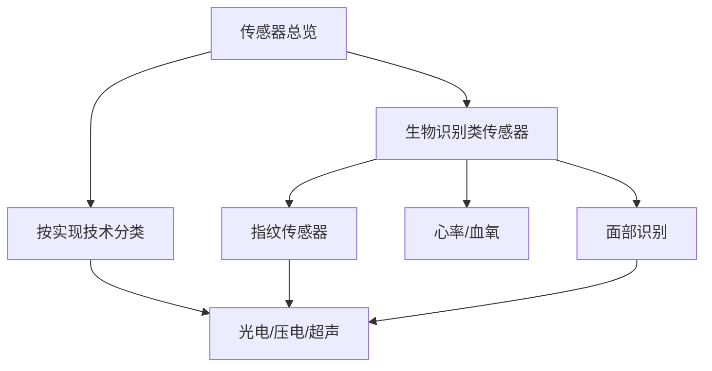
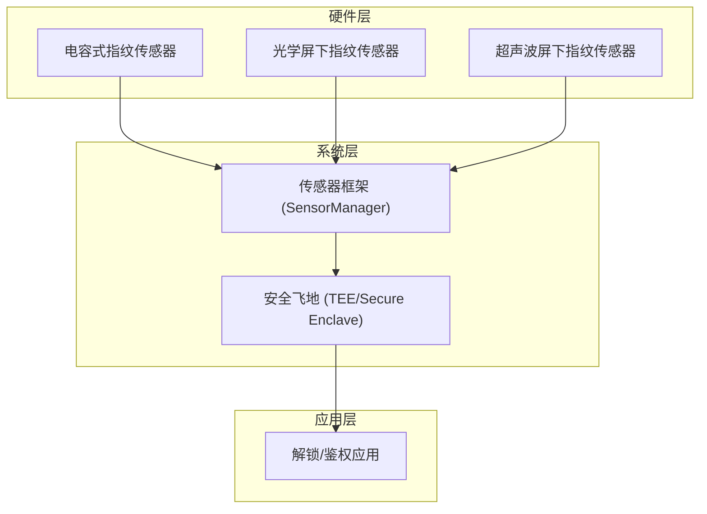
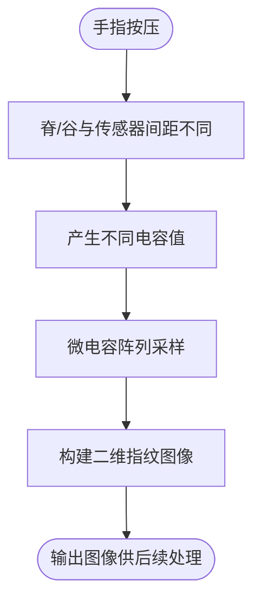
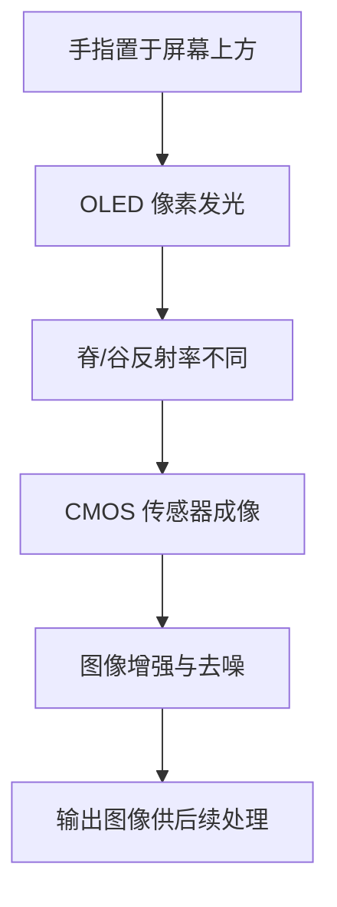
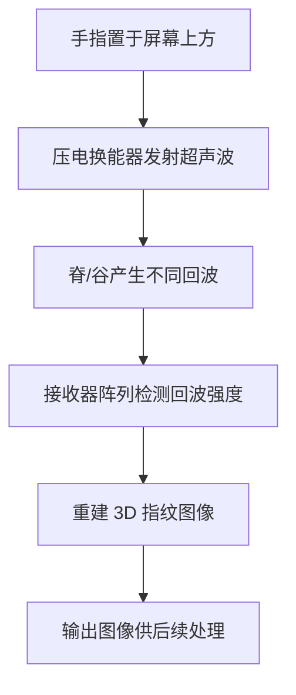
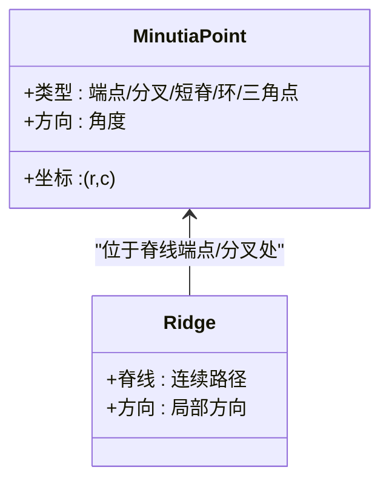
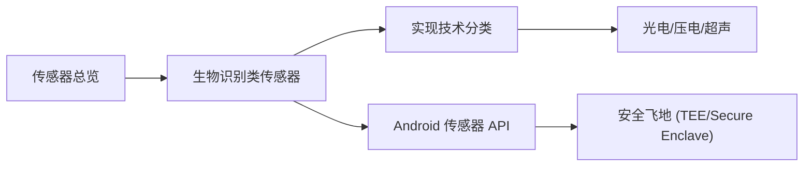

# 指纹传感器

<cite>
**本文引用的文件**
- [指纹传感器](file://docs/sensors/biometric/fingerprint.md)
- [生物识别类传感器](file://docs/sensors/biometric/index.md)
- [传感器总览](file://docs/sensors/overview.md)
- [Android 传感器 API](file://docs/programming/android.md)
- [数据采集实验](file://docs/practice/data-collection.md)
- [NFC 安全与支付](file://docs/sensors/others/nfc.md)
- [面部识别传感器](file://docs/sensors/biometric/face.md)
</cite>

## 目录
1. [简介](#简介)
2. [项目结构](#项目结构)
3. [核心组件](#核心组件)
4. [架构总览](#架构总览)
5. [详细组件分析](#详细组件分析)
6. [依赖关系分析](#依赖关系分析)
7. [性能考量](#性能考量)
8. [故障排查指南](#故障排查指南)
9. [结论](#结论)
10. [附录](#附录)

## 简介
本文件围绕指纹传感器展开，系统梳理三大主流技术路径：电容式指纹传感器（像素阵列结构、电容变化检测）、光学屏下指纹传感器（光源反射、图像增强算法）、超声波屏下指纹传感器（深层成像技术）。同时覆盖指纹纹路分类（环形、螺旋、弓形）、特征点提取算法（端点、分叉、短脊、环、三角点）、活体检测与防欺骗措施（汗腺识别、皮肤弹性检测、假指套与照片攻击防护）、指纹数据安全存储与隐私保护策略（模板加密、安全芯片），以及典型应用场景（手机解锁、门禁系统、考勤打卡）的技术实现要点。

## 项目结构
本仓库将指纹传感器作为“生物识别类传感器”的一部分，与面部识别、心率/血氧等共同组织在传感器文档体系中；同时在“传感器总览”中给出按物理量与实现技术的分类视角，并在“编程”章节提供 Android 传感器 API 的使用说明，便于理解指纹识别在移动平台的系统集成方式。

图表来源
- [传感器总览:19-63](file://docs/sensors/overview.md#L19-L63)
- [生物识别类传感器:1-18](file://docs/sensors/biometric/index.md#L1-L18)

章节来源
- [传感器总览:19-63](file://docs/sensors/overview.md#L19-L63)
- [生物识别类传感器:1-18](file://docs/sensors/biometric/index.md#L1-L18)

## 核心组件
- 电容式指纹传感器：基于微电容阵列，通过脊与谷与传感器表面距离不同产生的电容差异形成二维图像，具备识别速度快、功耗低的特点，但需独立区域且不支持屏下。
- 光学屏下指纹传感器：利用 OLED 像素发光照亮手指，CMOS 传感器捕捉反射光形成图像；具备屏下一体化优势，但受屏幕贴膜与强光干扰。
- 超声波屏下指纹传感器：通过压电换能器阵列发射/接收超声波，遇脊与谷反射回波强度不同，形成 3D 指纹图像，具备湿手、油污、贴膜不敏感的优势，安全性更高，成本也更高。
- 特征点提取：端点（Ending）、分叉（Bifurcation）、短脊（Short Ridge）、环（Island）、三角点（Delta），典型指纹含 40–100 个特征点，匹配时通常只需 12–15 个点对齐即可确认身份。
- 安全与隐私：现代手机指纹匹配全流程通常在 200–500 ms 内完成，匹配算法运行在安全飞地（TEE/Secure Enclave）内，指纹模板不出安全区域；同时提供 FAR/FRR 指标与模板大小对比，超声波方案在安全性与模板体积上更具优势。

章节来源
- [指纹传感器:10-126](file://docs/sensors/biometric/fingerprint.md#L10-L126)
- [生物识别类传感器:9-17](file://docs/sensors/biometric/index.md#L9-L17)

## 架构总览
指纹识别系统在移动终端的典型架构包括：传感器硬件（电容/光学/超声波）、图像采集与预处理、特征提取与模板生成、安全飞地中的匹配与比对、以及应用层的解锁/鉴权调用。Android 端通过传感器框架访问底层硬件，结合安全模块保障生物特征数据的处理与存储。

图表来源
- [Android 传感器 API:8-18](file://docs/programming/android.md#L8-L18)
- [指纹传感器:123-126](file://docs/sensors/biometric/fingerprint.md#L123-L126)

## 详细组件分析

### 电容式指纹传感器
- 工作原理：指纹脊与谷与传感器表面距离不同，导致电容值不同，形成二维图像。
- 特性：识别速度快、功耗低；需独立区域，不支持屏下；分辨率约 500–508 dpi。
- 代表芯片：FPC1028、汇顶 GF318M。

图表来源
- [指纹传感器:10-33](file://docs/sensors/biometric/fingerprint.md#L10-L33)

章节来源
- [指纹传感器:10-33](file://docs/sensors/biometric/fingerprint.md#L10-L33)

### 光学屏下指纹传感器
- 工作原理：OLED 像素发光照亮手指，CMOS 传感器捕捉反射光形成图像；通过光学准直层过滤杂散光。
- 特性：屏下一体化；受屏幕贴膜与强光干扰；分辨率 500–1000 dpi。
- 代表芯片：汇顶 G7、新思 FS9530。

图表来源
- [指纹传感器:36-61](file://docs/sensors/biometric/fingerprint.md#L36-L61)

章节来源
- [指纹传感器:36-61](file://docs/sensors/biometric/fingerprint.md#L36-L61)

### 超声波屏下指纹传感器
- 工作原理：压电换能器阵列发射/接收超声波，遇脊/谷反射回波强度不同，形成 3D 指纹图像。
- 特性：不受贴膜、湿手、油污影响；3D 成像安全性更高；成本较高；识别面积可扩展至更大。
- 代表芯片：Qualcomm 3D Sonic Gen 2。

图表来源
- [指纹传感器:64-86](file://docs/sensors/biometric/fingerprint.md#L64-L86)

章节来源
- [指纹传感器:64-86](file://docs/sensors/biometric/fingerprint.md#L64-L86)

### 指纹纹路分类与特征点提取
- 纹路分类：环形、螺旋、弓形等（仓库未给出具体分类图示，此处为通用概念说明）。
- 特征点类型：端点（Ending）、分叉（Bifurcation）、短脊（Short Ridge）、环（Island）、三角点（Delta）。
- 典型指纹包含 40–100 个特征点，匹配时通常只需 12–15 个点对齐即可确认身份。

图表来源
- [指纹传感器:129-152](file://docs/sensors/biometric/fingerprint.md#L129-L152)

章节来源
- [指纹传感器:129-152](file://docs/sensors/biometric/fingerprint.md#L129-L152)

### 活体检测与防欺骗
- 活体检测：汗腺识别、皮肤弹性检测等（仓库未给出具体实现细节，此处为通用概念说明）。
- 防欺骗：针对假指套、照片攻击等，超声波方案具备更强抗欺骗能力（3D 成像）；光学方案在强光与贴膜条件下可能受影响。

章节来源
- [指纹传感器:89-100](file://docs/sensors/biometric/fingerprint.md#L89-L100)

### 安全与隐私：模板加密与安全芯片
- 匹配速度：现代手机指纹匹配全流程通常在 200–500 ms 内完成。
- 安全飞地：匹配算法运行在 TEE/Secure Enclave 内，指纹模板不会离开安全区域。
- 模板大小：电容式/光学屏下约 5–10 KB；超声波屏下约 10–20 KB（3D）。
- 对比：超声波方案在 FAR/FRR 与安全性方面更具优势。

章节来源
- [指纹传感器:115-126](file://docs/sensors/biometric/fingerprint.md#L115-L126)

### 应用场景与实现要点
- 手机解锁：指纹识别作为系统级生物特征解锁入口，匹配在安全飞地执行，确保模板安全。
- 门禁系统：可采用屏下超声波方案，兼顾安全性与用户体验；配合安全芯片存储密钥与模板。
- 考勤打卡：结合移动端指纹采集与云端模板比对，注意网络传输与本地缓存策略，确保隐私合规。

章节来源
- [Android 传感器 API:8-18](file://docs/programming/android.md#L8-L18)
- [NFC 安全与支付:33-42](file://docs/sensors/others/nfc.md#L33-L42)

## 依赖关系分析
- 技术分类：指纹传感器属于“生物识别类”，在“按实现技术分类”中归入“光电/压电/超声”类别。
- 系统集成：Android 传感器框架负责统一接入底层硬件，指纹识别作为生物特征输入之一。
- 安全依赖：指纹模板与匹配算法依赖安全飞地（TEE/Secure Enclave）以保障数据安全。

图表来源
- [传感器总览:51-63](file://docs/sensors/overview.md#L51-L63)
- [生物识别类传感器:9-17](file://docs/sensors/biometric/index.md#L9-L17)
- [Android 传感器 API:8-18](file://docs/programming/android.md#L8-L18)

章节来源
- [传感器总览:51-63](file://docs/sensors/overview.md#L51-L63)
- [生物识别类传感器:9-17](file://docs/sensors/biometric/index.md#L9-L17)
- [Android 传感器 API:8-18](file://docs/programming/android.md#L8-L18)

## 性能考量
- 分辨率与图像质量：FBI/ISO 标准要求≥500 dpi，典型手机传感器可达 500–1000 dpi；灰度级 8-bit 或更高；成像面积≥1"×1"。
- FAR/FRR：电容式/光学屏下约 1/50,000；超声波屏下约 1/100,000；模板大小随技术而异。
- 匹配速度：200–500 ms 内完成采集→特征提取→比对；匹配在安全飞地执行。

章节来源
- [指纹传感器:105-126](file://docs/sensors/biometric/fingerprint.md#L105-L126)

## 故障排查指南
- 识别速度异常：检查传感器采样率与图像质量是否满足≥500 dpi；确认安全飞地资源是否受限。
- 湿手/油污/贴膜影响：优先采用超声波屏下方案；若使用光学屏下，建议清洁屏幕与手指表面。
- 活体检测失败：确保皮肤弹性与汗腺信号正常；避免使用假指套或照片攻击。
- 模板安全：确认指纹模板未离开安全飞地，匹配算法在 TEE/Secure Enclave 内执行。

章节来源
- [指纹传感器:89-126](file://docs/sensors/biometric/fingerprint.md#L89-L126)

## 结论
指纹传感器在移动设备中扮演着重要角色。电容式方案成熟、快速省电；光学屏下方案一体化程度高但易受外部条件影响；超声波屏下方案在安全性、抗欺骗与湿手/油污环境下表现最优。结合安全飞地与模板加密策略，可在保证识别效率的同时最大化隐私与安全。在实际应用中，应根据场景需求（手机解锁、门禁、考勤）选择合适的技术路径，并配套完善的安全与隐私机制。

## 附录
- 代码示例路径（用于理解指纹脊线与特征点检测的算法思想）：
  - [模拟指纹脊线图案:157-184](file://docs/sensors/biometric/fingerprint.md#L157-L184)
  - [简易细节特征点检测:186-226](file://docs/sensors/biometric/fingerprint.md#L186-L226)
- 数据采集与分析参考（传感器数据采集与处理思路可迁移至指纹数据）：
  - [数据采集实验:1-192](file://docs/practice/data-collection.md#L1-L192)