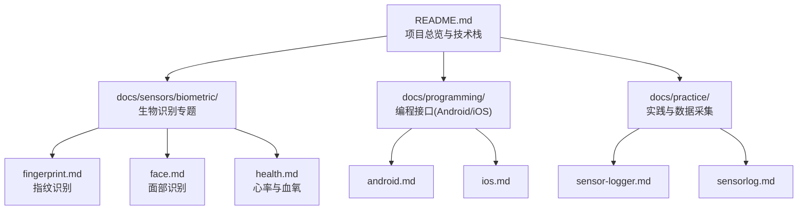
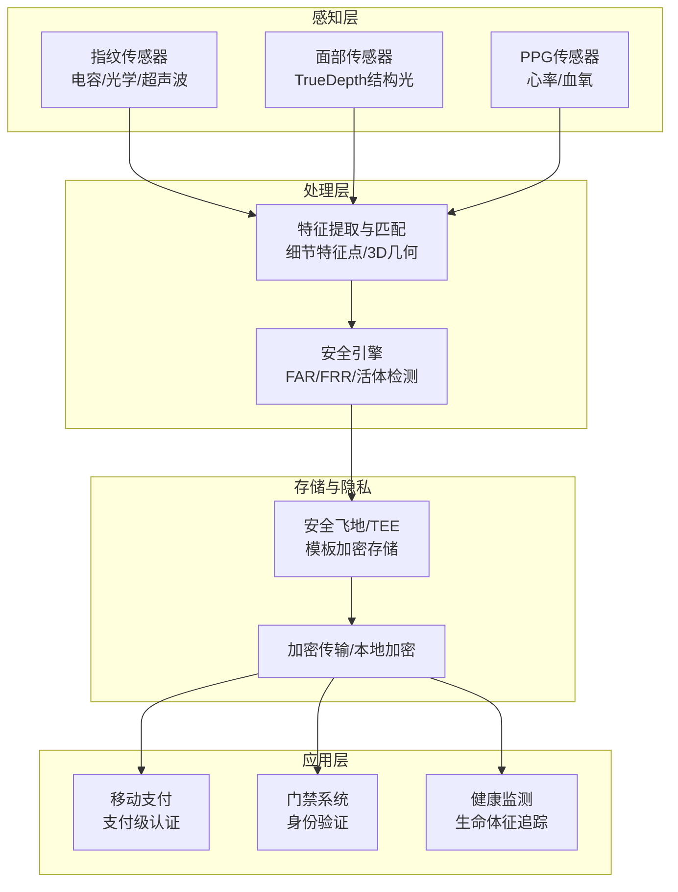
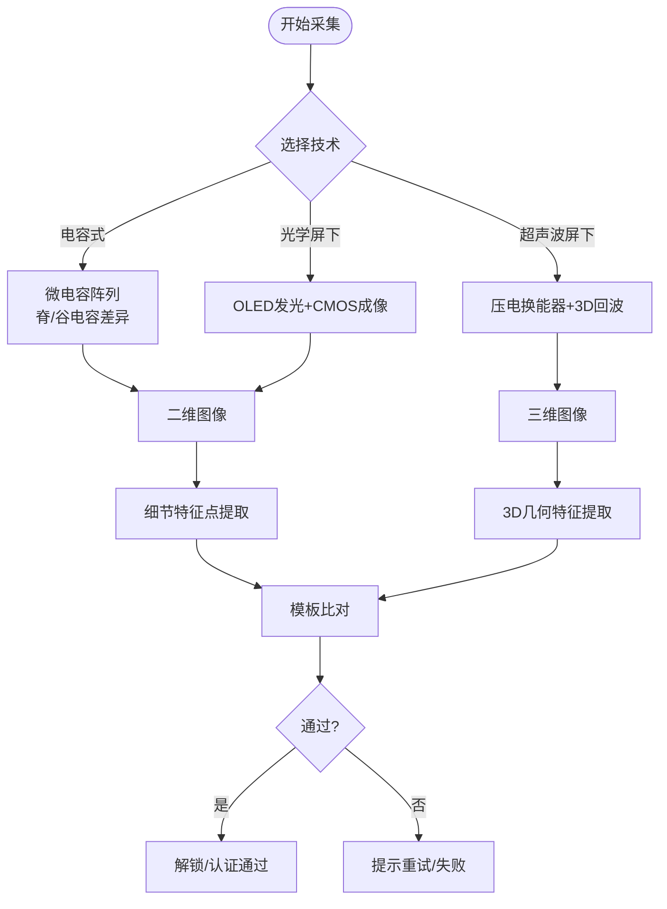
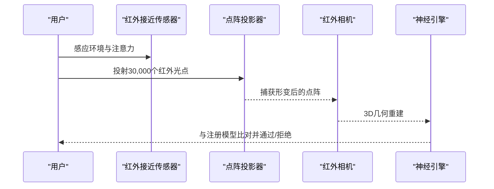
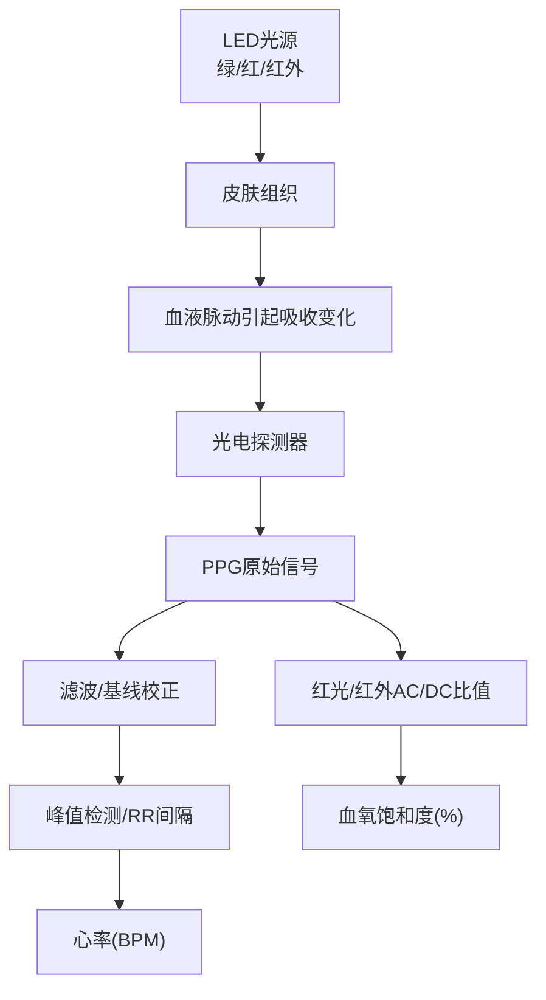
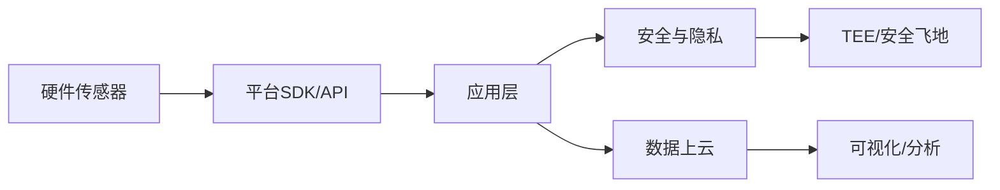

# 生物识别传感器

<cite>
**本文引用的文件**
- [README.md](file://README.md)
- [index.md](file://docs/index.md)
- [overview.md](file://docs/sensors/overview.md)
- [fingerprint.md](file://docs/sensors/biometric/fingerprint.md)
- [face.md](file://docs/sensors/biometric/face.md)
- [health.md](file://docs/sensors/biometric/health.md)
- [android.md](file://docs/programming/android.md)
- [ios.md](file://docs/programming/ios.md)
- [sensor-logger.md](file://docs/practice/sensor-logger.md)
- [sensorlog.md](file://docs/practice/sensorlog.md)
</cite>

## 目录
1. [引言](#引言)
2. [项目结构](#项目结构)
3. [核心组件](#核心组件)
4. [架构总览](#架构总览)
5. [详细组件分析](#详细组件分析)
6. [依赖关系分析](#依赖关系分析)
7. [性能考量](#性能考量)
8. [故障排查指南](#故障排查指南)
9. [结论](#结论)
10. [附录](#附录)

## 引言
本文件围绕生物识别传感器展开，系统梳理指纹识别、面部识别、心率与血氧检测等技术原理与安全特性，并结合移动端编程接口与数据采集实践，给出可落地的应用与工程化建议。内容覆盖：
- 指纹识别：电容式、光学屏下、超声波屏下三种技术的成像原理、优缺点与对比
- 面部识别：TrueDepth结构光系统与3D面部识别算法、活体检测与防欺骗策略
- 心率与血氧：PPG技术原理、双波长吸收差异、信号处理与质量评估
- 安全与隐私：误识率(FAR)、拒识率(FRR)、TEE/安全飞地、活体检测与防欺骗
- 应用场景：移动支付、门禁系统、健康监测
- 实践：Android/iOS传感器API、数据采集与上云方案

## 项目结构
该项目采用Docs-as-Code工作流，文档以Markdown为主，辅以交互演示与数据采集工具链，便于教学与实验实践。

图表来源
- [README.md:18-56](file://README.md#L18-L56)

章节来源
- [README.md:18-56](file://README.md#L18-L56)

## 核心组件
- 指纹识别：电容式、光学屏下、超声波屏下三大技术路径，分别适用于不同屏幕与成本约束
- 面部识别：TrueDepth结构光系统，结合红外投影与深度相机实现3D重建与活体检测
- 心率与血氧：PPG技术，利用绿光、红光与红外光对血容量与血红蛋白吸收差异进行测量
- 安全与隐私：FAR/FRR指标、TEE/安全飞地、活体检测(PAD)、防欺骗策略
- 编程接口：Android SensorManager与iOS Core Motion，提供统一的传感器访问与融合能力
- 数据采集与上云：Sensor Logger/SensorLog支持HTTP/MQTT/离线导出，适配课堂与个人实验

章节来源
- [fingerprint.md:8-100](file://docs/sensors/biometric/fingerprint.md#L8-L100)
- [face.md:8-121](file://docs/sensors/biometric/face.md#L8-L121)
- [health.md:3-104](file://docs/sensors/biometric/health.md#L3-L104)
- [android.md:8-50](file://docs/programming/android.md#L8-L50)
- [ios.md:8-61](file://docs/programming/ios.md#L8-L61)
- [sensor-logger.md:24-71](file://docs/practice/sensor-logger.md#L24-L71)
- [sensorlog.md:20-32](file://docs/practice/sensorlog.md#L20-L32)

## 架构总览
从“硬件感知—软件处理—安全存储—应用集成”的角度，生物识别系统可抽象为如下层次：

图表来源
- [fingerprint.md:129-152](file://docs/sensors/biometric/fingerprint.md#L129-L152)
- [face.md:39-48](file://docs/sensors/biometric/face.md#L39-L48)
- [health.md:16-30](file://docs/sensors/biometric/health.md#L16-L30)

## 详细组件分析

### 指纹识别技术
- 电容式指纹：通过微电容阵列在手指脊/谷间形成电容差异，构建二维指纹图像；识别速度快、功耗低，但需独立区域且不支持屏下
- 光学屏下指纹：OLED像素发光照亮手指，CMOS传感器采集反射光形成图像；支持屏下，但受屏幕贴膜与强光影响
- 超声波屏下指纹：压电换能器阵列发射/接收超声波，基于脊/谷反射回波形成3D图像；抗湿手、抗油污，安全性更高，成本较高

图表来源
- [fingerprint.md:10-86](file://docs/sensors/biometric/fingerprint.md#L10-L86)
- [fingerprint.md:129-152](file://docs/sensors/biometric/fingerprint.md#L129-L152)

章节来源
- [fingerprint.md:8-100](file://docs/sensors/biometric/fingerprint.md#L8-L100)
- [fingerprint.md:103-126](file://docs/sensors/biometric/fingerprint.md#L103-L126)
- [fingerprint.md:129-152](file://docs/sensors/biometric/fingerprint.md#L129-L152)

### 面部识别与TrueDepth系统
- 硬件组成：泛光感应器(940nm近红外)、点阵投影器(VCSEL+DOE)、红外相机、前置RGB相机
- 结构光原理：点阵投影器投射规则点阵，经面部表面形变后由红外相机捕获，三角测量恢复3D几何
- 安全性：FAR<1/1,000,000，结合红外+注意力检测(眼睛注视)+深度信息抵御照片/视频与面具攻击

图表来源
- [face.md:10-48](file://docs/sensors/biometric/face.md#L10-L48)
- [face.md:126-156](file://docs/sensors/biometric/face.md#L126-L156)

章节来源
- [face.md:8-121](file://docs/sensors/biometric/face.md#L8-L121)
- [face.md:124-183](file://docs/sensors/biometric/face.md#L124-L183)

### 心率与血氧(PPG)技术
- 心率：PPG利用光照射皮肤，检测因心动周期引起的光吸收变化；绿光对血容量变化最敏感，适合手腕心率
- 血氧：利用HbO₂与Hb对红光(660nm)与红外(940nm)吸收差异，通过AC/DC比值计算SpO₂
- 信号处理：采样率≥奈奎斯特，推荐25–100Hz；多波长补偿、加速度计参考、多PD差分抑制噪声；灌注指数PI评估信号质量

图表来源
- [health.md:16-51](file://docs/sensors/biometric/health.md#L16-L51)
- [health.md:66-82](file://docs/sensors/biometric/health.md#L66-L82)
- [health.md:146-206](file://docs/sensors/biometric/health.md#L146-L206)

章节来源
- [health.md:3-104](file://docs/sensors/biometric/health.md#L3-L104)
- [health.md:108-141](file://docs/sensors/biometric/health.md#L108-L141)

### 安全与隐私：FAR/FRR、活体检测与防欺骗
- FAR与FRR：误识率与拒识率互斥权衡，FAR越低安全性越高，但可能提高FRR
- 活体检测(PAD)：ISO 30107标准评估抵御呈现攻击能力；结构光/ToF具备深度信息优势
- 防欺骗：照片/视频攻击在2D RGB易被攻破，结构光/ToF+红外纹理有效抵御面具与注意力检测

章节来源
- [face.md:80-110](file://docs/sensors/biometric/face.md#L80-L110)
- [face.md:113-121](file://docs/sensors/biometric/face.md#L113-L121)
- [fingerprint.md:115-122](file://docs/sensors/biometric/fingerprint.md#L115-L122)

### 编程接口与应用集成
- Android：SensorManager提供统一接口，支持多传感器同时采集、批处理降低功耗；危险权限如心率需运行时授权
- iOS：Core Motion提供高质量融合数据(CMDeviceMotion)，支持后台任务与生命周期管理；注意单位差异与权限配置

章节来源
- [android.md:21-50](file://docs/programming/android.md#L21-L50)
- [android.md:156-195](file://docs/programming/android.md#L156-L195)
- [ios.md:29-61](file://docs/programming/ios.md#L29-L61)
- [ios.md:124-161](file://docs/programming/ios.md#L124-L161)

### 数据采集与上云实践
- Sensor Logger：支持HTTP POST/MQTT/离线导出，提供实时仪表盘与数据库存储方案，适合课堂多人同时采集
- SensorLog：iOS专用，支持TCP/UDP/HTTP/UDP推送，提供Flask/AWS/阿里云等上云方案

章节来源
- [sensor-logger.md:24-71](file://docs/practice/sensor-logger.md#L24-L71)
- [sensor-logger.md:74-179](file://docs/practice/sensor-logger.md#L74-L179)
- [sensor-logger.md:236-346](file://docs/practice/sensor-logger.md#L236-L346)
- [sensorlog.md:20-32](file://docs/practice/sensorlog.md#L20-L32)
- [sensorlog.md:71-177](file://docs/practice/sensorlog.md#L71-L177)
- [sensorlog.md:183-264](file://docs/practice/sensorlog.md#L183-L264)

## 依赖关系分析
- 技术依赖：指纹识别依赖电容/光学/超声波硬件；面部识别依赖结构光/ToF；心率/血氧依赖PPG光电器件
- 平台依赖：Android SensorManager与iOS Core Motion提供跨平台统一接口
- 安全依赖：TEE/安全飞地隔离模板与密钥，FAR/FRR指标指导算法优化
- 数据链路：传感器数据经SDK/API采集，通过HTTP/MQTT上云，支持实时可视化与离线分析

图表来源
- [android.md:8-50](file://docs/programming/android.md#L8-L50)
- [ios.md:8-61](file://docs/programming/ios.md#L8-L61)
- [sensor-logger.md:74-179](file://docs/practice/sensor-logger.md#L74-L179)

章节来源
- [android.md:8-50](file://docs/programming/android.md#L8-L50)
- [ios.md:8-61](file://docs/programming/ios.md#L8-L61)
- [sensor-logger.md:74-179](file://docs/practice/sensor-logger.md#L74-L179)

## 性能考量
- 指纹：识别速度<0.5s，匹配在TEE/安全飞地执行，模板不离安全区域
- 面部：结构光/ToF深度分辨率0.5–1mm，FAR<1/1,000,000，活体检测有效抵御照片/面具
- PPG：采样率25–100Hz满足HRV分析，多波长补偿与加速度计参考提升运动伪影鲁棒性
- 采集：Android批处理模式降低功耗，iOS后台任务需谨慎控制采样率与任务时长

章节来源
- [fingerprint.md:123-126](file://docs/sensors/biometric/fingerprint.md#L123-L126)
- [face.md:92-99](file://docs/sensors/biometric/face.md#L92-L99)
- [health.md:122-129](file://docs/sensors/biometric/health.md#L122-L129)
- [android.md:251-281](file://docs/programming/android.md#L251-L281)
- [ios.md:206-258](file://docs/programming/ios.md#L206-L258)

## 故障排查指南
- 指纹识别
  - 湿手/油污导致识别失败：优先超声波屏下方案
  - 屏幕贴膜影响光学屏下：更换贴膜或改用其他技术
- 面部识别
  - 强光/逆光影响结构光：调整使用角度或环境
  - 照片/面具攻击：启用深度+红外纹理检测
- PPG测量
  - 运动伪影导致噪声：提高采样率、使用多波长补偿与加速度计参考
  - PI过低：检查佩戴松紧与血液循环
- 数据采集
  - HTTP/MQTT连通性问题：检查URL、WSS/TLS、Broker配置
  - 多设备冲突：使用MQTT订阅/发布解耦，合理设置Topic与QoS

章节来源
- [fingerprint.md:58-60](file://docs/sensors/biometric/fingerprint.md#L58-L60)
- [face.md:100-110](file://docs/sensors/biometric/face.md#L100-L110)
- [health.md:110-121](file://docs/sensors/biometric/health.md#L110-L121)
- [sensor-logger.md:252-266](file://docs/practice/sensor-logger.md#L252-L266)
- [sensorlog.md:195-205](file://docs/practice/sensorlog.md#L195-L205)

## 结论
生物识别传感器在移动端已广泛用于身份验证与健康监测。指纹、面部与PPG技术各有侧重：指纹强调速度与成本，面部强调3D深度与活体检测，PPG强调便携与连续监测。工程实践中，应结合平台API、安全飞地与数据上云方案，确保性能、安全与用户体验的平衡。

## 附录
- 应用实例
  - 指纹脊线模拟与细节特征点检测：参见指纹文档中的Python示例路径
  - 结构光深度图模拟与FAR/FRR计算：参见面部文档中的Python示例路径
  - PPG合成信号、峰值检测与SpO₂计算：参见健康文档中的Python示例路径
- 编程接口
  - Android：SensorManager、权限管理、批处理模式
  - iOS：Core Motion、后台任务、生命周期管理
- 数据采集
  - Sensor Logger：HTTP/MQTT/离线导出与可视化
  - SensorLog：iOS专用，支持多种推送协议与云平台集成

章节来源
- [fingerprint.md:155-226](file://docs/sensors/biometric/fingerprint.md#L155-L226)
- [face.md:124-183](file://docs/sensors/biometric/face.md#L124-L183)
- [health.md:144-206](file://docs/sensors/biometric/health.md#L144-L206)
- [android.md:52-153](file://docs/programming/android.md#L52-L153)
- [ios.md:62-161](file://docs/programming/ios.md#L62-L161)
- [sensor-logger.md:74-179](file://docs/practice/sensor-logger.md#L74-L179)
- [sensorlog.md:71-177](file://docs/practice/sensorlog.md#L71-L177)