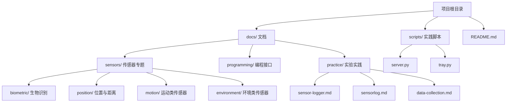
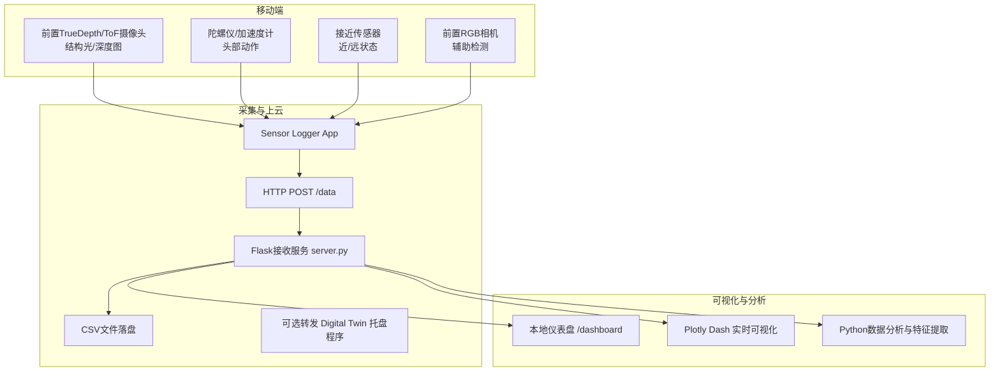
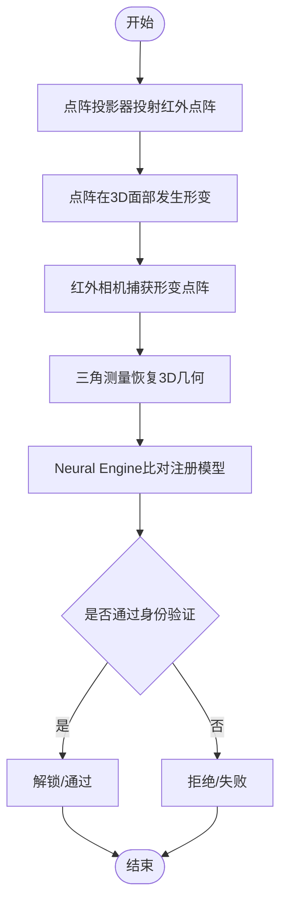
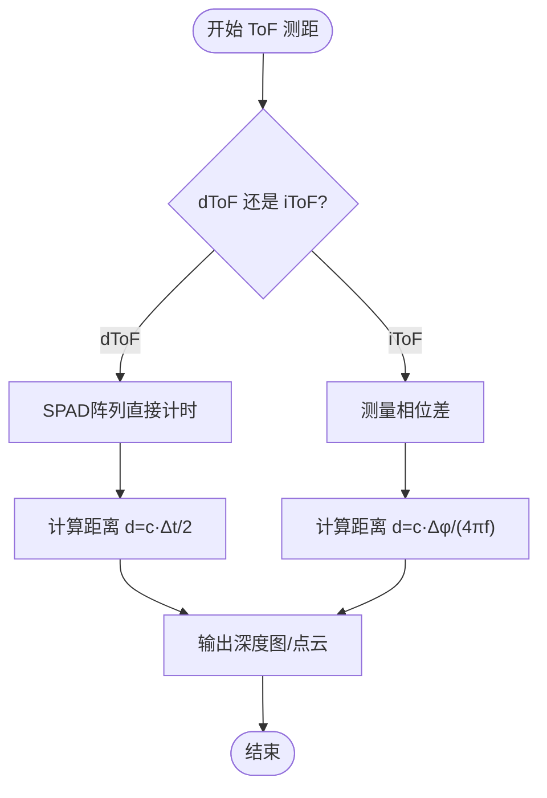
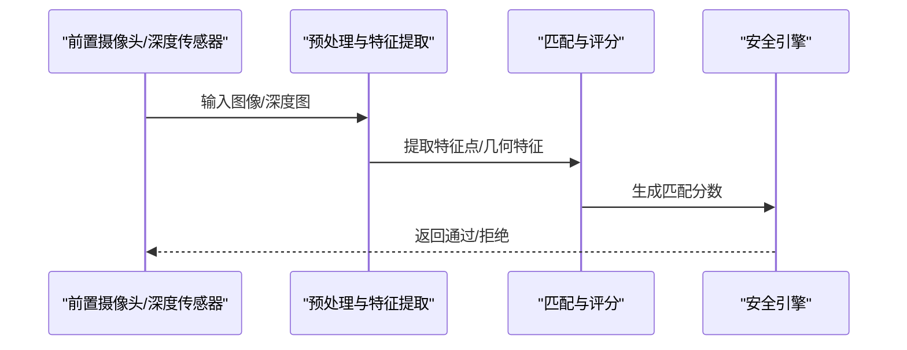
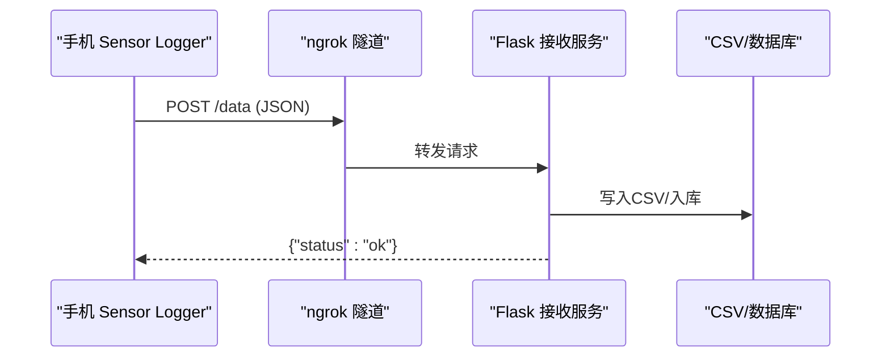
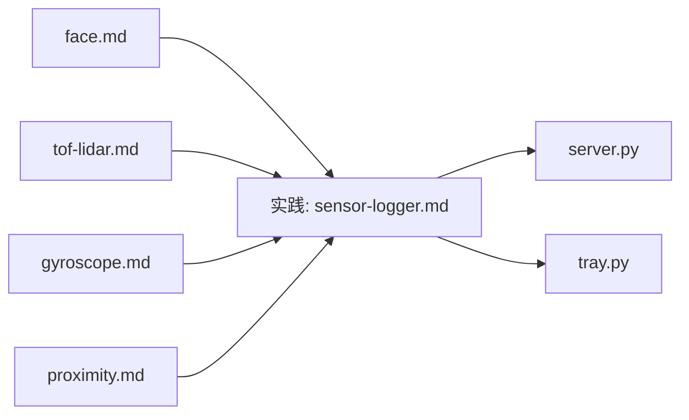

# 面部识别

<cite>
**本文引用的文件**
- [README.md](file://README.md)
- [face.md](file://docs/sensors/biometric/face.md)
- [tof-lidar.md](file://docs/sensors/position/tof-lidar.md)
- [gyroscope.md](file://docs/sensors/motion/gyroscope.md)
- [proximity.md](file://docs/sensors/position/proximity.md)
- [sensor-logger.md](file://docs/practice/sensor-logger.md)
- [server.py](file://scripts/server.py)
- [tray.py](file://scripts/tray.py)
</cite>

## 目录
1. [引言](#引言)
2. [项目结构](#项目结构)
3. [核心组件](#核心组件)
4. [架构总览](#架构总览)
5. [详细组件分析](#详细组件分析)
6. [依赖分析](#依赖分析)
7. [性能考虑](#性能考虑)
8. [故障排查指南](#故障排查指南)
9. [结论](#结论)
10. [附录](#附录)

## 引言
本文件围绕“面部识别传感器”主题，系统梳理真双目结构光（TrueDepth）与ToF（时间飞行）两类主流方案的硬件组成、工作原理、3D建模与身份验证流程，并结合项目中的传感器数据采集与上云实践，给出可操作的应用落地建议。内容覆盖：
- 结构光（TrueDepth）：红外激光器、DLP芯片、三角测量、神经引擎比对、活体检测与抗欺骗
- ToF：dToF/iToF原理、深度图生成与障碍物检测、精度与功耗权衡
- 面部特征点与身份验证：眼距、鼻宽、嘴型等几何特征与阈值策略
- 隐私与安全：本地处理、差分隐私思路、安全存储策略
- 应用场景：Face ID、AR效果、支付验证、数据采集与可视化

## 项目结构
该项目采用Docs-as-Code工作流，文档与实践脚本分离，便于教学与实验复现。

图表来源
- [README.md:18-55](file://README.md#L18-L55)

章节来源
- [README.md:18-55](file://README.md#L18-L55)

## 核心组件
- 面部识别专题文档：系统阐述结构光与ToF原理、安全指标、深度图模拟与FAR/FRR计算
- ToF/LiDAR专题文档：深入dToF/iToF物理机制、芯片与精度、LiDAR硬件结构、AR应用
- 陀螺仪专题文档：为头部动作验证提供运动学基础
- 接近传感器专题文档：为活体检测中的“近/远”状态提供参考
- 实践与数据采集：提供Sensor Logger上云方案、Flask接收服务与系统托盘一键启动

章节来源
- [face.md:8-191](file://docs/sensors/biometric/face.md#L8-L191)
- [tof-lidar.md:8-210](file://docs/sensors/position/tof-lidar.md#L8-L210)
- [gyroscope.md:1-161](file://docs/sensors/motion/gyroscope.md#L1-L161)
- [proximity.md:1-149](file://docs/sensors/position/proximity.md#L1-L149)
- [sensor-logger.md:8-468](file://docs/practice/sensor-logger.md#L8-L468)
- [server.py:1-94](file://scripts/server.py#L1-L94)
- [tray.py:1-276](file://scripts/tray.py#L1-L276)

## 架构总览
下图展示从手机传感器采集到数据上云与可视化的端到端流程，特别标注与面部识别相关的深度与运动数据路径。

图表来源
- [sensor-logger.md:74-233](file://docs/practice/sensor-logger.md#L74-L233)
- [server.py:35-81](file://scripts/server.py#L35-L81)
- [README.md:96-144](file://README.md#L96-L144)

## 详细组件分析

### 结构光（TrueDepth）系统与3D建模
- 硬件组成：泛光感应器（940nm红外）、点阵投影器（VCSEL+DOE）、红外相机（CMOS）、前置RGB相机
- 工作流程：点阵投影器投射规则红外点阵；面部表面形变导致点阵畸变；红外相机捕获形变图案；三角测量恢复3D几何；Neural Engine与注册模型比对
- 深度精度：典型使用距离25-50cm，深度分辨率约0.5-1mm，足以区分精细3D结构
- 安全性：FAR<1/1000000，活体检测包含红外+注意力（眼睛注视），抗照片/视频与面具攻击

图表来源
- [face.md:26-38](file://docs/sensors/biometric/face.md#L26-L38)

章节来源
- [face.md:10-48](file://docs/sensors/biometric/face.md#L10-L48)
- [face.md:92-99](file://docs/sensors/biometric/face.md#L92-L99)
- [face.md:113-121](file://docs/sensors/biometric/face.md#L113-L121)

### ToF（时间飞行）深度感知与LiDAR对比
- dToF（直接飞行时间）：SPAD检测器，精度高、抗环境光干扰，Apple LiDAR采用
- iToF（间接飞行时间）：连续调制光波测相位差，结构简单但易受多径与相位缠绕影响
- 深度图模拟与障碍物检测：提供8×8多区域深度图生成与阈值检测示例
- LiDAR对比：量程更大（0-5m），精度可达mm级，主要用于AR与3D扫描

图表来源
- [tof-lidar.md:21-53](file://docs/sensors/position/tof-lidar.md#L21-L53)
- [tof-lidar.md:150-201](file://docs/sensors/position/tof-lidar.md#L150-L201)

章节来源
- [tof-lidar.md:8-145](file://docs/sensors/position/tof-lidar.md#L8-L145)
- [tof-lidar.md:148-201](file://docs/sensors/position/tof-lidar.md#L148-L201)

### 面部特征点与身份验证流程
- 特征点：眼距、鼻宽、嘴型等几何特征用于比对与阈值判定
- FAR/FRR：误识率与拒识率的计算与阈值权衡，FAR与FRR通常此消彼长
- 活体检测（PAD）：2D RGB易被照片/视频欺骗；结构光/ToF具备深度不匹配优势；Face ID结合红外+注意力+3D结构

图表来源
- [face.md:100-121](file://docs/sensors/biometric/face.md#L100-L121)
- [face.md:158-183](file://docs/sensors/biometric/face.md#L158-L183)

章节来源
- [face.md:80-91](file://docs/sensors/biometric/face.md#L80-L91)
- [face.md:100-121](file://docs/sensors/biometric/face.md#L100-L121)
- [face.md:158-183](file://docs/sensors/biometric/face.md#L158-L183)

### 活体检测与防欺骗
- 红外+注意力检测：确保用户睁开眼睛且专注面对设备
- 3D结构光抗攻击：照片/视频无法提供深度信息；部分面具可能被红外纹理检测识别
- 2D RGB方案易受照片/视频欺骗，通常不可用于支付级认证

章节来源
- [face.md:39-48](file://docs/sensors/biometric/face.md#L39-L48)
- [face.md:100-110](file://docs/sensors/biometric/face.md#L100-L110)

### 头部动作验证（结合陀螺仪）
- 陀螺仪提供角速度，可用于检测头部自然转动，作为活体验证的一部分
- 电子图像稳定（EIS）与互补滤波等技术可为姿态估计与动作验证提供参考

章节来源
- [gyroscope.md:18-64](file://docs/sensors/motion/gyroscope.md#L18-L64)
- [gyroscope.md:103-152](file://docs/sensors/motion/gyroscope.md#L103-L152)

### 接近传感器与活体状态
- 红外反射式接近传感器可作为“近/远”状态的补充依据，辅助判断用户是否贴近设备
- 串扰补偿与迟滞阈值有助于稳定状态切换

章节来源
- [proximity.md:16-47](file://docs/sensors/position/proximity.md#L16-L47)
- [proximity.md:84-118](file://docs/sensors/position/proximity.md#L84-L118)

### 数据采集与上云（实践）
- Sensor Logger支持多传感器数据导出（CSV/JSON/Excel/KML/SQLite），并提供HTTP POST与MQTT两种上云路径
- Flask接收服务将JSON payload写入CSV文件，支持转发至其他服务
- 系统托盘一键启动本地服务与ngrok隧道，便于5G公网穿透测试

图表来源
- [sensor-logger.md:74-180](file://docs/practice/sensor-logger.md#L74-L180)
- [server.py:35-81](file://scripts/server.py#L35-L81)
- [tray.py:79-119](file://scripts/tray.py#L79-L119)

章节来源
- [sensor-logger.md:74-233](file://docs/practice/sensor-logger.md#L74-L233)
- [server.py:1-94](file://scripts/server.py#L1-L94)
- [tray.py:1-276](file://scripts/tray.py#L1-L276)

## 依赖分析
- 文档层面：face.md与tof-lidar.md分别覆盖结构光与ToF两大技术路径，互为补充
- 实践层面：sensor-logger.md提供上云方案，server.py负责接收与落盘，tray.py提供一键启动与隧道管理
- 传感器协同：陀螺仪与接近传感器为活体检测提供运动与距离约束

图表来源
- [face.md:8-191](file://docs/sensors/biometric/face.md#L8-L191)
- [tof-lidar.md:8-210](file://docs/sensors/position/tof-lidar.md#L8-L210)
- [sensor-logger.md:74-233](file://docs/practice/sensor-logger.md#L74-L233)
- [server.py:1-94](file://scripts/server.py#L1-L94)
- [tray.py:1-276](file://scripts/tray.py#L1-L276)
- [gyroscope.md:1-161](file://docs/sensors/motion/gyroscope.md#L1-L161)
- [proximity.md:1-149](file://docs/sensors/position/proximity.md#L1-L149)

章节来源
- [face.md:8-191](file://docs/sensors/biometric/face.md#L8-L191)
- [tof-lidar.md:8-210](file://docs/sensors/position/tof-lidar.md#L8-L210)
- [sensor-logger.md:74-233](file://docs/practice/sensor-logger.md#L74-L233)
- [server.py:1-94](file://scripts/server.py#L1-L94)
- [tray.py:1-276](file://scripts/tray.py#L1-L276)
- [gyroscope.md:1-161](file://docs/sensors/motion/gyroscope.md#L1-L161)
- [proximity.md:1-149](file://docs/sensors/position/proximity.md#L1-L149)

## 性能考虑
- 结构光：点阵密度高（约3万点），深度分辨率0.5-1mm，适合近距离高精度3D重建
- ToF：dToF精度更高、抗干扰强，iToF成本低但易受多径与相位缠绕影响；帧率与功耗需平衡
- 活体检测：结合注意力检测、头部动作与深度信息，可显著降低欺骗风险
- 数据采集：HTTP POST延迟低，MQTT适合多设备并发；CSV/数据库便于离线分析与特征提取

## 故障排查指南
- 上云路径问题
  - HTTP POST：检查Push URL、防火墙与端口占用；确认Flask服务已启动并打印日志
  - MQTT：确认Broker支持WebSocket（wss://），用户名密码正确，topic匹配
- 本地服务
  - 端口冲突：更换端口或关闭占用进程；查看server.py启动提示
  - ngrok隧道：检查authtoken、网络连通性；通过tray.py检测已有隧道
- 数据落盘
  - CSV写入异常：确认data/目录权限；检查payload字段是否存在
  - 转发失败：Digital Twin托盘程序未启动属正常，不影响CSV落盘

章节来源
- [sensor-logger.md:142-178](file://docs/practice/sensor-logger.md#L142-L178)
- [sensor-logger.md:277-317](file://docs/practice/sensor-logger.md#L277-L317)
- [server.py:35-81](file://scripts/server.py#L35-L81)
- [tray.py:79-119](file://scripts/tray.py#L79-L119)

## 结论
本项目文档与实践脚本共同构成了从理论到实操的完整闭环：以face.md与tof-lidar.md为理论基础，结合gyroscope.md与proximity.md的运动与接近信息，辅以sensor-logger.md的上云与可视化能力，既可支撑学术研究，也可指导工程落地。在支付级与AR等高价值场景中，建议优先采用结构光或dToF方案，并配合多模态活体检测与本地化安全处理，确保隐私与安全。

## 附录
- 应用场景建议
  - Face ID：高安全等级，适合高价值解锁与支付验证
  - AR效果：LiDAR提供高质量深度图，支撑虚拟遮挡与场景重建
  - 支付验证：结合结构光/ToF与注意力检测，满足监管要求
- 性能优化建议
  - 采集阶段：统一坐标系与单位，降低跨平台差异
  - 处理阶段：在安全飞地（TEE/Secure Enclave）内执行模板比对
  - 存储阶段：对敏感数据进行加密与最小化保留策略