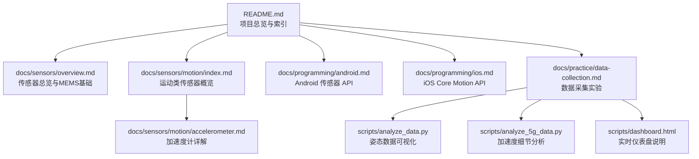
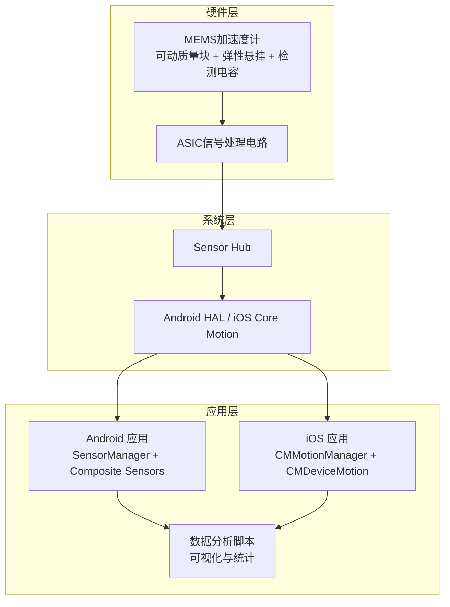
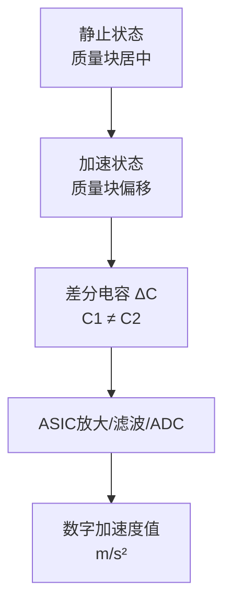
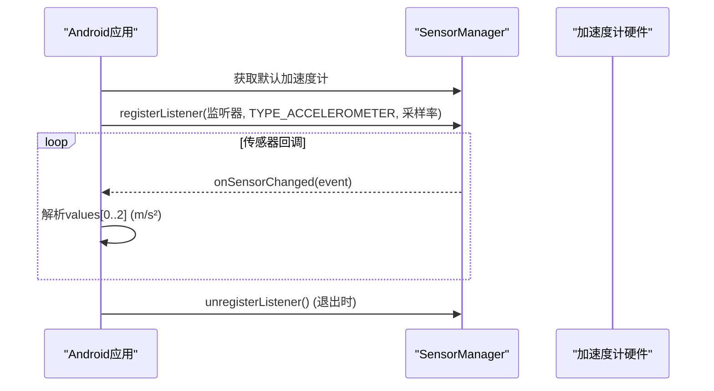
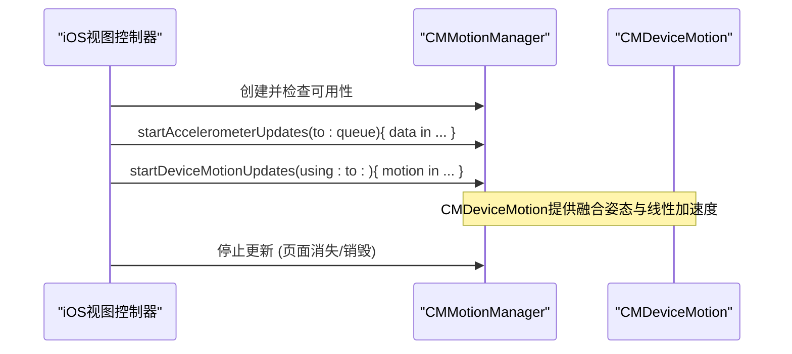
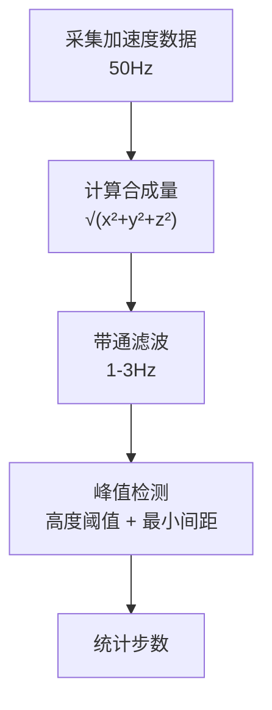
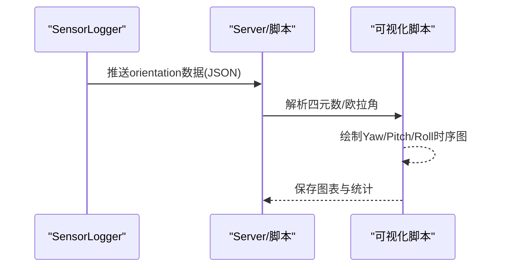
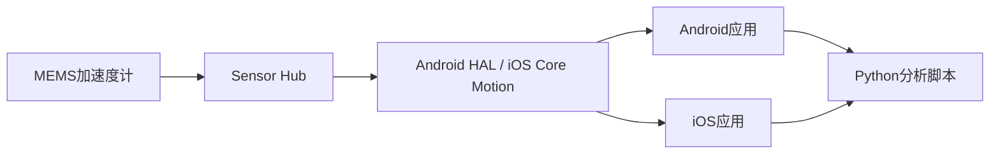

# 加速度计

<cite>
**本文引用的文件**
- [README.md](file://README.md)
- [docs/sensors/motion/accelerometer.md](file://docs/sensors/motion/accelerometer.md)
- [docs/sensors/motion/index.md](file://docs/sensors/motion/index.md)
- [docs/sensors/overview.md](file://docs/sensors/overview.md)
- [docs/programming/android.md](file://docs/programming/android.md)
- [docs/programming/ios.md](file://docs/programming/ios.md)
- [docs/practice/data-collection.md](file://docs/practice/data-collection.md)
- [scripts/analyze_5g_data.py](file://scripts/analyze_5g_data.py)
- [scripts/analyze_data.py](file://scripts/analyze_data.py)
- [scripts/dashboard.html](file://scripts/dashboard.html)
</cite>

## 目录
1. [简介](#简介)
2. [项目结构](#项目结构)
3. [核心组件](#核心组件)
4. [架构总览](#架构总览)
5. [详细组件分析](#详细组件分析)
6. [依赖关系分析](#依赖关系分析)
7. [性能考虑](#性能考虑)
8. [故障排查指南](#故障排查指南)
9. [结论](#结论)
10. [附录](#附录)

## 简介
本章节围绕智能手机中的加速度计展开，系统阐述其MEMS可动质量块、弹性悬挂结构与检测电容的物理实现；解释如何通过线性加速度检测实现屏幕自动旋转、计步器、图像防抖等应用；明确数据输出格式、单位换算（m/s²）与坐标系定义；并提供Android与iOS平台的API使用示例，包括原始数据读取、事件监听与数据处理；最后讨论加速度计在设备姿态检测、运动追踪中的作用及与陀螺仪、磁力计的融合应用。

## 项目结构
本项目采用Docs-as-Code工作流，文档覆盖“传感器总览”“运动类传感器（含加速度计）”“编程接口（Android/iOS）”“实验实践（数据采集与分析）”等模块，便于从原理到实践的完整学习路径。

图表来源
- [README.md:18-55](file://README.md#L18-L55)
- [docs/sensors/motion/index.md:1-50](file://docs/sensors/motion/index.md#L1-L50)
- [docs/sensors/motion/accelerometer.md:1-177](file://docs/sensors/motion/accelerometer.md#L1-L177)
- [docs/programming/android.md:1-290](file://docs/programming/android.md#L1-L290)
- [docs/programming/ios.md:1-334](file://docs/programming/ios.md#L1-L334)
- [docs/practice/data-collection.md:1-192](file://docs/practice/data-collection.md#L1-L192)
- [scripts/analyze_data.py:1-98](file://scripts/analyze_data.py#L1-L98)
- [scripts/analyze_5g_data.py:171-207](file://scripts/analyze_5g_data.py#L171-L207)
- [scripts/dashboard.html:278-297](file://scripts/dashboard.html#L278-L297)

章节来源
- [README.md:18-55](file://README.md#L18-L55)

## 核心组件
- 加速度计硬件实现：基于MEMS电容式结构，通过可动质量块与弹性悬挂结构检测加速度，差分电容变化经ASIC处理输出数字信号。
- 传感器系统架构：手机内部通过Sensor Hub统一管理，传感器通过I2C/SPI/I3C等接口与应用处理器通信。
- 传感器融合：Android/iOS提供复合传感器，将加速度计与陀螺仪、磁力计融合，输出旋转矢量、线性加速度、重力等更高阶的运动状态。
- 应用场景：屏幕自动旋转、计步器、图像防抖、指南针、AR/VR头部追踪、室内定位辅助、体感游戏、跌倒检测等。

章节来源
- [docs/sensors/overview.md:64-100](file://docs/sensors/overview.md#L64-L100)
- [docs/sensors/motion/index.md:9-15](file://docs/sensors/motion/index.md#L9-L15)
- [docs/sensors/overview.md:118-146](file://docs/sensors/overview.md#L118-L146)

## 架构总览
下图展示从硬件到应用层的加速度计数据通路，以及与陀螺仪、磁力计的融合路径。

图表来源
- [docs/sensors/overview.md:98-116](file://docs/sensors/overview.md#L98-L116)
- [docs/programming/android.md:8-18](file://docs/programming/android.md#L8-L18)
- [docs/programming/ios.md:8-26](file://docs/programming/ios.md#L8-L26)

## 详细组件分析

### 1) 加速度计工作原理与MEMS结构
- 物理基础：基于牛顿第二定律，设备运动时质量块因惯性产生位移，位移与加速度成正比。
- MEMS电容式结构：差分电容由固定极板与可动质量块（梳齿）构成，质量块偏移导致两侧电容差分变化ΔC，经ASIC放大、ADC转换输出数字值。
- 三轴检测：在芯片上正交布置三组独立检测结构，分别测量X/Y/Z三轴加速度。

图表来源
- [docs/sensors/motion/accelerometer.md:18-56](file://docs/sensors/motion/accelerometer.md#L18-L56)

章节来源
- [docs/sensors/motion/accelerometer.md:18-56](file://docs/sensors/motion/accelerometer.md#L18-L56)

### 2) 数据输出格式、单位与坐标系
- 输出单位：Android返回m/s²；iOS返回g（1g≈9.81m/s²），开发时需注意转换。
- 坐标系：设备坐标系为右手系，X沿屏幕宽度向右，Y沿高度向上，Z垂直屏幕朝向用户。
- 传感器融合输出：Android提供线性加速度、重力、旋转矢量等；iOS通过CMDeviceMotion提供姿态（欧拉角/四元数）、线性加速度、重力、磁航向等。

章节来源
- [docs/sensors/motion/accelerometer.md:9-14](file://docs/sensors/motion/accelerometer.md#L9-L14)
- [docs/sensors/motion/index.md:34-50](file://docs/sensors/motion/index.md#L34-L50)
- [docs/programming/android.md:199-209](file://docs/programming/android.md#L199-L209)
- [docs/programming/ios.md:310-326](file://docs/programming/ios.md#L310-L326)

### 3) Android平台API使用示例
- 获取传感器管理器、枚举与注册监听，设置采样率，读取values[0..2]三轴数据。
- 采样率选项：NORMAL/UI/GAME/FASTEST，以及自定义微秒值；注意在onPause注销监听以节电。
- 传感器融合：注册TYPE_ROTATION_VECTOR，使用getRotationMatrixFromVector与getOrientation获得欧拉角。
- 批处理模式：通过registerListener的maxReportLatencyUs参数启用硬件FIFO批量上报，降低功耗。

图表来源
- [docs/programming/android.md:54-153](file://docs/programming/android.md#L54-L153)
- [docs/programming/android.md:212-247](file://docs/programming/android.md#L212-L247)
- [docs/programming/android.md:251-281](file://docs/programming/android.md#L251-L281)

章节来源
- [docs/programming/android.md:54-153](file://docs/programming/android.md#L54-L153)
- [docs/programming/android.md:212-247](file://docs/programming/android.md#L212-L247)
- [docs/programming/android.md:251-281](file://docs/programming/android.md#L251-L281)

### 4) iOS平台API使用示例
- 创建CMMotionManager，检查传感器可用性，设置accelerometerUpdateInterval/gyroUpdateInterval/deviceMotionUpdateInterval。
- 获取原始加速度计数据（g），或使用CMDeviceMotion获取融合后的姿态（欧拉角/四元数）、线性加速度、重力、磁航向。
- 生命周期管理：页面可见时开始采集，不可见时停止，避免无效功耗；deinit中安全清理。

图表来源
- [docs/programming/ios.md:64-161](file://docs/programming/ios.md#L64-L161)
- [docs/programming/ios.md:124-161](file://docs/programming/ios.md#L124-L161)
- [docs/programming/ios.md:261-306](file://docs/programming/ios.md#L261-L306)

章节来源
- [docs/programming/ios.md:64-161](file://docs/programming/ios.md#L64-L161)
- [docs/programming/ios.md:124-161](file://docs/programming/ios.md#L124-L161)
- [docs/programming/ios.md:261-306](file://docs/programming/ios.md#L261-L306)

### 5) 应用场景与数据处理

#### 屏幕自动旋转
- 原理：检测重力加速度在X/Y轴分量，结合阈值与角度范围判断横竖屏与旋转方向。
- 实现要点：注意设备坐标系随手机旋转，必要时进行坐标变换。

章节来源
- [docs/sensors/motion/index.md:23](file://docs/sensors/motion/index.md#L23)
- [docs/sensors/motion/accelerometer.md:121-140](file://docs/sensors/motion/accelerometer.md#L121-L140)

#### 计步器
- 原理：利用加速度合成量的周期性波峰检测步态，结合带通滤波与最小峰间距约束。
- 实践：使用SensorLog采集50Hz加速度数据，Python脚本计算合成量、滤波与峰值检测，评估误差。

图表来源
- [docs/practice/data-collection.md:20-54](file://docs/practice/data-collection.md#L20-L54)
- [docs/sensors/motion/accelerometer.md:142-168](file://docs/sensors/motion/accelerometer.md#L142-L168)

章节来源
- [docs/practice/data-collection.md:20-54](file://docs/practice/data-collection.md#L20-L54)
- [docs/sensors/motion/accelerometer.md:142-168](file://docs/sensors/motion/accelerometer.md#L142-L168)

#### 图像防抖（OIS/EIS）
- 陀螺仪检测手持抖动，补偿相机运动；加速度计参与姿态估计与融合，提升防抖效果。

章节来源
- [docs/sensors/motion/index.md:25](file://docs/sensors/motion/index.md#L25)

#### 指南针/地图朝向
- 磁力计检测地磁场方向；加速度计提供倾斜补偿，实现带倾斜补偿的航向角计算。

章节来源
- [docs/sensors/motion/index.md:26](file://docs/sensors/motion/index.md#L26)
- [docs/practice/data-collection.md:75-105](file://docs/practice/data-collection.md#L75-L105)

#### AR/VR头部追踪与室内定位辅助
- 加速度计 + 陀螺仪 + 磁力计融合输出姿态（四元数/欧拉角），为AR/VR与室内定位提供基础。

章节来源
- [docs/sensors/motion/index.md:27-28](file://docs/sensors/motion/index.md#L27-L28)
- [docs/sensors/overview.md:127-131](file://docs/sensors/overview.md#L127-L131)

#### 体感游戏与跌倒检测
- 体感游戏：利用加速度计 + 陀螺仪的倾斜、旋转控制。
- 跌倒检测：检测自由落体后的冲击。

章节来源
- [docs/sensors/motion/index.md:29-30](file://docs/sensors/motion/index.md#L29-L30)

### 6) 传感器融合与数据处理脚本
- Android复合传感器：线性加速度、重力、旋转矢量、游戏旋转矢量、地磁旋转矢量等。
- iOS Device Motion：提供姿态（欧拉角/四元数）、线性加速度、重力、磁航向。
- 数据分析脚本：加载orientation数据，提取欧拉角与四元数，绘制时序图并验证四元数范数接近1.0。

图表来源
- [scripts/analyze_data.py:32-98](file://scripts/analyze_data.py#L32-L98)
- [scripts/dashboard.html:286-293](file://scripts/dashboard.html#L286-L293)

章节来源
- [docs/programming/android.md:212-247](file://docs/programming/android.md#L212-L247)
- [docs/programming/ios.md:124-161](file://docs/programming/ios.md#L124-L161)
- [scripts/analyze_data.py:32-98](file://scripts/analyze_data.py#L32-L98)
- [scripts/dashboard.html:286-293](file://scripts/dashboard.html#L286-L293)

## 依赖关系分析
- 硬件依赖：MEMS结构（质量块、弹性悬挂、检测电容）与ASIC信号链。
- 系统依赖：Sensor Hub统一管理，I2C/SPI/I3C接口；Android HAL与iOS Core Motion抽象。
- 应用依赖：Android SensorManager与复合传感器；iOS CMMotionManager与CMDeviceMotion。
- 数据处理依赖：Python脚本依赖pandas/numpy/scipy/matplotlib等库。

图表来源
- [docs/sensors/overview.md:98-116](file://docs/sensors/overview.md#L98-L116)
- [docs/programming/android.md:8-18](file://docs/programming/android.md#L8-L18)
- [docs/programming/ios.md:8-26](file://docs/programming/ios.md#L8-L26)

章节来源
- [docs/sensors/overview.md:98-116](file://docs/sensors/overview.md#L98-L116)
- [docs/programming/android.md:8-18](file://docs/programming/android.md#L8-L18)
- [docs/programming/ios.md:8-26](file://docs/programming/ios.md#L8-L26)

## 性能考虑
- 采样率与功耗：高采样率显著增加功耗与CPU负载；批处理模式通过硬件FIFO批量上报降低功耗。
- 数据精度：合理设置量程与分辨率，进行静态标定（六面体标定法）以消除偏置与比例因子误差。
- 传感器融合：在低功耗场景优先使用地磁旋转矢量等低功耗复合传感器；实时应用使用旋转矢量或游戏旋转矢量。
- 后台采集：Android可结合前台服务与批处理；iOS受后台限制，建议使用系统调度的BGProcessingTask或蓝牙中心模式接收BLE传感器数据。

章节来源
- [docs/programming/android.md:139-153](file://docs/programming/android.md#L139-L153)
- [docs/programming/android.md:251-281](file://docs/programming/android.md#L251-L281)
- [docs/sensors/motion/accelerometer.md:103-116](file://docs/sensors/motion/accelerometer.md#L103-L116)
- [docs/sensors/overview.md:127-131](file://docs/sensors/overview.md#L127-L131)
- [docs/programming/ios.md:206-258](file://docs/programming/ios.md#L206-L258)

## 故障排查指南
- 单位不一致：Android返回m/s²，iOS返回g，务必在应用层进行单位换算。
- 坐标系混淆：设备坐标系随手机旋转，进行姿态解算或UI适配时需注意坐标变换。
- 采样率与功耗：若出现电量异常消耗，检查是否在onPause未注销监听；尝试降低采样率或启用批处理。
- 数据噪声：进行静态标定（六面体标定法）；对计步器可引入带通滤波与峰值检测阈值优化。
- 后台采集失败：iOS后台传感器受限，确认后台模式配置与系统调度策略。

章节来源
- [docs/programming/ios.md:310-326](file://docs/programming/ios.md#L310-L326)
- [docs/sensors/motion/index.md:48-49](file://docs/sensors/motion/index.md#L48-L49)
- [docs/programming/android.md:149-153](file://docs/programming/android.md#L149-L153)
- [docs/sensors/motion/accelerometer.md:103-116](file://docs/sensors/motion/accelerometer.md#L103-L116)
- [docs/programming/ios.md:206-258](file://docs/programming/ios.md#L206-L258)

## 结论
加速度计作为智能手机运动感知的核心器件，依托MEMS电容式结构实现高精度三轴加速度测量。通过Android与iOS平台的标准API，开发者可便捷获取原始数据与融合结果，并广泛应用于屏幕自动旋转、计步器、图像防抖、指南针、AR/VR与室内定位等场景。结合传感器融合与数据处理脚本，可在保证精度的同时兼顾功耗与实时性。

## 附录
- 传感器系统架构与通信接口：I2C、SPI、I3C等。
- 常用复合传感器（Android）：线性加速度、重力、旋转矢量、游戏旋转矢量、地磁旋转矢量、计步器、显著运动。
- 常用融合输出（iOS）：CMDeviceMotion姿态（欧拉角/四元数）、线性加速度、重力、磁航向。

章节来源
- [docs/sensors/overview.md:98-116](file://docs/sensors/overview.md#L98-L116)
- [docs/sensors/overview.md:133-146](file://docs/sensors/overview.md#L133-L146)
- [docs/programming/ios.md:124-161](file://docs/programming/ios.md#L124-L161)