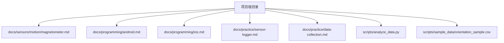
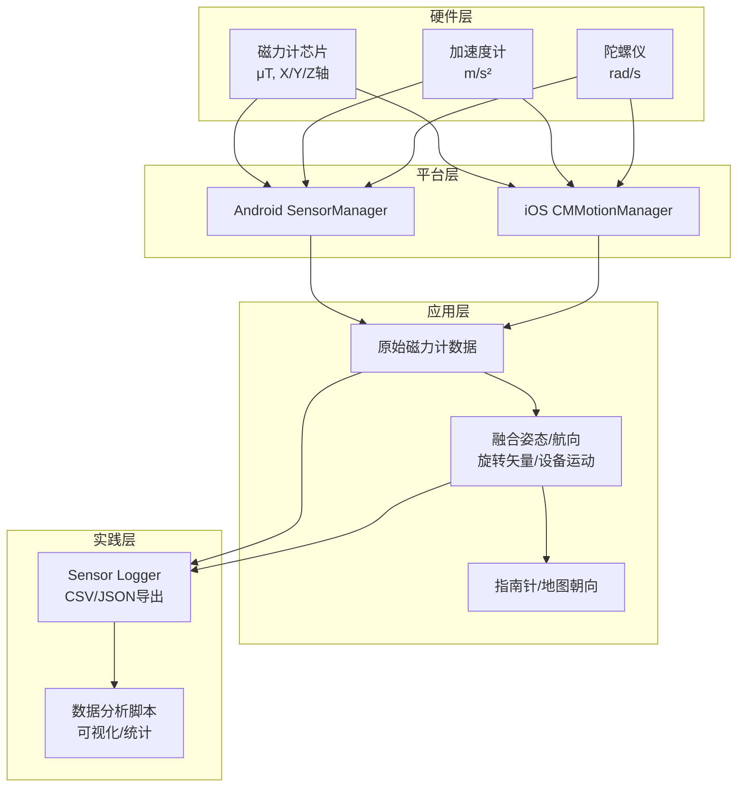
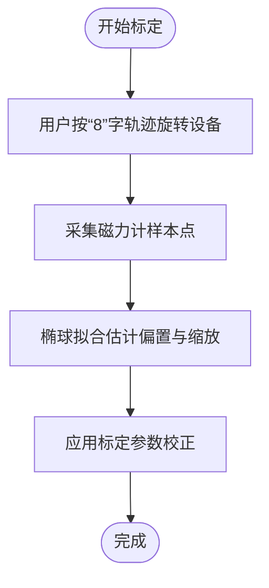
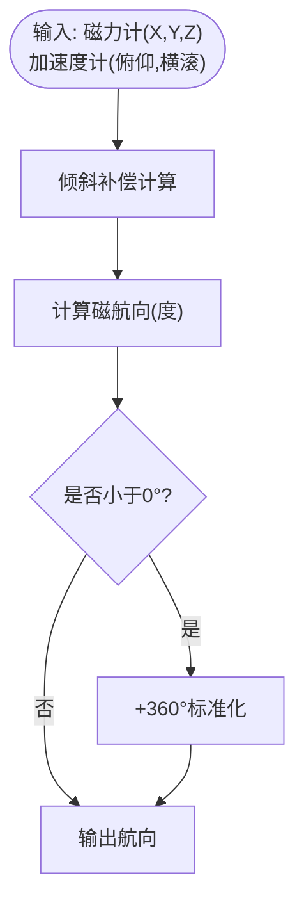
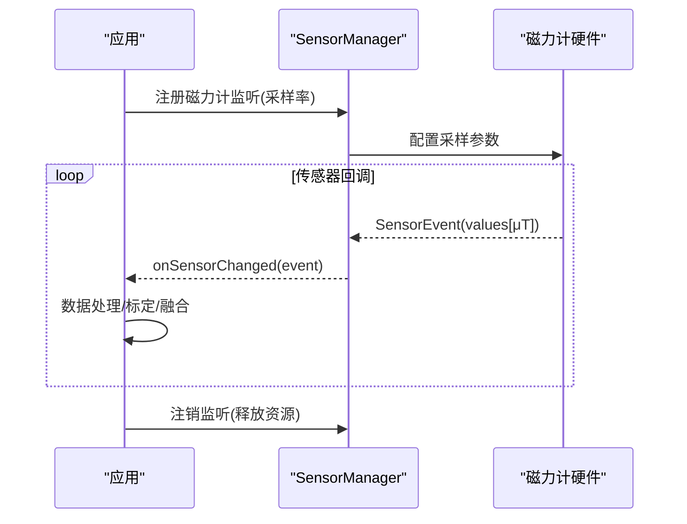
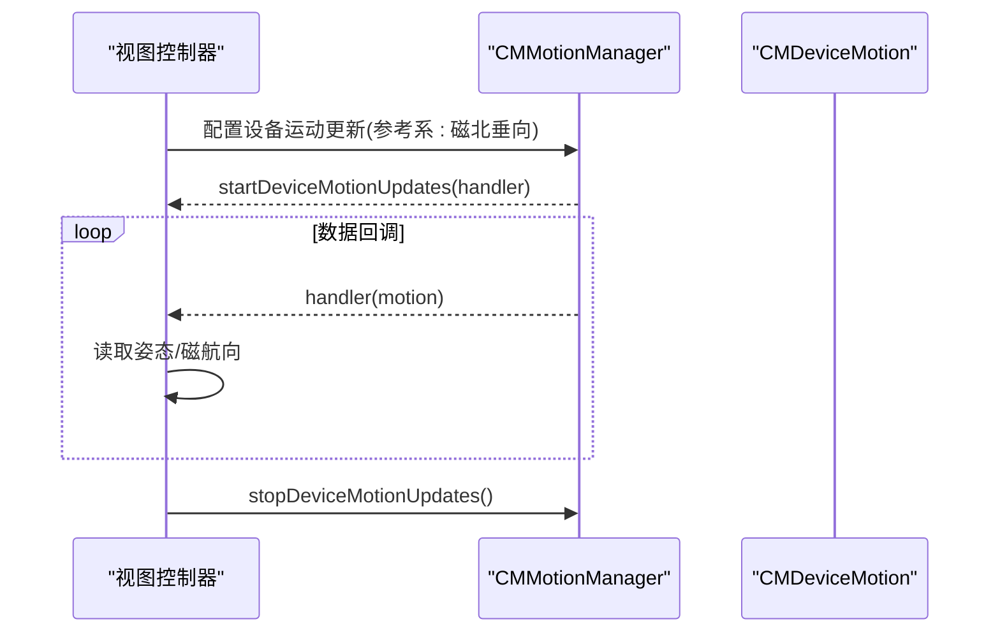
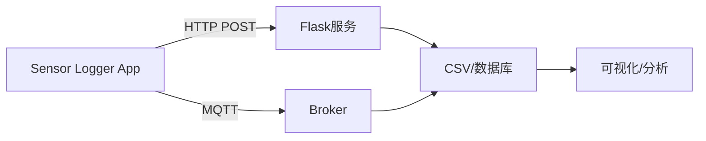
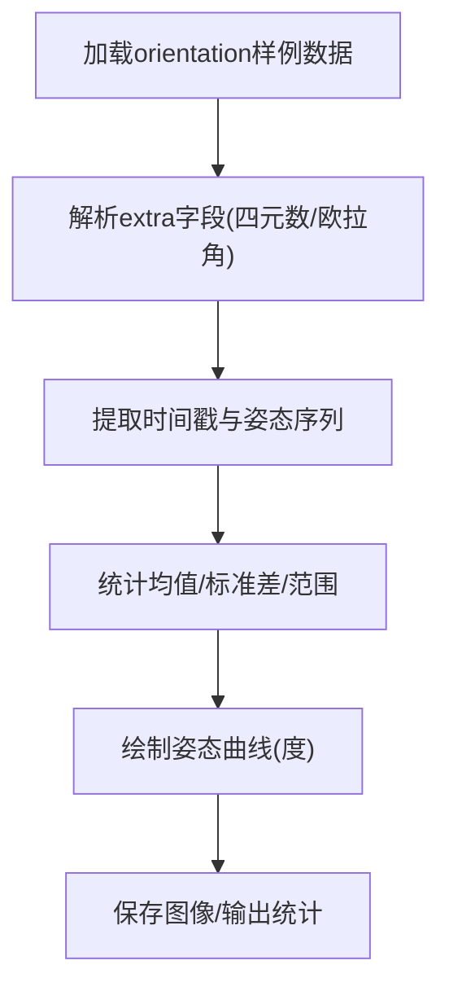
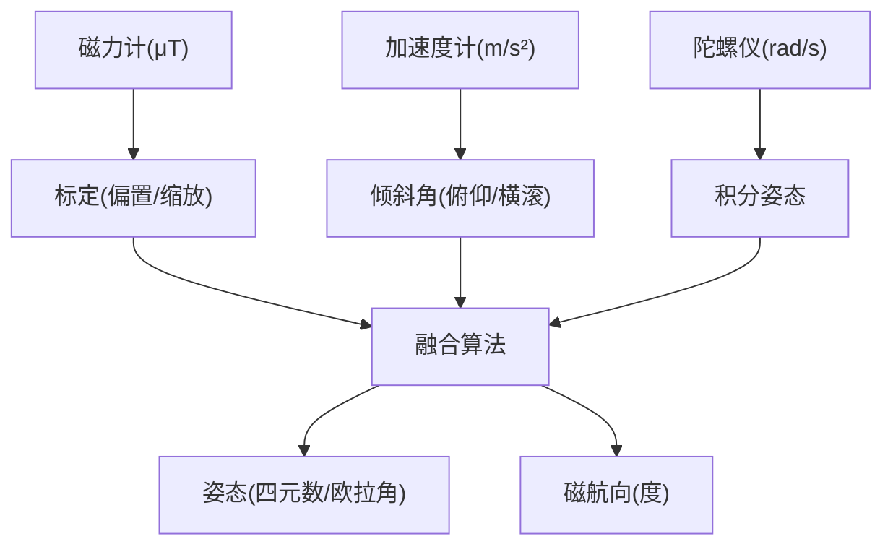

# 磁力计

<cite>
**本文引用的文件**
- [magnetometer.md](file://docs/sensors/motion/magnetometer.md)
- [android.md](file://docs/programming/android.md)
- [ios.md](file://docs/programming/ios.md)
- [sensor-logger.md](file://docs/practice/sensor-logger.md)
- [data-collection.md](file://docs/practice/data-collection.md)
- [analyze_data.py](file://scripts/analyze_data.py)
- [orientation_sample.csv](file://scripts/sample_data/orientation_sample.csv)
- [README.md](file://README.md)
- [overview.md](file://docs/sensors/overview.md)
</cite>

## 目录
1. [简介](#简介)
2. [项目结构](#项目结构)
3. [核心组件](#核心组件)
4. [架构总览](#架构总览)
5. [详细组件分析](#详细组件分析)
6. [依赖关系分析](#依赖关系分析)
7. [性能考虑](#性能考虑)
8. [故障排除指南](#故障排除指南)
9. [结论](#结论)
10. [附录](#附录)

## 简介
本文件系统性阐述磁力计（地磁传感器）的原理、实现与应用，覆盖霍尔效应与磁阻效应两类检测机制，解释其在电子指南针、地图朝向、导航定位与设备方位检测中的作用，并给出Android与iOS平台的API使用示例与数据处理要点。文档同时总结了传感器融合（与加速度计、陀螺仪协同）在姿态估计与导航中的关键价值。

## 项目结构
该项目采用Docs-as-Code工作流，文档与实践内容组织清晰：
- sensors/motion/magnetometer.md：磁力计原理、芯片与标定、应用示例
- programming/android.md：Android传感器API、采样率、融合传感器、批处理
- programming/ios.md：iOS Core Motion框架、设备运动数据、指南针与融合
- practice/sensor-logger.md：跨平台传感器日志工具、数据导出与上云
- practice/data-collection.md：指南针实验、气压计测楼层、手势识别等实践
- scripts/analyze_data.py：姿态数据可视化与统计分析
- scripts/sample_data/orientation_sample.csv：姿态数据样例

图表来源
- [README.md:18-55](file://README.md#L18-L55)

章节来源
- [README.md:18-55](file://README.md#L18-L55)

## 核心组件
- 磁力计硬件原理与实现
  - 霍尔效应型：载流子在磁场中受洛伦兹力偏转产生霍尔电压
  - 磁阻效应型（AMR/TMR）：铁磁材料电阻随磁场方向变化，灵敏度更高
- 磁力计标定
  - 硬铁干扰：恒定偏置磁场，使测量值整体偏移
  - 软铁干扰：铁磁材料扭曲磁场分布，形成椭球面
  - “8”字标定：通过椭球拟合估计偏置与缩放参数
- 应用示例
  - 电子指南针：结合加速度计倾斜补偿计算磁航向
- 平台API
  - Android：原始磁力计数据、复合传感器（旋转矢量、几何磁旋转矢量）
  - iOS：CMMagnetometerData、CMDeviceMotion（含磁航向）

章节来源
- [magnetometer.md:18-157](file://docs/sensors/motion/magnetometer.md#L18-L157)
- [android.md:212-247](file://docs/programming/android.md#L212-L247)
- [ios.md:124-161](file://docs/programming/ios.md#L124-L161)

## 架构总览
磁力计在移动设备中的角色与数据流如下：
- 硬件层：磁力计芯片（霍尔/磁阻），输出μT单位的三轴磁场强度
- 平台层：Android SensorManager、iOS CMMotionManager提供统一接口
- 应用层：原始磁力计数据 + 加速度计/陀螺仪融合，生成姿态与航向
- 实践层：Sensor Logger跨平台采集、导出与上云；数据分析脚本可视化

图表来源
- [magnetometer.md:1-157](file://docs/sensors/motion/magnetometer.md#L1-L157)
- [android.md:1-290](file://docs/programming/android.md#L1-L290)
- [ios.md:1-334](file://docs/programming/ios.md#L1-L334)
- [sensor-logger.md:24-132](file://docs/practice/sensor-logger.md#L24-L132)

## 详细组件分析

### 磁力计工作原理与标定
- 霍尔效应：电流垂直于磁场方向时，载流子受洛伦兹力偏转产生横向电位差，可用于磁场强度测量
- 磁阻效应：AMR（各向异性磁阻）、GMR（巨磁阻）、TMR（隧道磁阻）三种类型，灵敏度依次提升
- 硬铁干扰：设备内部永磁材料产生的恒定偏置磁场
- 软铁干扰：铁磁材料对磁场的扭曲，使未标定数据呈现椭球分布
- 标定方法：“8”字标定 + 椭球拟合，估计偏置向量与缩放矩阵

图表来源
- [magnetometer.md:82-125](file://docs/sensors/motion/magnetometer.md#L82-L125)

章节来源
- [magnetometer.md:18-125](file://docs/sensors/motion/magnetometer.md#L18-L125)

### 电子指南针与倾斜补偿
- 基于磁力计三轴数据与加速度计倾斜角（俯仰、横滚）进行倾斜补偿，计算磁航向
- 输出单位为度（°），范围0–360°，通常以正北为0°

图表来源
- [magnetometer.md:129-157](file://docs/sensors/motion/magnetometer.md#L129-L157)

章节来源
- [magnetometer.md:129-157](file://docs/sensors/motion/magnetometer.md#L129-L157)
- [data-collection.md:63-105](file://docs/practice/data-collection.md#L63-L105)

### Android平台API与数据格式
- 原始磁力计：values[0..2]为μT
- 采样率选项：SENSOR_DELAY_NORMAL/UI/Game/Fastest，以及自定义微秒延迟
- 复合传感器：旋转矢量（含磁校正）、几何磁旋转矢量（低功耗）、线性加速度、重力
- 批处理模式：降低CPU唤醒频率，显著节能

图表来源
- [android.md:90-194](file://docs/programming/android.md#L90-L194)

章节来源
- [android.md:19-210](file://docs/programming/android.md#L19-L210)
- [android.md:212-247](file://docs/programming/android.md#L212-L247)
- [android.md:251-281](file://docs/programming/android.md#L251-L281)

### iOS平台API与数据格式
- 原始磁力计：CMMagnetometerData，values[0..2]为μT
- 设备运动：CMDeviceMotion，提供姿态（欧拉角/四元数）、线性加速度、重力、磁航向
- 生命周期管理：页面可见时开始采集，不可见时停止，避免无效功耗

图表来源
- [ios.md:124-161](file://docs/programming/ios.md#L124-L161)

章节来源
- [ios.md:18-161](file://docs/programming/ios.md#L18-L161)

### 数据采集与上云实践
- Sensor Logger支持磁力计、加速度计、陀螺仪、气压计等多传感器，提供CSV/JSON/KML/SQLite等多种导出
- HTTP POST与MQTT两种上云路径，支持实时仪表盘与批量上传
- 跨平台一致性设置：统一单位与坐标系，便于课堂混用iOS/Android

图表来源
- [sensor-logger.md:74-180](file://docs/practice/sensor-logger.md#L74-L180)
- [sensor-logger.md:236-346](file://docs/practice/sensor-logger.md#L236-L346)

章节来源
- [sensor-logger.md:24-132](file://docs/practice/sensor-logger.md#L24-L132)
- [sensor-logger.md:420-431](file://docs/practice/sensor-logger.md#L420-L431)

### 姿态数据可视化与分析
- analyze_data.py：加载orientation样例数据，提取时间戳、四元数与欧拉角，统计与绘图
- orientation_sample.csv：包含时间戳与姿态四元数/欧拉角字段，便于验证融合效果

图表来源
- [analyze_data.py:32-98](file://scripts/analyze_data.py#L32-L98)
- [orientation_sample.csv:1-352](file://scripts/sample_data/orientation_sample.csv#L1-L352)

章节来源
- [analyze_data.py:1-98](file://scripts/analyze_data.py#L1-L98)
- [orientation_sample.csv:1-352](file://scripts/sample_data/orientation_sample.csv#L1-L352)

## 依赖关系分析
- 磁力计与加速度计/陀螺仪的融合是实现高精度姿态估计与导航的基础
- Android提供TYPE_ROTATION_VECTOR、TYPE_GEOMAGNETIC_ROTATION_VECTOR等复合传感器
- iOS通过CMDeviceMotion提供融合后的姿态与磁航向
- 实践中建议先进行磁力计标定，再进行倾斜补偿与融合

图表来源
- [magnetometer.md:82-157](file://docs/sensors/motion/magnetometer.md#L82-L157)
- [android.md:212-247](file://docs/programming/android.md#L212-L247)
- [ios.md:124-161](file://docs/programming/ios.md#L124-L161)

章节来源
- [magnetometer.md:82-157](file://docs/sensors/motion/magnetometer.md#L82-L157)
- [android.md:212-247](file://docs/programming/android.md#L212-L247)
- [ios.md:124-161](file://docs/programming/ios.md#L124-L161)

## 性能考虑
- 采样率与功耗：高采样率显著增加功耗与CPU负载，建议根据应用场景选择合适延迟
- 批处理模式：Android支持将传感器事件缓存至硬件FIFO后批量上报，有效降低功耗
- 生命周期管理：Android需在onPause注销监听；iOS需在页面消失时停止采集，避免无效功耗
- 数据导出与上云：HTTP POST适合单人/少设备验证，MQTT适合全班同时采集，离线上传适合课后批量分析

章节来源
- [android.md:139-153](file://docs/programming/android.md#L139-L153)
- [android.md:251-281](file://docs/programming/android.md#L251-L281)
- [sensor-logger.md:402-417](file://docs/practice/sensor-logger.md#L402-L417)

## 故障排除指南
- 磁力计读数异常
  - 检查是否处于强磁场干扰环境（扬声器、马达、铁磁外壳）
  - 进行“8”字标定，确保偏置与缩放参数合理
- 指南针不稳定
  - 确保加速度计数据稳定，避免设备抖动
  - 检查倾斜补偿逻辑与单位换算
- 平台差异
  - Android磁力计单位为μT，iOS为μT；但Android加速度计单位为m/s²，iOS为g，需注意转换
- 传感器融合
  - Android可通过TYPE_ROTATION_VECTOR或TYPE_GEOMAGNETIC_ROTATION_VECTOR获取融合姿态
  - iOS通过CMDeviceMotion提供融合姿态与磁航向

章节来源
- [magnetometer.md:82-157](file://docs/sensors/motion/magnetometer.md#L82-L157)
- [android.md:199-210](file://docs/programming/android.md#L199-L210)
- [ios.md:310-326](file://docs/programming/ios.md#L310-L326)

## 结论
磁力计是实现电子指南针与地图朝向的核心传感器，结合加速度计与陀螺仪的融合可提供高精度姿态与航向。Android与iOS分别提供了原始磁力计数据与复合传感器，配合Sensor Logger与数据分析脚本，可在教学与实践中高效完成数据采集、标定、融合与可视化。

## 附录
- 术语表
  - 磁航向：以磁北为基准的水平方向角
  - 倾斜补偿：利用加速度计数据修正磁力计在非水平状态下的测量误差
  - 旋转矢量：由加速度计、陀螺仪与磁力计融合生成的四元数表示的姿态
  - 批处理：传感器将事件缓存至硬件FIFO后批量上报，降低功耗