# 运动传感器

<cite>
**本文引用的文件列表**
- [运动类传感器](file://docs/sensors/motion/index.md)
- [陀螺仪](file://docs/sensors/motion/gyroscope.md)
- [磁力计](file://docs/sensors/motion/magnetometer.md)
- [传感器总览](file://docs/sensors/overview.md)
- [Android 传感器 API](file://docs/programming/android.md)
- [iOS Core Motion](file://docs/programming/ios.md)
- [数据采集实验](file://docs/practice/data-collection.md)
- [Sensor Logger 使用指南](file://docs/practice/sensor-logger.md)
- [orientation_sample.csv](file://scripts/sample_data/orientation_sample.csv)
</cite>

## 目录
1. [引言](#引言)
2. [项目结构](#项目结构)
3. [核心组件](#核心组件)
4. [架构总览](#架构总览)
5. [详细组件分析](#详细组件分析)
6. [依赖关系分析](#依赖关系分析)
7. [性能考量](#性能考量)
8. [故障排查指南](#故障排查指南)
9. [结论](#结论)
10. [附录](#附录)

## 引言
本文件围绕运动传感器（加速度计、陀螺仪、磁力计）展开，系统阐述其工作原理、MEMS技术实现、数据输出格式、坐标系定义与校准方法，并提供Android与iOS平台的API使用示例。同时结合项目中的数据采集与融合实践，说明运动传感器在设备姿态检测、运动追踪与导航中的作用，以及与其它传感器的融合应用。

## 项目结构
该项目采用“文档即代码”的方式组织，核心内容分布在`sensors`、`programming`、`practice`三个主题模块：
- `sensors/motion/`: 运动类传感器的原理与应用
- `sensors/overview.md`: 传感器分类、MEMS技术与融合
- `programming/`: Android与iOS平台的传感器API
- `practice/`: 数据采集实验与Sensor Logger工具链

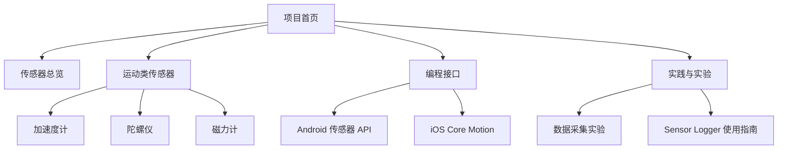

**图表来源**
- [传感器总览:1-146](file://docs/sensors/overview.md#L1-L146)
- [运动类传感器:1-50](file://docs/sensors/motion/index.md#L1-L50)
- [Android 传感器 API:1-290](file://docs/programming/android.md#L1-L290)
- [iOS Core Motion:1-334](file://docs/programming/ios.md#L1-L334)
- [数据采集实验:1-192](file://docs/practice/data-collection.md#L1-L192)
- [Sensor Logger 使用指南:1-468](file://docs/practice/sensor-logger.md#L1-L468)

**章节来源**
- [传感器总览:1-146](file://docs/sensors/overview.md#L1-L146)
- [运动类传感器:1-50](file://docs/sensors/motion/index.md#L1-L50)

## 核心组件
- 加速度计：感知线性加速度，用于姿态判断、计步、跌倒检测等
- 陀螺仪：感知角速度，用于姿态稳定、图像防抖、头部追踪
- 磁力计：感知地磁场，用于电子指南针、航向计算
- 9轴IMU：三者合一，是实现运动追踪与导航的基础

**章节来源**
- [运动类传感器:9-15](file://docs/sensors/motion/index.md#L9-L15)

## 架构总览
运动传感器在手机中的系统架构与数据流如下：
- 传感器硬件（MEMS）→ 信号调理电路 → 数字接口（I2C/SPI/I3C）→ 传感器中枢（Sensor Hub）
- 应用层通过系统API（Android SensorManager、iOS CMMotionManager）访问融合后的数据或原始数据
- 实验与上云：Sensor Logger支持HTTP/MQTT推送，支持实时可视化与批量上传

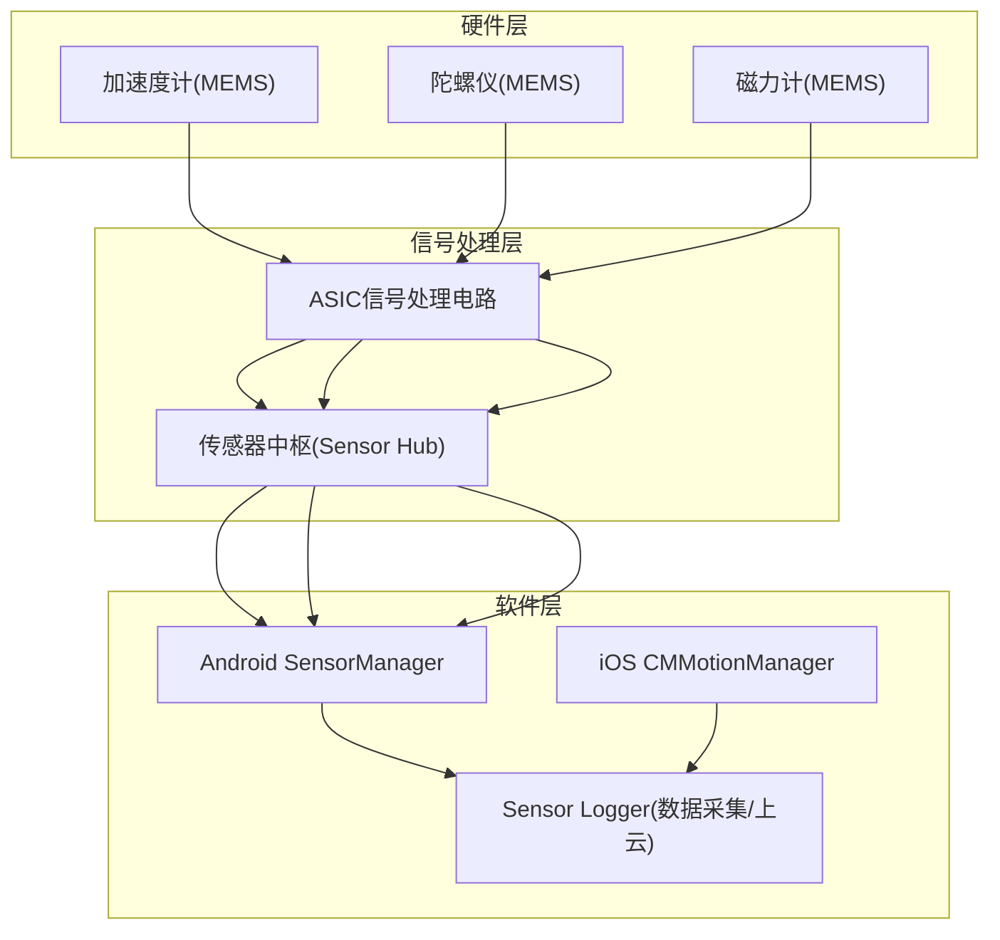

**图表来源**
- [传感器总览:98-116](file://docs/sensors/overview.md#L98-L116)
- [Android 传感器 API:8-18](file://docs/programming/android.md#L8-L18)
- [iOS Core Motion:8-26](file://docs/programming/ios.md#L8-L26)
- [Sensor Logger 使用指南:1-468](file://docs/practice/sensor-logger.md#L1-L468)

## 详细组件分析

### 加速度计（加速度传感器）
- 物理原理：基于MEMS可动质量块在加速度作用下产生位移，通过检测电容变化获得加速度
- 典型参数：量程、分辨率、噪声、功耗；Android常量为`TYPE_ACCELEROMETER`
- 应用：屏幕旋转、计步、图像稳定、跌倒检测
- 数据格式：x/y/z（m/s²）

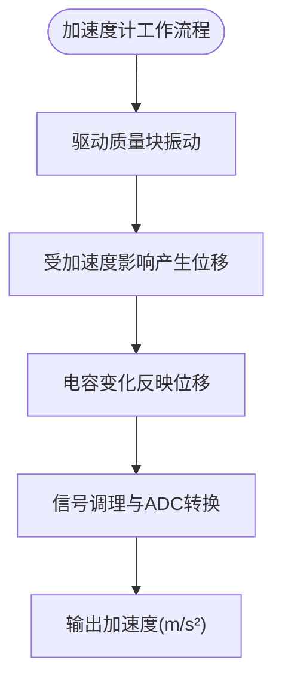

**图表来源**
- [运动类传感器:11-11](file://docs/sensors/motion/index.md#L11-L11)
- [Android 传感器 API:199-205](file://docs/programming/android.md#L199-L205)

**章节来源**
- [运动类传感器:9-15](file://docs/sensors/motion/index.md#L9-L15)
- [Android 传感器 API:199-205](file://docs/programming/android.md#L199-L205)

### 陀螺仪（角速度传感器）
- 物理原理：基于科氏力效应，振动质量块在旋转时受垂直于振动方向和旋转轴的力
- 典型参数：量程（±125~±2000 °/s）、噪声密度、零偏稳定性；Android常量为`TYPE_GYROSCOPE`
- 应用：图像稳定（EIS）、姿态估计、头部追踪
- 数据格式：x/y/z（rad/s）

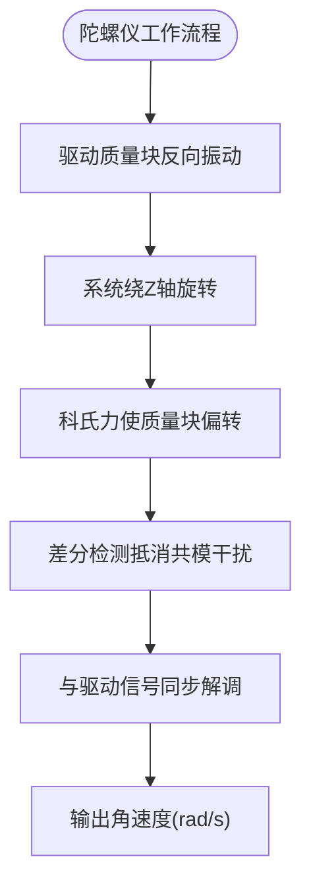

**图表来源**
- [陀螺仪:18-64](file://docs/sensors/motion/gyroscope.md#L18-L64)
- [Android 传感器 API:199-205](file://docs/programming/android.md#L199-L205)

**章节来源**
- [陀螺仪:1-161](file://docs/sensors/motion/gyroscope.md#L1-L161)
- [Android 传感器 API:199-205](file://docs/programming/android.md#L199-L205)

### 磁力计（地磁传感器）
- 物理原理：霍尔效应或磁阻效应（AMR/TMR），测量地球磁场强度与方向
- 典型参数：量程（±4900 μT）、灵敏度、噪声；Android常量为`TYPE_MAGNETIC_FIELD`
- 应用：电子指南针、航向计算、磁异常检测
- 数据格式：x/y/z（μT）

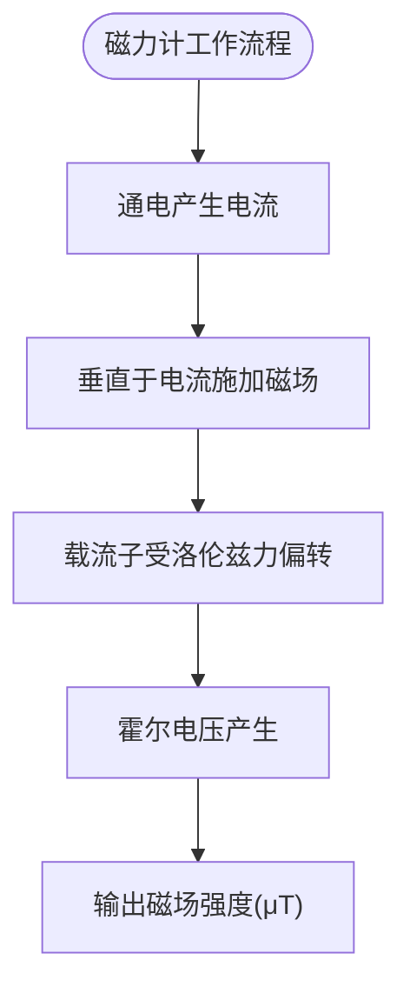

**图表来源**
- [磁力计:18-46](file://docs/sensors/motion/magnetometer.md#L18-L46)
- [Android 传感器 API:199-205](file://docs/programming/android.md#L199-L205)

**章节来源**
- [磁力计:1-166](file://docs/sensors/motion/magnetometer.md#L1-L166)
- [Android 传感器 API:199-205](file://docs/programming/android.md#L199-L205)

### 坐标系与数据格式
- 设备坐标系：X向右、Y向上、Z垂直屏幕向外，符合右手定则
- Android与iOS数据单位差异：加速度计在Android为m/s²，在iOS为g（1g≈9.81 m/s²）
- 传感器数据格式（Android）：加速度（m/s²）、角速度（rad/s）、磁力（μT）

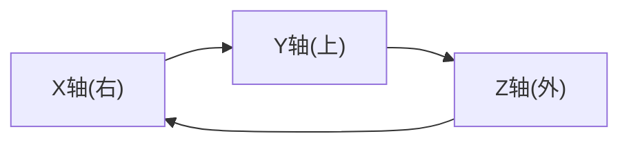

**图表来源**
- [运动类传感器:34-46](file://docs/sensors/motion/index.md#L34-L46)
- [Android 传感器 API:199-209](file://docs/programming/android.md#L199-L209)
- [iOS Core Motion:310-326](file://docs/programming/ios.md#L310-L326)

**章节来源**
- [运动类传感器:34-46](file://docs/sensors/motion/index.md#L34-L46)
- [Android 传感器 API:199-209](file://docs/programming/android.md#L199-L209)
- [iOS Core Motion:310-326](file://docs/programming/ios.md#L310-L326)

### 校准与标定
- 陀螺仪：关注零偏稳定性与积分漂移问题，可通过短时间静止采样估计零偏
- 磁力计：区分硬铁干扰（恒定偏置）与软铁干扰（椭球畸变），采用“8”字标定进行椭球拟合
- 加速度计：通常无需标定，但需考虑安装误差与坐标系对齐

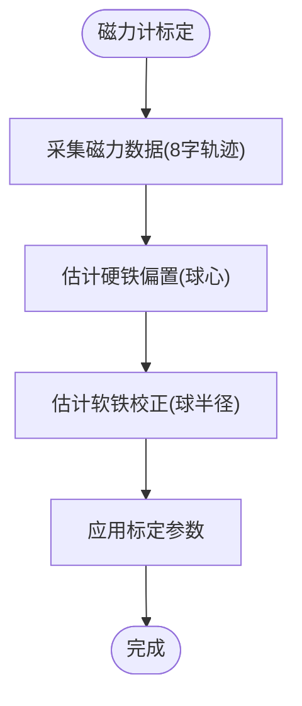

**图表来源**
- [磁力计:82-125](file://docs/sensors/motion/magnetometer.md#L82-L125)

**章节来源**
- [陀螺仪:80-94](file://docs/sensors/motion/gyroscope.md#L80-L94)
- [磁力计:82-125](file://docs/sensors/motion/magnetometer.md#L82-L125)

### 传感器融合与应用
- 9轴融合：加速度计+陀螺仪+磁力计，输出绝对姿态（四元数/欧拉角）
- 6轴融合：加速度计+陀螺仪，输出相对姿态（游戏旋转矢量）
- 常见复合传感器（Android）：旋转矢量、线性加速度、重力、地磁旋转矢量等

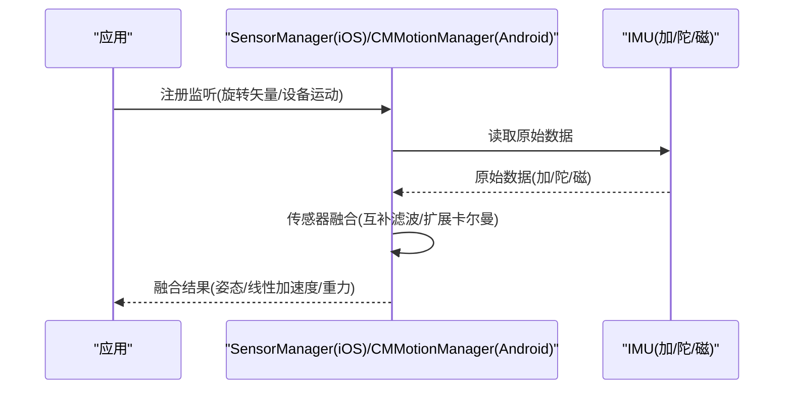

**图表来源**
- [Android 传感器 API:212-247](file://docs/programming/android.md#L212-L247)
- [iOS Core Motion:124-161](file://docs/programming/ios.md#L124-L161)

**章节来源**
- [传感器总览:118-146](file://docs/sensors/overview.md#L118-L146)
- [Android 传感器 API:212-247](file://docs/programming/android.md#L212-L247)
- [iOS Core Motion:124-161](file://docs/programming/ios.md#L124-L161)

### Android 平台 API 使用
- 获取传感器管理器、枚举与注册监听
- 采样率选项与批处理模式（降低功耗）
- 常用复合传感器（旋转矢量、线性加速度、重力、地磁旋转矢量）

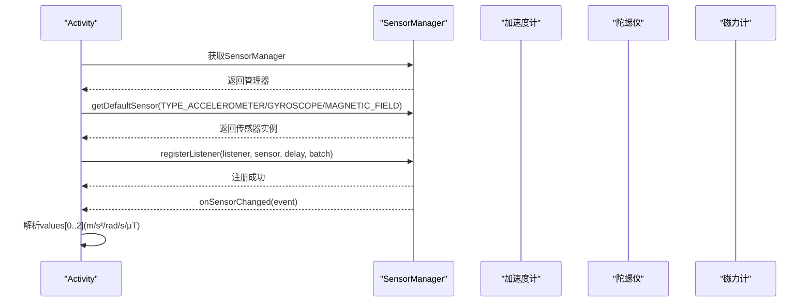

**图表来源**
- [Android 传感器 API:54-195](file://docs/programming/android.md#L54-L195)

**章节来源**
- [Android 传感器 API:54-195](file://docs/programming/android.md#L54-L195)
- [Android 传感器 API:199-247](file://docs/programming/android.md#L199-L247)

### iOS 平台 API 使用
- CMMotionManager 管理加速度计、陀螺仪、磁力计与设备运动
- Device Motion 提供融合姿态、线性加速度、重力与磁航向
- 后台执行与生命周期管理（页面可见时开始，不可见时停止）

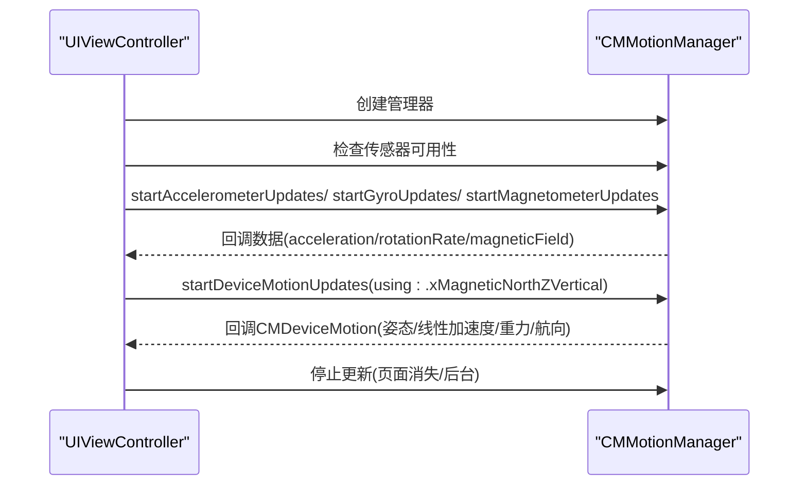

**图表来源**
- [iOS Core Motion:64-161](file://docs/programming/ios.md#L64-L161)

**章节来源**
- [iOS Core Motion:64-161](file://docs/programming/ios.md#L64-L161)
- [iOS Core Motion:206-306](file://docs/programming/ios.md#L206-L306)

### 数据采集与上云实践
- Sensor Logger 支持HTTP POST与MQTT推送，实时可视化与批量上传
- 多设备场景：通过MQTT Broker实现发布/订阅，统一汇聚数据
- 跨平台一致性：统一单位与坐标系（ENU），便于对比分析

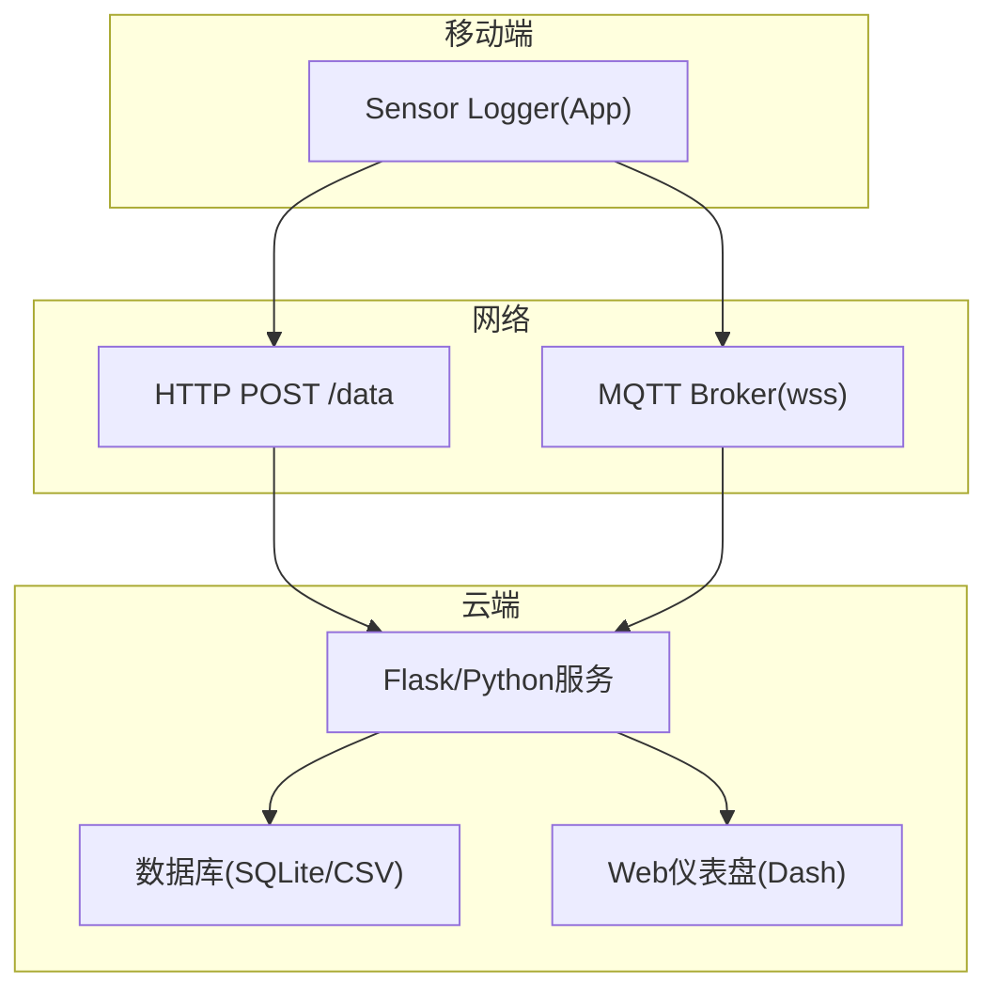

**图表来源**
- [Sensor Logger 使用指南:74-180](file://docs/practice/sensor-logger.md#L74-L180)
- [Sensor Logger 使用指南:236-346](file://docs/practice/sensor-logger.md#L236-L346)

**章节来源**
- [Sensor Logger 使用指南:1-468](file://docs/practice/sensor-logger.md#L1-L468)

### 实验与案例
- 计步器：基于加速度计合成幅度与带通滤波，检测峰值实现步数统计
- 电子指南针：结合加速度计与磁力计进行倾斜补偿，计算磁航向
- 气压计测楼层：通过气压差估算相对高度，识别楼层变化
- 手势识别：提取时域特征，使用简单分类器进行识别

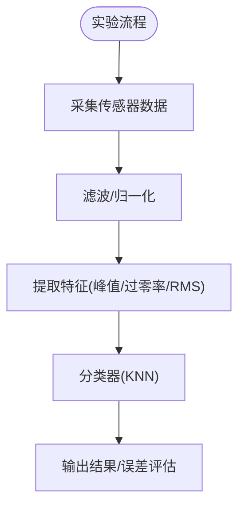

**图表来源**
- [数据采集实验:8-54](file://docs/practice/data-collection.md#L8-L54)
- [数据采集实验:63-105](file://docs/practice/data-collection.md#L63-L105)
- [数据采集实验:109-146](file://docs/practice/data-collection.md#L109-L146)
- [数据采集实验:155-191](file://docs/practice/data-collection.md#L155-L191)

**章节来源**
- [数据采集实验:1-192](file://docs/practice/data-collection.md#L1-L192)

## 依赖关系分析
- 硬件依赖：MEMS结构（质量块、弹性悬挂、检测电路）与封装工艺
- 接口依赖：I2C/SPI/I3C等通信接口，Sensor Hub集中处理
- 软件依赖：Android SensorManager与iOS CMMotionManager，Sensor Logger工具链
- 融合算法依赖：互补滤波、扩展卡尔曼滤波等

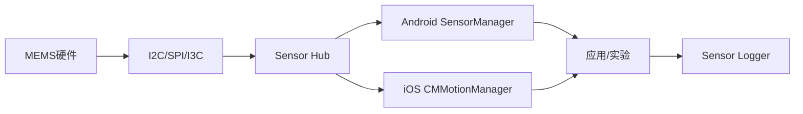

**图表来源**
- [传感器总览:107-116](file://docs/sensors/overview.md#L107-L116)
- [Android 传感器 API:8-18](file://docs/programming/android.md#L8-L18)
- [iOS Core Motion:8-26](file://docs/programming/ios.md#L8-L26)
- [Sensor Logger 使用指南:1-468](file://docs/practice/sensor-logger.md#L1-L468)

**章节来源**
- [传感器总览:98-116](file://docs/sensors/overview.md#L98-L116)
- [Android 传感器 API:8-18](file://docs/programming/android.md#L8-L18)
- [iOS Core Motion:8-26](file://docs/programming/ios.md#L8-L26)
- [Sensor Logger 使用指南:1-468](file://docs/practice/sensor-logger.md#L1-L468)

## 性能考量
- 功耗优化：合理设置采样率与批处理窗口，避免高采样率持续运行
- 精度与稳定性：陀螺仪零偏稳定性与磁力计硬/软铁标定
- 实时性：批处理模式降低CPU唤醒频率，提升电池续航
- 融合算法：互补滤波适用于轻量场景，扩展卡尔曼滤波适用于高精度需求

[本节为通用指导，不直接分析具体文件]

## 故障排查指南
- 传感器无数据：检查权限、设备是否支持、传感器是否可用
- 数据异常：检查标定（尤其是磁力计）、坐标系一致性（跨平台需统一）
- 后台耗电：确保在生命周期关键节点停止传感器更新
- 上云失败：确认Push URL、MQTT Broker连接参数与证书

**章节来源**
- [Android 传感器 API:21-50](file://docs/programming/android.md#L21-L50)
- [iOS Core Motion:29-60](file://docs/programming/ios.md#L29-L60)
- [Sensor Logger 使用指南:236-346](file://docs/practice/sensor-logger.md#L236-L346)

## 结论
运动传感器是现代智能手机的核心能力之一，加速度计、陀螺仪与磁力计共同构成9轴IMU，支撑姿态检测、运动追踪与导航应用。通过MEMS技术实现高集成度与低功耗，配合系统级融合与平台API，开发者可在Android与iOS平台上高效实现各类传感器应用。结合Sensor Logger与实验实践，可快速完成从数据采集到上云可视化的闭环。

[本节为总结性内容，不直接分析具体文件]

## 附录
- 数据示例：orientation_sample.csv包含姿态四元数与欧拉角等字段，可用于姿态分析与可视化
- 跨平台一致性：Sensor Logger提供统一单位与坐标系设置，便于课堂混用iOS与Android设备

**章节来源**
- [orientation_sample.csv:1-352](file://scripts/sample_data/orientation_sample.csv#L1-L352)
- [Sensor Logger 使用指南:420-431](file://docs/practice/sensor-logger.md#L420-L431)