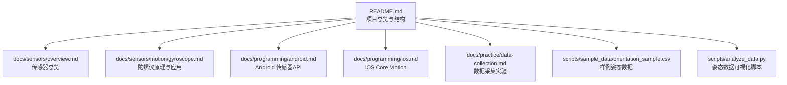
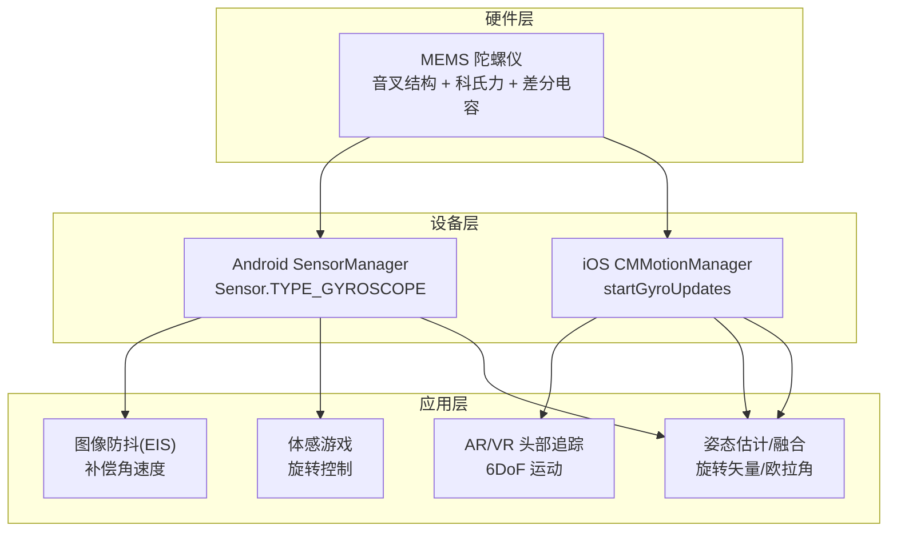
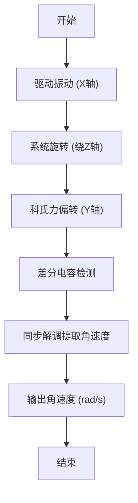
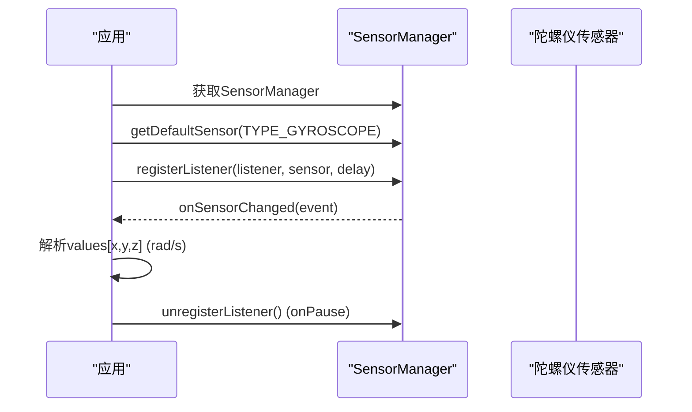
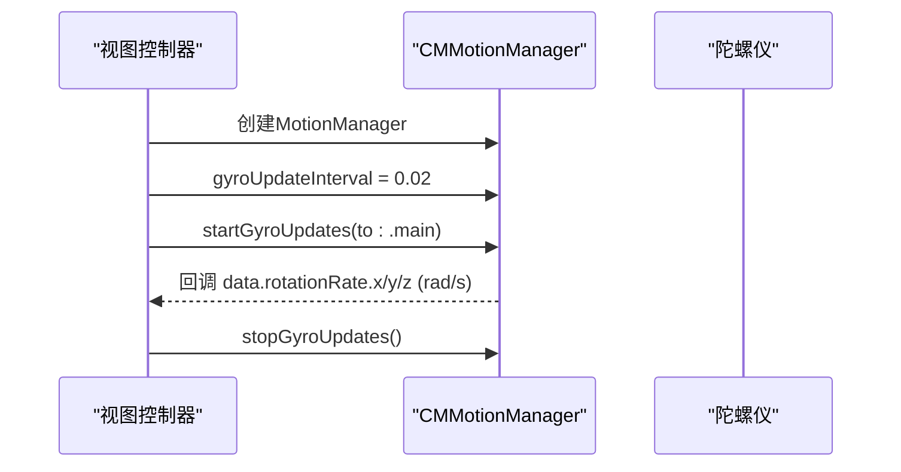
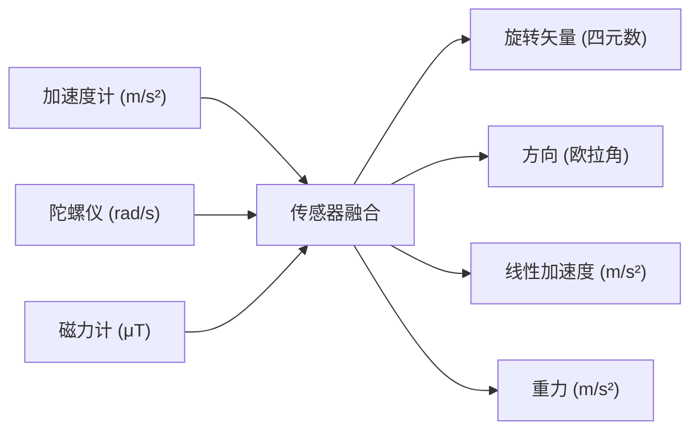
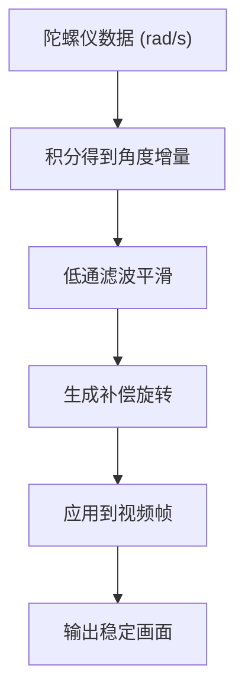
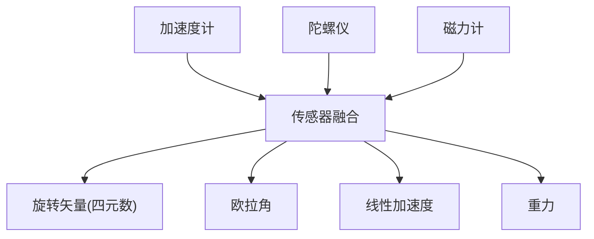

# 陀螺仪

<cite>
**本文引用的文件列表**
- [gyroscope.md](file://docs/sensors/motion/gyroscope.md)
- [android.md](file://docs/programming/android.md)
- [ios.md](file://docs/programming/ios.md)
- [overview.md](file://docs/sensors/overview.md)
- [data-collection.md](file://docs/practice/data-collection.md)
- [orientation_sample.csv](file://scripts/sample_data/orientation_sample.csv)
- [analyze_data.py](file://scripts/analyze_data.py)
- [README.md](file://README.md)
</cite>

## 目录
1. [引言](#引言)
2. [项目结构](#项目结构)
3. [核心组件](#核心组件)
4. [架构总览](#架构总览)
5. [详细组件分析](#详细组件分析)
6. [依赖分析](#依赖分析)
7. [性能考虑](#性能考虑)
8. [故障排查指南](#故障排查指南)
9. [结论](#结论)
10. [附录](#附录)

## 引言
本文件围绕陀螺仪（角速度传感器）展开，系统阐述其工作原理（科氏力偏转检测、电容变化测量的MEMS实现）、数据输出格式与单位换算、坐标系定义，以及在图像防抖、AR/VR头部追踪、体感游戏等应用中的作用。同时提供Android与iOS平台的API使用要点、传感器融合方法（与加速度计、磁力计协同），并结合项目中的数据样例与可视化脚本，帮助读者建立从原理到实践的完整认知。

## 项目结构
该项目采用Docs-as-Code工作流，文档与实践脚本并存，便于理论与实证结合：
- 文档层：传感器原理、API使用、融合方法、实践案例
- 数据层：样例CSV、分析脚本、可视化仪表盘
- 实践层：数据采集、融合算法演示、5G公网穿透采集

图表来源
- [README.md:18-55](file://README.md#L18-L55)
- [overview.md:1-49](file://docs/sensors/overview.md#L1-L49)
- [gyroscope.md:1-161](file://docs/sensors/motion/gyroscope.md#L1-L161)
- [android.md:1-290](file://docs/programming/android.md#L1-L290)
- [ios.md:1-334](file://docs/programming/ios.md#L1-L334)
- [data-collection.md:1-192](file://docs/practice/data-collection.md#L1-L192)
- [orientation_sample.csv:1-352](file://scripts/sample_data/orientation_sample.csv#L1-L352)
- [analyze_data.py:1-98](file://scripts/analyze_data.py#L1-L98)

章节来源
- [README.md:18-55](file://README.md#L18-L55)

## 核心组件
- 陀螺仪工作原理与MEMS实现：基于科氏力偏转检测与差分电容解调，实现角速度到数字信号的转换。
- 陀螺仪数据格式与单位：角速度单位rad/s（Android）；iOS陀螺仪输出同样为rad/s。
- 传感器融合：与加速度计、磁力计融合，生成旋转矢量（四元数）、方向（欧拉角）、线性加速度、重力等复合传感器输出。
- 应用场景：图像防抖（EIS）、AR/VR头部追踪、体感游戏、设备姿态估计、运动追踪。

章节来源
- [gyroscope.md:3-161](file://docs/sensors/motion/gyroscope.md#L3-L161)
- [android.md:199-247](file://docs/programming/android.md#L199-L247)
- [ios.md:108-161](file://docs/programming/ios.md#L108-L161)

## 架构总览
从硬件到应用的典型路径：
- 硬件层：MEMS陀螺仪（音叉结构、驱动振动、科氏力感应、差分电容检测）
- 设备层：Android Sensor Framework / iOS Core Motion
- 应用层：原生API读取原始数据或使用复合传感器（融合输出）

图表来源
- [gyroscope.md:18-66](file://docs/sensors/motion/gyroscope.md#L18-L66)
- [android.md:10-18](file://docs/programming/android.md#L10-L18)
- [ios.md:8-26](file://docs/programming/ios.md#L8-L26)

## 详细组件分析

### 工作原理与MEMS实现
- 科氏力效应：质量块在驱动振动方向运动的同时，系统绕另一轴旋转，产生垂直于振动方向与旋转轴的科氏力，使质量块发生偏转。
- MEMS结构：音叉式谐振器，驱动振动与检测偏转，通过差分电容检测位移变化，再经解调得到角速度。
- 优势：体积小、功耗低、成本低，广泛应用于消费级设备。

图表来源
- [gyroscope.md:18-66](file://docs/sensors/motion/gyroscope.md#L18-L66)

章节来源
- [gyroscope.md:18-66](file://docs/sensors/motion/gyroscope.md#L18-L66)

### 数据输出格式与单位换算
- 角速度单位：rad/s（国际单位制）。Android与iOS陀螺仪API均返回rad/s。
- 三轴输出：x、y、z分别对应绕X、Y、Z轴的角速度。
- 与°/s的关系：1 rad/s ≈ 57.2958 °/s，可根据需要进行换算。

章节来源
- [gyroscope.md:7-11](file://docs/sensors/motion/gyroscope.md#L7-L11)
- [android.md:199-205](file://docs/programming/android.md#L199-L205)
- [ios.md:116-121](file://docs/programming/ios.md#L116-L121)

### 坐标系定义
- 设备坐标系：右手坐标系，X指向设备右侧，Y指向设备底部，Z指向屏幕外侧（垂直于屏幕）。
- 欧拉角：Yaw（偏航，绕Z轴）、Pitch（俯仰，绕X轴）、Roll（翻滚，绕Y轴）。
- 四元数：w、x、y、z，范数恒为1，用于描述旋转且避免万向节锁。

章节来源
- [overview.md:34-49](file://docs/sensors/overview.md#L34-L49)
- [ios.md:139-160](file://docs/programming/ios.md#L139-L160)
- [analyze_data.py:91-98](file://scripts/analyze_data.py#L91-L98)

### Android 陀螺仪API使用
- 获取传感器管理器与陀螺仪传感器
- 注册监听，设置采样率（SENSOR_DELAY_GAME等）
- onSensorChanged回调中读取values数组的三轴角速度
- 注意：onPause中注销监听，避免持续唤醒导致耗电

图表来源
- [android.md:56-137](file://docs/programming/android.md#L56-L137)

章节来源
- [android.md:56-137](file://docs/programming/android.md#L56-L137)
- [android.md:139-153](file://docs/programming/android.md#L139-L153)

### iOS 陀螺仪API使用
- 创建CMMotionManager，检查isGyroAvailable
- 设置gyroUpdateInterval（秒）
- startGyroUpdates(to:queue)回调中读取rotationRate.x/y/z（rad/s）
- 也可使用CMDeviceMotion进行更高层的姿态融合输出

图表来源
- [ios.md:71-122](file://docs/programming/ios.md#L71-L122)

章节来源
- [ios.md:66-122](file://docs/programming/ios.md#L66-L122)

### 传感器融合与姿态估计
- Android复合传感器：
  - TYPE_ROTATION_VECTOR：四元数（x,y,z,w），融合加速度计+陀螺仪+磁力计
  - TYPE_GAME_ROTATION_VECTOR：四元数（无磁校正），融合加速度计+陀螺仪
  - TYPE_LINEAR_ACCELERATION：线性加速度（m/s²），加速度计减去重力
  - TYPE_GRAVITY：重力分量（m/s²），加速度计+陀螺仪
- iOS：
  - CMDeviceMotion：融合加速度计、陀螺仪、磁力计，输出姿态（欧拉角/四元数）、线性加速度、重力、磁航向等

图表来源
- [android.md:212-247](file://docs/programming/android.md#L212-L247)
- [ios.md:124-161](file://docs/programming/ios.md#L124-L161)

章节来源
- [android.md:212-247](file://docs/programming/android.md#L212-L247)
- [ios.md:124-161](file://docs/programming/ios.md#L124-L161)

### 应用实例与数据样例
- 电子图像稳定（EIS）：根据陀螺仪角速度积分得到补偿旋转，再进行低通滤波平滑
- 互补滤波器：融合加速度计（低频可信）与陀螺仪（高频可信），估计姿态角
- 姿态数据样例：orientation_sample.csv包含yaw/pitch/roll与四元数，可用于可视化与统计分析

图表来源
- [gyroscope.md:105-127](file://docs/sensors/motion/gyroscope.md#L105-L127)

章节来源
- [gyroscope.md:105-152](file://docs/sensors/motion/gyroscope.md#L105-L152)
- [orientation_sample.csv:1-352](file://scripts/sample_data/orientation_sample.csv#L1-L352)
- [analyze_data.py:68-98](file://scripts/analyze_data.py#L68-L98)

## 依赖分析
- 陀螺仪与加速度计、磁力计共同构成9轴IMU，是姿态估计与运动追踪的基础
- Android与iOS均提供复合传感器，减少应用层融合复杂度
- 数据样例与分析脚本展示了从raw到融合输出的典型流程

图表来源
- [overview.md:19-49](file://docs/sensors/overview.md#L19-L49)
- [android.md:212-247](file://docs/programming/android.md#L212-L247)
- [ios.md:124-161](file://docs/programming/ios.md#L124-L161)

章节来源
- [overview.md:19-49](file://docs/sensors/overview.md#L19-L49)
- [android.md:212-247](file://docs/programming/android.md#L212-L247)
- [ios.md:124-161](file://docs/programming/ios.md#L124-L161)

## 性能考虑
- 采样率与功耗：高采样率显著增加CPU负载与耗电，应按需设置（如SENSOR_DELAY_GAME）
- 批处理模式：Android支持批处理，降低唤醒频率，延长后台采集续航
- 数据平滑：低通滤波等后处理有助于抑制噪声，提升稳定性
- 融合策略：互补滤波、卡尔曼滤波等算法在精度与实时性之间权衡

章节来源
- [android.md:139-153](file://docs/programming/android.md#L139-L153)
- [android.md:251-281](file://docs/programming/android.md#L251-L281)

## 故障排查指南
- 陀螺仪零偏与积分漂移：静止时仍有缓慢偏移，积分会导致角度误差累积，需与加速度计融合或定期校准
- 单位不一致：Android陀螺仪为rad/s，iOS陀螺仪亦为rad/s；注意单位换算
- 生命周期管理：Android务必在onPause注销监听；iOS在不需要时停止更新，避免无效功耗
- 数据质量：检查四元数范数是否接近1，确认融合算法稳定性

章节来源
- [gyroscope.md:80-94](file://docs/sensors/motion/gyroscope.md#L80-L94)
- [ios.md:261-306](file://docs/programming/ios.md#L261-L306)
- [analyze_data.py:91-98](file://scripts/analyze_data.py#L91-L98)

## 结论
陀螺仪通过MEMS结构与科氏力偏转检测实现高精度角速度测量，在图像防抖、AR/VR头部追踪、体感游戏等场景中发挥关键作用。结合加速度计与磁力计的融合，可获得稳定的姿态估计与运动追踪能力。Android与iOS平台均提供了完善的API与复合传感器，便于开发者快速集成。实践中需关注采样率、功耗、数据平滑与生命周期管理，确保系统稳定与续航表现。

## 附录
- 参考资料与扩展阅读：项目README中列出的延伸阅读链接，可进一步学习具体芯片手册与平台文档
- 数据样例与可视化：orientation_sample.csv与analyze_data.py可用于验证姿态数据质量与融合效果

章节来源
- [README.md:156-169](file://README.md#L156-L169)
- [analyze_data.py:1-98](file://scripts/analyze_data.py#L1-L98)