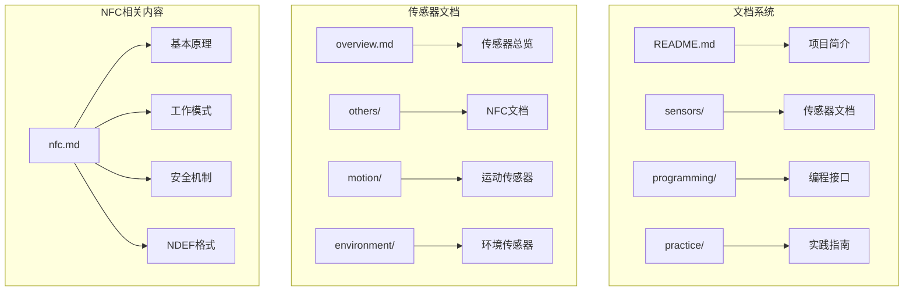
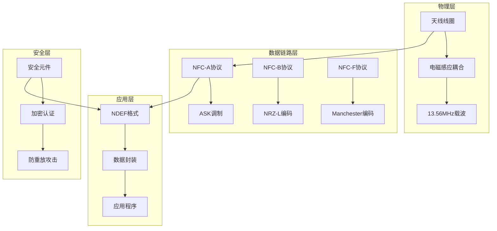
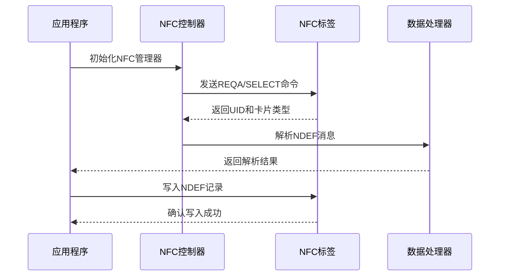
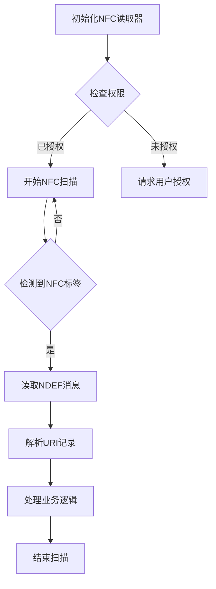
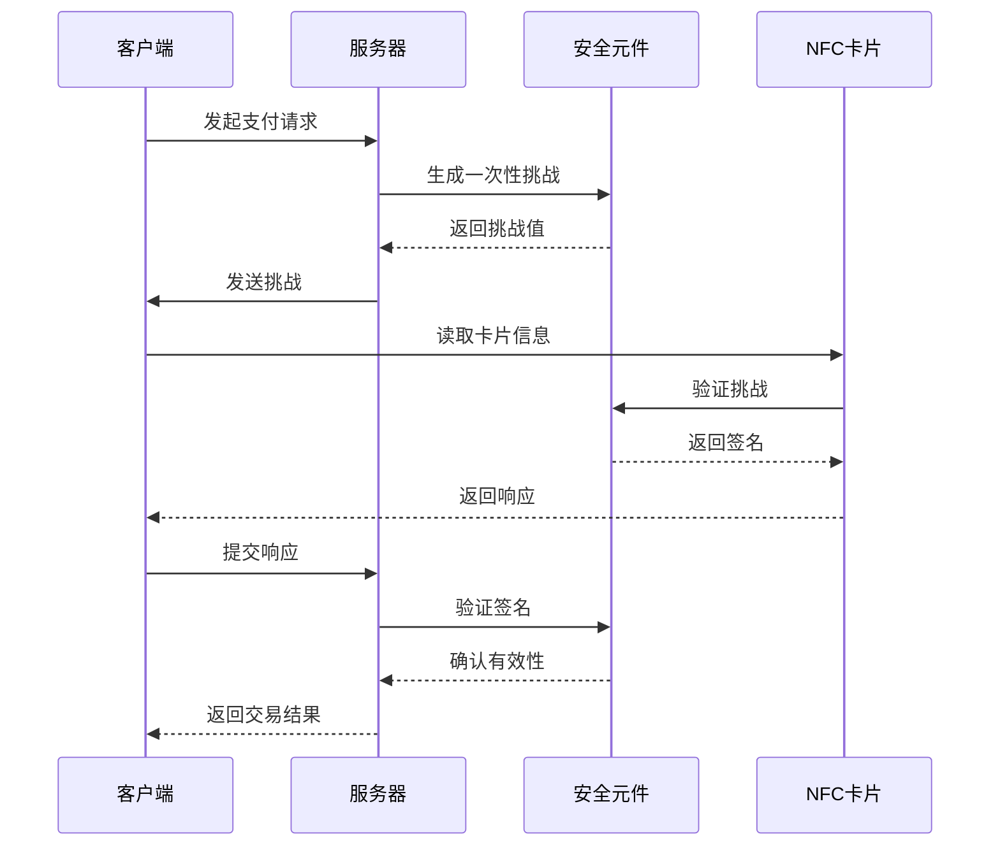
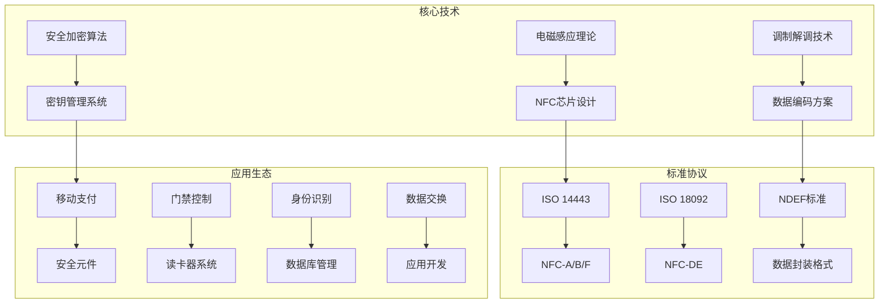
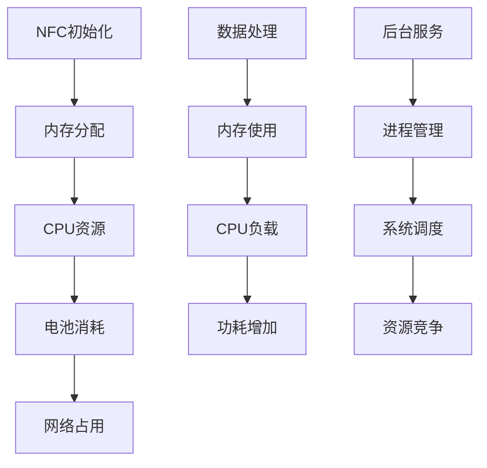
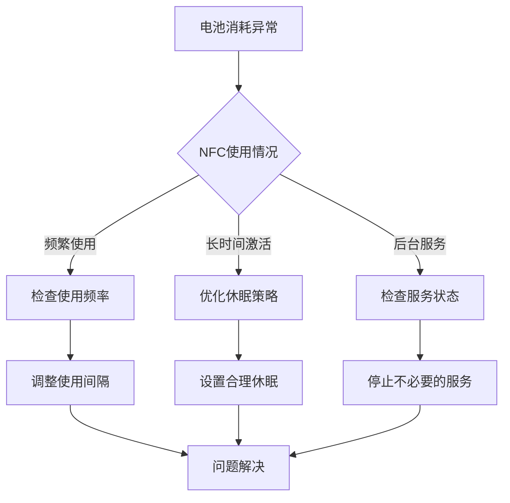
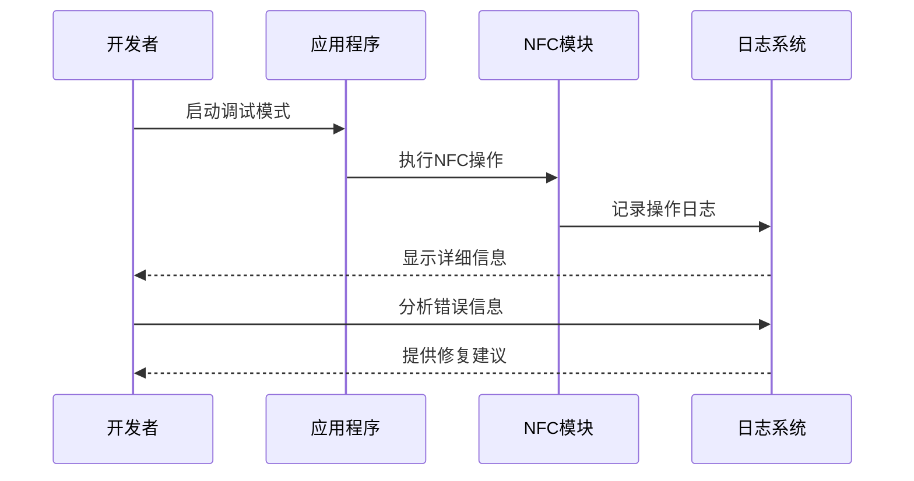

# NFC近场通信传感器

<cite>
**本文档引用的文件**
- [nfc.md](file://docs/sensors/others/nfc.md)
- [android.md](file://docs/programming/android.md)
- [ios.md](file://docs/programming/ios.md)
- [README.md](file://README.md)
- [overview.md](file://docs/sensors/overview.md)
- [sensor-logger.md](file://docs/practice/sensor-logger.md)
</cite>

## 目录
1. [简介](#简介)
2. [项目结构](#项目结构)
3. [核心组件](#核心组件)
4. [架构概览](#架构概览)
5. [详细组件分析](#详细组件分析)
6. [依赖关系分析](#依赖关系分析)
7. [性能考虑](#性能考虑)
8. [故障排除指南](#故障排除指南)
9. [结论](#结论)
10. [附录](#附录)

## 简介

NFC（Near Field Communication，近场通信）是一种短距离无线通信技术，工作在13.56 MHz频段，通信距离通常不超过10厘米。该技术基于电磁感应耦合原理，广泛应用于移动支付、门禁控制、身份识别和数据交换等领域。

本项目文档详细介绍了NFC传感器的工作原理、技术规格、协议标准以及跨平台集成指南，为移动传感器开发提供了全面的技术指导。

## 项目结构

该项目是一个基于MkDocs + Material主题的文档系统，专门用于智能手机传感器技术的教学和实践。项目结构清晰，涵盖了从硬件原理到编程实践的完整知识体系。



**图表来源**
- [README.md:18-55](file://README.md#L18-L55)
- [nfc.md:1-175](file://docs/sensors/others/nfc.md#L1-L175)

**章节来源**
- [README.md:14-55](file://README.md#L14-L55)

## 核心组件

### NFC硬件特性

NFC传感器具有以下关键硬件特性：

| 参数类别 | 技术规格 | 说明 |
|---------|---------|------|
| **工作频率** | 13.56 MHz | ISM频段，符合国际标准 |
| **通信距离** | ≤ 10 cm | 近场通信的物理限制 |
| **数据速率** | 106/212/424 kbps | 支持多种传输速率 |
| **功耗** | ~15-50 mA (活跃) | 低功耗设计，延长设备续航 |
| **典型芯片** | NXP SN220, ST ST25 | 市场主流解决方案 |

### 三种工作模式

NFC技术实现了三种主要的工作模式：

| 模式 | 说明 | 应用场景 |
|------|------|----------|
| **读写模式** | 手机读写NFC标签 | 读取公交卡余额、NFC标签信息 |
| **点对点模式** | 两个NFC设备相互通信 | Android Beam (已淘汰) |
| **卡模拟模式** | 手机模拟为NFC卡片 | Apple Pay、Google Pay、门禁系统 |

### 安全元件架构

NFC支付系统采用多层次的安全保护机制：

| 安全方案 | 说明 | 典型应用 |
|---------|------|----------|
| **eSE (嵌入式安全元件)** | 独立芯片，最高安全级别 | Apple Pay |
| **SIM-SE (SIM卡安全元件)** | 集成在SIM卡中 | 运营商支付方案 |
| **HCE (主机卡模拟)** | 软件实现的卡模拟 | Android Google Pay |

**章节来源**
- [nfc.md:3-42](file://docs/sensors/others/nfc.md#L3-L42)

## 架构概览

NFC系统采用分层架构设计，从物理层到应用层形成了完整的数据处理链路。



**图表来源**
- [nfc.md:16-106](file://docs/sensors/others/nfc.md#L16-L106)

## 详细组件分析

### 电磁感应工作原理

NFC技术基于法拉第电磁感应定律，通过两个线圈之间的互感耦合实现能量和数据传输。

#### 互感耦合方程

NFC系统的核心物理原理可以用以下方程描述：

```
V_induced = -M × (dI/dt)
```

其中：
- V_induced：标签线圈感应电压
- M：两个线圈之间的互感量
- dI/dt：读写器电流变化率

耦合系数k的计算公式：
```
M = k × √(L₁ × L₂)
```

在NFC工作距离范围内（≤10cm），耦合系数k通常在0.01-0.3之间。

#### 能量传输机制

| 参数 | 数值范围 | 说明 |
|------|----------|------|
| **线圈电感** | 0.5-2 μH | 读写器和标签线圈设计 |
| **感应电压** | 0.5-2 V | 为无源标签提供工作电源 |
| **工作功率** | 1-5 mW | 标签芯片正常工作所需功率 |
| **耦合效率** | 1-10% | 电磁耦合的能量传输效率 |

### 数据传输协议标准

NFC技术遵循多个国际标准，主要包括ISO 14443系列和ISO 18092标准。

#### ISO 14443系列协议族

| 协议族 | 标准编号 | 传输速率 | 调制方式 | 编码方式 |
|--------|----------|----------|----------|----------|
| **NFC-A** | ISO 14443-3A | 106 kbps | ASK 100% | Modified Miller |
| **NFC-B** | ISO 14443-3B | 106 kbps | ASK 10% | NRZ-L |
| **NFC-F** | ISO 18092 | 212/424 kbps | ASK ±10% | Manchester |

#### Felica协议族

Felica是Sony开发的NFC协议，主要用于交通卡和小额支付：

| 特征 | 说明 | 应用领域 |
|------|------|----------|
| **工作频率** | 212/424 kbps | 高速数据传输 |
| **调制方式** | Manchester编码 | 高可靠性数据传输 |
| **典型应用** | 交通卡、门禁卡 | 日本市场主导 |

### NDEF数据格式

NDEF（NFC Data Exchange Format）是NFC论坛定义的标准数据封装格式。

#### NDEF Record结构

每个NDEF消息由一个或多个NDEF Record组成：

| 字段 | 长度 | 说明 |
|------|------|------|
| **TNF** | 3 bit | Type Name Format标识符 |
| **Type** | 可变 | 记录类型标识 |
| **Payload Length** | 1或4字节 | 负载数据长度 |
| **Payload** | 可变 | 实际数据内容 |

#### 常见TNF类型

| TNF值 | 名称 | 说明 |
|-------|------|------|
| 0x00 | Empty | 空记录 |
| 0x01 | NFC Forum well-known | 标准类型（URI、Text、Smart Poster） |
| 0x02 | Media-type | MIME类型（如application/json） |
| 0x03 | Absolute URI | 完整URI作为类型 |
| 0x04 | NFC Forum external | 自定义扩展类型 |

#### URI前缀缩写码

为了优化存储空间，NDEF URI Record使用前缀缩写码：

| 代码 | 前缀 | 代码 | 前缀 |
|------|------|------|------|
| 0x00 | 空字符串 | 0x01 | `http://www.` |
| 0x02 | `https://www.` | 0x03 | `http://` |
| 0x04 | `https://` | 0x05 | `tel:` |
| 0x06 | `mailto:` | 0x07-0xFF | 保留 |

### 跨平台API集成指南

#### Android NFC集成

Android平台提供了完整的NFC API支持，包括NDEF消息处理和标签读写功能。

##### 权限配置

Android NFC功能需要相应的权限配置：

| 权限类型 | 权限名称 | 用途 |
|----------|----------|------|
| **NFC权限** | `android.permission.NFC` | NFC功能访问 |
| **前台服务** | `android.permission.FOREGROUND_SERVICE` | 后台NFC处理 |
| **访问网络** | `android.permission.INTERNET` | 网络通信 |

##### 基本使用流程



**图表来源**
- [android.md:32-50](file://docs/programming/android.md#L32-L50)

##### 数据处理示例

项目提供了完整的NDEF消息解析和URI解码示例：

```python
def parse_ndef_message(raw_bytes):
    """解析NDEF消息字节流，返回记录列表"""
    records = []
    pos = 0
    while pos < len(raw_bytes):
        header = raw_bytes[pos]
        tnf = header & 0x07
        is_short = bool(header & 0x10)       # SR位
        has_id = bool(header & 0x08)          # IL位
        pos += 1
        type_len = raw_bytes[pos]; pos += 1
        payload_len = raw_bytes[pos]; pos += 1  # SR=1时1字节
        id_len = raw_bytes[pos] if has_id else 0
        if has_id: pos += 1
        rec_type = raw_bytes[pos:pos+type_len]; pos += type_len
        rec_id = raw_bytes[pos:pos+id_len]; pos += id_len
        payload = raw_bytes[pos:pos+payload_len]; pos += payload_len
        records.append({
            'tnf': tnf, 'type': rec_type, 'payload': payload, 'id': rec_id
        })
    return records
```

**章节来源**
- [nfc.md:112-166](file://docs/sensors/others/nfc.md#L112-L166)
- [android.md:21-50](file://docs/programming/android.md#L21-L50)

#### iOS NFC集成

iOS平台通过Core NFC框架提供NFC功能支持，主要针对读取NDEF消息的应用场景。

##### 权限配置

iOS NFC功能需要在Info.plist中声明：

| 权限键 | 说明 | 用途 |
|--------|------|------|
| `NFCReaderUsageDescription` | NFC使用说明 | 用户授权提示 |
| `NSBluetoothAlwaysUsageDescription` | 蓝牙使用说明 | 后台处理支持 |

##### 基本使用流程



**图表来源**
- [ios.md:39-60](file://docs/programming/ios.md#L39-L60)

### 安全机制

NFC系统采用了多层次的安全保护机制，确保支付交易和个人数据的安全。

#### 加密认证机制

| 安全层次 | 实现方式 | 保护内容 |
|----------|----------|----------|
| **物理安全** | 安全元件(eSE/SIM-HSM) | 密钥存储、加密运算 |
| **传输安全** | 13.56MHz载波加密 | 数据传输防窃听 |
| **应用安全** | 应用层认证 | 业务逻辑验证 |
| **会话安全** | 会话密钥管理 | 交易完整性保护 |

#### 防重放攻击

NFC系统采用多种技术防止重放攻击：



**图表来源**
- [nfc.md:33-42](file://docs/sensors/others/nfc.md#L33-L42)

#### 隐私保护措施

NFC系统实施了多项隐私保护措施：

| 隐私保护 | 实现方式 | 效果 |
|----------|----------|------|
| **数据最小化** | 仅传输必要信息 | 减少个人信息泄露风险 |
| **访问控制** | 应用权限管理 | 防止恶意应用访问 |
| **会话隔离** | 独立会话管理 | 防止会话劫持 |
| **审计日志** | 操作记录追踪 | 便于安全审计 |

### 实际应用案例

#### 移动支付应用

NFC在移动支付领域的应用最为广泛，主要体现在以下几个方面：

| 支付方案 | 技术特点 | 适用场景 |
|----------|----------|----------|
| **Apple Pay** | eSE安全元件 + NFC | iOS设备支付 |
| **Google Pay** | HCE主机卡模拟 | Android设备支付 |
| **银联云闪付** | SIM卡安全元件 | 中国本土支付 |
| **交通卡** | Felica协议 | 公共交通支付 |

#### 门禁控制系统

NFC技术在门禁控制领域的应用包括：

| 应用类型 | 实现方式 | 优势 |
|----------|----------|------|
| **智能门锁** | NFC卡片 + 门锁模块 | 无需密码，便捷安全 |
| **办公楼门禁** | 人员卡 + 读卡器 | 统一管理，考勤统计 |
| **停车场系统** | 车牌识别 + NFC | 自动收费，减少人工 |
| **图书馆系统** | 图书证 + 读卡器 | 自动借还，提高效率 |

#### 身份识别系统

NFC在身份识别方面的应用：

| 识别类型 | 技术实现 | 应用价值 |
|----------|----------|----------|
| **员工证** | 嵌入式芯片 + 读卡器 | 考勤管理，权限控制 |
| **学生证** | 学生信息 + 校园卡 | 校园服务，消费记录 |
| **会员卡** | 会员信息 + 积分系统 | 商业营销，客户管理 |
| **健康卡** | 医疗信息 + 紧急联系 | 医疗急救，信息共享 |

#### 数据交换应用

NFC在数据交换方面的创新应用：

| 交换场景 | 实现方式 | 效果 |
|----------|----------|------|
| **名片交换** | QR码 + NFC | 一键分享联系信息 |
| **应用安装** | 应用链接 + NFC | 快速安装应用 |
| **Wi-Fi配置** | 网络信息 + NFC | 一键连接网络 |
| **社交媒体** | 账号信息 + NFC | 快速添加好友 |

**章节来源**
- [nfc.md:110-166](file://docs/sensors/others/nfc.md#L110-L166)

## 依赖关系分析

### 技术依赖关系

NFC技术的发展依赖于多个关键技术领域的进步：



**图表来源**
- [nfc.md:16-106](file://docs/sensors/others/nfc.md#L16-L106)

### 平台兼容性

不同平台对NFC功能的支持程度存在差异：

| 平台特性 | Android | iOS | 限制因素 |
|----------|---------|-----|----------|
| **硬件支持** | 广泛支持 | 有限支持 | 芯片集成度 |
| **API完善性** | 完整API | 基础API | 系统开放性 |
| **应用生态** | 丰富应用 | 商业应用 | App Store审核 |
| **开发工具** | 完善IDE | 专业工具 | 开发环境 |
| **成本控制** | 低成本 | 高成本 | 硬件成本 |

**章节来源**
- [android.md:10-18](file://docs/programming/android.md#L10-L18)
- [ios.md:10-26](file://docs/programming/ios.md#L10-L26)

## 性能考虑

### 通信性能优化

NFC系统的性能优化主要体现在以下几个方面：

| 优化维度 | 技术手段 | 性能提升 |
|----------|----------|----------|
| **传输速率** | 选择合适协议 | 106/212/424 kbps |
| **功耗控制** | 休眠管理 | 降低活跃时间 |
| **抗干扰能力** | 多层屏蔽 | 提高传输稳定性 |
| **响应时间** | 缓存机制 | 减少等待时间 |

### 数据处理效率

NDEF消息的处理效率直接影响用户体验：

| 处理阶段 | 优化策略 | 效果评估 |
|----------|----------|----------|
| **消息解析** | 流水线处理 | 实时响应 |
| **数据验证** | 并行校验 | 提高准确性 |
| **错误恢复** | 自动重试 | 增强可靠性 |
| **内存管理** | 对象池复用 | 降低内存占用 |

### 系统资源管理

NFC功能对系统资源的影响：



**图表来源**
- [nfc.md:83-106](file://docs/sensors/others/nfc.md#L83-L106)

## 故障排除指南

### 常见问题诊断

#### NFC功能异常

| 问题现象 | 可能原因 | 解决方案 |
|----------|----------|----------|
| **无法检测到标签** | NFC开关关闭 | 检查系统设置 |
| **读取失败** | 距离过远 | 调整设备位置 |
| **数据错误** | 干扰信号 | 远离金属物体 |
| **应用无响应** | 权限不足 | 重新授予权限 |

#### 数据传输问题

| 问题类型 | 诊断方法 | 修复步骤 |
|----------|----------|----------|
| **NDEF解析错误** | 检查记录格式 | 验证TNF类型 |
| **URI解码失败** | 核对前缀码表 | 确认编码方式 |
| **写入操作超时** | 测试标签兼容性 | 更换标签设备 |
| **重复读取** | 检查防重放机制 | 更新挑战序列 |

### 性能问题排查

#### 电池消耗异常



**图表来源**
- [nfc.md:108-175](file://docs/sensors/others/nfc.md#L108-L175)

#### 数据准确性问题

| 问题特征 | 排查步骤 | 解决方案 |
|----------|----------|----------|
| **读取数据不一致** | 多次测试对比 | 清洁标签表面 |
| **URI解析错误** | 检查编码格式 | 验证前缀码匹配 |
| **写入数据丢失** | 测试写入流程 | 检查标签容量 |
| **响应时间过长** | 分析处理链路 | 优化数据结构 |

### 开发调试技巧

#### 调试工具使用

| 调试工具 | 用途 | 使用场景 |
|----------|------|----------|
| **NFC读卡器** | 硬件测试 | 功能验证 |
| **协议分析器** | 数据捕获 | 协议研究 |
| **逻辑分析器** | 时序分析 | 性能优化 |
| **示波器** | 信号测量 | 电路调试 |

#### 日志分析方法



**图表来源**
- [sensor-logger.md:142-178](file://docs/practice/sensor-logger.md#L142-L178)

## 结论

NFC近场通信技术作为移动互联网时代的重要通信技术，凭借其短距离、低功耗、易使用的特性，在移动支付、门禁控制、身份识别等领域发挥着重要作用。随着技术的不断发展和完善，NFC将在更多应用场景中展现其价值。

通过对本项目的深入分析，我们可以看到NFC技术不仅具有扎实的理论基础，更具备完善的工程实现方案。无论是硬件设计、协议实现，还是应用开发，都体现了现代移动通信技术的先进水平。

未来，随着5G、物联网等新技术的发展，NFC技术将继续演进，在保障安全性的前提下，为用户提供更加便捷、智能的服务体验。

## 附录

### 相关资源

#### 技术标准文档
- [NFC Forum技术规范](https://nfc-forum.org/learn/specifications-and-application-documents/)
- [ISO 14443标准](https://www.iso.org/standard/22028.html)
- [ISO 18092标准](https://www.iso.org/standard/31841.html)

#### 开发资源
- [Android NFC开发指南](https://developer.android.com/develop/connectivity/nfc)
- [Apple Core NFC文档](https://developer.apple.com/documentation/corenfc)
- [NDEF规范说明](https://nfc-forum.org/)

#### 实践工具
- [NFC标签测试器](https://play.google.com/store/apps/details?id=com.nxp.nfc)
- [NDEF编辑器](https://play.google.com/store/apps/details?id=com.shobapps.ndefeditor)
- [NFC读卡器](https://www.amazon.com/NFC-Reader-Writer-Android-iPhone/dp/B07YJQ5V6Z)

### 最佳实践建议

#### 开发最佳实践
1. **权限管理**：严格按照最小权限原则申请NFC相关权限
2. **错误处理**：实现完善的异常处理和重试机制
3. **性能优化**：合理控制NFC使用频率，避免过度消耗电池
4. **兼容性测试**：在不同设备和平台上进行全面测试

#### 安全最佳实践
1. **数据加密**：对敏感数据进行加密存储和传输
2. **访问控制**：实现严格的用户身份验证
3. **审计日志**：记录所有NFC操作以便追溯
4. **定期更新**：及时更新安全补丁和协议版本

#### 用户体验优化
1. **简洁界面**：提供直观易懂的操作界面
2. **及时反馈**：实时显示操作状态和结果
3. **容错处理**：优雅处理各种异常情况
4. **帮助文档**：提供详细的使用说明和技术支持