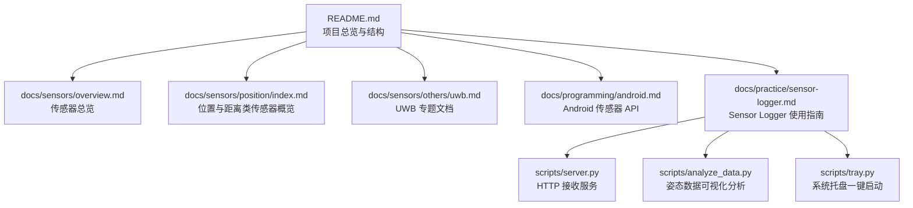
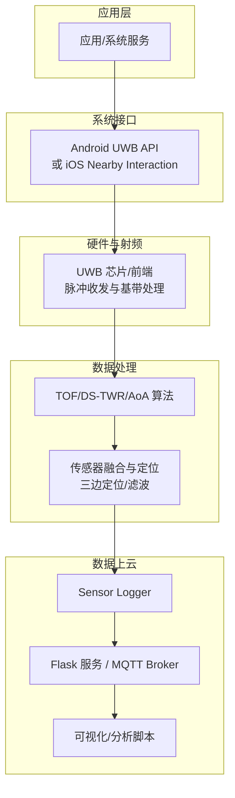
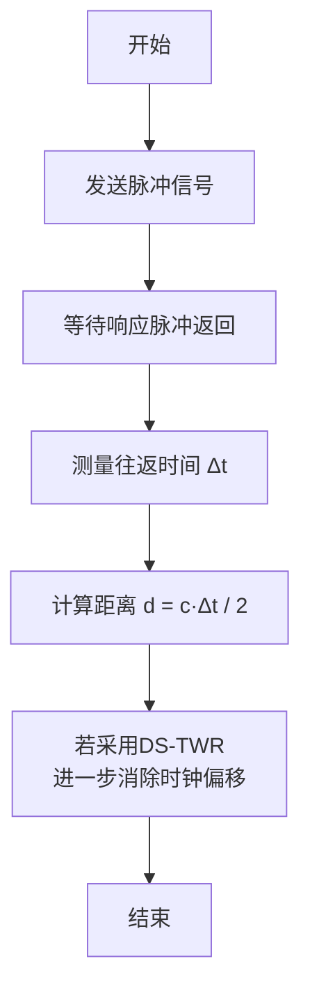
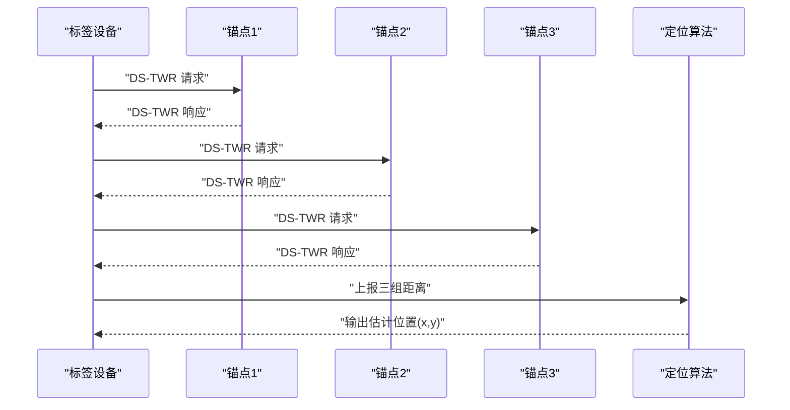
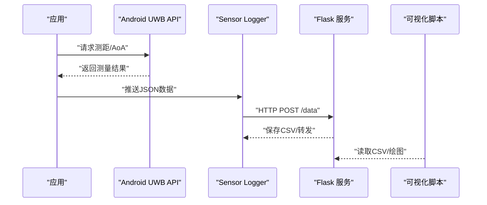
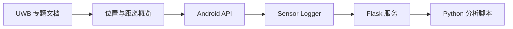

# UWB超宽带传感器

<cite>
**本文引用的文件**
- [uwb.md](file://docs/sensors/others/uwb.md)
- [index.md](file://docs/sensors/position/index.md)
- [proximity.md](file://docs/sensors/position/proximity.md)
- [overview.md](file://docs/sensors/overview.md)
- [README.md](file://README.md)
- [android.md](file://docs/programming/android.md)
- [data-collection.md](file://docs/practice/data-collection.md)
- [sensor-logger.md](file://docs/practice/sensor-logger.md)
- [server.py](file://scripts/server.py)
- [analyze_data.py](file://scripts/analyze_data.py)
- [tray.py](file://scripts/tray.py)
</cite>

## 目录
1. [简介](#简介)
2. [项目结构](#项目结构)
3. [核心组件](#核心组件)
4. [架构总览](#架构总览)
5. [详细组件分析](#详细组件分析)
6. [依赖分析](#依赖分析)
7. [性能考虑](#性能考虑)
8. [故障排查指南](#故障排查指南)
9. [结论](#结论)
10. [附录](#附录)

## 简介
本文件围绕UWB（超宽带）传感器展开，系统阐述其脉冲信号技术原理、厘米级测距与角度估计能力、室内定位与资产跟踪等关键应用，并给出定位算法（TOF、DS-TWR、AoA、三边定位）的技术要点与工程实践路径。文档同时梳理UWB与WiFi RTT、蓝牙等其他无线技术的对比，以及在不同环境条件下的性能表现与局限性。

## 项目结构
该仓库以“文档即代码”的方式组织，UWB相关内容位于 sensors/others 子目录；位置与距离类传感器的概览与对比位于 sensors/position；移动端编程接口与实践案例位于 programming 与 practice。下图展示与UWB相关的主要文档与脚本：

图表来源
- [README.md:18-55](file://README.md#L18-L55)
- [overview.md:19-61](file://docs/sensors/overview.md#L19-L61)
- [index.md:1-24](file://docs/sensors/position/index.md#L1-L24)
- [uwb.md:1-158](file://docs/sensors/others/uwb.md#L1-L158)
- [sensor-logger.md:1-468](file://docs/practice/sensor-logger.md#L1-L468)
- [server.py:1-94](file://scripts/server.py#L1-L94)
- [analyze_data.py:1-98](file://scripts/analyze_data.py#L1-L98)
- [tray.py:1-276](file://scripts/tray.py#L1-L276)

章节来源
- [README.md:18-55](file://README.md#L18-L55)

## 核心组件
- UWB脉冲信号与测距原理：纳秒级脉冲、高带宽（≥500 MHz）、双向测距（TWR/DS-TWR）、到达角（AoA）估计。
- 定位算法：TOF测距、多径补偿思路、三边定位（2D/3D）。
- 与其它无线技术对比：UWB vs 蓝牙 vs Wi-Fi RTT。
- 应用场景：AirTag/SmartTag精确查找、数字车钥匙、空间音频、室内定位、资产跟踪。
- 工程实践：Android UWB API、Sensor Logger数据采集与上云、Flask/Python分析脚本。

章节来源
- [uwb.md:3-158](file://docs/sensors/others/uwb.md#L3-L158)
- [index.md:9-23](file://docs/sensors/position/index.md#L9-L23)
- [android.md:10-19](file://docs/programming/android.md#L10-L19)

## 架构总览
下图展示了UWB在移动终端侧的定位数据链路：应用层通过系统API获取UWB测距/AoA结果，结合传感器融合与定位算法，最终输出位置与方向信息；同时可通过Sensor Logger将数据实时上云，便于可视化与分析。

图表来源
- [android.md:10-19](file://docs/programming/android.md#L10-L19)
- [sensor-logger.md:74-178](file://docs/practice/sensor-logger.md#L74-L178)
- [server.py:35-81](file://scripts/server.py#L35-L81)
- [analyze_data.py:1-98](file://scripts/analyze_data.py#L1-L98)

## 详细组件分析

### 1) UWB脉冲信号与测距原理
- 工作频段与带宽：常用6.5/8 GHz信道，带宽≥500 MHz；脉冲宽度纳秒级，时间分辨率高，测距精度可达厘米级。
- 双向测距（TWR/DS-TWR）：通过往返时间计算距离，DS-TWR进一步消除时钟偏移影响。
- 到达角（AoA）：利用天线阵列相位差估计来波方向，结合距离实现空间感知。

图表来源
- [uwb.md:28-41](file://docs/sensors/others/uwb.md#L28-L41)
- [uwb.md:100-116](file://docs/sensors/others/uwb.md#L100-L116)

章节来源
- [uwb.md:17-42](file://docs/sensors/others/uwb.md#L17-L42)
- [uwb.md:78-93](file://docs/sensors/others/uwb.md#L78-L93)

### 2) 定位算法与数据处理
- TOF与DS-TWR：提供距离估计；DS-TWR通过两轮测量抵消时钟偏移。
- AoA与角度估计：基于相位差计算来波方向，θ = arcsin(c·Δt / d_antenna)。
- 三边定位（2D/3D）：以锚点距离为约束，线性化后用最小二乘求解标签位置。

图表来源
- [uwb.md:98-149](file://docs/sensors/others/uwb.md#L98-L149)

章节来源
- [uwb.md:98-149](file://docs/sensors/others/uwb.md#L98-L149)

### 3) 与其它无线技术对比
- UWB在测距精度、测距范围、测角能力、功耗与穿透性方面具有优势；蓝牙与Wi-Fi RTT在功耗与覆盖方面各有特点，但在厘米级精度与角度估计上不及UWB。

章节来源
- [uwb.md:45-53](file://docs/sensors/others/uwb.md#L45-L53)

### 4) 应用场景
- AirTag/SmartTag精确查找、数字车钥匙、空间音频、近距离文件传输、室内定位（配合UWB锚点实现厘米级定位）。

章节来源
- [uwb.md:56-65](file://docs/sensors/others/uwb.md#L56-L65)

### 5) 工程实践：Android UWB API与数据采集
- Android侧通过SensorManager与UWB相关API获取测距与角度数据；支持批处理以降低功耗。
- Sensor Logger支持HTTP POST与MQTT两种上云路径，提供实时仪表盘与数据导出。

图表来源
- [android.md:10-19](file://docs/programming/android.md#L10-L19)
- [sensor-logger.md:74-178](file://docs/practice/sensor-logger.md#L74-L178)
- [server.py:35-81](file://scripts/server.py#L35-L81)
- [analyze_data.py:1-98](file://scripts/analyze_data.py#L1-L98)

章节来源
- [android.md:54-195](file://docs/programming/android.md#L54-L195)
- [sensor-logger.md:74-468](file://docs/practice/sensor-logger.md#L74-L468)
- [server.py:1-94](file://scripts/server.py#L1-L94)
- [analyze_data.py:1-98](file://scripts/analyze_data.py#L1-L98)

## 依赖分析
- 文档层面：UWB专题文档与位置类传感器概览共同构成理论基础；Android API与实践指南提供实现路径。
- 工具层面：Sensor Logger负责数据采集与上云；Flask服务负责接收与持久化；Python脚本负责可视化与统计分析。
- 环境层面：需要稳定的网络与合适的设备权限（如需要时）。

图表来源
- [uwb.md:1-158](file://docs/sensors/others/uwb.md#L1-L158)
- [index.md:1-24](file://docs/sensors/position/index.md#L1-L24)
- [android.md:10-19](file://docs/programming/android.md#L10-L19)
- [sensor-logger.md:74-178](file://docs/practice/sensor-logger.md#L74-L178)
- [server.py:35-81](file://scripts/server.py#L35-L81)
- [analyze_data.py:1-98](file://scripts/analyze_data.py#L1-L98)

章节来源
- [README.md:18-55](file://README.md#L18-L55)

## 性能考虑
- 测距精度与带宽：脉冲越短，时间分辨率越高；在500 MHz带宽下理论最小距离分辨可达30 cm，实际通过信号处理可达到厘米级。
- 多径效应：直射路径之外的反射、绕射会产生额外时延，需采用多径抑制与滤波策略（如阈值剔除、统计滤波）。
- 环境适应性：障碍物与介质会影响信号传播；在室内复杂环境中，建议增加冗余锚点与滤波算法提升鲁棒性。
- 功耗与稳定性：合理设置采样率与批处理窗口，避免高频唤醒；在移动场景中结合惯性传感器进行融合以减少漂移。

章节来源
- [uwb.md:70-77](file://docs/sensors/others/uwb.md#L70-L77)
- [uwb.md:45-53](file://docs/sensors/others/uwb.md#L45-L53)

## 故障排查指南
- 采集与上云
  - 确认Sensor Logger Push URL正确，本地/公网均可；Flask服务端口开放且可访问。
  - 若使用MQTT，确保Broker支持WSS，Topic与凭据配置正确。
- 数据质量
  - 检查CSV是否正常写入，确认字段映射（x/y/z/extra）与传感器名称一致。
  - 使用Python脚本读取并绘制波形，核对时间戳与数值范围。
- 设备与权限
  - Android端确保已授予所需权限（如心率/活动识别），并在onPause中注销监听以避免耗电。
- 环境因素
  - 障碍物较多时，适当增加锚点密度与采样次数；对异常值进行剔除或滑动平均。

章节来源
- [sensor-logger.md:74-178](file://docs/practice/sensor-logger.md#L74-L178)
- [server.py:35-81](file://scripts/server.py#L35-L81)
- [analyze_data.py:1-98](file://scripts/analyze_data.py#L1-L98)
- [android.md:21-50](file://docs/programming/android.md#L21-L50)

## 结论
UWB凭借纳秒级脉冲与高带宽特性，实现了厘米级测距与角度估计，适用于室内定位、资产跟踪、精确测距与空间感知等场景。结合Android API与Sensor Logger等工具，可快速搭建从数据采集到上云可视化的完整链路。针对多径与环境干扰，建议采用稳健的滤波与定位算法，并在工程实践中重视功耗与稳定性。

## 附录
- 相关文档与API
  - Apple Nearby Interaction 框架
  - Android UWB API
  - FiRa Consortium（UWB标准组织）
- 实践脚本
  - HTTP接收服务：接收Sensor Logger推送并写入CSV
  - 数据分析脚本：读取orientation数据并绘制姿态曲线
  - 系统托盘：一键启动本地服务与ngrok隧道

章节来源
- [uwb.md:153-158](file://docs/sensors/others/uwb.md#L153-L158)
- [sensor-logger.md:434-468](file://docs/practice/sensor-logger.md#L434-L468)
- [server.py:1-94](file://scripts/server.py#L1-L94)
- [analyze_data.py:1-98](file://scripts/analyze_data.py#L1-L98)
- [tray.py:1-276](file://scripts/tray.py#L1-L276)