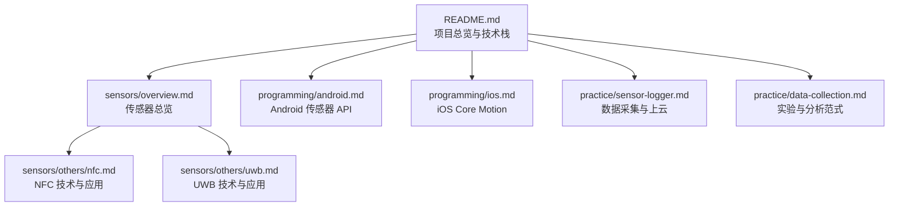
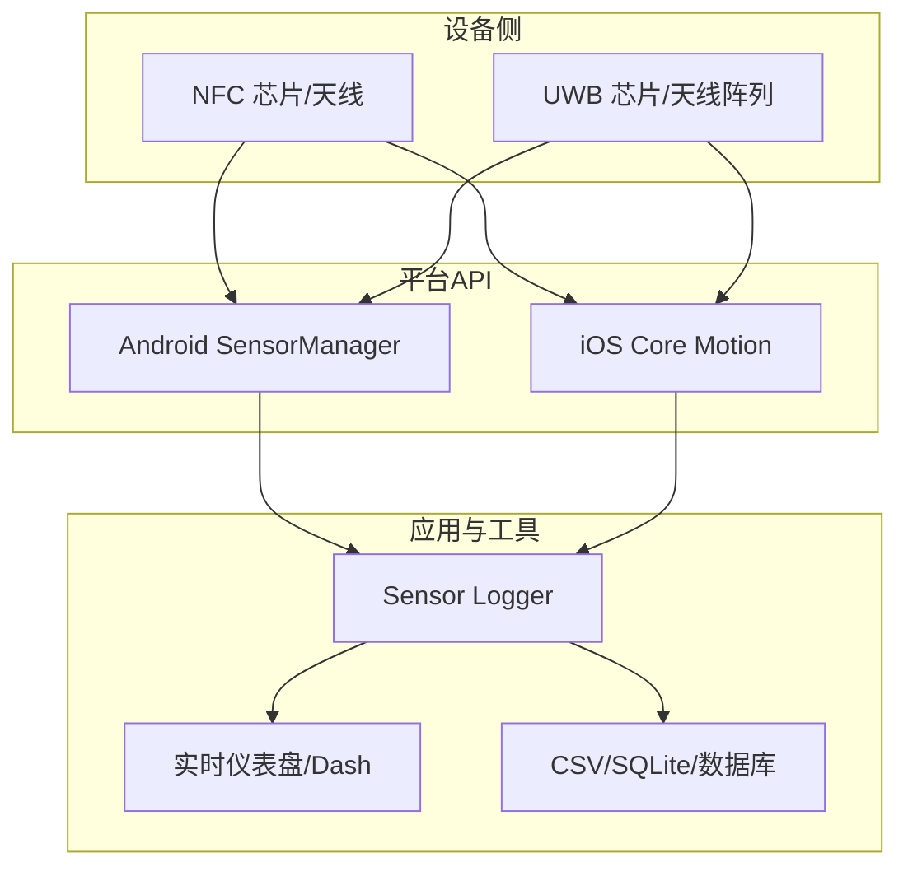
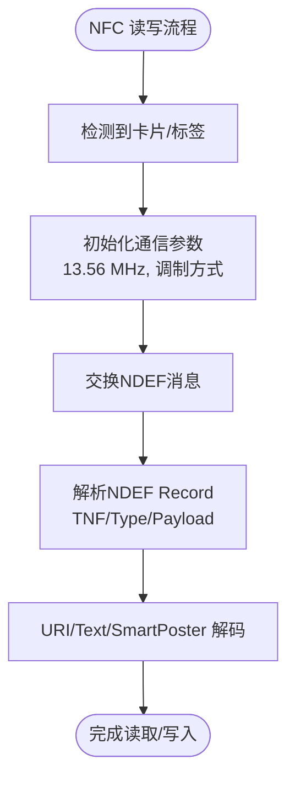
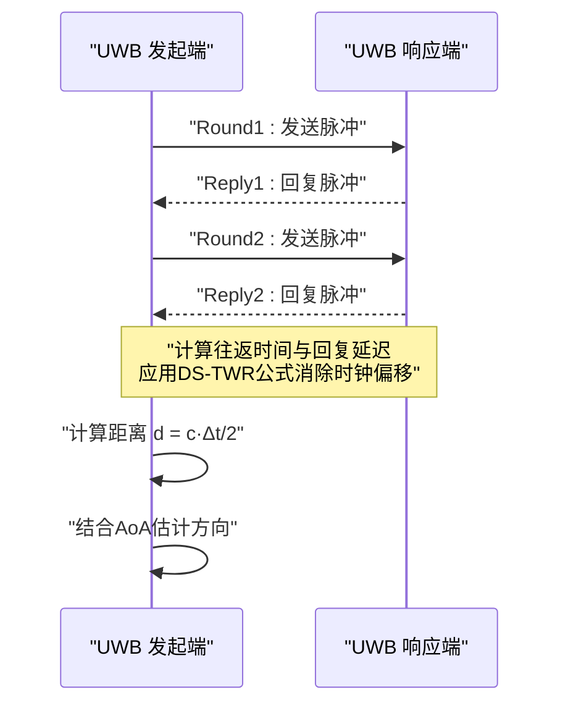
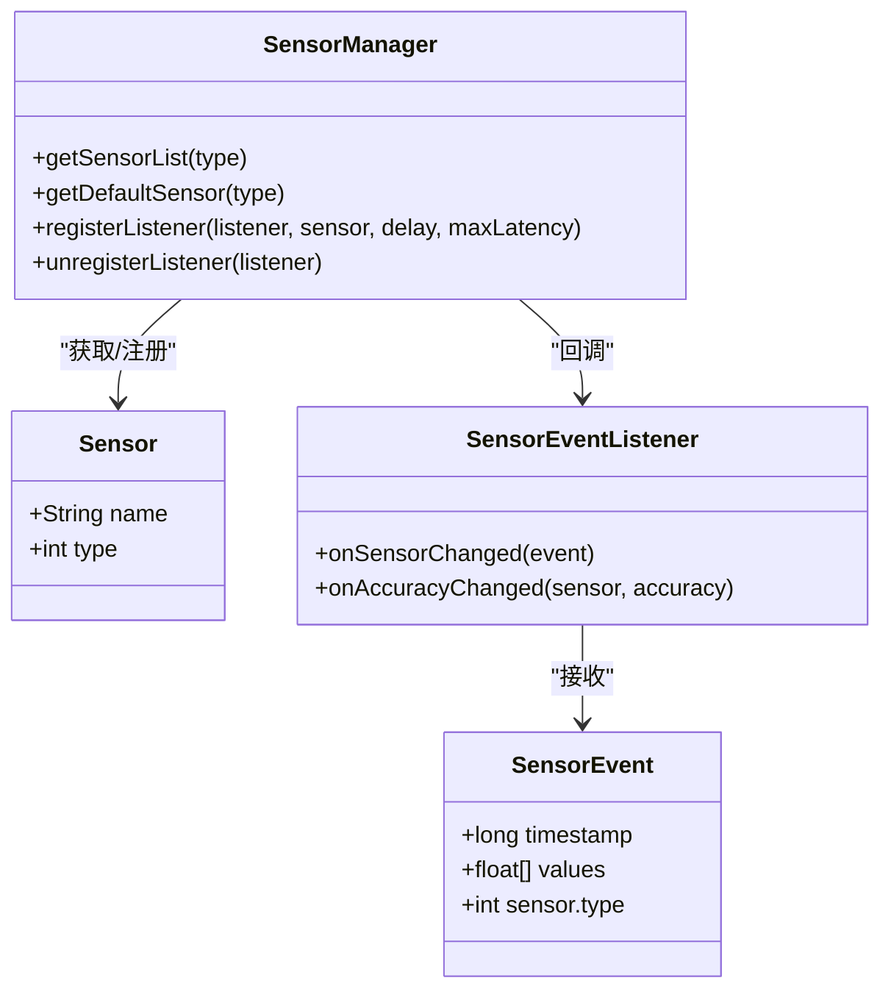
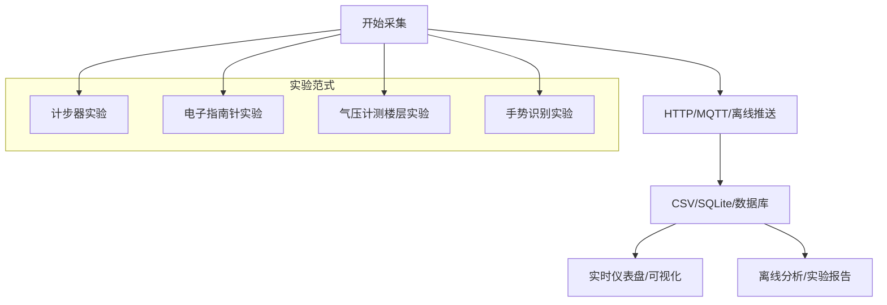
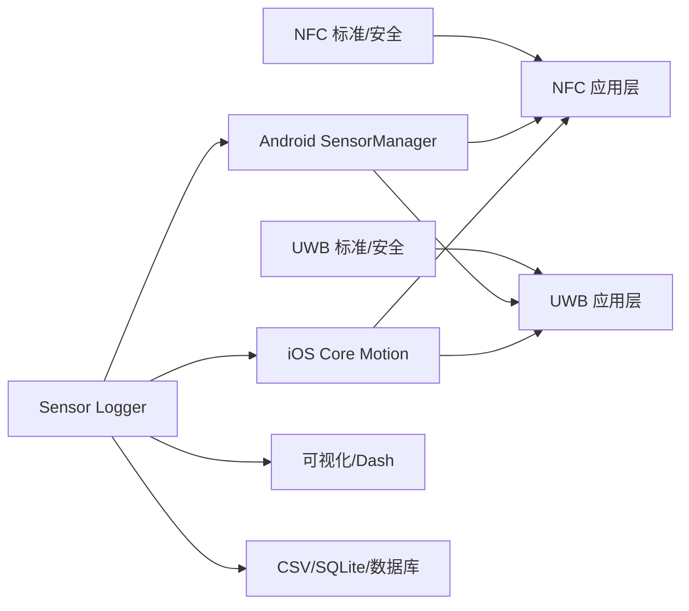

# 通信与其他传感器

<cite>
**本文引用的文件**
- [README.md](file://README.md)
- [nfc.md](file://docs/sensors/others/nfc.md)
- [uwb.md](file://docs/sensors/others/uwb.md)
- [overview.md](file://docs/sensors/overview.md)
- [android.md](file://docs/programming/android.md)
- [ios.md](file://docs/programming/ios.md)
- [sensor-logger.md](file://docs/practice/sensor-logger.md)
- [data-collection.md](file://docs/practice/data-collection.md)
</cite>

## 目录
1. [简介](#简介)
2. [项目结构](#项目结构)
3. [核心组件](#核心组件)
4. [架构总览](#架构总览)
5. [详细组件分析](#详细组件分析)
6. [依赖关系分析](#依赖关系分析)
7. [性能考量](#性能考量)
8. [故障排查指南](#故障排查指南)
9. [结论](#结论)
10. [附录](#附录)

## 简介
本章节面向高校教学与工程实践，系统梳理智能手机中的通信与其他传感器（NFC、UWB）的技术规范、工作原理、应用场景与跨平台API集成方法。文档以“原理—技术—应用—实践”为主线，既覆盖NFC的电磁感应耦合与NDEF数据格式，也涵盖UWB的超宽带脉冲与厘米级测距/定位能力；并通过Android/iOS传感器API与数据采集工具链，给出可操作的集成与优化建议。

## 项目结构
本项目采用“文档即代码”的知识体系，围绕传感器主题构建了从总览到分项、从原理到实践的完整知识地图。通信与其他传感器位于“sensors/others”，并配套编程接口与实践案例。

图表来源
- [README.md:18-55](file://README.md#L18-L55)
- [overview.md:19-61](file://docs/sensors/overview.md#L19-L61)
- [nfc.md:1-175](file://docs/sensors/others/nfc.md#L1-L175)
- [uwb.md:1-158](file://docs/sensors/others/uwb.md#L1-L158)
- [android.md:1-290](file://docs/programming/android.md#L1-L290)
- [ios.md:1-334](file://docs/programming/ios.md#L1-L334)
- [sensor-logger.md:1-468](file://docs/practice/sensor-logger.md#L1-L468)
- [data-collection.md:1-192](file://docs/practice/data-collection.md#L1-L192)

章节来源
- [README.md:18-55](file://README.md#L18-L55)
- [overview.md:19-61](file://docs/sensors/overview.md#L19-L61)

## 核心组件
- NFC（近场通信）
  - 工作频率与耦合特性：13.56 MHz，基于互感耦合，典型工作距离≤10 cm。
  - 数据交换标准：NDEF（NFC Data Exchange Format），记录结构含TNF、Type、Payload等字段。
  - 安全与支付：eSE、SIM-SE、HCE等安全元件方案，支撑Apple Pay、Google Pay等非接触支付。
- UWB（超宽带）
  - 脉冲测距与AoA：使用纳秒级脉冲，双向测距（TWR）实现厘米级精度，结合天线阵列实现到达角估计。
  - 标准与参数：IEEE 802.15.4z，典型带宽≥500 MHz，测距精度±5–30 cm，测角精度±3°。
  - 安全机制：STS（Scrambled Timestamp Sequence）防中继攻击。
- 传感器系统与API
  - Android：SensorManager、Sensor、SensorEvent、批处理（batching）等。
  - iOS：Core Motion（CMMotionManager）、Device Motion融合、后台任务（BGProcessingTask）等。
- 实践工具链
  - Sensor Logger：跨平台数据采集与上云（HTTP/MQTT/离线），支持实时可视化与数据库入库。
  - 数据采集实验：计步器、电子指南针、气压计测楼层、手势识别等范式。

章节来源
- [nfc.md:3-13](file://docs/sensors/others/nfc.md#L3-L13)
- [nfc.md:45-78](file://docs/sensors/others/nfc.md#L45-L78)
- [nfc.md:33-42](file://docs/sensors/others/nfc.md#L33-L42)
- [uwb.md:3-14](file://docs/sensors/others/uwb.md#L3-L14)
- [uwb.md:17-42](file://docs/sensors/others/uwb.md#L17-L42)
- [uwb.md:68-93](file://docs/sensors/others/uwb.md#L68-L93)
- [android.md:8-18](file://docs/programming/android.md#L8-L18)
- [ios.md:8-26](file://docs/programming/ios.md#L8-L26)
- [sensor-logger.md:8-58](file://docs/practice/sensor-logger.md#L8-L58)
- [data-collection.md:8-61](file://docs/practice/data-collection.md#L8-L61)

## 架构总览
下图展示从硬件到应用的端到端路径：设备侧传感器（NFC/UWB）经平台API采集，再通过数据采集工具链完成本地/云端处理与可视化。

图表来源
- [nfc.md:16-42](file://docs/sensors/others/nfc.md#L16-L42)
- [uwb.md:17-42](file://docs/sensors/others/uwb.md#L17-L42)
- [android.md:10-18](file://docs/programming/android.md#L10-L18)
- [ios.md:10-26](file://docs/programming/ios.md#L10-L26)
- [sensor-logger.md:74-180](file://docs/practice/sensor-logger.md#L74-L180)

## 详细组件分析

### NFC 组件分析
- 工作原理与耦合模型
  - 基于13.56 MHz电磁感应耦合，互感M与耦合系数k、线圈电感L相关，典型工作距离≤10 cm。
- 数据交换与NDEF
  - NDEF消息由若干NDEF Record组成，包含TNF、Type、Payload Length、Payload等字段；URI前缀缩写码用于压缩存储。
- 安全与支付
  - eSE（嵌入式安全元件）、SIM-SE（SIM卡内安全元件）、HCE（主机卡模拟）分别对应Apple Pay、运营商方案与Android HCE。
- 应用实例
  - NDEF消息解析与URI解码的Python示例，便于理解数据结构与解包流程。

图表来源
- [nfc.md:16-42](file://docs/sensors/others/nfc.md#L16-L42)
- [nfc.md:45-78](file://docs/sensors/others/nfc.md#L45-L78)
- [nfc.md:112-166](file://docs/sensors/others/nfc.md#L112-L166)

章节来源
- [nfc.md:16-42](file://docs/sensors/others/nfc.md#L16-L42)
- [nfc.md:45-78](file://docs/sensors/others/nfc.md#L45-L78)
- [nfc.md:112-166](file://docs/sensors/others/nfc.md#L112-L166)

### UWB 组件分析
- 工作原理与信号特征
  - 使用纳秒级脉冲，对比传统窄带连续信号具有更高的时间分辨率；通过双向测距（TWR）计算距离；AoA结合天线阵列估计来波方向。
- 关键参数与标准
  - 带宽≥500 MHz，测距精度±5–30 cm，测角精度±3°；IEEE 802.15.4z标准；典型信道中心频率与带宽。
- 安全机制
  - STS（Scrambled Timestamp Sequence）防止中继攻击，保障数字车钥匙等安全场景。
- 应用实例
  - DS-TWR双边测距与二维三边定位的Python示例，便于理解测距与定位算法。

图表来源
- [uwb.md:28-42](file://docs/sensors/others/uwb.md#L28-L42)
- [uwb.md:98-116](file://docs/sensors/others/uwb.md#L98-L116)
- [uwb.md:118-149](file://docs/sensors/others/uwb.md#L118-L149)

章节来源
- [uwb.md:17-42](file://docs/sensors/others/uwb.md#L17-L42)
- [uwb.md:68-93](file://docs/sensors/others/uwb.md#L68-L93)
- [uwb.md:98-149](file://docs/sensors/others/uwb.md#L98-L149)

### 传感器系统与API（Android/iOS）
- Android
  - SensorManager负责传感器枚举、注册监听、批处理（batching）与采样率控制；支持多传感器同时采集与数据格式约定。
- iOS
  - Core Motion提供CMMotionManager、CMAltimeter、CMPedometer等；Device Motion融合输出姿态、线性加速度、重力等；支持后台任务（BGProcessingTask）。
- 跨平台一致性
  - Sensor Logger提供“标准化单位与帧系”选项，统一iOS/g的单位与ENU坐标系，便于课堂混用设备的数据对比。

图表来源
- [android.md:10-18](file://docs/programming/android.md#L10-L18)
- [android.md:70-137](file://docs/programming/android.md#L70-L137)
- [android.md:251-281](file://docs/programming/android.md#L251-L281)

章节来源
- [android.md:10-18](file://docs/programming/android.md#L10-L18)
- [android.md:70-137](file://docs/programming/android.md#L70-L137)
- [android.md:251-281](file://docs/programming/android.md#L251-L281)
- [ios.md:10-26](file://docs/programming/ios.md#L10-L26)
- [ios.md:124-161](file://docs/programming/ios.md#L124-L161)
- [sensor-logger.md:420-431](file://docs/practice/sensor-logger.md#L420-L431)

### 数据采集与实践（Sensor Logger 与实验范式）
- 数据采集与上云
  - HTTP POST实时推送、MQTT多设备汇聚、离线文件上传三种路径；支持JSON/CSV/KML/SQLite等多种导出格式。
  - 提供Flask/Plotly Dash/EMQX等云端接收与可视化方案。
- 实验范式
  - 计步器：基于加速度合成量与带通滤波、峰值检测的简易算法。
  - 电子指南针：加速度+磁力计的倾斜补偿航向计算。
  - 气压计测楼层：气压转海拔、相对高度变化与楼层估算。
  - 手势识别：时域特征提取与KNN分类器的交叉验证评估。

图表来源
- [sensor-logger.md:74-180](file://docs/practice/sensor-logger.md#L74-L180)
- [sensor-logger.md:236-346](file://docs/practice/sensor-logger.md#L236-L346)
- [sensor-logger.md:349-400](file://docs/practice/sensor-logger.md#L349-L400)
- [data-collection.md:8-61](file://docs/practice/data-collection.md#L8-L61)
- [data-collection.md:63-106](file://docs/practice/data-collection.md#L63-L106)
- [data-collection.md:109-147](file://docs/practice/data-collection.md#L109-L147)
- [data-collection.md:155-192](file://docs/practice/data-collection.md#L155-L192)

章节来源
- [sensor-logger.md:74-180](file://docs/practice/sensor-logger.md#L74-L180)
- [sensor-logger.md:236-346](file://docs/practice/sensor-logger.md#L236-L346)
- [sensor-logger.md:349-400](file://docs/practice/sensor-logger.md#L349-L400)
- [data-collection.md:8-61](file://docs/practice/data-collection.md#L8-L61)
- [data-collection.md:63-106](file://docs/practice/data-collection.md#L63-L106)
- [data-collection.md:109-147](file://docs/practice/data-collection.md#L109-L147)
- [data-collection.md:155-192](file://docs/practice/data-collection.md#L155-L192)

## 依赖关系分析
- 技术依赖
  - NFC：ISO 14443/18092/15693标准，NDEF数据格式，安全元件（eSE/SIM-SE/HCE）。
  - UWB：IEEE 802.15.4z标准，STS安全机制，脉冲测距与AoA。
- 平台依赖
  - Android：SensorManager、批处理（batching）、权限管理。
  - iOS：Core Motion、Device Motion、后台任务（BGProcessingTask）。
- 工具链依赖
  - Sensor Logger：HTTP/MQTT/离线三种上云路径；Flask/Dash/EMQX等云端组件。
- 数据依赖
  - 实验范式依赖传感器数据格式（Android m/s² vs iOS g）与坐标系一致性（ENU）。

图表来源
- [nfc.md:3-13](file://docs/sensors/others/nfc.md#L3-L13)
- [uwb.md:3-14](file://docs/sensors/others/uwb.md#L3-L14)
- [android.md:10-18](file://docs/programming/android.md#L10-L18)
- [ios.md:10-26](file://docs/programming/ios.md#L10-L26)
- [sensor-logger.md:74-180](file://docs/practice/sensor-logger.md#L74-L180)

章节来源
- [nfc.md:3-13](file://docs/sensors/others/nfc.md#L3-L13)
- [uwb.md:3-14](file://docs/sensors/others/uwb.md#L3-L14)
- [android.md:10-18](file://docs/programming/android.md#L10-L18)
- [ios.md:10-26](file://docs/programming/ios.md#L10-L26)
- [sensor-logger.md:74-180](file://docs/practice/sensor-logger.md#L74-L180)

## 性能考量
- NFC
  - 通信距离短（≤10 cm），数据速率106/212/424 kbps；无源标签由读写器磁场供电，典型功耗低。
- UWB
  - 脉冲带宽≥500 MHz，测距精度可达厘米级；AoA提供方向感知；STS提升安全性。
- 传感器API
  - Android批处理（batching）可显著降低功耗；采样率过高会增加CPU负载与耗电。
  - iOS后台传感器采集受系统限制，建议使用较低采样率与系统调度任务。
- 实践建议
  - 课堂混用设备时开启“标准化单位与帧系”，确保数据可比性。
  - 选择合适的上云路径：单人验证用HTTP POST，多人同步用MQTT，课后批量用离线上传。

章节来源
- [nfc.md:7-12](file://docs/sensors/others/nfc.md#L7-L12)
- [uwb.md:7-13](file://docs/sensors/others/uwb.md#L7-L13)
- [android.md:149-153](file://docs/programming/android.md#L149-L153)
- [android.md:251-281](file://docs/programming/android.md#L251-L281)
- [ios.md:206-258](file://docs/programming/ios.md#L206-L258)
- [sensor-logger.md:402-417](file://docs/practice/sensor-logger.md#L402-L417)
- [sensor-logger.md:420-431](file://docs/practice/sensor-logger.md#L420-L431)

## 故障排查指南
- NFC
  - 无源标签无法工作：检查读写器磁场强度与标签功耗匹配；确认耦合距离与方向。
  - NDEF解析失败：核对TNF/Type/Payload长度与顺序；检查URI前缀表是否完整。
- UWB
  - 测距异常：检查时钟同步与环境干扰；确认使用DS-TWR公式消除时钟偏移。
  - AoA方向不准：检查天线阵列校准与相位差测量精度。
- Android
  - 传感器未触发：确认权限与生命周期管理（onResume/onPause）；检查采样率与批处理参数。
- iOS
  - 后台采集受限：遵循系统限制，使用BGProcessingTask；降低采样率减少耗电。
- 数据采集
  - 跨平台数据不一致：开启“标准化单位与帧系”；统一坐标系（ENU）。
  - 上云失败：验证Push URL/MQTT Broker连接与TLS/WSS配置。

章节来源
- [nfc.md:112-166](file://docs/sensors/others/nfc.md#L112-L166)
- [uwb.md:98-149](file://docs/sensors/others/uwb.md#L98-L149)
- [android.md:149-153](file://docs/programming/android.md#L149-L153)
- [ios.md:206-258](file://docs/programming/ios.md#L206-L258)
- [sensor-logger.md:420-431](file://docs/practice/sensor-logger.md#L420-L431)

## 结论
NFC与UWB作为短距离通信与定位的关键传感器，在移动设备中承担着非接触支付、设备配对、文件传输、室内定位与资产跟踪等重要角色。通过理解其物理原理、数据格式与安全机制，并结合Android/iOS平台API与Sensor Logger工具链，开发者可在教学与工程实践中高效实现从数据采集到可视化的完整闭环。未来，随着标准演进与芯片集成度提升，NFC与UWB将在更多场景中发挥更大价值。

## 附录
- 延展阅读
  - NFC：NFC Forum技术规范、Android NFC开发指南、Apple Core NFC文档。
  - UWB：Nearby Interaction框架、Android UWB API、FiRa联盟标准组织。
- 代码与示例
  - NFC NDEF解析与URI解码的Python示例路径：[nfc.md:112-166](file://docs/sensors/others/nfc.md#L112-L166)
  - UWB DS-TWR与三边定位的Python示例路径：[uwb.md:98-149](file://docs/sensors/others/uwb.md#L98-L149)
  - Android传感器基本使用与批处理示例路径：[android.md:54-137](file://docs/programming/android.md#L54-L137)、[android.md:251-281](file://docs/programming/android.md#L251-L281)
  - iOS传感器融合与后台任务示例路径：[ios.md:64-161](file://docs/programming/ios.md#L64-L161)、[ios.md:206-258](file://docs/programming/ios.md#L206-L258)
  - 数据采集与上云路径：HTTP POST、MQTT、离线上传的示例与配置路径：[sensor-logger.md:74-180](file://docs/practice/sensor-logger.md#L74-L180)、[sensor-logger.md:236-346](file://docs/practice/sensor-logger.md#L236-L346)、[sensor-logger.md:349-400](file://docs/practice/sensor-logger.md#L349-L400)