# Sensor Logger使用指南

<cite>
**本文档引用的文件**
- [README.md](file://README.md)
- [sensor-logger.md](file://docs/practice/sensor-logger.md)
- [android.md](file://docs/programming/android.md)
- [ios.md](file://docs/programming/ios.md)
- [data-collection.md](file://docs/practice/data-collection.md)
- [server.py](file://scripts/server.py)
- [tray.py](file://scripts/tray.py)
- [dashboard.html](file://scripts/dashboard.html)
- [启动托盘程序.bat](file://启动托盘程序.bat)
- [启动托盘程序.vbs](file://启动托盘程序.vbs)
- [analyze_data.py](file://scripts/analyze_data.py)
- [analyze_5g_data.py](file://scripts/analyze_5g_data.py)
</cite>

## 更新摘要
**所做更改**
- 更新系统托盘程序启动方式，新增VBScript无窗口启动选项
- 升级服务器功能，从简单HTTP POST接收器为完整的实时数据处理和可视化平台
- 新增CSV自动记录、实时仪表盘和SSE流式传输功能
- 新增智能IP检测、多设备管理和实时数据可视化功能
- 更新双启动方式的使用说明和故障排除指南

## 目录
1. [项目简介](#项目简介)
2. [项目结构](#项目结构)
3. [核心组件](#核心组件)
4. [架构概览](#架构概览)
5. [详细组件分析](#详细组件分析)
6. [依赖关系分析](#依赖关系分析)
7. [性能考虑](#性能考虑)
8. [故障排除指南](#故障排除指南)
9. [结论](#结论)
10. [附录](#附录)

## 项目简介

Mobile-Sensor-2026是一个面向高校教学的智能手机传感器技术文档项目，采用MkDocs + Material主题构建，涵盖从硬件原理到编程实践的完整知识体系。该项目特别专注于Sensor Logger应用的使用和开发，为学生和教师提供全面的传感器数据采集和分析解决方案。

**更新** 项目现已升级为支持双启动方式的系统托盘程序，服务器功能从简单的HTTP POST接收器升级为完整的实时数据处理和可视化平台，新增智能IP检测、多设备支持和实时仪表盘等功能。

## 项目结构

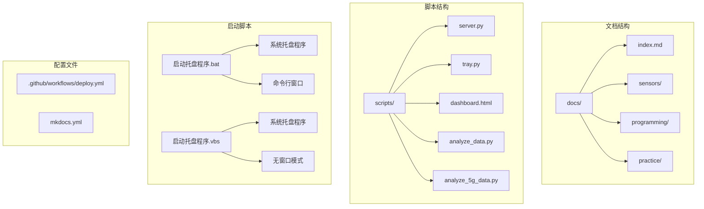

**图表来源**
- [README.md:18-55](file://README.md#L18-L55)
- [sensor-logger.md:1-468](file://docs/practice/sensor-logger.md#L1-L468)
- [启动托盘程序.bat:1-13](file://启动托盘程序.bat#L1-L13)
- [启动托盘程序.vbs:1-32](file://启动托盘程序.vbs#L1-L32)

**章节来源**
- [README.md:18-55](file://README.md#L18-L55)
- [README.md:80-94](file://README.md#L80-L94)

## 核心组件

### Sensor Logger应用

Sensor Logger是一个跨平台的传感器数据记录应用，支持iOS和Android平台，提供以下核心功能：

- **多传感器支持**：加速度计、陀螺仪、磁力计、重力、气压计、GPS、麦克风、摄像头等
- **实时数据上云**：支持HTTP POST和MQTT两种数据推送方式
- **数据导出**：CSV、JSON、Excel、KML、SQLite等多种格式
- **跨平台一致性**：支持标准化单位和坐标系

### 数据处理管道

项目提供了完整的数据处理生态系统：

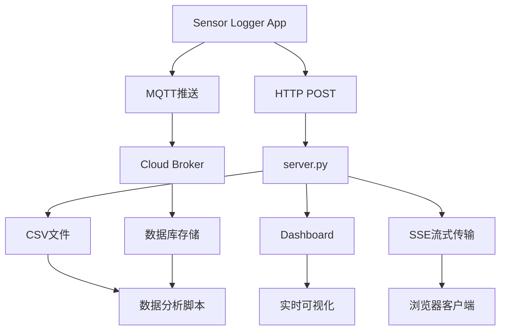

**图表来源**
- [sensor-logger.md:74-400](file://docs/practice/sensor-logger.md#L74-L400)
- [server.py:11-94](file://scripts/server.py#L11-L94)

**章节来源**
- [sensor-logger.md:8-71](file://docs/practice/sensor-logger.md#L8-L71)
- [sensor-logger.md:74-400](file://docs/practice/sensor-logger.md#L74-L400)

## 架构概览

### 5G远程数据采集架构

项目支持通过ngrok实现5G公网穿透，让5G手机能够将传感器数据实时推送到本地电脑：

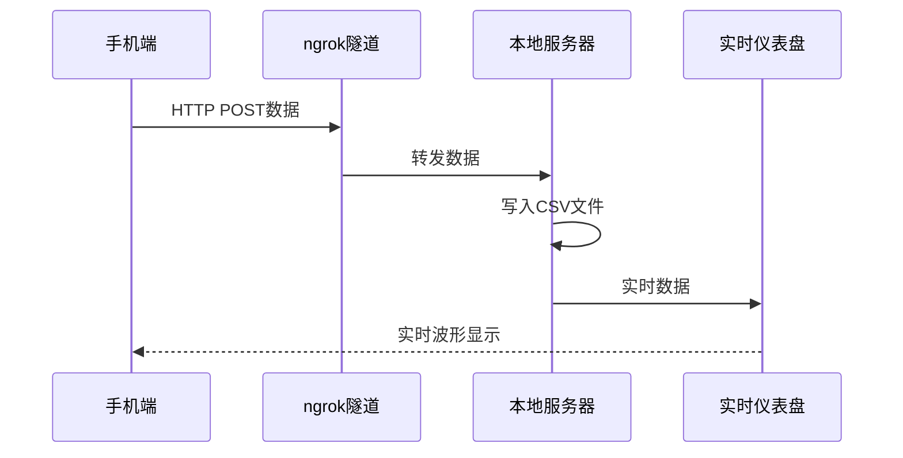

**图表来源**
- [README.md:96-144](file://README.md#L96-L144)
- [server.py:35-81](file://scripts/server.py#L35-L81)

### 多设备数据汇聚架构

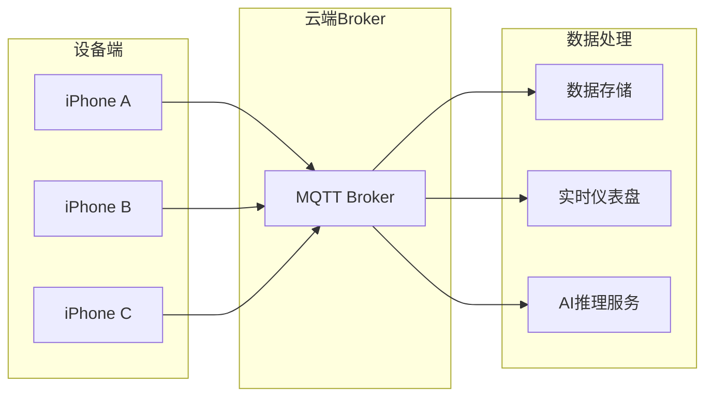

**图表来源**
- [sensor-logger.md:236-346](file://docs/practice/sensor-logger.md#L236-L346)

### 实时数据处理和可视化平台

**更新** 服务器功能已升级为完整的实时数据处理和可视化平台：

#### CSV自动记录功能

服务器现在具备自动CSV记录功能，支持按会话ID分文件存储：

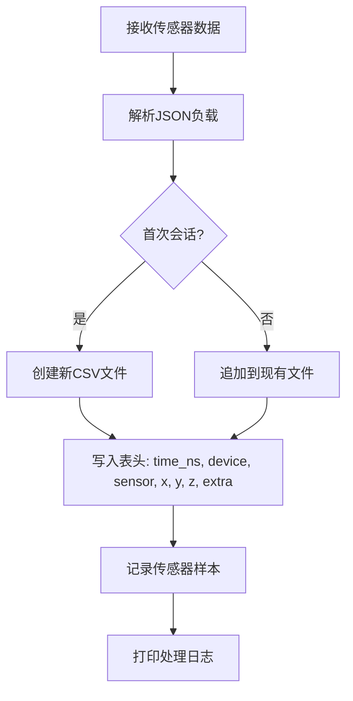

**图表来源**
- [server.py:42-76](file://scripts/server.py#L42-L76)

#### 实时仪表盘功能

新增的实时仪表盘支持浏览器访问，提供动态可视化：

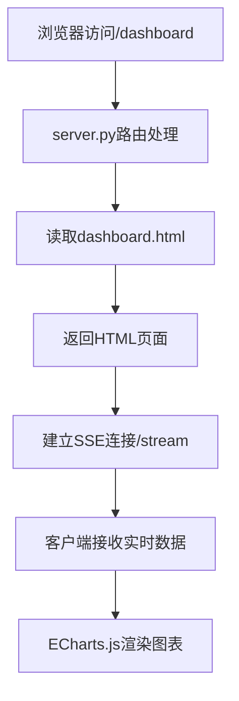

**图表来源**
- [server.py:211-216](file://scripts/server.py#L211-L216)
- [server.py:184-208](file://scripts/server.py#L184-L208)
- [dashboard.html:625-638](file://scripts/dashboard.html#L625-L638)

#### SSE流式传输功能

服务器实现了基于Server-Sent Events的实时数据流传输：

```mermaid
flowchart TD
A[数据到达/data端点] --> B[downsample_and_broadcast函数]
B --> C[按传感器分组数据]
C --> D[下采样处理(100Hz->20Hz)]
D --> E[转换为标准格式]
E --> F[广播到所有SSE客户端]
F --> G[客户端接收事件流]
G --> H[实时更新图表]
```

**图表来源**
- [server.py:117-179](file://scripts/server.py#L117-L179)
- [server.py:98-115](file://scripts/server.py#L98-L115)

**章节来源**
- [README.md:96-144](file://README.md#L96-L144)
- [sensor-logger.md:236-346](file://docs/practice/sensor-logger.md#L236-L346)
- [server.py:1-237](file://scripts/server.py#L1-L237)

## 详细组件分析

### 系统托盘程序双启动方式

**更新** 系统托盘程序现已支持双启动方式，提供更灵活的使用体验：

#### VBScript无窗口启动方式

启动托盘程序.vbs提供了无窗口启动模式，适合长期运行的服务：

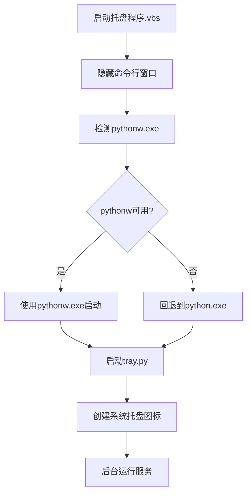

**图表来源**
- [启动托盘程序.vbs:13-20](file://启动托盘程序.vbs#L13-L20)

#### 批处理命令行启动方式

启动托盘程序.bat提供带命令行窗口的启动模式，便于调试和监控：

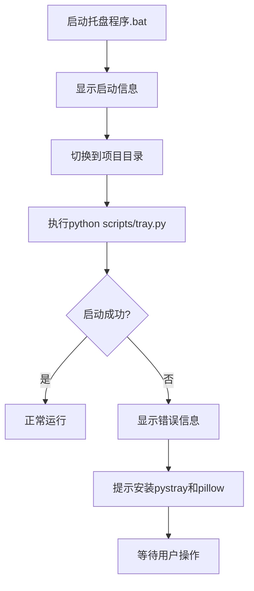

**图表来源**
- [启动托盘程序.bat:1-12](file://启动托盘程序.bat#L1-L12)

### 智能IP检测和多设备管理

**更新** 系统托盘程序新增了智能IP检测功能，能够自动识别真实局域网IP，避免VPN虚拟IP干扰：

#### 智能IP检测机制

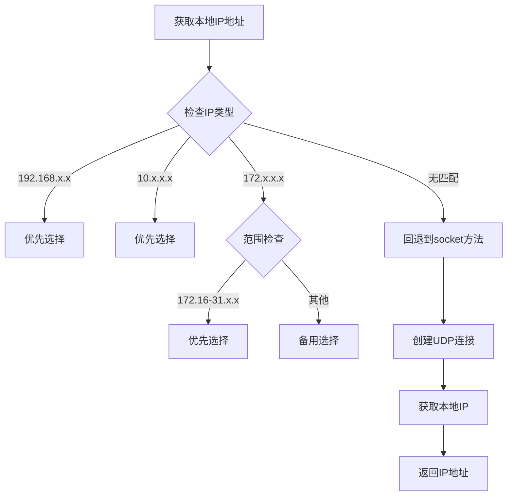

**图表来源**
- [tray.py:27-56](file://scripts/tray.py#L27-L56)

#### 多设备数据管理

服务器现在支持同时接入多个手机设备，提供设备切换和数据过滤功能：

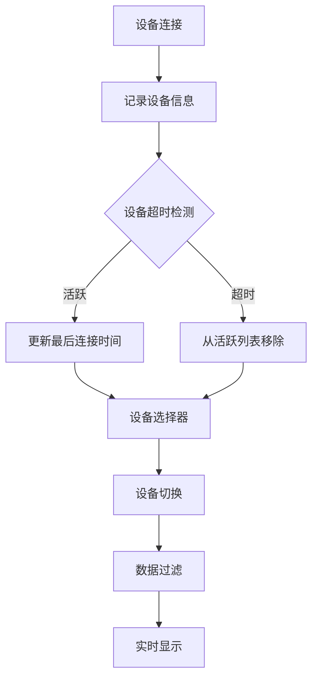

**图表来源**
- [server.py:131-136](file://scripts/server.py#L131-L136)
- [server.py:268-282](file://scripts/server.py#L268-L282)

**章节来源**
- [启动托盘程序.vbs:1-32](file://启动托盘程序.vbs#L1-L32)
- [启动托盘程序.bat:1-13](file://启动托盘程序.bat#L1-L13)
- [tray.py:27-56](file://scripts/tray.py#L27-L56)
- [server.py:131-136](file://scripts/server.py#L131-L136)
- [server.py:268-282](file://scripts/server.py#L268-L282)

### 实时数据处理和可视化平台

**更新** 服务器功能已升级为完整的实时数据处理和可视化平台：

#### CSV自动记录功能

服务器现在具备自动CSV记录功能，支持按会话ID分文件存储：


**图表来源**
- [server.py:42-76](file://scripts/server.py#L42-L76)

#### 实时仪表盘功能

新增的实时仪表盘支持浏览器访问，提供动态可视化：


**图表来源**
- [server.py:211-216](file://scripts/server.py#L211-L216)
- [server.py:184-208](file://scripts/server.py#L184-L208)
- [dashboard.html:625-638](file://scripts/dashboard.html#L625-L638)

#### SSE流式传输功能

服务器实现了基于Server-Sent Events的实时数据流传输：

```mermaid
flowchart TD
A[数据到达/data端点] --> B[downsample_and_broadcast函数]
B --> C[按传感器分组数据]
C --> D[下采样处理(100Hz->20Hz)]
D --> E[转换为标准格式]
E --> F[广播到所有SSE客户端]
F --> G[客户端接收事件流]
G --> H[实时更新图表]
```

**图表来源**
- [server.py:117-179](file://scripts/server.py#L117-L179)
- [server.py:98-115](file://scripts/server.py#L98-L115)

**章节来源**
- [server.py:1-237](file://scripts/server.py#L1-L237)

### Sensor Logger应用配置

#### iOS平台配置

iOS平台的Sensor Logger应用具有以下特点：
- **原生支持**：基于Core Motion框架
- **传感器覆盖**：加速度计、陀螺仪、磁力计、气压计、计步器等
- **数据格式**：iOS特有的g单位表示法
- **权限管理**：基于Info.plist的权限声明

#### Android平台配置

Android平台的Sensor Logger应用支持：
- **传感器API**：基于android.hardware包
- **权限系统**：运行时权限管理
- **采样率控制**：支持多种采样率选项
- **批处理模式**：降低功耗的批处理机制

**章节来源**
- [sensor-logger.md:24-58](file://docs/practice/sensor-logger.md#L24-L58)
- [android.md:8-18](file://docs/programming/android.md#L8-L18)
- [ios.md:8-26](file://docs/programming/ios.md#L8-L26)

### 数据导出和处理

#### 支持的数据格式

| 格式 | 说明 | 适用场景 |
|:-----|:-----|:---------|
| CSV (单独) | 每个传感器一个CSV文件 | 基础数据导出 |
| CSV (合并) | 所有传感器合并到一个CSV | 大数据分析 |
| JSON | 原始JSON格式 | 程序化处理 |
| Excel | .xlsx格式 | 传统办公软件 |
| KML | GPS轨迹 | 地图应用 |
| SQLite | 数据库格式 | 大数据量查询 |

#### 数据处理脚本

项目提供了多种数据分析脚本：

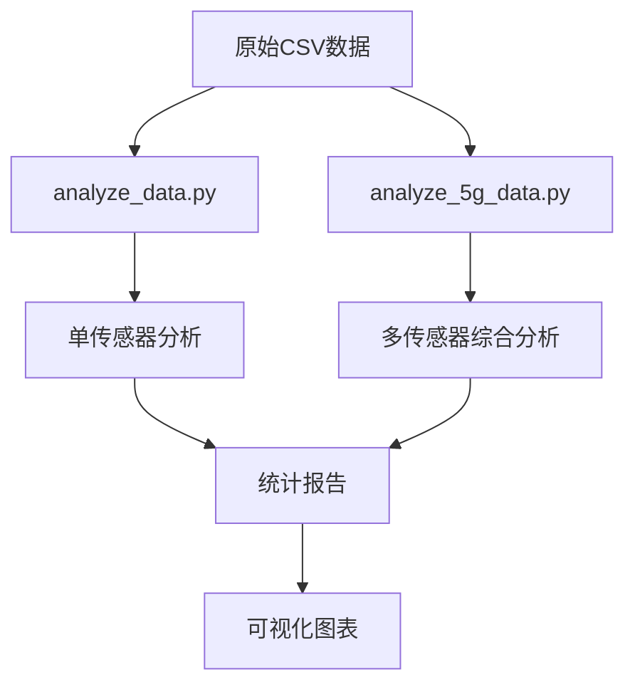

**图表来源**
- [analyze_data.py:1-98](file://scripts/analyze_data.py#L1-L98)
- [analyze_5g_data.py:1-360](file://scripts/analyze_5g_data.py#L1-L360)

**章节来源**
- [sensor-logger.md:61-71](file://docs/practice/sensor-logger.md#L61-L71)
- [analyze_data.py:1-98](file://scripts/analyze_data.py#L1-L98)
- [analyze_5g_data.py:1-360](file://scripts/analyze_5g_data.py#L1-L360)

### 实验实践指南

#### 计步器实验

基于加速度计数据实现的计步算法实验：

```mermaid
flowchart TD
A[采集加速度计数据] --> B[计算合成加速度]
B --> C[带通滤波(1-3Hz)]
C --> D[峰值检测]
D --> E[步数统计]
E --> F[与手机内置计步器对比]
```

**图表来源**
- [data-collection.md:8-60](file://docs/practice/data-collection.md#L8-L60)

#### 电子指南针实验

利用加速度计和磁力计数据实现带倾斜补偿的电子指南针：

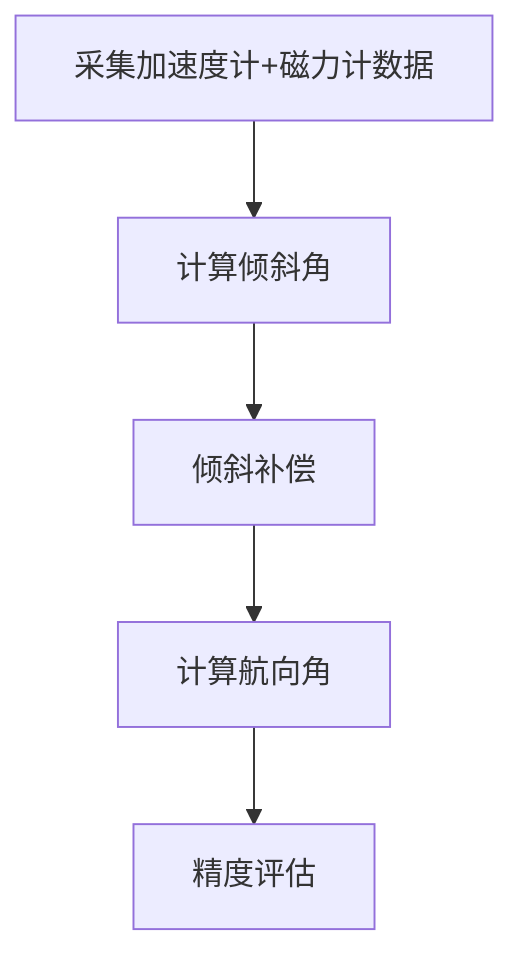

**图表来源**
- [data-collection.md:63-106](file://docs/practice/data-collection.md#L63-L106)

**章节来源**
- [data-collection.md:8-192](file://docs/practice/data-collection.md#L8-L192)

## 依赖关系分析

### 技术栈依赖

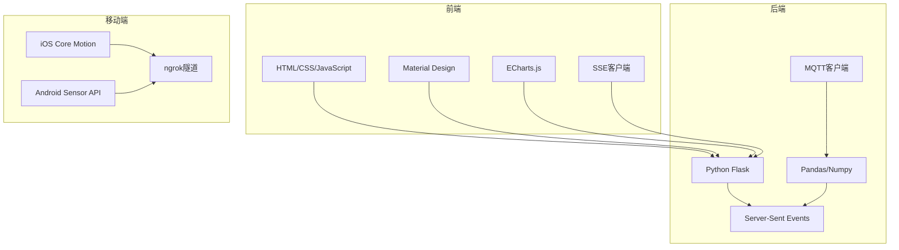

**图表来源**
- [README.md:68-79](file://README.md#L68-L79)

### 传感器API对比

| 对比项 | Android | iOS |
|:-------|:--------|:----|
| 原始加速度计 | TYPE_ACCELEROMETER | startAccelerometerUpdates |
| 原始陀螺仪 | TYPE_GYROSCOPE | startGyroUpdates |
| 原始磁力计 | TYPE_MAGNETIC_FIELD | startMagnetometerUpdates |
| 融合姿态 | TYPE_ROTATION_VECTOR | CMDeviceMotion.attitude |
| 线性加速度 | TYPE_LINEAR_ACCELERATION | CMDeviceMotion.userAcceleration |
| 重力 | TYPE_GRAVITY | CMDeviceMotion.gravity |
| 气压 | TYPE_PRESSURE | CMAltimeter.pressure |
| 计步 | TYPE_STEP_COUNTER | CMPedometer |

**图表来源**
- [ios.md:310-326](file://docs/programming/ios.md#L310-L326)

**章节来源**
- [README.md:68-79](file://README.md#L68-L79)
- [ios.md:310-326](file://docs/programming/ios.md#L310-L326)

## 性能考虑

### 采样率优化

不同采样率对功耗和精度的影响：

| 采样率 | 延迟(ms) | 频率(Hz) | 适用场景 |
|:-------|:---------|:---------|:---------|
| SENSOR_DELAY_NORMAL | ~200 | ~5 | 屏幕旋转 |
| SENSOR_DELAY_UI | ~60 | ~16 | UI动画 |
| SENSOR_DELAY_GAME | ~20 | ~50 | 游戏控制 |
| SENSOR_DELAY_FASTEST | ~0 | 硬件最大 | 数据采集 |

### 批处理模式

批处理模式可以显著降低功耗：

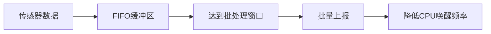

**图表来源**
- [android.md:251-271](file://docs/programming/android.md#L251-L271)

### SSE流式传输优化

**更新** 新增的SSE流式传输功能包含以下优化：

- **下采样处理**：默认将100Hz数据降采样至20Hz，减少带宽占用
- **客户端队列管理**：每个客户端最多缓存50个事件消息
- **心跳机制**：空闲时发送心跳信号保持连接活跃
- **内存管理**：自动清理断开连接的客户端

### 实时仪表盘性能优化

**更新** 新增的实时仪表盘包含以下性能优化：

- **ECharts集成**：高性能图表渲染引擎
- **设备过滤**：支持多设备同时显示和切换
- **主题切换**：深色/浅色主题自动适配
- **缓冲区管理**：每个传感器最多200个点的缓冲区

**章节来源**
- [android.md:139-153](file://docs/programming/android.md#L139-L153)
- [android.md:251-281](file://docs/programming/android.md#L251-L281)
- [server.py:88-96](file://scripts/server.py#L88-L96)
- [server.py:184-208](file://scripts/server.py#L184-L208)
- [dashboard.html:303-379](file://scripts/dashboard.html#L303-L379)

## 故障排除指南

### 系统托盘程序启动问题

**更新** 针对双启动方式新增的故障排除指南：

#### VBScript启动失败

**症状**：启动托盘程序.vbs后无反应或立即退出
**原因**：
- pythonw.exe未安装或路径错误
- Python环境配置问题
- 权限不足

**解决方法**：
1. 检查Python安装：`python --version`
2. 验证pythonw.exe存在：`where pythonw`
3. 以管理员权限运行
4. 确认Python路径正确

#### 批处理启动问题

**症状**：启动托盘程序.bat后命令行窗口闪退
**原因**：
- Python模块缺失
- 脚本路径错误
- 编码问题

**解决方法**：
1. 安装必需模块：`pip install pystray pillow`
2. 检查脚本路径是否正确
3. 确认文件编码为UTF-8
4. 在命令行中手动测试Python导入

#### 服务器启动问题

**症状**：server.py无法启动或端口被占用
**原因**：
- 端口已被占用
- Flask未安装
- 权限不足

**解决方法**：
1. 更改端口号：`python server.py -p 8081`
2. 安装Flask：`pip install flask`
3. 以管理员权限运行
4. 检查防火墙设置

### 实时数据传输问题

**更新** 新增的实时数据传输相关故障排除：

#### SSE连接失败

**症状**：浏览器无法连接到实时仪表盘
**原因**：
- CORS跨域问题
- 网络连接中断
- 服务器过载

**解决方法**：
1. 检查浏览器控制台错误
2. 验证服务器日志
3. 减少同时连接的客户端数量
4. 检查网络稳定性

#### 数据显示异常

**症状**：实时图表显示不正常或数据丢失
**原因**：
- 下采样导致数据稀疏
- 客户端队列溢出
- 时间戳不一致

**解决方法**：
1. 调整下采样比例
2. 增加客户端队列大小
3. 确保所有设备时间同步
4. 检查数据格式一致性

#### CSV记录问题

**症状**：数据未正确写入CSV文件
**原因**：
- 文件权限问题
- 磁盘空间不足
- 编码格式错误

**解决方法**：
1. 检查data/目录写权限
2. 清理磁盘空间
3. 确认文件编码为UTF-8
4. 检查JSON数据格式

#### 多设备显示问题

**症状**：实时仪表盘无法正确显示多个设备数据
**原因**：
- 设备过滤设置错误
- 设备超时检测
- 缓冲区管理问题

**解决方法**：
1. 检查设备选择器设置
2. 确认设备活跃状态
3. 清理缓冲区数据
4. 重新连接设备

**章节来源**
- [sensor-logger.md:420-431](file://docs/practice/sensor-logger.md#L420-L431)
- [server.py:35-81](file://scripts/server.py#L35-L81)
- [启动托盘程序.bat:7-12](file://启动托盘程序.bat#L7-L12)
- [启动托盘程序.vbs:22-31](file://启动托盘程序.vbs#L22-L31)
- [tray.py:27-56](file://scripts/tray.py#L27-L56)
- [server.py:131-136](file://scripts/server.py#L131-L136)

### 调试工具

#### 系统托盘管理器

项目提供了便捷的系统托盘管理器，支持一键启动/停止服务：

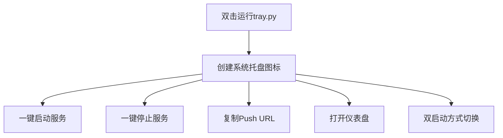

**图表来源**
- [tray.py:18-276](file://scripts/tray.py#L18-L276)

**章节来源**
- [tray.py:18-276](file://scripts/tray.py#L18-L276)

## 结论

Mobile-Sensor-2026项目为智能手机传感器技术教学提供了完整的解决方案。通过Sensor Logger应用和配套的数据处理工具，学生可以深入理解传感器原理、数据采集和分析方法。项目的特点包括：

1. **跨平台支持**：同时支持iOS和Android平台
2. **完整的工具链**：从数据采集到分析的全流程工具
3. **教学友好**：简洁的界面和详细的文档
4. **扩展性强**：支持多种数据格式和处理方式
5. **实时可视化**：新增的SSE流式传输和实时仪表盘功能
6. **双启动方式**：灵活的系统托盘程序启动选项
7. **智能IP检测**：自动识别真实局域网IP，避免VPN干扰
8. **多设备支持**：支持同时接入多个手机，仪表盘可切换查看

**更新** 本次升级显著增强了系统的实用性和用户体验，特别是双启动方式、智能IP检测、多设备管理和实时数据处理功能，为实验者提供了更加便捷和高效的使用体验。

该指南为实验者提供了从安装配置到高级功能使用的完整路径，包括设备准备、传感器校准、数据采集和结果分析等各个环节。

## 附录

### 实验操作步骤模板

#### 基础实验步骤

1. **设备准备**
   - 确认手机电量充足
   - 关闭不必要的后台应用
   - 确保网络连接稳定

2. **应用配置**
   - 打开Sensor Logger应用
   - 选择需要的传感器
   - 设置合适的采样率
   - 配置数据导出格式

3. **数据采集**
   - 按照实验要求进行操作
   - 记录实验条件和环境参数
   - 确保数据完整性

4. **数据分析**
   - 导出CSV文件
   - 使用Python脚本进行分析
   - 生成可视化图表
   - 撰写实验报告

#### 高级功能使用

**多传感器同步**：
- 确保所有设备使用相同的采样率
- 实施时间戳同步机制
- 使用统一的数据格式

**自定义采样率**：
- 根据实验需求调整采样频率
- 平衡数据质量和功耗
- 考虑存储空间限制

**数据质量监控**：
- 实时监控传感器状态
- 检测异常数据
- 实施数据清洗策略

**实时数据可视化**：
- **更新** 使用SSE流式传输实现实时数据展示
- 配置浏览器访问实时仪表盘
- 监控数据传输状态和质量
- 调整下采样参数优化显示效果
- 使用设备选择器切换不同设备数据

**智能IP检测**：
- **更新** 系统托盘自动检测真实局域网IP
- 避免VPN虚拟IP干扰
- 支持多种网络环境
- 提供IP地址显示和复制功能

**双启动方式选择**：
- **更新** 根据使用场景选择启动方式
- 无窗口模式适合长期运行服务
- 命令行模式便于调试和监控
- 确保Python环境和依赖模块正确安装

**章节来源**
- [sensor-logger.md:420-431](file://docs/practice/sensor-logger.md#L420-L431)
- [data-collection.md:14-60](file://docs/practice/data-collection.md#L14-L60)
- [启动托盘程序.bat:114-118](file://启动托盘程序.bat#L114-L118)
- [启动托盘程序.vbs:13-20](file://启动托盘程序.vbs#L13-L20)
- [server.py:88-96](file://scripts/server.py#L88-L96)
- [server.py:184-208](file://scripts/server.py#L184-L208)
- [tray.py:27-56](file://scripts/tray.py#L27-L56)
- [dashboard.html:420-460](file://scripts/dashboard.html#L420-L460)