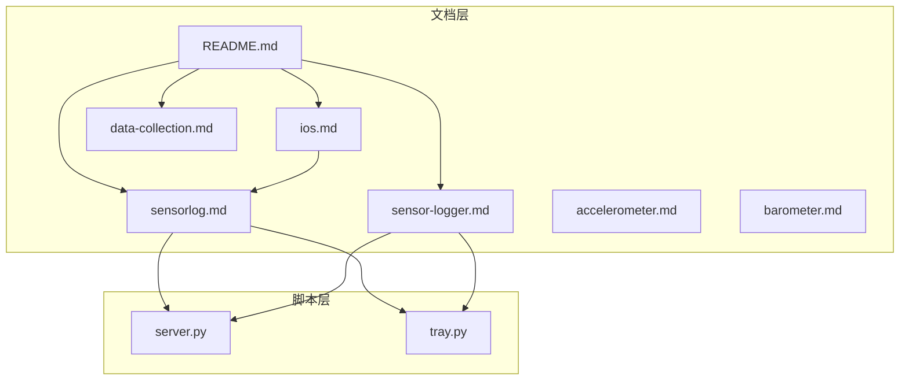
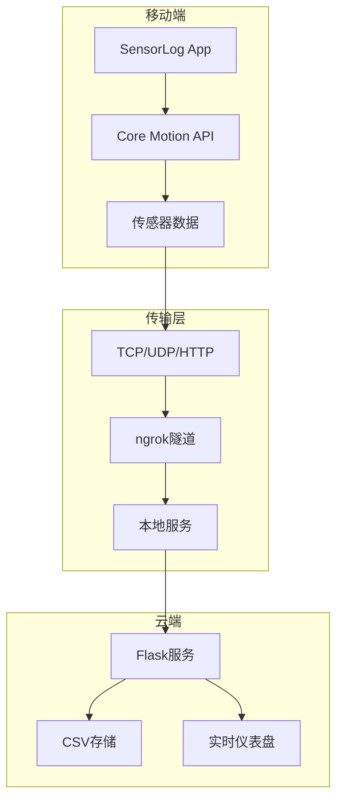
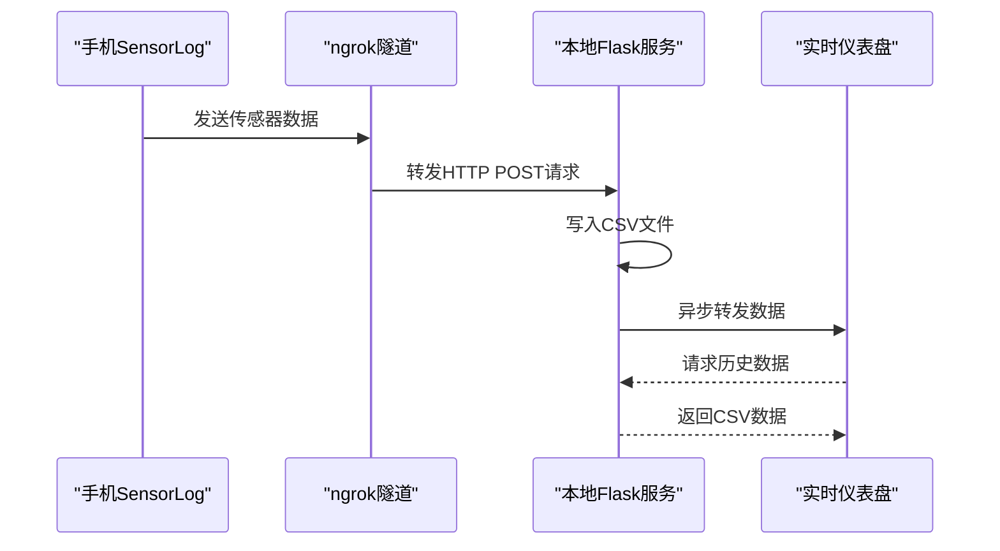
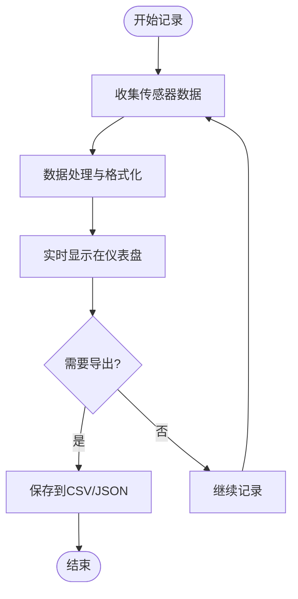
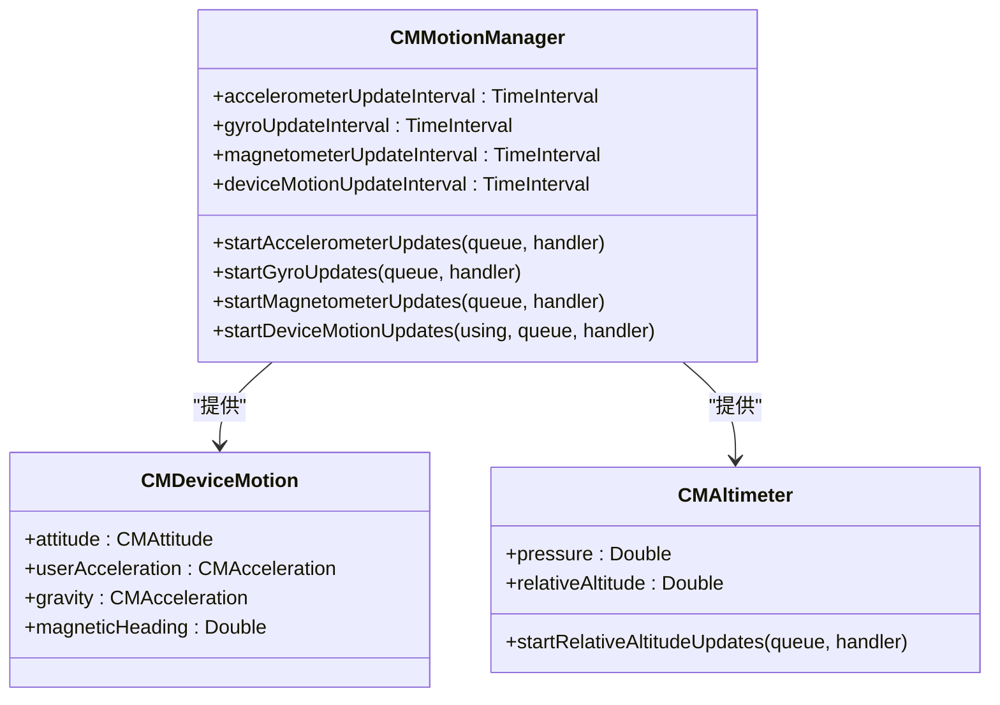
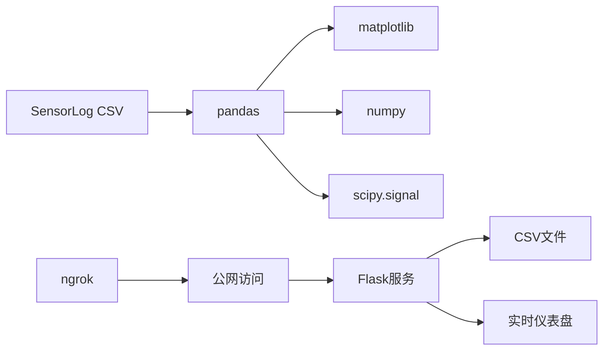

# SensorLog使用指南

<cite>
**本文引用的文件**
- [README.md](file://README.md)
- [sensorlog.md](file://docs/practice/sensorlog.md)
- [ios.md](file://docs/programming/ios.md)
- [sensor-logger.md](file://docs/practice/sensor-logger.md)
- [data-collection.md](file://docs/practice/data-collection.md)
- [accelerometer.md](file://docs/sensors/motion/accelerometer.md)
- [barometer.md](file://docs/sensors/environment/barometer.md)
- [server.py](file://scripts/server.py)
- [tray.py](file://scripts/tray.py)
</cite>

## 目录
1. [简介](#简介)
2. [项目结构](#项目结构)
3. [核心组件](#核心组件)
4. [架构概览](#架构概览)
5. [详细组件分析](#详细组件分析)
6. [依赖关系分析](#依赖关系分析)
7. [性能考虑](#性能考虑)
8. [故障排除指南](#故障排除指南)
9. [结论](#结论)
10. [附录](#附录)

## 简介
本指南面向使用SensorLog应用进行专业传感器数据记录与流式传输的用户。SensorLog是专为iOS平台设计的高性能传感器记录工具，支持加速度计、陀螺仪、磁力计、设备运动、GPS位置、气压计和音频等多种传感器。本文将详细说明安装配置、传感器选择、数据记录参数设置、实时流式传输方法、数据导出流程，以及SensorLog特有的实时可视化、数据过滤和质量控制功能，并提供最佳实践建议和常见问题解决方案。

## 项目结构
该项目采用文档驱动的组织方式，核心内容分布在docs目录下的实践指南、编程接口和传感器知识库中，配合scripts目录中的数据采集与流式传输脚本，形成完整的教学与实践体系。

**图表来源**
- [README.md:18-55](file://README.md#L18-L55)
- [sensorlog.md:1-412](file://docs/practice/sensorlog.md#L1-L412)
- [server.py:1-94](file://scripts/server.py#L1-L94)
- [tray.py:1-276](file://scripts/tray.py#L1-L276)

**章节来源**
- [README.md:18-55](file://README.md#L18-L55)

## 核心组件
- SensorLog应用：iOS平台的专业传感器记录工具，支持多种传感器数据采集与流式传输
- Core Motion框架：iOS原生传感器API，提供加速度计、陀螺仪、磁力计、设备运动等传感器访问
- 传感器数据格式：支持CSV和JSON格式导出，包含时间戳、传感器名称和数值字段
- 流式传输服务：支持TCP/UDP/HTTP/HTTP GET等多种传输协议
- 数据可视化：提供实时仪表盘和历史数据分析功能

**章节来源**
- [sensorlog.md:8-31](file://docs/practice/sensorlog.md#L8-L31)
- [ios.md:8-26](file://docs/programming/ios.md#L8-L26)

## 架构概览
SensorLog采用模块化的数据采集与传输架构，支持本地记录和云端流式传输两种模式。

**图表来源**
- [sensorlog.md:58-68](file://docs/practice/sensorlog.md#L58-L68)
- [README.md:96-144](file://README.md#L96-L144)
- [server.py:1-94](file://scripts/server.py#L1-L94)

## 详细组件分析

### SensorLog应用配置
SensorLog应用提供直观的图形界面，支持灵活的传感器配置和数据导出。

#### 基本操作流程
1. **启动应用**：打开SensorLog，进入设置页面
2. **配置采样参数**：
   - 采样率：运动类实验建议50Hz，GPS实验建议10Hz
   - 选择传感器：勾选需要采集的传感器类型
   - 输出格式：选择CSV或JSON格式
3. **开始/停止记录**：点击Record按钮开始，Stop结束
4. **数据导出**：通过Share按钮导出到AirDrop、邮件或iCloud Drive

#### 传感器支持列表
| 传感器 | iOS框架类 | 数据字段 |
|:-------|:----------|:---------|
| 加速度计 | CMAccelerometerData | accelerometerAccelerationX/Y/Z |
| 陀螺仪 | CMGyroData | gyroRotationX/Y/Z |
| 磁力计 | CMMagnetometerData | magnetometerX/Y/Z |
| 设备运动 | CMDeviceMotion | attitude (roll/pitch/yaw), userAcceleration, gravity, heading |
| GPS位置 | CLLocation | latitude, longitude, altitude, speed, course |
| 气压计 | CMAltimeter | pressure, relativeAltitude |
| 音频 | AVAudioEngine | audioLevel (dB) |

**章节来源**
- [sensorlog.md:34-57](file://docs/practice/sensorlog.md#L34-L57)
- [sensorlog.md:20-31](file://docs/practice/sensorlog.md#L20-L31)

### 流式传输配置
SensorLog支持多种网络传输协议，满足不同场景需求。

#### 传输协议配置
| 协议 | 配置要点 | 适用场景 |
|:-----|:---------|:---------|
| TCP | 设置目标IP和端口 | 稳定连接，适合固定网络 |
| UDP | 设置目标IP和端口 | 低延迟，适合实时监控 |
| HTTP POST | 设置URL端点 | 云端服务，易于集成 |
| HTTP GET | 设置URL（查询参数） | 简单HTTP服务 |

#### ngrok公网穿透配置

**图表来源**
- [README.md:100-128](file://README.md#L100-L128)
- [server.py:23-81](file://scripts/server.py#L23-L81)

**章节来源**
- [sensorlog.md:58-68](file://docs/practice/sensorlog.md#L58-L68)
- [README.md:96-144](file://README.md#L96-L144)

### 数据导出与格式
SensorLog支持多种数据导出格式，满足不同分析需求。

#### CSV数据格式
导出的CSV文件包含以下字段：
- loggingTime：记录时间戳
- 传感器数据字段：根据选择的传感器类型动态生成
- 示例：accelerometerAccelerationX, accelerometerAccelerationY, accelerometerAccelerationZ等

#### JSON数据格式
JSON格式提供更丰富的数据结构，包含：
- messageId：消息唯一标识
- sessionId：会话唯一标识
- deviceId：设备唯一标识
- payload：传感器数据数组，每个元素包含name、time和values字段

**章节来源**
- [sensorlog.md:346-386](file://docs/practice/sensorlog.md#L346-L386)

### 实时可视化功能
SensorLog提供实时数据可视化能力，支持边采集边查看。

#### 实时仪表盘

**图表来源**
- [sensorlog.md:358-386](file://docs/practice/sensorlog.md#L358-L386)

**章节来源**
- [sensorlog.md:358-386](file://docs/practice/sensorlog.md#L358-L386)

### 数据过滤与质量控制
SensorLog提供多种数据处理和质量控制功能。

#### 传感器融合
SensorLog利用Core Motion的设备运动功能，将加速度计、陀螺仪和磁力计数据融合，提供高质量的姿态信息：
- 姿态（欧拉角）：pitch（俯仰）、roll（横滚）、yaw（偏航）
- 线性加速度：去除重力分量的加速度
- 重力方向：当前重力加速度向量
- 磁航向：基于磁力计的方位角

#### 数据质量控制
- 采样率优化：根据实验需求选择合适的采样频率
- 传感器选择：仅启用必要的传感器以减少功耗
- 数据完整性：自动检查缺失数据和异常值
- 时间同步：使用纳秒级时间戳确保数据时序准确性

**章节来源**
- [sensorlog.md:124-161](file://docs/practice/sensorlog.md#L124-L161)
- [ios.md:124-161](file://docs/programming/ios.md#L124-L161)

## 依赖关系分析

### iOS传感器API依赖
SensorLog依赖于iOS Core Motion框架提供的原生传感器访问能力。

**图表来源**
- [ios.md:18-26](file://docs/programming/ios.md#L18-L26)
- [ios.md:68-161](file://docs/programming/ios.md#L68-L161)

### 数据处理依赖
SensorLog的数据处理依赖于Python生态系统中的数据分析工具。

**图表来源**
- [sensorlog.md:358-386](file://docs/practice/sensorlog.md#L358-L386)
- [server.py:11-17](file://scripts/server.py#L11-L17)

**章节来源**
- [ios.md:18-26](file://docs/programming/ios.md#L18-L26)
- [sensorlog.md:358-386](file://docs/practice/sensorlog.md#L358-L386)

## 性能考虑
基于项目文档中的技术规范和实现细节，以下是SensorLog使用的性能考量要点：

### 采样率优化
- 运动类实验建议50Hz采样率，平衡数据质量和存储开销
- GPS实验建议10Hz采样率，减少网络传输负担
- 气压计实验建议10-20Hz，满足楼层检测需求

### 传感器选择策略
- 仅启用必要的传感器，避免不必要的功耗消耗
- 设备运动传感器提供融合数据，可替代单独的加速度计和陀螺仪
- 音频传感器仅在需要时启用，避免影响其他传感器性能

### 网络传输优化
- HTTP POST协议适合实时推送，延迟约1秒
- UDP协议提供最低延迟，但可能丢包
- TCP协议保证数据完整性，适合重要数据传输

### 存储效率
- CSV格式占用空间较小，适合长期存储
- JSON格式包含完整元数据，便于后续处理
- 自动按会话ID分文件存储，便于管理和检索

## 故障排除指南

### 常见问题及解决方案

#### 1. 传感器权限问题
**症状**：应用无法访问某些传感器数据
**原因**：iOS权限未授予
**解决方法**：
- 检查Info.plist中的权限声明
- 在设置中重新授予权限
- 确认CMMotionActivityManager和CMPedometer的使用说明

#### 2. 数据传输失败
**症状**：传感器数据无法到达服务器
**排查步骤**：
- 验证Push URL配置正确
- 检查网络连接状态
- 确认防火墙设置允许相应端口
- 使用系统托盘程序验证服务状态

#### 3. 采样率异常
**症状**：数据采样频率不符合预期
**排查步骤**：
- 检查传感器更新间隔设置
- 确认设备处于前台状态
- 避免同时启用过多传感器

#### 4. 数据质量异常
**症状**：传感器数据显示异常波动
**排查步骤**：
- 检查设备是否稳定放置
- 避免强磁场干扰
- 确认传感器校准状态

**章节来源**
- [ios.md:29-60](file://docs/programming/ios.md#L29-L60)
- [sensorlog.md:58-68](file://docs/practice/sensorlog.md#L58-L68)

### 系统托盘工具使用
项目提供了便捷的系统托盘工具，简化服务启动和管理。

#### 主要功能
- 一键启动/停止Flask服务和ngrok隧道
- 自动检测现有ngrok连接
- 复制Push URL到剪贴板
- 打开本地和公网仪表盘

#### 使用场景
- 教学演示：快速启动全套服务
- 实验准备：一键配置网络环境
- 数据采集：自动化服务管理

**章节来源**
- [tray.py:18-276](file://scripts/tray.py#L18-L276)

## 结论
SensorLog作为专业的iOS传感器记录工具，结合了高性能的硬件访问能力和灵活的软件配置选项。通过合理的传感器选择、采样率配置和网络传输设置，用户可以在教学和研究场景中获得高质量的传感器数据。项目提供的完整文档、示例代码和实用工具，为用户快速上手和深入使用提供了有力支撑。

建议用户根据具体实验需求选择合适的传感器组合和采样参数，充分利用SensorLog的实时可视化和数据导出功能，建立完整的传感器数据采集与分析工作流程。

## 附录

### 实验实践建议
基于项目中的实验指导，推荐以下实践方案：

#### 计步器实验
- 采样率：50Hz
- 传感器：加速度计
- 实验时长：至少100步
- 数据分析：合成加速度幅值计算和峰值检测

#### 电子指南针实验
- 采样率：50Hz
- 传感器：加速度计 + 磁力计
- 实验动作：缓慢旋转手机一周
- 数据分析：倾斜补偿航向角计算

#### 气压计测楼层实验
- 采样率：10Hz
- 传感器：气压计
- 实验路径：从1楼到5楼
- 数据分析：气压转海拔和楼层估算

**章节来源**
- [data-collection.md:8-192](file://docs/practice/data-collection.md#L8-L192)

### 传感器技术背景
项目提供了全面的传感器技术知识，包括：
- 传感器发展历程和分类体系
- MEMS技术基础和制造工艺
- 传感器融合算法和实现
- 各类传感器的技术参数和应用

**章节来源**
- [accelerometer.md:1-177](file://docs/sensors/motion/accelerometer.md#L1-L177)
- [barometer.md:1-216](file://docs/sensors/environment/barometer.md#L1-L216)