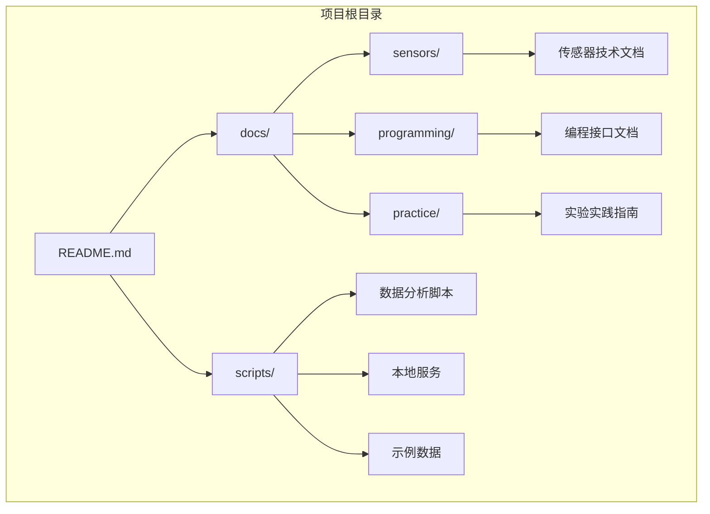
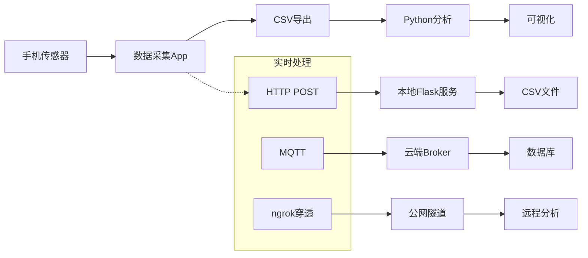
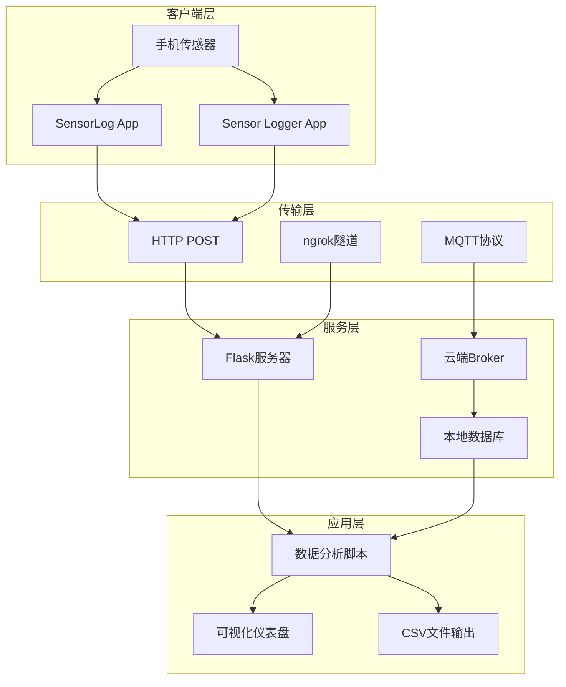
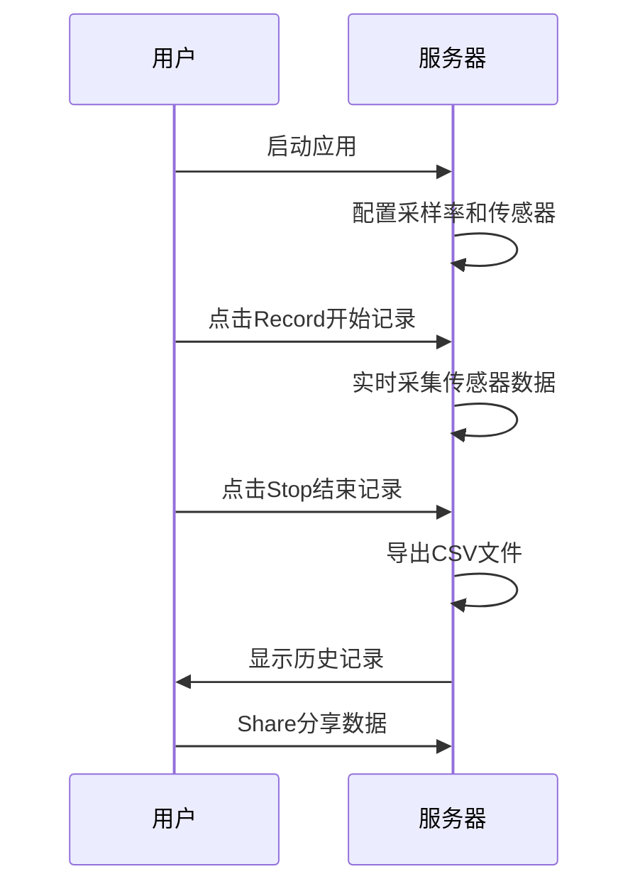
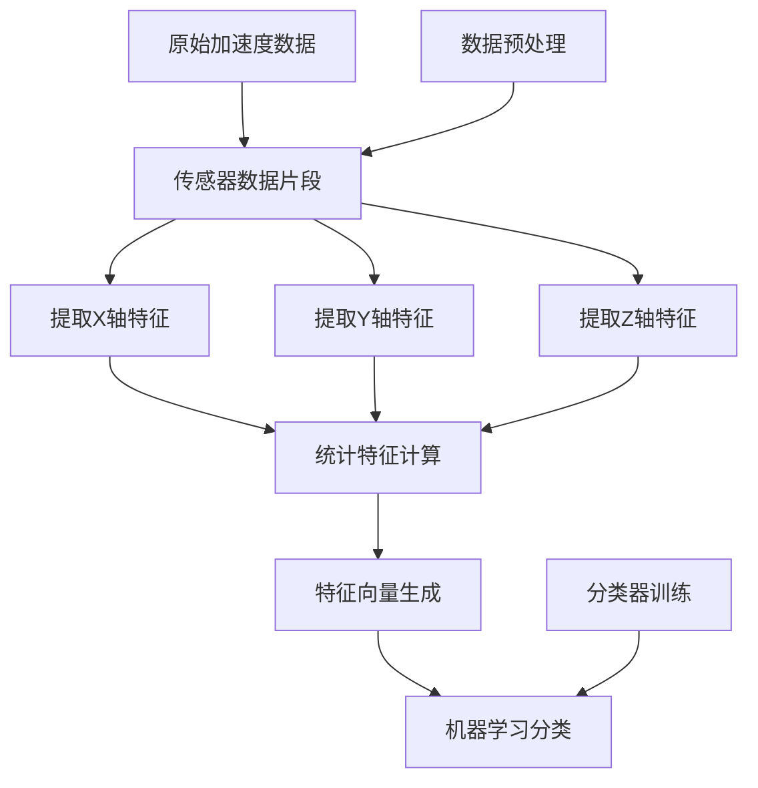
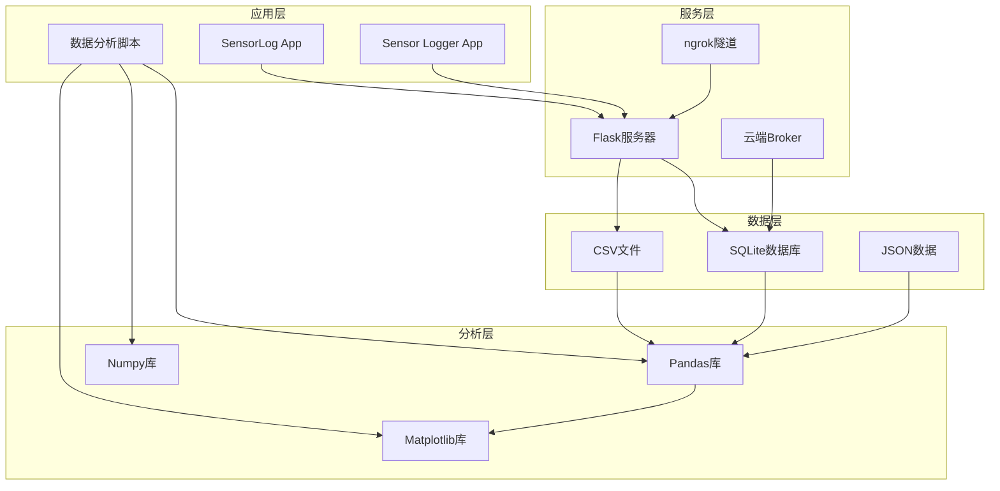
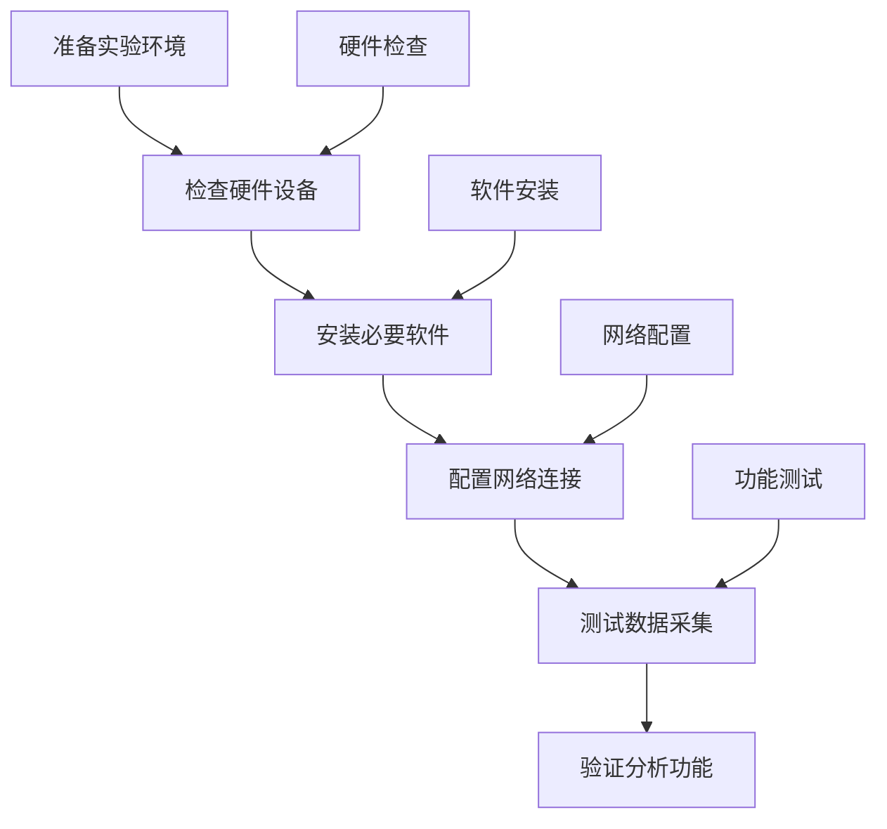

# 实验实践

<cite>
**本文档引用的文件**
- [README.md](file://README.md)
- [docs/practice/index.md](file://docs/practice/index.md)
- [docs/practice/data-collection.md](file://docs/practice/data-collection.md)
- [docs/practice/sensor-logger.md](file://docs/practice/sensor-logger.md)
- [docs/practice/sensorlog.md](file://docs/practice/sensorlog.md)
- [scripts/server.py](file://scripts/server.py)
- [scripts/tray.py](file://scripts/tray.py)
- [scripts/analyze_data.py](file://scripts/analyze_data.py)
- [scripts/sample_data/orientation_sample.csv](file://scripts/sample_data/orientation_sample.csv)
</cite>

## 目录
1. [引言](#引言)
2. [项目结构](#项目结构)
3. [核心组件](#核心组件)
4. [架构概览](#架构概览)
5. [详细组件分析](#详细组件分析)
6. [依赖关系分析](#依赖关系分析)
7. [性能考虑](#性能考虑)
8. [故障排除指南](#故障排除指南)
9. [结论](#结论)
10. [附录](#附录)

## 引言

本实验实践指南基于移动传感器技术项目，提供完整的数据采集实验指导。项目涵盖了从理论到实践的完整知识体系，特别针对智能手机传感器的动手实验进行了深入设计。

该项目采用MkDocs + Material主题构建，包含32张中文标注技术插图，图文并茂地展示了传感器技术的各个方面。项目支持通过ngrok实现公网穿透，让5G手机能够将传感器数据实时推送到本地电脑，为远程实验提供了便利。

## 项目结构

项目采用模块化的文档组织方式，主要分为以下几个核心部分：



**图表来源**
- [README.md:18-55](file://README.md#L18-L55)

**章节来源**
- [README.md:18-55](file://README.md#L18-L55)

## 核心组件

### 实验工具链

项目提供了完整的实验工具链，包括：

| 工具名称 | 平台 | 用途 | 费用 |
|---------|------|------|------|
| **SensorLog** | iOS | 专业传感器数据记录与流式传输 | 付费 (~¥22) |
| **Sensor Logger** | iOS / Android | 传感器记录,CSV 导出 | 免费 |
| **phyphox** | iOS / Android | 物理实验平台,自带分析工具 | 免费 |
| **Physics Toolbox** | iOS / Android | 传感器可视化与记录 | 免费 |
| **Python** | PC | 数据分析与可视化 | 免费 |

### 数据处理管道



**图表来源**
- [docs/practice/index.md:19-24](file://docs/practice/index.md#L19-L24)

**章节来源**
- [docs/practice/index.md:7-25](file://docs/practice/index.md#L7-L25)

## 架构概览

项目采用分层架构设计，支持多种数据采集和处理模式：



**图表来源**
- [docs/practice/sensor-logger.md:74-178](file://docs/practice/sensor-logger.md#L74-L178)
- [docs/practice/sensorlog.md:71-177](file://docs/practice/sensorlog.md#L71-L177)

## 详细组件分析

### Sensor Logger 使用指南

Sensor Logger是项目中最核心的实验工具，支持iOS和Android平台，提供丰富的数据采集和分析功能。

#### 支持的传感器类型

| 传感器类别 | iOS支持 | Android支持 |
|-----------|---------|-------------|
| 加速度计 | ✅ | ✅ |
| 陀螺仪 | ✅ | ✅ |
| 磁力计 | ✅ | ✅ |
| 气压计 | ✅ | ✅ |
| GPS | ✅ | ✅ |
| 麦克风 | ✅ | ✅ |
| 摄像头 | ✅ | ✅ |
| 计步器 | ✅ | ✅ |
| 设备状态 | ✅ | ✅ |

#### 数据导出格式

| 格式类型 | 描述 | 用途 |
|---------|------|------|
| CSV (单独) | 每个传感器一个CSV文件 | 传统分析 |
| CSV (合并) | 所有传感器合并到一个CSV | 统一处理 |
| JSON | 原始JSON格式 | 灵活解析 |
| Excel | .xlsx格式 | 电子表格处理 |
| KML | GPS轨迹,可导入Google Earth | 地理位置分析 |
| SQLite | 数据库格式,方便大数据量查询 | 高效检索 |

**章节来源**
- [docs/practice/sensor-logger.md:24-71](file://docs/practice/sensor-logger.md#L24-L71)

### SensorLog 使用指南

SensorLog是专为iOS平台设计的专业传感器数据记录应用，提供更精细的控制选项。

#### 基本操作流程



**图表来源**
- [docs/practice/sensorlog.md:34-57](file://docs/practice/sensorlog.md#L34-L57)

#### 网络流式传输

SensorLog支持多种网络传输协议：

| 协议类型 | 配置选项 | 适用场景 |
|---------|----------|----------|
| TCP | 设置目标IP和端口 | 稳定局域网环境 |
| UDP | 设置目标IP和端口 | 实时性要求高的场景 |
| HTTP POST | 设置URL端点 | 云端数据处理 |
| HTTP GET | 设置URL查询参数 | 简单数据传输 |

**章节来源**
- [docs/practice/sensorlog.md:58-96](file://docs/practice/sensorlog.md#L58-L96)

### 数据采集实验

项目提供了四个核心实验，涵盖不同的传感器应用：

#### 实验一：计步器

**实验目标**：利用加速度计数据实现简易计步算法，并与手机内置计步器对比。

**实验步骤**：
1. 打开SensorLog/Sensor Logger，选择加速度计，设置50Hz采样率
2. 将手机放入口袋，步行100步（手动计数）
3. 停止记录，导出CSV

**数据分析流程**：
```mermaid
flowchart TD
A[加载CSV数据] --> B[计算加速度合成量]
B --> C[带通滤波(1-3Hz)]
C --> D[峰值检测]
D --> E[统计步数误差]
F[原始加速度数据] --> B
G[滤波参数] --> C
H[检测阈值] --> D
```

**图表来源**
- [docs/practice/data-collection.md:14-54](file://docs/practice/data-collection.md#L14-L54)

**预期结果**：检测到步数与实际步数误差应在合理范围内，建议控制在±5%以内。

**章节来源**
- [docs/practice/data-collection.md:8-61](file://docs/practice/data-collection.md#L8-L61)

#### 实验二：电子指南针

**实验目标**：利用加速度计和磁力计数据实现带倾斜补偿的电子指南针。

**实验步骤**：
1. 采集加速度计+磁力计数据
2. 缓慢旋转手机一周（保持水平）
3. 对比不同倾斜角度下的航向精度

**算法实现**：
```mermaid
flowchart TD
A[获取加速度和磁力计数据] --> B[归一化加速度向量]
B --> C[计算倾斜角(俯仰角,横滚角)]
C --> D[进行倾斜补偿]
D --> E[计算航向角]
E --> F[调整到0-360°范围]
G[原始传感器数据] --> A
H[坐标系转换] --> D
I[三角函数运算] --> E
```

**图表来源**
- [docs/practice/data-collection.md:69-105](file://docs/practice/data-collection.md#L69-L105)

**预期精度**：在无强磁场干扰环境下，航向角误差应小于±5°。

**章节来源**
- [docs/practice/data-collection.md:63-107](file://docs/practice/data-collection.md#L63-L107)

#### 实验三：气压计测楼层

**实验目标**：利用气压计数据检测楼层变化。

**实验步骤**：
1. 开启气压计采集（10Hz）
2. 从1楼乘电梯或走楼梯上到5楼
3. 在每一层停留10秒

**数据分析算法**：
```mermaid
flowchart TD
A[读取气压数据] --> B[气压转海拔]
B --> C[计算相对高度变化]
C --> D[估算楼层(假设层高3m)]
D --> E[统计楼层变化]
F[气压读数(hPa)] --> A
G[海平面气压基准] --> B
H[海拔公式] --> B
I[层高假设] --> D
```

**图表来源**
- [docs/practice/data-collection.md:115-146](file://docs/practice/data-collection.md#L115-L146)

**预期结果**：从1楼到5楼，气压差应约为20-25hPa，楼层估算误差应在±1层以内。

**章节来源**
- [docs/practice/data-collection.md:109-153](file://docs/practice/data-collection.md#L109-L153)

#### 实验四：手势识别（进阶）

**实验目标**：利用加速度计和陀螺仪数据，识别简单的手持手机手势（摇晃、翻转、画圈）。

**实验设计**：
1. 定义3种手势，每种采集20组样本
2. 提取时域特征（均值、方差、峰值、过零率等）
3. 使用简单分类器（如KNN）进行识别

**特征提取流程**：


**图表来源**
- [docs/practice/data-collection.md:161-191](file://docs/practice/data-collection.md#L161-L191)

**预期准确率**：在良好实验条件下，手势识别准确率应达到80%以上。

**章节来源**
- [docs/practice/data-collection.md:155-192](file://docs/practice/data-collection.md#L155-L192)

## 依赖关系分析

项目中的关键依赖关系如下：



**图表来源**
- [scripts/server.py:11-21](file://scripts/server.py#L11-L21)
- [scripts/analyze_data.py:8-14](file://scripts/analyze_data.py#L8-L14)

**章节来源**
- [scripts/server.py:11-94](file://scripts/server.py#L11-L94)
- [scripts/analyze_data.py:1-98](file://scripts/analyze_data.py#L1-L98)

## 性能考虑

### 采样率优化

| 实验类型 | 推荐采样率 | 原因 |
|---------|------------|------|
| 运动类实验 | 50Hz | 平衡精度和性能 |
| GPS实验 | 10Hz | 降低功耗 |
| 气压计 | 10Hz | 稳定性优先 |
| 音频分析 | 44.1kHz | CD音质标准 |

### 内存管理

- **实时数据缓冲**：使用固定大小的循环缓冲区，避免内存泄漏
- **数据压缩**：对大量数据进行压缩存储
- **异步处理**：使用多线程处理数据传输和分析

### 网络传输优化

- **批量传输**：减少HTTP请求次数
- **数据去重**：避免重复传输相同数据
- **错误重传**：实现可靠的传输机制

## 故障排除指南

### 常见问题及解决方案

#### 1. 数据采集异常

**问题现象**：传感器数据为零或异常值

**可能原因**：
- 传感器权限未授权
- 设备传感器故障
- 应用权限设置问题

**解决步骤**：
1. 检查应用权限设置
2. 重启传感器服务
3. 更新应用版本
4. 重新授权传感器权限

#### 2. 网络传输失败

**问题现象**：数据无法传输到服务器

**可能原因**：
- 网络连接不稳定
- 服务器地址配置错误
- 防火墙阻止连接

**解决步骤**：
1. 检查网络连接状态
2. 验证服务器地址和端口
3. 检查防火墙设置
4. 使用ping命令测试连通性

#### 3. 数据分析异常

**问题现象**：分析结果不准确或报错

**可能原因**：
- 数据格式不匹配
- 缺少必要的依赖库
- 数据预处理步骤缺失

**解决步骤**：
1. 验证数据文件格式
2. 检查Python依赖安装
3. 确认数据预处理完整性
4. 查看错误日志详情

#### 4. 实时监控问题

**问题现象**：无法实时查看传感器数据

**可能原因**：
- ngrok隧道连接失败
- 云端Broker配置错误
- 浏览器兼容性问题

**解决步骤**：
1. 重新启动ngrok服务
2. 检查Broker连接信息
3. 更换浏览器或更新版本
4. 清除浏览器缓存

**章节来源**
- [scripts/tray.py:197-276](file://scripts/tray.py#L197-L276)

### 实验环境准备

#### 硬件要求

- **手机设备**：iPhone或Android手机（建议较新机型）
- **存储空间**：至少1GB可用空间
- **网络环境**：稳定的WiFi或5G网络
- **电源供应**：充足的电量或充电设备

#### 软件要求

- **操作系统**：iOS 13.0+ 或 Android 8.0+
- **应用软件**：SensorLog或Sensor Logger
- **Python环境**：Python 3.7+
- **数据分析库**：pandas, numpy, matplotlib

#### 实验环境配置



## 结论

本实验实践指南为移动传感器技术的学习和应用提供了完整的解决方案。通过SensorLog和Sensor Logger两大核心工具，结合Python数据分析脚本，学生可以深入理解传感器技术的工作原理和应用场景。

项目的特点包括：
- **完整的工具链**：从数据采集到分析可视化的全流程支持
- **灵活的配置选项**：支持多种传感器和数据格式
- **实时处理能力**：通过ngrok实现公网穿透，支持远程实验
- **丰富的实验内容**：涵盖运动、导航、环境监测等多个领域

建议在实际实验中：
1. 严格按照实验步骤执行，确保数据质量
2. 注意实验环境的稳定性，避免外界干扰
3. 及时记录实验过程和结果，便于后续分析
4. 遇到问题时参考故障排除指南，逐步排查解决

## 附录

### 实验报告模板

#### 基本信息
- 实验名称：
- 实验日期：
- 实验人员：
- 设备型号：

#### 实验目标
- 主要目标：
- 预期结果：

#### 实验步骤
1. 
2. 
3. 

#### 实验结果
- 数据统计：
- 图表展示：
- 结果分析：

#### 问题与改进
- 遇到的问题：
- 解决方案：
- 改进建议：

### 参考资料

- [SensorLog官方文档](https://apps.apple.com/app/sensorlog/id388014573)
- [Sensor Logger社区资源](https://github.com/tszheichoi/awesome-sensor-logger)
- [MkDocs文档框架](https://www.mkdocs.org/)
- [Material Design主题](https://squidfunk.github.io/mkdocs-material/)