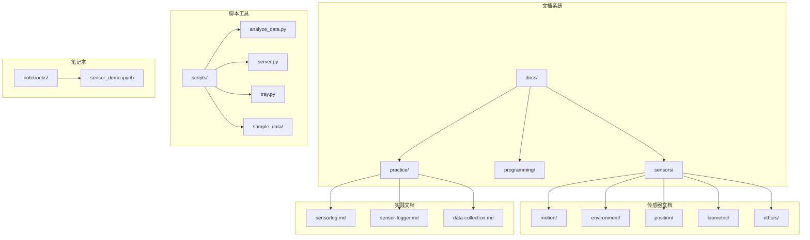
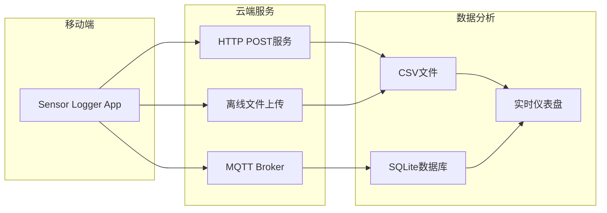
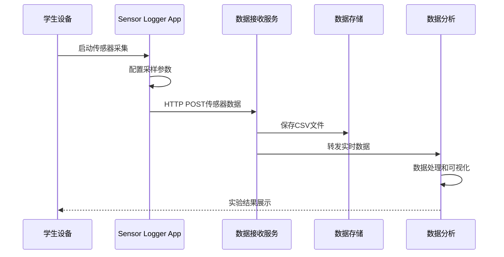
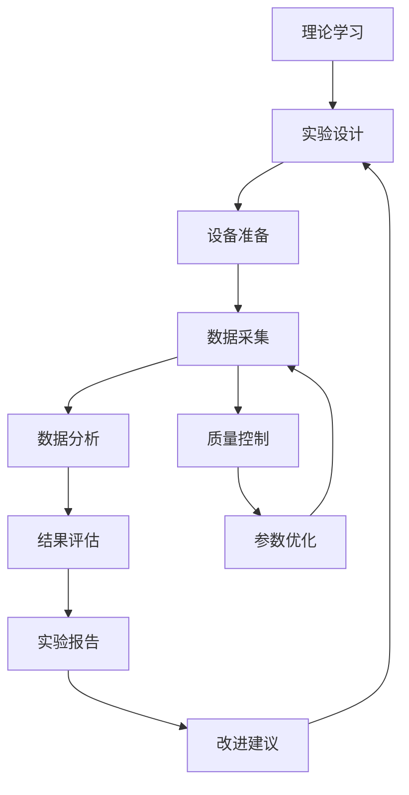
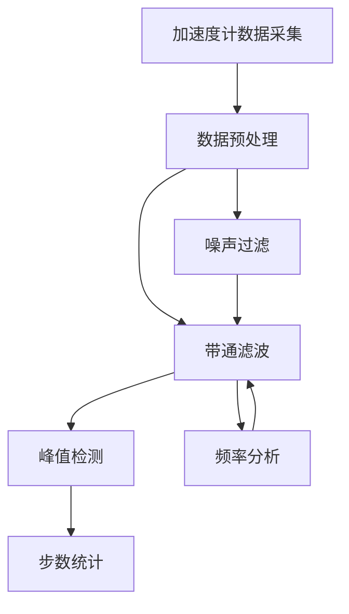
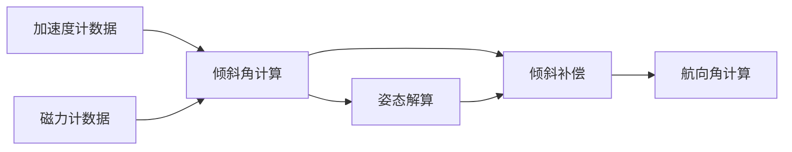
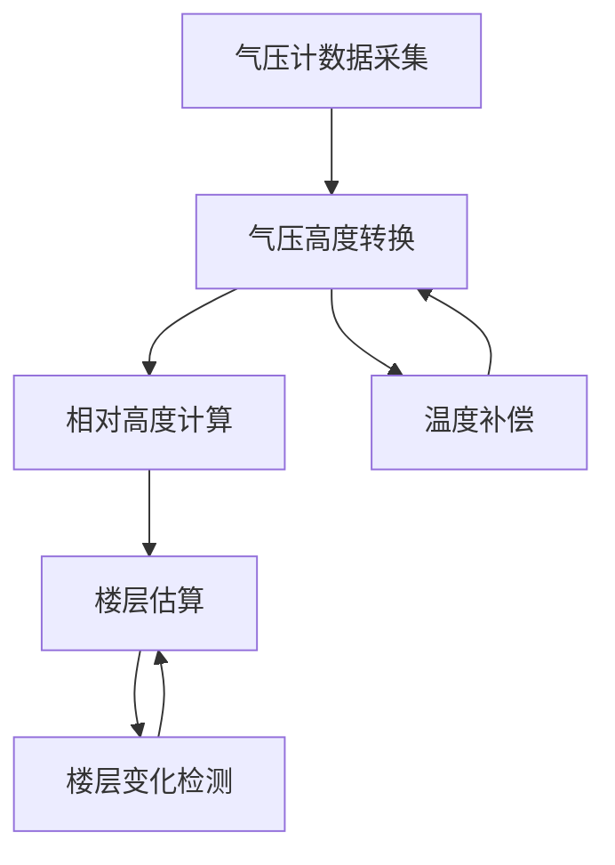
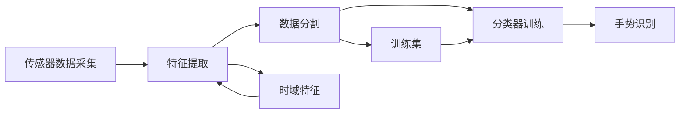
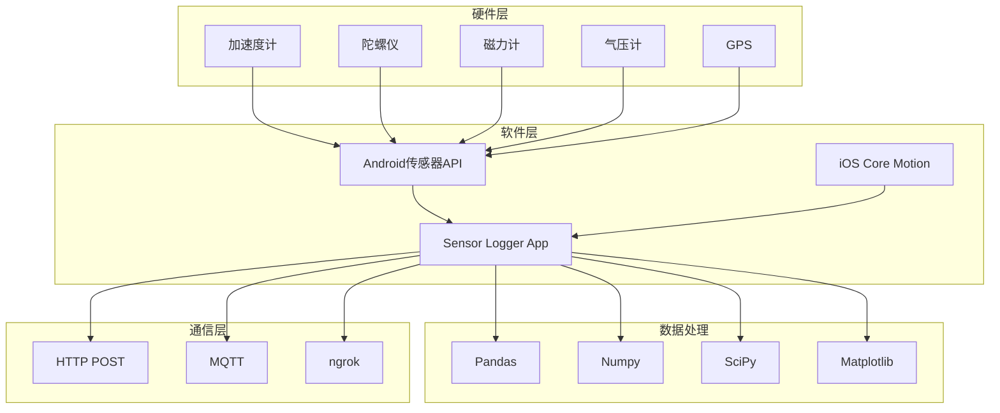
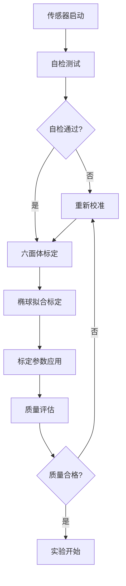

# 数据采集实验

<cite>
**本文档引用的文件**
- [README.md](file://README.md)
- [data-collection.md](file://docs/practice/data-collection.md)
- [sensor-logger.md](file://docs/practice/sensor-logger.md)
- [analyze_data.py](file://scripts/analyze_data.py)
- [orientation_sample.csv](file://scripts/sample_data/orientation_sample.csv)
- [server.py](file://scripts/server.py)
- [tray.py](file://scripts/tray.py)
- [accelerometer.md](file://docs/sensors/motion/accelerometer.md)
- [gyroscope.md](file://docs/sensors/motion/gyroscope.md)
- [magnetometer.md](file://docs/sensors/motion/magnetometer.md)
- [barometer.md](file://docs/sensors/environment/barometer.md)
- [gnss.md](file://docs/sensors/position/gnss.md)
- [sensor_demo.ipynb](file://notebooks/sensor_demo.ipynb)
</cite>

## 目录
1. [引言](#引言)
2. [项目结构](#项目结构)
3. [核心组件](#核心组件)
4. [架构概览](#架构概览)
5. [详细组件分析](#详细组件分析)
6. [依赖分析](#依赖分析)
7. [性能考虑](#性能考虑)
8. [故障排除指南](#故障排除指南)
9. [结论](#结论)
10. [附录](#附录)

## 引言

本指南为数据采集实验提供全面的实验设计和实施方法。项目涵盖了从理论背景到实践操作的完整知识体系，特别针对智能手机传感器的数据采集实验进行了深入分析。实验内容包括计步器实验、指南针实验、气压楼层检测实验、手势识别实验等，为学生提供了完整的实验流程和评估标准。

该项目采用MkDocs + Material主题构建，包含32张中文标注技术插图，图文并茂地展示了从硬件原理到编程实践的完整知识体系。项目支持通过ngrok实现公网穿透，让5G手机能够将传感器数据实时推送到本地电脑，为远程实验提供了便利条件。

## 项目结构

项目采用模块化的文档结构，主要包含以下核心部分：



**图表来源**
- [README.md:18-55](file://README.md#L18-L55)
- [data-collection.md:1-192](file://docs/practice/data-collection.md#L1-L192)

**章节来源**
- [README.md:18-55](file://README.md#L18-L55)
- [README.md:96-144](file://README.md#L96-L144)

## 核心组件

### 传感器数据采集系统

项目的核心是一个完整的传感器数据采集系统，包括硬件支持、软件接口和数据分析工具。

#### 传感器支持矩阵

| 传感器类型 | Android支持 | iOS支持 | 数据字段 |
|------------|-------------|---------|----------|
| 加速度计 | ✅ | ✅ | x, y, z (m/s²) |
| 陀螺仪 | ✅ | ✅ | x, y, z (rad/s) |
| 磁力计 | ✅ | ✅ | x, y, z (μT) |
| 气压计 | ✅ | ✅ | pressure (hPa), relativeAltitude (m) |
| GPS | ✅ | ✅ | latitude, longitude, altitude, speed, bearing |
| 计步器 | ✅ | ✅ | steps |

#### 数据上云架构

系统支持三种数据上云方式：



**图表来源**
- [sensor-logger.md:74-417](file://docs/practice/sensor-logger.md#L74-L417)

**章节来源**
- [sensor-logger.md:24-71](file://docs/practice/sensor-logger.md#L24-L71)
- [sensor-logger.md:74-417](file://docs/practice/sensor-logger.md#L74-L417)

## 架构概览

### 实验系统架构



**图表来源**
- [server.py:35-81](file://scripts/server.py#L35-L81)
- [sensor-logger.md:142-178](file://docs/practice/sensor-logger.md#L142-L178)

### 实验流程设计

系统采用"理论学习-实践操作-数据分析-结果评估"的完整实验流程：



**图表来源**
- [data-collection.md:8-192](file://docs/practice/data-collection.md#L8-L192)

**章节来源**
- [data-collection.md:8-192](file://docs/practice/data-collection.md#L8-L192)

## 详细组件分析

### 计步器实验

#### 理论背景

计步器实验基于加速度计数据的峰值检测原理。人体行走时，身体会产生周期性的加速度变化，通过检测这些变化的峰值可以实现步数统计。

#### 实验设计



**图表来源**
- [data-collection.md:20-54](file://docs/practice/data-collection.md#L20-L54)

#### 实验步骤

1. **设备配置**: 打开Sensor Logger，选择加速度计，设置50Hz采样率
2. **数据采集**: 将手机放入口袋，步行100步
3. **数据处理**: 导出CSV文件，进行带通滤波和峰值检测
4. **结果分析**: 对比实际步数与检测步数

#### 数据分析方法

```python
import pandas as pd
import numpy as np
from scipy.signal import find_peaks

# 加载数据
df = pd.read_csv("walk_100steps.csv")

# 计算加速度合成量
df['magnitude'] = np.sqrt(
    df['accelerometerAccelerationX']**2 +
    df['accelerometerAccelerationY']**2 +
    df['accelerometerAccelerationZ']**2
)

# 带通滤波 (保留步行频率 1-3 Hz)
from scipy.signal import butter, filtfilt

fs = 50  # 采样率
b, a = butter(4, [1, 3], btype='band', fs=fs)
df['filtered'] = filtfilt(b, a, df['magnitude'])

# 峰值检测
peaks, properties = find_peaks(
    df['filtered'],
    height=0.2,           # 最小峰值高度
    distance=fs * 0.3     # 最小峰间距 (0.3s, 对应 ~200 steps/min)
)
```

**章节来源**
- [data-collection.md:8-61](file://docs/practice/data-collection.md#L8-L61)

### 电子指南针实验

#### 理论背景

电子指南针实验利用加速度计和磁力计数据实现带倾斜补偿的航向角计算。该实验展示了多传感器融合在实际应用中的重要性。

#### 实验设计



**图表来源**
- [data-collection.md:75-105](file://docs/practice/data-collection.md#L75-L105)

#### 实验步骤

1. **数据采集**: 采集加速度计 + 磁力计数据
2. **实验操作**: 缓慢旋转手机一周 (保持水平)
3. **数据分析**: 对比不同倾斜角度下的航向精度

#### 数据处理算法

```python
import numpy as np

def tilt_compensated_heading(ax, ay, az, mx, my, mz):
    """带倾斜补偿的航向角计算"""
    # 归一化加速度
    norm_a = np.sqrt(ax**2 + ay**2 + az**2)
    ax, ay, az = ax/norm_a, ay/norm_a, az/norm_a

    # 计算倾斜角
    pitch = np.arcsin(-ax)
    roll = np.arcsin(ay / np.cos(pitch))

    # 倾斜补偿
    mx_comp = mx * np.cos(pitch) + mz * np.sin(pitch)
    my_comp = (mx * np.sin(roll) * np.sin(pitch)
               + my * np.cos(roll)
               - mz * np.sin(roll) * np.cos(pitch))

    # 航向角
    heading = np.degrees(np.arctan2(-my_comp, mx_comp))
    if heading < 0:
        heading += 360
    return heading
```

**章节来源**
- [data-collection.md:63-107](file://docs/practice/data-collection.md#L63-L107)

### 气压计测楼层实验

#### 理论背景

气压计测楼层实验基于气压与海拔高度的数学关系。在标准大气条件下，海拔每升高约8.4米，气压下降约1 hPa。

#### 实验设计



**图表来源**
- [data-collection.md:121-146](file://docs/practice/data-collection.md#L121-L146)

#### 实验步骤

1. **设备配置**: 开启气压计采集 (10 Hz)
2. **实验操作**: 从1楼乘电梯或走楼梯上到5楼
3. **数据记录**: 在每一层停留10秒
4. **数据分析**: 估算楼层变化

#### 数据分析方法

```python
import pandas as pd
import numpy as np

df = pd.read_csv("floor_change.csv")

# 气压转海拔
def pressure_to_altitude(p, p0=1013.25):
    return 44330 * (1 - (p / p0) ** 0.1903)

df['altitude'] = df['pressure'].apply(pressure_to_altitude)

# 相对高度变化
df['relative_alt'] = df['altitude'] - df['altitude'].iloc[0]

# 估算楼层 (假设层高 3m)
df['floor'] = (df['relative_alt'] / 3.0).round().astype(int) + 1
```

**章节来源**
- [data-collection.md:109-153](file://docs/practice/data-collection.md#L109-L153)

### 手势识别实验

#### 理论背景

手势识别实验利用加速度计和陀螺仪数据，通过时域特征提取和机器学习分类器实现简单的手势识别。

#### 实验设计



**图表来源**
- [data-collection.md:167-191](file://docs/practice/data-collection.md#L167-L191)

#### 实验步骤

1. **实验设计**: 定义3种手势，每种采集20组样本
2. **特征提取**: 提取时域特征 (均值、方差、峰值、过零率等)
3. **模型训练**: 使用KNN分类器进行训练
4. **性能评估**: 通过5折交叉验证评估准确率

#### 数据处理算法

```python
import numpy as np
from sklearn.neighbors import KNeighborsClassifier
from sklearn.model_selection import cross_val_score

def extract_features(segment):
    """从一个传感器数据片段中提取特征"""
    features = []
    for axis in ['X', 'Y', 'Z']:
        col = segment[f'accelerometerAcceleration{axis}']
        features.extend([
            col.mean(),
            col.std(),
            col.max() - col.min(),
            np.sqrt(np.mean(col**2)),  # RMS
            (np.diff(np.sign(col)) != 0).sum(),  # 过零率
        ])
    return features

# 假设已分割好的训练数据
# X_train: 特征矩阵, y_train: 标签
knn = KNeighborsClassifier(n=5)
scores = cross_val_score(knn, X_train, y_train, cv=5)
print(f"5折交叉验证准确率: {scores.mean():.2%}")
```

**章节来源**
- [data-collection.md:155-192](file://docs/practice/data-collection.md#L155-L192)

## 依赖分析

### 传感器技术依赖



**图表来源**
- [sensor-logger.md:24-57](file://docs/practice/sensor-logger.md#L24-L57)
- [README.md:68-78](file://README.md#L68-L78)

### 实验工具链依赖

系统依赖的关键技术栈包括：

| 组件 | 技术 | 版本 | 用途 |
|------|------|------|------|
| 文档框架 | MkDocs | 1.x | 文档生成 |
| 主题 | Material for MkDocs | 8.x | 界面样式 |
| 代码示例 | Python | 3.x | 数据分析 |
| 通信协议 | HTTP/1.1 | - | 数据传输 |
| 消息队列 | MQTT | 3.1.1 | 实时数据流 |
| 数据库 | SQLite | - | 数据存储 |

**章节来源**
- [README.md:68-78](file://README.md#L68-L78)
- [sensor-logger.md:434-458](file://docs/practice/sensor-logger.md#L434-L458)

## 性能考虑

### 采样策略优化

#### 采样率选择原则

| 传感器类型 | 推荐采样率 | 最大采样率 | 选择依据 |
|------------|------------|------------|----------|
| 加速度计 | 50 Hz | 400 Hz | 步态检测需求 |
| 陀螺仪 | 100 Hz | 6400 Hz | 姿态解算需求 |
| 磁力计 | 10-20 Hz | 100 Hz | 磁场测量需求 |
| 气压计 | 1-10 Hz | 200 Hz | 楼层检测需求 |
| GPS | 1 Hz | 10 Hz | 定位精度需求 |

#### 内存管理策略

```python
# 实时数据缓冲区管理
class DataBuffer:
    def __init__(self, max_size=10000):
        self.buffer = []
        self.max_size = max_size
        
    def add_data(self, data):
        self.buffer.append(data)
        if len(self.buffer) > self.max_size:
            self.buffer.pop(0)  # 移除最旧数据
            
    def get_recent(self, n):
        return self.buffer[-n:] if len(self.buffer) >= n else self.buffer
```

### 数据质量控制

#### 传感器校准流程



**图表来源**
- [accelerometer.md:103-116](file://docs/sensors/motion/accelerometer.md#L103-L116)
- [magnetometer.md:82-125](file://docs/sensors/motion/magnetometer.md#L82-L125)

## 故障排除指南

### 常见问题诊断

#### 数据采集问题

| 问题症状 | 可能原因 | 解决方案 |
|----------|----------|----------|
| 无数据接收 | 网络连接异常 | 检查WiFi/5G连接 |
| 数据延迟 | 服务器负载过高 | 优化采样率设置 |
| 数据丢失 | 网络中断 | 启用重传机制 |
| 格式错误 | 数据编码问题 | 检查JSON格式 |

#### 传感器精度问题

```python
# 数据质量检查函数
def check_sensor_quality(data):
    """检查传感器数据质量"""
    quality_metrics = {}
    
    # 检查数据完整性
    quality_metrics['data_integrity'] = len(data) > 0
    
    # 检查数据范围
    for axis in ['x', 'y', 'z']:
        if axis in data.columns:
            quality_metrics[f'{axis}_range'] = abs(data[axis].max() - data[axis].min())
    
    # 检查数据稳定性
    quality_metrics['data_stability'] = data.std().mean()
    
    return quality_metrics
```

#### 实验环境问题

```python
# 环境监测函数
def monitor_environment():
    """监控实验环境条件"""
    env_conditions = {
        'temperature': get_temperature(),
        'humidity': get_humidity(),
        'magnetic_interference': check_magnetic_field(),
        'acceleration_interference': check_vibration()
    }
    return env_conditions
```

**章节来源**
- [sensor-logger.md:135-144](file://docs/practice/sensor-logger.md#L135-L144)

### 系统维护

#### 服务监控

```python
# 服务健康检查
def check_service_health():
    """检查系统服务健康状态"""
    checks = {
        'server_running': check_server_status(),
        'ngrok_connected': check_ngrok_status(),
        'data_storage': check_disk_space(),
        'network_bandwidth': check_network_speed()
    }
    return checks
```

#### 数据备份策略

```python
# 自动备份机制
def auto_backup():
    """自动备份实验数据"""
    backup_config = {
        'backup_interval': 'daily',
        'retention_period': '30 days',
        'backup_location': '/backup/experiments/',
        'compression': True
    }
    return backup_config
```

## 结论

本指南为智能手机传感器数据采集实验提供了完整的理论基础、实践方法和质量控制体系。通过四个核心实验（计步器、指南针、气压楼层检测、手势识别），学生可以全面掌握移动传感器技术的应用。

项目的主要优势包括：

1. **完整的实验体系**: 从理论学习到实践操作的全流程设计
2. **灵活的实验环境**: 支持本地和云端数据采集
3. **强大的数据分析能力**: 提供多种数据分析方法和工具
4. **严格的质量控制**: 包含完整的质量评估和故障排除机制

建议在实际教学中：
- 根据学生基础调整实验难度
- 强调理论与实践的结合
- 注重数据质量和实验规范
- 鼓励创新思维和实验改进

## 附录

### 实验参数设置模板

#### 传感器配置模板

| 传感器 | 采样率 | 量程 | 单位 | 采样间隔 |
|--------|--------|------|------|----------|
| 加速度计 | 50 Hz | ±2g | m/s² | 20 ms |
| 陀螺仪 | 100 Hz | ±250°/s | rad/s | 10 ms |
| 磁力计 | 10 Hz | ±4900μT | μT | 100 ms |
| 气压计 | 1 Hz | 300-1100 hPa | hPa | 1 s |
| GPS | 1 Hz | 位置精度 | m | 1 s |

#### 实验评估标准

| 评估维度 | 评分标准 | 权重 |
|----------|----------|------|
| 实验设计 | 目标明确、方法合理 | 20% |
| 数据质量 | 完整性、准确性、一致性 | 30% |
| 分析能力 | 方法正确、结果合理 | 25% |
| 报告质量 | 结构清晰、表达准确 | 25% |

### 参考资料

- [传感器技术文档](https://zebedee2021.github.io/Mobile-Sensor-2026/)
- [Sensor Logger官方文档](https://www.tszheichoi.com/sensorloggerhelp)
- [Android传感器API](https://developer.android.com/reference/android/hardware/Sensor)
- [iOS Core Motion](https://developer.apple.com/documentation/coremotion)