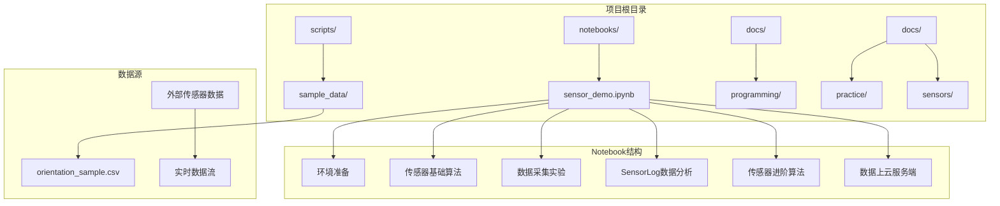
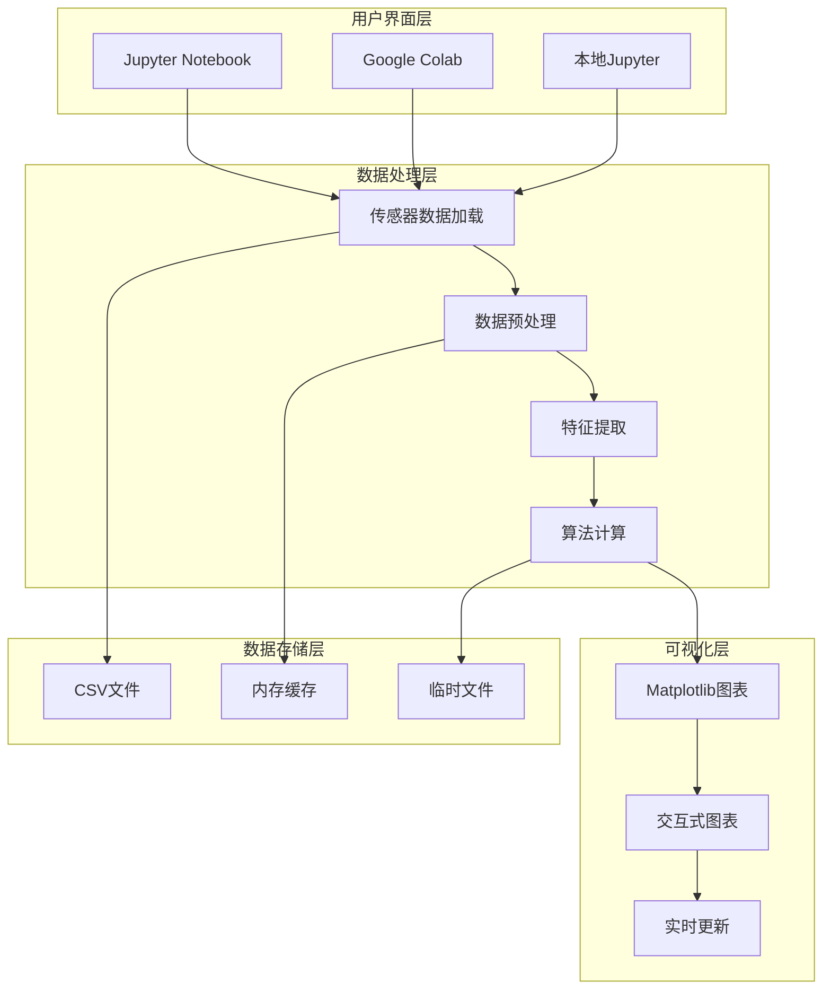
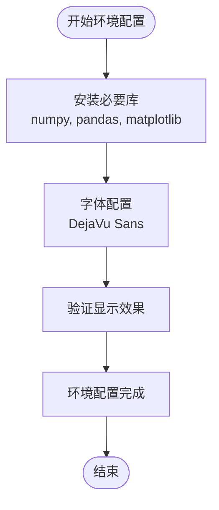
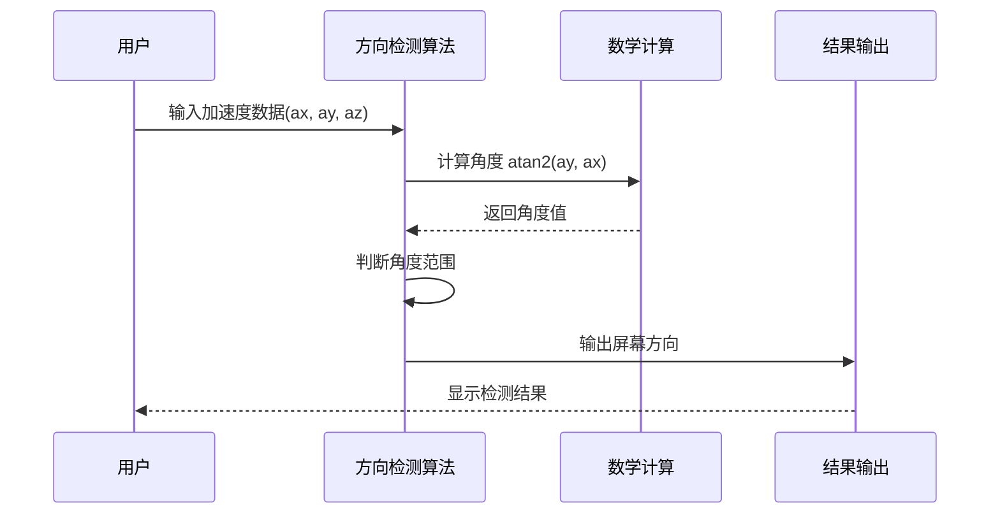
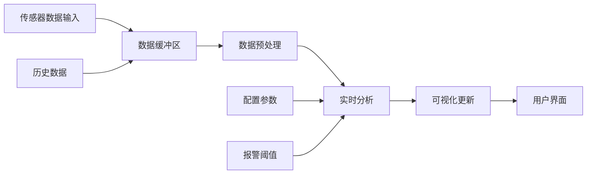
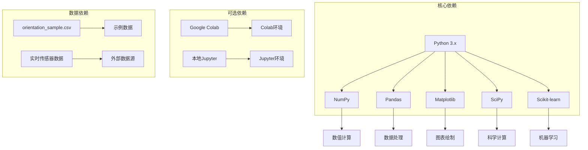

# Jupyter Notebook演示

<cite>
**本文档引用的文件**
- [README.md](file://README.md)
- [sensor_demo.ipynb](file://notebooks/sensor_demo.ipynb)
- [orientation_sample.csv](file://scripts/sample_data/orientation_sample.csv)
</cite>

## 目录
1. [项目简介](#项目简介)
2. [项目结构](#项目结构)
3. [核心组件](#核心组件)
4. [架构概览](#架构概览)
5. [详细组件分析](#详细组件分析)
6. [依赖关系分析](#依赖关系分析)
7. [性能考虑](#性能考虑)
8. [故障排除指南](#故障排除指南)
9. [结论](#结论)
10. [附录](#附录)

## 项目简介

这是一个基于Jupyter Notebook的手机传感器技术演示项目，专注于Python数据分析和可视化。该项目提供了完整的传感器数据处理、实时监控和交互式分析功能，涵盖了从基础传感器算法到高级数据分析的完整技术栈。

项目的核心特色包括：
- **实时传感器数据可视化**：支持多种传感器数据的实时显示和分析
- **交互式数据分析**：提供丰富的交互式图表和数据探索功能
- **多平台兼容**：可在Google Colab中直接运行，无需本地环境配置
- **中文界面支持**：提供完整的中文用户界面和文档

## 项目结构

**图表来源**
- [sensor_demo.ipynb:1-224](file://notebooks/sensor_demo.ipynb#L1-L224)
- [README.md:53-55](file://README.md#L53-L55)

**章节来源**
- [README.md:1-169](file://README.md#L1-L169)

## 核心组件

### 环境配置模块
负责设置Python开发环境，包括必要的库安装和配置：

- **NumPy**: 数值计算基础库
- **Pandas**: 数据处理和分析
- **Matplotlib**: 数据可视化
- **SciPy**: 科学计算
- **Scikit-learn**: 机器学习算法

### 传感器数据处理模块
提供多种传感器数据的处理和分析功能：

- **加速度计数据处理**: 屏幕方向检测和计步器算法
- **陀螺仪数据处理**: 角速度分析和姿态估计
- **磁力计数据处理**: 方向角计算和指南针应用
- **气压计数据处理**: 楼层检测和高度估算

### 可视化模块
支持多种图表类型的生成和定制：

- **时间序列图**: 显示传感器数据随时间的变化
- **频谱分析图**: 展示信号的频率成分
- **3D姿态图**: 可视化设备的姿态变化
- **交互式仪表盘**: 实时监控传感器状态

**章节来源**
- [sensor_demo.ipynb:81-105](file://notebooks/sensor_demo.ipynb#L81-L105)

## 架构概览

**图表来源**
- [sensor_demo.ipynb:119-186](file://notebooks/sensor_demo.ipynb#L119-L186)

## 详细组件分析

### 环境准备组件

#### 环境初始化流程

**图表来源**
- [sensor_demo.ipynb:81-105](file://notebooks/sensor_demo.ipynb#L81-L105)

#### 库依赖关系
- **NumPy**: 提供高性能数值计算能力
- **Pandas**: 支持数据结构化处理和分析
- **Matplotlib**: 实现各种图表绘制功能
- **SciPy**: 提供科学计算和统计分析
- **Scikit-learn**: 实现机器学习算法

**章节来源**
- [sensor_demo.ipynb:81-105](file://notebooks/sensor_demo.ipynb#L81-L105)

### 传感器基础算法组件

#### 加速度计屏幕方向检测
该算法通过分析重力加速度在X、Y轴上的分量来判断设备的屏幕方向。

**图表来源**
- [sensor_demo.ipynb:158-185](file://notebooks/sensor_demo.ipynb#L158-L185)

#### 算法实现细节
- **角度计算**: 使用atan2函数计算相对于X轴的角度
- **方向判断**: 基于角度范围判断不同的屏幕方向
- **阈值设定**: 45度和135度作为关键阈值点

**章节来源**
- [sensor_demo.ipynb:158-185](file://notebooks/sensor_demo.ipynb#L158-L185)

### 数据可视化组件

#### 图表类型和用途
| 图表类型 | 用途 | 数据格式 | 特殊功能 |
|---------|------|----------|----------|
| 时间序列图 | 显示传感器数据随时间变化 | 时间戳 vs 传感器值 | 实时更新、缩放、平移 |
| 频谱分析图 | 展示信号频率成分 | 频率 vs 幅度 | FFT变换、滤波器 |
| 3D姿态图 | 可视化设备三维姿态 | x, y, z坐标 | 旋转、缩放、视角切换 |
| 散点图 | 显示传感器相关性 | 两维数据点 | 交互式选择、高亮 |

#### 可视化配置选项
- **颜色主题**: 支持深色和浅色主题切换
- **字体大小**: 可调整标题、标签和刻度字体大小
- **线条样式**: 不同的线型和标记样式
- **图表尺寸**: 可调整图表宽度和高度

**章节来源**
- [sensor_demo.ipynb:200-224](file://notebooks/sensor_demo.ipynb#L200-L224)

### 实时监控组件

#### 数据流处理架构

**图表来源**
- [sensor_demo.ipynb:1-224](file://notebooks/sensor_demo.ipynb#L1-L224)

#### 实时更新机制
- **定时刷新**: 设置固定的时间间隔更新数据
- **事件驱动**: 基于数据变化触发更新
- **内存管理**: 控制数据缓存大小和生命周期

**章节来源**
- [sensor_demo.ipynb:1-224](file://notebooks/sensor_demo.ipynb#L1-L224)

## 依赖关系分析

### 外部依赖关系

**图表来源**
- [sensor_demo.ipynb:81-105](file://notebooks/sensor_demo.ipynb#L81-L105)
- [orientation_sample.csv:1-10](file://scripts/sample_data/orientation_sample.csv#L1-L10)

### 内部模块依赖
- **环境模块** ← **所有其他模块**
- **数据处理模块** ← **可视化模块**
- **算法模块** ← **数据处理模块**
- **监控模块** ← **算法模块**

**章节来源**
- [sensor_demo.ipynb:81-105](file://notebooks/sensor_demo.ipynb#L81-L105)

## 性能考虑

### 内存优化策略
- **数据分块处理**: 大数据集分批处理，避免内存溢出
- **数据类型优化**: 使用合适的数据类型减少内存占用
- **及时清理**: 及时删除不需要的中间变量和缓存

### 计算效率优化
- **向量化操作**: 使用NumPy的向量化操作替代循环
- **并行计算**: 利用多核处理器加速计算
- **算法优化**: 选择高效的算法和数据结构

### 可视化性能
- **动态更新**: 只更新变化的部分而不是整个图表
- **采样策略**: 对大量数据进行采样显示
- **缓存机制**: 缓存计算结果避免重复计算

## 故障排除指南

### 常见问题及解决方案

#### 环境配置问题
**问题**: 库安装失败或版本冲突
**解决方案**: 
1. 更新pip到最新版本
2. 清理pip缓存
3. 使用虚拟环境隔离依赖

**章节来源**
- [sensor_demo.ipynb:81-105](file://notebooks/sensor_demo.ipynb#L81-L105)

#### 数据加载问题
**问题**: 无法读取传感器数据文件
**解决方案**:
1. 检查文件路径是否正确
2. 验证文件格式和编码
3. 确认文件权限设置

#### 可视化显示问题
**问题**: 图表显示异常或空白
**解决方案**:
1. 检查matplotlib配置
2. 验证数据格式和范围
3. 确认显示设备的图形支持

### 调试技巧
- **日志记录**: 添加详细的日志输出便于调试
- **错误捕获**: 使用try-catch处理异常情况
- **数据验证**: 验证输入数据的有效性和完整性

## 结论

这个Jupyter Notebook演示项目为手机传感器技术的学习和研究提供了完整的工具链。通过集成的环境配置、传感器数据处理、实时监控和可视化功能，用户可以快速理解和掌握传感器数据的分析方法。

项目的亮点包括：
- **完整的功能覆盖**: 从基础算法到高级分析的全流程支持
- **友好的用户界面**: 基于Jupyter的交互式开发环境
- **灵活的扩展性**: 模块化的架构便于功能扩展和定制
- **良好的文档支持**: 详细的中文文档和示例代码

## 附录

### 使用指南

#### 环境要求
- Python 3.6+
- Jupyter Notebook或Google Colab
- 基础的Python数据科学库

#### 快速开始步骤
1. 克隆项目到本地或直接在Colab中打开
2. 运行环境配置单元格
3. 逐个执行各个演示单元格
4. 根据需要修改参数和配置

#### 扩展开发建议
- **添加新传感器支持**: 扩展数据处理模块支持更多传感器类型
- **改进算法精度**: 优化现有的传感器算法提高准确性
- **增强可视化功能**: 添加更多图表类型和交互功能
- **集成实时数据源**: 连接真实的传感器硬件进行数据采集

### 相关资源
- [项目主页](https://zebedee2021.github.io/Mobile-Sensor-2026/)
- [Google Colab链接](https://colab.research.google.com/github/Zebedee2021/Mobile-Sensor-2026/blob/main/notebooks/sensor_demo.ipynb)
- [GitHub仓库](https://github.com/Zebedee2021/Mobile-Sensor-2026)