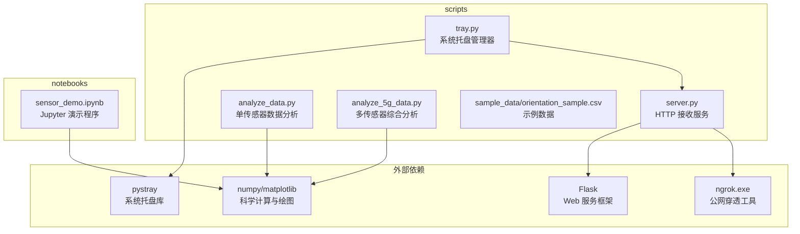
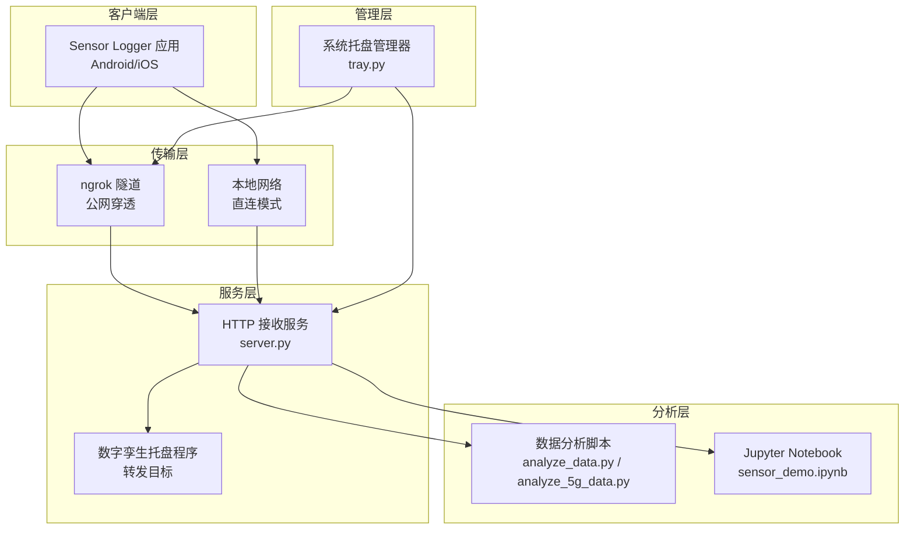
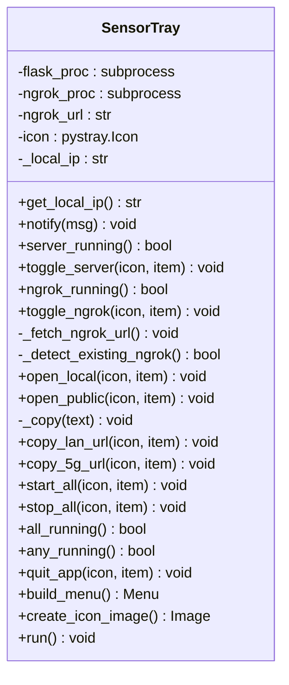
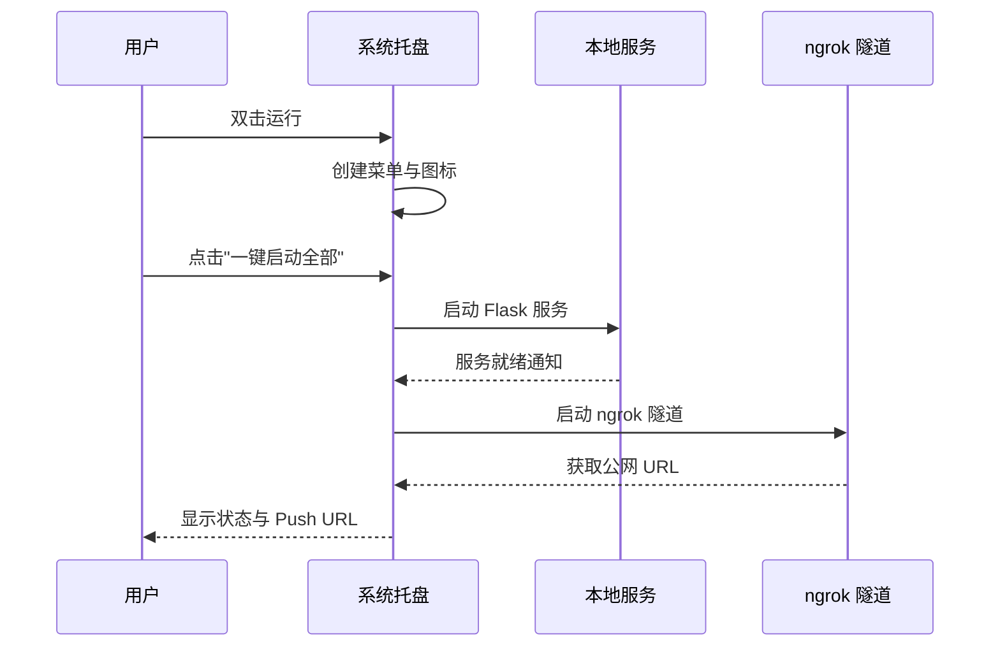
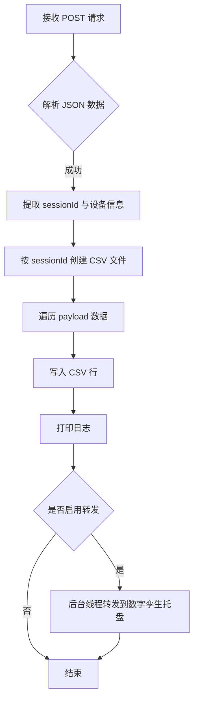
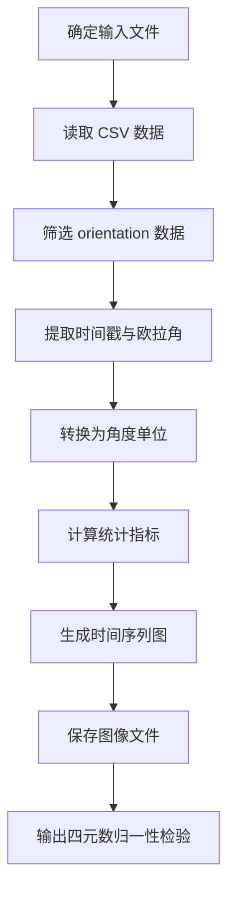
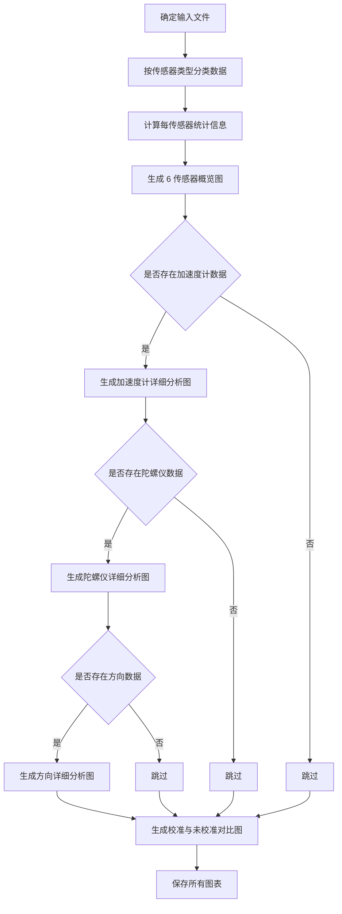
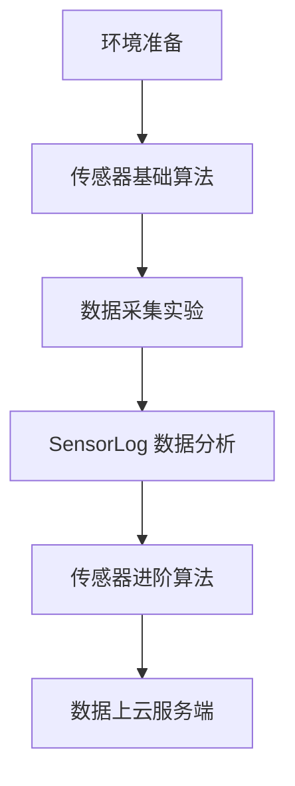
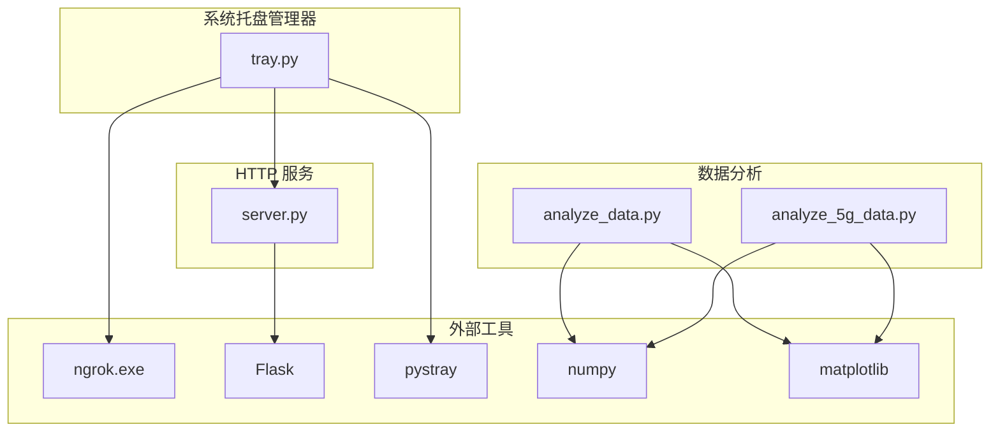

# 开发工具链

<cite>
**本文档引用的文件**
- [README.md](file://README.md)
- [tray.py](file://scripts/tray.py)
- [server.py](file://scripts/server.py)
- [analyze_data.py](file://scripts/analyze_data.py)
- [analyze_5g_data.py](file://scripts/analyze_5g_data.py)
- [orientation_sample.csv](file://scripts/sample_data/orientation_sample.csv)
- [sensor_demo.ipynb](file://notebooks/sensor_demo.ipynb)
</cite>

## 目录
1. [简介](#简介)
2. [项目结构](#项目结构)
3. [核心组件](#核心组件)
4. [架构概览](#架构概览)
5. [详细组件分析](#详细组件分析)
6. [依赖分析](#依赖分析)
7. [性能考虑](#性能考虑)
8. [故障排除指南](#故障排除指南)
9. [结论](#结论)
10. [附录](#附录)

## 简介
本开发工具链面向智能手机传感器技术教学与实践，提供从数据采集、实时监控到数据分析的完整解决方案。工具链包含：
- Python 数据分析脚本：支持单传感器与多传感器综合分析，生成统计报告与可视化图表
- 系统托盘管理器：一键启动本地服务与 ngrok 隧道，简化远程数据采集流程
- Jupyter Notebook 演示程序：提供交互式 Python 示例，覆盖传感器基础算法与数据分析

工具链支持本地网络模式与 5G/公网模式，通过 ngrok 实现跨网络的数据推送，并提供实时仪表盘进行可视化监控。

## 项目结构
项目采用模块化组织，核心文件分布如下：
- scripts：包含数据采集服务、系统托盘管理器与数据分析脚本
- notebooks：包含 Jupyter Notebook 演示程序
- docs：文档与教程资源（不在本次分析范围内）

**图表来源**
- [server.py:1-94](file://scripts/server.py#L1-L94)
- [tray.py:1-276](file://scripts/tray.py#L1-L276)
- [analyze_data.py:1-98](file://scripts/analyze_data.py#L1-L98)
- [analyze_5g_data.py:1-360](file://scripts/analyze_5g_data.py#L1-L360)

**章节来源**
- [README.md:1-169](file://README.md#L1-L169)

## 核心组件
本工具链由以下核心组件构成：

### 1. HTTP 数据接收服务（server.py）
- 功能：接收来自 Sensor Logger 应用的传感器数据，写入 CSV 文件并可选转发至数字孪生托盘程序
- 特性：支持自定义转发目标与开关，自动创建 data 目录，按 sessionId 分割文件
- 端口：默认 8000，可通过参数调整
- 转发：可配置是否启用转发至 localhost:8081

### 2. 系统托盘管理器（tray.py）
- 功能：提供图形化界面管理本地服务与 ngrok 隧道
- 特性：一键启动/停止服务与隧道，自动检测 ngrok 状态，复制 Push URL，打开仪表盘
- 依赖：pystray、Pillow、ngrok.exe（需手动下载放置项目根目录）
- 端口：服务端口 8080，ngrok 隧道端口 8080

### 3. 单传感器数据分析（analyze_data.py）
- 功能：处理 orientation 传感器数据，提取欧拉角与四元数，生成统计报告与时间序列图
- 输入：CSV 文件路径（支持命令行参数或自动查找 data 目录最大文件）
- 输出：orientation_plot.png 图表与控制台统计信息

### 4. 多传感器综合分析（analyze_5g_data.py）
- 功能：解析并分析多种传感器类型（加速度计、陀螺仪、重力、方向等），生成综合报告与图表
- 特性：支持 FFT 分析、校准与未校准传感器对比、四元数归一性检验
- 输出：多张 PNG 图表与详细统计信息

### 5. Jupyter Notebook 演示程序（sensor_demo.ipynb）
- 功能：提供交互式 Python 示例，涵盖传感器基础算法、数据采集实验与数据分析
- 特性：环境准备、中文显示设置、示例代码执行与结果展示
- 适用：Google Colab 直接运行，无需本地安装

**章节来源**
- [server.py:1-94](file://scripts/server.py#L1-L94)
- [tray.py:1-276](file://scripts/tray.py#L1-L276)
- [analyze_data.py:1-98](file://scripts/analyze_data.py#L1-L98)
- [analyze_5g_data.py:1-360](file://scripts/analyze_5g_data.py#L1-L360)
- [sensor_demo.ipynb:1-2617](file://notebooks/sensor_demo.ipynb#L1-L2617)

## 架构概览
工具链采用客户端-服务端-分析层的三层架构，结合系统托盘进行统一管理。

**图表来源**
- [server.py:1-94](file://scripts/server.py#L1-L94)
- [tray.py:1-276](file://scripts/tray.py#L1-L276)
- [analyze_data.py:1-98](file://scripts/analyze_data.py#L1-L98)
- [analyze_5g_data.py:1-360](file://scripts/analyze_5g_data.py#L1-L360)
- [sensor_demo.ipynb:1-2617](file://notebooks/sensor_demo.ipynb#L1-L2617)

## 详细组件分析

### 系统托盘管理器（tray.py）
系统托盘管理器提供图形化界面，简化服务启动与管理流程。

**图表来源**
- [tray.py:18-276](file://scripts/tray.py#L18-L276)

**使用流程**

**图表来源**
- [tray.py:169-184](file://scripts/tray.py#L169-L184)
- [tray.py:79-99](file://scripts/tray.py#L79-L99)

**章节来源**
- [tray.py:1-276](file://scripts/tray.py#L1-L276)

### HTTP 数据接收服务（server.py）
HTTP 服务负责接收传感器数据并进行持久化与转发。

**图表来源**
- [server.py:35-81](file://scripts/server.py#L35-L81)

**章节来源**
- [server.py:1-94](file://scripts/server.py#L1-L94)

### 单传感器数据分析（analyze_data.py）
该脚本专注于 orientation 传感器数据的处理与可视化。

**图表来源**
- [analyze_data.py:16-98](file://scripts/analyze_data.py#L16-L98)

**章节来源**
- [analyze_data.py:1-98](file://scripts/analyze_data.py#L1-L98)
- [orientation_sample.csv:1-352](file://scripts/sample_data/orientation_sample.csv#L1-L352)

### 多传感器综合分析（analyze_5g_data.py）
综合分析脚本支持多种传感器类型的解析与深度分析。

**图表来源**
- [analyze_5g_data.py:22-359](file://scripts/analyze_5g_data.py#L22-L359)

**章节来源**
- [analyze_5g_data.py:1-360](file://scripts/analyze_5g_data.py#L1-L360)

### Jupyter Notebook 演示程序（sensor_demo.ipynb）
Notebook 提供交互式学习体验，涵盖多个主题模块。

**图表来源**
- [sensor_demo.ipynb:18-36](file://notebooks/sensor_demo.ipynb#L18-L36)

**章节来源**
- [sensor_demo.ipynb:1-2617](file://notebooks/sensor_demo.ipynb#L1-L2617)

## 依赖分析
工具链各组件之间的依赖关系如下：

**图表来源**
- [tray.py:5-8](file://scripts/tray.py#L5-L8)
- [server.py:11-12](file://scripts/server.py#L11-L12)
- [analyze_data.py:9-12](file://scripts/analyze_data.py#L9-L12)
- [analyze_5g_data.py:14-18](file://scripts/analyze_5g_data.py#L14-L18)

**章节来源**
- [tray.py:1-276](file://scripts/tray.py#L1-L276)
- [server.py:1-94](file://scripts/server.py#L1-L94)
- [analyze_data.py:1-98](file://scripts/analyze_data.py#L1-L98)
- [analyze_5g_data.py:1-360](file://scripts/analyze_5g_data.py#L1-L360)

## 性能考虑
- 数据写入：CSV 写入采用追加模式，按 sessionId 分割文件，避免单文件过大
- 转发机制：使用后台线程进行数据转发，不影响主请求处理
- 图像生成：matplotlib 使用 Agg 后端，适合服务器环境无 GUI 的场景
- 内存管理：数据分析脚本使用 numpy 数组，支持大数据集处理
- 网络延迟：ngrok 隧道可能引入额外延迟，建议在稳定网络环境下使用

## 故障排除指南
常见问题与解决方案：

### 1. 端口占用问题
- 症状：启动本地服务失败，提示端口被占用
- 解决方案：检查 8000 端口占用情况，修改 server.py 中的 PORT 参数或释放占用进程

### 2. ngrok 启动失败
- 症状：ngrok 隧道启动超时或无法获取公网 URL
- 解决方案：确认 ngrok.exe 存在于项目根目录，检查网络连接与 authtoken 配置

### 3. 数据未写入 CSV
- 症状：接收服务正常运行但未生成数据文件
- 解决方案：检查 data 目录权限，确认 POST 请求格式正确，查看控制台输出日志

### 4. 分析脚本无法找到数据文件
- 症状：运行数据分析脚本报错，提示找不到数据文件
- 解决方案：确保数据文件存在于 data 目录，或通过命令行参数指定具体文件路径

### 5. 图像生成异常
- 症状：数据分析脚本执行完成但未生成图表
- 解决方案：检查 matplotlib 后端配置，确认输出目录有写入权限

**章节来源**
- [tray.py:51-74](file://scripts/tray.py#L51-L74)
- [tray.py:79-99](file://scripts/tray.py#L79-L99)
- [server.py:35-81](file://scripts/server.py#L35-L81)
- [analyze_data.py:16-28](file://scripts/analyze_data.py#L16-L28)

## 结论
本开发工具链提供了完整的智能手机传感器数据分析解决方案，通过系统托盘管理器简化了服务启动与管理流程，通过数据分析脚本实现了从单传感器到多传感器的综合分析能力，并通过 Jupyter Notebook 提供了交互式学习体验。工具链具有良好的扩展性与实用性，适用于教学、实验与研究等多种场景。

## 附录

### 使用场景与最佳实践
- 教学演示：使用 Jupyter Notebook 进行课堂演示，结合系统托盘管理器实现实时数据采集
- 实验验证：通过数据分析脚本验证传感器算法的有效性
- 数据分析：利用多传感器综合分析脚本进行深入的数据挖掘与可视化
- 远程采集：使用 ngrok 实现跨网络的数据推送，支持 5G 网络环境下的数据采集

### 配置选项摘要
- server.py：端口配置、转发目标与开关
- tray.py：服务端口、ngrok 路径、通知设置
- analyze_data.py：输入文件路径、输出目录
- analyze_5g_data.py：输入文件路径、输出目录、图表分辨率