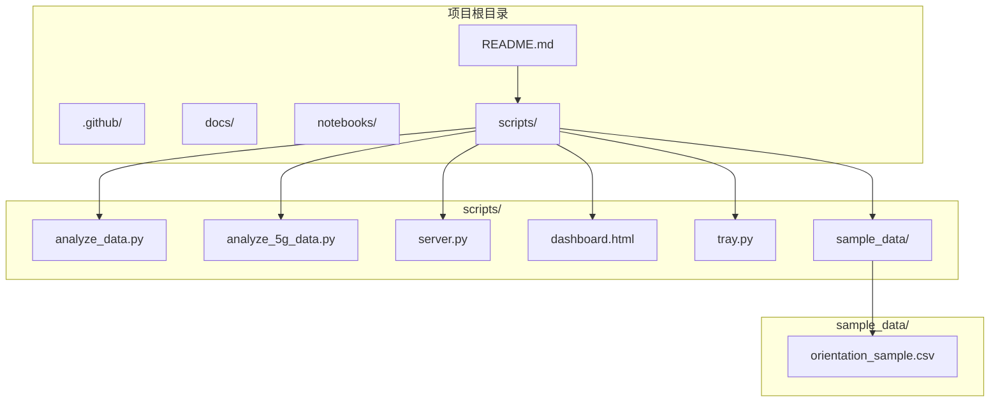
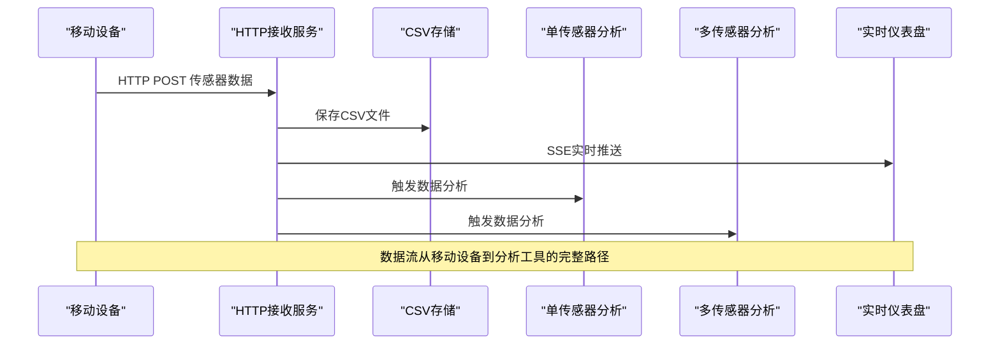
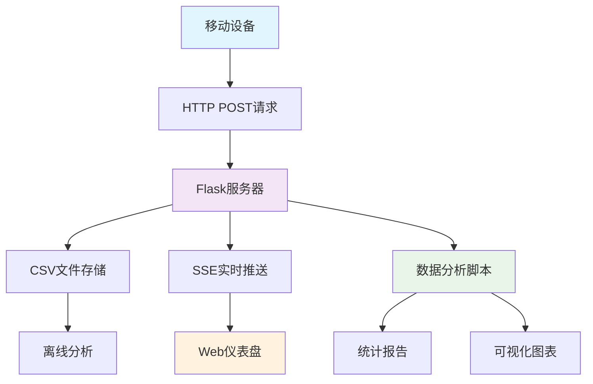
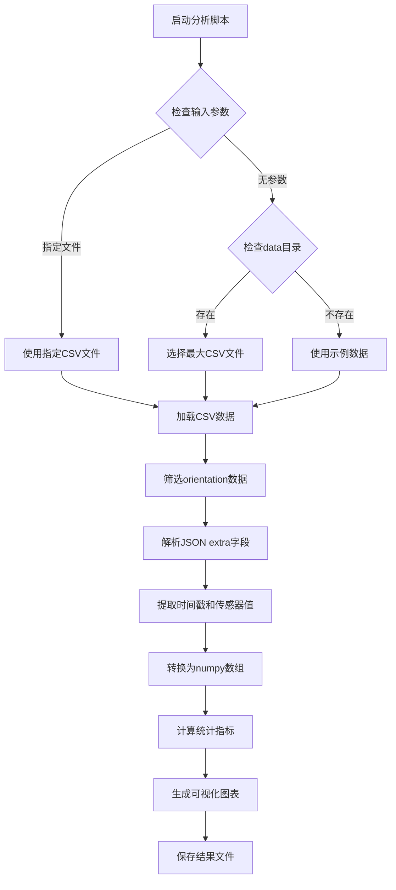
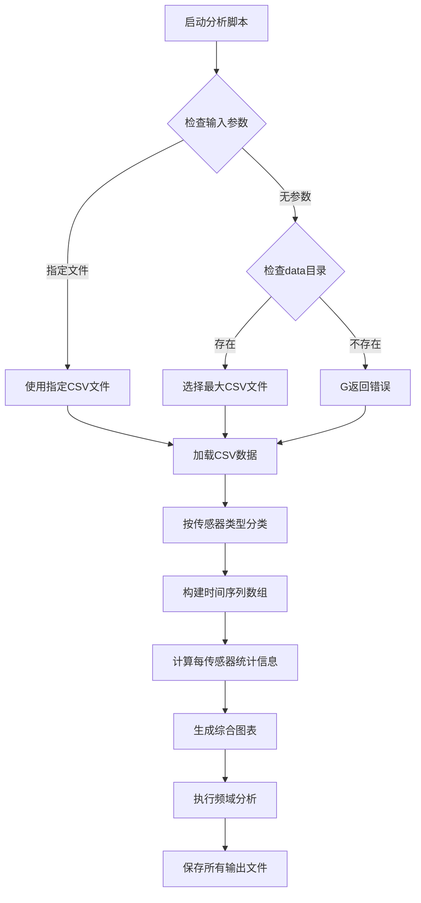
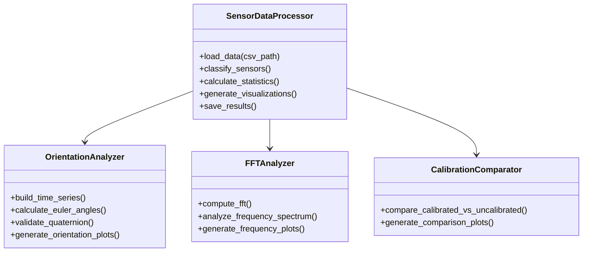
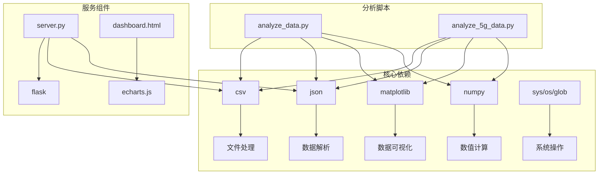

# 数据分析工具

<cite>
**本文档引用的文件**
- [analyze_data.py](file://scripts/analyze_data.py)
- [analyze_5g_data.py](file://scripts/analyze_5g_data.py)
- [orientation_sample.csv](file://scripts/sample_data/orientation_sample.csv)
- [server.py](file://scripts/server.py)
- [dashboard.html](file://scripts/dashboard.html)
- [README.md](file://README.md)
</cite>

## 目录
1. [项目概述](#项目概述)
2. [项目结构](#项目结构)
3. [核心组件](#核心组件)
4. [架构概览](#架构概览)
5. [详细组件分析](#详细组件分析)
6. [依赖关系分析](#依赖关系分析)
7. [性能考虑](#性能考虑)
8. [故障排除指南](#故障排除指南)
9. [结论](#结论)

## 项目概述

这是一个基于Python的智能手机传感器数据分析工具包，专门用于处理和分析通过Sensor Logger应用收集的传感器数据。该工具包提供了两个主要的数据分析脚本，支持从简单的单传感器数据到复杂的多传感器数据的全面分析。

### 主要功能特性
- **实时数据接收**: 通过HTTP POST接口接收来自移动设备的传感器数据
- **多格式数据处理**: 支持CSV格式的传感器数据文件
- **统计分析**: 提供详细的统计数据和可视化图表
- **数据质量检查**: 包含数据完整性验证和异常检测
- **灵活的输入源**: 支持实时数据流和离线CSV文件分析

## 项目结构



**图表来源**
- [README.md:1-169](file://README.md#L1-L169)
- [analyze_data.py:1-98](file://scripts/analyze_data.py#L1-L98)
- [analyze_5g_data.py:1-360](file://scripts/analyze_5g_data.py#L1-L360)

**章节来源**
- [README.md:1-169](file://README.md#L1-L169)

## 核心组件

### 数据收集组件

#### HTTP接收服务 (server.py)
- **功能**: 接收来自Sensor Logger应用的HTTP POST数据
- **协议**: Flask Web服务，支持JSON数据传输
- **存储**: 自动将数据保存为CSV文件到data/目录
- **转发**: 支持将数据转发到其他服务

#### 实时仪表盘 (dashboard.html)
- **功能**: 提供Web界面实时显示传感器数据
- **技术**: 使用ECharts进行数据可视化
- **交互**: 支持暂停/继续、主题切换等操作
- **响应式**: 适配不同屏幕尺寸

### 数据分析组件

#### 单传感器分析 (analyze_data.py)
- **目标**: 专门处理方向传感器数据
- **功能**: 
  - 加载orientation数据
  - 计算统计指标
  - 生成时间序列图表
  - 四元数验证

#### 多传感器分析 (analyze_5g_data.py)
- **目标**: 处理所有类型的传感器数据
- **功能**:
  - 支持6种传感器类型
  - 生成综合分析报告
  - 创建详细的可视化图表
  - 频域分析（FFT）

**章节来源**
- [server.py:1-94](file://scripts/server.py#L1-L94)
- [dashboard.html:1-561](file://scripts/dashboard.html#L1-L561)
- [analyze_data.py:1-98](file://scripts/analyze_data.py#L1-L98)
- [analyze_5g_data.py:1-360](file://scripts/analyze_5g_data.py#L1-L360)

## 架构概览



**图表来源**
- [server.py:35-81](file://scripts/server.py#L35-L81)
- [dashboard.html:512-525](file://scripts/dashboard.html#L512-L525)

### 数据流架构



**图表来源**
- [server.py:1-94](file://scripts/server.py#L1-L94)
- [dashboard.html:1-561](file://scripts/dashboard.html#L1-L561)

## 详细组件分析

### 数据格式规范

#### CSV文件结构
所有传感器数据都遵循统一的CSV格式：

| 字段名 | 类型 | 描述 | 示例值 |
|--------|------|------|--------|
| time_ns | 整数 | 时间戳（纳秒） | 1774665763092520000 |
| device | 字符串 | 设备标识符 | 3c7cd7bc-6a31-4d86-8896-31a0eec5eb06 |
| sensor | 字符串 | 传感器类型 | accelerometer, gyroscope, gravity, orientation |
| x | 数值 | X轴数据或纬度 | 0.123 或 39.9042 |
| y | 数值 | Y轴数据或经度 | 0.456 或 116.4074 |
| z | 数值 | Z轴数据或海拔 | 0.789 或 100.0 |
| extra | JSON字符串 | 额外传感器数据 | {"yaw": -0.7976, "qw": -0.8217, ...} |

#### 方向传感器特殊格式
方向传感器（orientation）使用extra字段存储复杂的JSON数据：

```json
{
  "yaw": -0.7976433638510612,
  "pitch": 0.7893723104387449,
  "roll": -0.2785770743863276,
  "qw": -0.8217000598579662,
  "qx": -0.3011389991892937,
  "qy": 0.26598081799870826,
  "qz": 0.4042010819628796
}
```

#### 传感器类型定义

| 传感器类型 | 字段含义 | 单位 | 典型应用场景 |
|------------|----------|------|-------------|
| accelerometer | 加速度 | m/s² | 步数计数、跌倒检测、运动分析 |
| gyroscope | 角速度 | rad/s | 姿态估计、游戏控制 |
| gravity | 重力分量 | m/s² | 设备方向检测 |
| orientation | 欧拉角 | 度 | 导航、指南针 |
| accelerometeruncalibrated | 未校准加速度 | m/s² | 校准质量评估 |
| gyroscopeuncalibrated | 未校准角速度 | rad/s | 校准质量评估 |

**章节来源**
- [server.py:41-72](file://scripts/server.py#L41-L72)
- [orientation_sample.csv:1-10](file://scripts/sample_data/orientation_sample.csv#L1-L10)

### 数据预处理流程

#### 单传感器分析流程 (analyze_data.py)



**图表来源**
- [analyze_data.py:16-48](file://scripts/analyze_data.py#L16-L48)

#### 多传感器分析流程 (analyze_5g_data.py)



**图表来源**
- [analyze_5g_data.py:22-63](file://scripts/analyze_5g_data.py#L22-L63)

### 统计分析实现

#### 基础统计指标
两个分析脚本都计算以下基础统计指标：

| 指标类型 | 计算方法 | 用途 |
|----------|----------|------|
| 持续时间 | 最后时间 - 首次时间 | 数据完整性评估 |
| 采样率 | 样本数量 / 持续时间 | 数据质量检查 |
| 均值 | Σx / n | 中心趋势分析 |
| 标准差 | √Σ(xi - μ)² / n | 数据离散程度 |
| 最小值/最大值 | 极值查找 | 异常检测 |

#### 高级统计分析
多传感器分析还包含：



**图表来源**
- [analyze_5g_data.py:75-123](file://scripts/analyze_5g_data.py#L75-L123)

**章节来源**
- [analyze_data.py:60-67](file://scripts/analyze_data.py#L60-L67)
- [analyze_5g_data.py:92-123](file://scripts/analyze_5g_data.py#L92-L123)

### 可视化生成

#### 单传感器可视化 (analyze_data.py)
- **时间序列图**: 显示Yaw、Pitch、Roll角度随时间的变化
- **统计摘要**: 控制台输出详细的统计信息
- **四元数验证**: 检查四元数范数是否接近1.0

#### 多传感器可视化 (analyze_5g_data.py)
- **综合概览图**: 6面板展示所有传感器数据
- **详细分析图**: 
  - 加速度计详细分析（时域+频域）
  - 陀螺仪详细分析
  - 方向传感器详细分析（含四元数）
  - 校准对比图
- **分布直方图**: 显示数据分布特征

**章节来源**
- [analyze_data.py:68-98](file://scripts/analyze_data.py#L68-L98)
- [analyze_5g_data.py:125-358](file://scripts/analyze_5g_data.py#L125-L358)

## 依赖关系分析

### Python依赖关系



**图表来源**
- [analyze_data.py:8-14](file://scripts/analyze_data.py#L8-L14)
- [analyze_5g_data.py:14-20](file://scripts/analyze_5g_data.py#L14-L20)
- [server.py:11-13](file://scripts/server.py#L11-L13)

### 外部依赖

| 依赖包 | 版本要求 | 用途 |
|--------|----------|------|
| numpy | >=1.19.0 | 数值计算和数组操作 |
| matplotlib | >=3.3.0 | 数据可视化 |
| flask | >=2.0.0 | Web服务框架 |
| echarts | >=5.0.0 | Web图表库 |

**章节来源**
- [analyze_data.py:8-14](file://scripts/analyze_data.py#L8-L14)
- [analyze_5g_data.py:14-20](file://scripts/analyze_5g_data.py#L14-L20)
- [server.py:11-13](file://scripts/server.py#L11-L13)

## 性能考虑

### 内存管理策略

#### 数据加载优化
- **增量处理**: 分批读取CSV文件，避免一次性加载大文件
- **类型转换**: 在读取时直接转换为所需数据类型
- **内存回收**: 及时释放不再使用的中间变量

#### 数组操作优化
- **向量化操作**: 使用NumPy数组替代Python列表
- **就地操作**: 尽可能使用就地修改减少内存分配
- **数据类型优化**: 选择合适的数据类型减少内存占用

### 性能优化技巧

#### I/O优化
- **缓冲写入**: 使用CSV writer的缓冲机制
- **批量处理**: 将多个传感器数据合并处理
- **文件复用**: 避免频繁打开/关闭文件

#### 计算优化
- **向量化统计**: 使用NumPy内置函数进行统计计算
- **并行处理**: 对独立传感器数据进行并行分析
- **缓存机制**: 缓存重复计算的结果

### 错误处理策略

#### 数据质量检查
- **空值处理**: 检测和处理缺失数据
- **异常值检测**: 识别超出合理范围的数据点
- **格式验证**: 验证CSV文件格式的正确性

#### 容错机制
- **异常捕获**: 使用try-catch处理解析错误
- **降级策略**: 当部分数据损坏时继续处理有效数据
- **日志记录**: 记录处理过程中的重要信息

**章节来源**
- [analyze_data.py:33-43](file://scripts/analyze_data.py#L33-L43)
- [analyze_5g_data.py:57-63](file://scripts/analyze_5g_data.py#L57-L63)

## 故障排除指南

### 常见问题及解决方案

#### 数据文件问题
**问题**: No data file found. Run server.py first to collect data.
**原因**: 没有找到有效的CSV数据文件
**解决方案**:
1. 确保server.py正在运行
2. 检查data/目录是否有CSV文件
3. 验证CSV文件格式是否正确

#### 数据解析错误
**问题**: JSON解析失败或字段缺失
**原因**: orientation数据格式不正确
**解决方案**:
1. 检查extra字段的JSON格式
2. 验证四元数字段的存在性
3. 确认时间戳格式正确

#### 内存不足问题
**问题**: 处理大数据文件时内存溢出
**解决方案**:
1. 使用更小的采样率
2. 分批处理数据文件
3. 增加系统内存或使用64位Python

### 调试技巧

#### 日志分析
- 启用详细日志输出
- 检查数据量统计信息
- 验证数据完整性

#### 性能监控
- 监控内存使用情况
- 分析处理时间
- 识别性能瓶颈

**章节来源**
- [analyze_data.py:26-28](file://scripts/analyze_data.py#L26-L28)
- [server.py:35-81](file://scripts/server.py#L35-L81)

## 结论

这个数据分析工具包提供了完整的传感器数据处理解决方案，具有以下优势：

### 技术优势
- **模块化设计**: 清晰的组件分离便于维护和扩展
- **灵活的数据处理**: 支持多种数据格式和分析需求
- **强大的可视化**: 提供丰富的图表和统计报告
- **良好的性能**: 优化的内存管理和计算效率

### 应用价值
- **教育用途**: 适合教学和实验项目
- **研究支持**: 提供专业的数据分析能力
- **开发参考**: 作为传感器数据分析的参考实现

### 发展建议
- **扩展支持**: 添加更多传感器类型的支持
- **性能优化**: 进一步优化大数据处理能力
- **用户界面**: 开发图形化的用户界面
- **云端集成**: 支持云端数据存储和分析

该工具包为智能手机传感器数据分析提供了一个完整、可靠且易于使用的解决方案，适用于教育、研究和开发等多种应用场景。