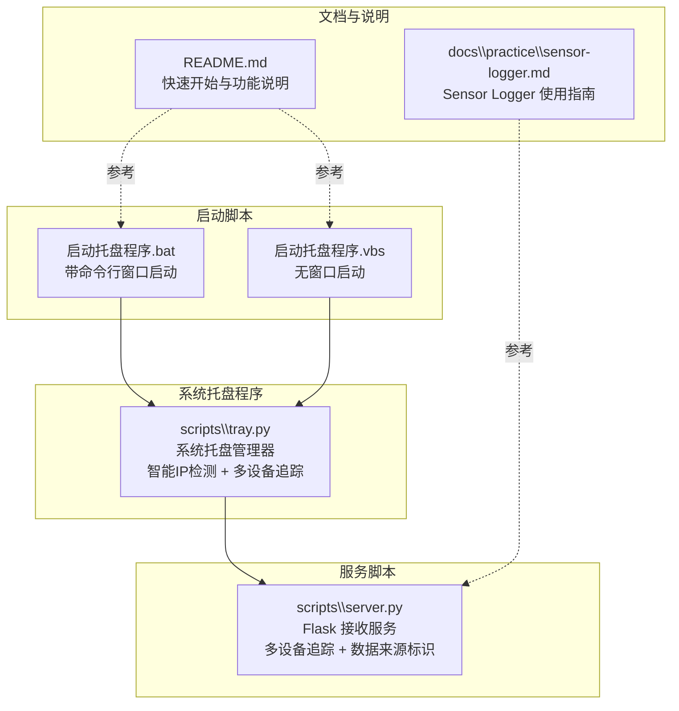
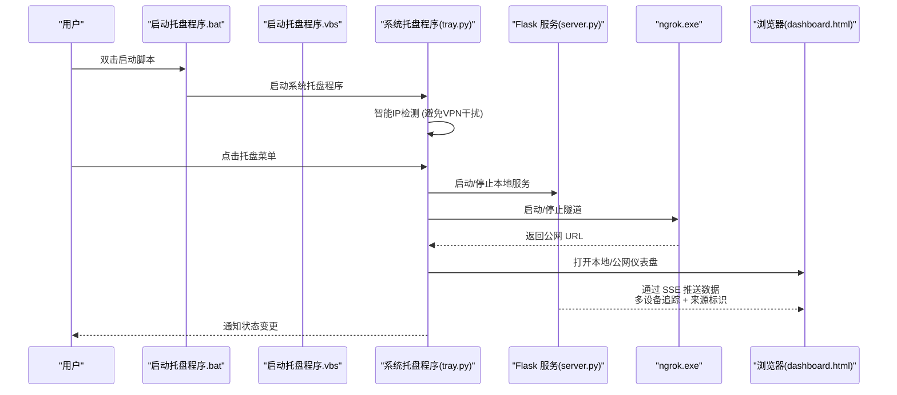
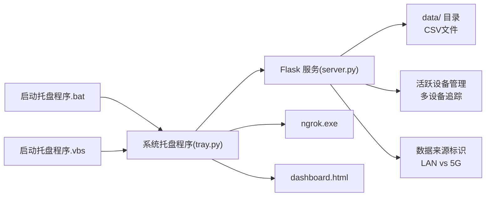

# 系统托盘管理器

<cite>
**本文引用的文件列表**
- [启动托盘程序.bat](file://启动托盘程序.bat)
- [启动托盘程序.vbs](file://启动托盘程序.vbs)
- [server.py](file://scripts/server.py)
- [tray.py](file://scripts/tray.py)
- [README.md](file://README.md)
- [sensor-logger.md](file://docs/practice/sensor-logger.md)
</cite>

## 更新摘要
**所做更改**
- 新增智能IP检测功能，避免VPN虚拟IP干扰真实局域网IP
- 新增多设备追踪与数据来源标识功能
- 新增自动ngrok状态监控与外部进程检测
- 更新系统托盘管理器实现细节和功能特性
- 增强通知系统和错误处理机制
- 更新安装配置指南以反映新功能

## 目录
1. [简介](#简介)
2. [项目结构](#项目结构)
3. [核心组件](#核心组件)
4. [架构总览](#架构总览)
5. [详细组件分析](#详细组件分析)
6. [依赖关系分析](#依赖关系分析)
7. [性能考量](#性能考量)
8. [故障排查指南](#故障排查指南)
9. [结论](#结论)
10. [附录](#附录)

## 简介
本文件围绕系统托盘管理器展开，重点解析当前的系统托盘启动机制与功能特性，覆盖以下方面：
- 通过启动脚本启动系统托盘程序的方式
- Flask 本地服务的启动与停止控制
- ngrok 隧道的管理与自动探测
- **智能本地IP地址检测**（避免VPN干扰）
- **多设备追踪与数据来源标识**
- 通知系统与动态菜单构建机制
- 所有公开方法的参数、返回值与使用场景
- 系统托盘图标设计、动态菜单构建逻辑与用户交互流程
- 完整安装配置指南、常见问题排查与性能优化建议
- 实际使用示例与最佳实践

## 项目结构
该项目采用"启动脚本 + 服务脚本 + 托盘管理器"的架构，通过批处理和VBScript脚本启动系统托盘程序，配合Flask服务与文档仪表盘共同构成完整的数据采集与展示链路。

**图表来源**
- [启动托盘程序.bat:1-13](file://启动托盘程序.bat#L1-L13)
- [启动托盘程序.vbs:1-32](file://启动托盘程序.vbs#L1-L32)
- [server.py:1-302](file://scripts/server.py#L1-L302)
- [tray.py:1-334](file://scripts/tray.py#L1-L334)
- [README.md:114-128](file://README.md#L114-L128)
- [sensor-logger.md:108-116](file://docs/practice/sensor-logger.md#L108-L116)

## 核心组件
- 启动脚本：提供两种启动方式
  - 启动托盘程序.bat：显示命令行窗口，便于调试和查看输出
  - 启动托盘程序.vbs：隐藏命令行窗口，只在系统托盘显示
- 系统托盘管理器：负责：
  - 启停 Flask 本地服务
  - 启停 ngrok 隧道并自动探测公网 URL
  - **智能本地 IP 检测**（优先真实局域网IP，避免VPN干扰）
  - 通知系统（托盘气泡提示）
  - 动态菜单构建与用户交互
  - 托盘图标生成与运行
- Flask接收服务：负责：
  - 接收来自Sensor Logger的POST /data
  - **多设备追踪与活跃设备管理**
  - **数据来源标识**（局域网 vs 5G公网）
  - 写入CSV文件（按sessionId分割）
  - 可选转发到数字孪生托盘程序（若启用）

## 架构总览
系统托盘程序通过启动脚本启动，自动管理Flask服务与ngrok，结合**智能本地IP检测**与**多设备追踪**功能，提供一键启动/停止、打开仪表盘、复制URL等能力；Flask服务接收来自Sensor Logger的数据，写入CSV并转发给数字孪生托盘程序（若启用），同时支持**多设备同时接入**和**数据来源自动标识**。

**图表来源**
- [启动托盘程序.bat:6](file://启动托盘程序.bat#L6)
- [启动托盘程序.vbs:20](file://启动托盘程序.vbs#L20)
- [server.py:226-237](file://scripts/server.py#L226-L237)
- [tray.py:27-56](file://scripts/tray.py#L27-L56)
- [server.py:131-136](file://scripts/server.py#L131-L136)

## 详细组件分析

### 启动脚本系统
- 启动托盘程序.bat
  - 功能：显示命令行窗口，便于调试和查看输出
  - 特点：启动后显示"正在启动 Sensor Logger 托盘程序..."提示
  - 错误处理：启动失败时提示安装pystray和pillow依赖
- 启动托盘程序.vbs
  - 功能：隐藏命令行窗口，只在系统托盘显示
  - 特点：自动检测pythonw.exe是否存在，不存在则回退到python
  - 自动化：切换到项目目录并启动系统托盘程序

### 系统托盘管理器（SensorTray类）
**更新** 新增智能IP检测、自动ngrok状态监控和增强的通知系统

- **智能IP检测** (`get_local_ip()`)
  - 优先检测192.168.x.x或10.x.x.x的真实局域网IP
  - 避免VPN虚拟IP干扰，通过ipconfig解析和适配器名称过滤
  - 回退到socket方法获取真实IP地址
  - 缓存检测结果，避免重复查询

- **自动ngrok状态监控**
  - `_check_ngrok_api()`：检测外部已运行的ngrok进程
  - `_detect_existing_ngrok()`：探测本地4040端口API获取公网URL
  - `_fetch_ngrok_url()`：后台线程轮询ngrok API获取公网URL
  - 支持自动检测已存在的ngrok隧道，无需重新启动

- **增强的通知系统**
  - 改进的异常静默处理，避免通知失败导致程序崩溃
  - 详细的启动/停止状态通知
  - 端口占用、ngrok超时等错误的明确提示

- **进程生命周期管理**
  - 进程状态检测与优雅停止
  - 一键启动/停止全部功能
  - 退出时的资源清理和残留进程处理

### Flask接收服务（server.py）
**更新** 新增多设备追踪、数据来源标识和活跃设备管理

- **多设备追踪** (`active_devices`管理)
  - 追踪活跃设备：device_id -> {session_id, last_seen, source}
  - 设备超时清理：DEVICE_TIMEOUT = 30秒
  - 设备状态查询接口：`/devices`
  - 支持同时接入多个手机设备

- **数据来源标识** (`get_client_source()`)
  - 自动区分局域网(LAN)和5G公网数据来源
  - 基于X-Forwarded-For头部和Host域名判断
  - 支持私有IP范围识别（192.168.x.x, 10.x.x.x, 172.x.x.x）

- **实时数据广播**
  - SSE事件流推送，支持多设备数据展示
  - 数据降采样优化浏览器性能
  - 设备和来源信息的完整数据包

### 仪表盘（dashboard.html）
- 职责边界
  - 通过EventSource订阅/stream，实时渲染传感器波形
  - 提供主题切换、暂停/继续、统计信息等交互
  - **新增设备选择器**，支持多设备数据切换查看
  - **新增数据来源显示**，区分局域网和5G公网数据

## 依赖关系分析

**图表来源**
- [启动托盘程序.bat:6](file://启动托盘程序.bat#L6)
- [启动托盘程序.vbs:20](file://启动托盘程序.vbs#L20)
- [server.py:21-237](file://scripts/server.py#L21-L237)
- [tray.py:27-56](file://scripts/tray.py#L27-L56)
- [server.py:131-136](file://scripts/server.py#L131-L136)

## 性能考量
- **智能IP检测优化**
  - 优先使用ipconfig解析，避免网络延迟
  - 适配器名称过滤避免VMware/VirtualBox/VPN干扰
  - 结果缓存避免重复查询
  - 失败回退到socket方法，保证可用性

- **多设备追踪优化**
  - 设备超时清理，避免内存泄漏
  - 线程安全的设备状态管理
  - 设备状态查询的高效实现

- **启动脚本优化**
  - bat脚本：显示命令行窗口，便于调试，但会占用终端
  - vbs脚本：隐藏命令行窗口，用户体验更佳
  - 自动依赖检测：自动检测pythonw.exe是否存在，提升兼容性

- **子进程管理**
  - 启动Flask/ngrok时使用CREATE_NO_WINDOW隐藏控制台窗口，避免干扰
  - 启动后短暂sleep(1)检查进程是否立即退出，若退出则视为失败并通知
  - 优雅的进程停止和资源清理

- **网络探测优化**
  - ngrok URL轮询最多20次，每次1秒，避免长时间阻塞
  - 外部ngrok进程检测使用短超时，提升响应速度
  - 自动检测已存在隧道，避免重复启动

- **转发与IO优化**
  - Flask转发使用后台线程，不阻塞主请求
  - CSV写入按sessionId分割文件，便于后续分析与清理
  - SSE事件流的队列管理和心跳机制

- **UI与通知优化**
  - 托盘通知采用异常静默处理，避免因剪贴板或系统通知失败导致崩溃
  - 动态菜单标签实时反映服务状态

## 故障排查指南
- **启动失败：依赖未安装**
  - 现象：bat脚本启动失败，提示"请检查是否安装了pystray和pillow"
  - 处理：运行`pip install pystray pillow`
  - 参考
    - [启动托盘程序.bat:9-11](file://启动托盘程序.bat#L9-L11)

- **Python环境问题**
  - 现象：vbs脚本无法找到pythonw.exe
  - 处理：确保Python已正确安装并添加到PATH，或使用bat脚本进行调试
  - 参考
    - [启动托盘程序.vbs:14-17](file://启动托盘程序.vbs#L14-L17)

- **启动失败：端口被占用**
  - 现象：启动Flask后立即失败，通知提示端口可能被占用
  - 处理：关闭占用端口的程序，或在托盘中修改PORT常量
  - 参考
    - [tray.py:88-92](file://scripts/tray.py#L88-L92)

- **ngrok未找到**
  - 现象：启动ngrok时通知"未找到ngrok.exe，请先下载到项目根目录"
  - 处理：将ngrok.exe放置到项目根目录，并配置authtoken
  - 参考
    - [tray.py:127-129](file://scripts/tray.py#L127-L129)

- **ngrok启动超时**
  - 现象：通知"ngrok启动超时，请检查网络或authtoken"
  - 处理：检查网络连通性与authtoken配置，稍后再试
  - 参考
    - [tray.py:154-155](file://scripts/tray.py#L154-L155)

- **无法打开仪表盘**
  - 现象：菜单项"打开仪表盘(本地/公网)"不可用
  - 处理：确认Flask/ngrok已启动；若公网URL未缓存，先探测已有隧道
  - 参考
    - [tray.py:176-180](file://scripts/tray.py#L176-L180)

- **智能IP检测问题**
  - 现象：显示127.0.0.1而非真实IP
  - 处理：检查网络适配器配置，确保有真实的局域网IP
  - 参考
    - [tray.py:27-56](file://scripts/tray.py#L27-L56)

- **多设备追踪异常**
  - 现象：设备列表为空或显示过期设备
  - 处理：等待DEVICE_TIMEOUT(30秒)后自动清理，或重启服务
  - 参考
    - [server.py:131-136](file://scripts/server.py#L131-L136)

- **数据来源标识错误**
  - 现象：局域网设备被识别为5G公网
  - 处理：检查网络配置，确保设备在同一局域网内
  - 参考
    - [server.py:36-59](file://scripts/server.py#L36-L59)

**章节来源**
- [启动托盘程序.bat:9-11](file://启动托盘程序.bat#L9-L11)
- [启动托盘程序.vbs:14-17](file://启动托盘程序.vbs#L14-L17)
- [tray.py:27-56](file://scripts/tray.py#L27-L56)
- [server.py:131-136](file://scripts/server.py#L131-L136)

## 结论
系统托盘管理器通过启动脚本提供了更加友好的用户体验，bat脚本便于调试，vbs脚本提供无窗口运行。**新增的智能IP检测功能**有效避免了VPN虚拟IP干扰，**多设备追踪功能**支持课堂多人实验场景，**自动ngrok状态监控**提升了系统的稳定性和用户体验。结合Flask接收服务与HTML仪表盘，形成从数据采集到可视化的完整闭环，特别适合教学场景的多人协作和远程演示需求。

## 附录

### 安装与配置指南
- **安装依赖**
  - 安装托盘与图标所需依赖：pystray、pillow
  - 参考
    - [README.md:102-105](file://README.md#L102-L105)

- **下载并放置ngrok**
  - 在项目根目录放置ngrok.exe
  - 配置authtoken
  - 参考
    - [README.md:107-110](file://README.md#L107-L110)

- **启动方式**
  - **方式一：双击启动脚本（推荐）**
    - 启动托盘程序.vbs：无窗口运行，适合日常使用
    - 启动托盘程序.bat：显示命令行窗口，便于调试
  - **方式二：命令行启动**
    - `python scripts/tray.py`
    - 参考
      - [README.md:120-128](file://README.md#L120-L128)

- **智能IP检测配置**
  - 确保网络适配器正常工作
  - 避免使用VPN或VMware等虚拟网络
  - 参考
    - [tray.py:27-56](file://scripts/tray.py#L27-L56)

**章节来源**
- [README.md:102-128](file://README.md#L102-L128)

### 实际使用示例与最佳实践
- **示例：使用Sensor Logger推送数据到公网**
  - 在手机端设置Push URL为ngrok提供的公网地址
  - 在浏览器打开公网仪表盘，实时查看波形
  - 参考
    - [sensor-logger.md:128-132](file://docs/practice/sensor-logger.md#L128-L132)

- **多设备教学场景最佳实践**
  - **教学场景优先使用ngrok免费版**，便于远程演示
  - **课堂多人实验建议使用MQTT**（另见文档），但本托盘侧重HTTP/本地+ngrok
  - **保持端口一致**，避免误配导致无法接收数据
  - **使用"复制Push URL"快捷复制到剪贴板**，减少输入错误
  - **日常使用推荐启动托盘程序.vbs**，获得更好的用户体验
  - **智能IP检测**确保使用真实的局域网IP，避免VPN干扰
  - **多设备追踪**支持同时监控多个学生的实验数据

- **故障排除最佳实践**
  - **端口冲突**：关闭占用端口的程序，或修改PORT常量
  - **ngrok问题**：检查网络连通性和authtoken配置
  - **IP检测问题**：检查网络适配器和VPN状态
  - **设备追踪问题**：等待DEVICE_TIMEOUT后自动清理

**章节来源**
- [sensor-logger.md:128-132](file://docs/practice/sensor-logger.md#L128-L132)
- [tray.py:27-56](file://scripts/tray.py#L27-L56)
- [server.py:131-136](file://scripts/server.py#L131-L136)