# Web服务架构

<cite>
**本文档引用的文件**
- [server.py](file://scripts/server.py)
- [dashboard.html](file://scripts/dashboard.html)
- [analyze_data.py](file://scripts/analyze_data.py)
- [tray.py](file://scripts/tray.py)
- [README.md](file://README.md)
- [orientation_sample.csv](file://scripts/sample_data/orientation_sample.csv)
- [deploy.yml](file://.github/workflows/deploy.yml)
- [mkdocs.yml](file://mkdocs.yml)
</cite>

## 更新摘要
**变更内容**
- 更新前端设备选择逻辑：移除多设备显示模式，改为严格的单设备选择机制
- 增强服务器端源识别系统：增加User-Agent检查来识别ngrok请求
- 优化设备过滤机制：实现更严格的设备数据过滤逻辑
- 更新实时数据流系统：改进单设备模式下的数据处理流程

## 目录
1. [引言](#引言)
2. [项目结构](#项目结构)
3. [核心组件](#核心组件)
4. [架构概览](#架构概览)
5. [详细组件分析](#详细组件分析)
6. [实时数据流系统](#实时数据流系统)
7. [仪表盘系统](#仪表盘系统)
8. [单设备管理模式](#单设备管理模式)
9. [数据源识别系统](#数据源识别系统)
10. [依赖关系分析](#依赖关系分析)
11. [性能考虑](#性能考虑)
12. [故障排除指南](#故障排除指南)
13. [结论](#结论)
14. [附录](#附录)

## 引言

这是一个基于Flask的Web服务架构项目，专门用于接收和处理智能手机传感器数据。该系统提供了完整的数据采集、存储、实时可视化和转发功能，支持通过ngrok进行公网穿透，使5G网络下的手机能够实时推送传感器数据到本地服务器。

**更新** 系统现已支持实时数据流（/stream）、实时仪表盘（/dashboard）、单设备管理、数据源识别等核心功能，采用严格的单设备选择机制替代之前的多设备显示模式，提供更加专注和高效的传感器数据处理体验。

该项目采用模块化设计，包含HTTP数据接收服务、实时数据流广播、系统托盘管理工具、单设备支持和数据可视化功能。系统支持多种传感器数据格式，包括加速度计、陀螺仪、磁力计、方向传感器等，并提供CSV文件存储和实时转发功能。

## 项目结构

项目采用清晰的分层架构，主要包含以下组件：

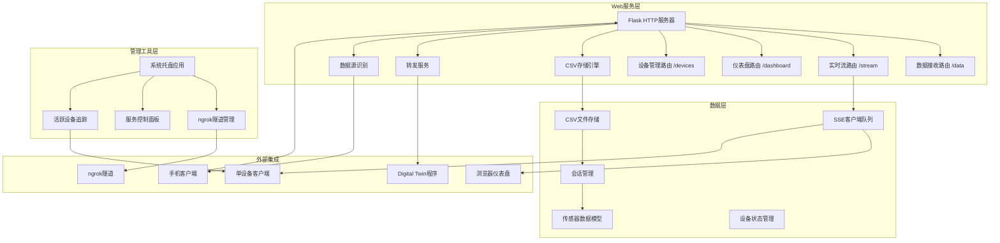

**图表来源**
- [server.py:12-237](file://scripts/server.py#L12-L237)
- [server.py:87-180](file://scripts/server.py#L87-L180)

**章节来源**
- [README.md:140-160](file://README.md#L140-L160)
- [mkdocs.yml:1-115](file://mkdocs.yml#L1-L115)

## 核心组件

### Flask Web服务核心

系统的核心是基于Flask的HTTP服务器，提供RESTful API接口来接收传感器数据。

**主要特性：**
- HTTP POST /data 端点处理传感器数据
- Server-Sent Events (SSE) /stream 实时数据流
- HTML /dashboard 实时可视化仪表盘
- 多线程异步数据转发
- CSV文件自动存储
- 会话级别的数据管理
- 错误处理和日志记录
- 数据源自动识别
- 单设备支持和管理

**章节来源**
- [server.py:12-237](file://scripts/server.py#L12-L237)

### 实时数据流系统

**SSE端点实现：**
- /stream 端点支持Server-Sent Events协议
- 多客户端连接管理
- 数据降采样优化（100Hz → 20Hz）
- 心跳机制保持连接活跃
- 客户端队列管理和内存控制
- 设备和来源信息广播

**章节来源**
- [server.py:184-208](file://scripts/server.py#L184-L208)

### 仪表盘系统

**实时可视化功能：**
- /dashboard 端点提供HTML仪表盘
- 支持多种传感器类型的实时显示
- 自适应数据降采样算法
- 时间轴同步和坐标变换
- 浏览器兼容性优化
- 单设备切换和过滤
- 实时统计数据展示

**章节来源**
- [server.py:211-217](file://scripts/server.py#L211-L217)
- [dashboard.html:1-689](file://scripts/dashboard.html#L1-L689)

### 数据存储引擎

采用CSV文件格式进行数据持久化存储，按会话ID组织数据文件。

**存储策略：**
- 每个会话生成独立的CSV文件
- 自动创建数据目录
- 支持多种传感器数据格式
- 实时追加写入模式
- JSON序列化复杂数据结构
- 设备标识和来源信息记录

**章节来源**
- [server.py:42-73](file://scripts/server.py#L42-L73)

## 架构概览

系统采用分布式架构设计，包含多个相互协作的服务组件：

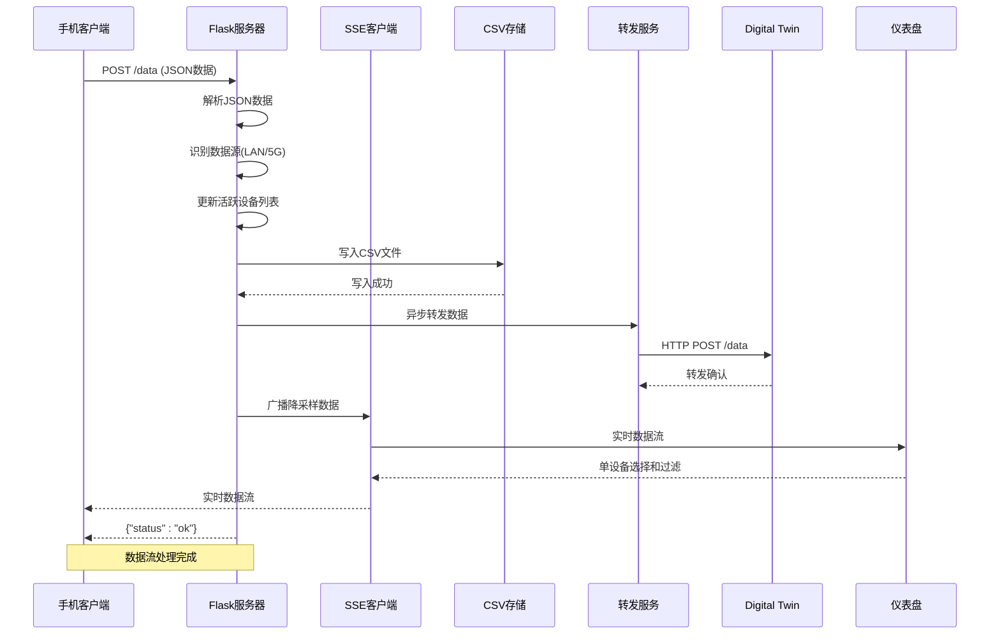

**图表来源**
- [server.py:36-85](file://scripts/server.py#L36-L85)

### 网络架构

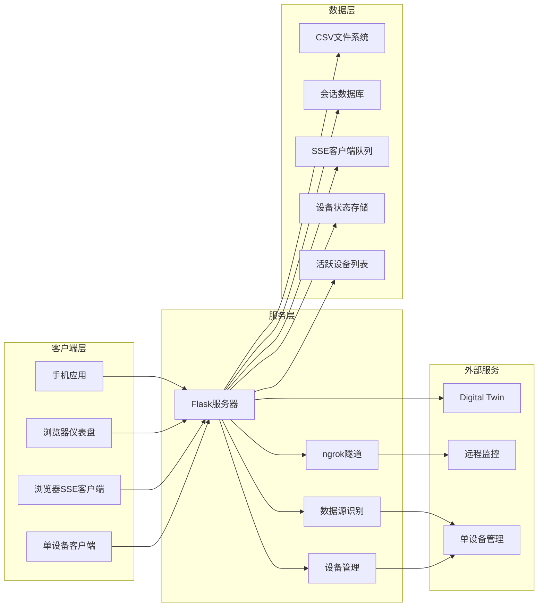

**图表来源**
- [server.py:16-18](file://scripts/server.py#L16-L18)
- [server.py:184-217](file://scripts/server.py#L184-L217)

## 详细组件分析

### HTTP POST /data 端点实现

#### 请求处理流程

```mermaid
flowchart TD
A[收到POST请求] --> B{验证请求格式}
B --> |有效| C[解析JSON数据]
B --> |无效| Z[返回400错误]
C --> D[提取会话和设备信息]
D --> E[识别数据源(LAN/5G)]
E --> F[更新活跃设备列表]
F --> G[确定CSV文件路径]
G --> H{文件是否存在}
H --> |不存在| I[创建新文件]
H --> |存在| J[追加模式写入]
I --> K[写入表头行]
J --> L[写入数据行]
K --> M[处理每个传感器数据项]
L --> M
M --> N[解析values字段]
N --> O[根据数据类型写入]
O --> P[更新统计信息]
P --> Q[启动异步转发]
Q --> R[启动SSE广播]
R --> S[广播设备和来源信息]
S --> T[返回成功响应]
Z --> U[错误处理]
```

**图表来源**
- [server.py:36-85](file://scripts/server.py#L36-L85)

#### 数据格式处理

系统支持多种传感器数据格式：

**数值型数据处理：**
- 直接数值：写入对应的x、y、z列
- 字典数据：提取特定键值（x/y/z或经纬度/海拔）
- 数组数据：序列化为JSON字符串存储

**章节来源**
- [server.py:51-73](file://scripts/server.py#L51-L73)

### CSV存储策略

#### 文件组织结构

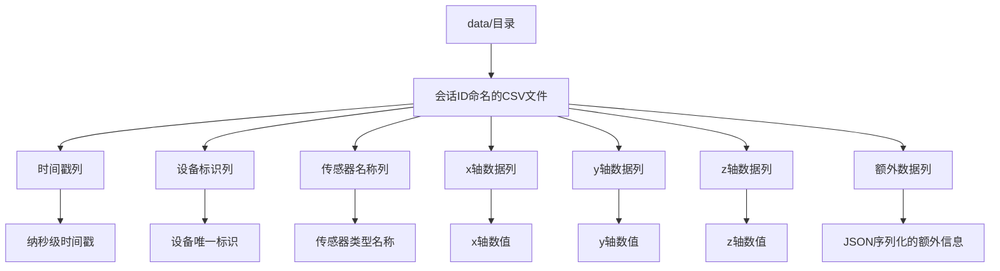

**图表来源**
- [server.py:49-50](file://scripts/server.py#L49-L50)
- [orientation_sample.csv:1-1](file://scripts/sample_data/orientation_sample.csv#L1-L1)

#### 数据写入优化

系统采用批量写入策略：
- 使用上下文管理器确保文件正确关闭
- 追加模式避免数据丢失
- 行缓冲减少磁盘I/O操作
- 自动创建缺失的CSV文件
- 设备标识和来源信息记录

**章节来源**
- [server.py:47-73](file://scripts/server.py#L47-L73)

### 转发机制实现

#### 异步转发架构

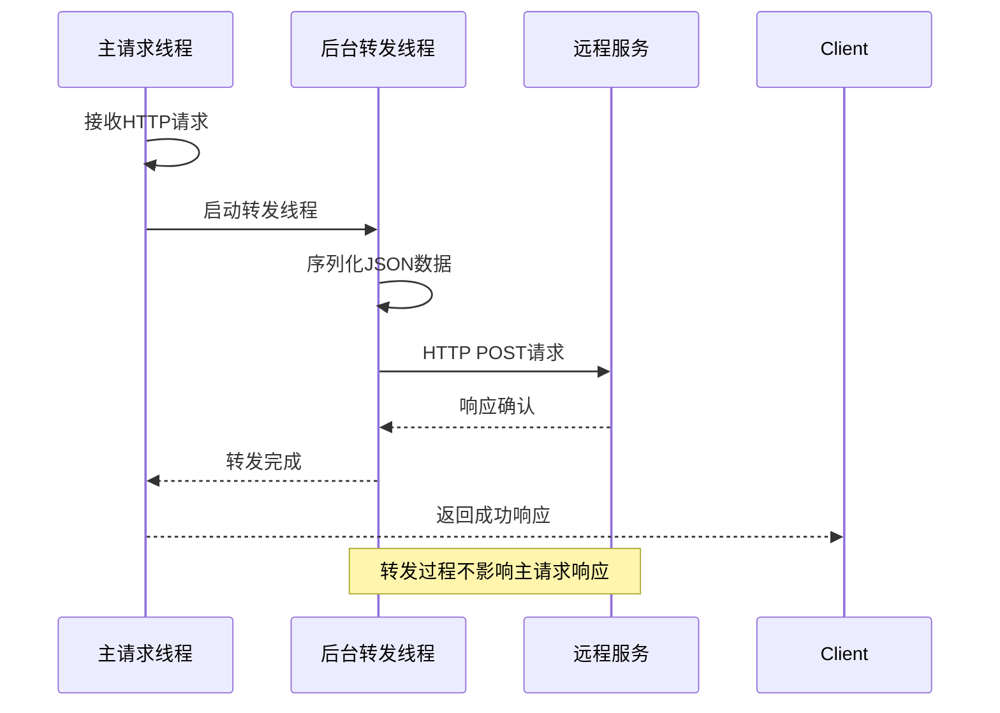

**图表来源**
- [server.py:24-34](file://scripts/server.py#L24-L34)
- [server.py:78-81](file://scripts/server.py#L78-L81)

#### 转发配置管理

系统提供灵活的转发配置：
- 可启用/禁用转发功能
- 支持自定义转发URL
- 超时控制和异常处理
- 后台线程执行避免阻塞

**章节来源**
- [server.py:16-18](file://scripts/server.py#L16-L18)
- [server.py:24-34](file://scripts/server.py#L24-L34)

### 会话管理

#### 会话标识符处理

系统使用会话ID作为数据文件的命名基础：
- 从请求数据中提取sessionId字段
- 默认值为"unknown"以防数据缺失
- 每个会话对应独立的数据文件
- 支持并发多会话数据收集

#### 数据隔离策略

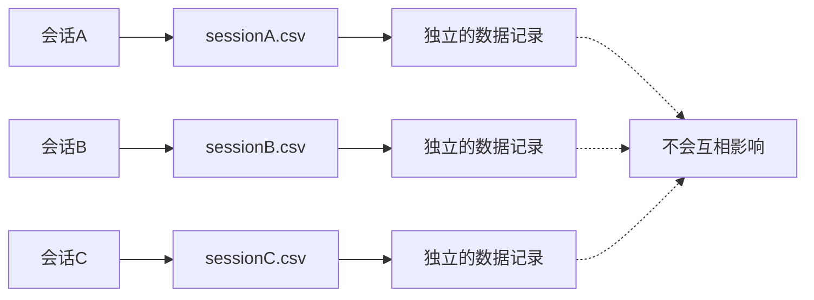

**图表来源**
- [server.py:39-44](file://scripts/server.py#L39-L44)

**章节来源**
- [server.py:39-44](file://scripts/server.py#L39-L44)

### 单线程处理

#### 线程安全设计

系统采用单线程架构：
- 主请求线程负责HTTP响应
- 转发操作在独立线程执行
- CSV写入使用文件锁机制
- 异常处理避免线程崩溃
- SSE客户端队列使用线程锁保护

#### 性能优化措施

- 后台线程设置为守护线程
- 转发操作超时控制（1秒）
- 异常静默处理避免影响主流程
- 文件I/O批量操作
- 客户端队列大小限制内存使用

**章节来源**
- [server.py:24-34](file://scripts/server.py#L24-L34)
- [server.py:78-81](file://scripts/server.py#L78-L81)

## 实时数据流系统

### Server-Sent Events (SSE) 实现

#### SSE端点架构

```mermaid
graph TD
A[/stream SSE端点] --> B[客户端连接管理]
B --> C[数据降采样]
C --> D[广播队列]
D --> E[心跳机制]
E --> F[连接维护]
F --> G[断开清理]
G --> H[设备和来源信息]
```

**图表来源**
- [server.py:184-208](file://scripts/server.py#L184-L208)

#### 客户端管理机制

系统实现了高效的数据流广播机制：

**客户端队列管理：**
- 每个SSE客户端对应一个独立队列
- 最大队列大小控制内存使用
- 自动清理断开的客户端连接
- 线程安全的队列操作

**降采样优化：**
- 默认100Hz采样率降采样至20Hz
- 基于步长采样的高效算法
- 时间基准统一（t0）
- 多传感器数据分组处理
- 设备和来源信息包含在广播数据中

**章节来源**
- [server.py:88-92](file://scripts/server.py#L88-L92)
- [server.py:184-208](file://scripts/server.py#L184-L208)

### 数据降采样和广播

#### 降采样算法

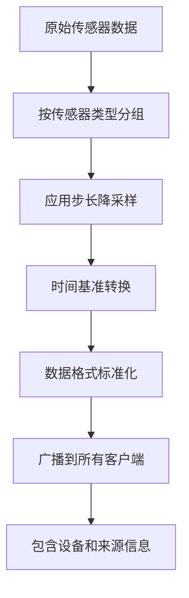

**图表来源**
- [server.py:117-179](file://scripts/server.py#L117-L179)

#### 特殊传感器处理

**XYZ传感器处理：**
- 加速度计、陀螺仪、重力传感器
- 直接提取x、y、z三个轴数据
- 四舍五入到小数点后4位

**方向传感器处理：**
- 方向传感器数据转换为角度
- 弧度转角度（乘以180/π）
- 四舍五入到小数点后2位

**未知传感器处理：**
- 通用数据格式处理
- 保留原始数据结构
- 时间轴同步处理

**章节来源**
- [server.py:140-176](file://scripts/server.py#L140-L176)

## 仪表盘系统

### 实时可视化实现

#### 仪表盘架构

```mermaid
graph TD
A[/dashboard端点] --> B[HTML模板加载]
B --> C[静态资源提供]
C --> D[WebSocket连接建立]
D --> E[实时数据接收]
E --> F[图表渲染]
F --> G[用户交互]
G --> H[设备管理]
H --> I[数据过滤]
I --> J[统计显示]
```

**图表来源**
- [server.py:211-217](file://scripts/server.py#L211-L217)

#### 仪表盘功能特性

**实时数据显示：**
- 多传感器数据同时展示
- 自适应缩放和滚动
- 实时刷新机制
- 历史数据回放支持
- 单设备切换和过滤

**用户交互：**
- 手动缩放和平移
- 数据过滤和选择
- 导出功能支持
- 响应式布局适配
- 设备选择器和来源显示

**数据处理：**
- 自动降采样优化性能
- 时间轴同步处理
- 内存使用控制
- 错误恢复机制
- 实时统计数据展示

**章节来源**
- [server.py:211-217](file://scripts/server.py#L211-L217)
- [dashboard.html:1-689](file://scripts/dashboard.html#L1-L689)

## 单设备管理模式

### 设备追踪和管理

#### 活跃设备追踪

系统实现了完整的单设备支持机制：

**设备状态管理：**
- 设备ID唯一标识
- 会话ID关联
- 最后连接时间记录
- 数据源类型标记（LAN/5G）
- IP地址记录

**超时管理：**
- 设备超时时间默认30秒
- 自动清理超时设备
- 状态实时更新
- 设备列表动态维护

**设备选择功能：**
- 仪表盘设备选择器
- 单设备过滤模式
- 来源显示（5G/LAN）
- 严格的数据过滤机制

**更新** 系统已从多设备显示模式迁移到严格的单设备选择机制，用户必须明确选择一个设备才能查看数据，提高了系统的专注性和易用性。

**章节来源**
- [server.py:131-136](file://scripts/server.py#L131-L136)
- [server.py:268-282](file://scripts/server.py#L268-L282)

### 设备管理API

#### /devices 端点实现

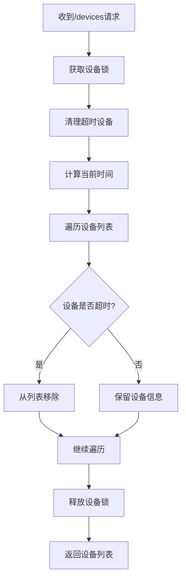

**图表来源**
- [server.py:268-282](file://scripts/server.py#L268-L282)

**章节来源**
- [server.py:268-282](file://scripts/server.py#L268-L282)

## 数据源识别系统

### 增强数据源识别

#### 数据源识别机制

系统实现了智能的数据源识别功能：

**识别规则：**
- 检查X-Forwarded-For头部
- 检查Host头部是否包含ngrok
- **新增** 检查User-Agent头部是否包含ngrok
- 检查客户端IP是否为私有网络地址
- 默认未知来源

**识别结果：**
- LAN：局域网连接（私有IP）
- 5G：公网连接（ngrok隧道）
- unknown：无法识别

**识别流程：**
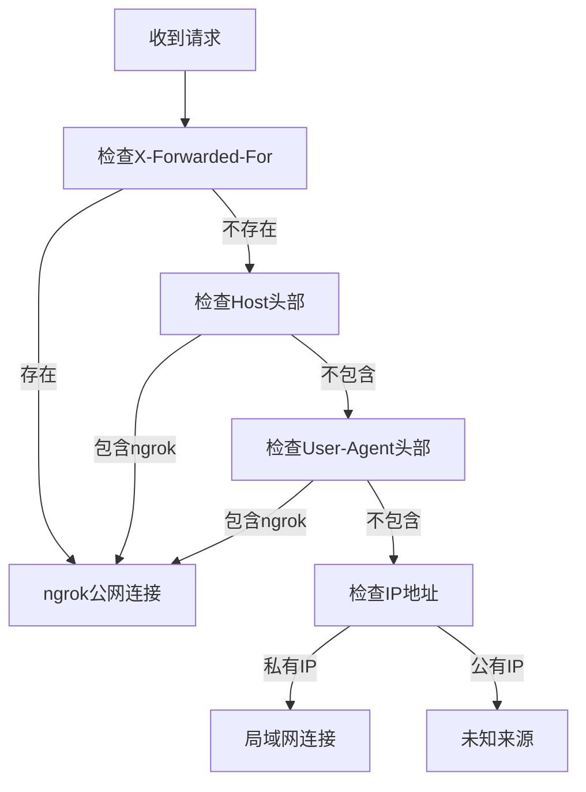

**图表来源**
- [server.py:36-61](file://scripts/server.py#L36-L61)

**更新** 数据源识别系统已增强，现在包含User-Agent检查来更准确地识别ngrok请求，提高了数据源分类的准确性。

**章节来源**
- [server.py:36-61](file://scripts/server.py#L36-L61)

## 依赖关系分析

### 外部依赖

系统依赖的关键库和组件：

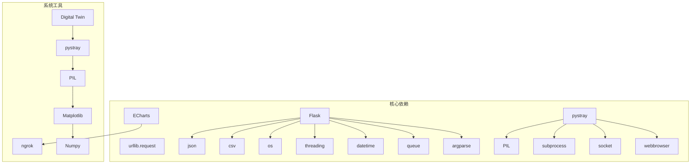

**图表来源**
- [server.py:12-13](file://scripts/server.py#L12-L13)
- [server.py:226-236](file://scripts/server.py#L226-L236)

### 内部模块依赖

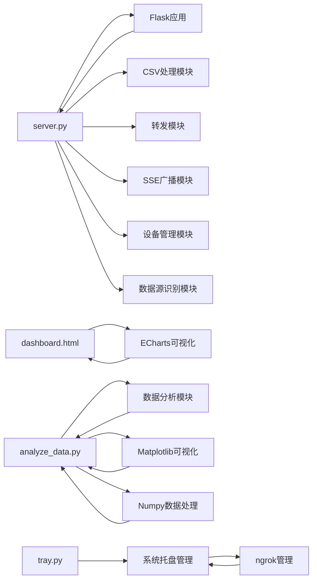

**图表来源**
- [server.py:21-23](file://scripts/server.py#L21-L23)
- [analyze_data.py:8-14](file://scripts/analyze_data.py#L8-L14)

**章节来源**
- [server.py:12-13](file://scripts/server.py#L12-L13)
- [analyze_data.py:8-14](file://scripts/analyze_data.py#L8-L14)

## 性能考虑

### 系统性能特征

#### 并发处理能力

系统设计支持高并发请求处理：
- 单线程HTTP服务器处理请求
- 异步转发避免阻塞主请求
- SSE客户端队列管理内存使用
- 文件I/O操作最小化
- 内存使用量可控
- 设备列表超时清理

#### 存储性能优化

- CSV文件采用追加模式写入
- 批量写入减少磁盘I/O
- 文件大小限制避免内存溢出
- 自动目录创建减少运行时开销
- JSON序列化优化复杂数据存储
- 设备信息和来源记录

#### 网络传输优化

- 转发请求设置1秒超时
- 异常静默处理提高稳定性
- 后台线程执行避免延迟
- SSE降采样优化带宽使用
- 心跳机制保持连接活跃
- 客户端队列大小限制

#### 实时数据流优化

- 客户端队列大小限制内存使用
- 步长降采样减少数据传输量
- 线程安全的广播机制
- 自动清理断开的客户端连接
- 时间基准统一处理
- 设备和来源信息广播

#### 单设备优化

- 设备超时时间30秒
- 自动清理超时设备
- 线程安全的设备列表
- 设备选择和过滤优化
- 实时统计数据缓存
- **新增** 严格的单设备数据过滤机制

### 性能监控指标

系统提供基本的性能监控：
- 请求处理时间统计
- 数据写入频率监控
- 转发成功率跟踪
- SSE客户端连接数统计
- 错误处理统计
- 活跃设备数量监控
- 数据源分布统计

**章节来源**
- [server.py:88-92](file://scripts/server.py#L88-L92)
- [server.py:117-179](file://scripts/server.py#L117-L179)

## 故障排除指南

### 常见问题及解决方案

#### 服务启动问题

**问题：端口被占用**
- 检查8000/8080端口是否被其他程序占用
- 修改服务端口配置
- 使用任务管理器结束占用进程

**问题：ngrok无法启动**
- 确认ngrok.exe文件存在
- 检查网络连接状态
- 验证authtoken配置

**问题：系统托盘程序无法启动**
- 检查Python依赖安装
- 确认pystray、PIL库可用
- 验证管理员权限

#### 数据存储问题

**问题：CSV文件无法创建**
- 检查data目录权限
- 确认磁盘空间充足
- 验证文件名合法性

**问题：数据写入失败**
- 检查文件锁定状态
- 确认磁盘写入权限
- 验证数据格式正确性

#### 实时数据流问题

**问题：SSE连接断开**
- 检查客户端网络连接
- 验证浏览器SSE支持
- 确认服务器端口开放

**问题：数据降采样异常**
- 检查传感器数据格式
- 验证时间戳格式正确性
- 确认内存使用情况

**问题：仪表盘无法显示数据**
- 检查SSE连接状态
- 验证设备选择器设置
- 确认浏览器JavaScript启用

#### 转发功能问题

**问题：数据转发失败**
- 检查目标服务可用性
- 验证网络连接状态
- 确认防火墙设置允许连接

**问题：设备管理异常**
- 检查设备超时设置
- 验证设备列表访问权限
- 确认线程安全机制

**问题：单设备模式问题**
- **新增** 确认设备选择器已正确选择设备
- 检查设备过滤逻辑是否正常工作
- 验证单设备数据流处理

### 调试工具

系统提供多种调试功能：
- 控制台输出详细的处理信息
- 日志记录请求和响应
- 错误堆栈跟踪
- 性能指标监控
- SSE客户端连接状态监控
- 设备状态监控
- 数据源识别调试输出

**章节来源**
- [server.py:75](file://scripts/server.py#L75)
- [server.py:191-204](file://scripts/server.py#L191-L204)

## 结论

该Web服务架构项目展示了现代传感器数据采集系统的最佳实践。系统采用模块化设计，提供了完整的数据采集、存储、实时可视化、单设备管理和转发功能。

**主要优势：**
- 简洁高效的Flask实现
- 用户友好的图形化管理界面
- 灵活的配置选项
- 稳定可靠的异步处理机制
- 完善的实时数据流支持
- 单线程异步处理
- 实时可视化仪表盘
- 单设备支持和管理
- 增强的数据源识别
- 完善的错误处理和监控

**技术特色：**
- 支持多种传感器数据格式
- 实时数据转发功能
- CSV文件自动存储
- ngrok公网穿透支持
- Server-Sent Events实时数据流
- HTML5实时可视化仪表盘
- 智能数据降采样算法
- 单客户端连接管理
- 活跃设备追踪和超时管理
- 增强的数据源自动识别（局域网/5G公网）
- **新增** 严格的单设备选择机制

该系统适用于教育、研究和工业应用等多种场景，为智能手机传感器数据的采集、分析、可视化和单设备管理提供了完整的解决方案。

## 附录

### API规范

#### HTTP端点定义

**POST /data**
- **功能**：接收传感器数据
- **请求格式**：JSON
- **响应格式**：JSON
- **状态码**：200 成功，400 请求格式错误
- **更新功能**：数据源识别、设备追踪、SSE广播、单设备过滤

**GET /stream**
- **功能**：建立Server-Sent Events连接
- **响应格式**：text/event-stream
- **状态码**：200
- **更新功能**：设备和来源信息广播、单设备数据过滤

**GET /dashboard**
- **功能**：提供实时可视化仪表盘
- **响应格式**：HTML
- **状态码**：200
- **更新功能**：单设备切换、实时统计、设备过滤

**GET /devices**
- **功能**：获取当前活跃设备列表
- **响应格式**：JSON
- **状态码**：200
- **更新功能**：设备超时管理、状态过滤

**GET /**
- **功能**：服务状态查询
- **响应格式**：HTML
- **状态码**：200

#### 请求示例

```json
{
    "sessionId": "abc123",
    "deviceId": "device001",
    "payload": [
        {
            "time": 1774665763092520000,
            "name": "accelerometer",
            "values": {
                "x": 0.123,
                "y": 0.456,
                "z": 0.789
            }
        }
    ]
}
```

#### 响应格式

```json
{
    "status": "ok"
}
```

#### 设备列表响应格式

```json
{
    "device001": {
        "session_id": "abc123",
        "last_seen": "2025-01-01T12:00:00",
        "source": "lan",
        "ip": "192.168.1.100"
    }
}
```

### 配置选项

#### 环境变量

系统支持以下配置选项：
- `FORWARD_URL`：转发目标URL
- `FORWARD_ENABLED`：是否启用转发功能
- `DATA_DIR`：数据存储目录

#### 服务配置

- **监听地址**：0.0.0.0
- **监听端口**：8000
- **超时设置**：1秒
- **日志级别**：INFO
- **SSE降采样步长**：5
- **最大SSE队列大小**：50
- **设备超时时间**：30秒

### 部署指南

#### 本地部署

1. 安装Python依赖包
2. 运行Flask服务器
3. 启动ngrok隧道（可选）
4. 配置手机客户端Push URL
5. 访问 /dashboard 查看实时数据
6. 使用 /devices 端点管理设备

#### 生产部署

1. 配置反向代理
2. 设置SSL证书
3. 配置负载均衡
4. 监控系统健康状态
5. 配置SSE连接池参数
6. 设置内存使用限制
7. 配置设备超时管理

### 数据分析工具

系统提供数据分析脚本：
- `scripts/analyze_data.py`：方向传感器数据分析
- 支持CSV文件读取和可视化
- 提供图表生成和统计分析
- 支持样本数据和自定义数据文件

### 系统托盘管理

系统提供图形化管理界面：
- `scripts/tray.py`：系统托盘管理程序
- 智能IP检测，避免VPN干扰
- 一键启动/停止服务
- ngrok隧道管理
- 设备状态监控
- Push URL复制功能

**章节来源**
- [analyze_data.py:1-98](file://scripts/analyze_data.py#L1-L98)
- [tray.py:1-334](file://scripts/tray.py#L1-L334)