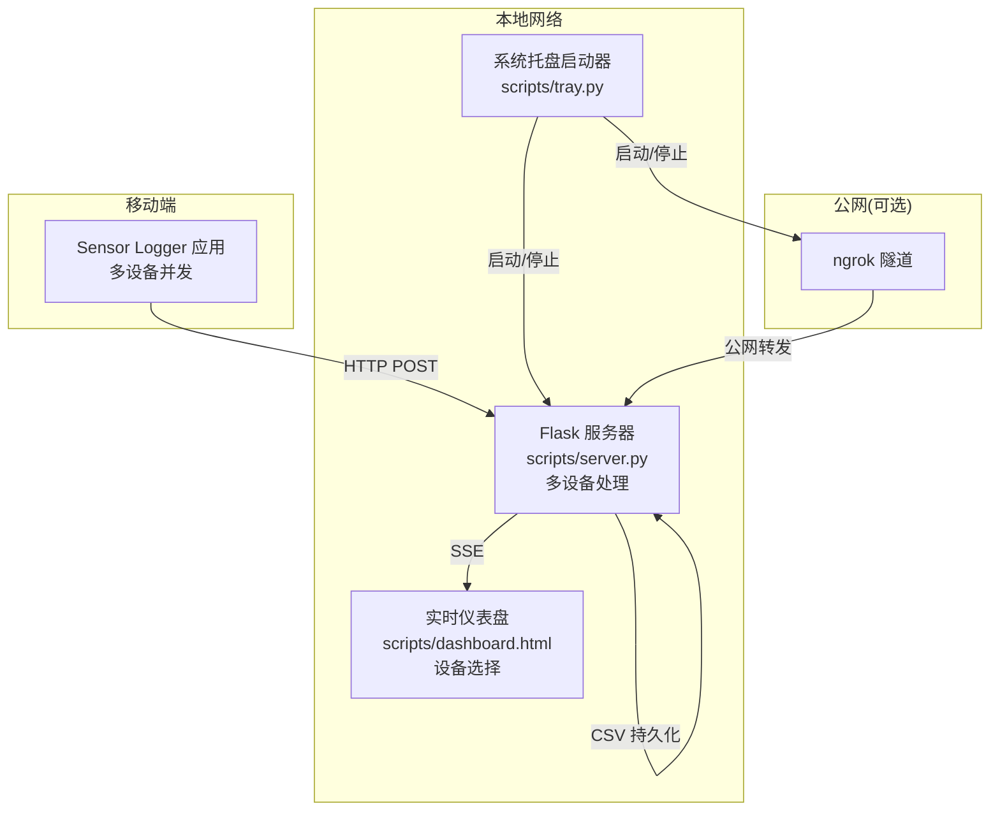
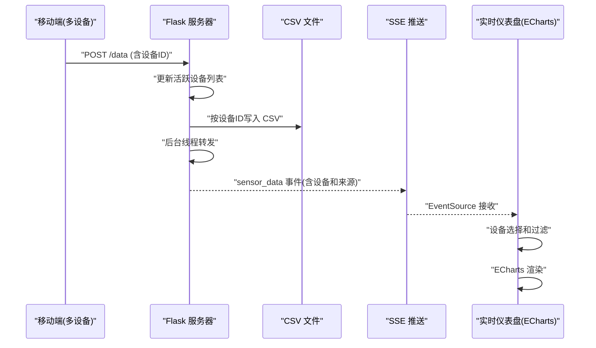
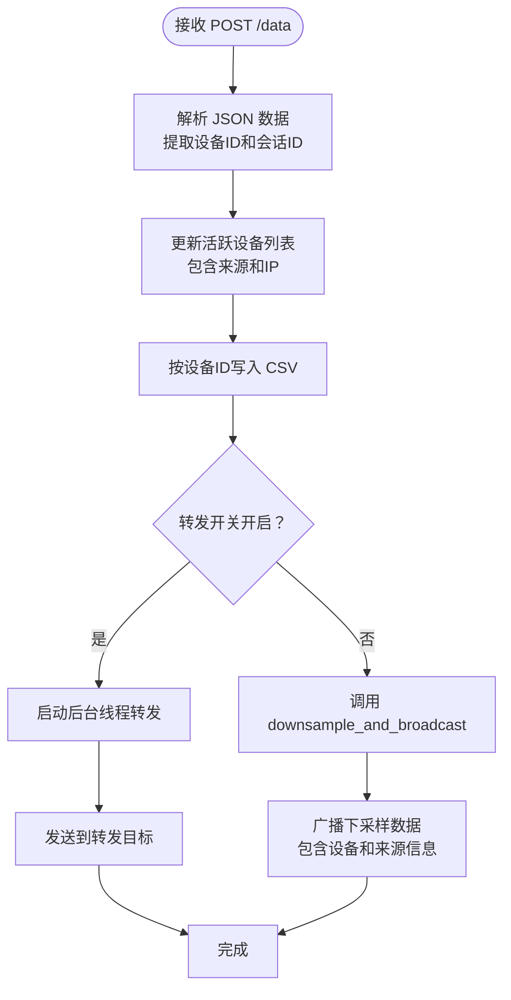
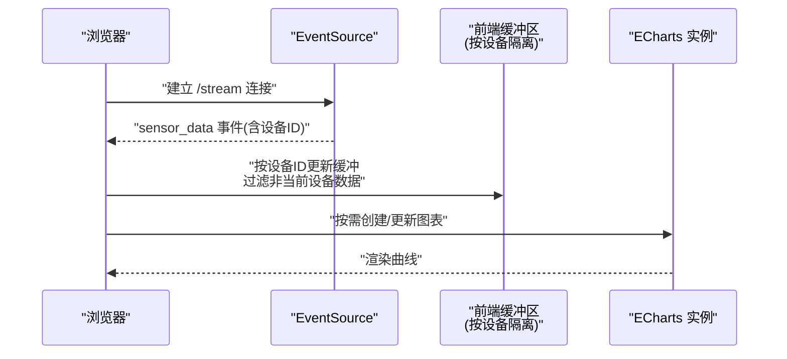
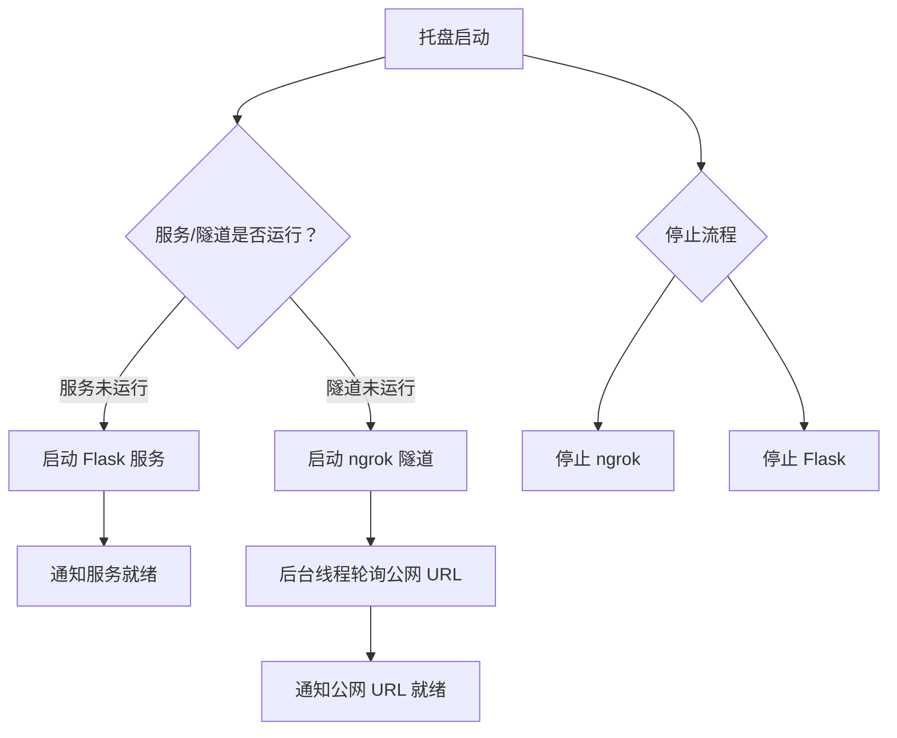
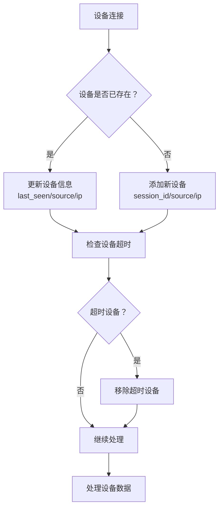
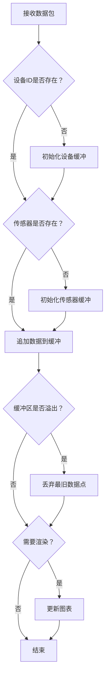
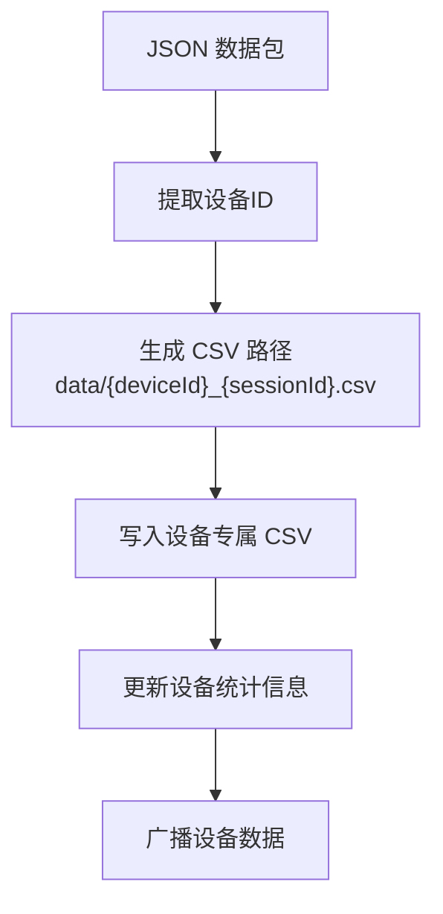
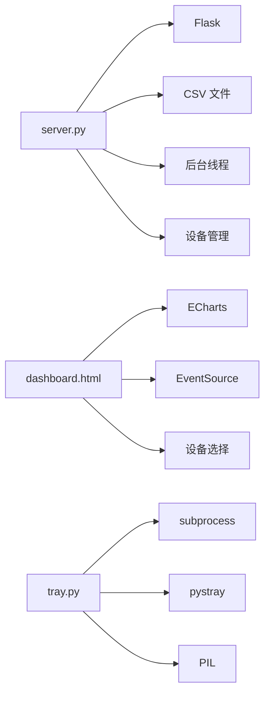

# 实时处理机制

<cite>
**本文引用的文件**
- [README.md](file://README.md)
- [server.py](file://scripts/server.py)
- [dashboard.html](file://scripts/dashboard.html)
- [tray.py](file://scripts/tray.py)
- [analyze_5g_data.py](file://scripts/analyze_5g_data.py)
</cite>

## 更新摘要
**变更内容**
- 增强了设备过滤逻辑，实现了更精确的单设备模式支持
- 改进了SSE数据处理的设备隔离机制
- 优化了前端设备选择和过滤功能
- 增强了实时监控与异常检测能力

## 目录
1. [引言](#引言)
2. [项目结构](#项目结构)
3. [核心组件](#核心组件)
4. [架构总览](#架构总览)
5. [详细组件分析](#详细组件分析)
6. [多设备并发处理机制](#多设备并发处理机制)
7. [智能数据缓冲系统](#智能数据缓冲系统)
8. [设备ID分离与管理](#设备id分离与管理)
9. [依赖关系分析](#依赖关系分析)
10. [性能考量](#性能考量)
11. [故障排除指南](#故障排除指南)
12. [结论](#结论)
13. [附录](#附录)

## 引言
本技术文档聚焦于"实时处理机制"，围绕多线程异步处理架构、后台转发线程、线程安全保证、WebSocket/Server-Sent Events（SSE）连接管理、实时数据推送与客户端连接维护、ECharts 可视化集成与渲染优化、实时监控与性能指标收集、异常检测、并发限制与资源管理、内存优化以及最佳实践与故障排除等方面展开。**本次更新重点介绍了增强的设备过滤逻辑和改进的SSE数据处理单设备模式支持**，帮助读者全面理解系统的实时数据链路与工程化实践。

## 项目结构
该项目采用"文档 + 交互演示 + 实时采集与可视化"的组合形态：
- 文档与教学资料位于 docs/，涵盖传感器原理、编程接口与实验实践
- 交互演示与实时仪表盘位于 scripts/dashboard.html
- 实时数据接收与转发服务位于 scripts/server.py
- 系统托盘一键启动器位于 scripts/tray.py
- 离线数据分析脚本位于 scripts/analyze_5g_data.py

**图表来源**
- [server.py:1-94](file://scripts/server.py#L1-L94)
- [dashboard.html:1-561](file://scripts/dashboard.html#L1-L561)
- [tray.py:1-276](file://scripts/tray.py#L1-L276)

**章节来源**
- [README.md:14-169](file://README.md#L14-L169)

## 核心组件
- **实时数据接收与持久化**：Flask 服务负责接收来自移动端的传感器数据，按设备ID写入 CSV 文件，并在必要时将数据转发给其他组件
- **实时仪表盘**：基于 ECharts 的前端页面，通过 SSE 接收实时数据并动态渲染，支持设备选择和过滤
- **系统托盘启动器**：提供一键启动/停止本地服务与 ngrok 隧道的能力
- **离线数据分析**：对 CSV 数据进行统计与可视化分析

**章节来源**
- [server.py:11-94](file://scripts/server.py#L11-L94)
- [dashboard.html:297-561](file://scripts/dashboard.html#L297-L561)
- [tray.py:18-276](file://scripts/tray.py#L18-L276)
- [analyze_5g_data.py:1-360](file://scripts/analyze_5g_data.py#L1-L360)

## 架构总览
系统采用"推送 + SSE + 托盘控制 + 多设备管理"的实时架构：
- 移动端通过 HTTP POST 将传感器数据推送到本地 Flask 服务，包含设备ID和会话ID
- Flask 服务在写入 CSV 的同时，通过后台线程将数据转发到其他组件
- 仪表盘通过 SSE 订阅实时数据流，ECharts 动态渲染曲线，支持设备选择
- 系统托盘统一管理本地服务与 ngrok 隧道，便于远程公网穿透
- **增强**：多设备并发处理，每个设备独立管理其数据流和缓冲，支持精确的设备过滤

**图表来源**
- [server.py:62-122](file://scripts/server.py#L62-L122)
- [dashboard.html:555-623](file://scripts/dashboard.html#L555-L623)

## 详细组件分析

### 组件A：Flask 实时接收与转发服务
- **处理流程**
  - 接收 POST /data，解析 JSON，提取 sessionId、deviceId 和 payload
  - 更新活跃设备列表，包含会话ID、最后可见时间、来源和IP
  - 按设备ID和会话ID写入 CSV 文件
  - 后台线程触发转发，避免阻塞主请求
  - **增强**：调用 downsample_and_broadcast 处理多设备数据，支持设备过滤
  - 返回成功状态

- **线程与并发**
  - 使用线程池风格的后台线程执行转发，主线程仅做 IO 与 CSV 写入
  - 转发线程设置为守护线程，随进程退出而终止
  - **增强**：设备级别的线程安全，使用 devices_lock 保护活跃设备列表

- **错误处理**
  - 转发异常静默忽略，确保主流程不受影响
  - **增强**：设备超时清理，自动移除长时间未活动的设备

- **性能与资源**
  - CSV 写入使用追加写，减少锁竞争
  - 转发线程短生命周期，避免长期持有资源
  - **增强**：设备超时时间为30秒，平衡资源占用和实时性

**图表来源**
- [server.py:62-122](file://scripts/server.py#L62-L122)
- [server.py:131-136](file://scripts/server.py#L131-L136)

**章节来源**
- [server.py:11-94](file://scripts/server.py#L11-L94)

### 组件B：实时仪表盘（ECharts + SSE）
- **连接管理**
  - 使用 EventSource 订阅 /stream，监听 sensor_data 事件
  - 连接状态通过点状指示器反馈，断线自动重连
  - **增强**：支持设备选择下拉菜单，可精确过滤特定设备数据

- **数据缓冲与渲染**
  - 前端维护每个设备的滑动缓冲区，最多保留固定数量点
  - **增强**：buffers[deviceId] 结构，实现设备级别的数据隔离
  - 首次收到数据时按需创建 ECharts 实例
  - 概览面板与详情面板分别更新，详情仅在可见时刷新
  - **增强**：设备过滤逻辑，只显示当前选中设备的数据，支持单设备模式

- **渲染优化**
  - 关闭动画，提升渲染性能
  - 按需 resize，窗口变化时同步调整图表尺寸
  - 主题切换时批量更新所有图表样式
  - **增强**：设备切换时清空图表数据，避免数据混淆

- **实时指标**
  - 显示原始采样速率、显示采样速率、总样本数、会话 ID、运行时长等
  - **增强**：当前设备显示、数据来源（局域网/5G）显示

**图表来源**
- [dashboard.html:555-623](file://scripts/dashboard.html#L555-L623)
- [dashboard.html:420-460](file://scripts/dashboard.html#L420-L460)

**章节来源**
- [dashboard.html:297-561](file://scripts/dashboard.html#L297-L561)

### 组件C：系统托盘启动器（一键启动/停止）
- **功能**
  - 启动/停止本地 Flask 服务
  - 启动/停止 ngrok 隧道，并自动探测公网 URL
  - 打开本地/公网仪表盘，复制 Push URL
- **线程与并发**
  - 使用子进程启动/停止服务与隧道
  - 后台线程轮询 ngrok API 获取公网 URL
- **错误处理**
  - 端口占用、ngrok 未找到、启动超时等情况给出通知
- **资源管理**
  - 子进程退出后释放资源，避免僵尸进程

**图表来源**
- [tray.py:48-119](file://scripts/tray.py#L48-L119)
- [tray.py:169-184](file://scripts/tray.py#L169-L184)

**章节来源**
- [tray.py:18-276](file://scripts/tray.py#L18-L276)

### 组件D：离线数据分析（统计与可视化）
- **功能**
  - 解析 CSV，按传感器类型分类
  - 计算每传感器的统计信息（均值、方差、范围等）
  - 生成多图谱：6 传感器总览、加速度计/陀螺仪细节、方向（欧拉角/四元数）分析、标定与未标定对比
- **性能**
  - 使用 NumPy/SciPy 进行高效数值计算
  - Matplotlib Agg 后端用于非 GUI 环境绘图

**章节来源**
- [analyze_5g_data.py:1-360](file://scripts/analyze_5g_data.py#L1-L360)

## 多设备并发处理机制

### 设备追踪与管理
系统实现了完整的多设备并发处理机制，支持同时处理多个设备的数据流：

- **活跃设备列表**
  - 使用 active_devices 字典跟踪所有活跃设备
  - 每个设备包含：session_id、last_seen、source、ip
  - 设备超时时间为30秒，自动清理长时间未活动的设备

- **设备来源识别**
  - 自动识别局域网(LAN)和5G/ngrok公网连接
  - 通过 X-Forwarded-For 头部和 Host 头部判断连接来源
  - 在日志中显示详细的来源信息

- **线程安全保证**
  - 使用 devices_lock 保护活跃设备列表的并发访问
  - 所有设备操作都在受保护的上下文中进行

**图表来源**
- [server.py:69-76](file://scripts/server.py#L69-L76)
- [server.py:268-281](file://scripts/server.py#L268-L281)

**章节来源**
- [server.py:131-136](file://scripts/server.py#L131-L136)
- [server.py:268-281](file://scripts/server.py#L268-L281)

### 设备数据广播
系统实现了智能的数据广播机制，支持多设备数据的独立处理：

- **数据分组**
  - 按传感器名称对数据进行分组
  - 每个传感器组独立进行下采样和处理

- **下采样策略**
  - DOWNSAMPLE_STRIDE = 5，从100Hz降采样到20Hz
  - 仅保留关键数据点，减少传输和渲染负载

- **时间基准**
  - 为每个会话确定 t0 基准时间
  - 所有时间戳相对于会话开始时间计算

- **数据格式标准化**
  - XYZ传感器：标准化为[t, x, y, z]格式
  - 方向传感器：角度转换为度数
  - 其他传感器：保持原始值格式

**章节来源**
- [server.py:160-227](file://scripts/server.py#L160-L227)

## 智能数据缓冲系统

### 前端缓冲架构
系统实现了智能的设备级别数据缓冲，支持高效的实时数据处理：

- **缓冲结构**
  - buffers[deviceId][sensorName] = {t: [], s0: [], s1: [], s2: []}
  - 每个设备维护独立的缓冲区，避免数据交叉污染
  - 每个传感器在设备级别也有独立缓冲

- **内存管理**
  - MAX_POINTS = 200，限制每个缓冲区的最大点数
  - 超出限制时自动丢弃最旧的数据点
  - 支持暂停/继续功能，清空或保留缓冲数据

- **设备过滤**
  - 支持"所有设备"和特定设备过滤模式
  - 当选择特定设备时，只显示该设备的数据
  - 设备切换时清空图表数据，避免历史数据干扰

**图表来源**
- [dashboard.html:582-620](file://scripts/dashboard.html#L582-L620)

**章节来源**
- [dashboard.html:320-335](file://scripts/dashboard.html#L320-L335)
- [dashboard.html:582-620](file://scripts/dashboard.html#L582-L620)

### 设备选择与过滤
系统提供了强大的设备选择功能：

- **设备选择下拉菜单**
  - 自动填充所有活跃设备
  - 显示设备来源标识（[LAN] 或 [5G]）
  - 支持"所有设备"模式和特定设备模式

- **实时过滤**
  - 设备切换时自动过滤数据
  - 清空当前图表数据，避免跨设备数据混淆
  - 更新统计信息显示当前设备和来源

- **状态管理**
  - knownDevices 存储设备元数据
  - currentDeviceId 跟踪当前活跃设备
  - 支持设备超时检测和清理

**章节来源**
- [dashboard.html:420-460](file://scripts/dashboard.html#L420-L460)
- [dashboard.html:566-575](file://scripts/dashboard.html#L566-L575)

## 设备ID分离与管理

### 数据分离策略
系统实现了完整的设备ID分离机制，确保多设备数据的独立性和安全性：

- **设备ID提取**
  - 从 JSON 数据中提取 deviceId 字段
  - 作为 CSV 文件名的一部分，实现数据物理分离
  - 在日志中显示设备ID，便于调试和监控

- **CSV 文件组织**
  - 每个设备生成独立的 CSV 文件
  - 文件名包含设备ID，便于识别和管理
  - 保持相同的 CSV 格式，便于统一处理

- **会话管理**
  - 每个设备可以有多个会话
  - sessionId 与设备ID共同标识数据
  - 支持设备级别的会话历史追踪

**图表来源**
- [server.py:65-66](file://scripts/server.py#L65-L66)
- [server.py:79](file://scripts/server.py#L79)

**章节来源**
- [server.py:65-66](file://scripts/server.py#L65-L66)
- [server.py:79](file://scripts/server.py#L79)

### 实时监控与API
系统提供了设备状态监控接口：

- **设备状态API**
  - GET /devices 返回活跃设备列表
  - 自动清理超时设备，保持列表准确性
  - 返回设备ID、会话ID、来源和最后可见时间

- **监控指标**
  - 设备总数统计
  - 设备来源分布（局域网 vs 公网）
  - 最近活动设备列表
  - 设备超时检测和清理

**章节来源**
- [server.py:268-281](file://scripts/server.py#L268-L281)

## 依赖关系分析
- **服务器依赖**
  - Flask：Web 框架，提供路由与 JSON 处理
  - CSV：数据持久化
  - 线程：后台转发
  - **增强**：设备管理：活跃设备追踪和超时清理

- **前端依赖**
  - ECharts：可视化渲染
  - EventSource：SSE 客户端
  - **增强**：设备选择：下拉菜单和过滤功能

- **托盘依赖**
  - subprocess：启动/停止子进程
  - pystray：系统托盘图标
  - PIL：图标绘制

**图表来源**
- [server.py:11-21](file://scripts/server.py#L11-L21)
- [dashboard.html:7](file://scripts/dashboard.html#L7)
- [tray.py:5-9](file://scripts/tray.py#L5-L9)

**章节来源**
- [server.py:11-21](file://scripts/server.py#L11-L21)
- [dashboard.html:7](file://scripts/dashboard.html#L7)
- [tray.py:5-9](file://scripts/tray.py#L5-L9)

## 性能考量
- **实时渲染优化**
  - ECharts 关闭动画，减少渲染开销
  - 按需创建图表，避免一次性初始化过多实例
  - 仅在可见面板更新详情图表，概览图表始终更新
  - 窗口大小变化时统一 resize，避免重复布局计算

- **数据缓冲与内存**
  - 前端使用滑动窗口缓冲，限制最大点数，防止内存无限增长
  - **增强**：设备级别的缓冲隔离，避免跨设备数据竞争
  - 仪表盘暂停时清空缓冲，恢复时重新渲染
  - **增强**：设备切换时清空图表数据，避免历史数据干扰

- **网络与 I/O**
  - CSV 追加写入，避免频繁截断
  - 转发线程短生命周期，避免阻塞主请求
  - **增强**：设备超时清理，释放不再使用的资源

- **CPU 与电池**
  - 前端定时器与渲染频率可控，避免过度刷新
  - 托盘提供一键停止能力，便于节能
  - **增强**：多设备并发处理的线程安全开销评估

## 故障排除指南
- **无法连接到 /stream**
  - 检查 Flask 服务是否运行
  - 确认浏览器与服务器在同一网络或公网 URL 正确
  - 查看控制台错误日志，确认 EventSource 是否抛错

- **仪表盘无数据**
  - 确认移动端已启用 HTTP Push 并正确填写 Push URL
  - 检查 CSV 是否正常写入，确认 data/ 目录权限
  - **增强**：检查设备ID是否正确传递，确认设备是否在活跃列表中

- **设备过滤无效**
  - 确认设备选择下拉菜单是否显示设备列表
  - 检查设备是否超过超时时间被清理
  - 验证设备ID格式是否正确

- **转发失败**
  - 检查转发目标地址与端口是否可达
  - 查看后台线程是否抛出异常（当前实现为静默忽略）

- **ngrok 启动失败**
  - 确认 ngrok.exe 存在且可执行
  - 检查 authtoken 配置与网络连通性
  - 查看托盘通知或日志中的超时提示

- **服务端口占用**
  - 托盘启动失败时会提示端口占用，关闭占用程序后重试

- **仪表盘主题/图表异常**
  - 刷新页面或切换主题后重试
  - 检查浏览器控制台是否有 ECharts 初始化错误

**章节来源**
- [server.py:23-33](file://scripts/server.py#L23-L33)
- [tray.py:48-74](file://scripts/tray.py#L48-L74)
- [tray.py:79-119](file://scripts/tray.py#L79-L119)
- [dashboard.html:512-525](file://scripts/dashboard.html#L512-L525)

## 结论
该系统通过 Flask 的轻量 Web 服务、EventSource 的 SSE 推送与 ECharts 的高效渲染，构建了完整的移动端传感器数据实时采集与可视化链路。**本次更新重点增强了多设备并发处理能力，实现了设备ID分离、智能数据缓冲和设备选择过滤等新功能**。托盘启动器简化了本地服务与公网穿透的运维流程。前端通过滑动窗口缓冲与按需渲染策略，兼顾了实时性与性能。**增强的设备过滤逻辑和SSE数据处理的单设备模式支持使得系统能够更精确地处理多设备数据流，提高了系统的实用性和扩展性**。整体设计在工程上具备良好的可维护性与扩展性，适合教学演示与实验实践场景。

## 附录

### 实时监控与异常检测要点
- **实时监控**
  - 原始采样速率：通过定时器统计一段时间内的样本增量，计算平均速率
  - 显示采样速率：前端固定刷新频率（如 20 Hz），用于 UI 呈现
  - 连接状态：EventSource 的 open/error 事件驱动 UI 状态更新
  - **增强**：设备状态监控：活跃设备数量、设备来源分布、设备超时情况

- **异常检测**
  - 传感器异常：可通过离线分析脚本对方向四元数范数进行检查，判断融合算法稳定性
  - 网络异常：EventSource error 事件触发自动重连与状态提示
  - 转发异常：后台线程异常静默处理，可在日志中观察
  - **增强**：设备异常检测：设备超时、设备切换异常、缓冲溢出

**章节来源**
- [dashboard.html:538-552](file://scripts/dashboard.html#L538-L552)
- [analyze_5g_data.py:118-123](file://scripts/analyze_5g_data.py#L118-L123)

### 并发处理限制与资源管理
- **并发限制**
  - 转发线程为单次短生命周期，避免并发队列堆积
  - EventSource 为单连接模型，避免多实例导致的重复渲染
  - **增强**：设备级别的线程安全，使用 devices_lock 保护共享资源

- **资源管理**
  - 前端缓冲区上限控制内存占用
  - 托盘子进程退出后释放资源，避免僵尸进程
  - CSV 写入使用追加模式，减少锁竞争
  - **增强**：设备超时清理，释放不再使用的资源
  - **增强**：设备缓冲区的自动清理和内存回收

**章节来源**
- [server.py:23-33](file://scripts/server.py#L23-L33)
- [dashboard.html:315](file://scripts/dashboard.html#L315)
- [tray.py:48-74](file://scripts/tray.py#L48-L74)

### 最佳实践
- **采样与推送**
  - 移动端建议合理设置采样率与批处理周期，平衡实时性与功耗
  - **增强**：多设备场景下建议使用稳定的设备ID，便于数据追踪

- **前端渲染**
  - 控制图表数量与刷新频率，避免过度渲染
  - 使用滑动窗口缓冲，限制内存占用
  - **增强**：设备选择时注意数据过滤，避免跨设备数据混淆

- **服务端**
  - 保持转发线程短生命周期，避免阻塞主请求
  - 确保 CSV 写入路径存在且可写
  - **增强**：定期检查设备超时，清理不再使用的设备信息

- **运维**
  - 使用托盘一键启动/停止，便于调试与节能
  - 公网穿透时注意 URL 变更与流量限制
  - **增强**：监控设备状态，及时发现和处理设备异常