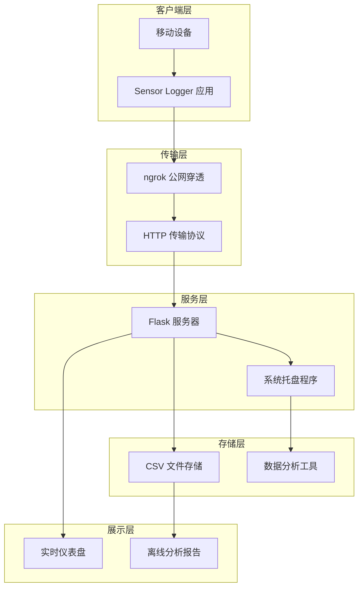
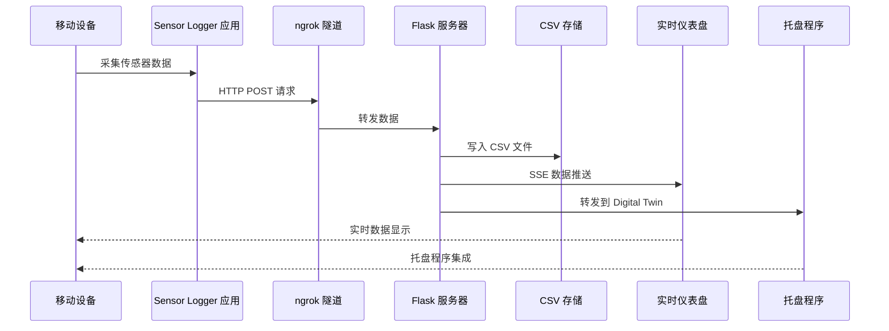
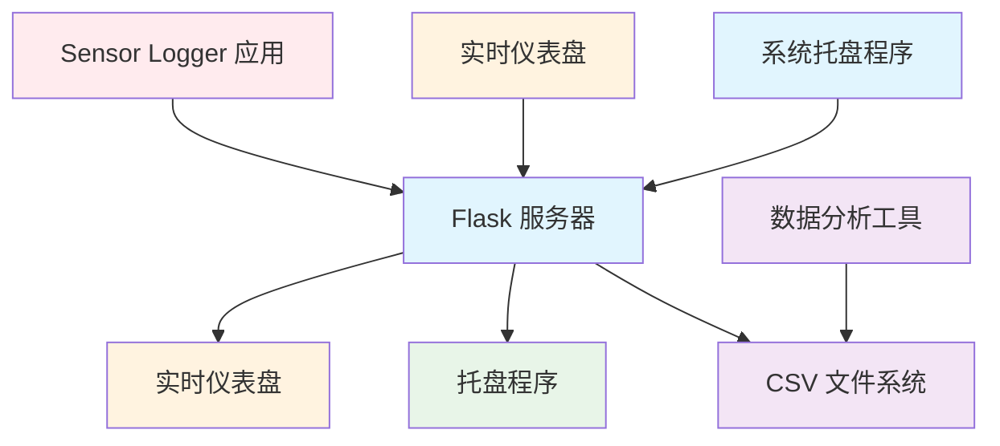

# 数据流设计

<cite>
**本文档引用的文件**
- [README.md](file://README.md)
- [server.py](file://scripts/server.py)
- [tray.py](file://scripts/tray.py)
- [dashboard.html](file://scripts/dashboard.html)
- [analyze_data.py](file://scripts/analyze_data.py)
- [analyze_5g_data.py](file://scripts/analyze_5g_data.py)
- [sensor-logger.md](file://docs/practice/sensor-logger.md)
- [orientation_sample.csv](file://scripts/sample_data/orientation_sample.csv)
</cite>

## 目录
1. [引言](#引言)
2. [项目结构](#项目结构)
3. [核心组件](#核心组件)
4. [架构概览](#架构概览)
5. [详细组件分析](#详细组件分析)
6. [依赖关系分析](#依赖关系分析)
7. [性能考虑](#性能考虑)
8. [故障排除指南](#故障排除指南)
9. [结论](#结论)

## 引言

本项目是一个完整的移动端传感器数据采集和处理系统，实现了从移动设备到存储系统的完整数据路径。系统支持通过 ngrok 实现公网穿透，让 5G 手机能够将传感器数据实时推送到本地电脑，同时提供实时仪表盘展示和离线数据分析功能。

该系统的核心价值在于为高校教学和实验提供了一个完整的传感器数据采集解决方案，涵盖了从硬件原理到软件实现的全流程。

## 项目结构

项目采用模块化设计，主要包含以下核心组件：



**图表来源**
- [README.md:96-144](file://README.md#L96-L144)
- [server.py:1-10](file://scripts/server.py#L1-L10)

**章节来源**
- [README.md:18-55](file://README.md#L18-L55)

## 核心组件

### 1. Flask 数据接收服务

Flask 服务器作为数据接收的核心组件，负责处理来自移动设备的传感器数据推送。

**主要功能特性：**
- HTTP POST 接收传感器数据
- CSV 文件自动保存
- 实时数据转发到 Digital Twin 托盘程序
- 多传感器数据格式支持

**数据处理流程：**
1. 接收 JSON 格式的传感器数据
2. 解析 payload 数组中的各个传感器数据
3. 根据数据类型进行相应的字段提取和转换
4. 写入 CSV 文件并记录日志

**章节来源**
- [server.py:35-81](file://scripts/server.py#L35-L81)

### 2. 系统托盘管理程序

系统托盘程序提供了便捷的本地服务管理功能，支持一键启动/停止 Flask 服务器和 ngrok 隧道。

**核心功能：**
- 自动检测 ngrok 隧道状态
- 动态生成 Push URL
- 实时通知和状态显示
- 复制 URL 到剪贴板

**章节来源**
- [tray.py:18-276](file://scripts/tray.py#L18-L276)

### 3. 实时仪表盘

基于 ECharts 的实时数据可视化界面，提供多传感器数据的实时展示功能。

**主要特性：**
- 多传感器数据实时显示
- 支持加速度计、陀螺仪、重力、方向等传感器
- 可视化图表和统计数据
- 支持深色/浅色主题切换

**章节来源**
- [dashboard.html:141-295](file://scripts/dashboard.html#L141-L295)

### 4. 数据分析工具

提供多种数据分析脚本，支持离线数据处理和可视化。

**功能模块：**
- 基础数据分析脚本
- 5G 远程数据综合分析
- 多传感器数据可视化
- 统计报告生成

**章节来源**
- [analyze_data.py:1-98](file://scripts/analyze_data.py#L1-L98)
- [analyze_5g_data.py:1-360](file://scripts/analyze_5g_data.py#L1-L360)

## 架构概览

系统采用分层架构设计，确保了良好的可扩展性和维护性：



**图表来源**
- [sensor-logger.md:74-180](file://docs/practice/sensor-logger.md#L74-L180)
- [server.py:23-81](file://scripts/server.py#L23-L81)

## 详细组件分析

### 数据接收服务组件分析

#### HTTP 传输协议实现

系统采用标准的 HTTP POST 传输协议，确保了跨平台兼容性和易用性：

**协议特性：**
- 使用 JSON 格式传输数据
- 支持批量数据推送（每秒一次）
- 包含完整的传感器元数据
- 支持多种传感器类型

**数据格式规范：**
```json
{
  "messageId": 42,
  "sessionId": "a1b2c3d4-e5f6-7890",
  "deviceId": "iPhone-XYZ",
  "payload": [
    {
      "name": "accelerometer",
      "time": 1711526400000000000,
      "values": { "x": 0.023, "y": -0.981, "z": 0.045 }
    }
  ]
}
```

#### 数据存储策略

系统采用 CSV 文件存储策略，具有以下优势：

**存储结构：**
- 每个会话生成独立的 CSV 文件
- 文件名基于 sessionId 命名
- 自动创建 data/ 目录
- 支持增量写入模式

**CSV 文件格式：**
```
time_ns,device,sensor,x,y,z,extra
1774665763092520000,device-id,orientation,,,,"{""yaw"": -0.7976433638510612, ...}"
```

#### 实时数据转发机制

系统实现了双向数据流处理：

**转发流程：**
1. 接收原始数据
2. 同步写入 CSV 文件
3. 异步转发到 Digital Twin 托盘程序
4. 保持主请求不阻塞

**章节来源**
- [server.py:15-81](file://scripts/server.py#L15-L81)

### Digital Twin 托盘程序集成

#### WebSocket 连接处理

托盘程序通过 HTTP 请求与 Flask 服务器集成，实现了数据的无缝转发：

**集成特性：**
- 支持本地和远程连接
- 自动检测托盘程序状态
- 错误处理和重试机制
- 线程安全的数据转发

**章节来源**
- [server.py:23-33](file://scripts/server.py#L23-L33)

### 传感器数据格式规范

#### 序列化格式

系统支持多种数据序列化格式：

**JSON 格式：**
- 标准化的传感器数据结构
- 支持嵌套对象和数组
- 包含时间戳和设备信息
- 兼容性强，易于解析

**CSV 格式：**
- 标准的逗号分隔值格式
- 支持批量数据导入
- 兼容各种数据分析工具
- 轻量级存储方案

#### 时间戳处理

系统采用纳秒级时间戳，确保了高精度的时间同步：

**时间戳特性：**
- UTC 时间格式
- 纳秒精度（10^9）
- 支持时间序列分析
- 跨时区一致性

**章节来源**
- [sensor-logger.md:134-141](file://docs/practice/sensor-logger.md#L134-L141)

### 坐标系转换

#### 跨平台一致性设置

系统提供了统一的坐标系转换功能：

**转换规则：**
- 加速度单位统一为 m/s²
- 坐标系统一为 ENU（东-北-天）
- 支持 iOS 和 Android 平台
- 自动处理平台差异

**坐标系说明：**
- ENU 坐标系：东向为 X 轴正方向，北向为 Y 轴正方向，天向为 Z 轴正方向
- 符合国际标准，便于数据分析和比较
- 支持多传感器数据融合

**章节来源**
- [sensor-logger.md:420-431](file://docs/practice/sensor-logger.md#L420-L431)

## 依赖关系分析

系统采用松耦合的设计模式，各组件之间的依赖关系清晰明确：



**图表来源**
- [server.py:11-21](file://scripts/server.py#L11-L21)
- [tray.py:5-15](file://scripts/tray.py#L5-L15)

**章节来源**
- [server.py:11-21](file://scripts/server.py#L11-L21)
- [tray.py:5-15](file://scripts/tray.py#L5-L15)

## 性能考虑

### 数据流优化

系统在设计时充分考虑了性能优化：

**并发处理：**
- 使用多线程处理数据转发
- 非阻塞的主请求处理
- 异步文件写入操作
- 内存友好的数据缓冲

**存储优化：**
- 增量写入模式减少磁盘 I/O
- CSV 文件按会话分割便于管理
- 自动清理和压缩策略
- 支持大文件处理

**网络优化：**
- ngrok 隧道的智能重连机制
- HTTP 请求的超时和重试处理
- 数据压缩和传输优化
- 断线自动恢复

## 故障排除指南

### 常见问题及解决方案

#### ngrok 连接问题

**问题症状：**
- ngrok 启动超时
- 公网 URL 无法访问
- 推送数据失败

**解决步骤：**
1. 检查 ngrok 配置文件
2. 验证 authtoken 设置
3. 确认网络连接状态
4. 重启 ngrok 服务

#### Flask 服务器问题

**问题症状：**
- 服务器无法启动
- 端口被占用
- 数据接收异常

**解决步骤：**
1. 检查端口占用情况
2. 验证防火墙设置
3. 查看服务器日志
4. 重新启动服务

#### 数据存储问题

**问题症状：**
- CSV 文件写入失败
- 存储空间不足
- 文件损坏

**解决步骤：**
1. 检查磁盘空间
2. 验证目录权限
3. 清理旧数据文件
4. 重建存储目录

**章节来源**
- [tray.py:76-118](file://scripts/tray.py#L76-L118)
- [server.py:77-81](file://scripts/server.py#L77-L81)

## 结论

本数据流设计系统提供了一个完整、可靠的移动端传感器数据采集和处理解决方案。通过 ngrok 公网穿透技术，系统实现了跨网络的数据传输能力；通过标准化的数据格式和严格的存储策略，确保了数据的一致性和完整性；通过实时仪表盘和数据分析工具，为用户提供了直观的数据可视化和深入的分析能力。

系统的模块化设计和松耦合架构确保了良好的可扩展性和维护性，能够适应不同的应用场景和需求变化。无论是教学实验还是实际应用，该系统都能提供稳定可靠的数据流处理能力。

未来可以在以下方面进一步改进：
- 增强数据加密和安全机制
- 扩展更多的传感器类型支持
- 优化大数据量处理性能
- 增加云端数据存储选项