# 系统架构

<cite>
**本文档引用的文件**
- [README.md](file://README.md)
- [mkdocs.yml](file://mkdocs.yml)
- [server.py](file://scripts/server.py)
- [tray.py](file://scripts/tray.py)
- [dashboard.html](file://scripts/dashboard.html)
- [deploy.yml](file://.github/workflows/deploy.yml)
- [analyze_data.py](file://scripts/analyze_data.py)
- [analyze_5g_data.py](file://scripts/analyze_5g_data.py)
- [orientation_sample.csv](file://scripts/sample_data/orientation_sample.csv)
- [docs/index.md](file://docs/index.md)
- [docs/sensors/overview.md](file://docs/sensors/overview.md)
</cite>

## 目录
1. [项目概述](#项目概述)
2. [系统架构总览](#系统架构总览)
3. [核心组件分析](#核心组件分析)
4. [数据流与处理流程](#数据流与处理流程)
5. [部署架构与基础设施](#部署架构与基础设施)
6. [技术栈与依赖分析](#技术栈与依赖分析)
7. [安全与可靠性设计](#安全与可靠性设计)
8. [性能与可扩展性考虑](#性能与可扩展性考虑)
9. [监控与运维](#监控与运维)
10. [故障排查指南](#故障排查指南)
11. [总结](#总结)

## 项目概述

这是一个基于 Docs-as-Code 理念构建的智能手机传感器技术教学平台，采用 MkDocs + Material 主题，涵盖从硬件原理到编程实践的完整知识体系。项目不仅提供理论文档，还包含完整的传感器数据采集、处理和可视化系统。

该项目服务于高校教学，特别是传感器、物联网和移动开发相关课程，为学生和工程师提供了一个全面的移动传感器学习环境。

## 系统架构总览

系统采用分层架构设计，主要分为四个层次：

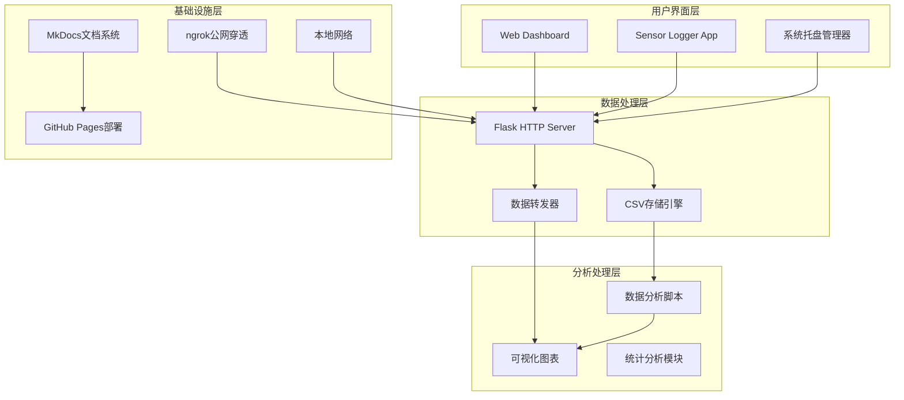

**架构图来源**
- [server.py:1-94](file://scripts/server.py#L1-L94)
- [tray.py:1-276](file://scripts/tray.py#L1-L276)
- [dashboard.html:1-561](file://scripts/dashboard.html#L1-L561)

## 核心组件分析

### 1. Web仪表盘系统

仪表盘采用现代化的前端架构，支持实时数据展示和主题切换：

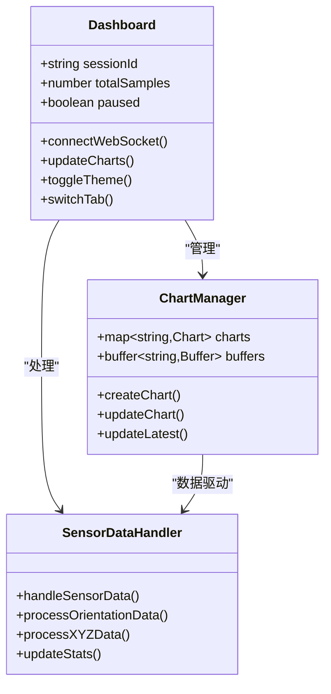

**图表来源**
- [dashboard.html:297-561](file://scripts/dashboard.html#L297-L561)

### 2. 数据采集与处理服务

数据采集系统采用Flask框架构建，支持HTTP POST接收和实时转发：

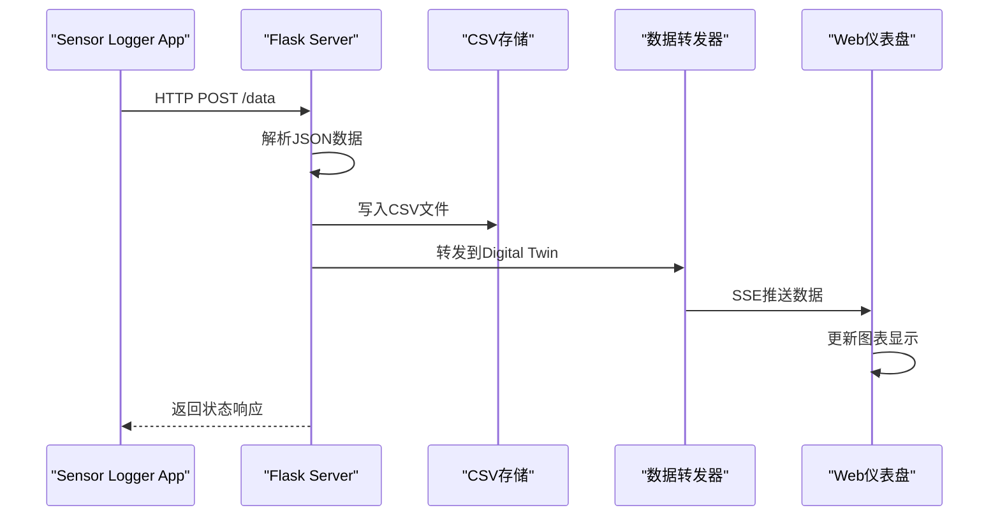

**序列图来源**
- [server.py:35-81](file://scripts/server.py#L35-L81)

### 3. 系统托盘管理器

系统托盘提供了便捷的本地服务管理功能：

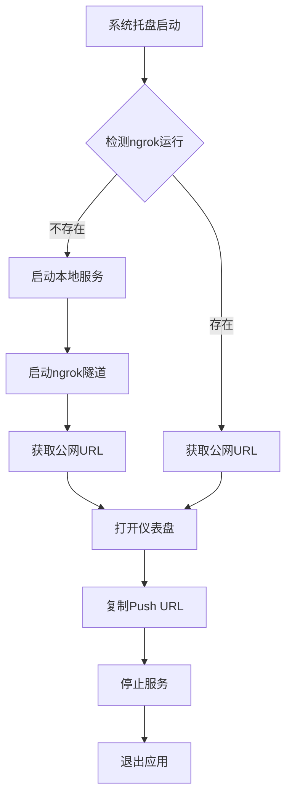

**流程图来源**
- [tray.py:169-187](file://scripts/tray.py#L169-L187)

**Section sources**
- [server.py:1-94](file://scripts/server.py#L1-L94)
- [tray.py:1-276](file://scripts/tray.py#L1-L276)
- [dashboard.html:1-561](file://scripts/dashboard.html#L1-L561)

## 数据流与处理流程

### 1. 传感器数据采集流程

系统支持多种数据采集模式：

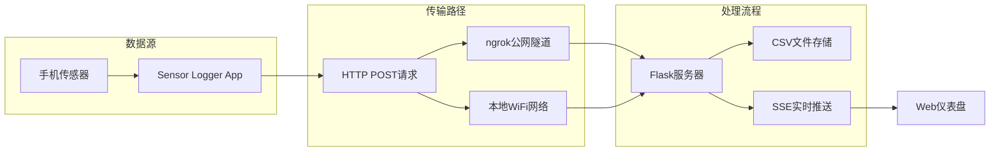

### 2. 数据存储格式

系统采用标准化的CSV格式存储传感器数据：

| 字段名 | 类型 | 描述 |
|--------|------|------|
| time_ns | string | 时间戳（纳秒） |
| device | string | 设备标识符 |
| sensor | string | 传感器类型 |
| x | string | X轴数值或空 |
| y | string | Y轴数值或空 |
| z | string | Z轴数值或空 |
| extra | string | JSON格式的额外数据 |

**Section sources**
- [server.py:41-72](file://scripts/server.py#L41-L72)
- [orientation_sample.csv:1-352](file://scripts/sample_data/orientation_sample.csv#L1-L352)

## 部署架构与基础设施

### 1. 文档系统部署

项目采用GitHub Actions自动化部署流程：

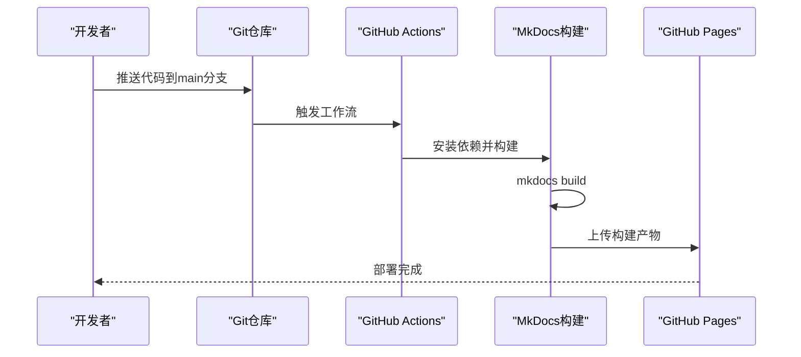

**图表来源**
- [.github/workflows/deploy.yml:1-45](file://.github/workflows/deploy.yml#L1-L45)

### 2. 数据处理环境

系统支持多种部署模式：

| 模式 | 网络要求 | 适用场景 | 优点 |
|------|----------|----------|------|
| 局域网模式 | 同一WiFi | 教室演示、实验室 | 低延迟、稳定可靠 |
| 5G公网模式 | 移动网络 | 远程教学、外勤演示 | 灵活便捷、不受地点限制 |
| 本地开发模式 | 本地网络 | 开发调试、批量分析 | 高性能、易维护 |

**Section sources**
- [.github/workflows/deploy.yml:17-45](file://.github/workflows/deploy.yml#L17-L45)
- [README.md:96-144](file://README.md#L96-L144)

## 技术栈与依赖分析

### 1. 前端技术栈

系统采用现代化的前端技术组合：

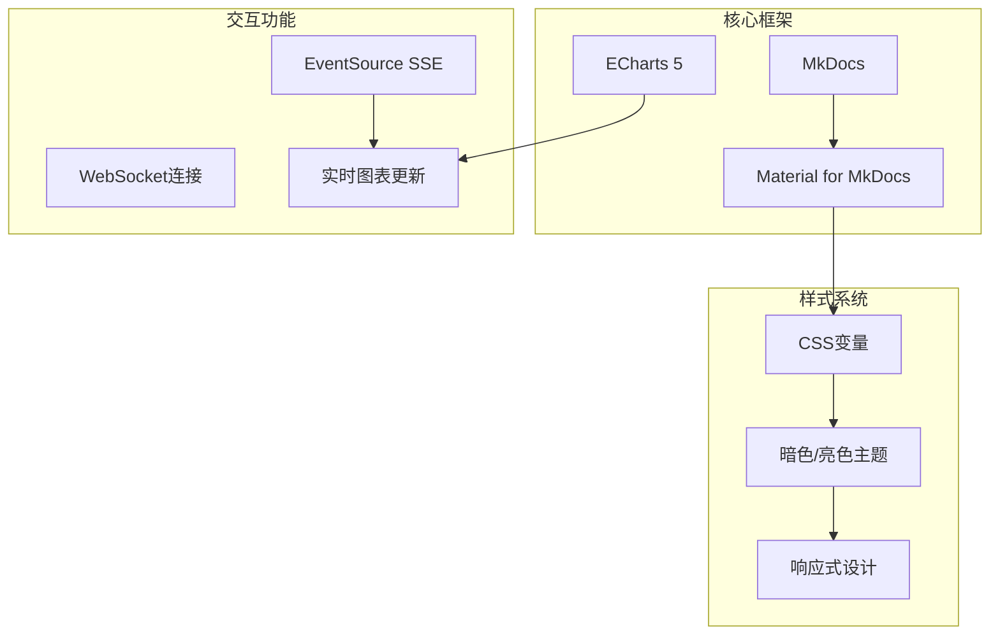

### 2. 后端技术栈

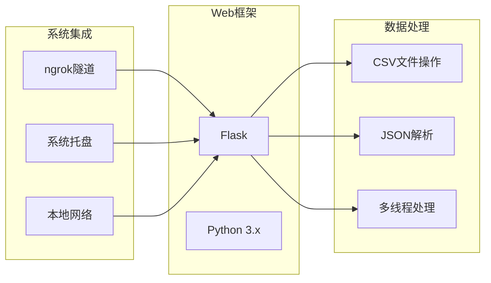

### 3. 数据分析工具链

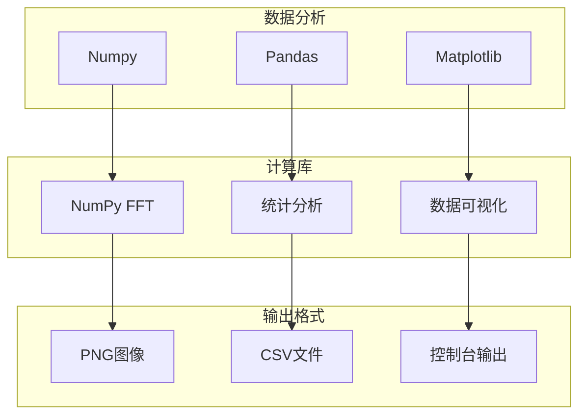

**Section sources**
- [mkdocs.yml:1-115](file://mkdocs.yml#L1-L115)
- [analyze_data.py:8-98](file://scripts/analyze_data.py#L8-L98)
- [analyze_5g_data.py:14-360](file://scripts/analyze_5g_data.py#L14-L360)

## 安全与可靠性设计

### 1. 网络安全策略

系统采用了多层次的安全防护机制：

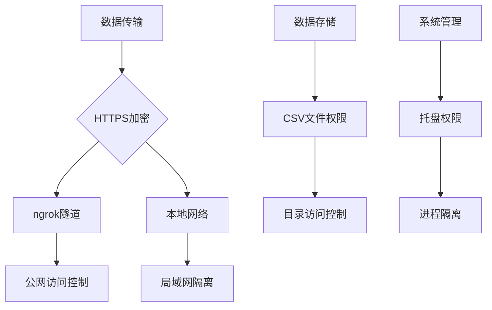

### 2. 数据完整性保障

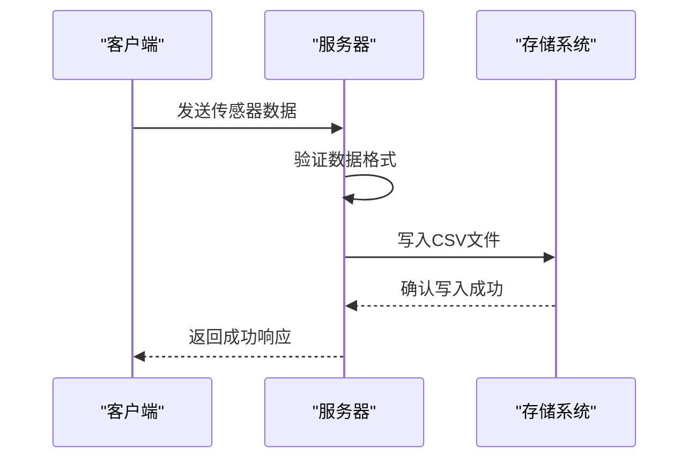

### 3. 系统可靠性设计

- **错误处理**: 所有网络请求都包含异常处理机制
- **数据备份**: CSV文件自动保存，支持断点续传
- **服务监控**: 系统托盘提供状态指示和日志输出
- **资源管理**: 线程池管理，避免内存泄漏

## 性能与可扩展性考虑

### 1. 性能优化策略

系统针对移动传感器数据的特点进行了专门优化：

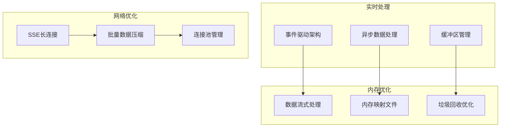

### 2. 可扩展性设计

- **模块化架构**: 各组件职责明确，易于独立扩展
- **插件化支持**: 可以轻松添加新的传感器类型支持
- **配置驱动**: 通过配置文件控制行为，无需修改代码
- **水平扩展**: 支持多实例部署，满足大规模数据处理需求

### 3. 资源使用优化

- **CPU优化**: 使用高效的NumPy库进行数值计算
- **内存管理**: 实现数据缓冲区的动态大小调整
- **网络优化**: 采用SSE减少HTTP请求开销
- **存储优化**: CSV文件按会话分割，便于管理和清理

## 监控与运维

### 1. 系统监控指标

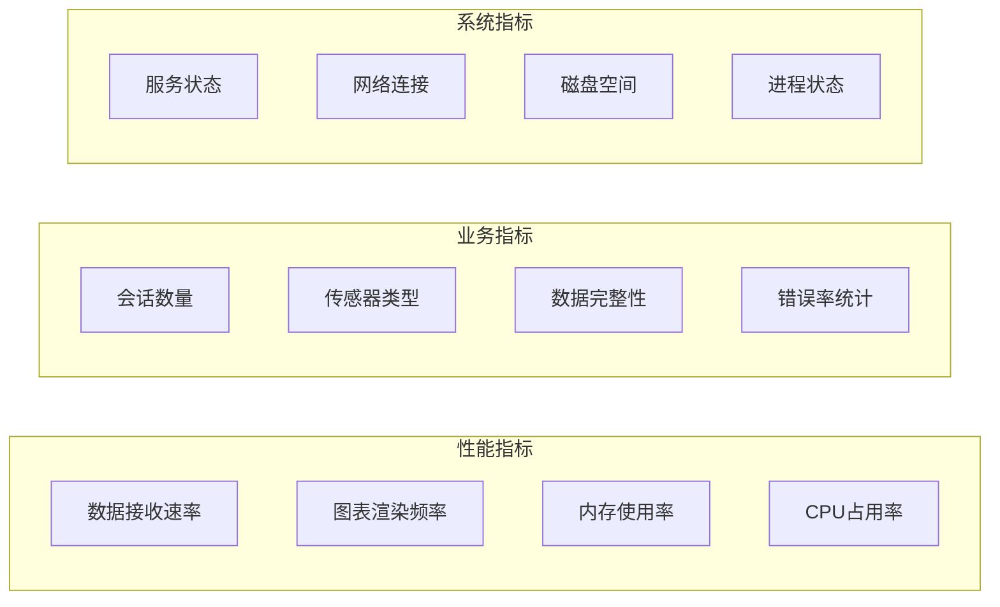

### 2. 运维工具

- **日志系统**: 详细的控制台日志输出
- **状态监控**: 系统托盘状态指示器
- **健康检查**: 自动化的服务可用性检测
- **告警机制**: 异常情况下的通知功能

### 3. 故障诊断工具

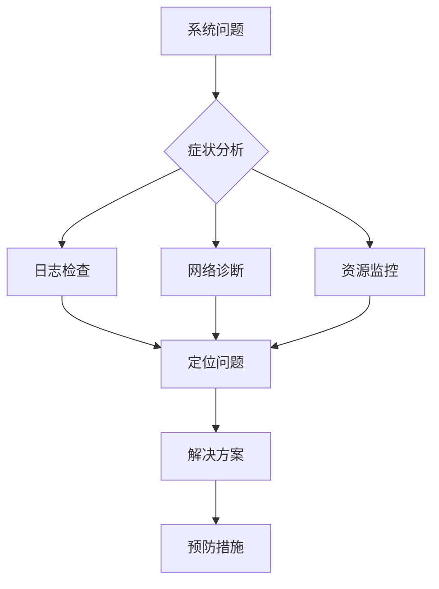

## 故障排查指南

### 1. 常见问题及解决方案

| 问题类型 | 症状描述 | 可能原因 | 解决方案 |
|----------|----------|----------|----------|
| 无法接收数据 | 仪表盘无数据显示 | 网络连接问题 | 检查ngrok状态，确认防火墙设置 |
| 数据丢失 | CSV文件为空 | 权限不足或路径错误 | 检查data目录权限，确认存储路径 |
| 图表不更新 | 实时图表卡顿 | 内存不足或CPU占用过高 | 关闭其他应用，重启服务 |
| 网络连接失败 | ngrok连接超时 | 网络不稳定或authtoken无效 | 检查网络连接，重新配置authtoken |

### 2. 调试工具

- **网络调试**: 使用curl命令测试HTTP接口
- **日志分析**: 查看Flask服务器日志输出
- **性能监控**: 监控系统资源使用情况
- **数据验证**: 检查CSV文件格式和完整性

### 3. 紧急处理流程

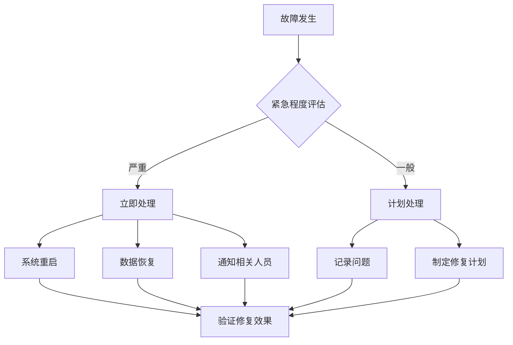

## 总结

本系统是一个功能完整、架构清晰的移动传感器教学平台，具有以下特点：

### 核心优势

1. **教学导向**: 完整覆盖从理论到实践的学习路径
2. **技术先进**: 采用现代化的技术栈和设计理念
3. **实用性强**: 提供真实可用的数据采集和分析工具
4. **易于扩展**: 模块化设计支持功能扩展和定制

### 技术特色

- **实时数据处理**: 支持传感器数据的实时采集和可视化
- **多模式部署**: 灵活适应不同的使用场景和网络环境
- **自动化运维**: GitHub Actions实现文档和系统的自动化部署
- **开放生态**: 基于开源技术，便于社区贡献和改进

### 应用价值

该系统为高校教学和科研提供了宝贵的实践平台，不仅帮助学生深入理解移动传感器技术，也为相关领域的研究和开发奠定了坚实基础。通过理论与实践相结合的方式，有效提升了教学质量和学习效果。