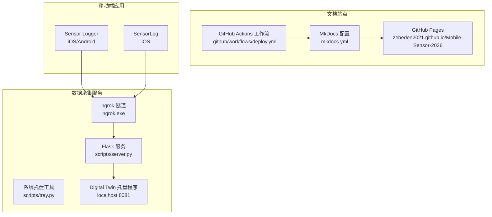
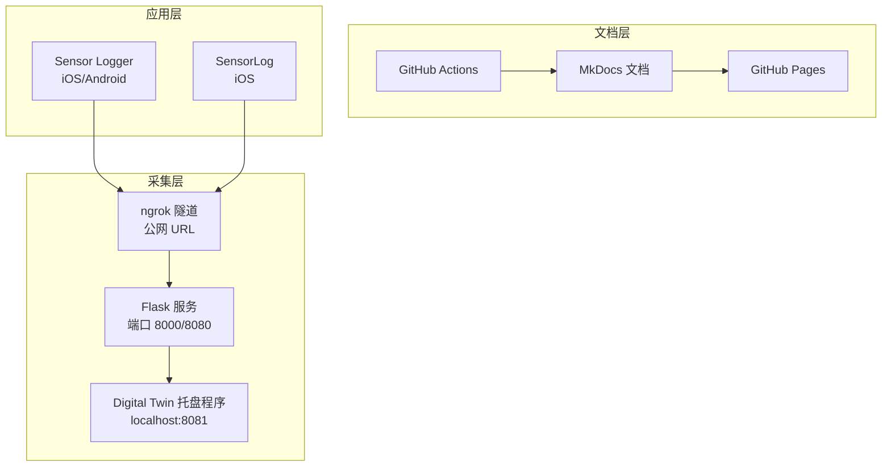
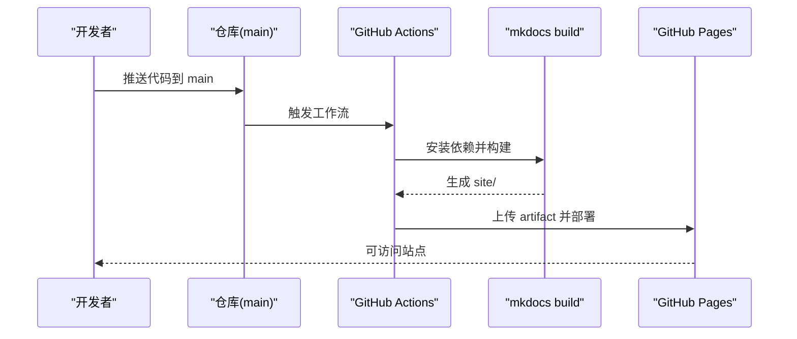
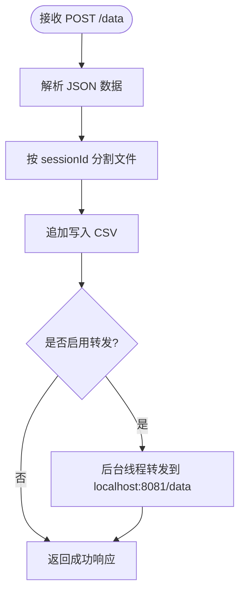
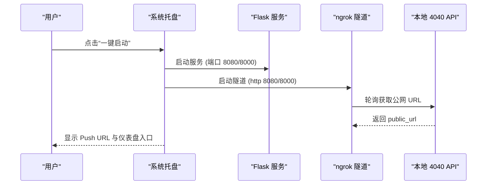
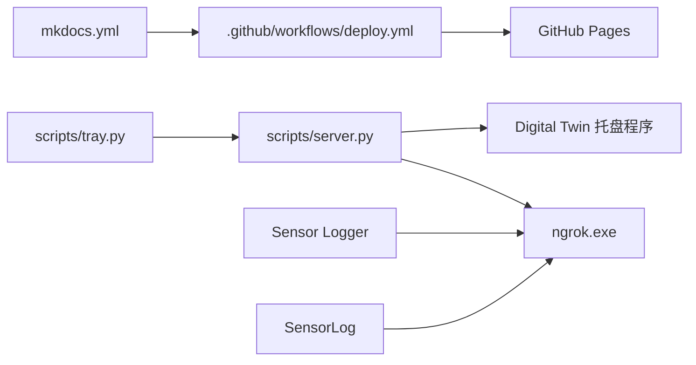

# 部署拓扑

<cite>
**本文引用的文件**
- [README.md](file://README.md)
- [.github/workflows/deploy.yml](file://.github/workflows/deploy.yml)
- [mkdocs.yml](file://mkdocs.yml)
- [scripts/server.py](file://scripts/server.py)
- [scripts/tray.py](file://scripts/tray.py)
- [docs/practice/sensor-logger.md](file://docs/practice/sensor-logger.md)
- [docs/practice/sensorlog.md](file://docs/practice/sensorlog.md)
</cite>

## 目录
1. [引言](#引言)
2. [项目结构](#项目结构)
3. [核心组件](#核心组件)
4. [架构总览](#架构总览)
5. [详细组件分析](#详细组件分析)
6. [依赖关系分析](#依赖关系分析)
7. [性能考量](#性能考量)
8. [故障排查指南](#故障排查指南)
9. [结论](#结论)
10. [附录](#附录)

## 引言
本文件面向部署拓扑与运维实践，聚焦于文档站点与传感器数据采集服务的部署架构、网络拓扑、组件分布、公网穿透（ngrok）、防火墙与端口映射策略、GitHub Actions 自动化部署流程、服务发现与负载均衡、高可用设计、容器化与 Kubernetes 集成建议、部署检查清单、环境配置与运维监控方案。文档基于仓库现有实现与文档进行系统化梳理，并提供可操作的落地建议。

## 项目结构
该项目由以下关键部分组成：
- 文档站点：MkDocs + Material 主题，通过 GitHub Actions 自动构建并部署到 GitHub Pages。
- 传感器数据采集服务：本地 Flask HTTP 服务，支持 ngrok 公网穿透；配套系统托盘工具一键启动服务与隧道。
- 文档与实践指南：包含 Sensor Logger 与 SensorLog 的数据上云方案、MQTT 架构与 Broker 选型、离线上传等。

图表来源
- [mkdocs.yml:1-115](file://mkdocs.yml#L1-L115)
- [.github/workflows/deploy.yml:1-45](file://.github/workflows/deploy.yml#L1-L45)
- [scripts/server.py:1-94](file://scripts/server.py#L1-L94)
- [scripts/tray.py:1-276](file://scripts/tray.py#L1-L276)
- [docs/practice/sensor-logger.md:1-468](file://docs/practice/sensor-logger.md#L1-L468)
- [docs/practice/sensorlog.md:1-412](file://docs/practice/sensorlog.md#L1-L412)

章节来源
- [README.md:1-169](file://README.md#L1-L169)
- [mkdocs.yml:1-115](file://mkdocs.yml#L1-L115)
- [.github/workflows/deploy.yml:1-45](file://.github/workflows/deploy.yml#L1-L45)
- [scripts/server.py:1-94](file://scripts/server.py#L1-L94)
- [scripts/tray.py:1-276](file://scripts/tray.py#L1-L276)
- [docs/practice/sensor-logger.md:1-468](file://docs/practice/sensor-logger.md#L1-L468)
- [docs/practice/sensorlog.md:1-412](file://docs/practice/sensorlog.md#L1-L412)

## 核心组件
- 文档站点与自动化部署
  - MkDocs + Material 主题，本地构建与 GitHub Pages 发布。
  - GitHub Actions 工作流在推送到 main 分支时自动构建并部署。
- 传感器数据采集服务
  - Flask HTTP 服务，接收来自移动端的传感器数据，支持 CSV 存储与转发到本地 Digital Twin 托盘程序。
  - 系统托盘工具统一管理服务与 ngrok 隧道，提供一键启动、URL 复制、仪表盘打开等功能。
- 公网穿透与网络拓扑
  - ngrok 免费版提供临时公网 URL，支持 5G/公网模式下手机推送数据。
  - 本地模式支持同 WiFi 下直连访问。
- 服务发现与负载均衡
  - 当前为单实例部署，建议在生产环境引入反向代理与负载均衡。
- 高可用性设计
  - 通过多副本、健康检查、自动重启与日志监控提升可用性。
- 容器化与 Kubernetes 集成
  - 提供容器化与编排建议，包括镜像构建、服务暴露、持久化与滚动更新。
- 运维监控
  - 日志聚合、指标采集、告警与可观测性建议。

章节来源
- [README.md:96-154](file://README.md#L96-L154)
- [scripts/server.py:11-94](file://scripts/server.py#L11-L94)
- [scripts/tray.py:5-276](file://scripts/tray.py#L5-L276)
- [docs/practice/sensor-logger.md:74-468](file://docs/practice/sensor-logger.md#L74-L468)
- [docs/practice/sensorlog.md:70-412](file://docs/practice/sensorlog.md#L70-L412)

## 架构总览
整体部署拓扑分为三层：
- 文档层：MkDocs 文档站点，通过 GitHub Actions 自动化构建与发布。
- 采集层：本地 Flask 服务与 ngrok 隧道，接收移动端推送并转发到本地可视化程序。
- 应用层：移动端 Sensor Logger/SensorLog，支持 HTTP POST、MQTT（WSS）与离线导出。

图表来源
- [README.md:96-154](file://README.md#L96-L154)
- [scripts/server.py:11-94](file://scripts/server.py#L11-L94)
- [scripts/tray.py:11-276](file://scripts/tray.py#L11-L276)
- [docs/practice/sensor-logger.md:74-468](file://docs/practice/sensor-logger.md#L74-L468)
- [docs/practice/sensorlog.md:70-412](file://docs/practice/sensorlog.md#L70-L412)

## 详细组件分析

### 文档站点与自动化部署
- 构建与发布流程
  - 本地安装 MkDocs 与 Material 主题后，执行构建命令生成静态站点。
  - GitHub Actions 在推送到 main 分支时自动安装依赖、构建站点并上传到 Pages。
- 站点配置
  - MkDocs 配置包含主题、语言、功能特性、导航、版权与数学公式支持等。
- 部署检查清单
  - 确认工作流权限与并发组设置正确。
  - 确认站点构建产物路径与 Pages 资源一致。

图表来源
- [.github/workflows/deploy.yml:17-44](file://.github/workflows/deploy.yml#L17-L44)
- [mkdocs.yml:1-115](file://mkdocs.yml#L1-L115)

章节来源
- [.github/workflows/deploy.yml:1-45](file://.github/workflows/deploy.yml#L1-L45)
- [mkdocs.yml:1-115](file://mkdocs.yml#L1-L115)
- [README.md:146-154](file://README.md#L146-L154)

### 传感器数据采集服务（Flask）
- 功能概述
  - 接收移动端推送的传感器数据，写入 CSV 文件，并可选转发到本地 Digital Twin 托盘程序。
  - 默认监听 8000 端口，支持通过配置切换端口。
- 数据处理
  - 解析 payload，按 sessionId 分割存储 CSV，兼容列表与字典形式的 values。
  - 转发采用后台线程，避免阻塞主请求。
- 端口与网络
  - 默认绑定 0.0.0.0:8000，便于公网访问。
  - 支持本地直连与 ngrok 公网穿透两种模式。

图表来源
- [scripts/server.py:35-81](file://scripts/server.py#L35-L81)

章节来源
- [scripts/server.py:11-94](file://scripts/server.py#L11-L94)
- [README.md:96-144](file://README.md#L96-L144)

### 系统托盘工具（一键启动服务与隧道）
- 功能特性
  - 自动检测本地 IP，生成 Push URL。
  - 一键启动/停止 Flask 服务与 ngrok 隧道。
  - 自动探测已存在的 ngrok 隧道，避免重复启动。
  - 提供打开本地/公网仪表盘、复制 Push URL 等便捷操作。
- 端口与进程管理
  - 默认端口 8080，支持动态端口传递。
  - 子进程管理，异常终止与超时处理。
- 网络与安全
  - 本地服务绑定 0.0.0.0，ngrok 通过本地 4040 端口 API 获取公网 URL。
  - 建议在生产环境限制来源 IP 与启用鉴权。

图表来源
- [scripts/tray.py:47-119](file://scripts/tray.py#L47-L119)
- [scripts/tray.py:169-184](file://scripts/tray.py#L169-L184)

章节来源
- [scripts/tray.py:1-276](file://scripts/tray.py#L1-L276)
- [README.md:100-129](file://README.md#L100-L129)

### 公网穿透（ngrok）与防火墙/端口映射
- ngrok 配置
  - 免费版每次启动分配新 URL，适合教学与测试。
  - 通过本地 4040 端口 API 获取公网 URL，支持自动探测与复制。
- 防火墙与端口映射
  - 本地服务监听 0.0.0.0，确保外部访问。
  - 若位于 NAT 后，需在路由器上做端口映射（8000/8080）并开放相应协议。
  - 建议在防火墙中放行对应端口，并限制来源 IP。
- 端口策略
  - 本地直连：8000/8080。
  - ngrok 隧道：本地 8080/8000 → 443（HTTPS），公网 URL 由 ngrok 分配。

章节来源
- [README.md:96-144](file://README.md#L96-L144)
- [scripts/tray.py:75-119](file://scripts/tray.py#L75-L119)

### 服务发现与负载均衡（建议）
- 当前状态
  - 单实例部署，无服务发现与负载均衡。
- 建议方案
  - 使用反向代理（Nginx/Haproxy）统一入口，结合健康检查与自动扩缩容。
  - 在 Kubernetes 中通过 Service/Ingress 暴露服务，利用 Deployment 管理副本数。
  - 对于 ngrok，建议在生产环境使用自有域名与证书，避免免费版 URL 变更带来的业务中断。

章节来源
- [docs/practice/sensor-logger.md:236-346](file://docs/practice/sensor-logger.md#L236-L346)
- [docs/practice/sensorlog.md:183-264](file://docs/practice/sensorlog.md#L183-L264)

### 高可用性设计（建议）
- 多副本与健康检查
  - 部署多个 Flask 实例，结合负载均衡器进行健康检查与故障转移。
- 自动重启与监控
  - 使用 systemd/docker restart policy 与日志聚合，配合告警系统。
- 数据持久化
  - 将 CSV 存储迁移至对象存储或数据库，避免单点故障。
- 配置管理
  - 将端口、转发地址、鉴权等配置集中管理，避免硬编码。

章节来源
- [scripts/server.py:15-18](file://scripts/server.py#L15-L18)
- [scripts/server.py:23-34](file://scripts/server.py#L23-L34)

### 容器化部署与 Kubernetes 集成（建议）
- 容器化
  - 基于 Python 基础镜像构建，安装依赖并暴露端口。
  - 使用 .dockerignore 排除不必要的文件，优化镜像体积。
- Kubernetes
  - 使用 Deployment 管理副本数与滚动更新。
  - 使用 Service 暴露 ClusterIP/NodePort/LoadBalancer。
  - 使用 ConfigMap/Secret 管理配置与密钥。
  - 使用 PersistentVolume/PersistentVolumeClaim 存储 CSV 或数据库。
  - 使用 Ingress 控制器统一入口与 TLS 终止。
- 部署策略
  - 蓝绿/金丝雀发布，结合 HPA/CPU/内存指标自动扩缩容。

章节来源
- [scripts/server.py:11-94](file://scripts/server.py#L11-L94)
- [mkdocs.yml:1-115](file://mkdocs.yml#L1-L115)

### 运维监控方案（建议）
- 日志
  - 使用 stdout/stderr 输出，结合日志收集器（如 Fluent Bit/Fluentd）统一采集。
- 指标
  - 暴露 Prometheus 指标端点，采集 CPU、内存、请求速率、错误率等。
- 告警
  - 基于阈值与异常模式触发告警，通知运维团队。
- 可观测性
  - 集成 APM（如 OpenTelemetry）与分布式链路追踪，定位性能瓶颈。

章节来源
- [scripts/server.py:74-75](file://scripts/server.py#L74-L75)
- [scripts/tray.py:40-46](file://scripts/tray.py#L40-L46)

## 依赖关系分析
- 文档站点
  - mkdocs.yml 定义站点元数据、主题与导航。
  - deploy.yml 定义自动化构建与发布流程。
- 数据采集服务
  - server.py 提供 HTTP 接口与数据处理逻辑。
  - tray.py 管理服务与隧道生命周期，提供用户交互入口。
- 移动端应用
  - Sensor Logger 与 SensorLog 支持 HTTP POST 与 MQTT（WSS）推送，文档提供详细的配置与架构说明。

图表来源
- [mkdocs.yml:1-115](file://mkdocs.yml#L1-L115)
- [.github/workflows/deploy.yml:1-45](file://.github/workflows/deploy.yml#L1-L45)
- [scripts/tray.py:13-15](file://scripts/tray.py#L13-L15)
- [scripts/server.py:16-17](file://scripts/server.py#L16-L17)
- [docs/practice/sensor-logger.md:74-468](file://docs/practice/sensor-logger.md#L74-L468)
- [docs/practice/sensorlog.md:70-412](file://docs/practice/sensorlog.md#L70-L412)

章节来源
- [mkdocs.yml:1-115](file://mkdocs.yml#L1-L115)
- [.github/workflows/deploy.yml:1-45](file://.github/workflows/deploy.yml#L1-L45)
- [scripts/server.py:11-94](file://scripts/server.py#L11-L94)
- [scripts/tray.py:1-276](file://scripts/tray.py#L1-L276)
- [docs/practice/sensor-logger.md:1-468](file://docs/practice/sensor-logger.md#L1-L468)
- [docs/practice/sensorlog.md:1-412](file://docs/practice/sensorlog.md#L1-L412)

## 性能考量
- 端口与并发
  - Flask 默认单进程，建议在生产环境使用 Gunicorn/Gevent/Uvicorn 等异步/多进程方案。
- 数据写入
  - CSV 追加写入为顺序 IO，建议在高并发场景引入缓冲队列与批量落盘。
- 转发性能
  - 转发采用后台线程，建议增加重试与熔断策略，避免阻塞主请求。
- 网络穿透
  - ngrok 免费版带宽与延迟有限，建议在生产环境使用自有域名与专用带宽。

章节来源
- [scripts/server.py:23-34](file://scripts/server.py#L23-L34)
- [scripts/server.py:77-81](file://scripts/server.py#L77-L81)
- [README.md:144-144](file://README.md#L144-L144)

## 故障排查指南
- 无法启动 Flask 服务
  - 检查端口占用与权限，确认 8000/8080 可用。
  - 查看托盘通知与日志输出。
- ngrok 启动失败
  - 检查 authtoken 是否配置正确，网络是否可达。
  - 通过本地 4040 API 探测公网 URL 是否返回。
- 推送数据失败
  - 确认移动端 Push URL 与服务端端口一致。
  - 检查 CSV 写入权限与目录是否存在。
- 仪表盘无法访问
  - 本地模式检查端口与浏览器访问路径。
  - 公网模式检查 ngrok URL 与防火墙放行。

章节来源
- [scripts/tray.py:48-74](file://scripts/tray.py#L48-L74)
- [scripts/tray.py:79-119](file://scripts/tray.py#L79-L119)
- [scripts/server.py:35-81](file://scripts/server.py#L35-L81)
- [README.md:130-134](file://README.md#L130-L134)

## 结论
本项目提供了完整的文档站点自动化部署与传感器数据采集服务的本地化方案。通过 ngrok 实现公网穿透，满足教学与测试场景下的实时数据采集需求。建议在生产环境中引入负载均衡、高可用与容器化/Kubernetes 编排，完善监控与告警体系，以提升稳定性与可维护性。

## 附录

### 部署检查清单
- 文档站点
  - 确认 MkDocs 依赖安装与构建命令可用。
  - 确认 GitHub Actions 权限与并发组设置。
- 采集服务
  - 确认端口 8000/8080 可用且防火墙放行。
  - 确认 CSV 目录存在且具备写权限。
  - 确认 Digital Twin 托盘程序端口 8081 可用。
- 公网穿透
  - 确认 ngrok.exe 存在且 authtoken 配置正确。
  - 确认本地 4040 API 可访问并能获取公网 URL。
- 安全加固
  - 限制来源 IP，启用鉴权与 HTTPS。
  - 生产环境使用自有域名与证书。

### 环境配置要点
- Python 运行时与依赖
  - Flask、Flask-CORS（如需跨域）、CSV/JSON 处理库。
- 系统托盘依赖
  - pystray、Pillow、pystray 依赖的 GUI 库。
- ngrok
  - 免费版 authtoken 配置，网络可达性。

### 运维监控建议
- 日志：stdout/stderr + 日志收集器。
- 指标：Prometheus 指标端点 + Grafana 可视化。
- 告警：阈值与异常模式告警。
- 可观测性：APM + 分布式链路追踪。

章节来源
- [scripts/server.py:11-94](file://scripts/server.py#L11-L94)
- [scripts/tray.py:5-276](file://scripts/tray.py#L5-L276)
- [README.md:96-154](file://README.md#L96-L154)