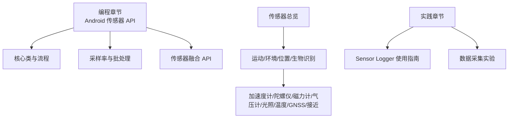
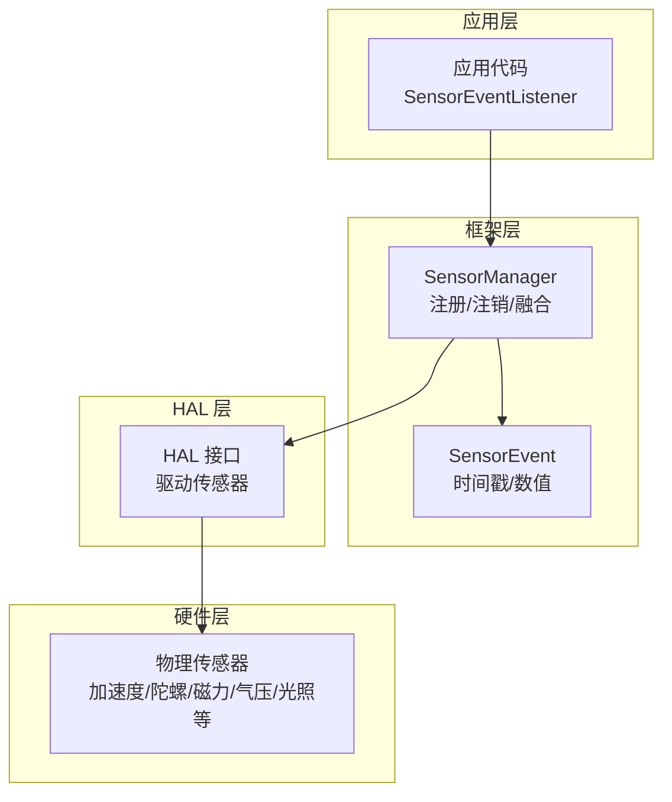
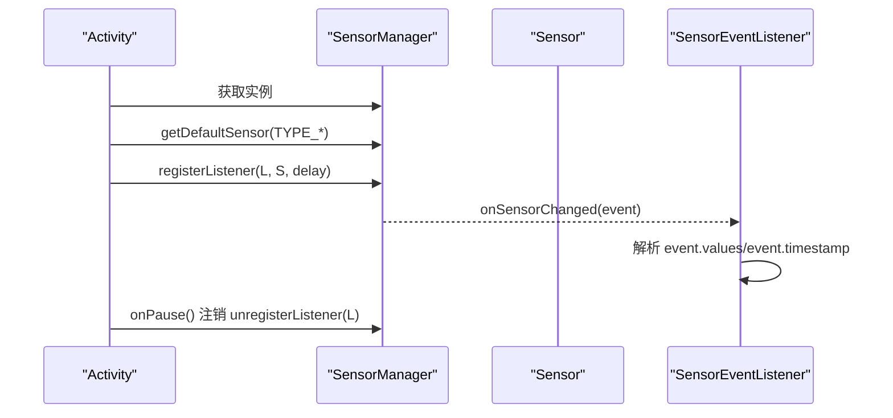
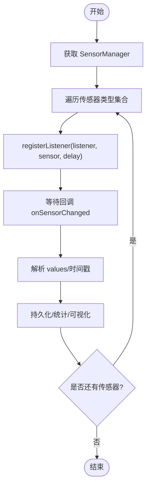
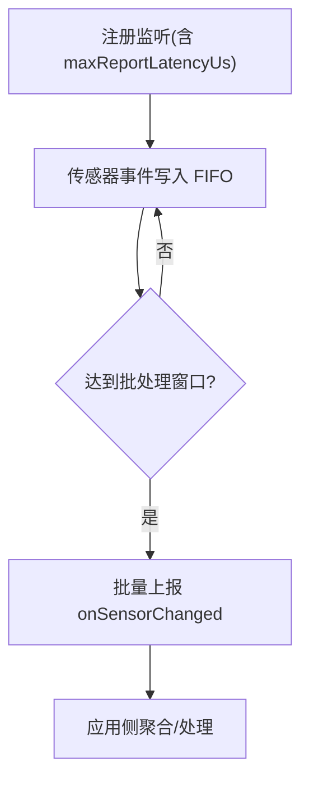
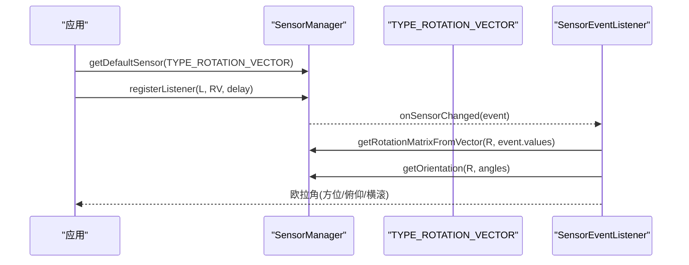
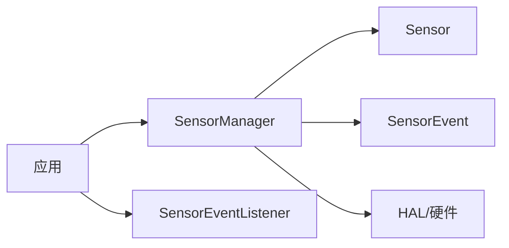

# Android 传感器 API

<cite>
**本文引用的文件**
- [README.md](file://README.md)
- [android.md](file://docs/programming/android.md)
- [overview.md](file://docs/sensors/overview.md)
- [accelerometer.md](file://docs/sensors/motion/accelerometer.md)
- [gyroscope.md](file://docs/sensors/motion/gyroscope.md)
- [magnetometer.md](file://docs/sensors/motion/magnetometer.md)
- [barometer.md](file://docs/sensors/environment/barometer.md)
- [light.md](file://docs/sensors/environment/light.md)
- [temperature.md](file://docs/sensors/environment/temperature.md)
- [gnss.md](file://docs/sensors/position/gnss.md)
- [proximity.md](file://docs/sensors/position/proximity.md)
- [sensor-logger.md](file://docs/practice/sensor-logger.md)
- [data-collection.md](file://docs/practice/data-collection.md)
</cite>

## 目录
1. [简介](#简介)
2. [项目结构](#项目结构)
3. [核心组件](#核心组件)
4. [架构总览](#架构总览)
5. [详细组件分析](#详细组件分析)
6. [依赖分析](#依赖分析)
7. [性能考虑](#性能考虑)
8. [故障排查指南](#故障排查指南)
9. [结论](#结论)
10. [附录](#附录)

## 简介
本文件围绕 Android 传感器 API 的核心使用与工程实践展开，系统讲解 SensorManager、Sensor、SensorEvent、SensorEventListener 的职责与协作方式；覆盖权限策略（含运行时权限与危险权限）、传感器注册/注销与数据处理流程；详解采样率选项与性能权衡；提供多传感器同时采集与批处理模式的实现要点；并给出常见传感器数据格式与传感器融合 API 的实际应用案例，帮助 Android 开发者高效、稳健地完成传感器数据采集与分析。

## 项目结构
本仓库为教学与实践导向的文档站点，Android 传感器 API 的权威说明集中在编程章节；传感器原理与融合在“传感器总览”和各类传感器专题中；实践部分提供数据采集与上云的参考方案。

**图表来源**
- [android.md:1-290](file://docs/programming/android.md#L1-L290)
- [overview.md:1-146](file://docs/sensors/overview.md#L1-L146)
- [sensor-logger.md:1-468](file://docs/practice/sensor-logger.md#L1-L468)
- [data-collection.md:1-192](file://docs/practice/data-collection.md#L1-L192)

**章节来源**
- [README.md:18-55](file://README.md#L18-L55)
- [android.md:1-290](file://docs/programming/android.md#L1-L290)
- [overview.md:1-146](file://docs/sensors/overview.md#L1-L146)

## 核心组件
- SensorManager：负责枚举传感器、注册/注销监听、计算旋转矩阵与方向角等。
- Sensor：描述一个物理或虚拟传感器（类型常量、名称、厂商、FIFO 容量等）。
- SensorEvent：携带传感器数据的时间戳与数值数组。
- SensorEventListener：回调接口，处理 onSensorChanged 与 onAccuracyChanged。

使用要点
- 在生命周期的 onResume 中注册监听，在 onPause 中注销，避免后台持续唤醒导致耗电。
- values 数组按传感器类型约定存放数据，如加速度计为 m/s²，陀螺仪为 rad/s，磁力计为 μT，气压为 hPa，光照为 lux。
- 虚拟传感器（如旋转矢量、线性加速度、重力）由系统融合生成，便于直接获取姿态与运动分量。

**章节来源**
- [android.md:10-18](file://docs/programming/android.md#L10-L18)
- [android.md:90-137](file://docs/programming/android.md#L90-L137)
- [android.md:199-210](file://docs/programming/android.md#L199-L210)

## 架构总览
Android 传感器框架分层清晰：应用层通过 SensorManager 调用框架层，再由 HAL 层驱动硬件传感器。虚拟传感器由系统融合生成，减少应用侧算法负担。

**图表来源**
- [android.md:8-18](file://docs/programming/android.md#L8-L18)
- [overview.md:98-116](file://docs/sensors/overview.md#L98-L116)

## 详细组件分析

### 权限管理策略
- 大多数运动/环境传感器无需运行时权限；心率、活动识别、GPS/后台定位等涉及隐私或位置，需声明并请求运行时权限。
- 危险权限清单与请求方式在文档中给出示例路径，建议在 Activity 中使用 ActivityResultContracts 请求多权限，并在回调中记录授权状态。

最佳实践
- 在 manifest 中声明所需权限；
- 在需要时弹窗说明用途；
- 对于后台长期采集，结合前台服务与合理采样率降低功耗。

**章节来源**
- [android.md:21-50](file://docs/programming/android.md#L21-L50)

### 传感器注册、注销与数据处理流程
- 获取 SensorManager；
- 枚举/获取默认传感器；
- 在 onResume 中注册监听（指定采样率）；
- 在 onPause 中注销监听；
- 在 onSensorChanged 中读取 event.values 与 event.timestamp，按传感器类型解析；
- onAccuracyChanged 用于观察精度变化。

**图表来源**
- [android.md:90-137](file://docs/programming/android.md#L90-L137)

**章节来源**
- [android.md:54-137](file://docs/programming/android.md#L54-L137)

### 采样率选项与性能考虑
- 常用常量：NORMAL、UI、GAME、FASTEST；也可自定义微秒延迟。
- 注意事项：onPause 必须注销监听；延迟为建议值，实际由硬件决定；高采样率显著增加功耗与 CPU 负载。
- 建议：根据业务需求选择合适采样率，避免不必要的高频轮询。

**章节来源**
- [android.md:139-153](file://docs/programming/android.md#L139-L153)

### 多传感器同时采集
- 同时注册多个传感器（如加速度、陀螺、磁力、气压、光照），在 onSensorChanged 中按 event.sensor.type 分发处理。
- 建议统一时间戳对齐与数据落盘策略，便于后续分析。

**图表来源**
- [android.md:156-195](file://docs/programming/android.md#L156-L195)

**章节来源**
- [android.md:156-195](file://docs/programming/android.md#L156-L195)

### 批处理模式（Batching）
- 通过 registerListener 的 overload 指定最大上报延迟（微秒），将事件缓存在硬件 FIFO 中，到时批量上报，显著降低唤醒频率与功耗。
- 可查询传感器 FIFO 预留/最大事件数，评估缓冲能力与最大批处理时间。

**图表来源**
- [android.md:251-271](file://docs/programming/android.md#L251-L271)

**章节来源**
- [android.md:251-281](file://docs/programming/android.md#L251-L281)

### 常用传感器数据格式
- 加速度计：values[0..2] 为 m/s²；
- 陀螺仪：values[0..2] 为 rad/s；
- 磁力计：values[0..2] 为 μT；
- 气压计：values[0] 为 hPa；
- 环境光：values[0] 为 lux；
- 接近传感器：values[0] 为 cm（或二值）。

**章节来源**
- [android.md:199-209](file://docs/programming/android.md#L199-L209)

### 传感器融合 API 实战
- 旋转矢量（含磁校正/不含磁校正）、线性加速度、重力、地磁旋转矢量等均由系统融合生成。
- 可通过 SensorManager 的旋转矩阵与方向角工具函数，将四元数转换为欧拉角，用于姿态显示或导航。

**图表来源**
- [android.md:212-247](file://docs/programming/android.md#L212-L247)

**章节来源**
- [android.md:212-247](file://docs/programming/android.md#L212-L247)

### 传感器原理与数据解读（补充）
- 加速度计：MEMS 电容式结构、三轴检测、量程/灵敏度/噪声密度、静态标定与应用（计步、旋转检测）。
- 陀螺仪：科氏力原理、零偏稳定性与积分漂移、互补滤波融合。
- 磁力计：霍尔/磁阻效应、地磁场与磁偏角、硬铁/软铁干扰与椭球标定、电子指南针。
- 气压计：压阻/电容式结构、绝对/相对精度、气压高度公式、楼层检测与卡尔曼滤波。
- 环境光：光电二极管、多通道设计、动态范围与 EV、自动亮度映射。
- 温湿度：PN 结与热敏电阻、精度/分辨率/热时间常数、露点计算。
- GNSS：多星座支持、伪距定位、双频/AGNSS、误差来源与定位解算。
- 接近传感器：红外/超声波/电容式原理、迟滞阈值检测与超声波测距。

**章节来源**
- [accelerometer.md:1-177](file://docs/sensors/motion/accelerometer.md#L1-L177)
- [gyroscope.md:1-161](file://docs/sensors/motion/gyroscope.md#L1-L161)
- [magnetometer.md:1-166](file://docs/sensors/motion/magnetometer.md#L1-L166)
- [barometer.md:1-216](file://docs/sensors/environment/barometer.md#L1-L216)
- [light.md:1-187](file://docs/sensors/environment/light.md#L1-L187)
- [temperature.md:1-177](file://docs/sensors/environment/temperature.md#L1-L177)
- [gnss.md:1-206](file://docs/sensors/position/gnss.md#L1-L206)
- [proximity.md:1-149](file://docs/sensors/position/proximity.md#L1-L149)

## 依赖分析
- 组件耦合：应用层仅依赖框架层的 SensorManager 与 SensorEventListener；Sensor 作为只读描述对象，耦合度低。
- 外部依赖：传感器融合依赖底层硬件与 HAL；批处理依赖具体芯片的 FIFO 容量与驱动实现。
- 风险点：未在 onPause 注销监听会导致持续唤醒；高采样率与多传感器叠加会显著提升功耗与 CPU 负载。

**图表来源**
- [android.md:10-18](file://docs/programming/android.md#L10-L18)

**章节来源**
- [android.md:10-18](file://docs/programming/android.md#L10-L18)

## 性能考虑
- 采样率与功耗：采样率越高，CPU 唤醒越频繁，功耗越大；建议按业务选择 NORMAL/UI/GAME/FASTEST 或自定义微秒延迟。
- 多传感器叠加：同时开启多个传感器会放大功耗；优先启用必要传感器，关闭无关项。
- 批处理：在后台长时间采集场景，优先使用批处理模式，设置合理的 maxReportLatencyUs，降低唤醒频率。
- 数据处理：在回调中尽量做轻量处理，重计算放到后台线程或批处理阶段。
- 生命周期：严格在 onPause 注销监听，避免后台常驻。

[本节为通用指导，无需列出具体文件来源]

## 故障排查指南
- 无回调数据：检查是否在 onResume 注册监听、是否在 onPause 注销、是否选择了正确的传感器类型与采样率。
- 数据异常/漂移：确认传感器精度回调是否正常；对陀螺仪进行零偏估计与滤波；对磁力计进行硬铁/软铁标定。
- 功耗过高：降低采样率、减少传感器数量、启用批处理、避免在前台持续高频轮询。
- 权限问题：确认 manifest 声明与运行时请求流程；对心率/活动识别/GPS/后台定位等危险权限进行特殊处理。
- 数据对齐与存储：多传感器同时采集时，统一以 event.timestamp 为主键进行对齐与落盘；必要时引入缓冲队列与批写策略。

**章节来源**
- [android.md:149-153](file://docs/programming/android.md#L149-L153)
- [android.md:251-281](file://docs/programming/android.md#L251-L281)
- [magnetometer.md:82-126](file://docs/sensors/motion/magnetometer.md#L82-L126)
- [gyroscope.md:88-94](file://docs/sensors/motion/gyroscope.md#L88-L94)

## 结论
Android 传感器 API 以 SensorManager 为核心，配合 Sensor、SensorEvent 与 SensorEventListener 构成简洁高效的采集框架。通过合理的采样率与批处理策略、严格的生命周期管理与权限控制，可在保证精度的同时显著降低功耗。结合系统融合 API（如旋转矢量、线性加速度、重力）与多传感器协同，可满足从姿态导航到健康监测的广泛场景。

[本节为总结性内容，无需列出具体文件来源]

## 附录

### 实践参考：Sensor Logger 与数据采集
- Sensor Logger 提供 Android/iOS 跨平台采集与上云方案，支持 HTTP 推送、MQTT 订阅与离线导出，适合课堂多人实验与教学演示。
- 实验实践涵盖计步器、电子指南针、气压计测楼层与手势识别等，配套 Python 分析脚本与可视化方案。

**章节来源**
- [sensor-logger.md:1-468](file://docs/practice/sensor-logger.md#L1-L468)
- [data-collection.md:1-192](file://docs/practice/data-collection.md#L1-L192)