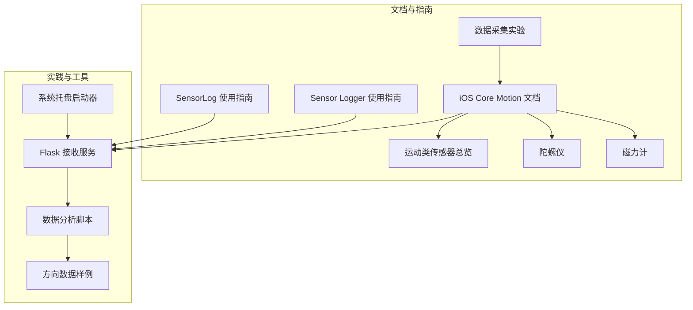
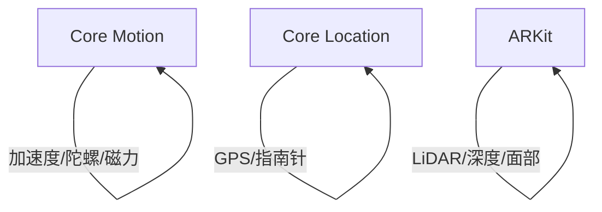
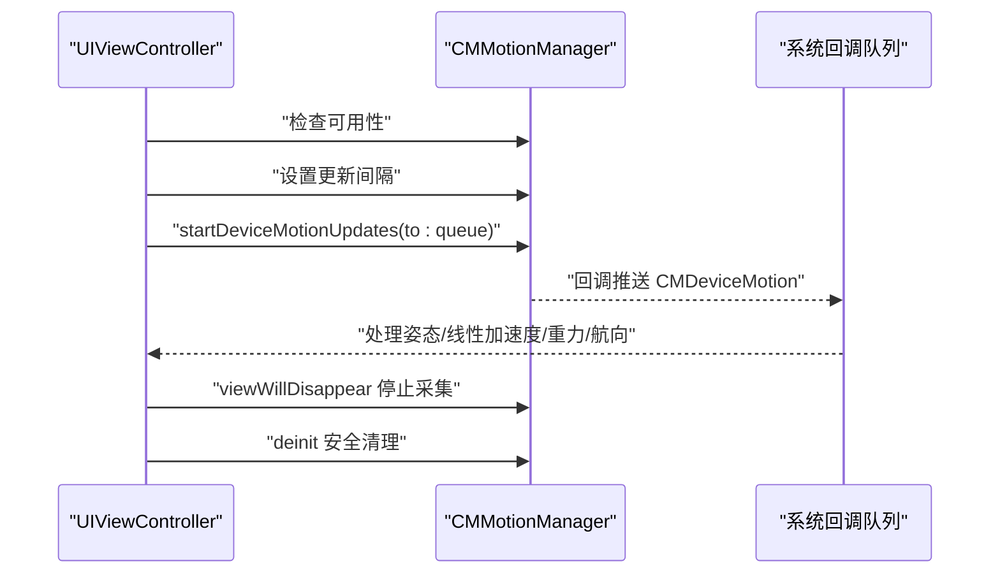
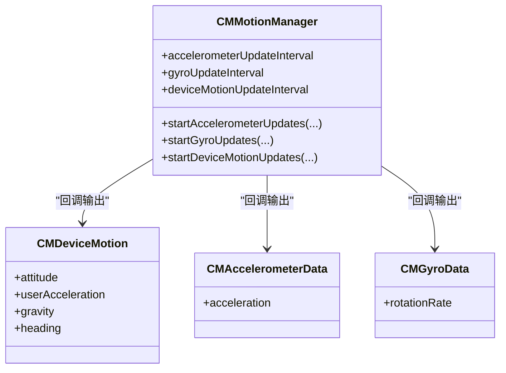
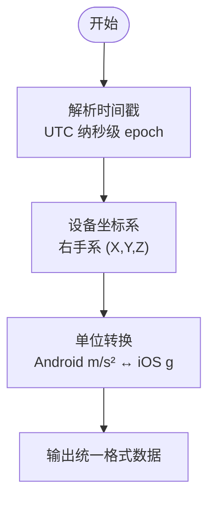
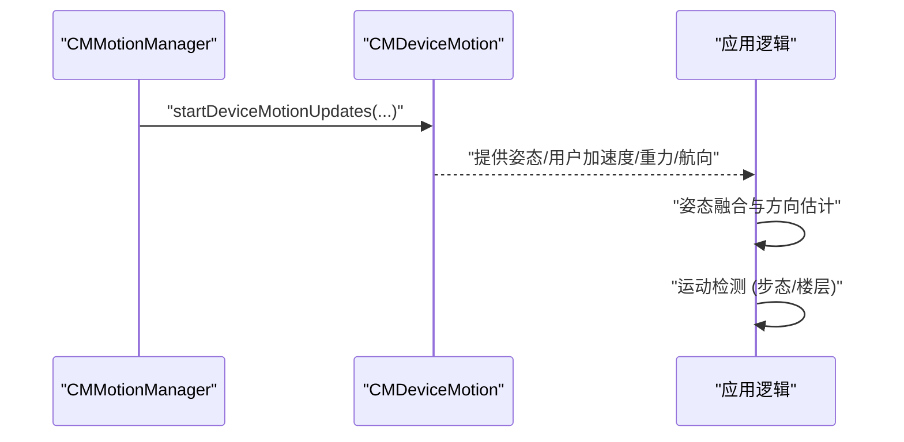
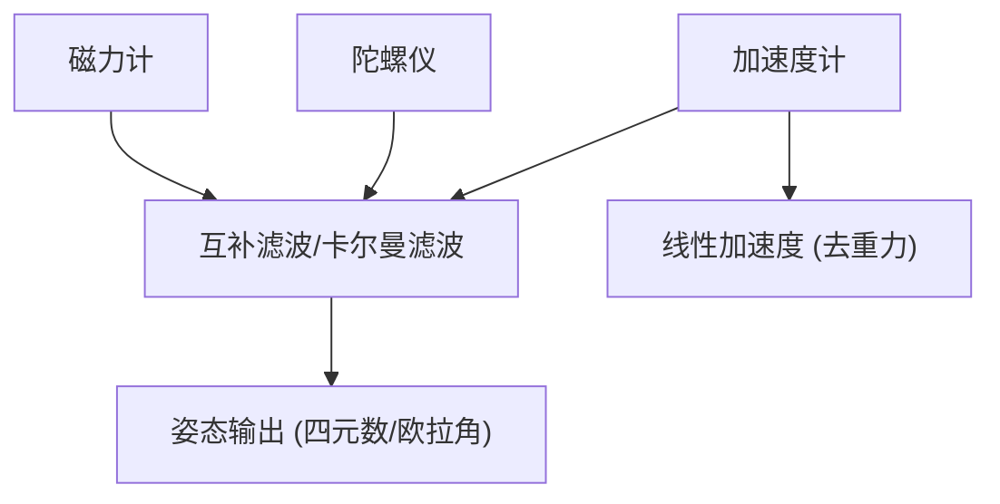
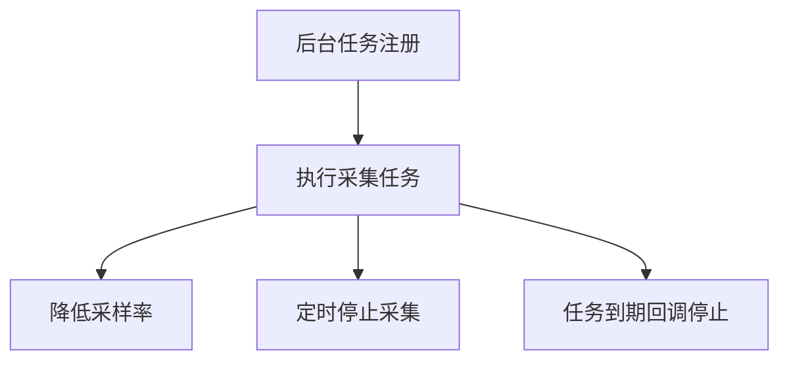
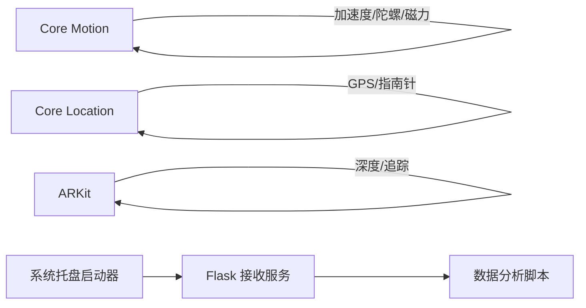
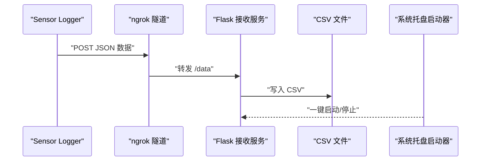

# iOS Core Motion 框架

<cite>
**本文引用的文件**
- [README.md](file://README.md)
- [iOS Core Motion 文档](file://docs/programming/ios.md)
- [运动类传感器总览](file://docs/sensors/motion/index.md)
- [陀螺仪](file://docs/sensors/motion/gyroscope.md)
- [磁力计](file://docs/sensors/motion/magnetometer.md)
- [数据采集实验](file://docs/practice/data-collection.md)
- [Sensor Logger 使用指南](file://docs/practice/sensor-logger.md)
- [SensorLog 使用指南](file://docs/practice/sensorlog.md)
- [Flask 接收服务](file://scripts/server.py)
- [系统托盘启动器](file://scripts/tray.py)
- [5G 数据分析脚本](file://scripts/analyze_5g_data.py)
- [方向数据样例](file://scripts/sample_data/orientation_sample.csv)
</cite>

## 目录
1. [简介](#简介)
2. [项目结构](#项目结构)
3. [核心组件](#核心组件)
4. [架构总览](#架构总览)
5. [详细组件分析](#详细组件分析)
6. [依赖分析](#依赖分析)
7. [性能考虑](#性能考虑)
8. [故障排查指南](#故障排查指南)
9. [结论](#结论)
10. [附录](#附录)

## 简介
本文件围绕 iOS Core Motion 框架，系统阐述其核心概念、架构设计与实现要点，重点覆盖 CMMotionManager 的使用方法、CMDeviceMotion、CMAccelerometerData、CMGyroData 等数据对象的实践路径，解释传感器数据的时间戳、坐标系与单位转换，以及设备方向、姿态估计与运动检测的实现思路。同时结合项目中的数据采集与上云实践，给出 iOS 应用生命周期中的传感器管理最佳实践，包括后台数据采集与电池优化策略，并提供与 ARKit、HealthKit 等框架的集成案例与参考路径。

## 项目结构
该项目采用 MkDocs + Material 主题，文档与实践案例并重，涵盖传感器原理、编程接口与实验实践。与 Core Motion 直接相关的文档与脚本如下：
- 编程接口：iOS Core Motion 文档
- 传感器原理：运动类传感器总览、陀螺仪、磁力计
- 实践案例：数据采集实验、Sensor Logger 使用指南、SensorLog 使用指南
- 数据上云：Flask 接收服务、系统托盘启动器、数据分析脚本、方向数据样例

**图表来源**
- [iOS Core Motion 文档](file://docs/programming/ios.md)
- [运动类传感器总览](file://docs/sensors/motion/index.md)
- [陀螺仪](file://docs/sensors/motion/gyroscope.md)
- [磁力计](file://docs/sensors/motion/magnetometer.md)
- [数据采集实验](file://docs/practice/data-collection.md)
- [Sensor Logger 使用指南](file://docs/practice/sensor-logger.md)
- [SensorLog 使用指南](file://docs/practice/sensorlog.md)
- [Flask 接收服务](file://scripts/server.py)
- [系统托盘启动器](file://scripts/tray.py)
- [5G 数据分析脚本](file://scripts/analyze_5g_data.py)
- [方向数据样例](file://scripts/sample_data/orientation_sample.csv)

**章节来源**
- [README.md: 18-55:18-55](file://README.md#L18-L55)

## 核心组件
- CMMotionManager：运动传感器管理器，负责加速度计、陀螺仪、磁力计与设备运动数据的采集与回调。
- CMDeviceMotion：融合姿态、线性加速度、重力与磁航向的综合数据对象。
- CMAccelerometerData / CMGyroData：分别承载原始加速度与角速度数据。
- CMAltimeter：气压/高度计数据接口。
- CMPedometer：计步器数据接口。
- CMMotionActivityManager：活动识别（走路/跑步/驾车）接口。

上述组件在 iOS Core Motion 文档中有系统介绍与使用示例，包括权限配置、基本使用、后台执行与生命周期管理等。

**章节来源**
- [iOS Core Motion 文档: 8-26:8-26](file://docs/programming/ios.md#L8-L26)
- [iOS Core Motion 文档: 64-161:64-161](file://docs/programming/ios.md#L64-L161)

## 架构总览
Core Motion 与系统其他框架的关系如下：
- Core Motion：加速度计、陀螺仪、磁力计、气压计、计步器、设备运动
- Core Location：GPS/GNSS、指南针方向
- ARKit：LiDAR、深度相机、面部追踪

**图表来源**
- [iOS Core Motion 文档: 10-16:10-16](file://docs/programming/ios.md#L10-L16)

## 详细组件分析

### CMMotionManager 使用详解
- 传感器可用性检查：在开始采集前检查加速度计、陀螺仪、磁力计与设备运动是否可用。
- 采样间隔设置：通过更新间隔控制采样频率，平衡实时性与功耗。
- 回调队列：startUpdates(to:queue) 将回调投递到指定队列，便于主线程 UI 更新。
- 生命周期绑定：在视图出现时开始采集，在视图消失时停止，避免无效功耗；在 deinit 中安全清理。

**图表来源**
- [iOS Core Motion 文档: 274-305:274-305](file://docs/programming/ios.md#L274-L305)

**章节来源**
- [iOS Core Motion 文档: 64-161:64-161](file://docs/programming/ios.md#L64-L161)
- [iOS Core Motion 文档: 261-305:261-305](file://docs/programming/ios.md#L261-L305)

### 数据对象与单位转换
- CMDeviceMotion：提供姿态（欧拉角/四元数）、用户加速度（去除重力）、重力、磁航向等。
- CMAccelerometerData / CMGyroData：分别提供加速度（g）与角速度（rad/s）。
- 单位差异：Android 加速度计返回 m/s²，iOS 返回 g（1g ≈ 9.81 m/s²），开发时需注意转换。

**图表来源**
- [iOS Core Motion 文档: 64-161:64-161](file://docs/programming/ios.md#L64-L161)

**章节来源**
- [iOS Core Motion 文档: 139-160:139-160](file://docs/programming/ios.md#L139-L160)
- [iOS Core Motion 文档: 310-326:310-326](file://docs/programming/ios.md#L310-L326)

### 时间戳、坐标系与单位转换
- 时间戳：iOS 传感器数据时间戳为 UTC 纳秒级 epoch，可用于后续时间序列分析与对齐。
- 坐标系：设备坐标系为右手系，X 沿屏幕宽度向右，Y 沿高度向上，Z 垂直于屏幕朝向用户。
- 单位转换：加速度单位在 iOS 与 Android 存在差异，需在跨平台实验中统一单位与坐标系。

**图表来源**
- [SensorLog 使用指南: 128-129:128-129](file://docs/practice/sensorlog.md#L128-L129)
- [运动类传感器总览: 34-49:34-49](file://docs/sensors/motion/index.md#L34-L49)
- [iOS Core Motion 文档: 324-326:324-326](file://docs/programming/ios.md#L324-L326)

**章节来源**
- [SensorLog 使用指南: 128-129:128-129](file://docs/practice/sensorlog.md#L128-L129)
- [运动类传感器总览: 34-49:34-49](file://docs/sensors/motion/index.md#L34-L49)
- [iOS Core Motion 文档: 324-326:324-326](file://docs/programming/ios.md#L324-L326)

### 设备方向、姿态估计与运动检测
- 设备方向：通过 CMDeviceMotion.heading 获取磁航向（度），结合姿态（欧拉角/四元数）进行方向估计。
- 姿态估计：使用 .xMagneticNorthZVertical 参考系，获得更稳定的航向与姿态。
- 运动检测：结合加速度计与气压计数据，可实现步态检测与楼层变化识别。

**图表来源**
- [iOS Core Motion 文档: 124-161:124-161](file://docs/programming/ios.md#L124-L161)
- [数据采集实验: 63-105:63-105](file://docs/practice/data-collection.md#L63-L105)

**章节来源**
- [iOS Core Motion 文档: 124-161:124-161](file://docs/programming/ios.md#L124-L161)
- [数据采集实验: 63-105:63-105](file://docs/practice/data-collection.md#L63-L105)

### 传感器融合与滤波思路
- 9轴融合：加速度计 + 陀螺仪 + 磁力计，输出绝对姿态（四元数/欧拉角）。
- 线性加速度：通过高通滤波从加速度计数据中分离重力，得到去重力加速度。
- 互补滤波：融合加速度计（低频可信）与陀螺仪（高频可信）以提升稳定性。

**图表来源**
- [运动类传感器总览: 118-131:118-131](file://docs/sensors/motion/index.md#L118-L131)
- [陀螺仪: 129-151:129-151](file://docs/sensors/motion/gyroscope.md#L129-L151)

**章节来源**
- [运动类传感器总览: 118-131:118-131](file://docs/sensors/motion/index.md#L118-L131)
- [陀螺仪: 129-151:129-151](file://docs/sensors/motion/gyroscope.md#L129-L151)

### 后台数据采集与电池优化
- 后台模式：iOS 对后台传感器访问有限制，常用方案包括后台处理任务（BGProcessingTask）与蓝牙中央后台接收。
- 电池影响：持续后台采集会显著影响续航，建议降低采样率并在不需要时及时停止。
- 任务管理：在任务到期时主动停止采集，确保系统资源合理释放。

**图表来源**
- [iOS Core Motion 文档: 206-258:206-258](file://docs/programming/ios.md#L206-L258)

**章节来源**
- [iOS Core Motion 文档: 206-258:206-258](file://docs/programming/ios.md#L206-L258)

### 与 ARKit、HealthKit 的集成
- 与 ARKit：设备运动数据可作为头部追踪的输入，配合 ARKit 的 LiDAR/深度信息实现更稳健的空间定位。
- 与 HealthKit：可将步数、活动数据与健康数据打通，实现运动健康闭环。

**章节来源**
- [iOS Core Motion 文档: 10-16:10-16](file://docs/programming/ios.md#L10-L16)

## 依赖分析
- 框架依赖：Core Motion 为核心传感器接口；Core Location 提供 GPS/指南针；ARKit 提供深度与追踪能力。
- 数据依赖：设备运动数据依赖加速度计、陀螺仪与磁力计的融合；计步与楼层检测依赖气压计与加速度计。
- 实践依赖：数据上云依赖 Flask 服务、系统托盘工具与数据分析脚本。

**图表来源**
- [iOS Core Motion 文档: 10-16:10-16](file://docs/programming/ios.md#L10-L16)
- [Flask 接收服务:1-94](file://scripts/server.py#L1-L94)
- [系统托盘启动器:1-276](file://scripts/tray.py#L1-L276)

**章节来源**
- [iOS Core Motion 文档: 10-16:10-16](file://docs/programming/ios.md#L10-L16)
- [Flask 接收服务:1-94](file://scripts/server.py#L1-L94)
- [系统托盘启动器:1-276](file://scripts/tray.py#L1-L276)

## 性能考虑
- 采样率与功耗：采样率越高，数据量越大，功耗越高。建议根据应用场景选择合适频率。
- 线程与队列：回调投递到合适的队列（如主线程）以避免 UI 卡顿。
- 后台任务：使用系统调度的后台任务，减少对前台应用的影响。
- 数据压缩与传输：在上云前进行必要的数据清洗与压缩，减少网络开销。

## 故障排查指南
- 传感器不可用：检查设备是否具备相应传感器，或在模拟器/旧设备上受限。
- 权限问题：涉及活动识别与计步时，需在 Info.plist 中添加相应描述并在首次使用时触发授权。
- 回调未触发：确认已设置正确的更新间隔与回调队列，且在生命周期内正确启停。
- 后台采集异常：检查后台任务注册与到期回调，确保在任务结束时停止采集。

**章节来源**
- [iOS Core Motion 文档: 29-60:29-60](file://docs/programming/ios.md#L29-L60)
- [iOS Core Motion 文档: 261-305:261-305](file://docs/programming/ios.md#L261-L305)

## 结论
Core Motion 为 iOS 设备运动与姿态感知提供了统一、高效的接口。通过 CMMotionManager 与 CMDeviceMotion，开发者可在保证低功耗的前提下实现高精度的姿态估计与方向检测。结合项目中的数据采集与上云实践，可构建从移动端到云端的完整数据链路。在实际工程中，应重视生命周期管理、后台任务与电池优化，并在跨平台实验中统一单位与坐标系，确保数据一致性与可比性。

## 附录

### 数据上云与可视化（基于项目脚本）
- Flask 接收服务：接收 Sensor Logger 推送的 JSON 数据，写入 CSV 并可选转发到其他服务。
- 系统托盘启动器：一键启动本地服务与 ngrok 隧道，便于公网测试。
- 数据分析脚本：对方向数据进行统计与绘图，展示姿态变化与四元数范数稳定性。
- 方向数据样例：提供包含姿态与四元数的样例 CSV，便于验证解析与可视化。

**图表来源**
- [Sensor Logger 使用指南: 74-132:74-132](file://docs/practice/sensor-logger.md#L74-L132)
- [Flask 接收服务:1-94](file://scripts/server.py#L1-L94)
- [系统托盘启动器:1-276](file://scripts/tray.py#L1-L276)

**章节来源**
- [Sensor Logger 使用指南: 74-132:74-132](file://docs/practice/sensor-logger.md#L74-L132)
- [Flask 接收服务:1-94](file://scripts/server.py#L1-L94)
- [系统托盘启动器:1-276](file://scripts/tray.py#L1-L276)
- [5G 数据分析脚本: 109-121:109-121](file://scripts/analyze_5g_data.py#L109-L121)
- [方向数据样例: 1-6:1-6](file://scripts/sample_data/orientation_sample.csv#L1-L6)