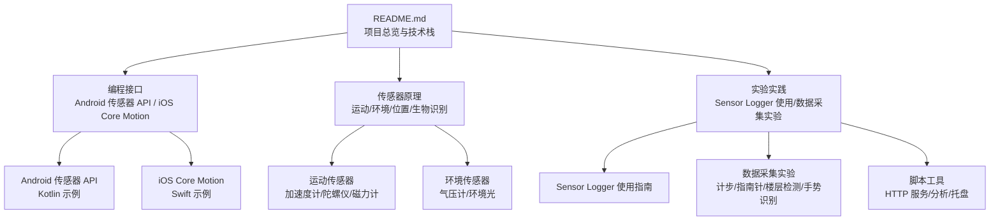
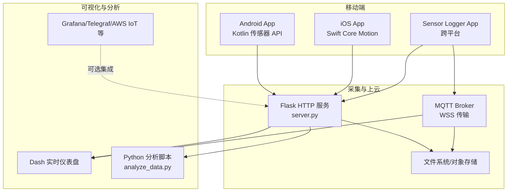
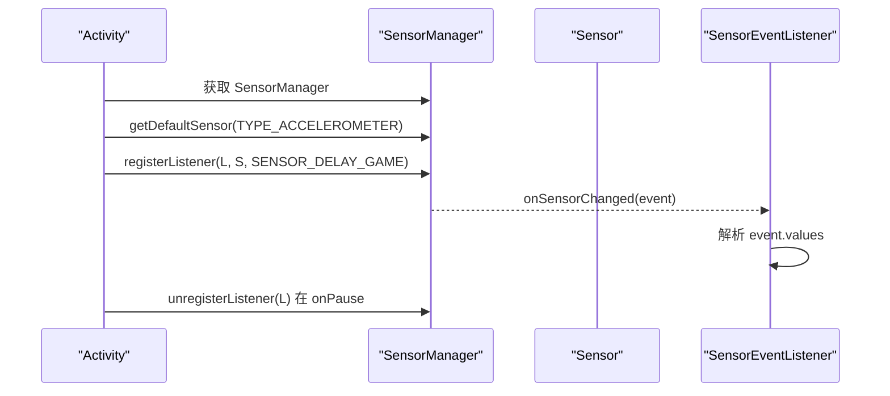
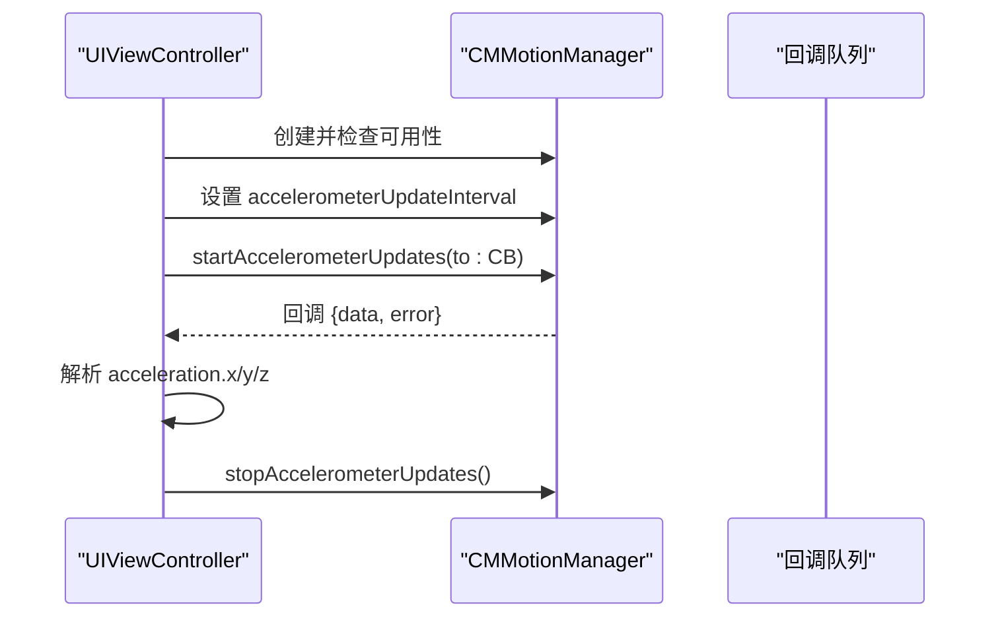
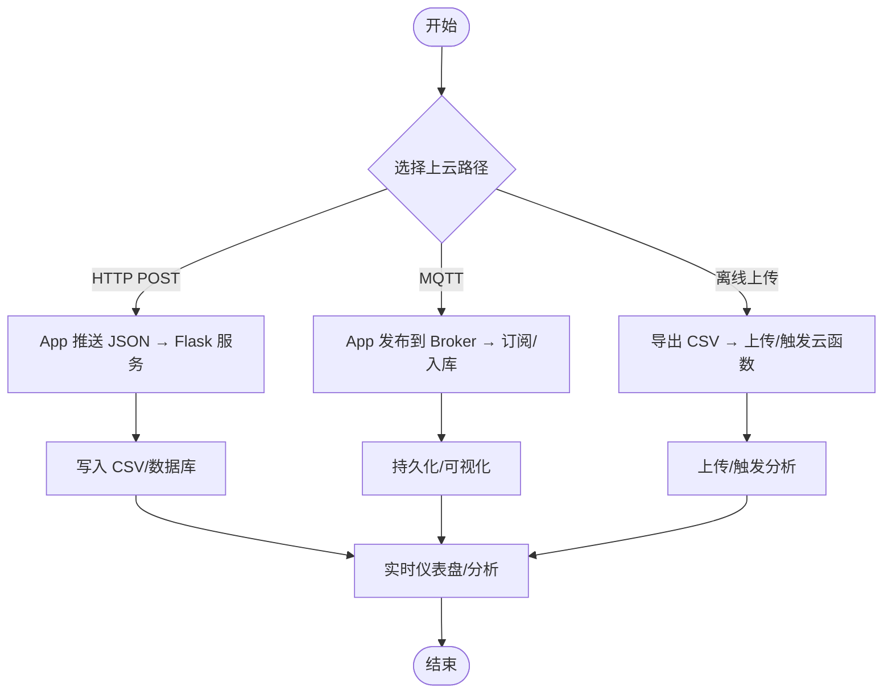
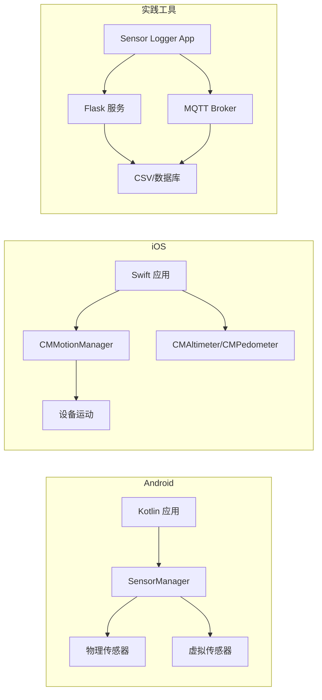

# 编程接口指南

<cite>
**本文引用的文件**
- [README.md](file://README.md)
- [android.md](file://docs/programming/android.md)
- [ios.md](file://docs/programming/ios.md)
- [motion/index.md](file://docs/sensors/motion/index.md)
- [gyroscope.md](file://docs/sensors/motion/gyroscope.md)
- [magnetometer.md](file://docs/sensors/motion/magnetometer.md)
- [barometer.md](file://docs/sensors/environment/barometer.md)
- [light.md](file://docs/sensors/environment/light.md)
- [sensor-logger.md](file://docs/practice/sensor-logger.md)
- [data-collection.md](file://docs/practice/data-collection.md)
- [server.py](file://scripts/server.py)
- [analyze_data.py](file://scripts/analyze_data.py)
- [tray.py](file://scripts/tray.py)
</cite>

## 目录
1. [引言](#引言)
2. [项目结构](#项目结构)
3. [核心组件](#核心组件)
4. [架构总览](#架构总览)
5. [详细组件分析](#详细组件分析)
6. [依赖关系分析](#依赖关系分析)
7. [性能考量](#性能考量)
8. [故障排查指南](#故障排查指南)
9. [结论](#结论)
10. [附录](#附录)

## 引言
本指南围绕智能手机传感器的编程接口展开，系统讲解 Android 传感器 API 与 iOS Core Motion 框架的使用方法，覆盖权限管理、数据获取、事件处理、传感器融合、批处理与后台采集等主题。文档同时提供 Kotlin（Android）与 Swift（iOS）的代码示例路径与最佳实践，帮助初学者快速上手，也为有经验的开发者提供深入的技术细节与性能优化建议。

## 项目结构
该项目采用 MkDocs + Material 主题，文档分为“编程接口”“传感器原理与应用”“实验实践”三大板块，辅以 Python 脚本实现数据采集、上云与可视化。

图表来源
- [README.md:18-55](file://README.md#L18-L55)
- [android.md:1-290](file://docs/programming/android.md#L1-L290)
- [ios.md:1-334](file://docs/programming/ios.md#L1-L334)
- [sensor-logger.md:1-468](file://docs/practice/sensor-logger.md#L1-L468)

章节来源
- [README.md:18-55](file://README.md#L18-L55)

## 核心组件
- Android 传感器框架：SensorManager、Sensor、SensorEvent、SensorEventListener；支持虚拟传感器融合与批处理。
- iOS Core Motion：CMMotionManager、CMAltimeter、CMPedometer、CMMotionActivityManager；提供设备运动、气压、计步等能力。
- 实践工具链：Sensor Logger（跨平台 App）、Flask HTTP 服务、MQTT 消息队列、Python 分析脚本与系统托盘。

章节来源
- [android.md:8-18](file://docs/programming/android.md#L8-L18)
- [ios.md:8-26](file://docs/programming/ios.md#L8-L26)
- [sensor-logger.md:8-58](file://docs/practice/sensor-logger.md#L8-L58)

## 架构总览
下图展示从移动端到云端的数据流，涵盖 HTTP 推送、MQTT 多设备汇聚与离线上传三种路径。

图表来源
- [sensor-logger.md:74-468](file://docs/practice/sensor-logger.md#L74-L468)
- [server.py:1-94](file://scripts/server.py#L1-L94)
- [analyze_data.py:1-98](file://scripts/analyze_data.py#L1-L98)

## 详细组件分析

### Android 传感器 API（Kotlin）
- 框架与类职责：SensorManager 管理传感器与监听；Sensor 描述物理/虚拟传感器；SensorEvent 传递数据；SensorEventListener 回调处理。
- 权限管理：大多数传感器无需运行时权限；心率、活动识别、GPS/后台定位等需危险权限。
- 基本流程：获取 SensorManager → 枚举传感器 → 注册监听（onResume）→ 处理 onSensorChanged → onPause 注销监听。
- 采样率：提供 SENSOR_DELAY_* 常量与自定义微秒值；高采样率显著增加功耗。
- 多传感器采集：遍历传感器类型列表统一注册监听，统一处理事件。
- 传感器融合：TYPE_ROTATION_VECTOR 等虚拟传感器输出四元数，结合 SensorManager 提供的旋转矩阵与欧拉角转换。
- 批处理：registerListener 带 maxReportLatencyUs 参数，降低 CPU 唤醒频率，延长后台采集时长。

图表来源
- [android.md:90-137](file://docs/programming/android.md#L90-L137)

章节来源
- [android.md:21-50](file://docs/programming/android.md#L21-L50)
- [android.md:54-153](file://docs/programming/android.md#L54-L153)
- [android.md:156-195](file://docs/programming/android.md#L156-L195)
- [android.md:212-247](file://docs/programming/android.md#L212-L247)
- [android.md:251-281](file://docs/programming/android.md#L251-L281)

### iOS Core Motion（Swift）
- 框架与类职责：CMMotionManager 管理加速度计/陀螺仪/磁力计/设备运动；CMAltimeter 气压计；CMPedometer 计步；CMMotionActivityManager 活动识别。
- 权限配置：Info.plist 中声明 NSMotionUsageDescription 等；CMMotionActivityManager 需首次使用触发授权。
- 基本流程：创建 CMMotionManager → 检查可用性 → 设置 updateInterval → startUpdates(to:) 回调处理 → 停止更新。
- 设备运动（推荐）：CMDeviceMotion 提供姿态（欧拉角/四元数）、线性加速度、重力、磁航向。
- 气压计：CMAltimeter 提供 pressure 与 relativeAltitude。
- 计步器：CMPedometer 提供 numberOfSteps/distance/currentPace。
- 后台执行：受限于系统策略，建议使用 BGProcessingTask 等机制，低采样率、短时采集。
- 生命周期管理：页面可见时开始，不可见时停止；deinit 中确保停止所有更新。

图表来源
- [ios.md:64-106](file://docs/programming/ios.md#L64-L106)

章节来源
- [ios.md:29-60](file://docs/programming/ios.md#L29-L60)
- [ios.md:64-161](file://docs/programming/ios.md#L64-L161)
- [ios.md:165-182](file://docs/programming/ios.md#L165-L182)
- [ios.md:186-202](file://docs/programming/ios.md#L186-L202)
- [ios.md:206-258](file://docs/programming/ios.md#L206-L258)
- [ios.md:261-306](file://docs/programming/ios.md#L261-L306)

### 传感器融合与数据格式
- Android 虚拟传感器：旋转矢量、游戏旋转矢量、线性加速度、重力、几何磁旋转矢量等。
- iOS 设备运动：姿态（attitude）、线性加速度（userAcceleration）、重力（gravity）、磁航向（heading）。
- 单位差异：Android 加速度计单位为 m/s²，iOS 为 g（1g≈9.81 m/s²），开发时需注意转换。

章节来源
- [android.md:212-247](file://docs/programming/android.md#L212-L247)
- [ios.md:124-161](file://docs/programming/ios.md#L124-L161)
- [ios.md:310-326](file://docs/programming/ios.md#L310-L326)

### 陀螺仪（Android 与 iOS）
- 工作原理：Android 通过 Sensor.TYPE_GYROSCOPE 获取 rad/s；iOS 通过 CMGyroData 获取 rad/s。
- 零偏稳定性与积分漂移：陀螺仪零偏会随时间累积，需与加速度计/磁力计融合。
- 应用：EIS 图像稳定、互补滤波器融合。

章节来源
- [gyroscope.md:1-161](file://docs/sensors/motion/gyroscope.md#L1-L161)
- [android.md:199-208](file://docs/programming/android.md#L199-L208)
- [ios.md:108-122](file://docs/programming/ios.md#L108-L122)

### 磁力计（Android 与 iOS）
- 作用：电子指南针，测量地球磁场三维分量。
- 标定：硬铁/软铁干扰，通过“8”字标定与椭球拟合求解偏置与变换矩阵。
- 应用：带倾斜补偿的航向角计算。

章节来源
- [magnetometer.md:1-166](file://docs/sensors/motion/magnetometer.md#L1-L166)
- [android.md:199-208](file://docs/programming/android.md#L199-L208)
- [ios.md:108-122](file://docs/programming/ios.md#L108-L122)

### 气压计（Android 与 iOS）
- 作用：高度估计、楼层检测、天气趋势分析。
- 原理：MEMS 压阻/电容式结构；相对精度优于绝对精度，适合楼层检测。
- 应用：气压转海拔、卡尔曼滤波平滑、趋势分析。

章节来源
- [barometer.md:1-216](file://docs/sensors/environment/barometer.md#L1-L216)
- [android.md:199-208](file://docs/programming/android.md#L199-L208)
- [ios.md:165-182](file://docs/programming/ios.md#L165-L182)

### 环境光传感器（Android）
- 作用：自动亮度调节、频闪检测。
- 多通道设计：可见光/红外/UV/Flicker 通道；动态范围覆盖 8 个数量级。
- 应用：对数映射自动亮度、EV 计算、场景分类。

章节来源
- [light.md:1-187](file://docs/sensors/environment/light.md#L1-L187)
- [android.md:199-208](file://docs/programming/android.md#L199-L208)

### Sensor Logger 使用与数据上云
- 支持传感器：加速度计、陀螺仪、磁力计、重力、气压计、GPS、麦克风、摄像头、计步器、设备状态等。
- 数据格式：CSV（单独/合并）、JSON、Excel、KML、SQLite。
- 上云路径：
  - HTTP POST 实时推送：App 每秒 POST JSON 到服务器，Flask 接收并写入 CSV。
  - MQTT 发布/订阅：多设备同时采集，适合课堂场景。
  - 离线上传：导出 CSV 后批量上传或触发云函数。
- 跨平台一致性：统一单位与坐标系（ENU）便于对比。
- 云平台集成：Grafana Cloud + Telegraf、阿里云 IoT、AWS IoT Core 等。

图表来源
- [sensor-logger.md:74-468](file://docs/practice/sensor-logger.md#L74-L468)
- [server.py:35-81](file://scripts/server.py#L35-L81)

章节来源
- [sensor-logger.md:8-58](file://docs/practice/sensor-logger.md#L8-L58)
- [sensor-logger.md:74-468](file://docs/practice/sensor-logger.md#L74-L468)

### 数据采集实验（计步/指南针/楼层/手势）
- 计步器：合成加速度、带通滤波、峰值检测，与手机内置计步对比。
- 电子指南针：加速度计+磁力计，倾斜补偿计算航向角。
- 气压计测楼层：气压转海拔、相对高度变化、楼层估算。
- 手势识别：提取时域特征，使用 KNN 等分类器识别简单手势。

章节来源
- [data-collection.md:8-192](file://docs/practice/data-collection.md#L8-L192)

## 依赖关系分析
- Android 侧：应用层依赖 SensorManager 与系统 HAL；虚拟传感器由系统融合多个物理传感器生成。
- iOS 侧：应用层依赖 Core Motion/Location/ARKit；设备运动由 CMMotionManager 统一输出。
- 实践侧：Sensor Logger 作为中间层，支持 HTTP/MQTT/离线三种上云路径；Flask/Python 脚本负责数据接收、入库与可视化。

图表来源
- [android.md:8-18](file://docs/programming/android.md#L8-L18)
- [ios.md:8-26](file://docs/programming/ios.md#L8-L26)
- [sensor-logger.md:74-468](file://docs/practice/sensor-logger.md#L74-L468)

## 性能考量
- 采样率与功耗：Android 的 SENSOR_DELAY_* 与自定义微秒值；iOS 的 updateInterval。高采样率显著增加 CPU 与电池消耗。
- 批处理（Android）：通过 maxReportLatencyUs 将事件缓存至硬件 FIFO，降低唤醒频率，延长后台采集时间。
- 后台执行（iOS）：受限于系统策略，建议低采样率、短时采集，使用 BGProcessingTask 等机制。
- 生命周期管理：页面/界面可见时开始采集，不可见时停止，避免无效功耗与内存泄漏。
- 数据处理：优先在设备端做降噪与轻量滤波，减少网络传输与云端压力。

## 故障排查指南
- 权限问题（Android）：心率、活动识别、GPS/后台定位需危险权限；运行时请求并检查结果。
- 权限问题（iOS）：Info.plist 未声明 NSMotionUsageDescription 等可能导致授权失败；首次使用触发授权。
- 传感器不可用（iOS）：检查 isAccelerometerAvailable/isGyroAvailable/isMagnetometerAvailable/isDeviceMotionAvailable。
- 数据缺失（HTTP POST）：确认 Flask 服务已启动、端口未被占用、Push URL 正确；查看 server.py 控制台输出。
- MQTT 连接失败：确保 Broker 支持 WSS；检查用户名/密码与 Topic；确认客户端 TLS 设置。
- 数据不一致（跨平台）：开启 Sensor Logger 的 Standardise Units & Frame，统一单位与坐标系。
- 陀螺仪漂移（Android/iOS）：进行传感器融合（旋转矢量/设备运动），必要时进行零偏校准与滤波。

章节来源
- [android.md:21-50](file://docs/programming/android.md#L21-L50)
- [ios.md:29-60](file://docs/programming/ios.md#L29-L60)
- [sensor-logger.md:420-431](file://docs/practice/sensor-logger.md#L420-L431)

## 结论
Android 与 iOS 的传感器编程接口各有特色：Android 更强调底层传感器与虚拟融合、批处理与系统 HAL；iOS 更强调高层抽象与设备运动统一输出。结合 Sensor Logger 与 Python 脚本，可快速搭建从移动端采集到云端可视化的完整链路。实践中应重视生命周期管理、采样率与功耗平衡、跨平台一致性与数据融合，以获得稳定可靠的传感器应用体验。

## 附录
- 代码示例路径（不直接展示代码内容）：
  - Android 基本使用与多传感器采集：[android.md:56-195](file://docs/programming/android.md#L56-L195)
  - Android 传感器融合与欧拉角转换：[android.md:224-247](file://docs/programming/android.md#L224-L247)
  - Android 批处理与 FIFO 查询：[android.md:255-271](file://docs/programming/android.md#L255-L271)
  - iOS 基本使用与设备运动：[ios.md:64-161](file://docs/programming/ios.md#L64-L161)
  - iOS 气压计与计步器：[ios.md:165-202](file://docs/programming/ios.md#L165-L202)
  - iOS 后台任务与生命周期管理：[ios.md:206-306](file://docs/programming/ios.md#L206-L306)
  - Sensor Logger HTTP 推送与 Flask 服务：[sensor-logger.md:74-179](file://docs/practice/sensor-logger.md#L74-L179)
  - Sensor Logger MQTT 订阅与数据库入库：[sensor-logger.md:236-318](file://docs/practice/sensor-logger.md#L236-L318)
  - 本地 HTTP 服务与转发：[server.py:35-81](file://scripts/server.py#L35-L81)
  - 陀螺仪与磁力计标定与指南针：[gyroscope.md:88-94](file://docs/sensors/motion/gyroscope.md#L88-L94), [magnetometer.md:82-125](file://docs/sensors/motion/magnetometer.md#L82-L125)
  - 气压计楼层检测与趋势分析：[barometer.md:107-156](file://docs/sensors/environment/barometer.md#L107-L156)
  - 环境光传感器自动亮度与场景分类：[light.md:107-156](file://docs/sensors/environment/light.md#L107-L156)
  - 数据采集实验（计步/指南针/楼层/手势）：[data-collection.md:8-192](file://docs/practice/data-collection.md#L8-L192)
  - 系统托盘一键启动服务与 ngrok：[tray.py:169-244](file://scripts/tray.py#L169-L244)