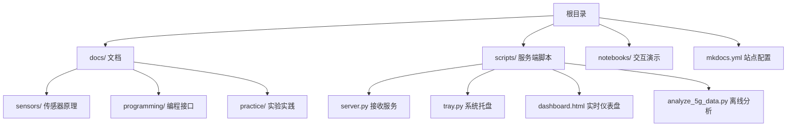
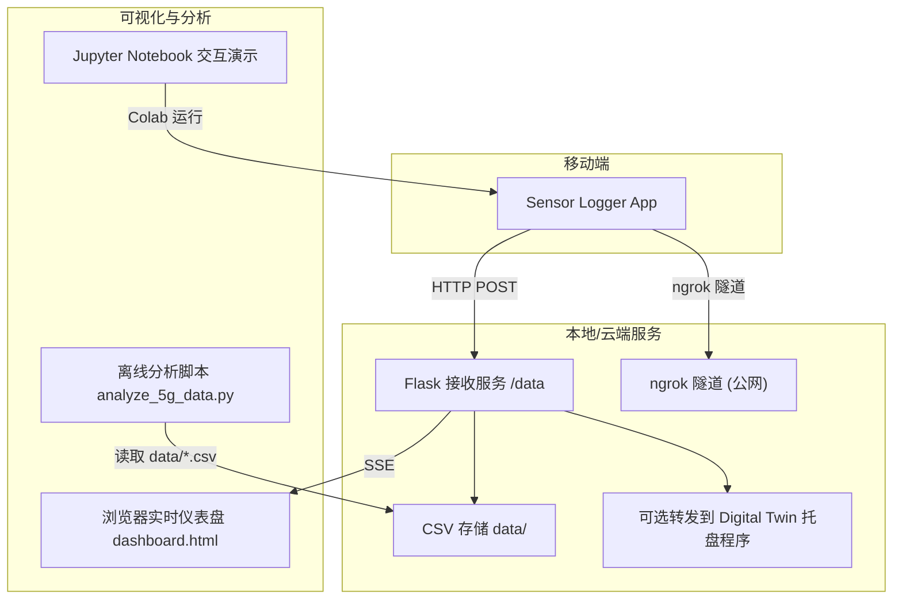
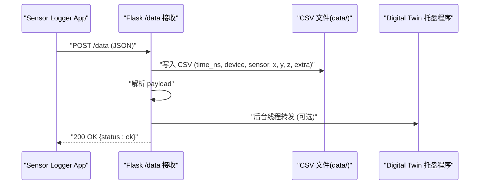
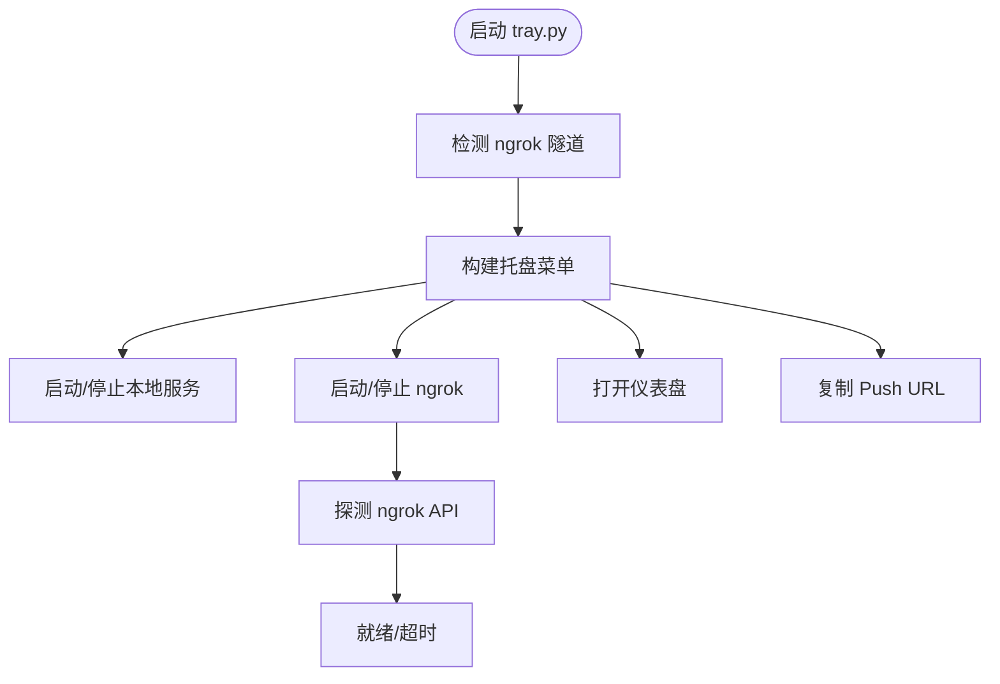
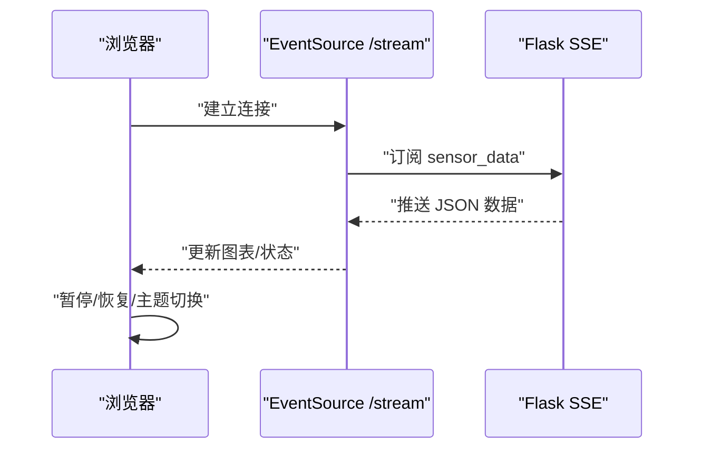
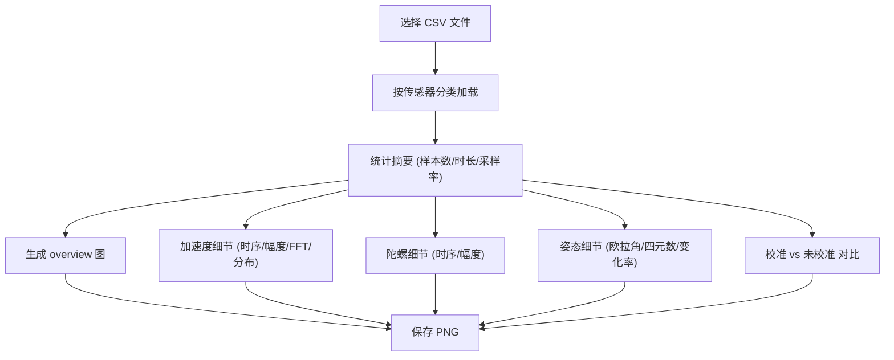
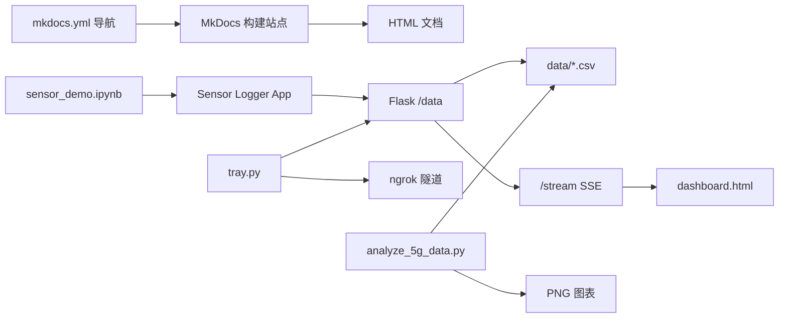

# 项目概述

<cite>
**本文引用的文件**
- [README.md](file://README.md)
- [mkdocs.yml](file://mkdocs.yml)
- [server.py](file://scripts/server.py)
- [tray.py](file://scripts/tray.py)
- [dashboard.html](file://scripts/dashboard.html)
- [sensor_demo.ipynb](file://notebooks/sensor_demo.ipynb)
- [analyze_5g_data.py](file://scripts/analyze_5g_data.py)
- [sensor-logger.md](file://docs/practice/sensor-logger.md)
- [data-collection.md](file://docs/practice/data-collection.md)
- [android.md](file://docs/programming/android.md)
- [ios.md](file://docs/programming/ios.md)
- [accelerometer.md](file://docs/sensors/motion/accelerometer.md)
- [barometer.md](file://docs/sensors/environment/barometer.md)
- [overview.md](file://docs/sensors/overview.md)
</cite>

## 目录
1. [项目简介](#项目简介)
2. [项目结构](#项目结构)
3. [核心组件](#核心组件)
4. [架构总览](#架构总览)
5. [详细组件分析](#详细组件分析)
6. [依赖关系分析](#依赖关系分析)
7. [性能考量](#性能考量)
8. [故障排查指南](#故障排查指南)
9. [结论](#结论)
10. [附录](#附录)

## 项目简介
本项目是面向高校教学的“智能手机传感器技术”课程资料与实践平台，采用 MkDocs + Material 主题与 Docs-as-Code 工作流构建，覆盖从硬件原理到编程实践的完整知识体系。项目提供中文文档、交互演示与数据采集工具链，支持 Android 与 iOS 两大移动端平台的传感器 API 使用，并配套实时数据采集、可视化与离线分析能力。

- 在线阅读与部署：GitHub Pages
- 技术栈：MkDocs + Material、Python（Flask/PySide）、HTML5/ECharts、Notebook（Colab）
- 教学对象：高校传感器/物联网/移动开发相关课程、工程师与学生

**章节来源**
- [README.md:14-169](file://README.md#L14-L169)

## 项目结构
项目采用模块化组织，文档与工具脚本清晰分离：
- docs/：课程文档与实践指南，按“传感器原理/编程接口/实验实践”组织
- scripts/：数据采集与可视化服务端脚本（Flask、系统托盘、仪表盘）
- notebooks/：交互式 Python 演示与分析
- mkdocs.yml：站点构建配置

**图表来源**
- [mkdocs.yml:78-115](file://mkdocs.yml#L78-L115)
- [README.md:18-55](file://README.md#L18-L55)

**章节来源**
- [README.md:18-55](file://README.md#L18-L55)
- [mkdocs.yml:78-115](file://mkdocs.yml#L78-L115)

## 核心组件
- 文档与导航：MkDocs + Material 主题，提供中文界面与数学公式渲染
- 数据采集与上云：Sensor Logger（跨平台 App）支持 HTTP POST 实时推送
- 本地服务：Flask 接收端，CSV 存储与可选转发
- 可视化：浏览器实时仪表盘（ECharts），支持 SSE 推送
- 系统托盘：一键启动/停止本地服务与 ngrok 隧道
- 离线分析：Python 脚本解析 CSV，生成统计与频谱图
- 交互演示：Jupyter Notebook，Colab 直接运行

**章节来源**
- [README.md:80-169](file://README.md#L80-L169)
- [sensor-logger.md:74-180](file://docs/practice/sensor-logger.md#L74-L180)
- [server.py:1-94](file://scripts/server.py#L1-L94)
- [dashboard.html:1-561](file://scripts/dashboard.html#L1-L561)
- [tray.py:1-276](file://scripts/tray.py#L1-L276)
- [analyze_5g_data.py:1-360](file://scripts/analyze_5g_data.py#L1-L360)
- [sensor_demo.ipynb:1-224](file://notebooks/sensor_demo.ipynb#L1-L224)

## 架构总览
整体系统由“移动端采集 + 本地/云端服务 + 可视化与分析”三层组成，支持局域网与公网穿透两种采集路径。

**图表来源**
- [sensor-logger.md:74-180](file://docs/practice/sensor-logger.md#L74-L180)
- [server.py:1-94](file://scripts/server.py#L1-L94)
- [dashboard.html:140-219](file://scripts/dashboard.html#L140-L219)
- [tray.py:169-182](file://scripts/tray.py#L169-L182)
- [analyze_5g_data.py:22-36](file://scripts/analyze_5g_data.py#L22-L36)

## 详细组件分析

### 1) 传感器原理与分类（硬件与融合）
- 传感器分类：力学量（加速度/陀螺/气压）、电磁量（磁力计/NFC/UWB/霍尔）、光学（环境光/接近/ToF/LiDAR/指纹/结构光）、生物信号（PPG/SpO2/指纹）、位置（GNSS）
- 技术基础：MEMS（微机电系统）、光电、磁敏、射频、压电/超声、红外
- 传感器系统架构：应用处理器 → Sensor Hub → 各传感器；接口 I2C/SPI/I3C/UART
- 传感器融合：9轴融合（加速度+陀螺+磁力）、6轴融合（加速度+陀螺）、线性加速度、步态检测、定位融合

**章节来源**
- [overview.md:19-146](file://docs/sensors/overview.md#L19-L146)

### 2) Android 传感器 API（Kotlin）
- 框架：SensorManager、Sensor、SensorEvent、SensorEventListener
- 权限：多数传感器无需运行时权限；心率/活动识别/定位等需危险权限
- 使用流程：获取 SensorManager → 枚举传感器 → 注册监听 → 处理 onSensorChanged → onPause 注销
- 采样率：SENSOR_DELAY_NORMAL/UI/Game/Fastest 或自定义微秒
- 多传感器采集：同时注册多个 TYPE_* 传感器
- 虚拟传感器（融合）：ROTATION_VECTOR、GAME_ROTATION_VECTOR、LINEAR_ACCELERATION、GRAVITY、GEOMAGNETIC_ROTATION_VECTOR
- 批处理模式：降低功耗，提高后台采集效率

**章节来源**
- [android.md:8-290](file://docs/programming/android.md#L8-L290)

### 3) iOS Core Motion（Swift）
- 框架：Core Motion（CMMotionManager）、Core Location（GPS/GNSS）、ARKit（LiDAR/深度/面部）
- 权限：运动活动/位置使用说明（Info.plist）
- 基本使用：创建 CMMotionManager → 设置采样间隔 → startUpdates 回调 → 生命周期管理（viewWillAppear/start / viewWillDisappear/stop）
- 设备运动（融合）：CMDeviceMotion 提供姿态（欧拉角/四元数）、线性加速度、重力、磁航向
- 气压计/高度计：CMAltimeter
- 计步器：CMPedometer
- 后台执行：location/processing/bluetooth-central 等模式限制严格

**章节来源**
- [ios.md:8-334](file://docs/programming/ios.md#L8-L334)

### 4) 数据采集与上云（Sensor Logger）
- 支持传感器：加速度、陀螺、磁力、重力、气压、GPS、麦克风、摄像头、计步器、设备状态、环境光、Wi-Fi 扫描、电池温度等
- 数据导出：CSV（单/合并）、JSON、Excel、KML、SQLite
- 上云路线：
  - HTTP POST 实时推送：App 每秒 POST JSON 到服务器
  - MQTT 消息队列：发布/订阅模式，适合全班多人同时采集
  - 离线文件上传：课后批量上传
- 跨平台一致性：Standardise Units & Frame（统一单位与坐标系）

**章节来源**
- [sensor-logger.md:24-468](file://docs/practice/sensor-logger.md#L24-L468)

### 5) Flask 接收服务（server.py）
- 功能：接收 /data POST（JSON），写入 data/<sessionId>.csv，可选转发到 Digital Twin 托盘程序
- 数据格式：time_ns、device、sensor、x、y、z、extra（JSON 字符串）
- 转发：后台线程转发，不影响主请求
- 启动：app.run(host="0.0.0.0", port=8000)

**图表来源**
- [server.py:35-81](file://scripts/server.py#L35-L81)

**章节来源**
- [server.py:1-94](file://scripts/server.py#L1-L94)

### 6) 系统托盘（tray.py）
- 功能：一键启动/停止本地服务、启动/停止 ngrok 隧道、打开仪表盘、复制 Push URL、检测现有隧道
- 网络探测：本地 IP 自动探测、ngrok 本地 API 探测
- GUI：PyStray 图标菜单，动态标签与启用状态

**图表来源**
- [tray.py:169-182](file://scripts/tray.py#L169-L182)
- [tray.py:101-119](file://scripts/tray.py#L101-L119)

**章节来源**
- [tray.py:1-276](file://scripts/tray.py#L1-L276)

### 7) 实时仪表盘（dashboard.html）
- 技能：ECharts 图表、SSE 推送、暗/亮主题、Tab 切换、暂停/恢复、采样率统计
- 数据：按传感器聚合，支持 overview 与 detail 两套布局
- 传感器映射：accelerometer、gyroscope、gravity、orientation、uncalibrated 对应
- 交互：暂停/恢复、主题切换、窗口大小变化自适应

**图表来源**
- [dashboard.html:512-525](file://scripts/dashboard.html#L512-L525)

**章节来源**
- [dashboard.html:1-561](file://scripts/dashboard.html#L1-L561)

### 8) 离线分析（analyze_5g_data.py）
- 输入：data/ 目录下 CSV（由 server.py 生成）
- 输出：多图（overview、加速度细节、陀螺细节、姿态细节、校准对比）
- 统计：每传感器样本数、时长、采样率、均值/方差/极值
- FFT：加速度幅度频谱
- 可视化：Matplotlib PNG 输出

**图表来源**
- [analyze_5g_data.py:22-36](file://scripts/analyze_5g_data.py#L22-L36)
- [analyze_5g_data.py:91-124](file://scripts/analyze_5g_data.py#L91-L124)

**章节来源**
- [analyze_5g_data.py:1-360](file://scripts/analyze_5g_data.py#L1-L360)

### 9) 实验实践（数据采集实验）
- 计步器：基于加速度计合成量与峰值检测
- 电子指南针：加速度+磁力计倾斜补偿航向角
- 气压计测楼层：气压转海拔，估算楼层变化
- 手势识别（进阶）：提取时域特征，KNN 分类

**章节来源**
- [data-collection.md:8-192](file://docs/practice/data-collection.md#L8-L192)

### 10) 传感器基础示例（加速度计/气压计）
- 加速度计：屏幕方向检测、简易计步器
- 气压计：气压转海拔、趋势分析、卡尔曼滤波平滑

**章节来源**
- [accelerometer.md:119-177](file://docs/sensors/motion/accelerometer.md#L119-L177)
- [barometer.md:126-216](file://docs/sensors/environment/barometer.md#L126-L216)

## 依赖关系分析
- 文档层：mkdocs.yml 定义导航与主题；docs/ 内容驱动站点生成
- 服务层：Flask 依赖 Python 标准库与第三方（Flask、urllib、csv、json、datetime 等）
- 可视化层：ECharts（CDN）、浏览器 SSE
- 托盘层：PySide（图像绘制）、pystray（系统托盘）、subprocess（进程管理）
- 分析层：NumPy、Matplotlib、glob、os、json
- 交互演示：Jupyter Notebook（Colab）

**图表来源**
- [mkdocs.yml:78-115](file://mkdocs.yml#L78-L115)
- [server.py:11-21](file://scripts/server.py#L11-L21)
- [tray.py:5-9](file://scripts/tray.py#L5-L9)
- [analyze_5g_data.py:14-18](file://scripts/analyze_5g_data.py#L14-L18)
- [dashboard.html:7](file://scripts/dashboard.html#L7)

**章节来源**
- [mkdocs.yml:78-115](file://mkdocs.yml#L78-L115)
- [server.py:11-21](file://scripts/server.py#L11-L21)
- [tray.py:5-9](file://scripts/tray.py#L5-L9)
- [analyze_5g_data.py:14-18](file://scripts/analyze_5g_data.py#L14-L18)
- [dashboard.html:7](file://scripts/dashboard.html#L7)

## 性能考量
- 采样率与功耗：高采样率显著增加 CPU 与功耗，建议按场景选择（UI/游戏/数据采集）
- 批处理模式：Android 批处理可大幅降低唤醒频率，延长电池寿命
- 网络与延迟：HTTP POST 适合验证，MQTT 更适合多人实时汇聚；公网穿透受 ngrok 限制
- 可视化与存储：SSE 与 CSV 写入对 CPU/IO 有开销，建议按需刷新与降采样
- 传感器融合：融合算法精度与稳定性取决于传感器质量与时序对齐

[本节为通用指导，不涉及具体文件分析]

## 故障排查指南
- 无法连接/接收数据
  - 检查本地服务是否启动（端口 8000）、防火墙
  - 确认 Sensor Logger Push URL 是否指向正确 IP/域名
  - 使用系统托盘复制 Push URL，避免拼写错误
- ngrok 隧道问题
  - 确认 ngrok.exe 存在且已配置 authtoken
  - 托盘探测 ngrok API，若未就绪，检查网络或重新登录
- 仪表盘无数据
  - 确认 /stream 是否成功连接（状态点颜色）
  - 检查 CSV 是否生成（data/ 目录）
- 数据不一致（iOS/Android）
  - 开启“Standardise Units & Frame”，统一单位与坐标系
- 分析脚本报错
  - 确认 data/ 下存在 CSV，或显式传入文件路径
  - 检查 Python 依赖（numpy/matplotlib 等）

**章节来源**
- [tray.py:75-99](file://scripts/tray.py#L75-L99)
- [tray.py:101-119](file://scripts/tray.py#L101-L119)
- [dashboard.html:512-525](file://scripts/dashboard.html#L512-L525)
- [sensor-logger.md:420-431](file://docs/practice/sensor-logger.md#L420-L431)
- [analyze_5g_data.py:22-36](file://scripts/analyze_5g_data.py#L22-L36)

## 结论
本项目以“文档 + 工具 + 实践”三位一体的方式，系统呈现了移动传感器技术的原理与应用。通过 Sensor Logger + Flask + ECharts 的组合，实现了从移动端采集、本地/云端接收、实时可视化到离线分析的完整闭环，既适合初学者入门，也为有经验的开发者提供了可扩展的工程化范式。

[本节为总结性内容，不涉及具体文件分析]

## 附录

### A. 常见用例与示例路径
- 局域网模式：本地服务 + 仪表盘
  - 启动服务：python scripts/server.py
  - 打开仪表盘：http://localhost:8000/dashboard
  - App Push URL：http://<你的电脑IP>:8000/data
- 公网模式（5G/公网）：ngrok 隧道
  - 安装 ngrok，配置 authtoken
  - 启动服务与隧道，或使用系统托盘一键启动
  - App Push URL：https://xxx.ngrok-free.dev/data
- 离线分析
  - 运行 python scripts/analyze_5g_data.py，自动生成统计与图表
- 交互演示
  - 打开 notebooks/sensor_demo.ipynb（Colab 直接运行）

**章节来源**
- [README.md:100-144](file://README.md#L100-L144)
- [sensor-logger.md:74-180](file://docs/practice/sensor-logger.md#L74-L180)
- [analyze_5g_data.py:10-13](file://scripts/analyze_5g_data.py#L10-L13)
- [sensor_demo.ipynb:1-224](file://notebooks/sensor_demo.ipynb#L1-L224)

### B. 公共接口与参数
- Flask /data 接收
  - 方法：POST
  - 请求体：JSON（sessionId、deviceId、payload）
  - 响应：{"status":"ok"}，200
- Flask /stream SSE
  - 事件：sensor_data
  - 数据：按传感器聚合的二维数组（时间、X、Y、Z）
- 系统托盘
  - 动作：一键启动/停止服务、启动/停止 ngrok、打开仪表盘、复制 Push URL
- 仪表盘
  - 交互：暂停/恢复、主题切换、Tab 切换、窗口自适应

**章节来源**
- [server.py:35-81](file://scripts/server.py#L35-L81)
- [dashboard.html:512-525](file://scripts/dashboard.html#L512-L525)
- [tray.py:169-182](file://scripts/tray.py#L169-L182)