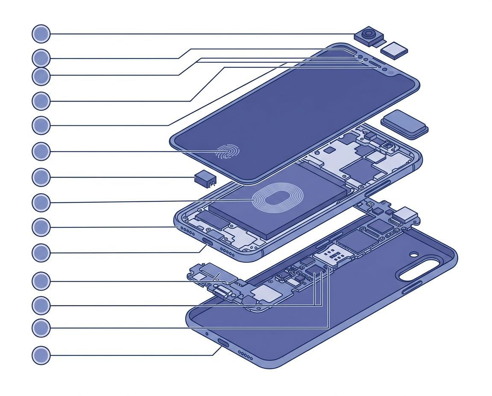

# 手机传感器技术

> 智能手机内置传感器 —— 原理、硬件与编程实践

<figure markdown="span">
  { width="720" }
  <figcaption>现代智能手机内置的各类传感器</figcaption>
</figure>

---

## 课程简介

现代智能手机内置了 **15-20 种**不同类型的传感器,从测量加速度的 MEMS 加速度计到实现厘米级定位的 UWB 超宽带芯片,这些传感器构成了手机感知物理世界的"感官系统"。

本站点系统梳理了智能手机中各类传感器的 **硬件原理、芯片实现、系统架构与编程接口**,并提供基于 SensorLog 等工具的动手实验指南,适合作为移动传感器技术课程的教学参考。

---

## 内容结构

-   :material-run-fast: **运动类传感器**

    ---

    加速度计、陀螺仪、磁力计 —— 手机感知运动与姿态的核心器件

    [:octicons-arrow-right-24: 查看详情](sensors/motion/index.md)

-   :material-weather-partly-cloudy: **环境类传感器**

    ---

    气压计、环境光、温湿度 —— 感知周围环境的物理参数

    [:octicons-arrow-right-24: 查看详情](sensors/environment/index.md)

-   :material-map-marker-radius: **位置与距离**

    ---

    GNSS、接近传感器、ToF、LiDAR —— 定位与测距技术

    [:octicons-arrow-right-24: 查看详情](sensors/position/index.md)

-   :material-fingerprint: **生物识别**

    ---

    指纹、面部识别、心率与血氧 —— 身份认证与健康监测

    [:octicons-arrow-right-24: 查看详情](sensors/biometric/index.md)

-   :material-nfc: **通信与其他**

    ---

    NFC、UWB、霍尔传感器、红外 —— 近场通信与辅助感知

    [:octicons-arrow-right-24: 查看详情](sensors/others/index.md)

-   :material-code-braces: **编程接口**

    ---

    Android Sensor API 与 iOS Core Motion 编程实践

    [:octicons-arrow-right-24: 查看详情](programming/index.md)

---

## 传感器速查表

| 分类 | 传感器 | 硬件技术 | 典型芯片 | 可编程采集 |
|:-----|:-------|:---------|:---------|:----------:|
| 运动 | 加速度计 | MEMS 电容式 | Bosch BMA456 | :material-check: |
| 运动 | 陀螺仪 | MEMS 科氏力 | ST LSM6DSO | :material-check: |
| 运动 | 磁力计 | 霍尔/磁阻效应 | AKM AK09918 | :material-check: |
| 环境 | 气压计 | MEMS 压阻式 | Bosch BMP390 | :material-check: |
| 环境 | 环境光 | 光电二极管 | AMS TSL2591 | :material-check: |
| 环境 | 温度 | 热敏电阻 | — | :material-check: |
| 位置 | GNSS | 卫星射频 | Broadcom BCM47765 | :material-check: |
| 位置 | 接近传感器 | 红外反射 | AMS TMD2772 | :material-check: |
| 位置 | ToF | 激光飞行时间 | ST VL53L5CX | :material-close: |
| 位置 | LiDAR | dToF 激光阵列 | Sony IMX590 | :material-close: |
| 生物 | 指纹 | 电容/光学/超声波 | Qualcomm 3D Sonic | :material-close: |
| 生物 | 面部(结构光) | IR 点阵投影 | Apple TrueDepth | :material-close: |
| 通信 | NFC | 13.56 MHz 感应 | NXP SN220 | :material-close: |
| 通信 | UWB | 超宽带脉冲 | Apple U2 / NXP SR150 | :material-close: |

---

## 技术栈

本站点使用 [MkDocs](https://www.mkdocs.org/) + [Material for MkDocs](https://squidfundamental.github.io/mkdocs-material/) 构建,遵循 **Docs-as-Code** 理念,源码托管于 GitHub,通过 GitHub Actions 自动部署至 GitHub Pages。
