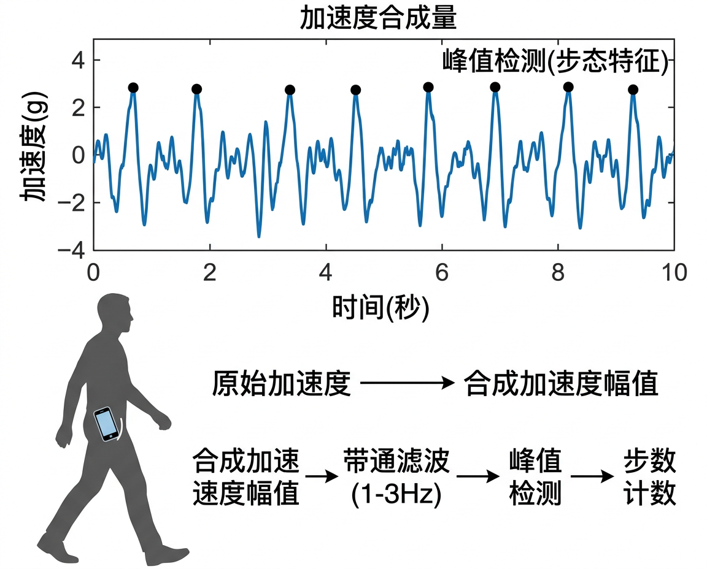

# 数据采集实验

<figure markdown="span">
  { width="720" }
  <figcaption>基于加速度计的计步原理：合成加速度周期性波形与峰值检测</figcaption>
</figure>

## 实验一: 计步器

### 实验目标

利用加速度计数据实现简易计步算法,并与手机内置计步器对比。

### 实验步骤

1. 打开 SensorLog / Sensor Logger,选择加速度计,设置 50 Hz 采样率
2. 将手机放入口袋,步行 100 步 (手动计数)
3. 停止记录,导出 CSV

### 数据分析

```python
import pandas as pd
import numpy as np
from scipy.signal import find_peaks

# 加载数据
df = pd.read_csv("walk_100steps.csv")

# 计算加速度合成量
df['magnitude'] = np.sqrt(
    df['accelerometerAccelerationX']**2 +
    df['accelerometerAccelerationY']**2 +
    df['accelerometerAccelerationZ']**2
)

# 带通滤波 (保留步行频率 1-3 Hz)
from scipy.signal import butter, filtfilt

fs = 50  # 采样率
b, a = butter(4, [1, 3], btype='band', fs=fs)
df['filtered'] = filtfilt(b, a, df['magnitude'])

# 峰值检测
peaks, properties = find_peaks(
    df['filtered'],
    height=0.2,           # 最小峰值高度
    distance=fs * 0.3     # 最小峰间距 (0.3s, 对应 ~200 steps/min)
)

print(f"检测到步数: {len(peaks)}")
print(f"实际步数: 100")
print(f"误差: {abs(len(peaks) - 100)}%")
```

### 思考题

1. 手机放在不同位置 (口袋/手持/背包) 对计步精度有何影响?
2. 如何区分走路和跑步?

---

## 实验二: 电子指南针

### 实验目标

利用加速度计和磁力计数据实现带倾斜补偿的电子指南针。

### 实验步骤

1. 采集加速度计 + 磁力计数据
2. 缓慢旋转手机一周 (保持水平)
3. 对比不同倾斜角度下的航向精度

### 数据分析

```python
import numpy as np

def tilt_compensated_heading(ax, ay, az, mx, my, mz):
    """带倾斜补偿的航向角计算"""
    # 归一化加速度
    norm_a = np.sqrt(ax**2 + ay**2 + az**2)
    ax, ay, az = ax/norm_a, ay/norm_a, az/norm_a

    # 计算倾斜角
    pitch = np.arcsin(-ax)
    roll = np.arcsin(ay / np.cos(pitch))

    # 倾斜补偿
    mx_comp = mx * np.cos(pitch) + mz * np.sin(pitch)
    my_comp = (mx * np.sin(roll) * np.sin(pitch)
               + my * np.cos(roll)
               - mz * np.sin(roll) * np.cos(pitch))

    # 航向角
    heading = np.degrees(np.arctan2(-my_comp, mx_comp))
    if heading < 0:
        heading += 360
    return heading

# 使用示例
heading = tilt_compensated_heading(0.01, -0.02, -1.0, 25.3, 5.1, -40.2)
print(f"航向: {heading:.1f}°")
```

---

## 实验三: 气压计测楼层

### 实验目标

利用气压计数据检测楼层变化。

### 实验步骤

1. 开启气压计采集 (10 Hz)
2. 从 1 楼乘电梯或走楼梯上到 5 楼
3. 在每一层停留 10 秒

### 数据分析

```python
import pandas as pd
import numpy as np

df = pd.read_csv("floor_change.csv")

# 气压转海拔
def pressure_to_altitude(p, p0=1013.25):
    return 44330 * (1 - (p / p0) ** 0.1903)

df['altitude'] = df['pressure'].apply(pressure_to_altitude)

# 相对高度变化
df['relative_alt'] = df['altitude'] - df['altitude'].iloc[0]

# 估算楼层 (假设层高 3m)
df['floor'] = (df['relative_alt'] / 3.0).round().astype(int) + 1

print(f"起始气压: {df['pressure'].iloc[0]:.2f} hPa")
print(f"终止气压: {df['pressure'].iloc[-1]:.2f} hPa")
print(f"气压差: {df['pressure'].iloc[-1] - df['pressure'].iloc[0]:.2f} hPa")
print(f"高度变化: {df['relative_alt'].iloc[-1]:.1f} m")
print(f"估算楼层变化: {df['floor'].iloc[-1] - 1} 层")
```

### 思考题

1. 天气变化对气压读数有何影响?如何补偿?
2. 乘电梯和走楼梯的气压变化曲线有何区别?

---

## 实验四: 手势识别 (进阶)

### 实验目标

利用加速度计和陀螺仪数据,识别简单的手持手机手势 (摇晃、翻转、画圈)。

### 实验设计

1. 定义 3 种手势,每种采集 20 组样本
2. 提取时域特征 (均值、方差、峰值、过零率等)
3. 使用简单分类器 (如 KNN) 进行识别

```python
import numpy as np
from sklearn.neighbors import KNeighborsClassifier
from sklearn.model_selection import cross_val_score

def extract_features(segment):
    """从一个传感器数据片段中提取特征"""
    features = []
    for axis in ['X', 'Y', 'Z']:
        col = segment[f'accelerometerAcceleration{axis}']
        features.extend([
            col.mean(),
            col.std(),
            col.max() - col.min(),
            np.sqrt(np.mean(col**2)),  # RMS
            (np.diff(np.sign(col)) != 0).sum(),  # 过零率
        ])
    return features

# 假设已分割好的训练数据
# X_train: 特征矩阵, y_train: 标签
knn = KNeighborsClassifier(n_neighbors=5)
scores = cross_val_score(knn, X_train, y_train, cv=5)
print(f"5折交叉验证准确率: {scores.mean():.2%}")
```
