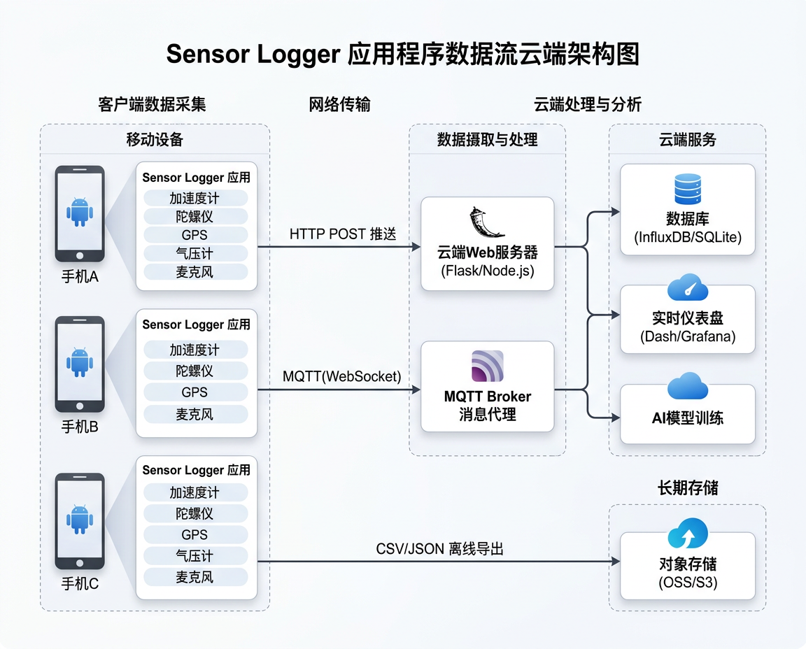

# Sensor Logger 使用指南

<figure markdown="span">
  { width="780" }
  <figcaption>Sensor Logger 多设备数据上云处理架构</figcaption>
</figure>

## App 简介

| 属性 | 值 |
|:-----|:---|
| 名称 | Sensor Logger |
| 平台 | **iOS + Android** (跨平台) |
| 开发者 | Kelvin Choi (Tsz Hei Choi) |
| 价格 | **免费** (Plus/Pro 解锁高级功能) |
| 官网 | [tszheichoi.com/sensorlogger](https://www.tszheichoi.com/sensorlogger) |
| GitHub 社区 | [awesome-sensor-logger](https://github.com/tszheichoi/awesome-sensor-logger) |

!!! tip "为什么推荐 Sensor Logger"
    免费、跨平台 (iOS + Android)、原生 MQTT 支持、JSON 导出、社区活跃,非常适合课堂教学场景。

---

## 支持的传感器

### 手机内置传感器

| 传感器 | 数据字段 | iOS | Android |
|:-------|:---------|:---:|:-------:|
| 加速度计 | x, y, z (m/s²) | :white_check_mark: | :white_check_mark: |
| 陀螺仪 | x, y, z (rad/s) | :white_check_mark: | :white_check_mark: |
| 磁力计 | x, y, z (μT) | :white_check_mark: | :white_check_mark: |
| 重力 | x, y, z (m/s²) | :white_check_mark: | :white_check_mark: |
| 气压计 | pressure (hPa), relativeAltitude (m) | :white_check_mark: | :white_check_mark: |
| GPS | latitude, longitude, altitude, speed, bearing | :white_check_mark: | :white_check_mark: |
| 麦克风 | 音频录制 / 响度 (dB) | :white_check_mark: | :white_check_mark: |
| 摄像头 | 图片/视频 (前置/后置), 深度信息 | :white_check_mark: | :white_check_mark: |
| 计步器 | steps | :white_check_mark: | :white_check_mark: |
| 设备状态 | 电池电量/充电状态, 屏幕亮度 | :white_check_mark: | :white_check_mark: |
| 环境光 | lux | | :white_check_mark: |
| Wi-Fi 扫描 | 附近热点信息 | | :white_check_mark: |
| 电池温度 | temperature (°C) | | :white_check_mark: |

### 可穿戴设备传感器

| 传感器 | Apple Watch | WearOS |
|:-------|:----------:|:------:|
| 心率 | :white_check_mark: | :white_check_mark: |
| 手腕运动 | :white_check_mark: | :white_check_mark: |
| 位置 | :white_check_mark: | :white_check_mark: |
| 气压计 | :white_check_mark: | :white_check_mark: |

### 外部传感器

- **蓝牙 Beacon**: 扫描附近 BLE 广播设备
- **AirPods 运动**: 头部追踪数据 (仅 iOS)
- **MQTT 订阅**: 可接收外部 MQTT Topic 的数据并记录

---

## 数据导出格式

| 格式 | 说明 |
|:-----|:-----|
| **CSV** (单独) | 每个传感器一个 CSV 文件 |
| **CSV** (合并) | 所有传感器合并到一个 CSV,可重采样对齐 (Plus/Pro) |
| **JSON** | 原始 JSON 格式 |
| **Excel** | .xlsx 格式 |
| **KML** | GPS 轨迹,可导入 Google Earth |
| **SQLite** | 数据库格式,方便大数据量查询 |

---

## 数据上云: 三条路线

### 路线一: HTTP POST 实时推送

最简单的上云方式,App 每秒自动 POST JSON 数据到你的服务器。

#### 方案 A: 本仓库自带服务 (推荐)

本仓库提供了完整的 Sensor Logger 接收服务 + 实时仪表盘 + ngrok 公网穿透方案。

**功能特点**

| 功能 | 说明 |
|:-----|:-----|
| 局域网模式 | 同一 WiFi 下直接访问 `http://<电脑IP>:8080` |
| 5G/公网模式 | 通过 ngrok 隧道，手机使用移动网络也能推送数据 |
| 实时仪表盘 | 浏览器访问 `/dashboard` 查看传感器波形 |
| 数据存储 | 自动保存为 CSV 文件到 `data/` 目录 |
| 一键管理 | 系统托盘图标，一键启动/停止服务和隧道 |

**快速开始**

1. **安装依赖**
   ```bash
   pip install flask pystray pillow
   ```

2. **下载 ngrok** (如需公网访问)
   - 访问 [ngrok.com](https://ngrok.com) 注册免费账号
   - 下载 Windows 版 `ngrok.exe` 放到项目根目录
   - 配置: `ngrok config add-authtoken <你的token>`

3. **启动服务**

   **方式一：系统托盘一键启动（推荐）**
   ```bash
   # 双击运行
   启动托盘程序.vbs
   ```
   或命令行:
   ```bash
   python scripts/tray.py
   ```

   **方式二：命令行启动**
   ```bash
   # 终端1：启动数据接收服务
   python scripts/server.py -p 8080
   
   # 终端2：启动 ngrok 隧道 (可选)
   ngrok http 8080
   ```

4. **手机端配置**
   - 打开 Sensor Logger App → 设置 → Push URL
   - **局域网模式**: `http://<电脑IP>:8080/data`
   - **5G/公网模式**: `https://xxx.ngrok-free.dev/data` (从 ngrok 获取)
   - 点击 **Tap to Test Pushing** 验证连通性
   - 开始录制，数据将实时推送到电脑

5. **查看仪表盘**
   - 右键托盘图标 → 「打开仪表盘 (本地)」
   - 或浏览器访问: `http://localhost:8080/dashboard`

**系统托盘菜单说明**

| 菜单项 | 功能 |
|:-------|:-----|
| ▶ 一键启动全部 | 同时启动 Flask 服务和 ngrok 隧道 |
| 启动/停止本地服务 | 控制数据接收服务 (端口 8080) |
| 启动/停止 ngrok | 控制公网隧道 |
| 打开仪表盘 (本地) | 浏览器打开本地仪表盘 |
| 打开仪表盘 (公网) | 浏览器打开公网仪表盘 |
| 复制 Push URL | 复制局域网或公网的推送地址 |

> **注意**: ngrok 免费版每次启动会分配新的公网 URL，适合教学和测试使用。

---

#### 方案 B: 自建 Flask 服务

如需自定义数据处理逻辑，可参考以下极简版 Flask 服务：

#### App 端配置

1. **启动托盘程序** (`启动托盘程序.vbs` 或 `启动托盘程序.bat`)
2. **右键系统托盘图标** → 「复制 Push URL (局域网)」
3. 打开 Sensor Logger **设置** (齿轮图标)
4. 找到 **Push URL**, **粘贴**复制的地址 (格式: `http://<电脑IP>:8080/data`)
    - ⚠️ **注意**: IP 地址是自动检测的，每台电脑不同，必须从托盘菜单复制
5. 点击 **Tap to Test Pushing** 验证连通性
6. 开始录制,数据将自动推送

#### JSON Payload 格式

每次推送的完整 JSON 结构:

```json
{
  "messageId": 42,
  "sessionId": "a1b2c3d4-e5f6-7890",
  "deviceId": "iPhone-XYZ",
  "payload": [
    {
      "name": "accelerometer",
      "time": 1711526400000000000,
      "values": { "x": 0.023, "y": -0.981, "z": 0.045 }
    },
    {
      "name": "gyroscope",
      "time": 1711526400000000000,
      "values": { "x": 0.001, "y": -0.003, "z": 0.007 }
    },
    {
      "name": "magnetometer",
      "time": 1711526400100000000,
      "values": { "x": 25.3, "y": 5.1, "z": -40.2 }
    },
    {
      "name": "barometer",
      "time": 1711526400200000000,
      "values": { "pressure": 1013.25, "relativeAltitude": 0.0 }
    },
    {
      "name": "location",
      "time": 1711526401000000000,
      "values": {
        "latitude": 30.2741,
        "longitude": 120.1551,
        "altitude": 12.5,
        "speed": 1.2,
        "bearing": 180.0
      }
    }
  ]
}
```

!!! info "字段说明"
    - `messageId` — 递增序号,用于处理乱序
    - `sessionId` — 每次录制的唯一标识
    - `deviceId` — 设备唯一标识
    - `time` — **UTC 纳秒级 epoch 时间戳**
    - `payload` — 本次推送的所有传感器数据数组
    - Android 端部分传感器额外包含 `accuracy` 字段 (0=不可靠, 3=最高精度)

#### 云端接收: Flask 极简版

```python
from flask import Flask, request, jsonify
import json, csv, os

app = Flask(__name__)
os.makedirs("data", exist_ok=True)

@app.route("/data", methods=["POST"])
def receive():
    data = request.get_json()
    sid = data.get("sessionId", "unknown")
    did = data.get("deviceId", "unknown")

    filepath = f"data/{sid}.csv"
    is_new = not os.path.exists(filepath)

    with open(filepath, "a", newline="") as f:
        w = csv.writer(f)
        if is_new:
            w.writerow(["time_ns", "device", "sensor", "x", "y", "z", "extra"])
        for item in data.get("payload", []):
            v = item.get("values", {})
            w.writerow([
                item["time"], did, item["name"],
                v.get("x", v.get("latitude", v.get("pressure", ""))),
                v.get("y", v.get("longitude", v.get("relativeAltitude", ""))),
                v.get("z", v.get("altitude", "")),
                json.dumps({k: v2 for k, v2 in v.items()
                           if k not in ("x","y","z")}, ensure_ascii=False) or ""
            ])
    return jsonify(status="ok"), 200

if __name__ == "__main__":
    app.run(host="0.0.0.0", port=8000)
```

#### 云端接收: 实时可视化 (Dash)

官方提供的 Plotly Dash 实时仪表盘方案,可边采集边看波形:

```python
import dash
from dash.dependencies import Output, Input
from dash import dcc, html
from datetime import datetime
import json, plotly.graph_objs as go
from collections import deque
from flask import Flask, request

server = Flask(__name__)
app = dash.Dash(__name__, server=server)

MAX_POINTS = 1000

time_q = deque(maxlen=MAX_POINTS)
ax, ay, az = deque(maxlen=MAX_POINTS), deque(maxlen=MAX_POINTS), deque(maxlen=MAX_POINTS)

app.layout = html.Div([
    html.H2("Sensor Logger 实时加速度"),
    dcc.Graph(id="live"),
    dcc.Interval(id="tick", interval=200),
])

@app.callback(Output("live", "figure"), Input("tick", "n_intervals"))
def update(_):
    traces = [go.Scatter(x=list(time_q), y=list(d), name=n)
              for d, n in zip([ax, ay, az], ["X", "Y", "Z"])]
    layout = go.Layout(xaxis={"type": "date"}, yaxis={"title": "加速度 (m/s²)"})
    if time_q:
        layout["xaxis"]["range"] = [min(time_q), max(time_q)]
    return {"data": traces, "layout": layout}

@server.route("/data", methods=["POST"])
def data():
    for d in json.loads(request.data).get("payload", []):
        if d.get("name") == "accelerometer":
            ts = datetime.fromtimestamp(d["time"] / 1e9)
            if not time_q or ts > time_q[-1]:
                time_q.append(ts)
                ax.append(d["values"]["x"])
                ay.append(d["values"]["y"])
                az.append(d["values"]["z"])
    return "ok"

if __name__ == "__main__":
    app.run_server(port=8000, host="0.0.0.0")
```

启动后浏览器打开 `http://服务器IP:8000`,App Push URL 填同一地址的 `/data`,即可实时看到加速度波形。

---

### 路线二: MQTT 消息队列 (推荐多设备)

MQTT 是 IoT 标准协议,**发布/订阅** 模式天然支持多设备同时采集,非常适合全班同时上课实验。

#### 架构

```
┌─────────┐                                   ┌──────────────┐
│ 手机 A  │──publish──►                        │ 实时仪表盘    │
├─────────┤            ┌────────────────┐      ├──────────────┤
│ 手机 B  │──publish──►│  MQTT Broker   │──►   │ 数据存储服务  │
├─────────┤            │  (云端消息代理) │      ├──────────────┤
│ 手机 C  │──publish──►└────────────────┘──►   │ AI 推理服务   │
└─────────┘                                    └──────────────┘
```

#### App 端配置

1. **设置 → Push via MQTT** (需 Plus/Pro 版本)
2. 填入 Broker 连接信息:

| 参数 | 示例值 | 说明 |
|:-----|:-------|:-----|
| Broker URL | `wss://broker.emqx.io:8084/mqtt` | 必须是 **WebSocket (wss://)** 地址 |
| Topic | `sensor/${deviceId}` | 支持 `${deviceId}` `${sessionId}` 变量 |
| Username | (按 Broker 要求) | 公共 Broker 可留空 |
| Password | (按 Broker 要求) | 公共 Broker 可留空 |

!!! warning "WebSocket 限制"
    Sensor Logger MQTT 仅支持 **WebSocket (wss://)** 传输,不支持原生 TCP 1883 端口。选择 Broker 时须确认支持 WSS。

#### MQTT Broker 选型

| Broker | 类型 | WSS 端口 | 免费额度 | 推荐场景 |
|:-------|:-----|:---------|:---------|:---------|
| **EMQX Cloud Serverless** | 托管 | 8084 | 100万次连接/月 | 国内教学首选 |
| **HiveMQ Cloud** | 托管 | 8884 | 100 连接 | 海外网络 |
| **EMQX 开源版** | 自建 Docker | 自定义 | 无限 | 私有化部署 |
| **Mosquitto** | 自建 Docker | 自定义 | 无限 | 轻量级 |
| **emqx.io 公共** | 公共测试 | 8084 | 无限 (不保证可用) | 快速测试 |

#### 云端订阅: Python + SQLite

```python
import paho.mqtt.client as mqtt
import json, sqlite3
from datetime import datetime

# 初始化数据库
db = sqlite3.connect("sensor_cloud.db", check_same_thread=False)
db.execute("""CREATE TABLE IF NOT EXISTS readings (
    id INTEGER PRIMARY KEY AUTOINCREMENT,
    recv_time TEXT, device TEXT, session TEXT,
    sensor TEXT, time_ns INTEGER,
    val_json TEXT
)""")

def on_connect(client, userdata, flags, rc):
    print(f"已连接 Broker, rc={rc}")
    client.subscribe("sensor/#")  # 订阅所有设备

def on_message(client, userdata, msg):
    data = json.loads(msg.payload.decode())
    device = data.get("deviceId", "")
    session = data.get("sessionId", "")
    now = datetime.utcnow().isoformat()

    for item in data.get("payload", []):
        db.execute(
            "INSERT INTO readings (recv_time,device,session,sensor,time_ns,val_json) VALUES (?,?,?,?,?,?)",
            [now, device, session, item["name"], item["time"], json.dumps(item["values"])]
        )
    db.commit()

client = mqtt.Client(transport="websockets")
client.tls_set()  # wss 需要 TLS
client.on_connect = on_connect
client.on_message = on_message
client.connect("broker.emqx.io", 8084)
print("开始监听 MQTT 消息...")
client.loop_forever()
```

启动后,所有学生手机的数据自动汇入 `sensor_cloud.db`,可用 SQL 查询任意设备、任意传感器的数据。

#### MQTT 实时仪表盘 (Web)

官方提供了现成的 Web 可视化方案:

```bash
git clone https://github.com/tszheichoi/sensor-logger-streaming-demo-app.git
cd sensor-logger-streaming-demo-app
npm install
```

创建 `.env` 文件:

```
VITE_MQTT_BROKER_URL=wss://broker.emqx.io:8084/mqtt
VITE_MQTT_USERNAME=
VITE_MQTT_PASSWORD=
VITE_MQTT_TOPIC=sensor-logger
```

```bash
npm run dev
# 浏览器打开 http://localhost:5173
```

App 端 Topic 设为 `sensor-logger`,即可在网页上实时看到所有设备的传感器数据流。

---

### 路线三: 离线文件上传

采集完成后批量上传,适合课后作业或大数据量场景。

#### 导出与上传流程

```
录制完成 → App内选择导出格式 → Share → 上传目标
                                       ├── iCloud Drive / Google Drive (手动)
                                       ├── Python 脚本批量 POST (自动)
                                       └── 对象存储 OSS/S3 (自动触发云函数)
```

#### 批量上传脚本

```python
import requests, glob, os

API = "https://your-server.com/api/upload"

for fp in glob.glob("exports/*.csv"):
    with open(fp, "rb") as f:
        r = requests.post(API, files={"file": (os.path.basename(fp), f)})
        print(f"{fp}: {r.status_code}")
```

#### 云端接收并入库

```python
from flask import Flask, request
import pandas as pd, os

app = Flask(__name__)

@app.route("/api/upload", methods=["POST"])
def upload():
    f = request.files["file"]
    save_path = f"uploads/{f.filename}"
    f.save(save_path)

    # 读入 pandas 做预处理
    df = pd.read_csv(save_path)
    print(f"收到 {f.filename}: {len(df)} 行, 列: {list(df.columns)}")

    # 可继续写入数据库、触发分析流水线...
    return {"status": "ok", "rows": len(df)}, 200

if __name__ == "__main__":
    app.run(host="0.0.0.0", port=5000)
```

---

## 三条路线对比

| 对比项 | HTTP POST | MQTT | 离线上传 |
|:-------|:----------|:-----|:---------|
| **实时性** | ~1 秒 | ~200 毫秒 | 非实时 |
| **多设备** | 一般 | 优秀 (pub/sub 解耦) | 优秀 |
| **复杂度** | 低 (一个 Flask 路由) | 中 (需 Broker) | 低 |
| **断网容错** | 数据丢失 | 数据丢失 | 不丢失 |
| **免费版可用** | :white_check_mark: | 需 Plus/Pro | :white_check_mark: |
| **适合场景** | 单人/少设备验证 | 全班同时采集 | 课后批量分析 |

!!! tip "教学推荐组合"
    - **个人实验** → HTTP POST + Flask 极简服务,5 分钟搭好
    - **课堂多人** → MQTT + EMQX Cloud + Web 仪表盘,所有学生数据实时汇聚
    - **课后作业** → CSV 导出 + Python 离线分析,零门槛

---

## 跨平台一致性设置

Sensor Logger 提供 **Standardise Units & Frame** 选项:

| 设置项 | 关闭 | 开启 |
|:-------|:-----|:-----|
| 加速度单位 | iOS: g / Android: m/s² | 统一为 m/s² |
| 坐标系 | 各平台原生 | 统一为 ENU (东-北-天) |

!!! warning "跨平台实验必开"
    如果课堂上 iOS 和 Android 混用,务必开启此选项,否则同一手势在不同平台产生的数据方向和量级不同,无法直接对比。

---

## 云平台托管方案

### 方案 A: Grafana Cloud + Telegraf

社区项目 [sensorlogger-telegraf](https://github.com/mhaberler/sensorlogger-telegraf) 提供开箱即用配置:

```
Sensor Logger → HTTP POST → Telegraf (数据中继)
     → InfluxDB Cloud (时序数据库) → Grafana (可视化仪表盘)
```

### 方案 B: 阿里云 IoT

```
Sensor Logger → MQTT → 阿里云 IoT Platform
     → 规则引擎 → 函数计算 / 表格存储 / DataV 大屏
```

### 方案 C: AWS IoT Core

```
Sensor Logger → MQTT → AWS IoT Core
     → IoT Rule → Lambda + DynamoDB / S3
```

---

## 延伸阅读

- [Sensor Logger 官网](https://www.tszheichoi.com/sensorlogger)
- [Sensor Logger 帮助文档](https://www.tszheichoi.com/sensorloggerhelp)
- [awesome-sensor-logger (社区资源汇总)](https://github.com/tszheichoi/awesome-sensor-logger)
- [MQTT 实时仪表盘源码](https://github.com/tszheichoi/sensor-logger-streaming-demo-app)
- [Telegraf 集成方案](https://github.com/mhaberler/sensorlogger-telegraf)
