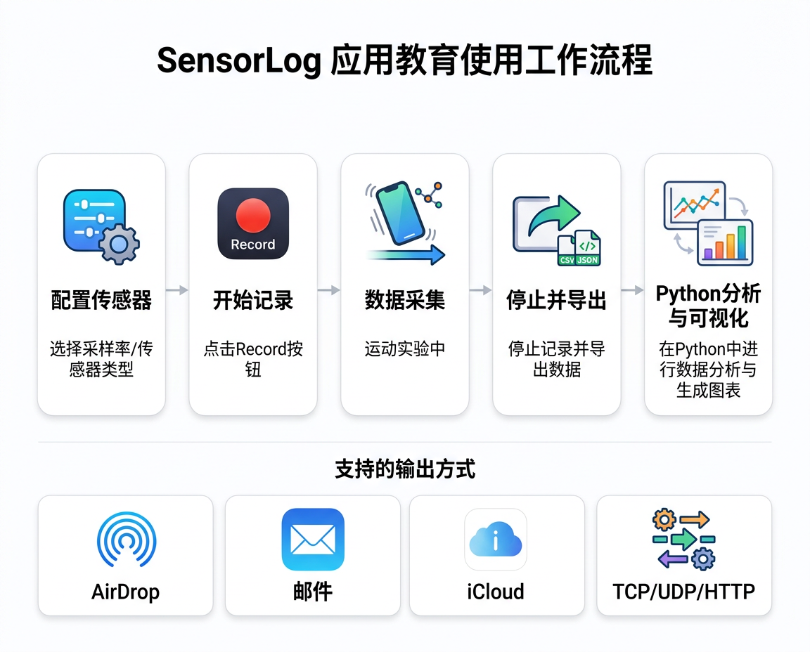
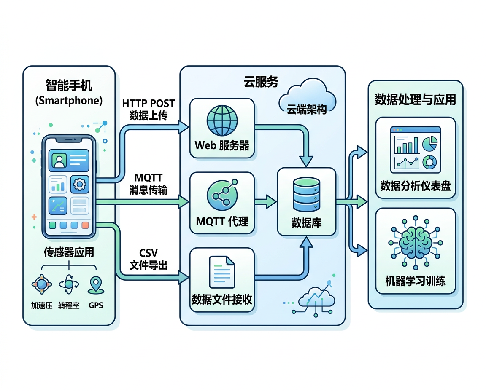

# SensorLog 使用指南

<figure markdown="span">
  { width="720" }
  <figcaption>SensorLog 数据采集工作流程：配置 → 记录 → 导出 → 分析</figcaption>
</figure>

## App 简介

| 属性 | 值 |
|:-----|:---|
| 名称 | SensorLog |
| 平台 | iOS (iPhone / iPad / Apple Watch) |
| 开发者 | Bernd Thomas |
| App Store ID | 388014573 |
| 价格 | 付费 (~CHF 3.00 / ¥22) |

---

## 支持的传感器

| 传感器 | iOS 框架类 | 数据字段 |
|:-------|:----------|:---------|
| 加速度计 | `CMAccelerometerData` | accelerometerAccelerationX/Y/Z |
| 陀螺仪 | `CMGyroData` | gyroRotationX/Y/Z |
| 磁力计 | `CMMagnetometerData` | magnetometerX/Y/Z |
| 设备运动 | `CMDeviceMotion` | attitude (roll/pitch/yaw), userAcceleration, gravity, heading |
| GPS 位置 | `CLLocation` | latitude, longitude, altitude, speed, course |
| 气压计 | `CMAltimeter` | pressure, relativeAltitude |
| 音频 | `AVAudioEngine` | audioLevel (dB) |

---

## 基本操作

### 1. 配置采集参数

启动 App 后进入设置页面:

- **采样率 (Sample Rate)**: 建议 50 Hz 用于运动类实验,10 Hz 用于 GPS 实验
- **选择传感器**: 勾选需要采集的传感器类型
- **输出格式**: CSV 或 JSON

### 2. 开始/停止记录

- 点击 **Record** 按钮开始记录
- 运动过程中保持 App 在前台
- 点击 **Stop** 结束记录

### 3. 数据导出

- 记录完成后,在历史记录中选择数据文件
- 通过 **Share** 按钮导出:
    - AirDrop 传到电脑
    - 邮件发送
    - 保存到 iCloud Drive / Files

### 4. 网络流式传输

SensorLog 支持实时推送数据到服务器:

| 协议 | 配置 |
|:-----|:-----|
| TCP | 设置目标 IP 和端口 |
| UDP | 设置目标 IP 和端口 |
| HTTP POST | 设置 URL 端点 |
| HTTP GET | 设置 URL (数据作为查询参数) |

---

## 数据上云方案

<figure markdown="span">
  { width="780" }
  <figcaption>手机传感器数据上云处理的整体架构</figcaption>
</figure>

将手机传感器数据传到云端处理,主要有 **实时推送** 和 **离线上传** 两类路线。

### 路线一: HTTP POST 实时推送

最简单的上云方式 — App 直接将每帧数据 POST 到你的服务器。

#### SensorLog 配置

1. 进入 SensorLog **Settings → Push**
2. 选择 **HTTP POST**
3. 填入云端接收 URL,例如 `https://your-server.com/api/sensor`
4. 数据以 CSV 字段名作为 POST 参数发送

#### Sensor Logger 配置

1. 进入 **设置 → Push URL**
2. 填入接收端 URL
3. 推送频率默认 1 次/秒 (付费版可调)
4. 数据以 JSON 格式 POST

Sensor Logger 的 JSON Payload 格式:

```json
{
  "messageId": 42,
  "sessionId": "a1b2c3d4",
  "deviceId": "iPhone-XYZ",
  "payload": [
    {
      "name": "accelerometer",
      "time": 1711526400000000000,
      "values": {
        "x": 0.023,
        "y": -0.981,
        "z": 0.045
      }
    },
    {
      "name": "gyroscope",
      "time": 1711526400000000000,
      "values": {
        "x": 0.001,
        "y": -0.003,
        "z": 0.007
      }
    }
  ]
}
```

!!! info "时间戳"
    `time` 字段为 UTC 纳秒级 epoch 时间戳,可用 `pd.to_datetime(t, unit='ns')` 转换。

#### 云端接收服务 (Flask 示例)

```python
from flask import Flask, request, jsonify
import json
import csv
import os
from datetime import datetime

app = Flask(__name__)

DATA_DIR = "sensor_data"
os.makedirs(DATA_DIR, exist_ok=True)

@app.route("/api/sensor", methods=["POST"])
def receive_sensor_data():
    """接收 Sensor Logger 推送的 JSON 数据"""
    data = request.get_json()

    session_id = data.get("sessionId", "unknown")
    device_id = data.get("deviceId", "unknown")

    # 按 session 存储到 CSV
    filepath = os.path.join(DATA_DIR, f"{session_id}.csv")
    file_exists = os.path.exists(filepath)

    with open(filepath, "a", newline="") as f:
        writer = csv.writer(f)
        if not file_exists:
            writer.writerow(["timestamp", "sensor", "x", "y", "z", "device"])

        for item in data.get("payload", []):
            values = item.get("values", {})
            writer.writerow([
                item.get("time"),
                item.get("name"),
                values.get("x", ""),
                values.get("y", ""),
                values.get("z", ""),
                device_id
            ])

    return jsonify({"status": "ok"}), 200

if __name__ == "__main__":
    app.run(host="0.0.0.0", port=5000)
```

部署到云服务器 (如阿里云 ECS / 腾讯云 CVM / AWS EC2) 后,填入公网 URL 即可接收数据。

---

### 路线二: MQTT 消息队列 (推荐用于多设备)

MQTT 是 IoT 领域标准的轻量消息协议,适合多台手机同时采集、实时性要求高的场景。

#### 架构

```
手机 A ──publish──►                    ──subscribe──► 实时仪表盘
手机 B ──publish──► MQTT Broker (云端) ──subscribe──► 数据存储服务
手机 C ──publish──►                    ──subscribe──► AI 推理服务
```

#### Sensor Logger MQTT 配置

1. 进入 **设置 → Push via MQTT**
2. 填入 Broker 地址: `wss://broker.emqx.io:8084/mqtt` (公共测试) 或自建 Broker
3. 设置 Topic: `sensor/${deviceId}/${sessionId}`
4. 用户名/密码 (按 Broker 要求)
5. QoS 0 (至多一次,低延迟)

!!! warning "注意"
    Sensor Logger 的 MQTT 仅支持 **WebSocket (wss://)** 传输,不支持原生 TCP 的 1883 端口。

#### 常用 MQTT Broker

| Broker | 类型 | 地址 | 说明 |
|:-------|:-----|:-----|:-----|
| **EMQX Cloud** | 托管服务 | `wss://xxx.emqxsl.cn:8084` | 国内访问快,免费 Serverless 版 |
| **HiveMQ Cloud** | 托管服务 | `wss://xxx.hivemq.cloud:8884` | 免费 100 连接 |
| **EMQX (自建)** | 开源 | Docker 部署 | 适合私有化部署 |
| **Mosquitto (自建)** | 开源 | Docker 部署 | 轻量级 |

#### 云端订阅与存储 (Python 示例)

```python
import paho.mqtt.client as mqtt
import json
import sqlite3
from datetime import datetime

# 初始化数据库
conn = sqlite3.connect("sensor_data.db")
conn.execute("""
    CREATE TABLE IF NOT EXISTS readings (
        id INTEGER PRIMARY KEY AUTOINCREMENT,
        timestamp TEXT,
        device_id TEXT,
        session_id TEXT,
        sensor_name TEXT,
        x REAL, y REAL, z REAL
    )
""")

def on_message(client, userdata, msg):
    """收到 MQTT 消息时写入数据库"""
    data = json.loads(msg.payload.decode())
    session_id = data.get("sessionId", "")
    device_id = data.get("deviceId", "")

    for item in data.get("payload", []):
        values = item.get("values", {})
        conn.execute(
            "INSERT INTO readings (timestamp, device_id, session_id, sensor_name, x, y, z) VALUES (?,?,?,?,?,?,?)",
            [
                datetime.utcnow().isoformat(),
                device_id,
                session_id,
                item.get("name"),
                values.get("x"),
                values.get("y"),
                values.get("z"),
            ]
        )
    conn.commit()

client = mqtt.Client(transport="websockets")
client.tls_set()  # wss 需要 TLS
client.on_message = on_message
client.connect("broker.emqx.io", 8084)
client.subscribe("sensor/#")  # 订阅所有设备
client.loop_forever()
```

---

### 路线三: 离线文件上传

适合采样完成后批量上传,对实时性没有要求的场景。

| 方式 | 步骤 | 适用 |
|:-----|:-----|:-----|
| **iCloud / Google Drive** | App 导出 CSV → 保存到云盘 → 电脑或服务器同步 | 个人实验 |
| **脚本批量上传** | 导出 CSV → Python 脚本 POST 到 API | 批量补传 |
| **对象存储** | 上传 CSV 到 OSS/S3 → 触发云函数处理 | 自动化流水线 |

批量上传脚本示例:

```python
import requests
import glob

API_URL = "https://your-server.com/api/upload"

for filepath in glob.glob("sensor_data/*.csv"):
    with open(filepath, "rb") as f:
        resp = requests.post(API_URL, files={"file": f})
        print(f"{filepath}: {resp.status_code}")
```

---

### 路线对比

| 对比项 | HTTP POST | MQTT | 离线上传 |
|:-------|:----------|:-----|:---------|
| 实时性 | 准实时 (~1s) | 实时 (~200ms) | 非实时 |
| 多设备支持 | 一般 (每设备一个连接) | 优秀 (发布/订阅解耦) | 优秀 |
| 实现复杂度 | 低 (一个 Flask 路由) | 中 (需要 Broker) | 低 |
| 断网容错 | 数据丢失 | 数据丢失 | 不丢失 |
| 适合场景 | 单人/少量设备快速验证 | 多人课堂同时采集 | 采完后批量分析 |
| SensorLog 支持 | HTTP POST/GET | 不支持 | CSV 导出 |
| Sensor Logger 支持 | HTTP POST | MQTT (WSS) | CSV/JSON 导出 |

!!! tip "教学场景推荐"
    - **个人实验**: HTTP POST + Flask,最简单
    - **全班同时采集**: MQTT + Sensor Logger,每个学生手机是一个 Publisher
    - **课后作业**: 离线 CSV 导出 + Python 分析,零门槛

---

### 云平台快速入门

如果不想自建服务器,可以使用云平台托管方案:

#### 方案 A: 阿里云 IoT + 函数计算

```
Sensor Logger → MQTT → 阿里云 IoT Platform → 规则引擎 → 函数计算 → 表格存储 OTS
```

1. 创建阿里云 IoT 产品和设备
2. App 配置 MQTT Broker 地址为阿里云 IoT 接入点
3. 规则引擎将数据转发到函数计算或表格存储
4. 在 DataV 或 Grafana 上可视化

#### 方案 B: AWS IoT Core + S3 + Lambda

```
Sensor Logger → MQTT → AWS IoT Core → IoT Rule → Lambda → S3 / DynamoDB
```

#### 方案 C: Grafana Cloud (免费额度)

适合快速搭建可视化仪表盘:

```
Sensor Logger → HTTP POST → Telegraf (中继) → InfluxDB Cloud → Grafana Dashboard
```

社区项目 [sensorlogger-telegraf](https://github.com/tszheichoi/awesome-sensor-logger) 提供了现成的 Telegraf 配置。

---

## CSV 数据格式

导出的 CSV 文件示例:

```csv
loggingTime,accelerometerAccelerationX,accelerometerAccelerationY,accelerometerAccelerationZ,gyroRotationX,gyroRotationY,gyroRotationZ
2026-03-27T10:00:00.000+0800,0.0234,-0.9812,0.0456,0.0012,-0.0034,0.0078
2026-03-27T10:00:00.020+0800,0.0256,-0.9798,0.0445,0.0015,-0.0031,0.0082
```

---

## Python 数据加载

```python
import pandas as pd
import matplotlib.pyplot as plt

# 加载 CSV
df = pd.read_csv("sensorlog_data.csv")

# 解析时间戳
df['loggingTime'] = pd.to_datetime(df['loggingTime'])
df['elapsed'] = (df['loggingTime'] - df['loggingTime'].iloc[0]).dt.total_seconds()

# 绘制加速度计数据
fig, axes = plt.subplots(3, 1, figsize=(12, 8), sharex=True)

for i, axis in enumerate(['X', 'Y', 'Z']):
    col = f'accelerometerAcceleration{axis}'
    if col in df.columns:
        axes[i].plot(df['elapsed'], df[col], linewidth=0.5)
        axes[i].set_ylabel(f'Accel {axis} (g)')
        axes[i].grid(True, alpha=0.3)

axes[2].set_xlabel('时间 (s)')
fig.suptitle('加速度计原始数据')
plt.tight_layout()
plt.savefig('accelerometer_plot.png', dpi=150)
plt.show()
```

---

## 替代方案: Sensor Logger (免费)

如果不想购买 SensorLog,可以使用免费的 **Sensor Logger** (iOS/Android):

| 特性 | SensorLog | Sensor Logger |
|:-----|:----------|:-------------|
| 价格 | 付费 | 免费 |
| 平台 | iOS | iOS + Android |
| 传感器覆盖 | 全面 | 全面 |
| 导出格式 | CSV / JSON | CSV / JSON |
| 网络流式 | TCP/UDP/HTTP | HTTP POST |
| Apple Watch | 支持 | 支持 |
| Core ML | 支持 | 不支持 |

Sensor Logger 官网: [https://www.tszheichoi.com/sensorlogger](https://www.tszheichoi.com/sensorlogger)

---

## 延伸阅读

- [SensorLog App Store 页面](https://apps.apple.com/app/sensorlog/id388014573)
- [Sensor Logger GitHub 社区](https://github.com/tszheichoi/awesome-sensor-logger)
