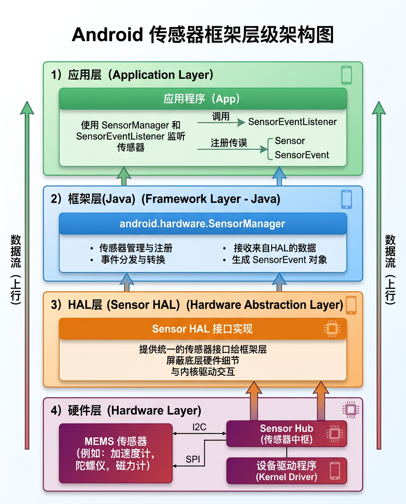

# Android 传感器 API

<figure markdown="span">
  { width="560" }
  <figcaption>Android 传感器框架分层架构：应用层 → 框架层 → HAL 层 → 硬件层</figcaption>
</figure>

## 框架概述

Android 传感器框架位于 `android.hardware` 包中,核心类:

| 类 | 作用 |
|:---|:-----|
| `SensorManager` | 传感器管理器,获取传感器实例、注册监听 |
| `Sensor` | 表示一个物理或虚拟传感器 |
| `SensorEvent` | 传感器数据事件 |
| `SensorEventListener` | 数据回调接口 |

---

## 基本使用流程

### 1. 获取传感器管理器

=== "Kotlin"

    ```kotlin
    val sensorManager = getSystemService(Context.SENSOR_SERVICE) as SensorManager
    ```

=== "Java"

    ```java
    SensorManager sensorManager = (SensorManager) getSystemService(Context.SENSOR_SERVICE);
    ```

### 2. 枚举可用传感器

=== "Kotlin"

    ```kotlin
    // 获取所有传感器
    val allSensors: List<Sensor> = sensorManager.getSensorList(Sensor.TYPE_ALL)
    for (sensor in allSensors) {
        Log.d("Sensor", "${sensor.name} | ${sensor.vendor} | Type: ${sensor.type}")
    }

    // 获取特定类型传感器
    val accelerometer: Sensor? = sensorManager.getDefaultSensor(Sensor.TYPE_ACCELEROMETER)
    if (accelerometer != null) {
        Log.d("Sensor", "加速度计可用: ${accelerometer.name}")
    } else {
        Log.d("Sensor", "设备无加速度计")
    }
    ```

### 3. 注册传感器监听

=== "Kotlin"

    ```kotlin
    class SensorActivity : AppCompatActivity(), SensorEventListener {

        private lateinit var sensorManager: SensorManager
        private var accelerometer: Sensor? = null

        override fun onCreate(savedInstanceState: Bundle?) {
            super.onCreate(savedInstanceState)
            sensorManager = getSystemService(Context.SENSOR_SERVICE) as SensorManager
            accelerometer = sensorManager.getDefaultSensor(Sensor.TYPE_ACCELEROMETER)
        }

        override fun onResume() {
            super.onResume()
            accelerometer?.let {
                sensorManager.registerListener(
                    this,
                    it,
                    SensorManager.SENSOR_DELAY_NORMAL  // 采样率
                )
            }
        }

        override fun onPause() {
            super.onPause()
            sensorManager.unregisterListener(this)  // 务必注销,否则耗电
        }

        override fun onSensorChanged(event: SensorEvent) {
            when (event.sensor.type) {
                Sensor.TYPE_ACCELEROMETER -> {
                    val x = event.values[0]  // m/s²
                    val y = event.values[1]
                    val z = event.values[2]
                    Log.d("Accel", "x=$x, y=$y, z=$z")
                }
            }
        }

        override fun onAccuracyChanged(sensor: Sensor, accuracy: Int) {
            // 精度变化回调
        }
    }
    ```

### 4. 采样率选项

| 常量 | 延迟 | 频率 (约) | 适用场景 |
|:-----|:-----|:---------|:---------|
| `SENSOR_DELAY_NORMAL` | ~200 ms | ~5 Hz | 屏幕旋转 |
| `SENSOR_DELAY_UI` | ~60 ms | ~16 Hz | UI 动画 |
| `SENSOR_DELAY_GAME` | ~20 ms | ~50 Hz | 游戏控制 |
| `SENSOR_DELAY_FASTEST` | ~0 ms | 硬件最大 | 数据采集 |
| 自定义微秒值 | 自定义 | 自定义 | 精确控制 |

!!! warning "注意事项"
    - `onPause()` 中必须调用 `unregisterListener()`,否则传感器持续工作导致电量消耗
    - 指定的延迟是**建议值**,实际采样率由硬件决定
    - 高采样率会显著增加功耗和 CPU 负载

---

## 多传感器同时采集

```kotlin
class MultiSensorLogger : SensorEventListener {

    private lateinit var sensorManager: SensorManager
    private val sensorTypes = listOf(
        Sensor.TYPE_ACCELEROMETER,
        Sensor.TYPE_GYROSCOPE,
        Sensor.TYPE_MAGNETIC_FIELD,
        Sensor.TYPE_PRESSURE,
        Sensor.TYPE_LIGHT
    )

    fun startLogging(context: Context) {
        sensorManager = context.getSystemService(Context.SENSOR_SERVICE) as SensorManager

        for (type in sensorTypes) {
            sensorManager.getDefaultSensor(type)?.let { sensor ->
                sensorManager.registerListener(
                    this, sensor, SensorManager.SENSOR_DELAY_GAME
                )
            }
        }
    }

    override fun onSensorChanged(event: SensorEvent) {
        val timestamp = event.timestamp  // 纳秒级时间戳
        val sensorName = event.sensor.name
        val values = event.values.joinToString(", ")
        Log.d("SensorLog", "$timestamp | $sensorName | $values")
    }

    override fun onAccuracyChanged(sensor: Sensor, accuracy: Int) {}

    fun stopLogging() {
        sensorManager.unregisterListener(this)
    }
}
```

---

## 常用传感器数据格式

| 传感器类型 | values[0] | values[1] | values[2] |
|:----------|:----------|:----------|:----------|
| ACCELEROMETER | x (m/s²) | y (m/s²) | z (m/s²) |
| GYROSCOPE | x (rad/s) | y (rad/s) | z (rad/s) |
| MAGNETIC_FIELD | x (μT) | y (μT) | z (μT) |
| PRESSURE | 气压 (hPa) | — | — |
| LIGHT | 照度 (lux) | — | — |
| PROXIMITY | 距离 (cm) | — | — |

---

## 延伸阅读

- [Android 传感器概览](https://developer.android.com/develop/sensors-and-location/sensors/sensors_overview)
- [Android 运动传感器](https://developer.android.com/develop/sensors-and-location/sensors/sensors_motion)
- [Android 环境传感器](https://developer.android.com/develop/sensors-and-location/sensors/sensors_environment)
- [Android 位置传感器](https://developer.android.com/develop/sensors-and-location/sensors/sensors_position)
