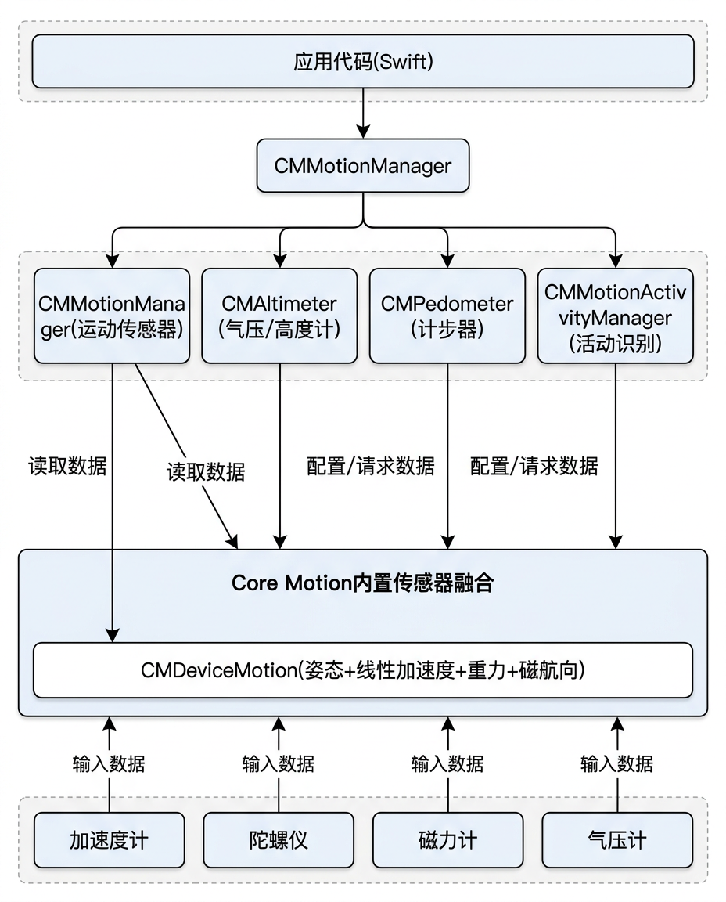

# iOS Core Motion

<figure markdown="span">
  { width="560" }
  <figcaption>iOS Core Motion 框架架构：CMMotionManager、CMAltimeter、CMPedometer</figcaption>
</figure>

## 框架概述

iOS 的传感器数据主要通过以下框架访问:

| 框架 | 负责传感器 |
|:-----|:----------|
| **Core Motion** | 加速度计、陀螺仪、磁力计、气压计、计步器、设备运动 |
| **Core Location** | GPS/GNSS、指南针方向 |
| **ARKit** | LiDAR、深度相机、面部追踪 |

Core Motion 的核心类:

| 类 | 作用 |
|:---|:-----|
| `CMMotionManager` | 运动传感器管理器 |
| `CMAltimeter` | 气压/高度计 |
| `CMPedometer` | 计步器 |
| `CMMotionActivityManager` | 活动识别 (走路/跑步/驾车) |

---

## 权限配置

Core Motion 大部分传感器 (加速度计、陀螺仪、磁力计) 不需要权限。但以下功能需要在 `Info.plist` 中声明:

| Key | 说明 | 何时需要 |
|:----|:-----|:---------|
| `NSMotionUsageDescription` | 运动数据使用说明 | CMMotionActivityManager、CMPedometer |
| `NSLocationWhenInUseUsageDescription` | 位置使用说明 | CLLocationManager |
| `NSLocationAlwaysAndWhenInUseUsageDescription` | 持续位置使用说明 | 后台定位 |

```swift
import CoreMotion

func checkMotionPermission() {
    // 检查运动活动权限状态
    switch CMMotionActivityManager.authorizationStatus() {
    case .authorized:
        print("运动数据: 已授权")
    case .denied:
        print("运动数据: 被拒绝 — 请在设置中开启")
    case .restricted:
        print("运动数据: 受限 (家长控制等)")
    case .notDetermined:
        print("运动数据: 未决定 — 将在首次使用时弹窗")
        // 触发权限请求: 创建 CMMotionActivityManager 并开始查询即可
        let manager = CMMotionActivityManager()
        manager.queryActivityStarting(from: Date(), to: Date(), to: .main) { _, _ in }
    @unknown default:
        break
    }
}
```

---

## 基本使用

### 1. 创建 MotionManager

```swift
import CoreMotion

class SensorViewController: UIViewController {

    let motionManager = CMMotionManager()

    override func viewDidLoad() {
        super.viewDidLoad()

        // 检查传感器可用性
        print("加速度计: \(motionManager.isAccelerometerAvailable)")
        print("陀螺仪: \(motionManager.isGyroAvailable)")
        print("磁力计: \(motionManager.isMagnetometerAvailable)")
        print("设备运动: \(motionManager.isDeviceMotionAvailable)")
    }
}
```

### 2. 获取加速度计数据

```swift
// 设置采样间隔 (秒)
motionManager.accelerometerUpdateInterval = 0.02  // 50 Hz

// 开始接收数据
motionManager.startAccelerometerUpdates(to: .main) { data, error in
    guard let accelData = data else { return }

    let x = accelData.acceleration.x  // g (1g = 9.81 m/s²)
    let y = accelData.acceleration.y
    let z = accelData.acceleration.z

    print("Accel: x=\(x), y=\(y), z=\(z)")
}

// 停止
// motionManager.stopAccelerometerUpdates()
```

### 3. 获取陀螺仪数据

```swift
motionManager.gyroUpdateInterval = 0.02

motionManager.startGyroUpdates(to: .main) { data, error in
    guard let gyroData = data else { return }

    let x = gyroData.rotationRate.x  // rad/s
    let y = gyroData.rotationRate.y
    let z = gyroData.rotationRate.z

    print("Gyro: x=\(x), y=\(y), z=\(z)")
}
```

### 4. 使用 Device Motion (传感器融合)

!!! tip "推荐"
    `CMDeviceMotion` 是 Core Motion 中最强大的接口,它将加速度计、陀螺仪、磁力计的数据经过传感器融合后输出,提供高质量的姿态、线性加速度和重力信息。

```swift
motionManager.deviceMotionUpdateInterval = 0.02

// 使用磁力计辅助的参考坐标系
motionManager.startDeviceMotionUpdates(
    using: .xMagneticNorthZVertical,
    to: .main
) { motion, error in
    guard let m = motion else { return }

    // 姿态 (欧拉角)
    let pitch = m.attitude.pitch  // 俯仰 (rad)
    let roll  = m.attitude.roll   // 横滚 (rad)
    let yaw   = m.attitude.yaw    // 偏航 (rad)

    // 姿态 (四元数)
    let q = m.attitude.quaternion
    // q.x, q.y, q.z, q.w

    // 线性加速度 (去除重力)
    let userAccel = m.userAcceleration  // g
    // userAccel.x, userAccel.y, userAccel.z

    // 重力方向
    let gravity = m.gravity  // g
    // gravity.x, gravity.y, gravity.z

    // 磁场
    let heading = m.heading  // 磁航向 (度)

    print("Pitch: \(pitch), Roll: \(roll), Yaw: \(yaw)")
}
```

---

## 气压计 / 高度计

```swift
import CoreMotion

let altimeter = CMAltimeter()

if CMAltimeter.isRelativeAltitudeAvailable() {
    altimeter.startRelativeAltitudeUpdates(to: .main) { data, error in
        guard let altData = data else { return }

        let pressure = altData.pressure.doubleValue  // kPa
        let relativeAlt = altData.relativeAltitude.doubleValue  // m (相对高度变化)

        print("气压: \(pressure) kPa, 相对高度变化: \(relativeAlt) m")
    }
}
```

---

## 计步器

```swift
let pedometer = CMPedometer()

if CMPedometer.isStepCountingAvailable() {
    pedometer.startUpdates(from: Date()) { data, error in
        guard let pedometerData = data else { return }

        let steps = pedometerData.numberOfSteps
        let distance = pedometerData.distance  // 米 (可选)
        let pace = pedometerData.currentPace   // 秒/米 (可选)

        print("步数: \(steps), 距离: \(distance ?? 0) m")
    }
}
```

---

## 后台执行

iOS 对后台传感器访问有严格限制。常用的后台传感器采集方案:

| 后台模式 | 用途 | 限制 |
|:---------|:-----|:-----|
| `location` | 持续 GPS 定位 | 需要持续位置更新,状态栏显示图标 |
| `processing` | 后台数据处理 | BGProcessingTask,系统调度执行 |
| `bluetooth-central` | BLE 设备通信 | 可后台接收 BLE 传感器数据 |

```swift
import BackgroundTasks

// 1. 在 AppDelegate 中注册后台任务
func application(_ application: UIApplication,
                 didFinishLaunchingWithOptions launchOptions: [UIApplication.LaunchOptionsKey: Any]?) -> Bool {

    BGTaskScheduler.shared.register(
        forTaskWithIdentifier: "com.example.sensorLog",
        using: nil
    ) { task in
        self.handleSensorLogTask(task as! BGProcessingTask)
    }
    return true
}

// 2. 处理后台采集任务
func handleSensorLogTask(_ task: BGProcessingTask) {
    let motionManager = CMMotionManager()
    motionManager.accelerometerUpdateInterval = 0.1  // 10 Hz
    var samples: [(Double, Double, Double)] = []

    motionManager.startAccelerometerUpdates(to: .main) { data, _ in
        guard let d = data else { return }
        samples.append((d.acceleration.x, d.acceleration.y, d.acceleration.z))
    }

    // 30 秒后结束
    DispatchQueue.main.asyncAfter(deadline: .now() + 30) {
        motionManager.stopAccelerometerUpdates()
        print("后台采集完成: \(samples.count) 个样本")
        task.setTaskCompleted(success: true)
    }

    task.expirationHandler = {
        motionManager.stopAccelerometerUpdates()
    }
}
```

!!! warning "电池影响"
    持续后台传感器采集会显著影响电池寿命。建议使用较低的采样率,并在不需要时及时停止。系统可能在电量低时终止后台任务。

---

## 生命周期管理

正确管理传感器更新的启停,避免内存泄漏和不必要的功耗:

### Push 模式 vs Pull 模式

| 模式 | API | 适用场景 | 线程 |
|:-----|:----|:---------|:-----|
| **Push (推送)** | `startUpdates(to: queue) { handler }` | 实时响应,UI 更新 | 回调在指定队列 |
| **Pull (轮询)** | `startUpdates()` + 访问 `.accelerometerData` | 游戏循环,自控采样 | 调用者线程 |

### 生命周期绑定

```swift
class SensorViewController: UIViewController {

    let motionManager = CMMotionManager()

    override func viewWillAppear(_ animated: Bool) {
        super.viewWillAppear(animated)
        // 页面可见时开始采集
        guard motionManager.isDeviceMotionAvailable else { return }
        motionManager.deviceMotionUpdateInterval = 0.02   // 50 Hz
        motionManager.startDeviceMotionUpdates(
            using: .xMagneticNorthZVertical,
            to: .main
        ) { motion, error in
            guard let m = motion else { return }
            print("Pitch: \(m.attitude.pitch), Roll: \(m.attitude.roll)")
        }
    }

    override func viewWillDisappear(_ animated: Bool) {
        super.viewWillDisappear(animated)
        // 页面不可见时停止采集 — 避免无效功耗
        motionManager.stopDeviceMotionUpdates()
    }

    deinit {
        // 安全清理
        motionManager.stopDeviceMotionUpdates()
        motionManager.stopAccelerometerUpdates()
        motionManager.stopGyroUpdates()
    }
}
```

---

## iOS 与 Android 传感器 API 对比

| 对比项 | Android | iOS |
|:-------|:--------|:----|
| 原始加速度计 | `TYPE_ACCELEROMETER` | `startAccelerometerUpdates` |
| 原始陀螺仪 | `TYPE_GYROSCOPE` | `startGyroUpdates` |
| 原始磁力计 | `TYPE_MAGNETIC_FIELD` | `startMagnetometerUpdates` |
| 融合姿态 | `TYPE_ROTATION_VECTOR` | `CMDeviceMotion.attitude` |
| 线性加速度 | `TYPE_LINEAR_ACCELERATION` | `CMDeviceMotion.userAcceleration` |
| 重力 | `TYPE_GRAVITY` | `CMDeviceMotion.gravity` |
| 气压 | `TYPE_PRESSURE` | `CMAltimeter.pressure` |
| 计步 | `TYPE_STEP_COUNTER` | `CMPedometer` |
| 加速度单位 | m/s² | g (1g = 9.81 m/s²) |

!!! warning "单位差异"
    Android 加速度计返回 **m/s²**,iOS 返回 **g** (重力加速度倍数)。开发时需注意转换。

---

## 延伸阅读

- [Apple Core Motion 文档](https://developer.apple.com/documentation/coremotion)
- [Apple CMMotionManager 文档](https://developer.apple.com/documentation/coremotion/cmmotionmanager)
- [Apple Core Location 文档](https://developer.apple.com/documentation/corelocation)
