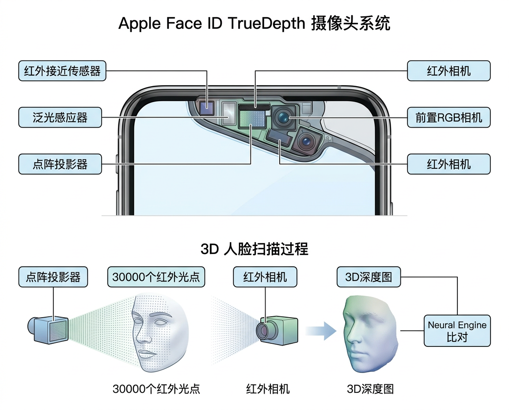
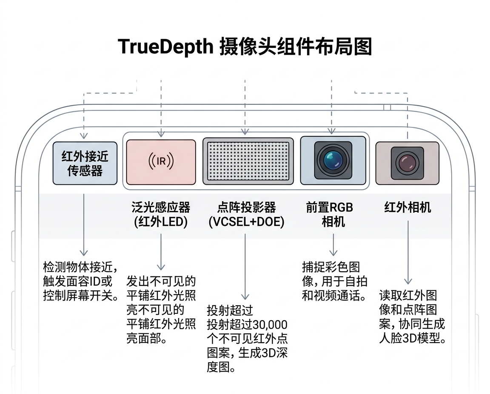
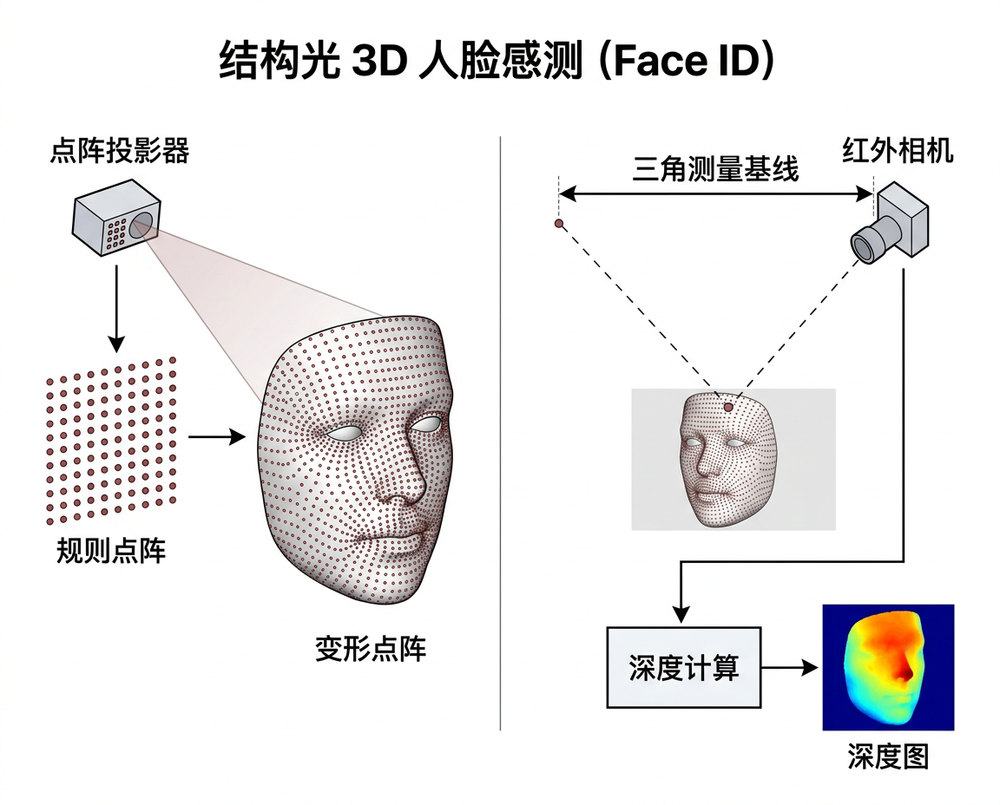

# 面部识别传感器

<figure markdown="span">
  { width="680" }
  <figcaption>Apple Face ID TrueDepth 结构光系统原理</figcaption>
</figure>

## Apple Face ID (TrueDepth 系统)

### 硬件组成

Apple Face ID 使用前置 **TrueDepth 摄像头系统**,包含多个传感器协同工作:

<figure markdown="span">
  { width="680" }
  <figcaption>Apple TrueDepth 模组硬件布局：红外接近传感器、泛光感应器、点阵投影器、前置相机、红外相机</figcaption>
</figure>

| 组件 | 功能 | 技术 |
|:-----|:-----|:-----|
| **泛光感应器** | 红外 LED,均匀照亮面部 | 940 nm 近红外 |
| **点阵投影器** | 投射 ~30,000 个红外光点到面部 | VCSEL + DOE |
| **红外相机** | 接收面部反射的红外点阵图案 | 红外 CMOS |
| **前置 RGB 相机** | 辅助检测,拍照 | 可见光 CMOS |

### 结构光原理

<figure markdown="span">
  { width="640" }
  <figcaption>结构光 3D 成像原理：点阵投影器投射已知图案，红外相机捕捉面部形变后的点阵进行三角测量</figcaption>
</figure>

1. 点阵投影器投射已知规则的红外点阵
2. 点阵打在 3D 面部表面后发生形变
3. 红外相机捕捉形变后的点阵图案
4. 通过三角测量原理,从点阵形变恢复面部 3D 几何
5. Neural Engine 将 3D 几何与注册时的面部模型比对

### 安全性

| 指标 | 数值 |
|:-----|:-----|
| FAR (误识率) | < 1/1,000,000 |
| 对比: Touch ID | < 1/50,000 |
| 活体检测 | 红外+注意力检测 (眼睛注视) |
| 防照片/视频攻击 | 3D 深度信息,无法被 2D 图像欺骗 |
| 防面具攻击 | 红外纹理 + 深度精度 |

---

## Android 面部识别方案

Android 阵营的面部识别方案多样:

### 1. 结构光方案

与 Face ID 原理类似,使用红外点阵投影:

- **搭载机型**: 华为 Mate 20 Pro, OPPO Find X
- **安全性**: 可用于支付级认证

### 2. ToF 方案

使用前置 ToF 传感器获取面部深度信息:

- **搭载机型**: 三星 Galaxy S10 5G, LG G8
- **安全性**: 可用于支付级认证

### 3. 2D RGB 方案

仅使用前置 RGB 相机进行面部识别:

- **搭载机型**: 大部分中低端 Android 手机
- **安全性**: 较低,可能被照片欺骗,通常不可用于支付

---

## 延伸阅读

- [Apple Face ID 安全性白皮书](https://support.apple.com/guide/security/face-id-and-touch-id-security-sec067eb0c9e/web)
- [Apple TrueDepth 技术概述](https://developer.apple.com/documentation/arkit/arfacetrackingconfiguration)
