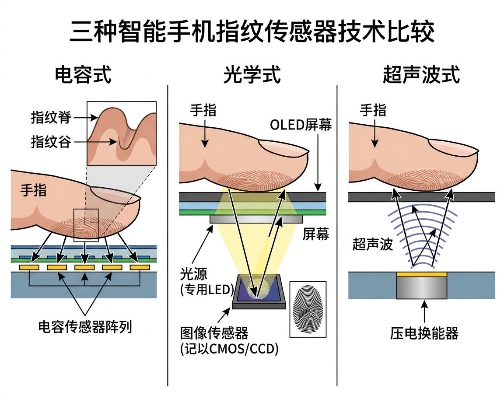

# 指纹传感器 (Fingerprint Sensor)

<figure markdown="span">
  { width="720" }
  <figcaption>电容式、光学屏下、超声波屏下三种指纹传感器原理对比</figcaption>
</figure>

## 三种主流技术

### 1. 电容式指纹传感器

最早应用于手机的指纹技术 (iPhone 5s Touch ID, 2013)。

**原理**: 由密集的微电容阵列构成,手指按压时指纹的脊 (ridge) 与谷 (valley) 与传感器表面的距离不同,产生不同的电容值,从而形成指纹图像。

```
  手指表面
  ╱╲ ╱╲ ╱╲ ╱╲    ← 指纹脊 (ridge)
     ╲╱  ╲╱      ← 指纹谷 (valley)
  ─ ─ ─ ─ ─ ─ ─
  │C₁│C₂│C₃│C₄│  ← 电容传感阵列
  ─ ─ ─ ─ ─ ─ ─
  (C₁ > C₂: 脊处电容大,谷处电容小)
```

| 特性 | 说明 |
|:-----|:-----|
| 位置 | Home 键 / 侧键 / 后置 |
| 分辨率 | 500-508 dpi |
| 优点 | 识别速度快 (<0.5s),功耗低 |
| 缺点 | 需独立区域,不支持屏下 |
| 代表芯片 | FPC1028 (FPC), 汇顶 GF318M |

---

### 2. 光学屏下指纹传感器

2018 年起在 OLED 屏幕手机上普及。

**原理**: OLED 像素发光照亮手指,指纹的脊和谷对光的反射率不同,屏幕下方的 CMOS 图像传感器捕捉反射光形成指纹图像。

```
  手指
  ╱╲ ╱╲ ╱╲ ╱╲
  ────────────────    ← 屏幕盖板玻璃
  │ OLED 像素层  │    ← 发光照亮手指
  ────────────────
  │  光学准直层  │    ← 过滤杂散光
  ────────────────
  │ CMOS 传感器  │    ← 成像
  ────────────────
```

| 特性 | 说明 |
|:-----|:-----|
| 位置 | 屏下 (仅 OLED 屏) |
| 分辨率 | 500-1000 dpi |
| 优点 | 屏下方案,外观一体化 |
| 缺点 | 受屏幕贴膜影响,强光下可能干扰 |
| 代表芯片 | 汇顶 G7, 新思 FS9530 |

---

### 3. 超声波屏下指纹传感器

**原理**: 通过压电材料发射超声波脉冲穿透屏幕盖板,超声波遇到指纹的脊和谷产生不同的反射回波,接收器阵列检测回波强度形成 3D 指纹图像。

```
  手指
  ╱╲ ╱╲ ╱╲ ╱╲
  ────────────────    ← 屏幕盖板玻璃
  │  屏幕显示层  │
  ────────────────
  │  超声波       │
  │  发射/接收    │    ← 压电 MEMS 换能器阵列
  │  阵列         │
  ────────────────
```

| 特性 | 说明 |
|:-----|:-----|
| 位置 | 屏下 (OLED/LCD 均可) |
| 优点 | 不受屏幕贴膜、湿手、油污影响;3D 成像更安全 |
| 缺点 | 成本较高 |
| 代表芯片 | Qualcomm 3D Sonic Gen 2 (识别面积 8×8 mm → 17×17 mm) |

---

## 三种技术对比

| 对比项 | 电容式 | 光学屏下 | 超声波屏下 |
|:-------|:-------|:---------|:----------|
| 成像维度 | 2D | 2D | 3D |
| 湿手解锁 | 差 | 一般 | 好 |
| 安全性 | 中 | 中 | 高 |
| 识别速度 | 快 (<0.3s) | 快 (~0.3s) | 较快 (~0.5s) |
| 屏幕类型 | 任意 | 仅 OLED | OLED/LCD |
| 成本 | 低 | 中 | 高 |
| 识别面积 | 小 (按键) | 中 | 大 (最新可全屏) |

---

## 关键参数解析

### 分辨率与图像质量

FBI 和 ISO 标准要求指纹采集分辨率 ≥ **500 dpi**,以保证细节特征点 (minutiae) 的可靠提取:

| 指标 | FBI 标准 | 典型手机传感器 |
|:-----|:---------|:-------------|
| 分辨率 | ≥ 500 dpi | 500-1000 dpi |
| 灰度级 | 256 级 (8-bit) | 8-bit 或更高 |
| 成像面积 | ≥ 1" × 1" | 4×4 ~ 17×17 mm |

### FAR 与 FRR

| 指标 | 电容式 | 光学屏下 | 超声波屏下 |
|:-----|:------|:---------|:----------|
| FAR (误识率) | 1/50,000 | 1/50,000 | 1/100,000 |
| FRR (拒识率) | ~3% | ~5% | ~3% |
| 模板大小 | 5-10 KB | 5-10 KB | 10-20 KB (3D) |

### 匹配速度

现代手机指纹匹配全流程 (采集→特征提取→比对) 通常在 **200-500 ms** 内完成。匹配算法运行在安全飞地 (TEE/Secure Enclave) 内,指纹模板不会离开安全区域。

---

## 指纹特征提取

指纹识别的核心是提取 **细节特征点 (Minutiae)**:

### 特征点类型

| 特征点 | 英文 | 说明 |
|:------|:-----|:-----|
| **端点** | Ending | 脊线突然终止处 |
| **分叉** | Bifurcation | 一条脊线分成两条 |
| **短脊** | Short Ridge | 很短的独立脊线段 |
| **环** | Island | 脊线围成的封闭区域 |
| **三角点** | Delta | 三条脊线交汇区域 |

```
端点 (Ending):        分叉 (Bifurcation):
                      
  ═══╗                ═══╦═══
     ║                   ║
                         ╠═══
```

典型指纹包含 **40-100 个** 细节特征点。匹配时只需 12-15 个特征点对齐即可确认身份。

---

## 应用实例

### 1. 模拟指纹脊线图案

```python
import numpy as np

def generate_fingerprint_ridges(size=30, freq=0.3, num_orientations=3):
    """生成模拟指纹脊线图案 (正弦波叠加)
    size — 图案尺寸 (size × size)
    freq — 脊线频率
    num_orientations — 叠加方向数
    """
    pattern = np.zeros((size, size))
    angles = np.linspace(0, np.pi, num_orientations, endpoint=False)
    for angle in angles:
        for r in range(size):
            for c in range(size):
                # 沿 angle 方向的正弦波
                x_rot = r * np.cos(angle) + c * np.sin(angle)
                pattern[r, c] += np.sin(2 * np.pi * freq * x_rot)
    # 二值化: >0 为脊, ≤0 为谷
    ridge_map = (pattern > 0).astype(int)
    # ASCII 可视化
    for row in ridge_map:
        print(''.join('█' if v else ' ' for v in row))
    return ridge_map

generate_fingerprint_ridges()
```

### 2. 简易细节特征点检测

```python
import numpy as np

def detect_minutiae(ridge_map):
    """简易细节特征点检测：端点与分叉点
    ridge_map — 二值脊线图 (1=脊, 0=谷)
    """
    rows, cols = ridge_map.shape
    endings = []        # 端点
    bifurcations = []   # 分叉点
    # 8-邻域连接数 (Crossing Number)
    dr = [-1, -1, -1, 0, 1, 1,  1,  0]
    dc = [-1,  0,  1, 1, 1, 0, -1, -1]
    for r in range(1, rows - 1):
        for c in range(1, cols - 1):
            if ridge_map[r, c] == 0:
                continue
            # 计算 Crossing Number
            cn = 0
            for k in range(8):
                cn += abs(int(ridge_map[r+dr[k], c+dc[k]]) -
                          int(ridge_map[r+dr[(k+1)%8], c+dc[(k+1)%8]]))
            cn //= 2
            if cn == 1:
                endings.append((r, c))
            elif cn == 3:
                bifurcations.append((r, c))
    print(f"检测到 {len(endings)} 个端点, {len(bifurcations)} 个分叉点")
    return endings, bifurcations

# 示例: 生成简单脊线图案并检测
size = 25
pattern = np.zeros((size, size))
for r in range(size):
    for c in range(size):
        pattern[r, c] = np.sin(2 * np.pi * 0.3 * (r * 0.7 + c * 0.7))
ridge = (pattern > 0).astype(int)
detect_minutiae(ridge)
```

---

## 延伸阅读

- [Qualcomm 3D Sonic Gen 2](https://www.qualcomm.com/products/features/3d-sonic)
- [Goodix (汇顶) 屏下指纹方案](https://www.goodix.com/en/product/fingerprint)
