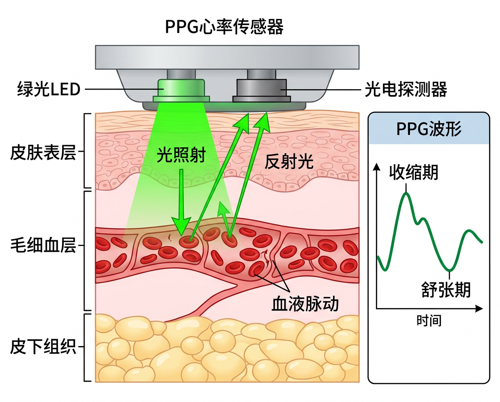
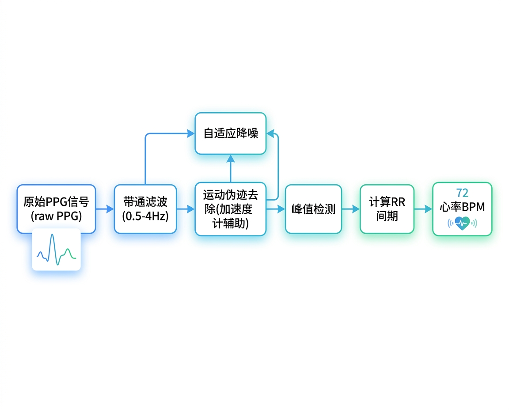

# 心率与血氧传感器

## 心率传感器

### 基本信息

| 属性 | 值 |
|:-----|:---|
| 物理量 | 心率 (脉搏频率) |
| 单位 | BPM (次/分钟) |
| 技术 | PPG (光电容积脉搏波描记法) |
| 精度 | ±2-5 BPM (静息), ±5-10 BPM (运动) |
| Android 常量 | `Sensor.TYPE_HEART_RATE` |
| 搭载设备 | Samsung Galaxy S5-S10, 智能手表 |

### PPG 工作原理

**PPG (Photoplethysmography)** 利用光照射皮肤,检测因血液脉动引起的光吸收变化:

<figure markdown="span">
  { width="640" }
  <figcaption>PPG 光电容积脉搏波传感器工作原理：LED 照射皮肤，检测血液脉动引起的反射光变化</figcaption>
</figure>

**原理:**

1. **心脏收缩期 (Systole)**: 血液充盈毛细血管,血容量增大,光吸收增加,反射光减少
2. **心脏舒张期 (Diastole)**: 血液回流,血容量减小,光吸收减少,反射光增加
3. 光电探测器检测反射光的周期性变化,提取脉搏频率

### 光源选择

| 光源 | 波长 | 穿透深度 | 优点 | 用途 |
|:-----|:-----|:---------|:-----|:-----|
| 绿光 | 525 nm | 浅 (~1mm) | 对血容量变化最敏感 | 心率检测 (手腕) |
| 红光 | 660 nm | 中 (~3mm) | 对氧合血红蛋白敏感 | 血氧检测 |
| 红外 | 940 nm | 深 (~5mm) | 对脱氧血红蛋白敏感 | 血氧检测 |

### 信号处理流程

<figure markdown="span">
  { width="680" }
  <figcaption>PPG 信号处理管线：从原始信号到心率 BPM</figcaption>
</figure>

心率计算:

$$HR = \frac{60}{RR_{interval}} \text{ (BPM)}$$

其中 $RR_{interval}$ 为相邻两个脉搏波峰之间的时间间隔 (秒)。

---

## 血氧传感器 (SpO2)

### 基本信息

| 属性 | 值 |
|:-----|:---|
| 物理量 | 血氧饱和度 |
| 单位 | %SpO2 |
| 正常范围 | 95-100% |
| 精度 | ±2% |
| 搭载设备 | Apple Watch S6+, Samsung Galaxy Watch 3+ |

### 工作原理

血氧检测利用 **氧合血红蛋白 (HbO₂)** 和 **脱氧血红蛋白 (Hb)** 对不同波长光的吸收特性差异:

| 波长 | HbO₂ 吸收 | Hb 吸收 |
|:-----|:----------|:--------|
| 红光 (660 nm) | 低 | **高** |
| 红外 (940 nm) | **高** | 低 |

通过计算红光与红外光吸收的比值 $R$:

$$R = \frac{AC_{red} / DC_{red}}{AC_{ir} / DC_{ir}}$$

$$SpO_2 = a - b \times R$$

其中 $a, b$ 为经验校准常数 (通常 $a \approx 110, b \approx 25$)。

### 反射式 vs 透射式

| 方式 | 原理 | 设备 |
|:-----|:-----|:-----|
| 透射式 | LED 在一侧,探测器在另一侧 | 传统指夹式血氧仪 |
| 反射式 | LED 和探测器在同一侧 | 智能手表、手机 |

手机/手表采用反射式,精度相对较低但使用方便。

---

## 延伸阅读

- [PPG 传感器原理 — Maxim Integrated](https://www.analog.com/en/technical-articles/guidelines-for-spo2-measurement.html)
- [Android TYPE_HEART_RATE 文档](https://developer.android.com/reference/android/hardware/Sensor#TYPE_HEART_RATE)
- [Apple HealthKit 文档](https://developer.apple.com/documentation/healthkit)
