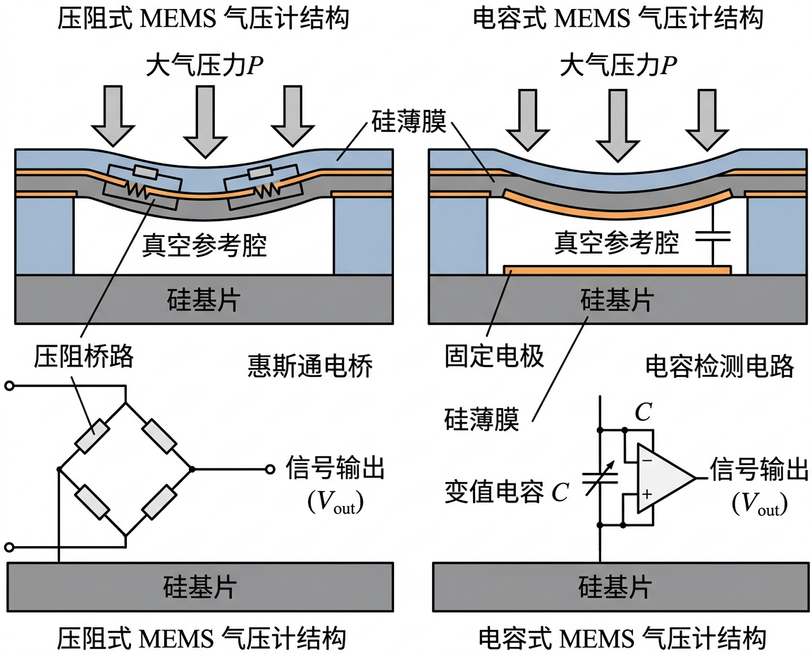
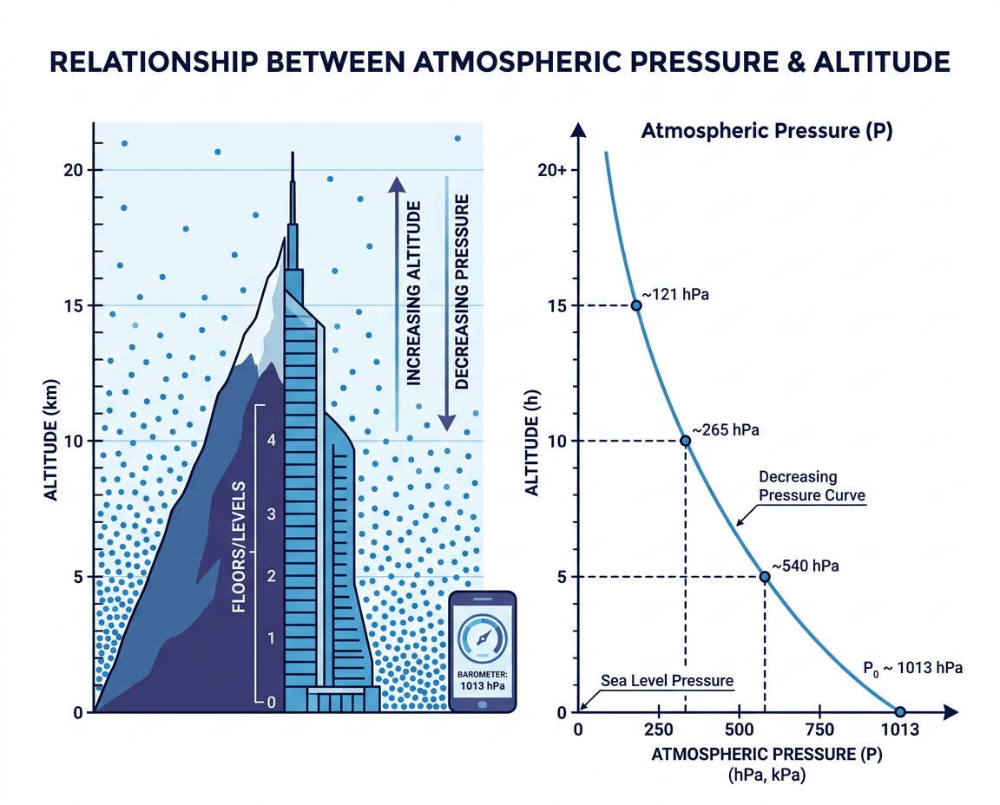

# 气压计 (Barometer)

## 基本信息

| 属性 | 值 |
|:-----|:---|
| 物理量 | 大气压力 |
| 量程 | 300-1100 hPa |
| 单位 | hPa (百帕) 或 mbar |
| 分辨率 | 0.01-0.06 hPa |
| 精度 | ±0.5-±1 hPa (绝对), ±0.06-±0.12 hPa (相对) |
| 采样率 | 1-200 Hz |
| 功耗 | ~3-5 μA |
| Android 常量 | `Sensor.TYPE_PRESSURE` |
| iOS 框架 | `CMAltimeter` (Core Motion) |

---

## 工作原理

### MEMS 压阻式气压计

在硅基片上刻蚀出一个密封的真空腔,上方覆盖一层薄膜。薄膜上布有压阻桥路:

<figure markdown="span">
  { width="600" }
  <figcaption>MEMS 压阻式气压计截面结构：硅薄膜在大气压力下形变</figcaption>
</figure>

薄膜在大气压力下弯曲,引起压阻阻值变化,通过惠斯通电桥检测:

$$\frac{\Delta R}{R} = \pi \cdot \sigma$$

其中 $\pi$ 为压阻系数,$\sigma$ 为应力。

### MEMS 电容式气压计

用两个平行极板构成电容,其中一个极板为可形变的薄膜:

$$C = \varepsilon \frac{A}{d}$$

大气压力使薄膜形变,改变极板间距 $d$,从而改变电容值。

---

## 典型芯片

| 芯片型号 | 厂商 | 类型 | 精度 (相对) | 噪声 (RMS) | 尺寸 |
|:---------|:-----|:-----|:----------|:----------|:-----|
| BMP390 | Bosch | 压阻式 | ±0.03 hPa | 0.02 hPa | 2.0×2.0×0.76 mm |
| BMP581 | Bosch | 压阻式 | ±0.02 hPa | 0.017 hPa | 2.0×2.0×1.0 mm |
| LPS22HH | ST | 压阻式 | ±0.025 hPa | 0.015 hPa | 2.0×2.0×0.73 mm |
| ICP-10111 | TDK | 电容式 | ±0.04 hPa | 0.04 hPa | 2.0×2.0×0.72 mm |

---

## 关键参数解析

### 绝对精度 vs 相对精度

气压计的两种精度指标对应不同的应用场景:

| 指标 | 含义 | 典型值 | 对应高度误差 |
|:-----|:-----|:-------|:-----------|
| **绝对精度** | 测量值与真实气压的偏差 | ±1 hPa | ±8.4 m |
| **相对精度** | 短时间内两次测量的差值精度 | ±0.06 hPa | ±0.5 m |

楼层检测依赖 **相对精度** (检测短时间内的气压变化),而非绝对精度。这就是为什么即使绝对误差较大,气压计仍然能可靠地检测一层楼的变化。

### 噪声与分辨率

气压计的噪声 (RMS) 决定了能检测到的最小气压变化:

$$\Delta h_{min} = 8.4 \text{ m/hPa} \times \sigma_{noise}$$

例如 BMP581 的噪声为 0.017 hPa,对应最小可检测高度变化约 **0.14 m**。

### 温度漂移 (TCO)

气压传感器的零偏会随温度变化:

$$P_{error} = TCO \times (T - T_{ref})$$

典型 TCO 约 ±0.5-1 Pa/°C。在温度变化 20°C 的场景下,可能引入 10-20 Pa (~0.1-0.2 hPa) 的偏差。高精度应用需要进行温度补偿。

---

## 气压与海拔的关系

<figure markdown="span">
  { width="640" }
  <figcaption>大气压力随海拔升高而降低</figcaption>
</figure>

### 气压高度公式

在标准大气条件下,海拔每升高约 8.4 m,气压下降约 1 hPa:

$$h = 44330 \times \left(1 - \left(\frac{P}{P_0}\right)^{0.1903}\right)$$

其中:

- $h$ — 海拔高度 (m)
- $P$ — 当前气压 (hPa)
- $P_0$ — 海平面标准气压 (1013.25 hPa)

### 楼层检测

一层楼 (约 3m) 对应的气压差约 **0.36 hPa**,这就要求气压计有足够高的相对精度。

```python
def pressure_to_altitude(pressure, sea_level_pressure=1013.25):
    """将气压转换为海拔高度 (m)"""
    return 44330.0 * (1.0 - (pressure / sea_level_pressure) ** 0.1903)

def detect_floor_change(p1, p2, floor_height=3.0):
    """检测楼层变化"""
    h1 = pressure_to_altitude(p1)
    h2 = pressure_to_altitude(p2)
    delta_floors = (h2 - h1) / floor_height
    return round(delta_floors)
```

---

## 应用实例

### 1. 气压趋势分析 (天气预警)

```python
import numpy as np

def analyze_pressure_trend(pressures, timestamps_h):
    """气压趋势分析：通过线性回归检测天气变化征兆
    pressures    — 气压读数列表 (hPa)
    timestamps_h — 对应的时间列表 (小时)
    """
    p = np.array(pressures)
    t = np.array(timestamps_h)
    # 简单线性回归: slope = Σ(t-t̄)(p-p̄) / Σ(t-t̄)²
    t_mean, p_mean = t.mean(), p.mean()
    slope = np.sum((t - t_mean) * (p - p_mean)) / np.sum((t - t_mean)**2)
    # 分类
    if slope > 0.5:     trend = "快速上升 → 天气好转"
    elif slope > 0.1:   trend = "缓慢上升 → 趋于晴朗"
    elif slope > -0.1:  trend = "稳定 → 天气持续"
    elif slope > -0.5:  trend = "缓慢下降 → 可能转阴"
    else:               trend = "快速下降 → 可能有暴风雨"
    print(f"气压变化率: {slope:+.2f} hPa/h → {trend}")
    return slope, trend

# 示例: 模拟 6 小时气压读数
times = [0, 1, 2, 3, 4, 5]
pressures = [1013.2, 1012.8, 1012.1, 1011.5, 1010.8, 1010.0]
analyze_pressure_trend(pressures, times)
```

### 2. 卡尔曼滤波平滑高度估计

```python
import numpy as np

def kalman_altitude(pressure_measurements, sea_level=1013.25,
                    process_noise=0.01, measurement_noise=0.5):
    """一维卡尔曼滤波平滑气压高度估计
    pressure_measurements — 气压读数序列 (hPa)
    返回平滑后的高度序列 (米)
    """
    def p2h(p):
        return 44330.0 * (1.0 - (p / sea_level) ** 0.1903)

    raw_alt = [p2h(p) for p in pressure_measurements]
    # 卡尔曼滤波初始化
    x = raw_alt[0]             # 状态估计
    P = 1.0                    # 估计误差协方差
    Q = process_noise          # 过程噪声
    R = measurement_noise      # 测量噪声
    filtered = [x]
    for z in raw_alt[1:]:
        # 预测
        P_pred = P + Q
        # 更新
        K = P_pred / (P_pred + R)
        x = x + K * (z - x)
        P = (1 - K) * P_pred
        filtered.append(x)
    return filtered

# 示例: 含噪声的气压数据
np.random.seed(42)
true_pressures = np.linspace(1013.25, 1009.65, 20)   # 模拟上楼
noisy = true_pressures + np.random.normal(0, 0.3, 20)
smoothed = kalman_altitude(noisy)
print(f"原始高度范围: {44330*(1-(noisy[0]/1013.25)**0.1903):.1f} "
      f"→ {44330*(1-(noisy[-1]/1013.25)**0.1903):.1f} m")
print(f"滤波高度范围: {smoothed[0]:.1f} → {smoothed[-1]:.1f} m")
```

### 气压变化与天气参考

| 气压趋势 | 变化率 (hPa/3h) | 预示天气 |
|:---------|:---------------|:---------|
| 快速上升 | > +1.5 | 天气好转,但可能短暂 |
| 缓慢上升 | +0.3 ~ +1.5 | 晴朗天气持续 |
| 稳定 | -0.3 ~ +0.3 | 当前天气维持 |
| 缓慢下降 | -1.5 ~ -0.3 | 可能转阴或有雨 |
| 快速下降 | < -1.5 | 暴风雨可能来临 |

---

## 延伸阅读

- [Bosch BMP390 数据手册](https://www.bosch-sensortec.com/products/environmental-sensors/pressure-sensors/bmp390/)
- [Android TYPE_PRESSURE 文档](https://developer.android.com/reference/android/hardware/Sensor#TYPE_PRESSURE)
- [Apple CMAltimeter 文档](https://developer.apple.com/documentation/coremotion/cmaltimeter)
