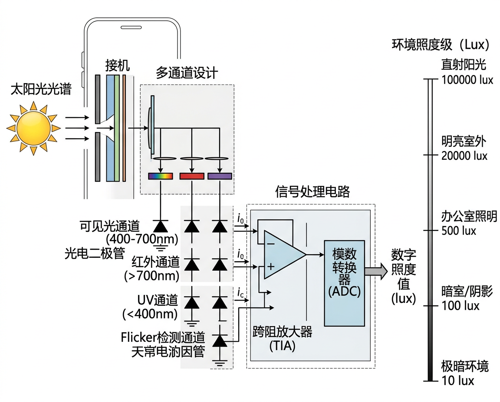

# 环境光传感器 (Ambient Light Sensor)

<figure markdown="span">
  { width="680" }
  <figcaption>环境光传感器多通道光谱响应原理</figcaption>
</figure>

## 基本信息

| 属性 | 值 |
|:-----|:---|
| 物理量 | 光照强度 |
| 量程 | 0.01 - 100,000+ lux |
| 单位 | lux (勒克斯) |
| 采样率 | 1-50 Hz |
| 功耗 | ~2-10 μA |
| Android 常量 | `Sensor.TYPE_LIGHT` |
| iOS 框架 | 系统自动管理 (无直接 API) |

---

## 工作原理

### 光电二极管

环境光传感器的核心是一个或多个**光电二极管** (Photodiode):

1. 光子照射到 PN 结,产生电子-空穴对
2. 在反偏电场作用下,载流子定向移动形成光电流
3. 光电流大小与光照强度成正比
4. 经跨阻放大器 (TIA) 和 ADC 转换后输出数字照度值

### 多通道设计

高端环境光传感器采用多通道设计:

| 通道 | 光谱范围 | 用途 |
|:-----|:---------|:-----|
| 可见光通道 | 400-700 nm | 模拟人眼响应 |
| 红外通道 | >700 nm | 补偿红外光干扰 |
| UV 通道 | <400 nm | 紫外线检测 (部分型号) |
| Flicker 通道 | 宽谱 | 检测人造光源频闪 |

!!! info "Flicker 传感器"
    手机相机在人造光源下拍摄时可能出现频闪条纹。专用 Flicker 检测通道可识别 50 Hz (220V 市电) 或 60 Hz (110V 市电) 的光源频闪,自动调整相机曝光时间。

---

## 典型芯片

| 芯片型号 | 厂商 | 特点 |
|:---------|:-----|:-----|
| TSL2591 | AMS | 高灵敏度,双通道 (可见光+红外) |
| VEML7700 | Vishay | 16-bit 分辨率,I2C 接口 |
| TMD2772 | AMS | 集成环境光 + 接近传感器 |
| BH1750FVI | ROHM | 低成本,直接输出 lux 值 |

---

## 常见光照环境参考值

| 环境 | 照度 (lux) |
|:-----|:----------|
| 星光 | 0.001 |
| 月光 | 0.1-1 |
| 暗室内 | 10-50 |
| 一般室内 | 100-500 |
| 阴天户外 | 1,000-10,000 |
| 晴天阴影 | 10,000-25,000 |
| 直射阳光 | 50,000-120,000 |

---

## 关键参数解析

### 光谱响应与人眼匹配

理想的环境光传感器应匹配 CIE 明视觉函数 $V(\lambda)$ (峰值在 555 nm 绿光)。实际光电二极管的光谱响应往往偏向红外,因此需要:

- **IR 通道** 测量纯红外分量
- **可见光通道** 减去 IR 分量后近似人眼响应
- 公式: $Lux_{corrected} = C_1 \times CH_0 - C_2 \times CH_1$ ($CH_0$ 为全谱通道, $CH_1$ 为 IR 通道)

### 动态范围

手机需要在星光 (0.001 lux) 到直射阳光 (120,000 lux) 的超宽范围内工作,动态范围跨越 **8 个数量级**。传感器通过可调积分时间和增益来覆盖:

| 积分时间 | 灵敏度 | 分辨率 | 适用场景 |
|:---------|:------|:-------|:---------|
| 600 ms | 最高 | 0.01 lux | 星光/月光 |
| 100 ms | 高 | 0.1 lux | 暗室内 |
| 25 ms | 中 | 1 lux | 室内/阴天 |
| 2.8 ms | 低 | 10 lux | 强光户外 |

### 曝光值 (EV)

摄影中用 EV (Exposure Value) 表示光照等级,与 Lux 的关系:

$$EV = \log_2\left(\frac{E_v}{2.5}\right)$$

其中 $E_v$ 为照度 (lux)。EV 每增加 1,光照翻倍。

---

## 应用实例

### 1. 自动亮度算法

```python
import math

def auto_brightness(lux, min_brightness=10, max_brightness=255):
    """自动亮度算法：将环境光照度映射为屏幕亮度
    使用对数映射 (模拟人眼对光的对数响应)
    """
    if lux <= 0:
        return min_brightness
    # 对数映射: 0.1 lux → min, 100000 lux → max
    lux_min, lux_max = 0.1, 100000
    log_min, log_max = math.log10(lux_min), math.log10(lux_max)
    log_lux = math.log10(max(lux, lux_min))
    ratio = (log_lux - log_min) / (log_max - log_min)
    brightness = min_brightness + ratio * (max_brightness - min_brightness)
    return int(max(min_brightness, min(max_brightness, brightness)))

# 示例
for lux in [0.1, 10, 100, 1000, 10000, 100000]:
    print(f"  {lux:>8} lux → 亮度 {auto_brightness(lux):>3}/255")
```

### 2. 光照场景分类

```python
import math

def lux_to_ev(lux):
    """光照度转曝光值 (EV)"""
    if lux <= 0:
        return -10
    return math.log2(lux / 2.5)

def classify_light_scene(lux):
    """根据光照度分类场景"""
    if lux < 1:       return "夜间/星光"
    elif lux < 50:     return "暗室内"
    elif lux < 500:    return "一般室内"
    elif lux < 10000:  return "阴天户外"
    elif lux < 50000:  return "晴天阴影"
    else:              return "直射阳光"

# 示例
for lux in [0.1, 30, 300, 5000, 30000, 80000]:
    ev = lux_to_ev(lux)
    scene = classify_light_scene(lux)
    print(f"  {lux:>7} lux → EV {ev:>5.1f} → {scene}")
```

### 3. 日光照变化曲线 (ASCII 可视化)

```python
import math

def plot_daily_light_curve():
    """可视化一天 24 小时的光照变化曲线 (简化模型)"""
    print("  时间  照度(lux)  柱状图")
    print("  " + "-" * 45)
    for hour in range(24):
        # 简化日光模型: 正弦曲线, 6:00 日出, 18:00 日落
        if 6 <= hour <= 18:
            phase = (hour - 6) / 12 * math.pi
            lux = 50000 * math.sin(phase)    # 正午最高 50000 lux
        else:
            lux = 0.5                         # 夜间月光级别
        bar_len = int(math.log10(max(lux, 0.1) + 1) * 6)
        bar = '█' * bar_len
        print(f"  {hour:02d}:00  {lux:>8.0f}   {bar}")

plot_daily_light_curve()
```

---

## 延伸阅读

- [AMS TSL2591 数据手册](https://ams.com/tsl25911)
- [Android TYPE_LIGHT 文档](https://developer.android.com/reference/android/hardware/Sensor#TYPE_LIGHT)
