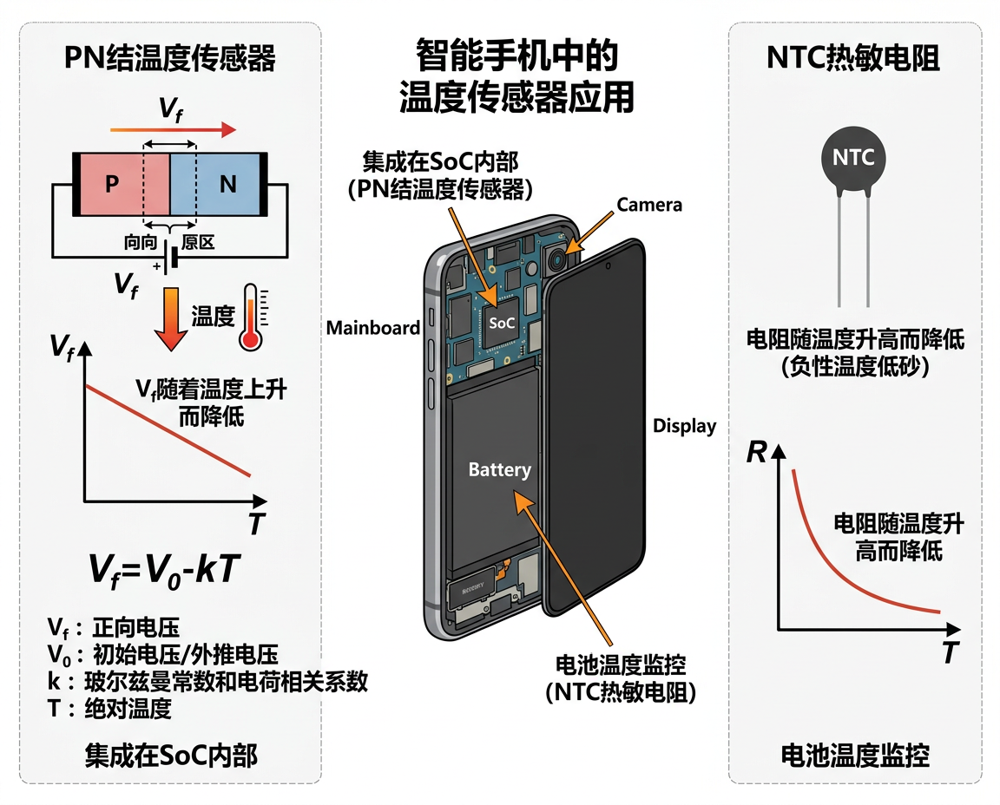

# 温湿度传感器

<figure markdown="span">
  { width="680" }
  <figcaption>PN 结温度传感器与 NTC 热敏电阻工作原理</figcaption>
</figure>

## 温度传感器

### 基本信息

| 属性 | 值 |
|:-----|:---|
| 物理量 | 温度 |
| 量程 | -40°C 至 +85°C |
| 单位 | °C |
| 精度 | ±0.5-±1°C |
| Android 常量 | `Sensor.TYPE_AMBIENT_TEMPERATURE` |

### 工作原理

手机中的温度传感器通常有两种实现:

**1. PN 结温度传感器**

利用 PN 结正向压降随温度变化的特性:

$$V_f = V_0 - k \cdot T$$

其中 $k$ 约为 -2 mV/°C。集成在 SoC 内部,主要用于监控芯片温度。

**2. 热敏电阻 (NTC/PTC)**

| 类型 | 特性 | 用途 |
|:-----|:-----|:-----|
| NTC | 温度升高,电阻减小 | 电池温度监控 |
| PTC | 温度升高,电阻增大 | 过流保护 |

!!! warning "注意"
    手机内部的温度传感器测量的是 **芯片/电池温度**,受 SoC 发热影响严重,不能准确反映环境温度。只有少数机型 (如早期三星 Galaxy S4) 配备了独立的环境温度传感器。

---

## 湿度传感器

### 基本信息

| 属性 | 值 |
|:-----|:---|
| 物理量 | 相对湿度 |
| 量程 | 0-100% RH |
| 单位 | %RH |
| 精度 | ±3-±5% RH |
| Android 常量 | `Sensor.TYPE_RELATIVE_HUMIDITY` |

### 工作原理

**电容式湿度传感器**: 两个电极之间填充吸湿性高分子材料,当环境湿度变化时,材料吸附/释放水分子,介电常数改变,从而改变电容值:

$$C = \varepsilon_r(RH) \cdot \varepsilon_0 \cdot \frac{A}{d}$$

### 搭载情况

湿度传感器在智能手机中 **较为罕见**,仅少数机型搭载:

| 机型 | 年份 | 芯片 |
|:-----|:-----|:-----|
| Samsung Galaxy S4 | 2013 | Sensirion SHTC1 |
| Samsung Galaxy S5 | 2014 | Sensirion SHTC1 |
| Samsung Galaxy Note 4 | 2014 | Sensirion SHTC1 |

此后主流手机基本不再搭载独立温湿度传感器。

---

## 延伸阅读

- [Sensirion SHTC3 温湿度传感器](https://sensirion.com/products/catalog/SHTC3/)
- [Android TYPE_AMBIENT_TEMPERATURE 文档](https://developer.android.com/reference/android/hardware/Sensor#TYPE_AMBIENT_TEMPERATURE)
