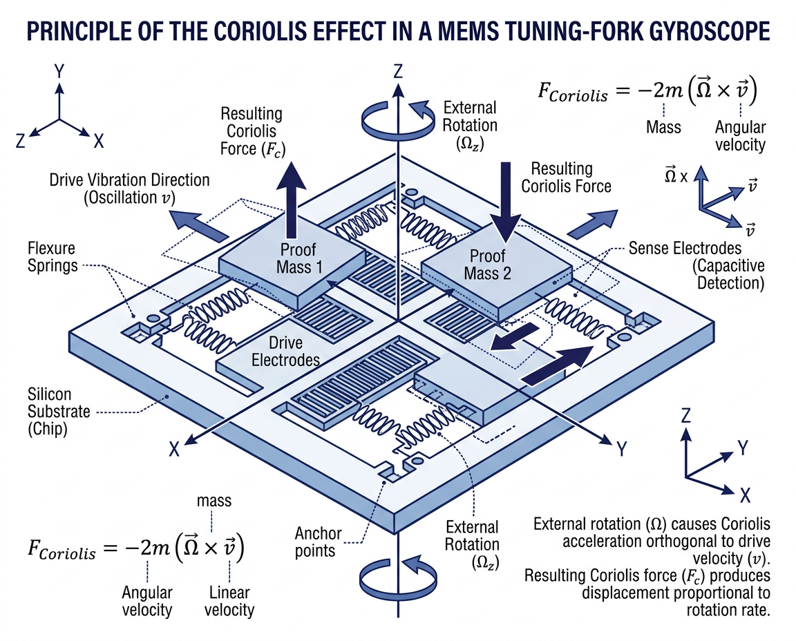

# 陀螺仪 (Gyroscope)

## 基本信息

| 属性 | 值 |
|:-----|:---|
| 物理量 | 角速度 |
| 量程 | 通常 ±125 / ±250 / ±500 / ±1000 / ±2000 °/s |
| 单位 | rad/s (SI) 或 °/s (dps) |
| 自由度 | 3轴 (X, Y, Z) |
| 采样率 | 通常 100-6400 Hz |
| 功耗 | ~500 μA - 1 mA |
| Android 常量 | `Sensor.TYPE_GYROSCOPE` |
| iOS 框架 | `CMGyroData` (Core Motion) |

---

## 工作原理

### 科氏力效应

<figure markdown="span">
  { width="640" }
  <figcaption>MEMS 陀螺仪的科氏力效应原理</figcaption>
</figure>

MEMS 陀螺仪基于 **科氏力 (Coriolis Effect)** 原理:当一个质量块在某方向上振动,同时系统绕另一个轴旋转时,质量块会受到垂直于振动方向和旋转轴的科氏力:

$$\vec{F}_{Coriolis} = -2m(\vec{\Omega} \times \vec{v})$$

其中:

- $m$ — 质量块质量
- $\vec{\Omega}$ — 外部旋转角速度
- $\vec{v}$ — 质量块振动速度

### MEMS 音叉陀螺仪结构

```
              旋转轴 Ω (Z轴)
                 ↻
    ┌─────────────────────────┐
    │                         │
    │    ←振动→   ←振动→      │
    │   ┌─────┐  ┌─────┐     │
    │   │  M₁ │  │  M₂ │     │  ↕ 科氏力感应方向
    │   └──┬──┘  └──┬──┘     │  (Y轴)
    │      │        │        │
    │   弹性梁    弹性梁       │
    │      │        │        │
    │   ┌──┴────────┴──┐     │
    │   │   固定锚点    │     │
    │   └──────────────┘     │
    └─────────────────────────┘
         驱动振动方向 (X轴)
```

**工作过程:**

1. **驱动振动**: 通过静电力驱动两个质量块沿 X 轴反向振动
2. **旋转感应**: 当芯片绕 Z 轴旋转时,科氏力使质量块沿 Y 轴偏转
3. **差分检测**: 两个质量块的科氏力方向相反,差分检测可消除共模干扰
4. **信号解调**: 检测偏转产生的电容变化,与驱动信号同步解调提取角速度

---

## 典型芯片

| 芯片型号 | 厂商 | 类型 | 角速度量程 | 噪声密度 |
|:---------|:-----|:-----|:----------|:---------|
| BMI260 | Bosch | 6轴 IMU | ±125~±2000 °/s | 0.004 °/s/√Hz |
| LSM6DSO | ST | 6轴 IMU | ±125~±2000 °/s | 0.0035 °/s/√Hz |
| ICM-42688-P | TDK | 6轴 IMU | ±15.6~±2000 °/s | 0.0028 °/s/√Hz |
| BMI323 | Bosch | 6轴 IMU | ±125~±2000 °/s | 0.0038 °/s/√Hz |

---

## 关键参数

### 零偏稳定性 (Bias Stability)

陀螺仪在静止时的输出不为精确零,而存在一个缓慢漂移的偏置。零偏稳定性衡量这一漂移的程度:

- **消费级 MEMS**: 1-10 °/h
- **工业级 MEMS**: 0.1-1 °/h
- **光纤/激光陀螺**: < 0.01 °/h

!!! warning "积分漂移问题"
    由于角速度需要 **积分** 才能得到角度,零偏误差会随时间累积:
    
    $$\theta_{error} = bias \times t$$
    
    例如 1 °/h 的偏置,1分钟就会产生 0.017° 的角度误差。这就是为什么纯陀螺仪无法单独用于长时间姿态估计,必须与加速度计、磁力计融合。

### 标度因子非线性

标度因子 (Scale Factor) 是输入角速度与输出数字值之间的比例关系。非线性表示该比例在量程范围内不完全恒定。

典型值: ±0.5% - ±1%

---

## 应用实例

### 1. 电子图像稳定 (EIS)

```python
import math

def eis_compensation(frame_rotation, gyro_data, dt):
    """
    电子防抖: 根据陀螺仪数据计算补偿旋转
    gyro_data: (gx, gy, gz) rad/s
    dt: 采样间隔 (s)
    """
    # 角度增量 = 角速度 × 时间
    d_roll  = gyro_data[0] * dt
    d_pitch = gyro_data[1] * dt
    d_yaw   = gyro_data[2] * dt

    # 低通滤波平滑 (简化版)
    alpha = 0.95
    smoothed_roll  = alpha * frame_rotation[0] + (1 - alpha) * d_roll
    smoothed_pitch = alpha * frame_rotation[1] + (1 - alpha) * d_pitch

    return (smoothed_roll, smoothed_pitch, d_yaw)
```

### 2. 互补滤波器 — 融合加速度计与陀螺仪

```python
import math

class ComplementaryFilter:
    """互补滤波器: 融合加速度计 (低频可信) 和陀螺仪 (高频可信)"""

    def __init__(self, alpha=0.98):
        self.alpha = alpha
        self.pitch = 0.0
        self.roll = 0.0

    def update(self, ax, ay, az, gx, gy, gz, dt):
        # 加速度计估计的倾角
        accel_pitch = math.atan2(ax, math.sqrt(ay**2 + az**2))
        accel_roll  = math.atan2(ay, math.sqrt(ax**2 + az**2))

        # 互补滤波
        self.pitch = self.alpha * (self.pitch + gx * dt) + (1 - self.alpha) * accel_pitch
        self.roll  = self.alpha * (self.roll  + gy * dt) + (1 - self.alpha) * accel_roll

        return self.pitch, self.roll
```

---

## 延伸阅读

- [Bosch BMI260 数据手册](https://www.bosch-sensortec.com/products/motion-sensors/imus/bmi260/)
- [陀螺仪工作原理 — ST 技术文档](https://www.st.com/content/st_com/en/support/learning/stm32-education/mems-sensors.html)
- [Android Sensor.TYPE_GYROSCOPE 文档](https://developer.android.com/reference/android/hardware/Sensor#TYPE_GYROSCOPE)
